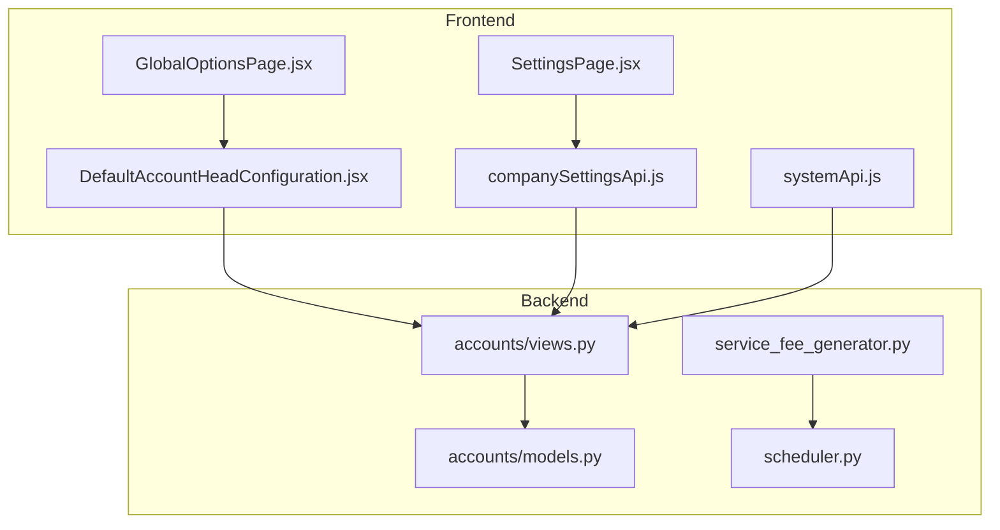
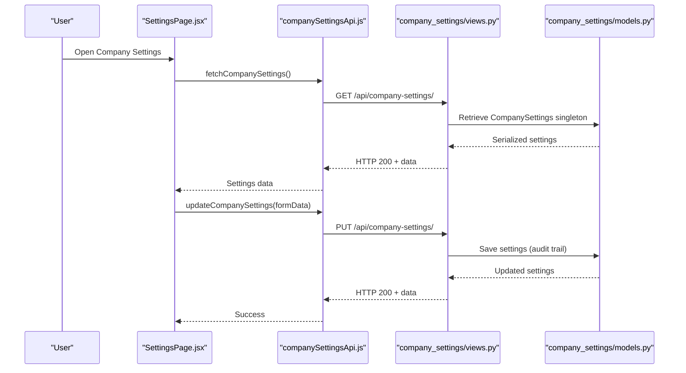
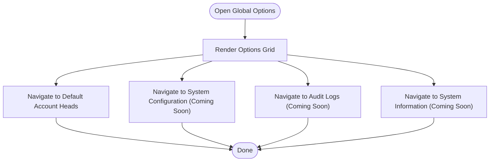
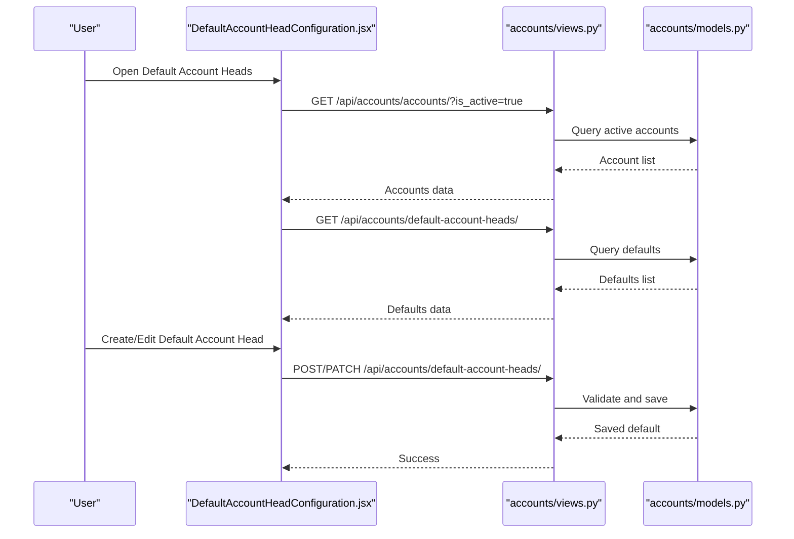
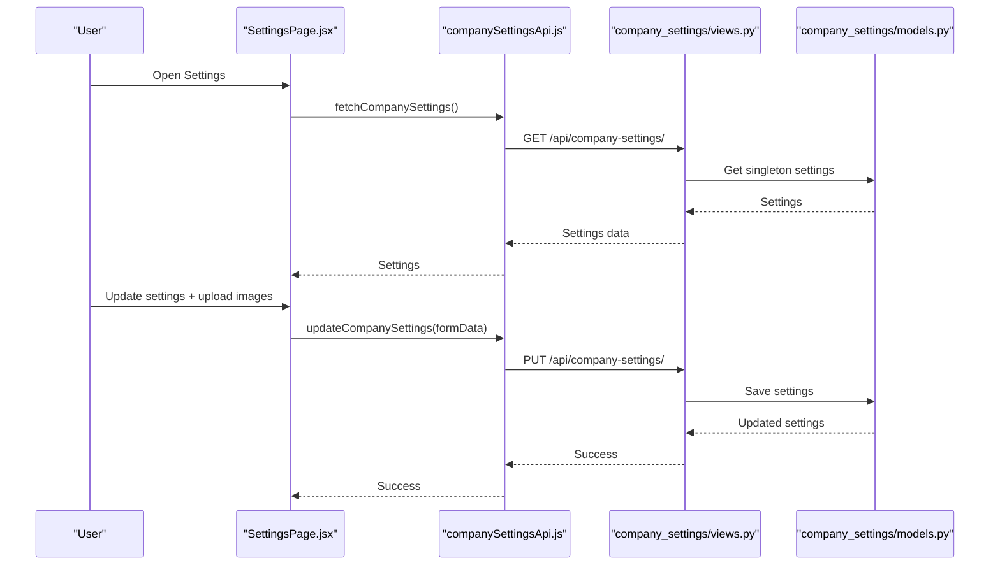
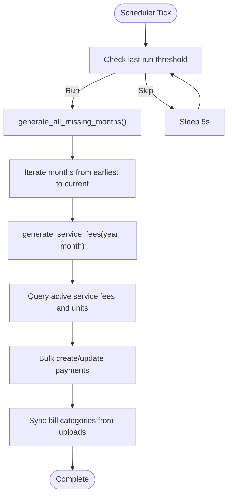
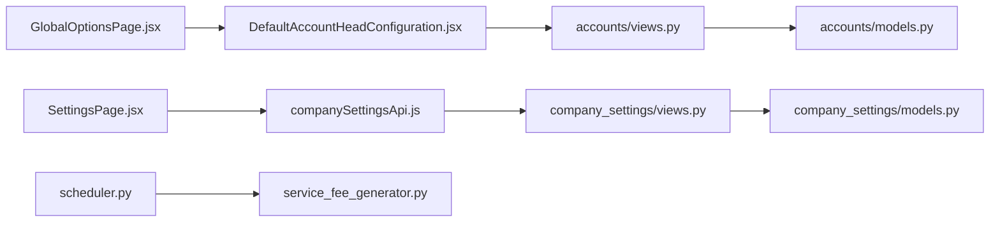

# Global Options & Settings

<cite>
**Referenced Files in This Document**
- [GlobalOptionsPage.jsx](file://frontend/src/Features/GlobalOptions/GlobalOptionsPage.jsx)
- [DefaultAccountHeadConfiguration.jsx](file://frontend/src/Features/GlobalOptions/DefaultAccountHeads/DefaultAccountHeadConfiguration.jsx)
- [systemApi.js](file://frontend/src/api/systemApi.js)
- [companySettingsApi.js](file://frontend/src/api/companySettingsApi.js)
- [SettingsPage.jsx](file://frontend/src/pages/SettingsPage.jsx)
- [scheduler.py](file://backend/service_fee_management/scheduler.py)
- [service_fee_generator.py](file://backend/service_fee_management/utils/service_fee_generator.py)
- [company_settings/models.py](file://backend/company_settings/models.py)
- [company_settings/views.py](file://backend/company_settings/views.py)
- [accounts/models.py](file://backend/accounts/models.py)
- [accounts/views.py](file://backend/accounts/views.py)
</cite>

## Table of Contents
1. [Introduction](#introduction)
2. [Project Structure](#project-structure)
3. [Core Components](#core-components)
4. [Architecture Overview](#architecture-overview)
5. [Detailed Component Analysis](#detailed-component-analysis)
6. [Dependency Analysis](#dependency-analysis)
7. [Performance Considerations](#performance-considerations)
8. [Troubleshooting Guide](#troubleshooting-guide)
9. [Conclusion](#conclusion)

## Introduction
This document provides comprehensive documentation for the global options and system settings modules. It covers:
- Default account heads configuration for standard accounting setups
- Company settings management (information, branding, and system-wide preferences)
- Service fee settings including fee configuration, schedule setup, and generation parameters
- Global options page functionality for system-wide configuration management
- System administration features, configuration validation, and settings persistence
- Practical configuration workflows, system setup procedures, and administrative tasks

## Project Structure
The system comprises:
- Frontend features for global options and settings pages
- Backend Django REST APIs for company settings and default account heads
- Scheduler and generator utilities for automated service fee generation
- Models and serializers defining data structures and validation rules

**Diagram sources**
- [GlobalOptionsPage.jsx](file://frontend/src/Features/GlobalOptions/GlobalOptionsPage.jsx#L1-L184)
- [DefaultAccountHeadConfiguration.jsx](file://frontend/src/Features/GlobalOptions/DefaultAccountHeads/DefaultAccountHeadConfiguration.jsx#L1-L829)
- [SettingsPage.jsx](file://frontend/src/pages/SettingsPage.jsx#L1-L549)
- [companySettingsApi.js](file://frontend/src/api/companySettingsApi.js#L1-L114)
- [systemApi.js](file://frontend/src/api/systemApi.js#L1-L29)
- [company_settings/views.py](file://backend/company_settings/views.py#L1-L278)
- [accounts/models.py](file://backend/accounts/models.py#L333-L410)
- [accounts/views.py](file://backend/accounts/views.py#L524-L718)
- [service_fee_generator.py](file://backend/service_fee_management/utils/service_fee_generator.py#L1-L818)
- [scheduler.py](file://backend/service_fee_management/scheduler.py#L1-L78)

**Section sources**
- [GlobalOptionsPage.jsx](file://frontend/src/Features/GlobalOptions/GlobalOptionsPage.jsx#L1-L184)
- [DefaultAccountHeadConfiguration.jsx](file://frontend/src/Features/GlobalOptions/DefaultAccountHeads/DefaultAccountHeadConfiguration.jsx#L1-L829)
- [SettingsPage.jsx](file://frontend/src/pages/SettingsPage.jsx#L1-L549)
- [companySettingsApi.js](file://frontend/src/api/companySettingsApi.js#L1-L114)
- [systemApi.js](file://frontend/src/api/systemApi.js#L1-L29)
- [company_settings/models.py](file://backend/company_settings/models.py#L21-L99)
- [company_settings/views.py](file://backend/company_settings/views.py#L1-L278)
- [accounts/models.py](file://backend/accounts/models.py#L333-L410)
- [accounts/views.py](file://backend/accounts/views.py#L524-L718)
- [service_fee_generator.py](file://backend/service_fee_management/utils/service_fee_generator.py#L1-L818)
- [scheduler.py](file://backend/service_fee_management/scheduler.py#L1-L78)

## Core Components
- Global Options Page: Central hub for accessing system-wide configuration modules.
- Default Account Heads: Configure default account mappings for transaction types with optional default entry types.
- Company Settings: Manage company information and branding assets (logo and login images).
- Service Fee Settings: Define fee amounts, cycles, due dates, payment methods, reminders, and late penalties.
- Scheduler and Generator: Automated monthly generation of service fees with robust validation and batching.

**Section sources**
- [GlobalOptionsPage.jsx](file://frontend/src/Features/GlobalOptions/GlobalOptionsPage.jsx#L29-L63)
- [DefaultAccountHeadConfiguration.jsx](file://frontend/src/Features/GlobalOptions/DefaultAccountHeads/DefaultAccountHeadConfiguration.jsx#L10-L80)
- [companySettingsApi.js](file://frontend/src/api/companySettingsApi.js#L1-L114)
- [company_settings/models.py](file://backend/company_settings/models.py#L21-L99)
- [accounts/models.py](file://backend/accounts/models.py#L333-L410)
- [service_fee_generator.py](file://backend/service_fee_management/utils/service_fee_generator.py#L15-L70)

## Architecture Overview
The system integrates frontend pages with backend APIs and utilities:
- Frontend pages call API modules to fetch and persist settings.
- Backend views enforce permissions and serialize/deserialize data.
- Models define validation rules and relationships.
- Scheduler periodically triggers generation utilities to maintain up-to-date billing records.

**Diagram sources**
- [SettingsPage.jsx](file://frontend/src/pages/SettingsPage.jsx#L196-L294)
- [companySettingsApi.js](file://frontend/src/api/companySettingsApi.js#L8-L43)
- [company_settings/views.py](file://backend/company_settings/views.py#L24-L72)
- [company_settings/models.py](file://backend/company_settings/models.py#L59-L71)

## Detailed Component Analysis

### Global Options Page
- Purpose: Provide quick access to system-wide configuration modules.
- Features:
  - Navigation to Default Account Heads configuration
  - Placeholder entries for System Configuration, Audit Logs, and System Information
  - Administrative guidance and audit trail awareness

**Diagram sources**
- [GlobalOptionsPage.jsx](file://frontend/src/Features/GlobalOptions/GlobalOptionsPage.jsx#L29-L63)

**Section sources**
- [GlobalOptionsPage.jsx](file://frontend/src/Features/GlobalOptions/GlobalOptionsPage.jsx#L1-L184)

### Default Account Heads Configuration
- Purpose: Configure default account mappings for transaction types with optional default entry types.
- Key capabilities:
  - Load active chart of accounts and existing default mappings
  - Create, update, and filter default account heads
  - Validation for unique transaction types and active accounts
  - Pagination and search across mapped defaults

**Diagram sources**
- [DefaultAccountHeadConfiguration.jsx](file://frontend/src/Features/GlobalOptions/DefaultAccountHeads/DefaultAccountHeadConfiguration.jsx#L38-L76)
- [accounts/views.py](file://backend/accounts/views.py#L524-L718)
- [accounts/models.py](file://backend/accounts/models.py#L333-L410)

**Section sources**
- [DefaultAccountHeadConfiguration.jsx](file://frontend/src/Features/GlobalOptions/DefaultAccountHeads/DefaultAccountHeadConfiguration.jsx#L1-L829)
- [accounts/views.py](file://backend/accounts/views.py#L524-L718)
- [accounts/models.py](file://backend/accounts/models.py#L333-L410)

### Company Settings Management
- Purpose: Manage company information and branding assets.
- Capabilities:
  - Fetch and update company information (name, phone, email, address)
  - Upload and manage logo and login page images
  - Set active images and delete images with audit trail
  - Public endpoint for login page access

**Diagram sources**
- [SettingsPage.jsx](file://frontend/src/pages/SettingsPage.jsx#L196-L294)
- [companySettingsApi.js](file://frontend/src/api/companySettingsApi.js#L8-L43)
- [company_settings/views.py](file://backend/company_settings/views.py#L24-L72)
- [company_settings/models.py](file://backend/company_settings/models.py#L59-L71)

**Section sources**
- [SettingsPage.jsx](file://frontend/src/pages/SettingsPage.jsx#L1-L549)
- [companySettingsApi.js](file://frontend/src/api/companySettingsApi.js#L1-L114)
- [company_settings/models.py](file://backend/company_settings/models.py#L21-L99)
- [company_settings/views.py](file://backend/company_settings/views.py#L1-L278)

### Service Fee Settings and Generation
- Purpose: Define fee configuration, schedule setup, and automated generation parameters.
- Key models and features:
  - ServiceFee: Amount, frequency, billing cycle, due day, payment methods, reminders, late penalties
  - ServiceFeeUnit: Through model for unit assignments with soft delete
  - ServiceFeeMFS/Bank: Payment method details with validation
  - LatePenaltyTier: Configurable tiers for late payment penalties
  - Scheduler and Generator: Automatic monthly generation with batching and audit-safe operations

**Diagram sources**
- [scheduler.py](file://backend/service_fee_management/scheduler.py#L10-L65)
- [service_fee_generator.py](file://backend/service_fee_management/utils/service_fee_generator.py#L710-L818)

**Section sources**
- [service_fee_generator.py](file://backend/service_fee_management/utils/service_fee_generator.py#L15-L70)
- [service_fee_generator.py](file://backend/service_fee_management/utils/service_fee_generator.py#L710-L818)
- [scheduler.py](file://backend/service_fee_management/scheduler.py#L1-L78)

### System Administration Features
- Permissions and Auditing:
  - Company settings require VIEW_COMPANY_SETTINGS permission
  - Audit trail created on updates and image operations
- Frontend safeguards:
  - Permission checks before rendering settings page
  - Controlled image upload sizes and types
  - Clear messaging for errors and successes

**Section sources**
- [company_settings/views.py](file://backend/company_settings/views.py#L18-L72)
- [SettingsPage.jsx](file://frontend/src/pages/SettingsPage.jsx#L67-L91)
- [companySettingsApi.js](file://frontend/src/api/companySettingsApi.js#L1-L114)

### Configuration Validation and Persistence
- Backend validation:
  - Unique transaction types for default account heads
  - Active account requirement for default mappings
  - Image upload validation and single-image policy
- Frontend validation:
  - Form-level validation and controlled submission
  - Image preview and pre-upload checks

**Section sources**
- [accounts/views.py](file://backend/accounts/views.py#L549-L599)
- [accounts/models.py](file://backend/accounts/models.py#L405-L410)
- [company_settings/views.py](file://backend/company_settings/views.py#L115-L160)
- [SettingsPage.jsx](file://frontend/src/pages/SettingsPage.jsx#L122-L193)

### Examples of Configuration Workflows
- Default Account Heads Setup:
  - Load active accounts
  - Select default account and optional default entry type
  - Submit to create mapping; handle duplicate transaction type errors
- Company Branding Update:
  - Update company info
  - Upload logo/login image (single image policy)
  - Set active image and confirm persistence
- Service Fee Generation:
  - Define fee settings and payment methods
  - Rely on scheduler to generate missing months
  - Monitor generation results and adjust schedules as needed

**Section sources**
- [DefaultAccountHeadConfiguration.jsx](file://frontend/src/Features/GlobalOptions/DefaultAccountHeads/DefaultAccountHeadConfiguration.jsx#L148-L255)
- [SettingsPage.jsx](file://frontend/src/pages/SettingsPage.jsx#L196-L294)
- [scheduler.py](file://backend/service_fee_management/scheduler.py#L10-L65)

## Dependency Analysis
- Frontend depends on API modules for data access and persistence.
- Backend views depend on models for validation and persistence.
- Service fee generation utilities depend on Django ORM and transaction safety.

**Diagram sources**
- [GlobalOptionsPage.jsx](file://frontend/src/Features/GlobalOptions/GlobalOptionsPage.jsx#L1-L184)
- [DefaultAccountHeadConfiguration.jsx](file://frontend/src/Features/GlobalOptions/DefaultAccountHeads/DefaultAccountHeadConfiguration.jsx#L1-L829)
- [accounts/views.py](file://backend/accounts/views.py#L524-L718)
- [accounts/models.py](file://backend/accounts/models.py#L333-L410)
- [SettingsPage.jsx](file://frontend/src/pages/SettingsPage.jsx#L1-L549)
- [companySettingsApi.js](file://frontend/src/api/companySettingsApi.js#L1-L114)
- [company_settings/views.py](file://backend/company_settings/views.py#L1-L278)
- [company_settings/models.py](file://backend/company_settings/models.py#L21-L99)
- [scheduler.py](file://backend/service_fee_management/scheduler.py#L1-L78)
- [service_fee_generator.py](file://backend/service_fee_management/utils/service_fee_generator.py#L1-L818)

**Section sources**
- [accounts/views.py](file://backend/accounts/views.py#L524-L718)
- [company_settings/views.py](file://backend/company_settings/views.py#L1-L278)
- [service_fee_generator.py](file://backend/service_fee_management/utils/service_fee_generator.py#L1-L818)

## Performance Considerations
- Bulk operations: Service fee generation uses bulk create/update to minimize database overhead.
- Atomic transactions: Generation wraps operations in atomic blocks to ensure consistency.
- Pagination: Ledger and listing endpoints use pagination to manage large datasets efficiently.
- Scheduler cadence: Periodic checks every few seconds balance automation with resource usage.

[No sources needed since this section provides general guidance]

## Troubleshooting Guide
- Duplicate Transaction Type:
  - Symptom: Error indicating a default account head already exists for the transaction type.
  - Resolution: Choose a different transaction type or update the existing mapping.
- Inactive Account Selected:
  - Symptom: Validation error when selecting an inactive account as default.
  - Resolution: Ensure the target account is active before setting as default.
- Image Upload Issues:
  - Symptom: Errors for unsupported file types or size limits.
  - Resolution: Use allowed formats (JPG, JPEG, PNG, SVG, WEBP) and keep under 10MB.
- Permission Denied:
  - Symptom: Access to settings blocked.
  - Resolution: Verify VIEW_COMPANY_SETTINGS permission and role assignments.
- Scheduler Failures:
  - Symptom: Missing service fees despite scheduled runs.
  - Resolution: Review logs for exceptions and ensure scheduler thread is started.

**Section sources**
- [DefaultAccountHeadConfiguration.jsx](file://frontend/src/Features/GlobalOptions/DefaultAccountHeads/DefaultAccountHeadConfiguration.jsx#L200-L251)
- [accounts/views.py](file://backend/accounts/views.py#L589-L599)
- [SettingsPage.jsx](file://frontend/src/pages/SettingsPage.jsx#L122-L193)
- [company_settings/views.py](file://backend/company_settings/views.py#L115-L160)
- [scheduler.py](file://backend/service_fee_management/scheduler.py#L60-L65)

## Conclusion
The global options and settings modules provide a robust foundation for system-wide configuration:
- Default account heads streamline accounting setup with flexible mappings.
- Company settings centralize branding and information management with strong validation and auditing.
- Service fee settings integrate seamlessly with automated generation utilities for reliable billing workflows.
Administrators can confidently manage configurations, validate inputs, and rely on persistent, audited changes across the system.