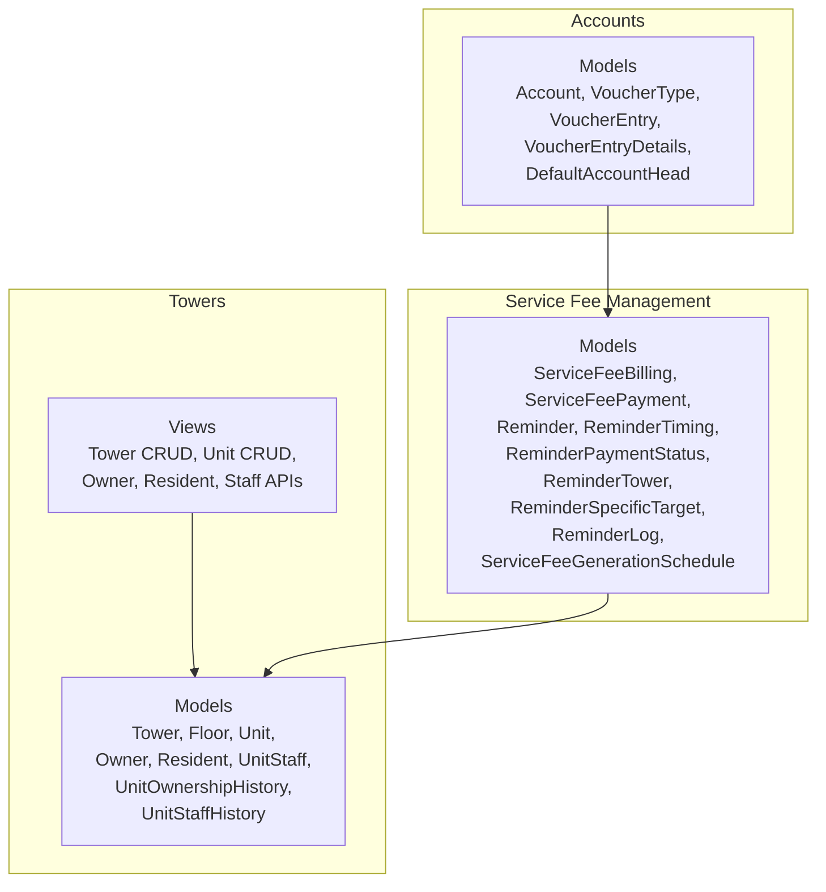
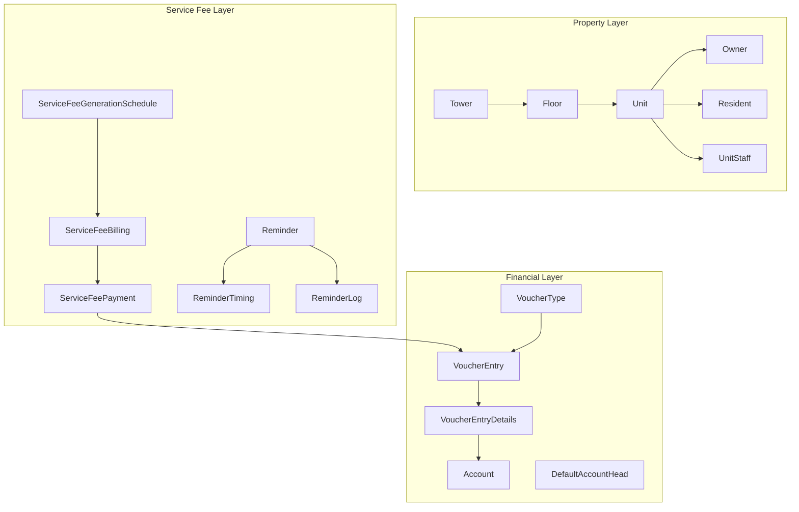
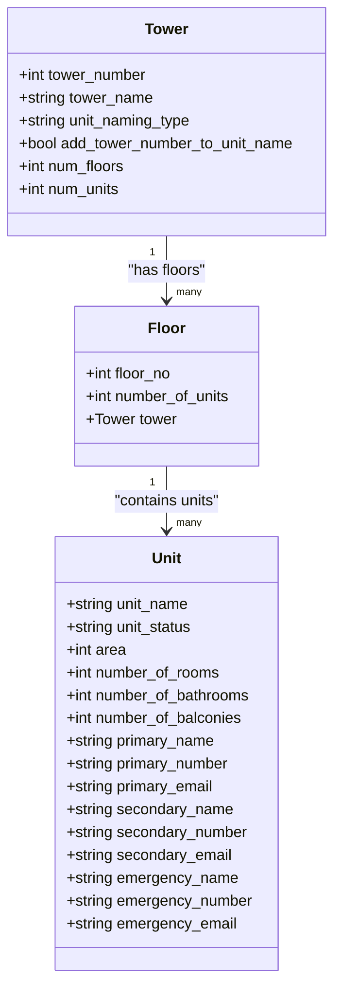
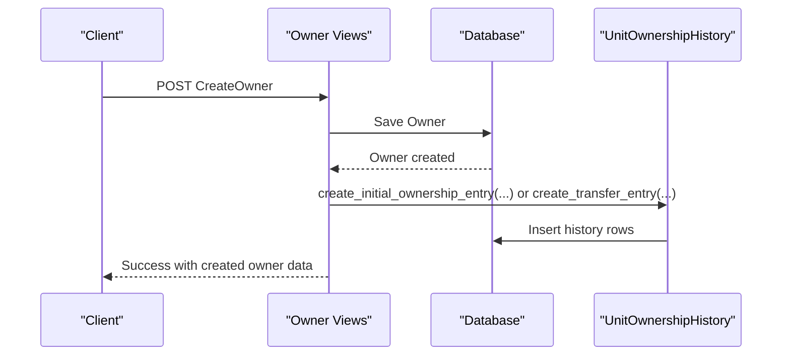
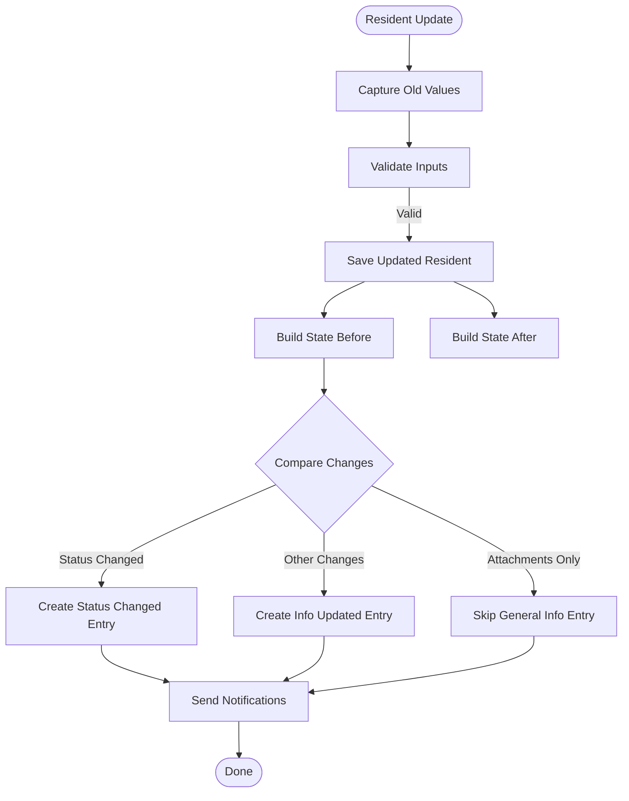
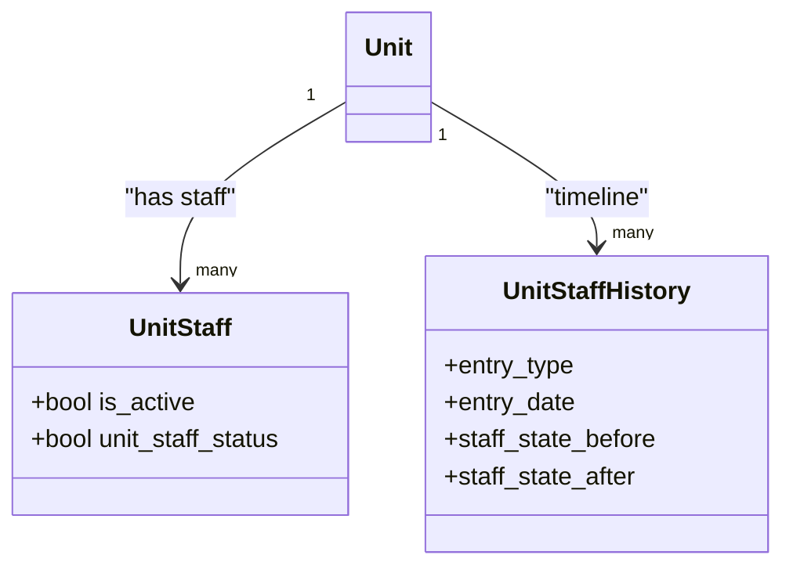
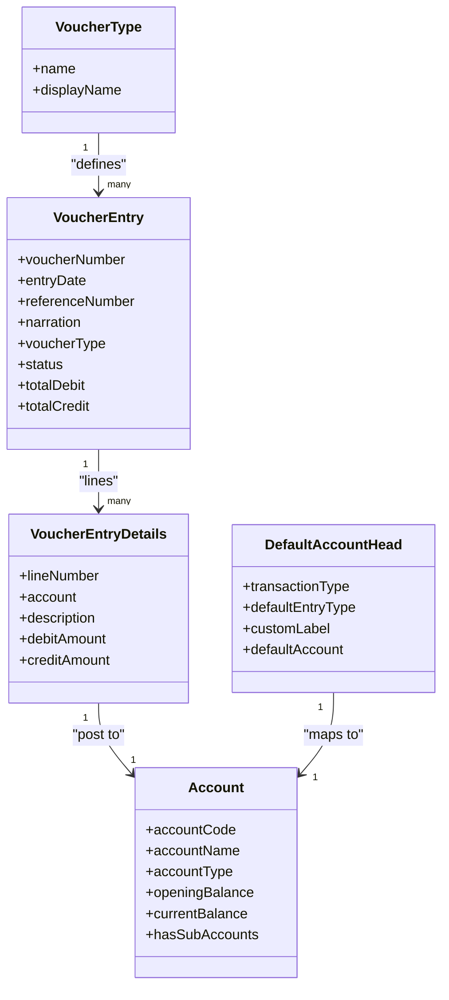
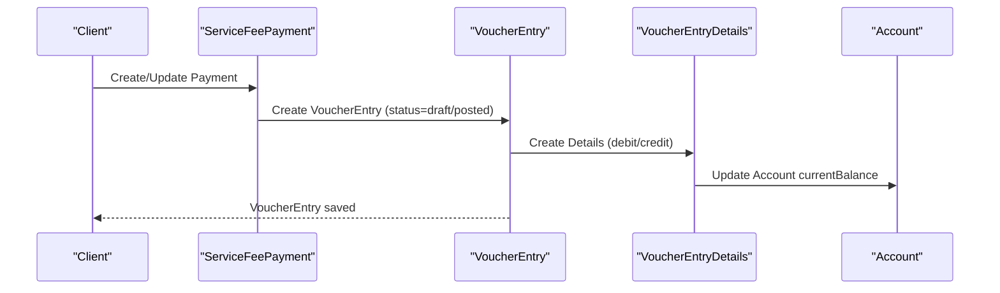
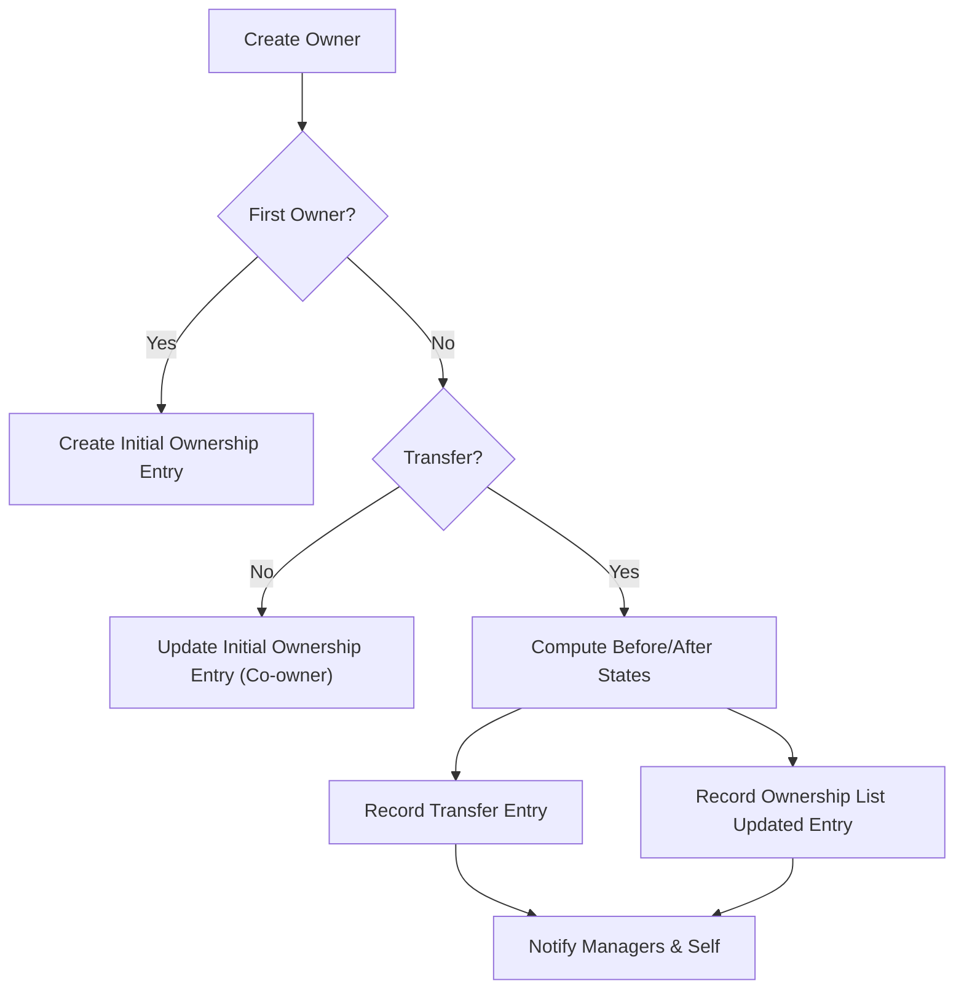
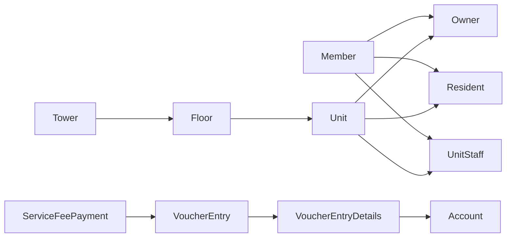

# Property Management

<cite>
**Referenced Files in This Document**
- [models.py](file://backend/towers/models.py)
- [tower_views.py](file://backend/towers/views/tower_views.py)
- [owner_views.py](file://backend/towers/views/owner_views.py)
- [resident_views.py](file://backend/towers/views/resident_views.py)
- [models.py](file://backend/accounts/models.py)
- [models.py](file://backend/service_fee_management/models.py)
</cite>

## Table of Contents
1. [Introduction](#introduction)
2. [Project Structure](#project-structure)
3. [Core Components](#core-components)
4. [Architecture Overview](#architecture-overview)
5. [Detailed Component Analysis](#detailed-component-analysis)
6. [Dependency Analysis](#dependency-analysis)
7. [Performance Considerations](#performance-considerations)
8. [Troubleshooting Guide](#troubleshooting-guide)
9. [Conclusion](#conclusion)
10. [Appendices](#appendices)

## Introduction
This document explains the property management and accounting feature modules in the Estate Link system. It covers:
- Tower and unit management: creation, unit assignment, ownership tracking, and unit details management
- Owner management: company and individual owners, including transfer workflows
- Resident management: registration, verification, and profile management
- Unit staff management: building staff assignments and responsibilities
- Financial accounting: chart of accounts, ledger management, trial balance reporting, and voucher entry systems
- Financial entry system: journal entries, payment receipts, contra entries, and supporting workflows
- Examples of property workflows, financial reporting patterns, and accounting integrations

## Project Structure
The property management domain spans three Django applications:
- Towers: property assets, ownership, residents, staff, and unit history
- Accounts: chart of accounts, voucher types, and ledger entries
- Service Fee Management: payment lifecycle, reminders, and billing normalization

**Diagram sources**
- [models.py](file://backend/towers/models.py#L1-L1332)
- [tower_views.py](file://backend/towers/views/tower_views.py#L1-L396)
- [models.py](file://backend/accounts/models.py#L1-L410)
- [models.py](file://backend/service_fee_management/models.py#L1-L1088)

**Section sources**
- [models.py](file://backend/towers/models.py#L1-L1332)
- [models.py](file://backend/accounts/models.py#L1-L410)
- [models.py](file://backend/service_fee_management/models.py#L1-L1088)

## Core Components
- Tower and Unit
  - Tower defines building metadata and unit layout parameters
  - Floor and Unit define physical structure and unit attributes
  - Unit details include area, rooms, bathrooms, balconies, and primary/secondary/emergency contacts
- Ownership
  - Owner links a Member to a Unit with ownership percentage and purchase date
  - UnitOwnershipHistory tracks ownership events: initial ownership, transfers, and attachment changes
- Residents
  - Resident links a Member to a Unit with residency/tenancy status, rent, advance, and notice period
  - UnitResidentHistory tracks assignment, status changes, and updates
- Unit Staff
  - UnitStaff links a Member to a Unit with live-in/part-time status and active flag
  - UnitStaffHistory tracks assignments, removals, and status changes
- Accounting
  - Account: chart of accounts with type, balances, and hierarchy
  - VoucherType: receipt, payment, journal, contra
  - VoucherEntry/VoucherEntryDetails: ledger entries with debits/credits
  - DefaultAccountHead: default mapping for transaction types
- Service Fee Management
  - ServiceFeeBilling and ServiceFeePayment: normalized billing and payment records
  - Reminder and related tables: scheduling, targeting, and logs
  - ServiceFeeGenerationSchedule: tower-wise generation configuration

**Section sources**
- [models.py](file://backend/towers/models.py#L1-L1332)
- [models.py](file://backend/accounts/models.py#L1-L410)
- [models.py](file://backend/service_fee_management/models.py#L1-L1088)

## Architecture Overview
The system integrates property management with financial workflows:
- Towers module manages real estate assets and occupancy
- Service Fee Management normalizes billing and payments and integrates with reminders
- Accounts module provides the financial backbone for posting and reporting
- Voucher entries support journal, receipt, payment, and contra workflows

**Diagram sources**
- [models.py](file://backend/towers/models.py#L1-L1332)
- [models.py](file://backend/accounts/models.py#L1-L410)
- [models.py](file://backend/service_fee_management/models.py#L1-L1088)

## Detailed Component Analysis

### Tower and Unit Management
- Creation and listing
  - Tower creation validates and persists building metadata and unit configuration
  - Tower listing optimizes queries to fetch floors and units efficiently
- Unit management
  - Unit retrieval includes related documents and contact details
  - Unit update enforces constraints: no active updater, no existing owner/resident/staff
- Unit details
  - Unit model captures area, rooms, bathrooms, balconies, and primary/secondary/emergency contacts
  - UnitDocs supports document storage per unit

**Diagram sources**
- [models.py](file://backend/towers/models.py#L7-L122)

**Section sources**
- [tower_views.py](file://backend/towers/views/tower_views.py#L18-L168)
- [models.py](file://backend/towers/models.py#L60-L148)

### Owner Management
- Registration and search
  - Search aggregates owners, residents, unit staff, company members, and organization members
- Creation
  - Supports first owner, co-owner addition, and ownership transfer
  - Creates initial ownership entry or updates existing initial entry
  - For transfers, calculates before/after ownership states and records transfer and ownership list updates
- Bulk creation
  - Adds multiple owners in one request and records initial ownership history
- Transfer logic
  - Calculates new shares, handles source owner deletion if fully transferred, and preserves metadata for history entries

**Diagram sources**
- [owner_views.py](file://backend/towers/views/owner_views.py#L141-L576)
- [models.py](file://backend/towers/models.py#L257-L587)

**Section sources**
- [owner_views.py](file://backend/towers/views/owner_views.py#L28-L139)
- [owner_views.py](file://backend/towers/views/owner_views.py#L141-L576)
- [owner_views.py](file://backend/towers/views/owner_views.py#L579-L748)
- [models.py](file://backend/towers/models.py#L257-L698)

### Resident Management
- Registration
  - Creates Resident and records resident assignment history with attachments
  - Sends notifications for manager and self
- Verification and profile management
  - Updates resident info (rent, advance, notice period, member details)
  - Records status changes (resident vs tenant) and general info updates
- Removal/deactivation
  - Inactivates residents and records removal history
  - Bulk deletion with aggregated notifications and unit availability update

**Diagram sources**
- [resident_views.py](file://backend/towers/views/resident_views.py#L238-L412)
- [models.py](file://backend/towers/models.py#L149-L192)

**Section sources**
- [resident_views.py](file://backend/towers/views/resident_views.py#L38-L102)
- [resident_views.py](file://backend/towers/views/resident_views.py#L238-L412)
- [resident_views.py](file://backend/towers/views/resident_views.py#L415-L512)
- [resident_views.py](file://backend/towers/views/resident_views.py#L516-L686)

### Unit Staff Management
- Assignment and status tracking
  - Links Member to Unit with live-in/part-time status and active flag
  - Records staff assignment, removal, and status change events in UnitStaffHistory
- Contact and role visibility
  - Staff appear alongside owners and residents for unit communication

**Diagram sources**
- [models.py](file://backend/towers/models.py#L240-L254)
- [models.py](file://backend/towers/models.py#L701-L800)

**Section sources**
- [models.py](file://backend/towers/models.py#L240-L254)
- [models.py](file://backend/towers/models.py#L701-L800)

### Financial Accounting Modules
- Chart of Accounts
  - Account model supports asset/liability/equity/revenue/expense types, hierarchy, and balances
  - Validates opening debit/credit exclusivity and recalculates balances from posted entries
- Voucher Entry System
  - VoucherType defines receipt, payment, journal, and contra
  - VoucherEntry header with status, totals, and audit fields
  - VoucherEntryDetails line items with debit/credit validation
  - DefaultAccountHead maps transaction types to default accounts
- Ledger Management
  - Posting posts entries and updates account balances
  - Totals computed from line items and validated for equality
- Trial Balance Reporting
  - Derived from Account current balances and account hierarchy

**Diagram sources**
- [models.py](file://backend/accounts/models.py#L9-L54)
- [models.py](file://backend/accounts/models.py#L159-L199)
- [models.py](file://backend/accounts/models.py#L201-L284)
- [models.py](file://backend/accounts/models.py#L286-L331)
- [models.py](file://backend/accounts/models.py#L333-L410)

**Section sources**
- [models.py](file://backend/accounts/models.py#L9-L54)
- [models.py](file://backend/accounts/models.py#L159-L284)
- [models.py](file://backend/accounts/models.py#L286-L331)
- [models.py](file://backend/accounts/models.py#L333-L410)

### Financial Entry Workflows
- Journal Vouchers
  - Debit and credit entries recorded per line; totals validated on save
- Payment Vouchers
  - Linked to ServiceFeePayment and ServiceFeeBilling for normalized payment tracking
- Receipt Vouchers
  - Used for cash/income postings; mapped via DefaultAccountHead
- Contra Entries
  - Transfer between cash/bank accounts; supported by VoucherType and posting logic

**Diagram sources**
- [models.py](file://backend/service_fee_management/models.py#L190-L323)
- [models.py](file://backend/accounts/models.py#L201-L284)
- [models.py](file://backend/accounts/models.py#L286-L331)
- [models.py](file://backend/accounts/models.py#L127-L156)

**Section sources**
- [models.py](file://backend/service_fee_management/models.py#L190-L323)
- [models.py](file://backend/accounts/models.py#L201-L284)
- [models.py](file://backend/accounts/models.py#L286-L331)
- [models.py](file://backend/accounts/models.py#L127-L156)

### Property Workflows and Examples
- Ownership transfer workflow
  - Create new owner with explicit transfer source; recalculate shares; delete source owner if fully transferred; record transfer and ownership list updates
- Resident onboarding
  - Create resident, record assignment history, notify managers and self
- Service fee payment lifecycle
  - Generate billing, accept payments, update totals, apply penalties/waivers, and reconcile with ledger

**Diagram sources**
- [owner_views.py](file://backend/towers/views/owner_views.py#L141-L576)
- [models.py](file://backend/towers/models.py#L257-L473)

**Section sources**
- [owner_views.py](file://backend/towers/views/owner_views.py#L141-L576)
- [resident_views.py](file://backend/towers/views/resident_views.py#L38-L102)

## Dependency Analysis
- Towers depends on Member for ownership, residency, and staff assignments
- Service Fee Management depends on Towers (Unit/Tower) and Accounts (ledger posting)
- Accounts depends on Member for audit fields and on VoucherEntryDetails for posting
- Ownership and resident histories depend on Unit and Member for state snapshots

**Diagram sources**
- [models.py](file://backend/towers/models.py#L1-L1332)
- [models.py](file://backend/service_fee_management/models.py#L1-L1088)
- [models.py](file://backend/accounts/models.py#L1-L410)

**Section sources**
- [models.py](file://backend/towers/models.py#L1-L1332)
- [models.py](file://backend/service_fee_management/models.py#L1-L1088)
- [models.py](file://backend/accounts/models.py#L1-L410)

## Performance Considerations
- Tower listing uses select_related and prefetch_related to minimize N+1 queries
- Ownership transfer calculations use precomputed states and avoid relying on concurrent DB updates
- Voucher totals are recalculated from line items and validated on save
- Reminder and billing normalization reduce duplication and improve scalability

[No sources needed since this section provides general guidance]

## Troubleshooting Guide
- Ownership creation failures
  - Unique constraint violations for existing owner/member/unit combinations
  - Deadlocks during concurrent owner creation; retried with exponential backoff
- Resident updates
  - Validation errors for duplicate emails or invalid fields; serializer errors returned
  - Attachment-only changes do not trigger general info entries; individual attachment entries are used instead
- Voucher posting
  - Debit/credit equality enforced for posted entries; validation errors raised if mismatch
  - Opening balance changes trigger balance recalculation across accounts

**Section sources**
- [owner_views.py](file://backend/towers/views/owner_views.py#L561-L576)
- [resident_views.py](file://backend/towers/views/resident_views.py#L262-L263)
- [accounts/models.py](file://backend/accounts/models.py#L267-L272)
- [accounts/models.py](file://backend/accounts/models.py#L127-L128)

## Conclusion
The property management and accounting modules provide a robust foundation for managing real estate assets, occupancy, and financial transactions. Ownership and resident workflows are audited and integrated with reminders and payments. The accounting layer supports ledger posting, balance calculation, and voucher entry types essential for property financial management.

[No sources needed since this section summarizes without analyzing specific files]

## Appendices
- Example reporting patterns
  - Trial balance derived from Account current balances
  - Unit-level ledger reports via VoucherEntryDetails filtered by unit
  - Ownership and resident timelines via dedicated history tables

[No sources needed since this section provides general guidance]