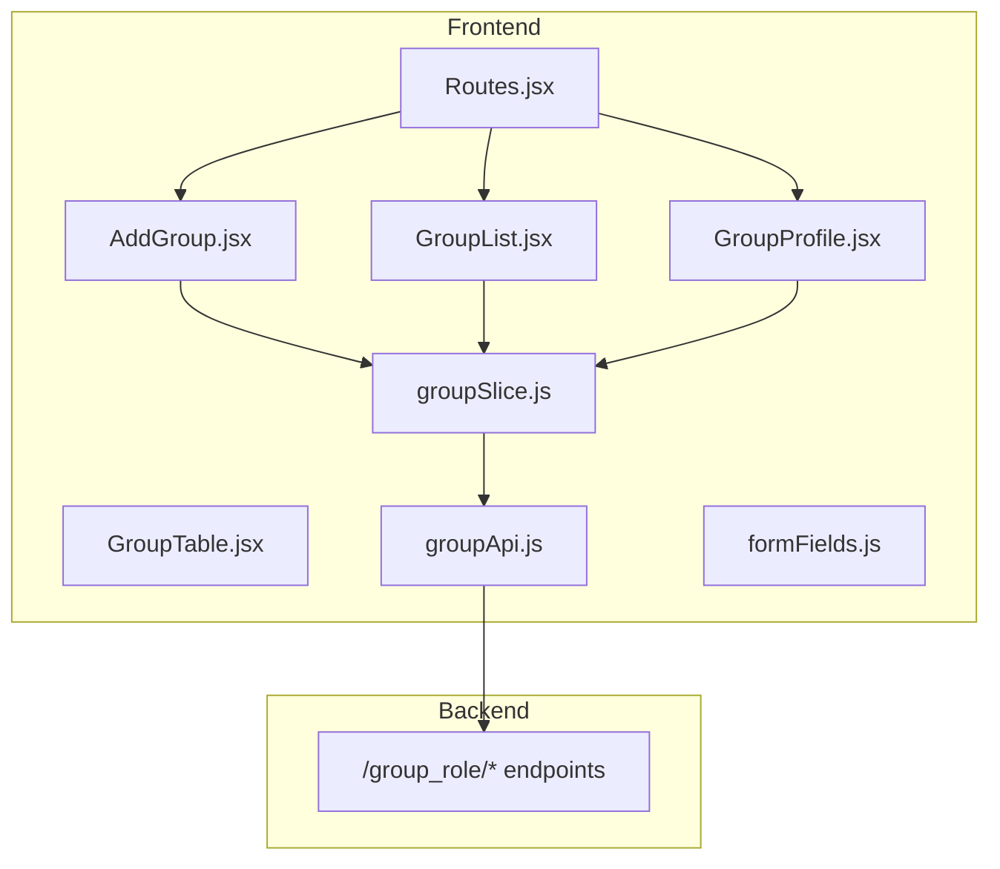
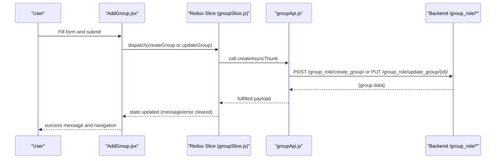
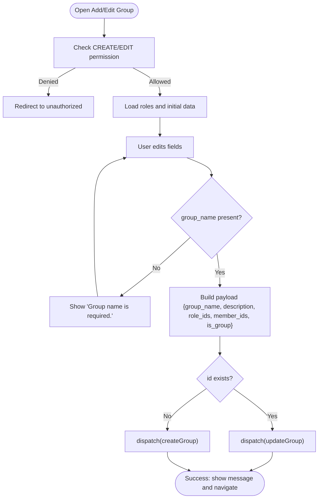
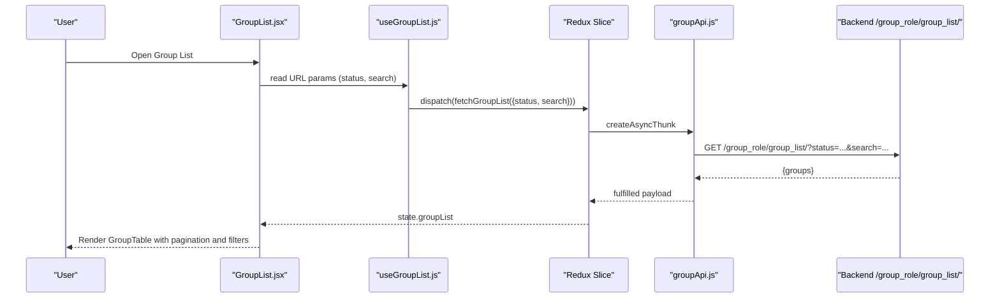
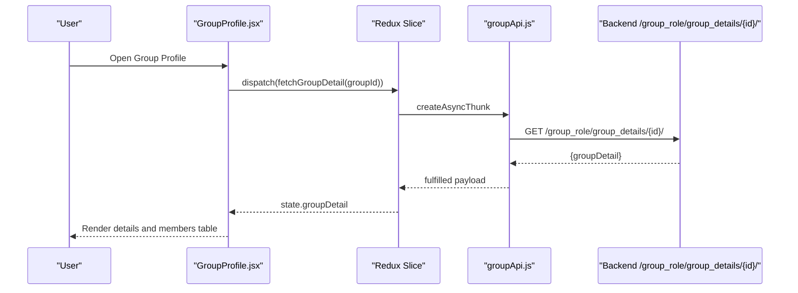
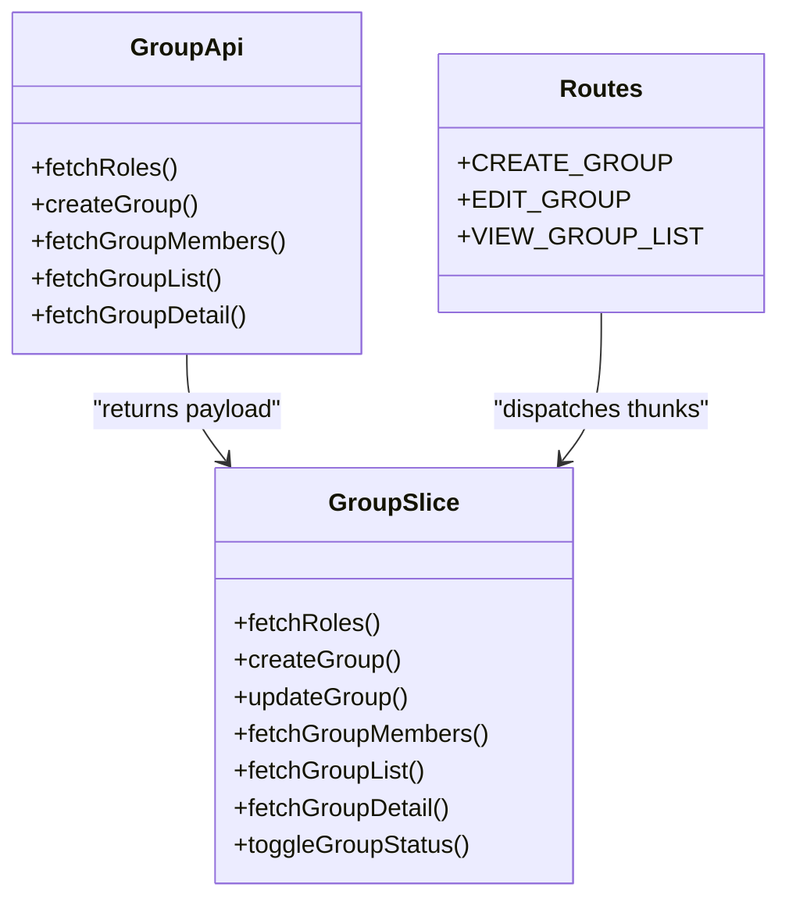
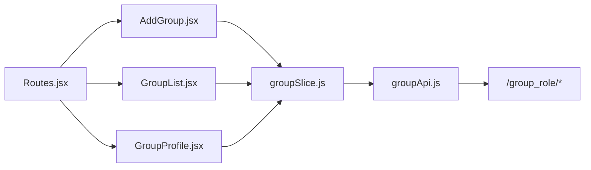

# Group Management

<cite>
**Referenced Files in This Document**
- [groupApi.js](file://frontend/src/api/groupsApi/groupApi.js)
- [AddGroup.jsx](file://frontend/src/Features/Groups/AddGroup/AddGroup.jsx)
- [GroupList.jsx](file://frontend/src/Features/Groups/GroupList/GroupList.jsx)
- [GroupTable.jsx](file://frontend/src/Features/Groups/GroupList/GroupTable.jsx)
- [GroupProfile.jsx](file://frontend/src/Features/Groups/GroupProfile/GroupProfile.jsx)
- [groupSlice.js](file://frontend/src/redux/slices/groups/groupSlice.js)
- [useGroupList.js](file://frontend/src/Features/Groups/useGroupList.js)
- [formFields.js](file://frontend/src/utils/formFields.js)
- [Routes.jsx](file://frontend/src/Routes/Routes.jsx)
</cite>

## Table of Contents
1. [Introduction](#introduction)
2. [Project Structure](#project-structure)
3. [Core Components](#core-components)
4. [Architecture Overview](#architecture-overview)
5. [Detailed Component Analysis](#detailed-component-analysis)
6. [Dependency Analysis](#dependency-analysis)
7. [Performance Considerations](#performance-considerations)
8. [Troubleshooting Guide](#troubleshooting-guide)
9. [Conclusion](#conclusion)

## Introduction
This document describes the Group Management system in the Estate Link application. It covers how groups are created, validated, and managed; how group listings are filtered, searched, and sorted; how group profiles expose details and member lists; and how permissions and roles integrate with the group system. It also outlines workflows for administrators and how the frontend integrates with backend endpoints for group operations.

## Project Structure
The Group Management feature spans three layers:
- Frontend pages and components: Add Group, Group List, Group Profile
- Redux slice and thunks: state management and asynchronous data fetching/updating
- API module: typed async thunks that call backend endpoints

**Diagram sources**
- [AddGroup.jsx](file://frontend/src/Features/Groups/AddGroup/AddGroup.jsx#L1-L525)
- [GroupList.jsx](file://frontend/src/Features/Groups/GroupList/GroupList.jsx#L1-L184)
- [GroupTable.jsx](file://frontend/src/Features/Groups/GroupList/GroupTable.jsx#L1-L283)
- [GroupProfile.jsx](file://frontend/src/Features/Groups/GroupProfile/GroupProfile.jsx#L1-L338)
- [groupSlice.js](file://frontend/src/redux/slices/groups/groupSlice.js#L1-L313)
- [groupApi.js](file://frontend/src/api/groupsApi/groupApi.js#L1-L79)
- [Routes.jsx](file://frontend/src/Routes/Routes.jsx#L362-L411)

**Section sources**
- [AddGroup.jsx](file://frontend/src/Features/Groups/AddGroup/AddGroup.jsx#L1-L525)
- [GroupList.jsx](file://frontend/src/Features/Groups/GroupList/GroupList.jsx#L1-L184)
- [GroupTable.jsx](file://frontend/src/Features/Groups/GroupList/GroupTable.jsx#L1-L283)
- [GroupProfile.jsx](file://frontend/src/Features/Groups/GroupProfile/GroupProfile.jsx#L1-L338)
- [groupSlice.js](file://frontend/src/redux/slices/groups/groupSlice.js#L1-L313)
- [groupApi.js](file://frontend/src/api/groupsApi/groupApi.js#L1-L79)
- [Routes.jsx](file://frontend/src/Routes/Routes.jsx#L362-L411)

## Core Components
- Add Group page: collects group metadata, roles, and members; validates required fields; submits to backend; supports activation/deactivation toggling.
- Group List page: displays paginated groups, supports filtering by status, searching, exporting to Excel, printing, and navigating to group profiles.
- Group Profile page: shows group details and a paginated, searchable, sortable member list with role badges and status indicators.
- Redux slice: manages loading states, messages, errors, and form data; exposes thunks for fetching roles, creating/updating groups, fetching members/lists/details, and toggling status.
- API module: wraps thunks for role listing, group CRUD, member listing, group list, and group detail retrieval.

**Section sources**
- [AddGroup.jsx](file://frontend/src/Features/Groups/AddGroup/AddGroup.jsx#L1-L525)
- [GroupList.jsx](file://frontend/src/Features/Groups/GroupList/GroupList.jsx#L1-L184)
- [GroupTable.jsx](file://frontend/src/Features/Groups/GroupList/GroupTable.jsx#L1-L283)
- [GroupProfile.jsx](file://frontend/src/Features/Groups/GroupProfile/GroupProfile.jsx#L1-L338)
- [groupSlice.js](file://frontend/src/redux/slices/groups/groupSlice.js#L1-L313)
- [groupApi.js](file://frontend/src/api/groupsApi/groupApi.js#L1-L79)

## Architecture Overview
The Group Management feature follows a unidirectional data flow:
- UI components trigger actions via Redux thunks.
- Thunks call Axios-backed async functions to communicate with backend endpoints.
- Backend responds with normalized data; reducers update state.
- Components subscribe to state and render.

**Diagram sources**
- [AddGroup.jsx](file://frontend/src/Features/Groups/AddGroup/AddGroup.jsx#L334-L372)
- [groupSlice.js](file://frontend/src/redux/slices/groups/groupSlice.js#L20-L44)
- [groupApi.js](file://frontend/src/api/groupsApi/groupApi.js#L21-L37)

## Detailed Component Analysis

### Add Group Workflow
- Permissions: guarded by route-level checks for create/edit group.
- Validation: group name is required; form changes are tracked to enable/disable submit.
- Data binding: form fields mapped via shared form fields utility.
- Submission: constructs payload with group metadata, role IDs, member IDs, and a flag indicating group creation; dispatches create or update thunk depending on presence of id.
- Status toggle: optional activation/deactivation confirmation dialog.

**Diagram sources**
- [AddGroup.jsx](file://frontend/src/Features/Groups/AddGroup/AddGroup.jsx#L140-L156)
- [AddGroup.jsx](file://frontend/src/Features/Groups/AddGroup/AddGroup.jsx#L334-L372)
- [formFields.js](file://frontend/src/utils/formFields.js#L130-L149)
- [Routes.jsx](file://frontend/src/Routes/Routes.jsx#L376-L397)

**Section sources**
- [AddGroup.jsx](file://frontend/src/Features/Groups/AddGroup/AddGroup.jsx#L1-L525)
- [formFields.js](file://frontend/src/utils/formFields.js#L130-L149)
- [Routes.jsx](file://frontend/src/Routes/Routes.jsx#L376-L397)

### Group Listing, Filtering, Sorting, and Search
- Filtering: status filter supported via URL query parameters; applied by the useGroupList hook.
- Search: search term passed to backend via query string.
- Sorting: list is sorted client-side by ID descending for stable presentation.
- Pagination: fixed items per page with previous/next and page number navigation.
- Export/Print: buttons to export to Excel and print group details.

**Diagram sources**
- [GroupList.jsx](file://frontend/src/Features/Groups/GroupList/GroupList.jsx#L34-L35)
- [useGroupList.js](file://frontend/src/Features/Groups/useGroupList.js#L6-L21)
- [groupSlice.js](file://frontend/src/redux/slices/groups/groupSlice.js#L61-L74)
- [groupApi.js](file://frontend/src/api/groupsApi/groupApi.js#L52-L64)

**Section sources**
- [GroupList.jsx](file://frontend/src/Features/Groups/GroupList/GroupList.jsx#L1-L184)
- [GroupTable.jsx](file://frontend/src/Features/Groups/GroupList/GroupTable.jsx#L1-L283)
- [useGroupList.js](file://frontend/src/Features/Groups/useGroupList.js#L1-L24)
- [groupSlice.js](file://frontend/src/redux/slices/groups/groupSlice.js#L61-L74)

### Group Profile: Details and Members
- Permissions: protected by route-level permission check.
- Details: renders group name, description, and associated roles.
- Members: paginated table/mobile cards with thumbnails, contact info, role badges, and org membership status.
- Navigation: clicking a member navigates to member profile.

**Diagram sources**
- [GroupProfile.jsx](file://frontend/src/Features/Groups/GroupProfile/GroupProfile.jsx#L1-L338)
- [groupSlice.js](file://frontend/src/redux/slices/groups/groupSlice.js#L76-L87)
- [groupApi.js](file://frontend/src/api/groupsApi/groupApi.js#L66-L79)

**Section sources**
- [GroupProfile.jsx](file://frontend/src/Features/Groups/GroupProfile/GroupProfile.jsx#L1-L338)
- [groupSlice.js](file://frontend/src/redux/slices/groups/groupSlice.js#L76-L87)

### Roles and Permissions Integration
- Roles: fetched separately and bound to checkboxes; supports “select all”.
- Permissions: route guards enforce CREATE_GROUP, EDIT_GROUP, VIEW_GROUP_LIST.
- Status toggle: backend endpoint updates both group and related RoleGroup statuses.

**Diagram sources**
- [groupSlice.js](file://frontend/src/redux/slices/groups/groupSlice.js#L1-L313)
- [groupApi.js](file://frontend/src/api/groupsApi/groupApi.js#L1-L79)
- [Routes.jsx](file://frontend/src/Routes/Routes.jsx#L219-L263)

**Section sources**
- [groupSlice.js](file://frontend/src/redux/slices/groups/groupSlice.js#L1-L313)
- [groupApi.js](file://frontend/src/api/groupsApi/groupApi.js#L1-L79)
- [Routes.jsx](file://frontend/src/Routes/Routes.jsx#L219-L263)

## Dependency Analysis
- UI components depend on Redux slice for state and thunks.
- Thunks depend on API module for HTTP requests.
- API module depends on Axios instance and backend endpoints.
- Routes define permission constants and protect group-related pages.

**Diagram sources**
- [AddGroup.jsx](file://frontend/src/Features/Groups/AddGroup/AddGroup.jsx#L1-L525)
- [GroupList.jsx](file://frontend/src/Features/Groups/GroupList/GroupList.jsx#L1-L184)
- [GroupProfile.jsx](file://frontend/src/Features/Groups/GroupProfile/GroupProfile.jsx#L1-L338)
- [groupSlice.js](file://frontend/src/redux/slices/groups/groupSlice.js#L1-L313)
- [groupApi.js](file://frontend/src/api/groupsApi/groupApi.js#L1-L79)
- [Routes.jsx](file://frontend/src/Routes/Routes.jsx#L362-L411)

**Section sources**
- [AddGroup.jsx](file://frontend/src/Features/Groups/AddGroup/AddGroup.jsx#L1-L525)
- [GroupList.jsx](file://frontend/src/Features/Groups/GroupList/GroupList.jsx#L1-L184)
- [GroupProfile.jsx](file://frontend/src/Features/Groups/GroupProfile/GroupProfile.jsx#L1-L338)
- [groupSlice.js](file://frontend/src/redux/slices/groups/groupSlice.js#L1-L313)
- [groupApi.js](file://frontend/src/api/groupsApi/groupApi.js#L1-L79)
- [Routes.jsx](file://frontend/src/Routes/Routes.jsx#L362-L411)

## Performance Considerations
- Memoization: GroupTable sorts groups once per list change using memoization to avoid repeated computations.
- Pagination: Fixed items per page reduces DOM size and improves rendering performance.
- Loading states: Centralized loading flags prevent redundant requests and improve UX.
- Export/Print: Data transformations occur in memory before invoking export/print utilities.

[No sources needed since this section provides general guidance]

## Troubleshooting Guide
- Permission denied: Route guards redirect to unauthorized page if required permissions are missing.
- Validation errors: Required field validation prevents submission until group name is provided.
- API errors: Thunks reject with error payload; Redux reducers set error state; UI displays message and clears on user action.
- Status toggle: Confirmation modal ensures intentional activation/deactivation; backend updates both group and related RoleGroup statuses.

**Section sources**
- [AddGroup.jsx](file://frontend/src/Features/Groups/AddGroup/AddGroup.jsx#L140-L156)
- [AddGroup.jsx](file://frontend/src/Features/Groups/AddGroup/AddGroup.jsx#L341-L344)
- [groupSlice.js](file://frontend/src/redux/slices/groups/groupSlice.js#L174-L201)
- [groupSlice.js](file://frontend/src/redux/slices/groups/groupSlice.js#L285-L298)

## Conclusion
The Group Management feature provides a robust, permission-guarded system for creating, listing, and managing groups. It integrates cleanly with roles and permissions, offers filtering and search on the list page, and presents group details and members in a responsive, paginated interface. The Redux slice centralizes state and async flows, while the API module encapsulates backend communication, ensuring maintainability and scalability.