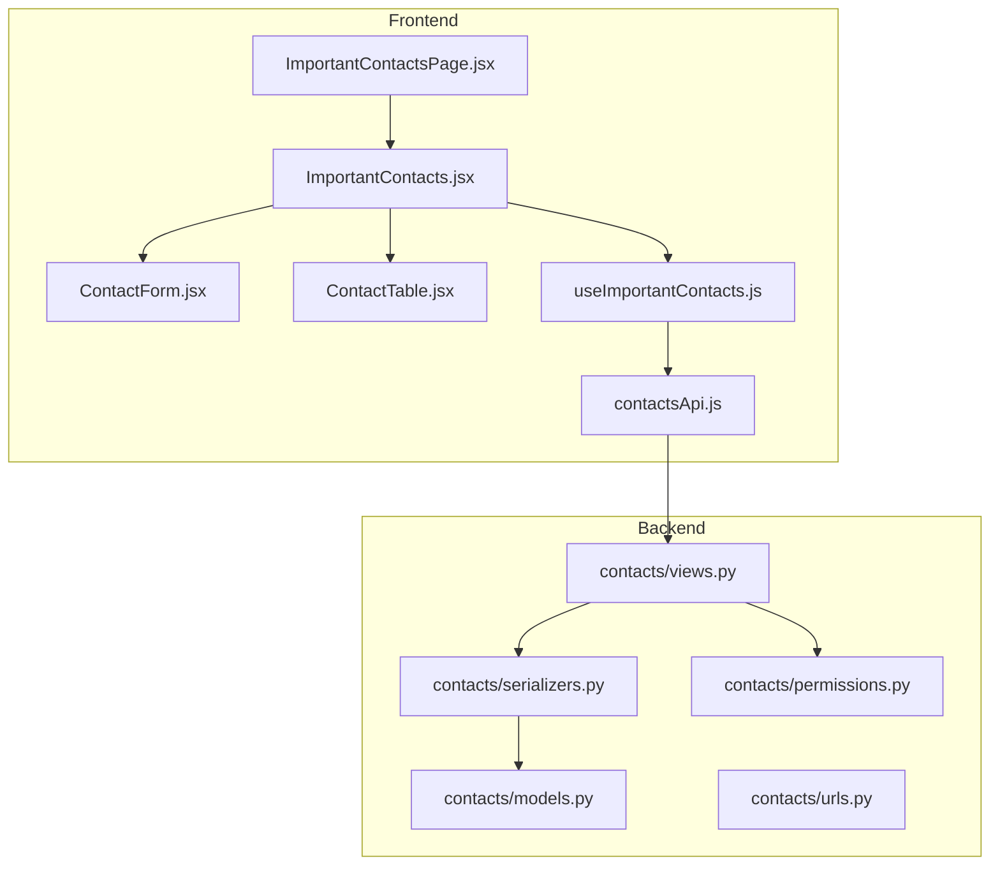
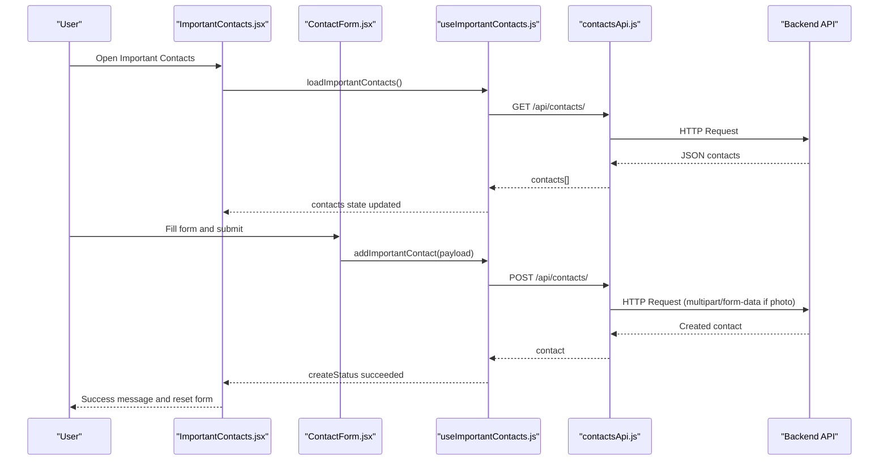
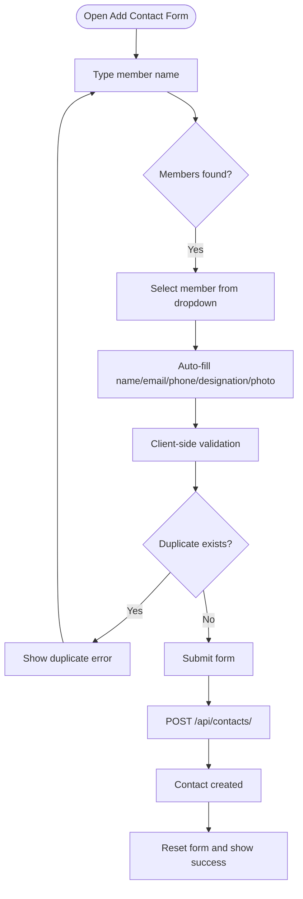
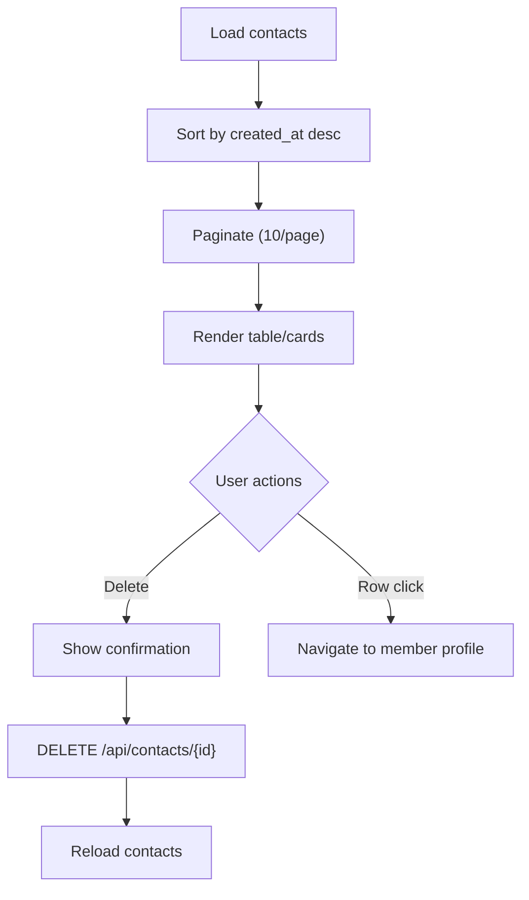
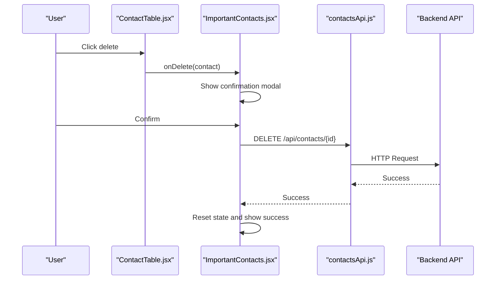
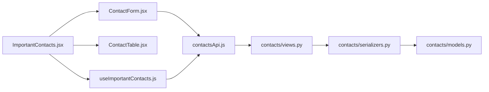

# Important Contacts System

<cite>
**Referenced Files in This Document**
- [ImportantContacts.jsx](file://frontend/src/Features/Contacts/ImportantContacts.jsx)
- [ContactForm.jsx](file://frontend/src/Features/Contacts/components/ContactForm.jsx)
- [ContactTable.jsx](file://frontend/src/Features/Contacts/components/ContactTable.jsx)
- [useImportantContacts.js](file://frontend/src/Features/Contacts/hooks/useImportantContacts.js)
- [contactsApi.js](file://frontend/src/api/contactsApi.js)
- [ImportantContactsPage.jsx](file://frontend/src/pages/ImportantContactsPage.jsx)
- [contactService.ts](file://Estate_link_App/src/services/contactService.ts)
- [contact.ts](file://Estate_link_App/src/types/contact.ts)
- [schemas.ts](file://Estate_link_App/src/validation/schemas.ts)
</cite>

## Table of Contents
1. [Introduction](#introduction)
2. [Project Structure](#project-structure)
3. [Core Components](#core-components)
4. [Architecture Overview](#architecture-overview)
5. [Detailed Component Analysis](#detailed-component-analysis)
6. [Dependency Analysis](#dependency-analysis)
7. [Performance Considerations](#performance-considerations)
8. [Troubleshooting Guide](#troubleshooting-guide)
9. [Conclusion](#conclusion)

## Introduction
The Important Contacts System enables authorized users to manage emergency and organizational contacts within the estate management platform. It supports creating, viewing, and removing important contacts, integrating with organization member profiles, and providing a streamlined workflow for emergency communication. The system includes robust validation, member-based contact creation, and responsive UI components for desktop and mobile.

## Project Structure
The system spans both the frontend and backend:
- Frontend (React + Redux):
  - Contact management UI components (form, table, page container)
  - API client for contacts
  - Redux slice for state management
- Backend (Django):
  - Contacts model and serializer
  - Views and URLs for CRUD operations
  - Permissions and migrations

**Diagram sources**
- [ImportantContacts.jsx](file://frontend/src/Features/Contacts/ImportantContacts.jsx#L1-L241)
- [ContactForm.jsx](file://frontend/src/Features/Contacts/components/ContactForm.jsx#L1-L557)
- [ContactTable.jsx](file://frontend/src/Features/Contacts/components/ContactTable.jsx#L1-L373)
- [useImportantContacts.js](file://frontend/src/Features/Contacts/hooks/useImportantContacts.js#L1-L61)
- [contactsApi.js](file://frontend/src/api/contactsApi.js#L1-L87)
- [ImportantContactsPage.jsx](file://frontend/src/pages/ImportantContactsPage.jsx#L1-L9)
- [contactService.ts](file://Estate_link_App/src/services/contactService.ts#L1-L226)
- [contact.ts](file://Estate_link_App/src/types/contact.ts#L1-L36)

**Section sources**
- [ImportantContacts.jsx](file://frontend/src/Features/Contacts/ImportantContacts.jsx#L1-L241)
- [ImportantContactsPage.jsx](file://frontend/src/pages/ImportantContactsPage.jsx#L1-L9)
- [contactsApi.js](file://frontend/src/api/contactsApi.js#L1-L87)
- [contactService.ts](file://Estate_link_App/src/services/contactService.ts#L1-L226)

## Core Components
- ImportantContacts page container orchestrates loading, mutation states, and UI rendering.
- ContactForm manages contact creation with member search, auto-fill, validation, and photo upload handling.
- ContactTable displays contacts with pagination, sorting, and actions.
- useImportantContacts integrates Redux for state and dispatches CRUD operations.
- contactsApi.js abstracts HTTP requests for contacts, supporting multipart/form-data for photo uploads.
- contactService.ts (React Native) provides similar operations for mobile clients.
- contact.ts defines TypeScript interfaces for contact data and mutations.

**Section sources**
- [ImportantContacts.jsx](file://frontend/src/Features/Contacts/ImportantContacts.jsx#L20-L241)
- [ContactForm.jsx](file://frontend/src/Features/Contacts/components/ContactForm.jsx#L22-L557)
- [ContactTable.jsx](file://frontend/src/Features/Contacts/components/ContactTable.jsx#L17-L373)
- [useImportantContacts.js](file://frontend/src/Features/Contacts/hooks/useImportantContacts.js#L14-L61)
- [contactsApi.js](file://frontend/src/api/contactsApi.js#L1-L87)
- [contactService.ts](file://Estate_link_App/src/services/contactService.ts#L7-L224)
- [contact.ts](file://Estate_link_App/src/types/contact.ts#L1-L36)

## Architecture Overview
The system follows a layered architecture:
- Presentation Layer: React components (ImportantContacts, ContactForm, ContactTable)
- State Management: Redux slice for contacts state and mutations
- API Layer: Axios-based contactsApi.js for HTTP operations
- Domain Layer: Backend Django views and serializers for contacts
- Data Layer: Django ORM model with migrations

**Diagram sources**
- [ImportantContacts.jsx](file://frontend/src/Features/Contacts/ImportantContacts.jsx#L20-L154)
- [ContactForm.jsx](file://frontend/src/Features/Contacts/components/ContactForm.jsx#L230-L251)
- [useImportantContacts.js](file://frontend/src/Features/Contacts/hooks/useImportantContacts.js#L28-L47)
- [contactsApi.js](file://frontend/src/api/contactsApi.js#L34-L51)

## Detailed Component Analysis

### Contact Creation Workflow
- Member-based creation: Users search organization members; selecting a member auto-fills name, email, phone, designation, and photo.
- Duplicate prevention: Validates against existing contacts to prevent duplicates.
- Photo handling: Supports file upload with type and size validation; falls back to URL if conversion fails.
- Submission: Payload sanitized and submitted via contactsApi.js; backend returns created contact.

**Diagram sources**
- [ContactForm.jsx](file://frontend/src/Features/Contacts/components/ContactForm.jsx#L74-L228)
- [ContactForm.jsx](file://frontend/src/Features/Contacts/components/ContactForm.jsx#L230-L251)
- [contactsApi.js](file://frontend/src/api/contactsApi.js#L34-L51)

**Section sources**
- [ContactForm.jsx](file://frontend/src/Features/Contacts/components/ContactForm.jsx#L74-L228)
- [ContactForm.jsx](file://frontend/src/Features/Contacts/components/ContactForm.jsx#L230-L251)
- [contactsApi.js](file://frontend/src/api/contactsApi.js#L34-L51)

### Contact Listing and Pagination
- Sorting: Contacts are sorted by created_at descending in the container.
- Pagination: Default page size of 10; handles total pages and current page state.
- Actions: Click row navigates to member profile if linked; delete action triggers confirmation modal.

**Diagram sources**
- [ImportantContacts.jsx](file://frontend/src/Features/Contacts/ImportantContacts.jsx#L51-L56)
- [ContactTable.jsx](file://frontend/src/Features/Contacts/components/ContactTable.jsx#L38-L45)
- [ContactTable.jsx](file://frontend/src/Features/Contacts/components/ContactTable.jsx#L103-L112)

**Section sources**
- [ImportantContacts.jsx](file://frontend/src/Features/Contacts/ImportantContacts.jsx#L51-L56)
- [ContactTable.jsx](file://frontend/src/Features/Contacts/components/ContactTable.jsx#L38-L45)
- [ContactTable.jsx](file://frontend/src/Features/Contacts/components/ContactTable.jsx#L103-L112)

### Contact Editing Workflows
- Edit mode: ContactForm supports edit mode with pre-filled values.
- Member auto-fill: When a member is selected, fields auto-populate; validation ensures uniqueness.
- Submission: Uses PATCH endpoint via contactsApi.js with multipart/form-data support.

Note: The provided files demonstrate creation and listing extensively. Editing is supported conceptually through the ContactForm’s edit mode and use of PATCH endpoints in the API layer.

**Section sources**
- [ContactForm.jsx](file://frontend/src/Features/Contacts/components/ContactForm.jsx#L22-L33)
- [ContactForm.jsx](file://frontend/src/Features/Contacts/components/ContactForm.jsx#L164-L228)
- [contactsApi.js](file://frontend/src/api/contactsApi.js#L53-L79)

### Contact Deletion
- Confirmation: Deletes require confirmation via a message box.
- API call: DELETE /api/contacts/{id}.
- State updates: Resets pending delete state and reloads contacts.

**Diagram sources**
- [ImportantContacts.jsx](file://frontend/src/Features/Contacts/ImportantContacts.jsx#L67-L84)
- [ImportantContacts.jsx](file://frontend/src/Features/Contacts/ImportantContacts.jsx#L151-L154)
- [contactsApi.js](file://frontend/src/api/contactsApi.js#L82-L85)

**Section sources**
- [ImportantContacts.jsx](file://frontend/src/Features/Contacts/ImportantContacts.jsx#L67-L84)
- [ImportantContacts.jsx](file://frontend/src/Features/Contacts/ImportantContacts.jsx#L151-L154)
- [contactsApi.js](file://frontend/src/api/contactsApi.js#L82-L85)

### Contact Forms, Validation, and Categorization
- Validation:
  - ContactForm uses Yup schema for client-side validation.
  - Member search filters exclude existing contacts and restrict to organization members.
  - Photo validation enforces allowed types and size limits.
- Categorization:
  - Designation is auto-filled from member type or roles.
  - Contacts are categorized by organization membership and roles.

**Section sources**
- [ContactForm.jsx](file://frontend/src/Features/Contacts/components/ContactForm.jsx#L41-L45)
- [ContactForm.jsx](file://frontend/src/Features/Contacts/components/ContactForm.jsx#L74-L88)
- [ContactForm.jsx](file://frontend/src/Features/Contacts/components/ContactForm.jsx#L164-L228)

### Contact Import/Export Functionality
- Import:
  - Photo uploads handled via multipart/form-data; supports File objects and removal markers.
  - Member search and auto-fill streamline population of contact details.
- Export:
  - Not implemented in the provided files. Suggested approach: implement CSV download of contacts list with fields like name, designation, phone, email, and member association.

**Section sources**
- [contactsApi.js](file://frontend/src/api/contactsApi.js#L10-L32)
- [contactsApi.js](file://frontend/src/api/contactsApi.js#L34-L51)
- [contactsApi.js](file://frontend/src/api/contactsApi.js#L53-L79)

### Emergency Communication Features
- Direct actions:
  - Clicking a contact row navigates to member profile if linked.
  - Email links enabled for quick communication.
- Integration:
  - Contacts are linked to organization members, enabling targeted emergency notifications and communication workflows.

**Section sources**
- [ContactTable.jsx](file://frontend/src/Features/Contacts/components/ContactTable.jsx#L103-L112)
- [ContactTable.jsx](file://frontend/src/Features/Contacts/components/ContactTable.jsx#L144-L150)

## Dependency Analysis
- Frontend dependencies:
  - ImportantContacts depends on useImportantContacts for state and dispatch.
  - ContactForm depends on Redux state, member search, and contactsApi.js.
  - ContactTable depends on ContactTable helpers and navigation.
- Backend dependencies:
  - Views depend on serializers and permissions.
  - Serializers depend on models and migrations.

**Diagram sources**
- [ImportantContacts.jsx](file://frontend/src/Features/Contacts/ImportantContacts.jsx#L1-L241)
- [ContactForm.jsx](file://frontend/src/Features/Contacts/components/ContactForm.jsx#L1-L557)
- [ContactTable.jsx](file://frontend/src/Features/Contacts/components/ContactTable.jsx#L1-L373)
- [useImportantContacts.js](file://frontend/src/Features/Contacts/hooks/useImportantContacts.js#L1-L61)
- [contactsApi.js](file://frontend/src/api/contactsApi.js#L1-L87)

**Section sources**
- [ImportantContacts.jsx](file://frontend/src/Features/Contacts/ImportantContacts.jsx#L1-L241)
- [ContactForm.jsx](file://frontend/src/Features/Contacts/components/ContactForm.jsx#L1-L557)
- [ContactTable.jsx](file://frontend/src/Features/Contacts/components/ContactTable.jsx#L1-L373)
- [useImportantContacts.js](file://frontend/src/Features/Contacts/hooks/useImportantContacts.js#L1-L61)
- [contactsApi.js](file://frontend/src/api/contactsApi.js#L1-L87)

## Performance Considerations
- Pagination: Default page size of 10 reduces DOM rendering overhead.
- Memoization: Sorting and filtered members computed with useMemo to avoid unnecessary recalculations.
- Loading states: Skeleton loaders improve perceived performance during data fetches.
- File handling: Photo validation prevents large or unsupported files from being processed.

[No sources needed since this section provides general guidance]

## Troubleshooting Guide
- Network/API errors:
  - contactsApi.js and contactService.ts include detailed error handling for non-JSON responses, HTML error pages, and authentication failures.
- Validation errors:
  - Client-side validation via Yup in ContactForm provides immediate feedback; server-side errors are surfaced through API responses.
- Duplicate contacts:
  - Duplicate detection prevents adding the same member twice; clear messaging guides users to resolve conflicts.
- Photo upload issues:
  - Enforce allowed types (JPG, JPEG, PNG) and size limits (5MB); fallback to URL if conversion fails.

**Section sources**
- [contactService.ts](file://Estate_link_App/src/services/contactService.ts#L13-L89)
- [contactService.ts](file://Estate_link_App/src/services/contactService.ts#L137-L191)
- [ContactForm.jsx](file://frontend/src/Features/Contacts/components/ContactForm.jsx#L253-L288)

## Conclusion
The Important Contacts System provides a robust, member-integrated solution for managing emergency and organizational contacts. It emphasizes validation, duplication prevention, responsive UI, and seamless integration with member profiles. The architecture cleanly separates concerns across frontend and backend layers, enabling maintainability and scalability for future enhancements such as export functionality and advanced emergency communication workflows.