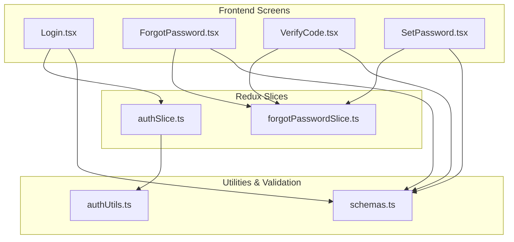
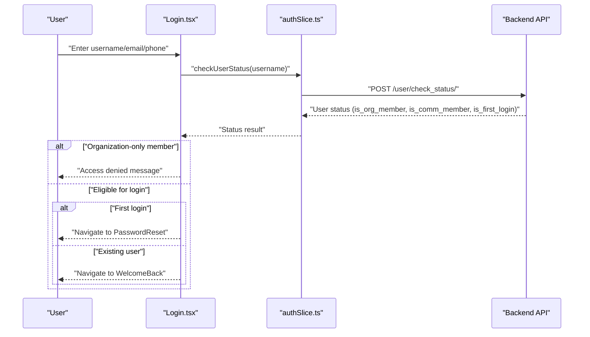
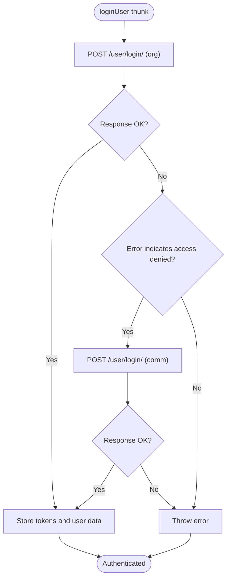
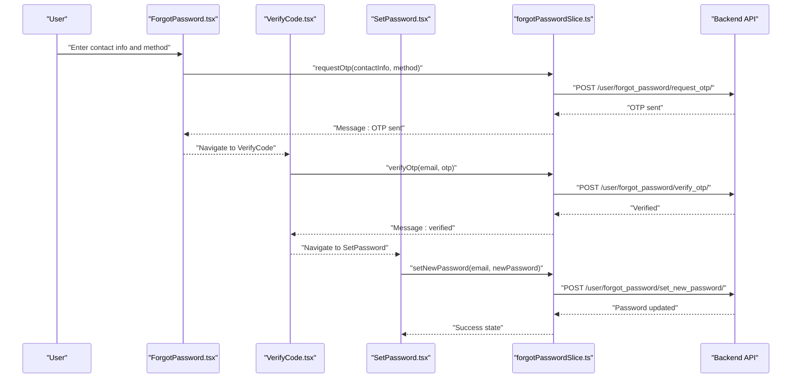
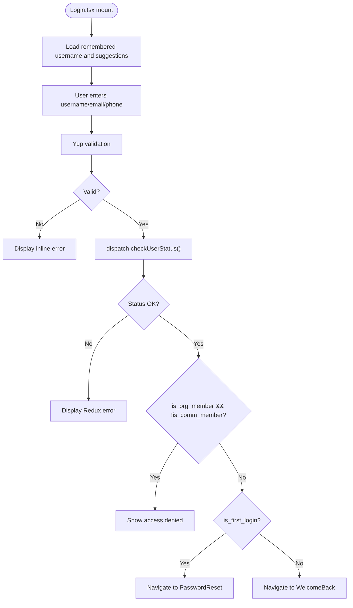
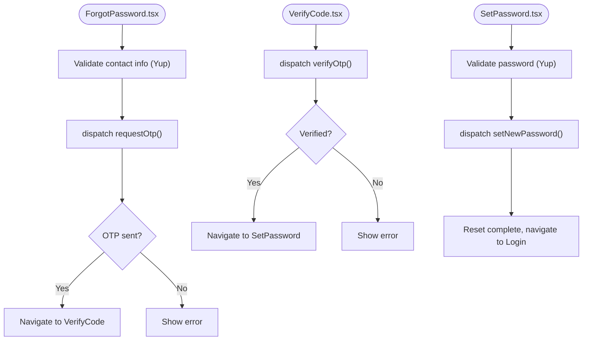
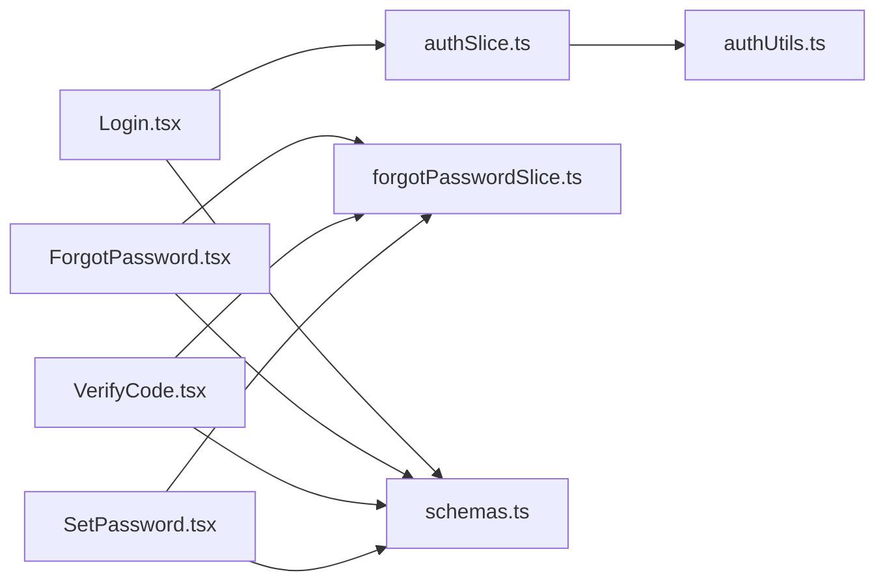

# Login Credential Management

<cite>
**Referenced Files in This Document**
- [authSlice.ts](file://Estate_link_App/src/store/slices/authSlice.ts)
- [authUtils.ts](file://Estate_link_App/src/utils/authUtils.ts)
- [Login.tsx](file://Estate_link_App/src/Features/LoginScreen/Login.tsx)
- [ForgotPassword.tsx](file://Estate_link_App/src/Features/ForgetPasswordScreen/ForgotPassword.tsx)
- [VerifyCode.tsx](file://Estate_link_App/src/Features/VerifyCodeScreen/VerifyCode.tsx)
- [SetPassword.tsx](file://Estate_link_App/src/Features/SetPasswordScreen/SetPassword.tsx)
- [schemas.ts](file://Estate_link_App/src/validation/schemas.ts)
</cite>

## Table of Contents
1. [Introduction](#introduction)
2. [Project Structure](#project-structure)
3. [Core Components](#core-components)
4. [Architecture Overview](#architecture-overview)
5. [Detailed Component Analysis](#detailed-component-analysis)
6. [Dependency Analysis](#dependency-analysis)
7. [Performance Considerations](#performance-considerations)
8. [Troubleshooting Guide](#troubleshooting-guide)
9. [Conclusion](#conclusion)

## Introduction
This document describes the login credential management system for the Estate Link application. It covers how users authenticate, reset passwords, and manage credentials across organization and community member contexts. The system enforces validation rules, password policies, and security measures, and integrates with authentication tokens and local storage for session persistence.

## Project Structure
The credential management spans three primary areas:
- Frontend screens for login, password reset, OTP verification, and setting a new password
- Redux slices for authentication state and password reset state
- Validation schemas and utility functions for secure credential handling

**Diagram sources**
- [Login.tsx](file://Estate_link_App/src/Features/LoginScreen/Login.tsx#L1-L424)
- [ForgotPassword.tsx](file://Estate_link_App/src/Features/ForgetPasswordScreen/ForgotPassword.tsx#L1-L452)
- [VerifyCode.tsx](file://Estate_link_App/src/Features/VerifyCodeScreen/VerifyCode.tsx#L1-L422)
- [SetPassword.tsx](file://Estate_link_App/src/Features/SetPasswordScreen/SetPassword.tsx#L1-L445)
- [authSlice.ts](file://Estate_link_App/src/store/slices/authSlice.ts#L1-L564)
- [authUtils.ts](file://Estate_link_App/src/utils/authUtils.ts#L1-L219)
- [schemas.ts](file://Estate_link_App/src/validation/schemas.ts#L1-L443)

**Section sources**
- [authSlice.ts](file://Estate_link_App/src/store/slices/authSlice.ts#L1-L564)
- [authUtils.ts](file://Estate_link_App/src/utils/authUtils.ts#L1-L219)
- [Login.tsx](file://Estate_link_App/src/Features/LoginScreen/Login.tsx#L1-L424)
- [ForgotPassword.tsx](file://Estate_link_App/src/Features/ForgetPasswordScreen/ForgotPassword.tsx#L1-L452)
- [VerifyCode.tsx](file://Estate_link_App/src/Features/VerifyCodeScreen/VerifyCode.tsx#L1-L422)
- [SetPassword.tsx](file://Estate_link_App/src/Features/SetPasswordScreen/SetPassword.tsx#L1-L445)
- [schemas.ts](file://Estate_link_App/src/validation/schemas.ts#L1-L443)

## Core Components
- Authentication slice: Manages login, user metadata, tokens, OTP data, and loading/error states.
- Password reset slice: Manages OTP request, verification, and new password setting.
- Login screen: Handles username/email/phone input, remembers user preferences, and gates access by membership type.
- Password reset flow: Supports email/phone/WhatsApp recovery, OTP verification, and new password setting.
- Validation schemas: Enforce input correctness and password strength.
- Utilities: Provide secure token retrieval, headers, and local storage helpers for username/password suggestions.

**Section sources**
- [authSlice.ts](file://Estate_link_App/src/store/slices/authSlice.ts#L1-L564)
- [authUtils.ts](file://Estate_link_App/src/utils/authUtils.ts#L1-L219)
- [Login.tsx](file://Estate_link_App/src/Features/LoginScreen/Login.tsx#L1-L424)
- [ForgotPassword.tsx](file://Estate_link_App/src/Features/ForgetPasswordScreen/ForgotPassword.tsx#L1-L452)
- [VerifyCode.tsx](file://Estate_link_App/src/Features/VerifyCodeScreen/VerifyCode.tsx#L1-L422)
- [SetPassword.tsx](file://Estate_link_App/src/Features/SetPasswordScreen/SetPassword.tsx#L1-L445)
- [schemas.ts](file://Estate_link_App/src/validation/schemas.ts#L1-L443)

## Architecture Overview
The system follows a layered approach:
- UI screens trigger actions via Redux Thunks.
- Thunks call backend APIs with enhanced fetch and retry logic.
- Successful responses update Redux state and AsyncStorage for persistence.
- Utilities provide secure token retrieval and request headers.

**Diagram sources**
- [Login.tsx](file://Estate_link_App/src/Features/LoginScreen/Login.tsx#L170-L225)
- [authSlice.ts](file://Estate_link_App/src/store/slices/authSlice.ts#L82-L129)

**Section sources**
- [Login.tsx](file://Estate_link_App/src/Features/LoginScreen/Login.tsx#L170-L225)
- [authSlice.ts](file://Estate_link_App/src/store/slices/authSlice.ts#L82-L129)

## Detailed Component Analysis

### Authentication Slice (authSlice.ts)
Responsibilities:
- Manage user identity, authentication state, tokens, and OTP metadata.
- Provide async thunks for login, user status checks, password reset, and password updates.
- Implement retry logic for network requests with exponential backoff.
- Gate login attempts between organization and community contexts.

Key behaviors:
- Login flow tries organization login first, then community login if access is denied.
- On success, stores access/refresh tokens and user metadata.
- OTP data tracks attempts and last attempt timestamps.

**Diagram sources**
- [authSlice.ts](file://Estate_link_App/src/store/slices/authSlice.ts#L200-L289)

**Section sources**
- [authSlice.ts](file://Estate_link_App/src/store/slices/authSlice.ts#L1-L564)

### Password Reset Slice (forgotPasswordSlice.ts)
Responsibilities:
- Manage OTP lifecycle: request, resend, and verify.
- Set new password after successful verification.
- Track email, messages, errors, and loading states.

Key behaviors:
- OTP request supports email, phone, and WhatsApp delivery methods.
- Verification validates OTP length/format and handles errors.
- After verification, navigates to set password screen.

**Diagram sources**
- [ForgotPassword.tsx](file://Estate_link_App/src/Features/ForgetPasswordScreen/ForgotPassword.tsx#L210-L280)
- [VerifyCode.tsx](file://Estate_link_App/src/Features/VerifyCodeScreen/VerifyCode.tsx#L169-L215)
- [SetPassword.tsx](file://Estate_link_App/src/Features/SetPasswordScreen/SetPassword.tsx#L217-L251)
- [authSlice.ts](file://Estate_link_App/src/store/slices/authSlice.ts#L131-L198)

**Section sources**
- [ForgotPassword.tsx](file://Estate_link_App/src/Features/ForgetPasswordScreen/ForgotPassword.tsx#L1-L452)
- [VerifyCode.tsx](file://Estate_link_App/src/Features/VerifyCodeScreen/VerifyCode.tsx#L1-L422)
- [SetPassword.tsx](file://Estate_link_App/src/Features/SetPasswordScreen/SetPassword.tsx#L1-L445)
- [authSlice.ts](file://Estate_link_App/src/store/slices/authSlice.ts#L131-L198)

### Login Screen (Login.tsx)
Responsibilities:
- Accept username/email/phone input with live validation.
- Check user status to determine eligibility and first-login state.
- Gate access for organization-only members.
- Persist "Remember me" preference and username history.

Validation and UX:
- Uses Yup schema for minimum length and character limits.
- Displays inline and Redux-managed errors.
- Integrates with auth utilities for username suggestions and persistence.

**Diagram sources**
- [Login.tsx](file://Estate_link_App/src/Features/LoginScreen/Login.tsx#L101-L225)
- [authSlice.ts](file://Estate_link_App/src/store/slices/authSlice.ts#L82-L129)
- [schemas.ts](file://Estate_link_App/src/validation/schemas.ts#L4-L11)

**Section sources**
- [Login.tsx](file://Estate_link_App/src/Features/LoginScreen/Login.tsx#L1-L424)
- [authSlice.ts](file://Estate_link_App/src/store/slices/authSlice.ts#L82-L129)
- [schemas.ts](file://Estate_link_App/src/validation/schemas.ts#L4-L11)

### Password Reset Screens
- ForgotPassword.tsx: Selects recovery method, validates contact info, requests OTP, and navigates on success.
- VerifyCode.tsx: Validates OTP, resends OTP with countdown, and proceeds to set password.
- SetPassword.tsx: Enforces strong password policy, confirms match, and completes reset.

Validation rules enforced:
- OTP: 4–6 digits.
- Password: minimum 8 characters, uppercase, lowercase, digit, special character, and match confirmation.

**Diagram sources**
- [ForgotPassword.tsx](file://Estate_link_App/src/Features/ForgetPasswordScreen/ForgotPassword.tsx#L210-L280)
- [VerifyCode.tsx](file://Estate_link_App/src/Features/VerifyCodeScreen/VerifyCode.tsx#L169-L215)
- [SetPassword.tsx](file://Estate_link_App/src/Features/SetPasswordScreen/SetPassword.tsx#L217-L251)
- [schemas.ts](file://Estate_link_App/src/validation/schemas.ts#L44-L66)

**Section sources**
- [ForgotPassword.tsx](file://Estate_link_App/src/Features/ForgetPasswordScreen/ForgotPassword.tsx#L1-L452)
- [VerifyCode.tsx](file://Estate_link_App/src/Features/VerifyCodeScreen/VerifyCode.tsx#L1-L422)
- [SetPassword.tsx](file://Estate_link_App/src/Features/SetPasswordScreen/SetPassword.tsx#L1-L445)
- [schemas.ts](file://Estate_link_App/src/validation/schemas.ts#L44-L66)

### Utilities and Security (authUtils.ts)
Responsibilities:
- Retrieve and update tokens from persisted state.
- Build Authorization headers for API requests.
- Manage "Remember me" username and username history.
- Provide secure password suggestions per username using platform secure storage.

Security measures:
- Tokens are stored in AsyncStorage and updated atomically.
- Headers include Authorization Bearer when available.
- SecureStore is used for password vault entries keyed by sanitized usernames.

**Section sources**
- [authUtils.ts](file://Estate_link_App/src/utils/authUtils.ts#L1-L219)

## Dependency Analysis
- UI screens depend on Redux slices for state and actions.
- Redux slices depend on enhanced fetch utilities and backend endpoints.
- Validation schemas are shared across screens to ensure consistent rules.
- Utilities provide cross-cutting concerns for token handling and persistence.

**Diagram sources**
- [Login.tsx](file://Estate_link_App/src/Features/LoginScreen/Login.tsx#L1-L424)
- [ForgotPassword.tsx](file://Estate_link_App/src/Features/ForgetPasswordScreen/ForgotPassword.tsx#L1-L452)
- [VerifyCode.tsx](file://Estate_link_App/src/Features/VerifyCodeScreen/VerifyCode.tsx#L1-L422)
- [SetPassword.tsx](file://Estate_link_App/src/Features/SetPasswordScreen/SetPassword.tsx#L1-L445)
- [authSlice.ts](file://Estate_link_App/src/store/slices/authSlice.ts#L1-L564)
- [authUtils.ts](file://Estate_link_App/src/utils/authUtils.ts#L1-L219)
- [schemas.ts](file://Estate_link_App/src/validation/schemas.ts#L1-L443)

**Section sources**
- [authSlice.ts](file://Estate_link_App/src/store/slices/authSlice.ts#L1-L564)
- [authUtils.ts](file://Estate_link_App/src/utils/authUtils.ts#L1-L219)
- [Login.tsx](file://Estate_link_App/src/Features/LoginScreen/Login.tsx#L1-L424)
- [ForgotPassword.tsx](file://Estate_link_App/src/Features/ForgetPasswordScreen/ForgotPassword.tsx#L1-L452)
- [VerifyCode.tsx](file://Estate_link_App/src/Features/VerifyCodeScreen/VerifyCode.tsx#L1-L422)
- [SetPassword.tsx](file://Estate_link_App/src/Features/SetPasswordScreen/SetPassword.tsx#L1-L445)
- [schemas.ts](file://Estate_link_App/src/validation/schemas.ts#L1-L443)

## Performance Considerations
- Retry logic with exponential backoff reduces repeated failures under network instability.
- Keyboard-aware layouts minimize layout thrashing during input focus changes.
- Validation runs locally with Yup to provide immediate feedback and reduce server round trips.
- Token retrieval and header building are lightweight operations performed only when needed.

## Troubleshooting Guide
Common issues and resolutions:
- Invalid credentials: The login flow distinguishes between invalid username/password versus access denial. Review the error messages returned by the backend and adjust accordingly.
- OTP errors: Verify the OTP length/format and ensure the resend mechanism is used when the timer expires.
- Network connectivity: The retry logic depends on checking connectivity before attempting retries. Poor connectivity will halt retries and surface a clear error.
- Remember me not persisting: Ensure AsyncStorage keys are present and not cleared by the app. Use the provided helpers to save and load remembered usernames.

**Section sources**
- [authSlice.ts](file://Estate_link_App/src/store/slices/authSlice.ts#L44-L79)
- [Login.tsx](file://Estate_link_App/src/Features/LoginScreen/Login.tsx#L212-L225)
- [VerifyCode.tsx](file://Estate_link_App/src/Features/VerifyCodeScreen/VerifyCode.tsx#L201-L215)

## Conclusion
The credential management system combines robust front-end validation, resilient backend integration, and secure local storage utilities to deliver a reliable login and password reset experience. By enforcing strict validation rules and leveraging clear error handling, the system ensures both usability and security for organization and community members alike.