# Member Management

<cite>
**Referenced Files in This Document**
- [AddMemberPage.jsx](file://frontend/src/pages/AddMemberPage.jsx)
- [MemberListPage.jsx](file://frontend/src/pages/MemberListPage.jsx)
- [OrganizationMemberForm.jsx](file://frontend/src/Features/Members/OrganizationMemberForm/OrganizationMemberForm.jsx)
- [MemberMainForm.jsx](file://frontend/src/Features/Members/MemberMainForm/MemberMainForm.jsx)
- [MemberProfile.jsx](file://frontend/src/Features/Members/MemberProfile/MemberProfile.jsx)
- [ProfileInformationView.jsx](file://frontend/src/Features/Members/MemberProfile/ProfileInformationView.jsx)
- [OrganizationMemberInformationView.jsx](file://frontend/src/Features/Members/MemberProfile/OrganizationMemberInformationView.jsx)
- [OwnershipDetailsView.jsx](file://frontend/src/Features/Members/MemberProfile/OwnershipDetailsView.jsx)
- [ResidentDetailsView.jsx](file://frontend/src/Features/Members/MemberProfile/ResidentDetailsView.jsx)
- [membersApi.js](file://frontend/src/api/membersApi/membersApi.js)
- [useMemberValidation.js](file://frontend/src/Features/Members/OrganizationMemberForm/useMemberValidation.js)
- [useMemberSubmit.js](file://frontend/src/Features/Members/OrganizationMemberForm/useMemberSubmit.js)
- [useMemberSelections.js](file://frontend/src/Features/Members/OrganizationMemberForm/useMemberSelections.js)
- [useHandleFileChange.js](file://frontend/src/Features/Members/OrganizationMemberForm/useHandleFileChange.js)
- [useHandleChange.js](file://frontend/src/utils/useHandleChange.js)
- [updateFileChange.js](file://frontend/src/utils/updateFileChange.js)
- [MemberTypeAsign.jsx](file://frontend/src/Features/Members/MemberTypeAsign/MemberTypeAsign.jsx)
- [MemberRoleAsign.jsx](file://frontend/src/Features/Members/MemberRoleAsign/MemberRoleAsign.jsx)
- [AddExistingCommMemberTable.jsx](file://frontend/src/Features/Members/MemberTable/AddExistingCommMemberTable.jsx)
- [MemberList.jsx](file://frontend/src/Features/Members/MemberList/MemberList.jsx)
- [MemberListSearchSort API View](file://backend/user/views.py)
- [MemberDetails API View](file://backend/user/views.py)
- [CreateMember API View](file://backend/user/views.py)
- [CreateMemberForUnit API View](file://backend/user/views.py)
- [ChangeMemberStatus API View](file://backend/user/views.py)
- [MemberTypeList API View](file://backend/user/views.py)
- [MemberType Model](file://backend/user/models.py)
- [Member Model](file://backend/user/models.py)
- [Unit Ownership History](file://backend/towers/models.py)
- [Unit Resident History](file://backend/towers/models.py)
- [Unit Staff History](file://backend/towers/models.py)
- [Unit Ownership Serializer](file://backend/towers/serializers/owner_serializers.py)
- [Unit Resident Serializer](file://backend/towers/serializers/resident_serializers.py)
- [Unit Staff Serializer](file://backend/towers/serializers/unitStaff_serializers.py)
- [Unit Views](file://backend/towers/views/)
- [Group Role Models](file://backend/group_role/models.py)
- [Group Role Permissions](file://backend/group_role/permissions.py)
- [Audit Trail](file://backend/audit_trail/models.py)
</cite>

## Table of Contents
1. [Introduction](#introduction)
2. [Project Structure](#project-structure)
3. [Core Components](#core-components)
4. [Architecture Overview](#architecture-overview)
5. [Detailed Component Analysis](#detailed-component-analysis)
6. [Dependency Analysis](#dependency-analysis)
7. [Performance Considerations](#performance-considerations)
8. [Troubleshooting Guide](#troubleshooting-guide)
9. [Conclusion](#conclusion)
10. [Appendices](#appendices)

## Introduction
This document describes the member management system for community members, organization members, and staff members within the Estate Link platform. It covers registration forms, profile management, editing capabilities, import functionality, member type and role assignments, profile pages, search and filtering, status management, history tracking, onboarding workflows, validation patterns, and integration with property management features.

## Project Structure
The member management system spans frontend React components and backend Django REST APIs:
- Frontend pages and features under the Members domain orchestrate forms, validation, submission, and profile rendering.
- Backend user module handles member CRUD, status changes, and search/filtering.
- Property management integration is handled via towers module serializers and views, exposing ownership, residency, and staff details.

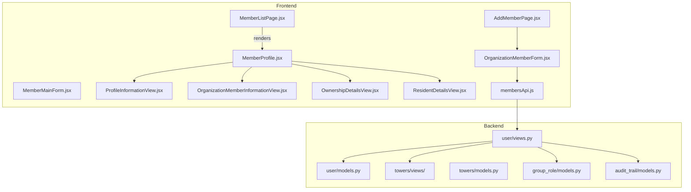

**Diagram sources**
- [AddMemberPage.jsx](file://frontend/src/pages/AddMemberPage.jsx#L1-L12)
- [MemberListPage.jsx](file://frontend/src/pages/MemberListPage.jsx#L1-L12)
- [OrganizationMemberForm.jsx](file://frontend/src/Features/Members/OrganizationMemberForm/OrganizationMemberForm.jsx#L1-L765)
- [MemberMainForm.jsx](file://frontend/src/Features/Members/MemberMainForm/MemberMainForm.jsx#L1-L286)
- [MemberProfile.jsx](file://frontend/src/Features/Members/MemberProfile/MemberProfile.jsx#L1-L327)
- [ProfileInformationView.jsx](file://frontend/src/Features/Members/MemberProfile/ProfileInformationView.jsx#L1-L132)
- [OrganizationMemberInformationView.jsx](file://frontend/src/Features/Members/MemberProfile/OrganizationMemberInformationView.jsx#L1-L203)
- [OwnershipDetailsView.jsx](file://frontend/src/Features/Members/MemberProfile/OwnershipDetailsView.jsx#L1-L93)
- [ResidentDetailsView.jsx](file://frontend/src/Features/Members/MemberProfile/ResidentDetailsView.jsx#L1-L172)
- [membersApi.js](file://frontend/src/api/membersApi/membersApi.js#L1-L48)
- [MemberListSearchSort API View](file://backend/user/views.py#L168-L203)
- [MemberDetails API View](file://backend/user/views.py#L206-L234)
- [CreateMember API View](file://backend/user/views.py#L345-L441)
- [CreateMemberForUnit API View](file://backend/user/views.py#L443-L551)
- [ChangeMemberStatus API View](file://backend/user/views.py#L236-L279)
- [MemberTypeList API View](file://backend/user/views.py#L89-L95)
- [MemberType Model](file://backend/user/models.py#L8-L10)
- [Member Model](file://backend/user/models.py#L15-L170)
- [Unit Ownership History](file://backend/towers/models.py)
- [Unit Resident History](file://backend/towers/models.py)
- [Unit Staff History](file://backend/towers/models.py)
- [Unit Ownership Serializer](file://backend/towers/serializers/owner_serializers.py)
- [Unit Resident Serializer](file://backend/towers/serializers/resident_serializers.py)
- [Unit Staff Serializer](file://backend/towers/serializers/unitStaff_serializers.py)
- [Group Role Models](file://backend/group_role/models.py)
- [Audit Trail](file://backend/audit_trail/models.py)

**Section sources**
- [AddMemberPage.jsx](file://frontend/src/pages/AddMemberPage.jsx#L1-L12)
- [MemberListPage.jsx](file://frontend/src/pages/MemberListPage.jsx#L1-L12)
- [OrganizationMemberForm.jsx](file://frontend/src/Features/Members/OrganizationMemberForm/OrganizationMemberForm.jsx#L1-L765)
- [MemberMainForm.jsx](file://frontend/src/Features/Members/MemberMainForm/MemberMainForm.jsx#L1-L286)
- [MemberProfile.jsx](file://frontend/src/Features/Members/MemberProfile/MemberProfile.jsx#L1-L327)
- [ProfileInformationView.jsx](file://frontend/src/Features/Members/MemberProfile/ProfileInformationView.jsx#L1-L132)
- [OrganizationMemberInformationView.jsx](file://frontend/src/Features/Members/MemberProfile/OrganizationMemberInformationView.jsx#L1-L203)
- [OwnershipDetailsView.jsx](file://frontend/src/Features/Members/MemberProfile/OwnershipDetailsView.jsx#L1-L93)
- [ResidentDetailsView.jsx](file://frontend/src/Features/Members/MemberProfile/ResidentDetailsView.jsx#L1-L172)
- [membersApi.js](file://frontend/src/api/membersApi/membersApi.js#L1-L48)
- [MemberListSearchSort API View](file://backend/user/views.py#L168-L203)
- [MemberDetails API View](file://backend/user/views.py#L206-L234)
- [CreateMember API View](file://backend/user/views.py#L345-L441)
- [CreateMemberForUnit API View](file://backend/user/views.py#L443-L551)
- [ChangeMemberStatus API View](file://backend/user/views.py#L236-L279)
- [MemberTypeList API View](file://backend/user/views.py#L89-L95)
- [MemberType Model](file://backend/user/models.py#L8-L10)
- [Member Model](file://backend/user/models.py#L15-L170)

## Core Components
- Registration and Onboarding
  - Organization member registration form with two tabs: general info and type/role assignment.
  - Validation hooks, file handling, and submission pipeline.
- Profile Management
  - Unified profile page with sections for general info, organization member info, ownership details, resident details, and staff details.
- Search and Filtering
  - Backend search supporting member type and role filters plus text search across name, contact, email, and role names.
- Status Management
  - Toggle organization and community membership statuses with audit trail.
- Property Integration
  - Ownership, residency, and staff details exposed via towers serializers and views.

**Section sources**
- [OrganizationMemberForm.jsx](file://frontend/src/Features/Members/OrganizationMemberForm/OrganizationMemberForm.jsx#L50-L765)
- [MemberMainForm.jsx](file://frontend/src/Features/Members/MemberMainForm/MemberMainForm.jsx#L14-L286)
- [MemberProfile.jsx](file://frontend/src/Features/Members/MemberProfile/MemberProfile.jsx#L1-L327)
- [ProfileInformationView.jsx](file://frontend/src/Features/Members/MemberProfile/ProfileInformationView.jsx#L25-L132)
- [OrganizationMemberInformationView.jsx](file://frontend/src/Features/Members/MemberProfile/OrganizationMemberInformationView.jsx#L33-L203)
- [OwnershipDetailsView.jsx](file://frontend/src/Features/Members/MemberProfile/OwnershipDetailsView.jsx#L9-L93)
- [ResidentDetailsView.jsx](file://frontend/src/Features/Members/MemberProfile/ResidentDetailsView.jsx#L58-L172)
- [MemberListSearchSort API View](file://backend/user/views.py#L168-L203)
- [ChangeMemberStatus API View](file://backend/user/views.py#L236-L279)

## Architecture Overview
The frontend orchestrates member creation and profile rendering, while the backend enforces permissions, validates data, persists changes, and integrates with property management and role systems.

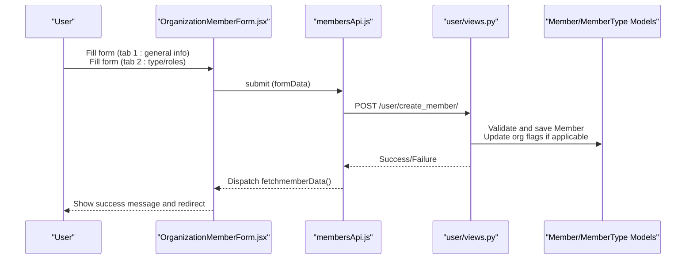

**Diagram sources**
- [OrganizationMemberForm.jsx](file://frontend/src/Features/Members/OrganizationMemberForm/OrganizationMemberForm.jsx#L203-L211)
- [membersApi.js](file://frontend/src/api/membersApi/membersApi.js#L36-L47)
- [CreateMember API View](file://backend/user/views.py#L345-L441)
- [Member Model](file://backend/user/models.py#L15-L170)
- [MemberType Model](file://backend/user/models.py#L8-L10)

## Detailed Component Analysis

### Registration Forms and Workflows
- Two-tab form:
  - Tab 1: General information (personal details, addresses, NID, photos).
  - Tab 2: Member type selection and role assignment.
- Validation and submission:
  - Validation runs on tab switch; submission triggers async thunk to backend.
  - File handling supports photo and NID uploads with preview and validation.
- Existing member selection:
  - Modal allows selecting a community member to autofill organization registration.

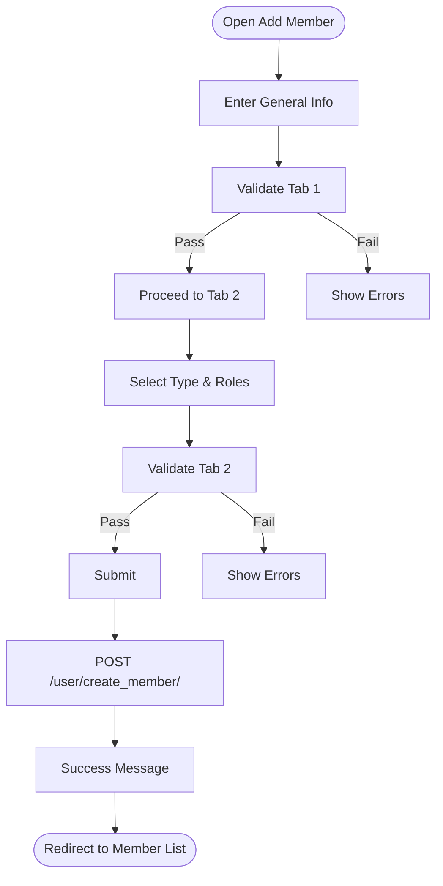

**Diagram sources**
- [OrganizationMemberForm.jsx](file://frontend/src/Features/Members/OrganizationMemberForm/OrganizationMemberForm.jsx#L252-L271)
- [useMemberValidation.js](file://frontend/src/Features/Members/OrganizationMemberForm/useMemberValidation.js)
- [useMemberSubmit.js](file://frontend/src/Features/Members/OrganizationMemberForm/useMemberSubmit.js)
- [useHandleFileChange.js](file://frontend/src/Features/Members/OrganizationMemberForm/useHandleFileChange.js)
- [MemberMainForm.jsx](file://frontend/src/Features/Members/MemberMainForm/MemberMainForm.jsx#L14-L286)
- [CreateMember API View](file://backend/user/views.py#L345-L441)

**Section sources**
- [OrganizationMemberForm.jsx](file://frontend/src/Features/Members/OrganizationMemberForm/OrganizationMemberForm.jsx#L50-L765)
- [MemberMainForm.jsx](file://frontend/src/Features/Members/MemberMainForm/MemberMainForm.jsx#L14-L286)
- [useMemberValidation.js](file://frontend/src/Features/Members/OrganizationMemberForm/useMemberValidation.js)
- [useMemberSubmit.js](file://frontend/src/Features/Members/OrganizationMemberForm/useMemberSubmit.js)
- [useHandleFileChange.js](file://frontend/src/Features/Members/OrganizationMemberForm/useHandleFileChange.js)
- [useHandleChange.js](file://frontend/src/utils/useHandleChange.js)
- [updateFileChange.js](file://frontend/src/utils/updateFileChange.js)
- [MemberTypeAsign.jsx](file://frontend/src/Features/Members/MemberTypeAsign/MemberTypeAsign.jsx)
- [MemberRoleAsign.jsx](file://frontend/src/Features/Members/MemberRoleAsign/MemberRoleAsign.jsx)
- [AddExistingCommMemberTable.jsx](file://frontend/src/Features/Members/MemberTable/AddExistingCommMemberTable.jsx)
- [CreateMember API View](file://backend/user/views.py#L345-L441)

### Profile Management and Editing
- Unified profile page with editable sections:
  - Profile Information: personal details and NID images.
  - Organization Member Information: type, roles, groups.
  - Ownership Details: unit ownership, tower info, ownership docs.
  - Resident Details: unit residency, move-in/out dates, notices, docs.
  - Staff Details: staff assignments and related info.
- Edit links are permission-guarded and route to appropriate edit pages.

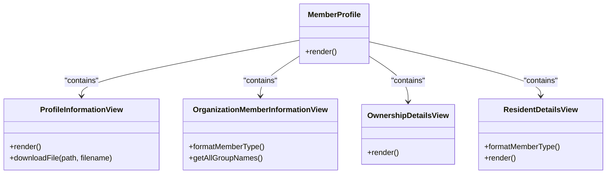

**Diagram sources**
- [ProfileInformationView.jsx](file://frontend/src/Features/Members/MemberProfile/ProfileInformationView.jsx#L25-L132)
- [OrganizationMemberInformationView.jsx](file://frontend/src/Features/Members/MemberProfile/OrganizationMemberInformationView.jsx#L33-L203)
- [OwnershipDetailsView.jsx](file://frontend/src/Features/Members/MemberProfile/OwnershipDetailsView.jsx#L9-L93)
- [ResidentDetailsView.jsx](file://frontend/src/Features/Members/MemberProfile/ResidentDetailsView.jsx#L58-L172)
- [MemberProfile.jsx](file://frontend/src/Features/Members/MemberProfile/MemberProfile.jsx#L1-L327)

**Section sources**
- [ProfileInformationView.jsx](file://frontend/src/Features/Members/MemberProfile/ProfileInformationView.jsx#L25-L132)
- [OrganizationMemberInformationView.jsx](file://frontend/src/Features/Members/MemberProfile/OrganizationMemberInformationView.jsx#L33-L203)
- [OwnershipDetailsView.jsx](file://frontend/src/Features/Members/MemberProfile/OwnershipDetailsView.jsx#L9-L93)
- [ResidentDetailsView.jsx](file://frontend/src/Features/Members/MemberProfile/ResidentDetailsView.jsx#L58-L172)
- [MemberProfile.jsx](file://frontend/src/Features/Members/MemberProfile/MemberProfile.jsx#L1-L327)

### Member Type and Role Assignments
- Member types are fetched from backend and filtered for display.
- Roles are fetched and presented for multi-select assignment.
- Permission checks guard visibility and editing of role/type sections.

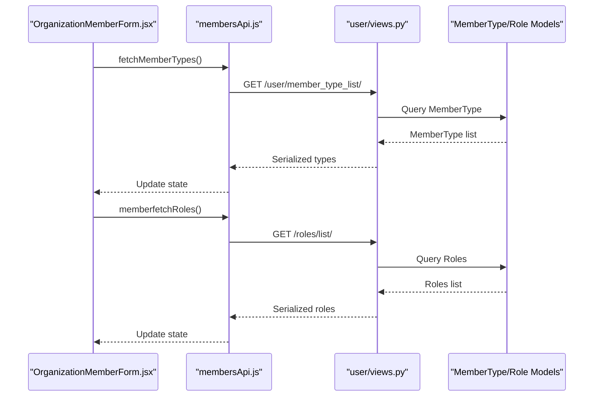

**Diagram sources**
- [OrganizationMemberForm.jsx](file://frontend/src/Features/Members/OrganizationMemberForm/OrganizationMemberForm.jsx#L180-L188)
- [MemberTypeList API View](file://backend/user/views.py#L89-L95)
- [MemberType Model](file://backend/user/models.py#L8-L10)
- [Group Role Models](file://backend/group_role/models.py)

**Section sources**
- [OrganizationMemberForm.jsx](file://frontend/src/Features/Members/OrganizationMemberForm/OrganizationMemberForm.jsx#L180-L188)
- [MemberTypeList API View](file://backend/user/views.py#L89-L95)
- [MemberType Model](file://backend/user/models.py#L8-L10)
- [Group Role Models](file://backend/group_role/models.py)

### Member Import Functionality
- Community member import via Excel upload is supported through dedicated endpoints and batch processing utilities in the backend.
- The frontend provides an import modal/table for selecting existing community members to onboard as organization members.

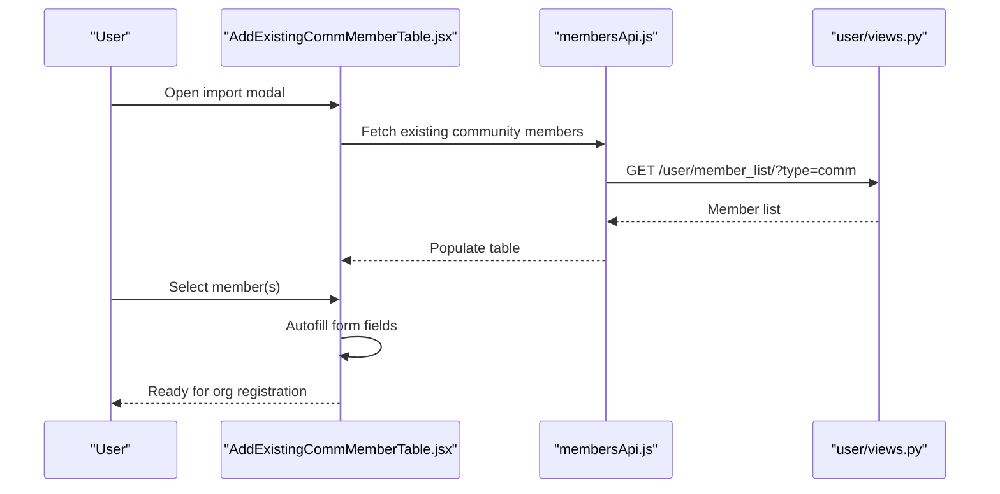

**Diagram sources**
- [AddExistingCommMemberTable.jsx](file://frontend/src/Features/Members/MemberTable/AddExistingCommMemberTable.jsx)
- [membersApi.js](file://frontend/src/api/membersApi/membersApi.js#L5-L14)
- [MemberListSearchSort API View](file://backend/user/views.py#L100-L130)

**Section sources**
- [AddExistingCommMemberTable.jsx](file://frontend/src/Features/Members/MemberTable/AddExistingCommMemberTable.jsx)
- [membersApi.js](file://frontend/src/api/membersApi/membersApi.js#L5-L14)
- [MemberListSearchSort API View](file://backend/user/views.py#L100-L130)

### Member Search and Filtering
- Backend supports:
  - Member type filter
  - Role filter
  - Text search across name, contact, email, and role names
- Pagination and distinct results are applied to avoid duplicates.

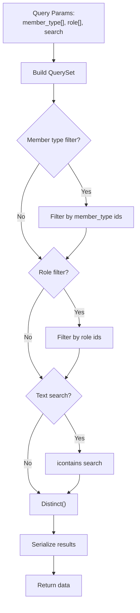

**Diagram sources**
- [MemberListSearchSort API View](file://backend/user/views.py#L168-L203)

**Section sources**
- [MemberListSearchSort API View](file://backend/user/views.py#L168-L203)

### Member Status Management
- Toggle organization or community membership status via POST with audit trail logging.
- Validation ensures required fields and proper casting of status values.

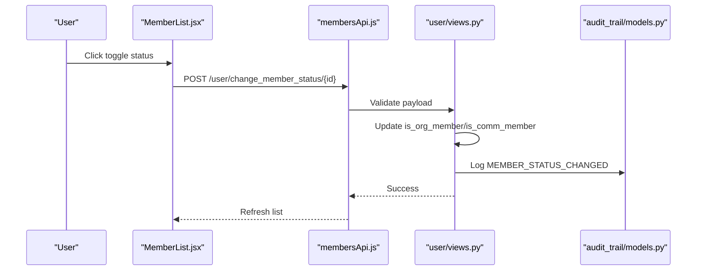

**Diagram sources**
- [MemberList.jsx](file://frontend/src/Features/Members/MemberList/MemberList.jsx)
- [membersApi.js](file://frontend/src/api/membersApi/membersApi.js#L1-L48)
- [ChangeMemberStatus API View](file://backend/user/views.py#L236-L279)
- [Audit Trail](file://backend/audit_trail/models.py)

**Section sources**
- [membersApi.js](file://frontend/src/api/membersApi/membersApi.js#L1-L48)
- [ChangeMemberStatus API View](file://backend/user/views.py#L236-L279)
- [Audit Trail](file://backend/audit_trail/models.py)

### Member History Tracking
- Ownership, residency, and staff histories are maintained in towers models and exposed via serializers.
- These histories provide audit trails for ownership transfers, residency transitions, and staff assignments.

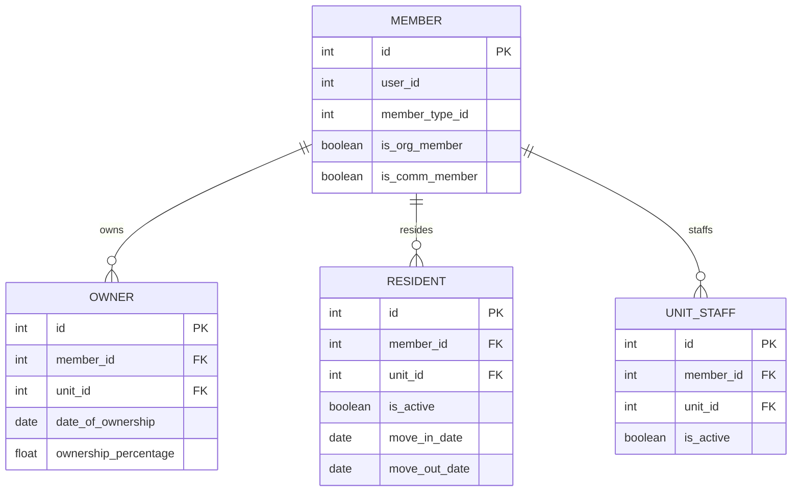

**Diagram sources**
- [Member Model](file://backend/user/models.py#L15-L170)
- [Unit Ownership History](file://backend/towers/models.py)
- [Unit Resident History](file://backend/towers/models.py)
- [Unit Staff History](file://backend/towers/models.py)
- [Unit Ownership Serializer](file://backend/towers/serializers/owner_serializers.py)
- [Unit Resident Serializer](file://backend/towers/serializers/resident_serializers.py)
- [Unit Staff Serializer](file://backend/towers/serializers/unitStaff_serializers.py)

**Section sources**
- [Member Model](file://backend/user/models.py#L15-L170)
- [Unit Ownership History](file://backend/towers/models.py)
- [Unit Resident History](file://backend/towers/models.py)
- [Unit Staff History](file://backend/towers/models.py)
- [Unit Ownership Serializer](file://backend/towers/serializers/owner_serializers.py)
- [Unit Resident Serializer](file://backend/towers/serializers/resident_serializers.py)
- [Unit Staff Serializer](file://backend/towers/serializers/unitStaff_serializers.py)

### Integration with Property Management
- Member details endpoint aggregates member data along with associated ownership, residency, and staff records.
- Towers views and serializers expose unit-level details and documents for ownership and residency.

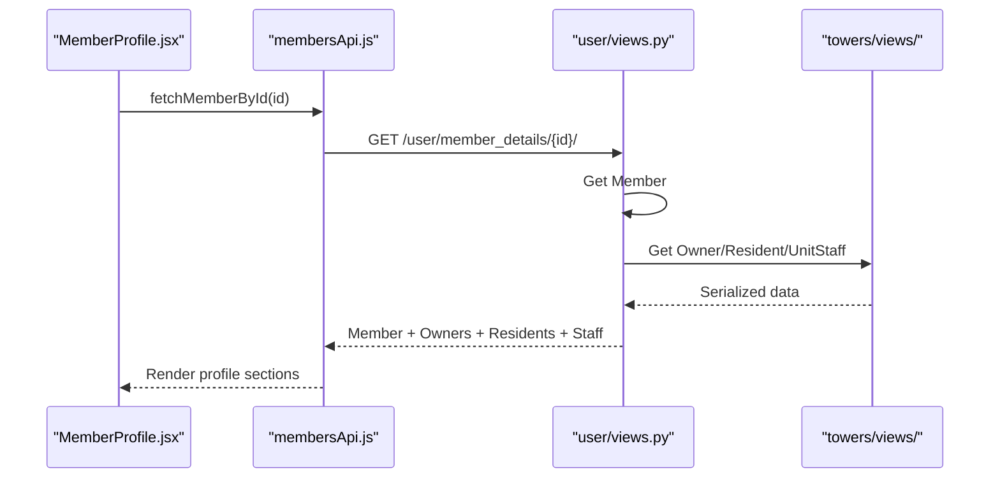

**Diagram sources**
- [MemberProfile.jsx](file://frontend/src/Features/Members/MemberProfile/MemberProfile.jsx#L1-L327)
- [membersApi.js](file://frontend/src/api/membersApi/membersApi.js#L16-L24)
- [MemberDetails API View](file://backend/user/views.py#L206-L234)
- [Unit Views](file://backend/towers/views/)

**Section sources**
- [MemberProfile.jsx](file://frontend/src/Features/Members/MemberProfile/MemberProfile.jsx#L1-L327)
- [membersApi.js](file://frontend/src/api/membersApi/membersApi.js#L16-L24)
- [MemberDetails API View](file://backend/user/views.py#L206-L234)
- [Unit Views](file://backend/towers/views/)

## Dependency Analysis
- Frontend dependencies:
  - OrganizationMemberForm depends on validation, submission, file handling, and selection hooks.
  - Profile components depend on permission checks and dynamic edit links.
- Backend dependencies:
  - Member endpoints depend on Member and MemberType models, role models, and audit trail.
  - Property integration depends on towers models and serializers.

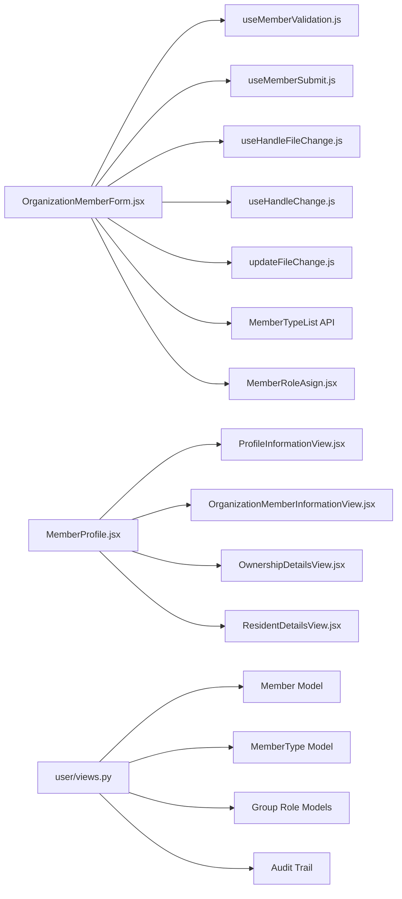

**Diagram sources**
- [OrganizationMemberForm.jsx](file://frontend/src/Features/Members/OrganizationMemberForm/OrganizationMemberForm.jsx#L1-L765)
- [useMemberValidation.js](file://frontend/src/Features/Members/OrganizationMemberForm/useMemberValidation.js)
- [useMemberSubmit.js](file://frontend/src/Features/Members/OrganizationMemberForm/useMemberSubmit.js)
- [useHandleFileChange.js](file://frontend/src/Features/Members/OrganizationMemberForm/useHandleFileChange.js)
- [useHandleChange.js](file://frontend/src/utils/useHandleChange.js)
- [updateFileChange.js](file://frontend/src/utils/updateFileChange.js)
- [MemberTypeList API View](file://backend/user/views.py#L89-L95)
- [MemberRoleAsign.jsx](file://frontend/src/Features/Members/MemberRoleAsign/MemberRoleAsign.jsx)
- [MemberProfile.jsx](file://frontend/src/Features/Members/MemberProfile/MemberProfile.jsx#L1-L327)
- [ProfileInformationView.jsx](file://frontend/src/Features/Members/MemberProfile/ProfileInformationView.jsx#L1-L132)
- [OrganizationMemberInformationView.jsx](file://frontend/src/Features/Members/MemberProfile/OrganizationMemberInformationView.jsx#L1-L203)
- [OwnershipDetailsView.jsx](file://frontend/src/Features/Members/MemberProfile/OwnershipDetailsView.jsx#L1-L93)
- [ResidentDetailsView.jsx](file://frontend/src/Features/Members/MemberProfile/ResidentDetailsView.jsx#L1-L172)
- [Member Model](file://backend/user/models.py#L15-L170)
- [MemberType Model](file://backend/user/models.py#L8-L10)
- [Group Role Models](file://backend/group_role/models.py)
- [Audit Trail](file://backend/audit_trail/models.py)

**Section sources**
- [OrganizationMemberForm.jsx](file://frontend/src/Features/Members/OrganizationMemberForm/OrganizationMemberForm.jsx#L1-L765)
- [MemberProfile.jsx](file://frontend/src/Features/Members/MemberProfile/MemberProfile.jsx#L1-L327)
- [Member Model](file://backend/user/models.py#L15-L170)
- [MemberType Model](file://backend/user/models.py#L8-L10)
- [Group Role Models](file://backend/group_role/models.py)
- [Audit Trail](file://backend/audit_trail/models.py)

## Performance Considerations
- Use pagination and distinct queries in search to avoid large result sets.
- Minimize redundant API calls by batching requests and caching static lists (types, roles).
- Optimize image uploads by validating file types and sizes early in the frontend.
- Debounce search inputs to reduce server load during typing.

## Troubleshooting Guide
- Permission Denied
  - Central permission checker ensures only authorized users can access member endpoints.
- Duplicate Credentials
  - Creation endpoints validate uniqueness of login email/contact and NID before allowing updates or creation.
- Status Change Failures
  - Ensure required fields and correct casting of status values; audit trail logs changes for verification.
- File Upload Issues
  - Validate allowed image types and sizes; preview and reset mechanisms help recover from invalid uploads.

**Section sources**
- [MemberListSearchSort API View](file://backend/user/views.py#L168-L203)
- [CreateMember API View](file://backend/user/views.py#L345-L441)
- [CreateMemberForUnit API View](file://backend/user/views.py#L443-L551)
- [ChangeMemberStatus API View](file://backend/user/views.py#L236-L279)

## Conclusion
The member management system provides a robust, permission-aware framework for registering and managing community, organization, and staff members. It integrates seamlessly with property management features, offers comprehensive search and filtering, and maintains detailed audit trails for compliance and transparency.

## Appendices
- Example Workflows
  - Onboarding a new organization member: fill general info → select type/roles → submit → success.
  - Onboarding a community member to organization: select existing community member → autofill → submit → success.
  - Changing membership status: select status toggle → submit → audit trail updated.
- Validation Patterns
  - Tab-based validation with error messaging.
  - Unique constraint checks for emails, contacts, and NIDs.
  - File type and size validation with previews.