# Role & Permission System

<cite>
**Referenced Files in This Document**
- [models.py](file://backend/group_role/models.py)
- [permission_constants.py](file://backend/group_role/permission_constants.py)
- [auto_populate_permissions.py](file://backend/group_role/auto_populate_permissions.py)
- [views.py](file://backend/group_role/views.py)
- [serializers.py](file://backend/group_role/serializers.py)
- [permissions.py](file://backend/user/permissions.py)
- [models.py](file://backend/user/models.py)
- [permissions.js](file://frontend/src/constants/permissions.js)
- [permissionUtils.js](file://frontend/src/utils/permissionUtils.js)
- [AddRole.jsx](file://frontend/src/Features/Roles/AddRole/AddRole.jsx)
- [RoleProfile.jsx](file://frontend/src/Features/Roles/RoleProfile/RoleProfile.jsx)
- [RoleList.jsx](file://frontend/src/Features/Roles/RoleList/RoleList.jsx)
- [RoleCheck.jsx](file://frontend/src/Features/Roles/RoleCheck/RoleCheck.jsx)
</cite>

## Table of Contents
1. [Introduction](#introduction)
2. [Project Structure](#project-structure)
3. [Core Components](#core-components)
4. [Architecture Overview](#architecture-overview)
5. [Detailed Component Analysis](#detailed-component-analysis)
6. [Dependency Analysis](#dependency-analysis)
7. [Performance Considerations](#performance-considerations)
8. [Troubleshooting Guide](#troubleshooting-guide)
9. [Conclusion](#conclusion)
10. [Appendices](#appendices)

## Introduction
This document describes the role-based access control (RBAC) system used to manage roles, permissions, and access enforcement across the application. It covers:
- Role creation and management (including forms and permission assignment)
- Permission constants and categorization
- Permission checking mechanisms and validation workflows
- Role profiles (details, assigned permissions, and member associations)
- Role assignment workflows for users and groups
- Examples of role-based navigation and enforcement
- Security considerations and best practices

## Project Structure
The RBAC system spans backend Django models and views, frontend permission constants and UI components, and shared permission utilities.

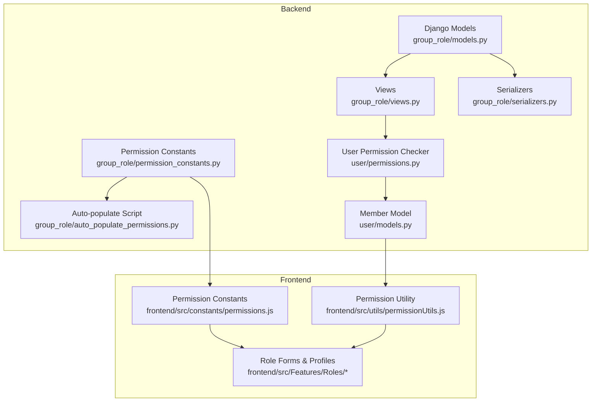

**Diagram sources**
- [models.py](file://backend/group_role/models.py#L33-L140)
- [permission_constants.py](file://backend/group_role/permission_constants.py#L1-L205)
- [auto_populate_permissions.py](file://backend/group_role/auto_populate_permissions.py#L18-L47)
- [views.py](file://backend/group_role/views.py#L1-L567)
- [serializers.py](file://backend/group_role/serializers.py#L1-L580)
- [permissions.py](file://backend/user/permissions.py#L7-L76)
- [models.py](file://backend/user/models.py#L59-L154)
- [permissions.js](file://frontend/src/constants/permissions.js#L1-L283)
- [permissionUtils.js](file://frontend/src/utils/permissionUtils.js#L1-L32)
- [AddRole.jsx](file://frontend/src/Features/Roles/AddRole/AddRole.jsx#L1-L392)
- [RoleProfile.jsx](file://frontend/src/Features/Roles/RoleProfile/RoleProfile.jsx#L1-L373)
- [RoleList.jsx](file://frontend/src/Features/Roles/RoleList/RoleList.jsx#L1-L38)
- [RoleCheck.jsx](file://frontend/src/Features/Roles/RoleCheck/RoleCheck.jsx#L1-L135)

**Section sources**
- [models.py](file://backend/group_role/models.py#L1-L140)
- [permission_constants.py](file://backend/group_role/permission_constants.py#L1-L205)
- [auto_populate_permissions.py](file://backend/group_role/auto_populate_permissions.py#L1-L47)
- [views.py](file://backend/group_role/views.py#L1-L567)
- [serializers.py](file://backend/group_role/serializers.py#L1-L580)
- [permissions.py](file://backend/user/permissions.py#L1-L76)
- [models.py](file://backend/user/models.py#L1-L199)
- [permissions.js](file://frontend/src/constants/permissions.js#L1-L283)
- [permissionUtils.js](file://frontend/src/utils/permissionUtils.js#L1-L32)
- [AddRole.jsx](file://frontend/src/Features/Roles/AddRole/AddRole.jsx#L1-L392)
- [RoleProfile.jsx](file://frontend/src/Features/Roles/RoleProfile/RoleProfile.jsx#L1-L373)
- [RoleList.jsx](file://frontend/src/Features/Roles/RoleList/RoleList.jsx#L1-L38)
- [RoleCheck.jsx](file://frontend/src/Features/Roles/RoleCheck/RoleCheck.jsx#L1-L135)

## Core Components
- Role and Permission Models: Central entities for roles, permissions, role-permission mappings, role-group membership, and group membership.
- Permission Constants: Backend and frontend constants that define permission IDs and categories.
- Serializers: Handle role creation/update, permission assignment, and role profile composition.
- Views: Expose endpoints for CRUD operations and status toggles with permission gating.
- Permission Checker: Django permission class enforcing access based on user’s roles and permissions.
- Frontend Utilities: Permission constants and runtime checks for role-based navigation and UI rendering.
- Role Forms and Profiles: UI components for creating/updating roles, assigning permissions, and viewing role details and members.

**Section sources**
- [models.py](file://backend/group_role/models.py#L33-L140)
- [permission_constants.py](file://backend/group_role/permission_constants.py#L1-L205)
- [serializers.py](file://backend/group_role/serializers.py#L352-L527)
- [views.py](file://backend/group_role/views.py#L260-L444)
- [permissions.py](file://backend/user/permissions.py#L7-L76)
- [permissions.js](file://frontend/src/constants/permissions.js#L1-L283)
- [permissionUtils.js](file://frontend/src/utils/permissionUtils.js#L1-L32)
- [AddRole.jsx](file://frontend/src/Features/Roles/AddRole/AddRole.jsx#L26-L202)
- [RoleProfile.jsx](file://frontend/src/Features/Roles/RoleProfile/RoleProfile.jsx#L17-L66)

## Architecture Overview
The RBAC architecture enforces access control at both the API boundary and the UI level. The backend validates permissions using a custom DRF permission class that consults the member’s effective permission IDs derived from active roles and role-permission mappings. The frontend uses permission constants and a runtime checker to gate navigation and UI elements.

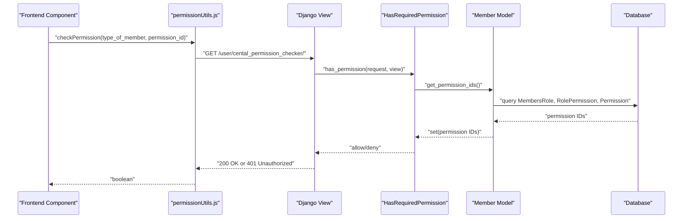

**Diagram sources**
- [permissionUtils.js](file://frontend/src/utils/permissionUtils.js#L11-L31)
- [permissions.py](file://backend/user/permissions.py#L7-L76)
- [models.py](file://backend/user/models.py#L59-L77)
- [views.py](file://backend/group_role/views.py#L44-L50)

## Detailed Component Analysis

### Role and Permission Data Model
The backend defines core entities for RBAC:
- Role: Named entity with description and activation flag.
- Permission: Named permission entity.
- RolePermission: Many-to-many bridge with activation flag and metadata.
- RoleGroup: Links roles to groups with activation flag and metadata.
- Group and GroupMembers: Grouping mechanism for members and roles.
- MembersRole: Assigns roles to members with flags indicating whether the assignment is via group membership.
- GlobalRolePermission: Centralized settings for global defaults and protection flags.

```mermaid
erDiagram
ROLE {
int id PK
string role_name UK
string role_description
boolean is_active
int created_by FK
datetime created_at
int updated_by FK
datetime updated_at
}
PERMISSION {
int id PK
string permission_name
}
ROLE_PERMISSION {
int id PK
int role_id FK
int permission_id FK
boolean is_active
int created_by FK
datetime created_at
int updated_by FK
datetime updated_at
}
ROLE_GROUP {
int id PK
int role_id FK
int group_id FK
boolean is_active
int created_by FK
datetime created_at
int updated_by FK
datetime updated_at
}
GROUP {
int id PK
string group_name UK
string group_description
boolean is_active
int created_by FK
datetime created_at
int updated_by FK
datetime updated_at
}
GROUP_MEMBERS {
int id PK
int member_id FK
int group_id FK
int created_by FK
datetime created_at
int updated_by FK
datetime updated_at
}
MEMBERS_ROLE {
int id PK
int member_id FK
int role_id FK
boolean is_active
boolean is_group
boolean is_member
int created_by FK
datetime created_at
int updated_by FK
datetime updated_at
}
GLOBAL_ROLE_PERMISSION {
int id PK
int permission_id FK UK
string category
string display_name
text description
boolean default_enabled
boolean is_protected
int priority
boolean is_active
int created_by FK
datetime created_at
int updated_by FK
datetime updated_at
}
ROLE ||--o{ ROLE_PERMISSION : "has"
ROLE ||--o{ ROLE_GROUP : "assigned_to"
GROUP ||--o{ ROLE_GROUP : "contains"
GROUP ||--o{ GROUP_MEMBERS : "includes"
MEMBERS_ROLE }o--|| ROLE : "grants"
MEMBERS_ROLE }o--|| GROUP : "via group"
GLOBAL_ROLE_PERMISSION }o--|| PERMISSION : "defines_defaults_for"
```

**Diagram sources**
- [models.py](file://backend/group_role/models.py#L33-L140)

**Section sources**
- [models.py](file://backend/group_role/models.py#L33-L140)

### Permission Constants and Categorization
- Backend constants define numeric IDs and human-readable names for permissions, grouped by functional areas (member management, communications, service fee management, etc.).
- Frontend constants mirror backend IDs and group permissions for UI rendering and runtime checks.
- A communication permissions map consolidates granular permission IDs per module.

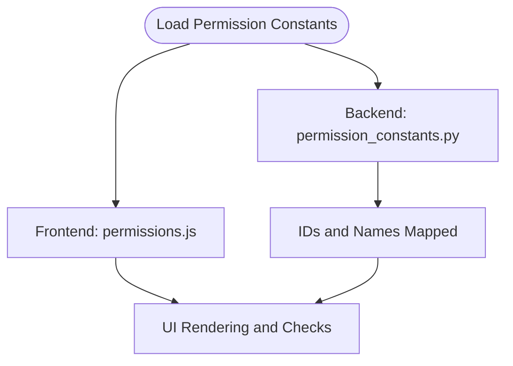

**Diagram sources**
- [permission_constants.py](file://backend/group_role/permission_constants.py#L106-L178)
- [permissions.js](file://frontend/src/constants/permissions.js#L1-L84)
- [permissions.js](file://frontend/src/constants/permissions.js#L109-L283)

**Section sources**
- [permission_constants.py](file://backend/group_role/permission_constants.py#L1-L205)
- [permissions.js](file://frontend/src/constants/permissions.js#L1-L283)

### Role Creation and Management Workflow
- Role creation: Serializers validate uniqueness and persist role with creator metadata; permissions are attached via RolePermission records.
- Role update: Permissions can be added or removed; serializer computes deltas and applies changes atomically.
- Role status toggle: Toggles activation and cascades updates to dependent records.

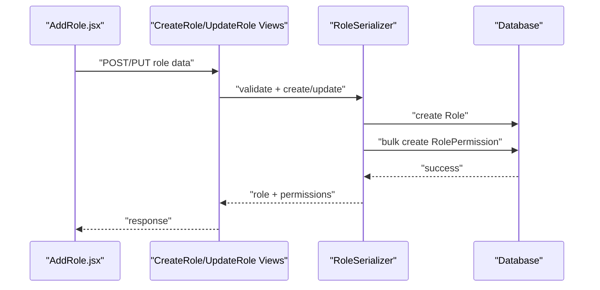

**Diagram sources**
- [AddRole.jsx](file://frontend/src/Features/Roles/AddRole/AddRole.jsx#L124-L162)
- [views.py](file://backend/group_role/views.py#L260-L433)
- [serializers.py](file://backend/group_role/serializers.py#L429-L527)

**Section sources**
- [serializers.py](file://backend/group_role/serializers.py#L352-L527)
- [views.py](file://backend/group_role/views.py#L260-L433)
- [AddRole.jsx](file://frontend/src/Features/Roles/AddRole/AddRole.jsx#L26-L162)

### Permission Checking Mechanisms
- Backend: A custom DRF permission class checks if a user has the required permission IDs. It supports special cases for community members and organization members, and resolves effective permissions from active roles.
- Frontend: A runtime utility checks centralized permission endpoints and handles unauthorized responses by logging out and clearing local state.

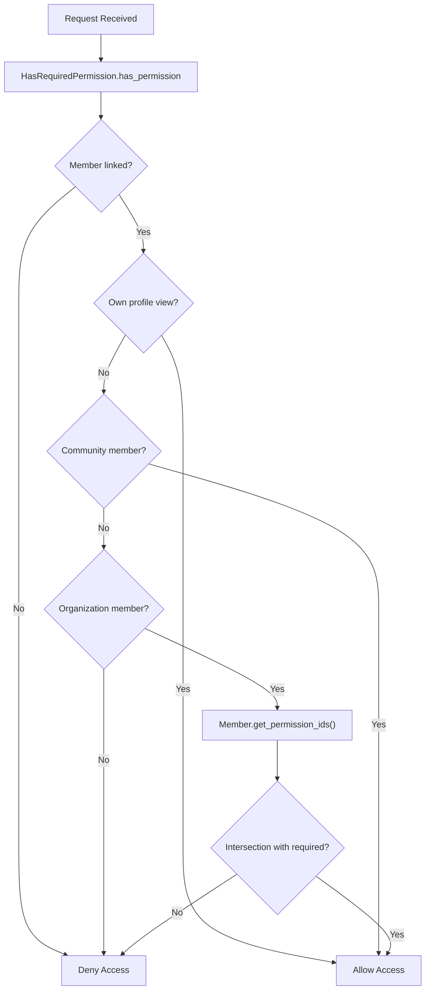

**Diagram sources**
- [permissions.py](file://backend/user/permissions.py#L7-L76)
- [models.py](file://backend/user/models.py#L59-L77)

**Section sources**
- [permissions.py](file://backend/user/permissions.py#L7-L76)
- [models.py](file://backend/user/models.py#L59-L77)
- [permissionUtils.js](file://frontend/src/utils/permissionUtils.js#L11-L31)

### Role Validation Workflows
- Role name uniqueness is enforced by a validator in the serializer.
- Permission IDs are validated against existing Permission records during role creation/update.
- Group and member associations are validated and reconciled during group creation/update.

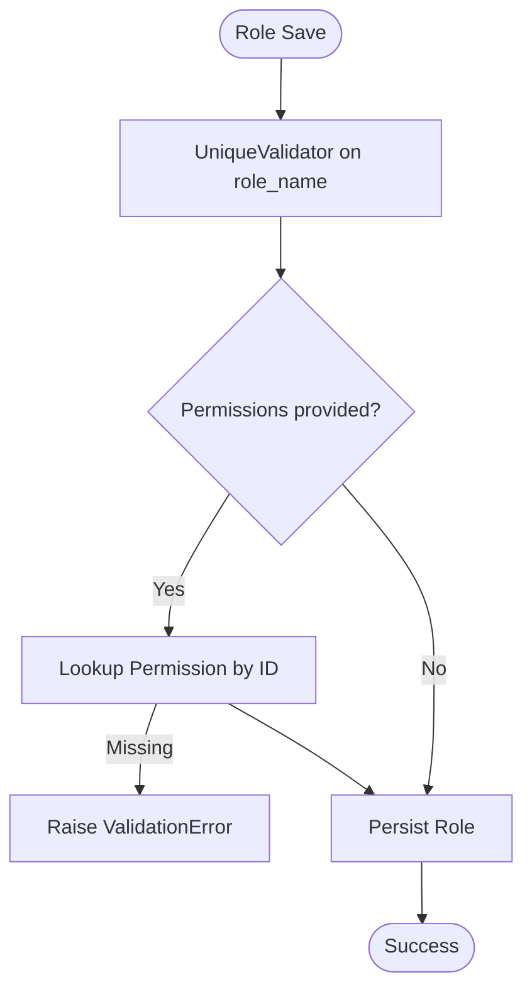

**Diagram sources**
- [serializers.py](file://backend/group_role/serializers.py#L355-L367)
- [serializers.py](file://backend/group_role/serializers.py#L451-L462)
- [serializers.py](file://backend/group_role/serializers.py#L511-L522)

**Section sources**
- [serializers.py](file://backend/group_role/serializers.py#L352-L527)

### Role Profile System
- Role details include role name, description, and computed fields: selected permissions, all permissions, and assigned members.
- Assigned members are de-duplicated and serialized for display.
- The profile UI renders permissions grouped by functional categories and paginates assigned members.

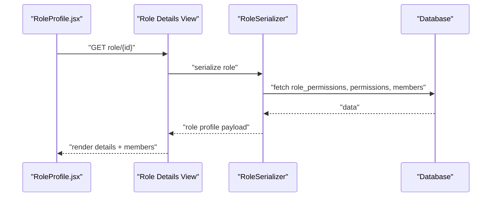

**Diagram sources**
- [RoleProfile.jsx](file://frontend/src/Features/Roles/RoleProfile/RoleProfile.jsx#L37-L53)
- [serializers.py](file://backend/group_role/serializers.py#L400-L428)

**Section sources**
- [serializers.py](file://backend/group_role/serializers.py#L400-L428)
- [RoleProfile.jsx](file://frontend/src/Features/Roles/RoleProfile/RoleProfile.jsx#L72-L206)

### Role Assignment Workflows (Users and Groups)
- Users: Members can be assigned roles via MembersRole entries. Flags indicate whether the assignment is via group membership.
- Groups: Groups can be linked to roles via RoleGroup, and membership via GroupMembers. Updates reconcile removed associations and recreate current ones.

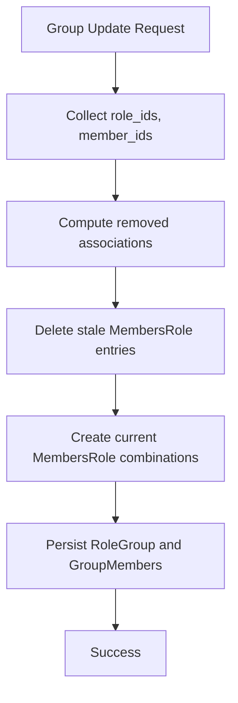

**Diagram sources**
- [serializers.py](file://backend/group_role/serializers.py#L128-L209)

**Section sources**
- [serializers.py](file://backend/group_role/serializers.py#L128-L209)

### Permission Constants Usage Across the Application
- Backend: permission_constants.py drives auto-population of Permission records and provides ID-to-name mappings for UI and logging.
- Frontend: permissions.js mirrors IDs and groups permissions for UI rendering and runtime checks.
- Auto-populate script ensures database parity with constants.

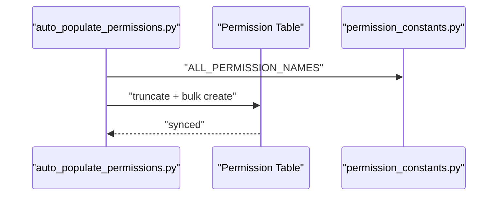

**Diagram sources**
- [auto_populate_permissions.py](file://backend/group_role/auto_populate_permissions.py#L18-L47)
- [permission_constants.py](file://backend/group_role/permission_constants.py#L180-L181)

**Section sources**
- [permission_constants.py](file://backend/group_role/permission_constants.py#L106-L178)
- [permissions.js](file://frontend/src/constants/permissions.js#L1-L84)
- [auto_populate_permissions.py](file://backend/group_role/auto_populate_permissions.py#L18-L47)

### Examples of Role-Based Navigation and Enforcement
- Role list and profile pages enforce permission checks before rendering.
- Role creation/edit forms gate actions based on permission IDs.
- Runtime permission checks redirect unauthorized users to a not-authorized route.

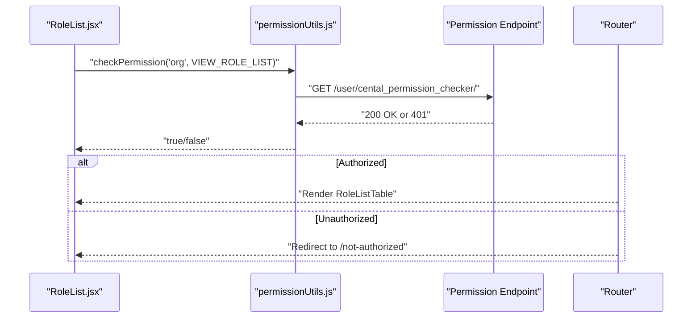

**Diagram sources**
- [RoleList.jsx](file://frontend/src/Features/Roles/RoleList/RoleList.jsx#L12-L25)
- [permissionUtils.js](file://frontend/src/utils/permissionUtils.js#L11-L31)

**Section sources**
- [RoleList.jsx](file://frontend/src/Features/Roles/RoleList/RoleList.jsx#L1-L38)
- [AddRole.jsx](file://frontend/src/Features/Roles/AddRole/AddRole.jsx#L56-L65)
- [RoleProfile.jsx](file://frontend/src/Features/Roles/RoleProfile/RoleProfile.jsx#L38-L46)
- [permissionUtils.js](file://frontend/src/utils/permissionUtils.js#L11-L31)

## Dependency Analysis
- Backend depends on Member.get_permission_ids to resolve effective permissions.
- Views rely on HasRequiredPermission to enforce access control.
- Frontend constants and runtime checks depend on backend permission IDs and endpoints.
- Auto-populate script ensures database permissions align with constants.

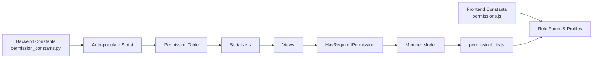

**Diagram sources**
- [permissions.js](file://frontend/src/constants/permissions.js#L1-L84)
- [permission_constants.py](file://backend/group_role/permission_constants.py#L106-L178)
- [auto_populate_permissions.py](file://backend/group_role/auto_populate_permissions.py#L18-L47)
- [serializers.py](file://backend/group_role/serializers.py#L429-L527)
- [views.py](file://backend/group_role/views.py#L260-L433)
- [permissions.py](file://backend/user/permissions.py#L7-L76)
- [models.py](file://backend/user/models.py#L59-L77)
- [permissionUtils.js](file://frontend/src/utils/permissionUtils.js#L11-L31)

**Section sources**
- [models.py](file://backend/user/models.py#L59-L77)
- [permissions.py](file://backend/user/permissions.py#L7-L76)
- [serializers.py](file://backend/group_role/serializers.py#L429-L527)
- [views.py](file://backend/group_role/views.py#L260-L433)
- [permission_constants.py](file://backend/group_role/permission_constants.py#L106-L178)
- [permissions.js](file://frontend/src/constants/permissions.js#L1-L84)
- [permissionUtils.js](file://frontend/src/utils/permissionUtils.js#L11-L31)

## Performance Considerations
- Permission resolution uses joins across MembersRole, RolePermission, and Permission tables. Ensure appropriate indexing on foreign keys and frequently filtered fields.
- Group updates perform deletions and recreations of associations; batching and atomic transactions minimize inconsistency but can be costly for large datasets—consider incremental reconciliation for very large groups.
- Frontend permission checks are lightweight but should be cached locally to reduce repeated network calls.

## Troubleshooting Guide
- Permission mismatch: Verify backend permission constants and auto-populated Permission records are in sync.
- Unauthorized access: Confirm HasRequiredPermission is applied to protected views and that Member.get_permission_ids returns expected IDs.
- Frontend redirects: If runtime checks fail, the utility logs out and clears local storage; ensure the centralized permission endpoint is reachable.

**Section sources**
- [auto_populate_permissions.py](file://backend/group_role/auto_populate_permissions.py#L18-L47)
- [permissions.py](file://backend/user/permissions.py#L7-L76)
- [permissionUtils.js](file://frontend/src/utils/permissionUtils.js#L11-L31)

## Conclusion
The RBAC system combines backend-driven permission enforcement with frontend-friendly constants and runtime checks. It supports robust role creation, permission assignment, and role profiles while ensuring secure access control across the application.

## Appendices

### Permission Categories and IDs (Summary)
- Member Management: Create/Edit/View roles and groups, manage contacts.
- Tower & Unit Management: Manage towers, units, ownership, residents, staff.
- Communications: Announcements, bulletin board, notice board.
- Service Fee Management: Settings, overview, payments, reminders, billing, bill categories, uploads.
- Settings: Company settings.
- Chart of Accounts: View/add/edit accounts.

**Section sources**
- [permission_constants.py](file://backend/group_role/permission_constants.py#L106-L178)
- [permissions.js](file://frontend/src/constants/permissions.js#L109-L283)