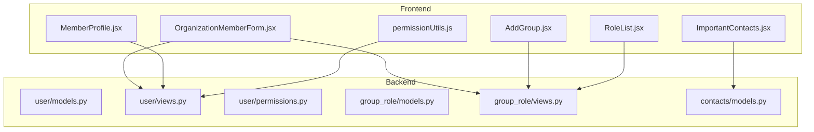
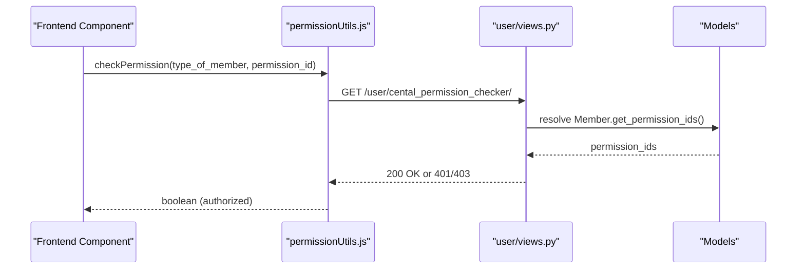
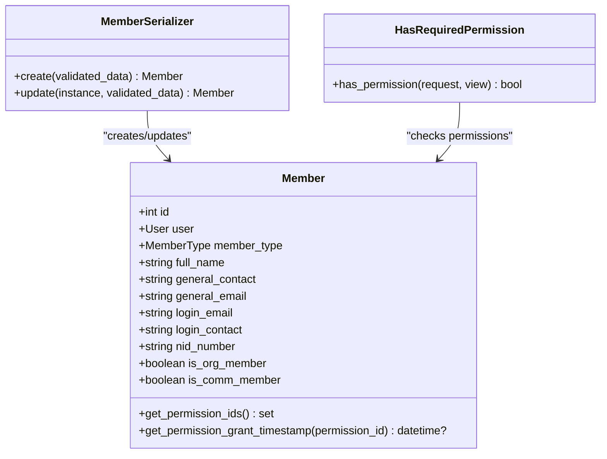
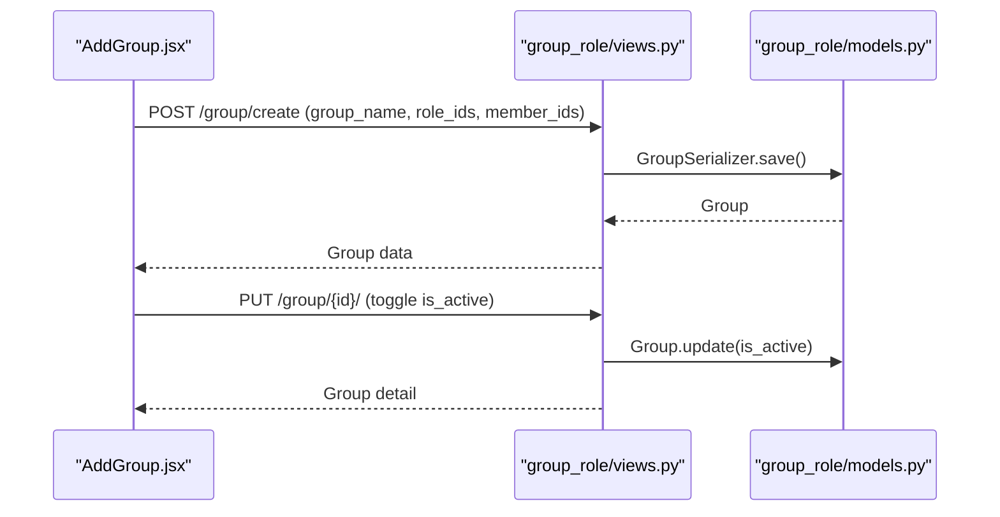
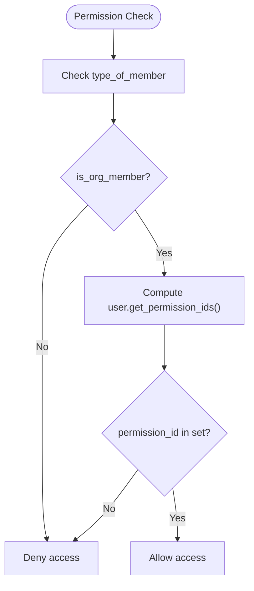
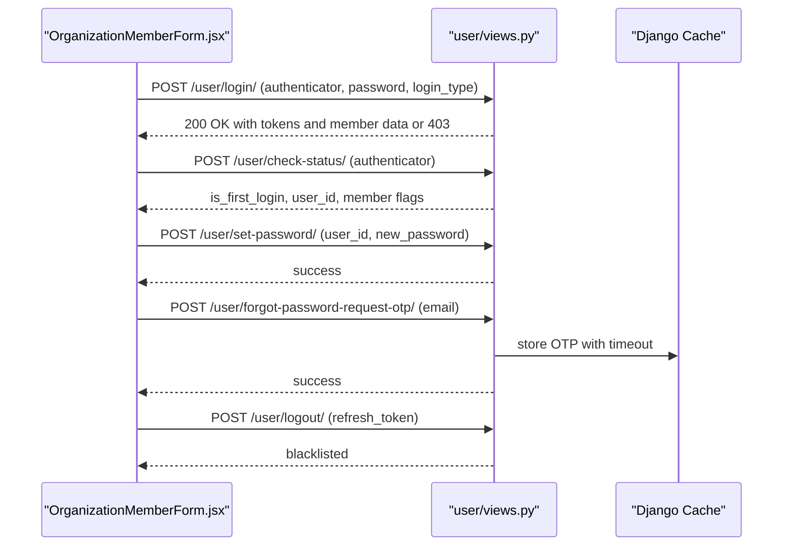
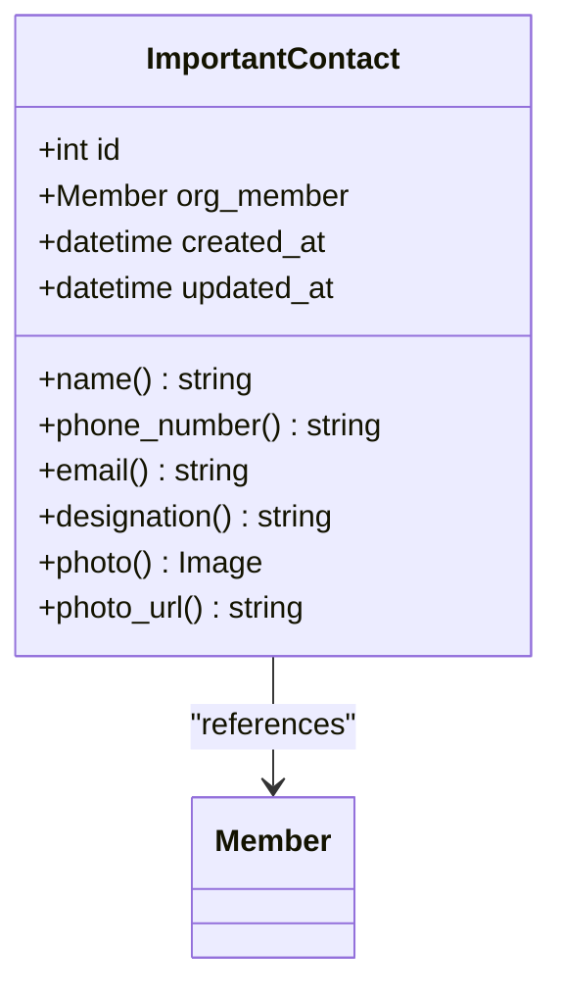
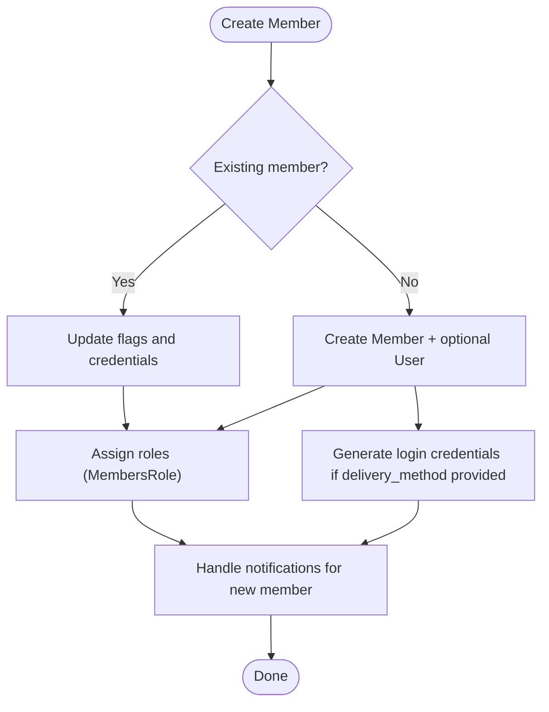
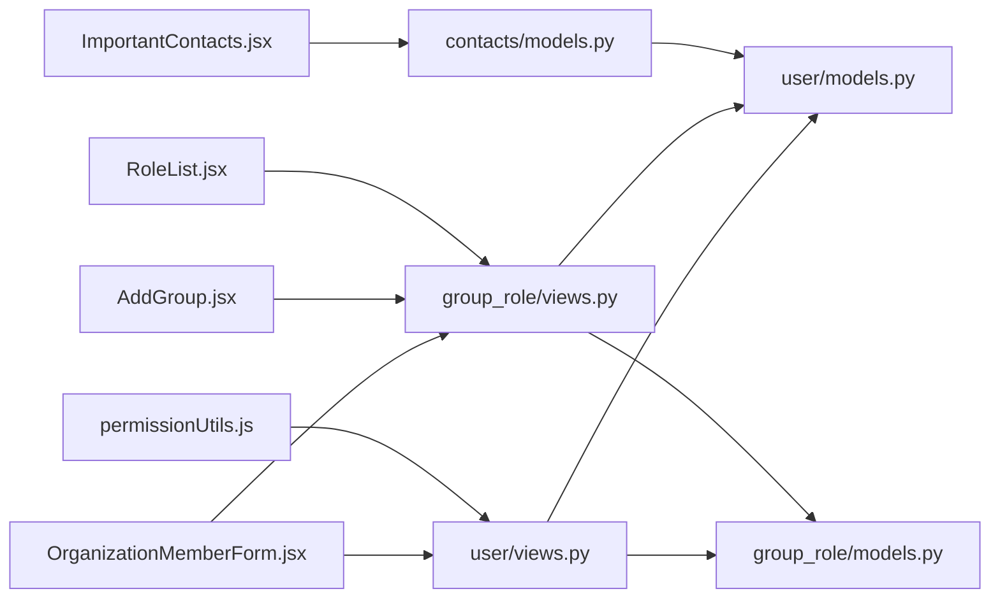

# User Management

<cite>
**Referenced Files in This Document**
- [backend/user/models.py](file://backend/user/models.py)
- [backend/user/views.py](file://backend/user/views.py)
- [backend/user/permissions.py](file://backend/user/permissions.py)
- [backend/user/serializers.py](file://backend/user/serializers.py)
- [backend/group_role/models.py](file://backend/group_role/models.py)
- [backend/group_role/views.py](file://backend/group_role/views.py)
- [backend/contacts/models.py](file://backend/contacts/models.py)
- [frontend/src/Features/Members/OrganizationMemberForm/OrganizationMemberForm.jsx](file://frontend/src/Features/Members/OrganizationMemberForm/OrganizationMemberForm.jsx)
- [frontend/src/Features/Members/MemberProfile/MemberProfile.jsx](file://frontend/src/Features/Members/MemberProfile/MemberProfile.jsx)
- [frontend/src/Features/Groups/AddGroup/AddGroup.jsx](file://frontend/src/Features/Groups/AddGroup/AddGroup.jsx)
- [frontend/src/Features/Roles/RoleList/RoleList.jsx](file://frontend/src/Features/Roles/RoleList/RoleList.jsx)
- [frontend/src/Features/Contacts/ImportantContacts.jsx](file://frontend/src/Features/Contacts/ImportantContacts.jsx)
- [frontend/src/utils/permissionUtils.js](file://frontend/src/utils/permissionUtils.js)
</cite>

## Table of Contents
1. [Introduction](#introduction)
2. [Project Structure](#project-structure)
3. [Core Components](#core-components)
4. [Architecture Overview](#architecture-overview)
5. [Detailed Component Analysis](#detailed-component-analysis)
6. [Dependency Analysis](#dependency-analysis)
7. [Performance Considerations](#performance-considerations)
8. [Troubleshooting Guide](#troubleshooting-guide)
9. [Conclusion](#conclusion)

## Introduction
This document describes the user management feature modules of the Estate Link platform. It covers:
- Member management for community members, organization members, and staff members
- Profiles, forms, and editing capabilities
- Group management for creating and managing organizational groups
- Role-based access control (RBAC) including role assignment, permission checking, and role profiles
- Login credential management for both organization and community members
- Important contacts system for emergency and communication purposes
- Member import workflows and Excel upload integration
- Examples of member workflows, validation patterns, and integration with the permission system

## Project Structure
The user management system spans both the backend Django REST framework and the frontend React application:
- Backend modules:
  - user: member profiles, login, credentials, and permission integration
  - group_role: groups, roles, permissions, and role-to-group membership
  - contacts: important contacts for organization members
- Frontend modules:
  - Members: forms, profiles, role/permission assignment
  - Groups: group creation and management
  - Roles: role listing and permissions
  - Contacts: important contacts management
  - Utilities: centralized permission checking

**Diagram sources**
- [backend/user/models.py](file://backend/user/models.py#L15-L171)
- [backend/user/views.py](file://backend/user/views.py#L60-L78)
- [backend/user/permissions.py](file://backend/user/permissions.py#L7-L76)
- [backend/group_role/models.py](file://backend/group_role/models.py#L7-L94)
- [backend/group_role/views.py](file://backend/group_role/views.py#L17-L43)
- [backend/contacts/models.py](file://backend/contacts/models.py#L7-L95)
- [frontend/src/Features/Members/OrganizationMemberForm/OrganizationMemberForm.jsx](file://frontend/src/Features/Members/OrganizationMemberForm/OrganizationMemberForm.jsx#L50-L765)
- [frontend/src/Features/Members/MemberProfile/MemberProfile.jsx](file://frontend/src/Features/Members/MemberProfile/MemberProfile.jsx#L1-L327)
- [frontend/src/Features/Groups/AddGroup/AddGroup.jsx](file://frontend/src/Features/Groups/AddGroup/AddGroup.jsx#L37-L525)
- [frontend/src/Features/Roles/RoleList/RoleList.jsx](file://frontend/src/Features/Roles/RoleList/RoleList.jsx#L1-L38)
- [frontend/src/Features/Contacts/ImportantContacts.jsx](file://frontend/src/Features/Contacts/ImportantContacts.jsx#L1-L241)
- [frontend/src/utils/permissionUtils.js](file://frontend/src/utils/permissionUtils.js#L11-L32)

**Section sources**
- [backend/user/models.py](file://backend/user/models.py#L15-L171)
- [backend/group_role/models.py](file://backend/group_role/models.py#L7-L94)
- [backend/contacts/models.py](file://backend/contacts/models.py#L7-L95)
- [frontend/src/Features/Members/OrganizationMemberForm/OrganizationMemberForm.jsx](file://frontend/src/Features/Members/OrganizationMemberForm/OrganizationMemberForm.jsx#L50-L765)
- [frontend/src/Features/Groups/AddGroup/AddGroup.jsx](file://frontend/src/Features/Groups/AddGroup/AddGroup.jsx#L37-L525)
- [frontend/src/Features/Roles/RoleList/RoleList.jsx](file://frontend/src/Features/Roles/RoleList/RoleList.jsx#L1-L38)
- [frontend/src/Features/Contacts/ImportantContacts.jsx](file://frontend/src/Features/Contacts/ImportantContacts.jsx#L1-L241)
- [frontend/src/utils/permissionUtils.js](file://frontend/src/utils/permissionUtils.js#L11-L32)

## Core Components
- Member model and permissions:
  - Member encapsulates personal and login credentials, member type, and flags for organization/community membership.
  - Provides methods to compute effective permissions from roles and track permission grant timestamps.
- RBAC models:
  - Groups, Roles, Permissions, RoleGroup, MembersRole, and GlobalRolePermission define the hierarchical permission system.
- User management APIs:
  - Central permission checker, member listing/search, details, status change, creation, updates, login, logout, password reset.
- Frontend member and group management:
  - Organization member creation form with tabs for personal info, member type/role, and login credentials.
  - Group creation/edit with role and member assignment.
  - Role listing and permission checks.
  - Important contacts management for organization members.

**Section sources**
- [backend/user/models.py](file://backend/user/models.py#L15-L171)
- [backend/group_role/models.py](file://backend/group_role/models.py#L7-L94)
- [backend/user/views.py](file://backend/user/views.py#L60-L78)
- [frontend/src/Features/Members/OrganizationMemberForm/OrganizationMemberForm.jsx](file://frontend/src/Features/Members/OrganizationMemberForm/OrganizationMemberForm.jsx#L50-L765)
- [frontend/src/Features/Groups/AddGroup/AddGroup.jsx](file://frontend/src/Features/Groups/AddGroup/AddGroup.jsx#L37-L525)
- [frontend/src/Features/Roles/RoleList/RoleList.jsx](file://frontend/src/Features/Roles/RoleList/RoleList.jsx#L1-L38)
- [frontend/src/Features/Contacts/ImportantContacts.jsx](file://frontend/src/Features/Contacts/ImportantContacts.jsx#L1-L241)

## Architecture Overview
The system integrates frontend UI with backend APIs and database models:
- Frontend components call permission utilities to gate access to protected screens.
- Member creation/updating uses serializers that handle user account creation, credential delivery, and role assignments.
- RBAC is enforced via a custom permission class that consults member permission IDs and member type flags.
- Groups and roles are managed through dedicated views with permission gating.

**Diagram sources**
- [frontend/src/utils/permissionUtils.js](file://frontend/src/utils/permissionUtils.js#L11-L32)
- [backend/user/views.py](file://backend/user/views.py#L60-L78)
- [backend/user/models.py](file://backend/user/models.py#L59-L77)

**Section sources**
- [frontend/src/utils/permissionUtils.js](file://frontend/src/utils/permissionUtils.js#L11-L32)
- [backend/user/views.py](file://backend/user/views.py#L60-L78)
- [backend/user/models.py](file://backend/user/models.py#L59-L77)

## Detailed Component Analysis

### Member Management System
- Member model:
  - Stores personal info, login credentials, member type, and membership flags.
  - Provides permission computation and permission grant timestamp tracking.
- Member APIs:
  - Central permission checker validates member type and permission IDs.
  - Member listing supports filtering by type and member type IDs.
  - Member details aggregates owner/resident/staff associations.
  - Status change toggles org/comm membership flags.
  - Create/update endpoints handle NID uniqueness, photos, and role assignments.
- Frontend:
  - Organization member form with multi-tab workflow: personal info, member type/role, login credentials.
  - Member profile displays roles, groups, and related tower/unit info.

**Diagram sources**
- [backend/user/models.py](file://backend/user/models.py#L15-L171)
- [backend/user/serializers.py](file://backend/user/serializers.py#L125-L792)
- [backend/user/permissions.py](file://backend/user/permissions.py#L7-L76)

**Section sources**
- [backend/user/models.py](file://backend/user/models.py#L15-L171)
- [backend/user/views.py](file://backend/user/views.py#L98-L279)
- [backend/user/serializers.py](file://backend/user/serializers.py#L125-L792)
- [frontend/src/Features/Members/OrganizationMemberForm/OrganizationMemberForm.jsx](file://frontend/src/Features/Members/OrganizationMemberForm/OrganizationMemberForm.jsx#L50-L765)
- [frontend/src/Features/Members/MemberProfile/MemberProfile.jsx](file://frontend/src/Features/Members/MemberProfile/MemberProfile.jsx#L1-L327)

### Group Management
- Group model and membership:
  - Groups link to roles and members via RoleGroup and GroupMembers.
- Group APIs:
  - Create, list, detail, update, status change, and member assignment endpoints.
  - Member assignment supports filters by member type, role, and search.
- Frontend:
  - Add/Edit group screen with role checkboxes, description, and member assignment table.

**Diagram sources**
- [backend/group_role/views.py](file://backend/group_role/views.py#L17-L43)
- [backend/group_role/views.py](file://backend/group_role/views.py#L98-L133)
- [backend/group_role/models.py](file://backend/group_role/models.py#L7-L94)
- [frontend/src/Features/Groups/AddGroup/AddGroup.jsx](file://frontend/src/Features/Groups/AddGroup/AddGroup.jsx#L335-L372)

**Section sources**
- [backend/group_role/models.py](file://backend/group_role/models.py#L7-L94)
- [backend/group_role/views.py](file://backend/group_role/views.py#L17-L173)
- [frontend/src/Features/Groups/AddGroup/AddGroup.jsx](file://frontend/src/Features/Groups/AddGroup/AddGroup.jsx#L37-L525)

### Role-Based Access Control (RBAC)
- Models:
  - Role, Permission, RolePermission, RoleGroup, MembersRole, GlobalRolePermission.
- Permission enforcement:
  - Central permission checker endpoint and HasRequiredPermission class enforce access per member type and permission IDs.
- Frontend:
  - Role listing and permission checks via permission utilities.

**Diagram sources**
- [backend/user/views.py](file://backend/user/views.py#L60-L78)
- [backend/user/permissions.py](file://backend/user/permissions.py#L7-L76)
- [backend/user/models.py](file://backend/user/models.py#L59-L77)
- [frontend/src/utils/permissionUtils.js](file://frontend/src/utils/permissionUtils.js#L11-L32)

**Section sources**
- [backend/group_role/models.py](file://backend/group_role/models.py#L47-L139)
- [backend/user/views.py](file://backend/user/views.py#L60-L78)
- [backend/user/permissions.py](file://backend/user/permissions.py#L7-L76)
- [frontend/src/Features/Roles/RoleList/RoleList.jsx](file://frontend/src/Features/Roles/RoleList/RoleList.jsx#L1-L38)
- [frontend/src/utils/permissionUtils.js](file://frontend/src/utils/permissionUtils.js#L11-L32)

### Login Credential Management
- Backend:
  - Login accepts username/email/phone and login type (org/comm).
  - First-time login triggers password reset flow.
  - Logout invalidates refresh tokens.
  - Forgot password OTP flow stores OTP in cache and sends HTML email.
- Frontend:
  - Organization member form integrates login credential step with validation and submission.

**Diagram sources**
- [backend/user/views.py](file://backend/user/views.py#L603-L732)
- [backend/user/views.py](file://backend/user/views.py#L740-L800)
- [frontend/src/Features/Members/OrganizationMemberForm/OrganizationMemberForm.jsx](file://frontend/src/Features/Members/OrganizationMemberForm/OrganizationMemberForm.jsx#L729-L740)

**Section sources**
- [backend/user/views.py](file://backend/user/views.py#L603-L732)
- [backend/user/views.py](file://backend/user/views.py#L740-L800)
- [frontend/src/Features/Members/OrganizationMemberForm/OrganizationMemberForm.jsx](file://frontend/src/Features/Members/OrganizationMemberForm/OrganizationMemberForm.jsx#L729-L740)

### Important Contacts System
- Model enforces that only organization members can be added as important contacts.
- Properties expose name, phone, email, designation, and photo derived from the Member record.
- Frontend provides a form to add and a table to list/delete contacts.

**Diagram sources**
- [backend/contacts/models.py](file://backend/contacts/models.py#L7-L95)

**Section sources**
- [backend/contacts/models.py](file://backend/contacts/models.py#L7-L95)
- [frontend/src/Features/Contacts/ImportantContacts.jsx](file://frontend/src/Features/Contacts/ImportantContacts.jsx#L1-L241)

### Member Import and Excel Upload
- Backend:
  - Member creation endpoints support creating organization and community members, assigning member types and roles, and generating login credentials.
  - Validation includes NID uniqueness, contact/email uniqueness, and cross-unit uniqueness constraints.
- Frontend:
  - Organization member form integrates with existing community member selection and handles autofill and file previews.
  - The form supports multi-tab navigation and validation before proceeding to the next step.

**Diagram sources**
- [backend/user/views.py](file://backend/user/views.py#L345-L442)
- [backend/user/views.py](file://backend/user/views.py#L443-L551)
- [backend/user/serializers.py](file://backend/user/serializers.py#L301-L482)
- [frontend/src/Features/Members/OrganizationMemberForm/OrganizationMemberForm.jsx](file://frontend/src/Features/Members/OrganizationMemberForm/OrganizationMemberForm.jsx#L318-L472)

**Section sources**
- [backend/user/views.py](file://backend/user/views.py#L345-L551)
- [backend/user/serializers.py](file://backend/user/serializers.py#L301-L482)
- [frontend/src/Features/Members/OrganizationMemberForm/OrganizationMemberForm.jsx](file://frontend/src/Features/Members/OrganizationMemberForm/OrganizationMemberForm.jsx#L318-L472)

### Member Workflows and Validation Patterns
- Member creation:
  - Validates uniqueness of NID and login credentials across units.
  - Normalizes email and date formats.
  - Generates low-resolution profile images.
- Member update:
  - Supports selective removal of NID front/back and photo.
  - Validates date format and role assignment changes.
- Group and role assignment:
  - Select-all and per-role assignment with change tracking.
  - Status toggling updates related RoleGroup and MembersRole records.

**Section sources**
- [backend/user/serializers.py](file://backend/user/serializers.py#L142-L221)
- [backend/user/serializers.py](file://backend/user/serializers.py#L482-L792)
- [backend/group_role/views.py](file://backend/group_role/views.py#L175-L243)
- [frontend/src/Features/Groups/AddGroup/AddGroup.jsx](file://frontend/src/Features/Groups/AddGroup/AddGroup.jsx#L239-L318)

## Dependency Analysis
- Backend dependencies:
  - user/views depend on user/models and group_role models for permission computation.
  - group_role/views depend on group_role/models and user/models for audit trails and member context.
  - contacts/models depends on user/models for organization member references.
- Frontend dependencies:
  - Organization member form depends on permission utilities and Redux slices for roles and member types.
  - Group management depends on role and member data retrieval.
  - Role listing depends on permission checks.

**Diagram sources**
- [backend/user/views.py](file://backend/user/views.py#L1-L800)
- [backend/user/models.py](file://backend/user/models.py#L1-L199)
- [backend/group_role/views.py](file://backend/group_role/views.py#L1-L567)
- [backend/group_role/models.py](file://backend/group_role/models.py#L1-L140)
- [backend/contacts/models.py](file://backend/contacts/models.py#L1-L95)
- [frontend/src/Features/Members/OrganizationMemberForm/OrganizationMemberForm.jsx](file://frontend/src/Features/Members/OrganizationMemberForm/OrganizationMemberForm.jsx#L1-L765)
- [frontend/src/Features/Groups/AddGroup/AddGroup.jsx](file://frontend/src/Features/Groups/AddGroup/AddGroup.jsx#L1-L525)
- [frontend/src/Features/Roles/RoleList/RoleList.jsx](file://frontend/src/Features/Roles/RoleList/RoleList.jsx#L1-L38)
- [frontend/src/Features/Contacts/ImportantContacts.jsx](file://frontend/src/Features/Contacts/ImportantContacts.jsx#L1-L241)
- [frontend/src/utils/permissionUtils.js](file://frontend/src/utils/permissionUtils.js#L1-L32)

**Section sources**
- [backend/user/views.py](file://backend/user/views.py#L1-L800)
- [backend/group_role/views.py](file://backend/group_role/views.py#L1-L567)
- [backend/contacts/models.py](file://backend/contacts/models.py#L1-L95)
- [frontend/src/Features/Members/OrganizationMemberForm/OrganizationMemberForm.jsx](file://frontend/src/Features/Members/OrganizationMemberForm/OrganizationMemberForm.jsx#L1-L765)
- [frontend/src/Features/Groups/AddGroup/AddGroup.jsx](file://frontend/src/Features/Groups/AddGroup/AddGroup.jsx#L1-L525)
- [frontend/src/Features/Roles/RoleList/RoleList.jsx](file://frontend/src/Features/Roles/RoleList/RoleList.jsx#L1-L38)
- [frontend/src/Features/Contacts/ImportantContacts.jsx](file://frontend/src/Features/Contacts/ImportantContacts.jsx#L1-L241)
- [frontend/src/utils/permissionUtils.js](file://frontend/src/utils/permissionUtils.js#L1-L32)

## Performance Considerations
- Permission computation:
  - Permission IDs are fetched via joins across MembersRole, Role, RolePermission, and Permission. Consider caching permission sets per member for frequent checks.
- Image processing:
  - Low-quality image generation occurs during member creation/update. Offload heavy resizing to background tasks if needed.
- Group member listing:
  - Filtering by role and member type uses multiple queries; consider denormalization or composite indexes for large datasets.
- Frontend:
  - Permission checks are asynchronous; batch requests where possible and debounce repeated checks.

## Troubleshooting Guide
- Permission denied:
  - Central permission checker returns 401 for unauthorized access; the frontend logs out and redirects to login.
- Login failures:
  - Invalid credentials return 400; ensure authenticator matches email/phone/username and login type matches member flags.
- OTP issues:
  - OTP cache stores OTP with validity and resend limits; verify cache backend availability and email delivery.
- Role assignment conflicts:
  - Updating roles preserves group-derived roles and only adds newly requested member-assigned roles; verify role deletion logic for is_member vs is_group flags.

**Section sources**
- [frontend/src/utils/permissionUtils.js](file://frontend/src/utils/permissionUtils.js#L11-L32)
- [backend/user/views.py](file://backend/user/views.py#L603-L659)
- [backend/user/views.py](file://backend/user/views.py#L740-L800)
- [backend/user/serializers.py](file://backend/user/serializers.py#L632-L686)

## Conclusion
The user management system provides a robust foundation for managing members, groups, roles, and permissions across organization and community contexts. The backend offers strong validation, permission enforcement, and audit-ready operations, while the frontend delivers intuitive forms and permission-gated workflows. Extending import capabilities and optimizing permission caching would further improve scalability and user experience.