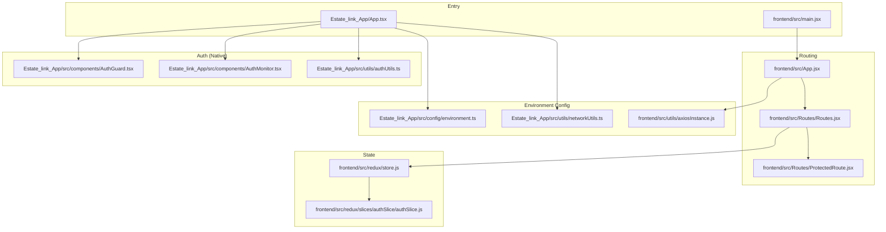
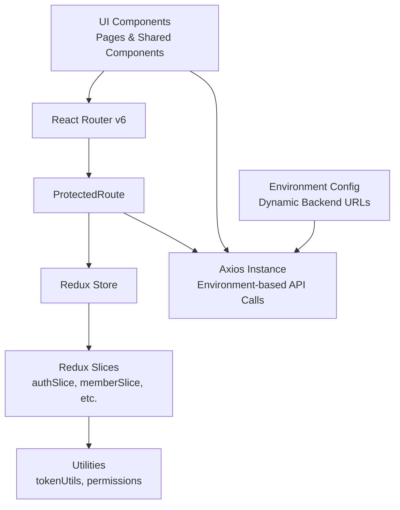
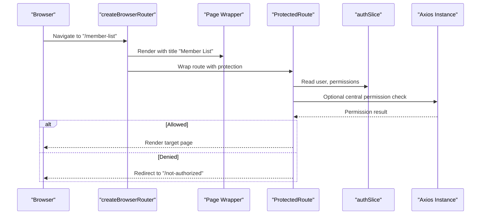
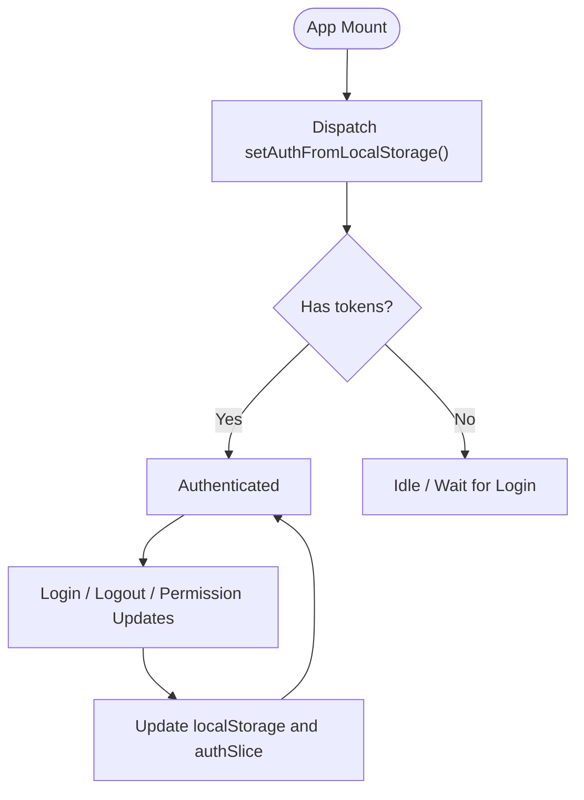
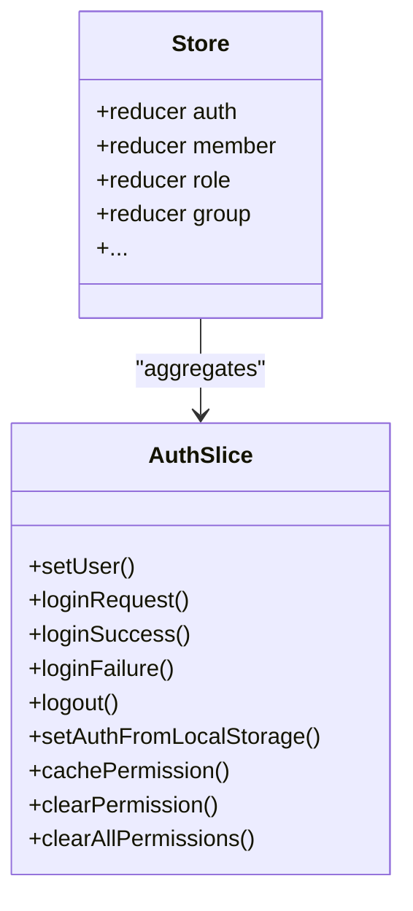
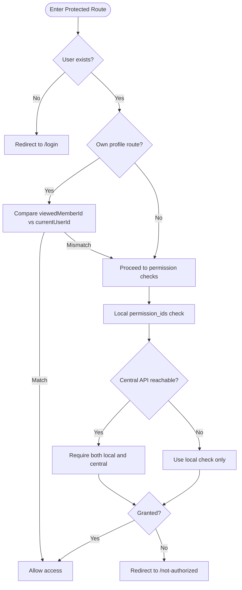
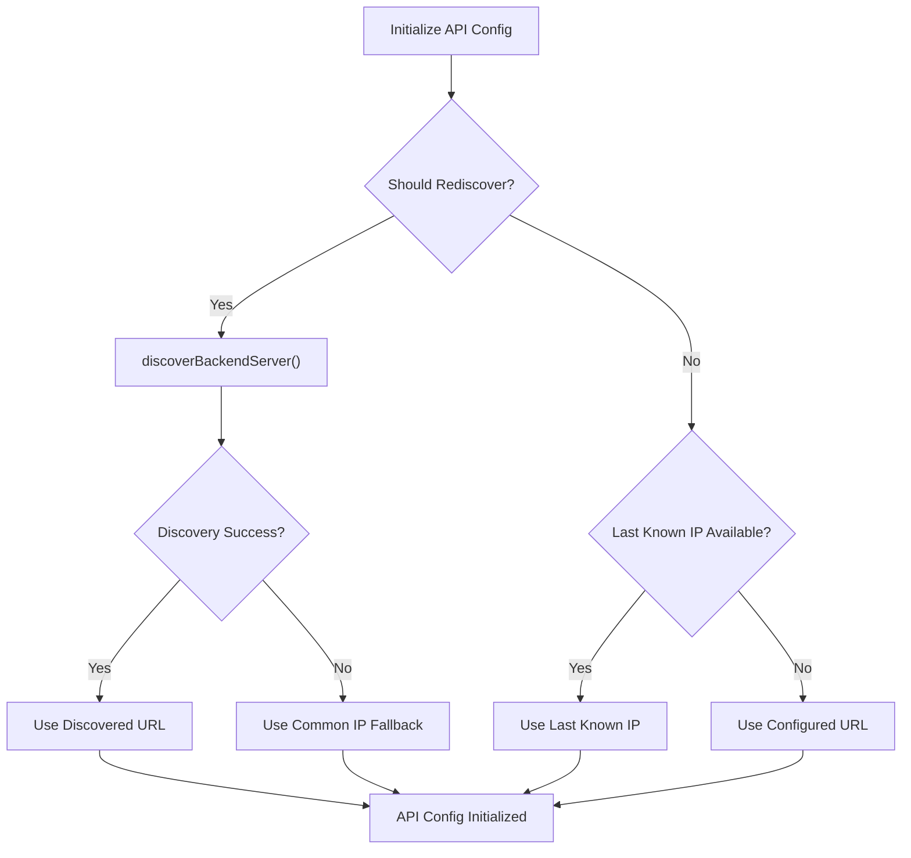
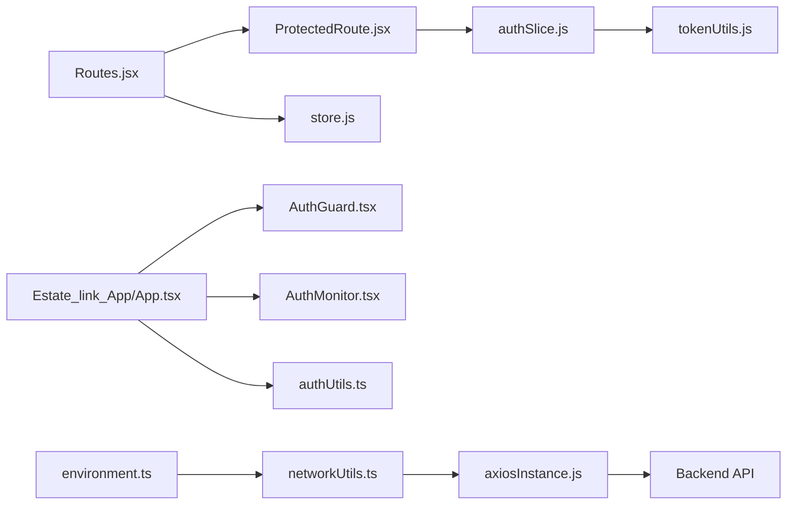

# Frontend Application

<cite>
**Referenced Files in This Document**
- [App.tsx](file://Estate_link_App/App.tsx)
- [main.jsx](file://frontend/src/main.jsx)
- [App.jsx](file://frontend/src/App.jsx)
- [Routes.jsx](file://frontend/src/Routes/Routes.jsx)
- [ProtectedRoute.jsx](file://frontend/src/Routes/ProtectedRoute.jsx)
- [store.js](file://frontend/src/redux/store.js)
- [authSlice.js](file://frontend/src/redux/slices/authSlice/authSlice.js)
- [AuthGuard.tsx](file://Estate_link_App/src/components/AuthGuard.tsx)
- [AuthMonitor.tsx](file://Estate_link_App/src/components/AuthMonitor.tsx)
- [authUtils.ts](file://Estate_link_App/src/utils/authUtils.ts)
- [environment.ts](file://Estate_link_App/src/config/environment.ts)
- [networkUtils.ts](file://Estate_link_App/src/utils/networkUtils.ts)
- [axiosInstance.js](file://frontend/src/utils/axiosInstance.js)
- [testBackendConnection.ts](file://Estate_link_App/src/utils/testBackendConnection.ts)
- [permissions.js](file://frontend/src/constants/permissions.js)
- [vite.config.js](file://frontend/vite.config.js)
- [package.json](file://frontend/package.json)
</cite>

## Update Summary
**Changes Made**
- Updated environment configuration section to reflect new development backend URL deployment addresses
- Updated network discovery and fallback mechanisms documentation to reflect new development server IP address (192.168.0.228)
- Enhanced API configuration documentation with dynamic URL resolution
- Updated deployment and environment management documentation
- Added troubleshooting guidance for environment configuration changes

## Table of Contents
1. [Introduction](#introduction)
2. [Project Structure](#project-structure)
3. [Core Components](#core-components)
4. [Architecture Overview](#architecture-overview)
5. [Detailed Component Analysis](#detailed-component-analysis)
6. [Environment Configuration and Deployment](#environment-configuration-and-deployment)
7. [Dependency Analysis](#dependency-analysis)
8. [Performance Considerations](#performance-considerations)
9. [Troubleshooting Guide](#troubleshooting-guide)
10. [Conclusion](#conclusion)
11. [Appendices](#appendices)

## Introduction
This document describes the frontend application architecture for the EstateLink admin panel. It covers component architecture, routing, Redux state management, UI patterns, authentication and session handling, design system and responsiveness, form handling, data visualization patterns, environment configuration, and build/deployment considerations. The application is a React web admin panel integrated with a backend API, featuring protected routes, granular permissions, environment-based configuration, and a modern UI toolkit.

## Project Structure
The frontend is organized into features, shared components, layouts, routes, Redux slices, utilities, and APIs. Key areas:
- Entry points: two separate entry files exist—one for a native app and one for the web app.
- Routing: React Router v6 with lazy-loaded routes and protected routes.
- State: Redux Toolkit store with slice-based domain state.
- Authentication: Token-based sessions persisted in localStorage and managed via Redux.
- Permissions: Centralized permission constants and a ProtectedRoute component enforcing access control.
- Environment Configuration: Dynamic backend URL configuration with environment-specific settings.

**Diagram sources**
- [main.jsx](file://frontend/src/main.jsx#L1-L19)
- [App.jsx](file://frontend/src/App.jsx#L1-L23)
- [Routes.jsx](file://frontend/src/Routes/Routes.jsx#L1-L120)
- [ProtectedRoute.jsx](file://frontend/src/Routes/ProtectedRoute.jsx#L1-L60)
- [store.js](file://frontend/src/redux/store.js#L1-L62)
- [authSlice.js](file://frontend/src/redux/slices/authSlice/authSlice.js#L1-L40)
- [AuthGuard.tsx](file://Estate_link_App/src/components/AuthGuard.tsx#L1-L42)
- [AuthMonitor.tsx](file://Estate_link_App/src/components/AuthMonitor.tsx#L1-L27)
- [authUtils.ts](file://Estate_link_App/src/utils/authUtils.ts#L1-L40)
- [environment.ts](file://Estate_link_App/src/config/environment.ts#L1-L84)
- [networkUtils.ts](file://Estate_link_App/src/utils/networkUtils.ts#L271-L312)
- [axiosInstance.js](file://frontend/src/utils/axiosInstance.js#L1-L89)

**Section sources**
- [main.jsx](file://frontend/src/main.jsx#L1-L19)
- [App.jsx](file://frontend/src/App.jsx#L1-L23)
- [Routes.jsx](file://frontend/src/Routes/Routes.jsx#L1-L120)
- [store.js](file://frontend/src/redux/store.js#L1-L62)

## Core Components
- Entry and provider setup:
  - Web app entry initializes Redux Provider and renders the App component.
  - App component hydrates authentication state from localStorage and mounts the RouterProvider.
- Routing:
  - createBrowserRouter defines public and protected routes, with lazy loading and a custom Page wrapper for dynamic titles.
  - ProtectedRoute enforces permission and role checks, supports "own profile" exceptions, and integrates with a central permission API.
- State management:
  - Redux store aggregates domain slices; authSlice persists tokens and user data to localStorage and exposes actions to manage authentication lifecycle.
- Authentication (native):
  - AuthGuard redirects unauthenticated users in native contexts.
  - AuthMonitor synchronizes authentication status with push notification service and updates badge counts.
- Environment Configuration:
  - Dynamic backend URL configuration with environment-specific settings for development, local, and production deployments.
  - Automatic backend discovery and fallback URL resolution for network connectivity.

**Section sources**
- [main.jsx](file://frontend/src/main.jsx#L1-L19)
- [App.jsx](file://frontend/src/App.jsx#L1-L23)
- [Routes.jsx](file://frontend/src/Routes/Routes.jsx#L1-L120)
- [ProtectedRoute.jsx](file://frontend/src/Routes/ProtectedRoute.jsx#L1-L120)
- [store.js](file://frontend/src/redux/store.js#L1-L62)
- [authSlice.js](file://frontend/src/redux/slices/authSlice/authSlice.js#L1-L98)
- [AuthGuard.tsx](file://Estate_link_App/src/components/AuthGuard.tsx#L1-L42)
- [AuthMonitor.tsx](file://Estate_link_App/src/components/AuthMonitor.tsx#L1-L27)
- [environment.ts](file://Estate_link_App/src/config/environment.ts#L1-L84)

## Architecture Overview
The application follows a layered architecture:
- Presentation layer: React components and lazy-loaded route pages.
- Routing layer: React Router with protected routes and permission gating.
- State layer: Redux slices for domain-specific state and auth state.
- Environment layer: Dynamic backend URL configuration with environment-specific settings.
- Utilities: Token helpers, permission constants, native auth utilities, and network discovery.
- Integration: Axios instance for API calls with environment-based base URLs and permission checks.

**Diagram sources**
- [Routes.jsx](file://frontend/src/Routes/Routes.jsx#L1-L120)
- [ProtectedRoute.jsx](file://frontend/src/Routes/ProtectedRoute.jsx#L1-L120)
- [store.js](file://frontend/src/redux/store.js#L1-L62)
- [authSlice.js](file://frontend/src/redux/slices/authSlice/authSlice.js#L1-L98)
- [environment.ts](file://Estate_link_App/src/config/environment.ts#L1-L84)
- [tokenUtils.js](file://frontend/src/utils/tokenUtils.js#L1-L26)
- [permissions.js](file://frontend/src/constants/permissions.js#L1-L84)
- [axiosInstance.js](file://frontend/src/utils/axiosInstance.js#L1-L89)

## Detailed Component Analysis

### Routing System and Navigation Flow
- Public routes (lazy-loaded): login, forgot password, verify code, set new password, dummy login, about.
- Protected routes: grouped under a Main layout with permission checks.
- Dynamic title management: a Page wrapper sets document.title for public routes; Main layout manages titles for nested routes.
- Permission enforcement: ProtectedRoute checks local permission_ids and optionally a central permission API; supports role checks and "own profile" allowances.

**Diagram sources**
- [Routes.jsx](file://frontend/src/Routes/Routes.jsx#L1-L120)
- [ProtectedRoute.jsx](file://frontend/src/Routes/ProtectedRoute.jsx#L1-L120)
- [authSlice.js](file://frontend/src/redux/slices/authSlice/authSlice.js#L1-L98)

**Section sources**
- [Routes.jsx](file://frontend/src/Routes/Routes.jsx#L1-L200)
- [ProtectedRoute.jsx](file://frontend/src/Routes/ProtectedRoute.jsx#L1-L208)

### Authentication and Session Management
- Token persistence: access and refresh tokens are stored in localStorage and hydrated on app mount.
- Auth actions: setUser, loginSuccess, loginFailure, logout, setAuthFromLocalStorage, cachePermission, clearPermission, clearAllPermissions.
- Token utilities: helpers to get, set, clear, and validate tokens.
- Native auth utilities: token retrieval from persisted Redux state, secure storage helpers, and remember-me username history.

**Diagram sources**
- [App.jsx](file://frontend/src/App.jsx#L1-L23)
- [authSlice.js](file://frontend/src/redux/slices/authSlice/authSlice.js#L1-L98)
- [tokenUtils.js](file://frontend/src/utils/tokenUtils.js#L1-L26)

**Section sources**
- [App.jsx](file://frontend/src/App.jsx#L1-L23)
- [authSlice.js](file://frontend/src/redux/slices/authSlice/authSlice.js#L1-L117)
- [tokenUtils.js](file://frontend/src/utils/tokenUtils.js#L1-L26)
- [AuthGuard.tsx](file://Estate_link_App/src/components/AuthGuard.tsx#L1-L42)
- [AuthMonitor.tsx](file://Estate_link_App/src/components/AuthMonitor.tsx#L1-L27)
- [authUtils.ts](file://Estate_link_App/src/utils/authUtils.ts#L1-L219)

### Redux State Management
- Store composition: centralized store with reducers for auth, members, roles, groups, towers, units, service fees, payments, notifications, and more.
- Middleware: serializable check disabled to accommodate non-serializable data in slices.
- Auth slice: handles user hydration, login/logout, token caching, and permission caching.

**Diagram sources**
- [store.js](file://frontend/src/redux/store.js#L1-L62)
- [authSlice.js](file://frontend/src/redux/slices/authSlice/authSlice.js#L1-L117)

**Section sources**
- [store.js](file://frontend/src/redux/store.js#L1-L62)
- [authSlice.js](file://frontend/src/redux/slices/authSlice/authSlice.js#L1-L117)

### Protected Routes and Permissions
- Permission model: numeric permission IDs mapped to feature capabilities; grouped by functional domains.
- ProtectedRoute logic:
  - Loads heading data for specific routes when needed.
  - Supports requiredPermission and optional requiredRole.
  - Own-profile exceptions: allows viewing/editing one's own profile without explicit permission.
  - Dual-check strategy: local permission_ids + optional central API permission check.
  - Loading states and graceful fallbacks when central API is unavailable.

**Diagram sources**
- [ProtectedRoute.jsx](file://frontend/src/Routes/ProtectedRoute.jsx#L1-L208)
- [permissions.js](file://frontend/src/constants/permissions.js#L1-L84)

**Section sources**
- [ProtectedRoute.jsx](file://frontend/src/Routes/ProtectedRoute.jsx#L1-L208)
- [permissions.js](file://frontend/src/constants/permissions.js#L1-L283)

### Design System, Styling, and Responsiveness
- Global styles: global CSS and form component styles are imported at the web entry to ensure consistent styling across refreshes.
- Responsive patterns: responsive utilities and responsive styles are present in the codebase for adaptive layouts.
- UI components: reusable components such as buttons, labels, loaders, modals, and viewers support consistent UI patterns.

Note: Specific design tokens and component library usage are not explicitly declared in the provided files; styling relies on global CSS and component-level props.

**Section sources**
- [main.jsx](file://frontend/src/main.jsx#L1-L10)

### Form Handling and Data Visualization Patterns
- Form components: dedicated form component modules and form-related utilities facilitate structured form handling.
- Data visualization: while no specific charting library is referenced, the presence of financial and service fee features indicates potential use of visualization libraries elsewhere in the codebase.

**Section sources**
- [main.jsx](file://frontend/src/main.jsx#L4-L7)

## Environment Configuration and Deployment

### Backend URL Configuration
The application implements a sophisticated environment-based backend URL configuration system:

#### Environment Configuration Structure
The environment configuration supports three primary deployment scenarios:

**Development Environment (DEV)**
- Primary backend URL: `http://192.168.0.228:8000` **Updated**
- Fallback URLs array: `['http://localhost:8000', 'http://127.0.0.1:8000']`
- API timeout: 10000ms (10 seconds)
- Retry attempts: 3
- Retry delay: 1000ms (1 second)
- Auto-discovery: Enabled
- Network check interval: 30000ms (30 seconds)

**Local Development Environment (LOCAL)**
- Single backend URL: `http://localhost:8000`
- API timeout: 5000ms (5 seconds)
- Retry attempts: 2
- Retry delay: 500ms (0.5 seconds)
- Auto-discovery: Enabled
- Network check interval: 15000ms (15 seconds)

**Production Environment (PROD)**
- Single backend URL: `https://your-production-domain.com`
- API timeout: 15000ms (15 seconds)
- Retry attempts: 3
- Retry delay: 2000ms (2 seconds)
- Auto-discovery: Disabled
- Network check interval: 60000ms (1 minute)

#### Dynamic Configuration Functions
The environment system provides several utility functions:

**getBackendURL()**: Returns the current backend URL based on the active environment configuration
**getAPITimeout()**: Returns the API timeout value for the current environment
**isAutoDiscoveryEnabled()**: Checks if automatic backend discovery is enabled
**getNetworkCheckInterval()**: Returns the network monitoring interval
**updateBackendURL(newURL)**: Dynamically updates the backend URL at runtime
**getFallbackURLs()**: Returns predefined fallback URLs for network discovery

#### Network Discovery and Fallback Mechanisms
The application implements intelligent network discovery:

**Diagram sources**
- [networkUtils.ts](file://Estate_link_App/src/utils/networkUtils.ts#L271-L312)
- [environment.ts](file://Estate_link_App/src/config/environment.ts#L1-L84)

#### API Configuration Integration
The Axios instance uses environment-based configuration:

**BASE_URL**: Retrieved from `import.meta.env.VITE_BASE_API` environment variable
**Automatic Token Injection**: Access tokens are automatically added to request headers
**Token Refresh Logic**: Handles refresh token requests and automatic token renewal
**Error Handling**: Manages 401 Unauthorized responses with token refresh attempts

#### Build Configuration and Environment Variables
The Vite configuration supports environment variable injection:

**Vite Configuration**: Uses `import.meta.env.VITE_BASE_API` for backend URL configuration
**Build Scripts**: Development (`npm run dev`), production build (`npm run build`), and preview modes
**Environment Variable Support**: Allows runtime configuration of backend URLs through environment variables

**Section sources**
- [environment.ts](file://Estate_link_App/src/config/environment.ts#L1-L84)
- [networkUtils.ts](file://Estate_link_App/src/utils/networkUtils.ts#L271-L312)
- [axiosInstance.js](file://frontend/src/utils/axiosInstance.js#L1-L89)
- [vite.config.js](file://frontend/vite.config.js#L1-L200)
- [package.json](file://frontend/package.json#L1-L70)

## Dependency Analysis
The routing and state dependencies are tightly coupled:
- Routes depend on ProtectedRoute for access control.
- ProtectedRoute depends on Redux auth state and an Axios instance for permission checks.
- AuthSlice depends on token utilities for persistence and retrieval.
- Native auth components depend on Redux selectors and push notification service.
- Environment configuration provides dynamic backend URL resolution for API calls.

**Diagram sources**
- [Routes.jsx](file://frontend/src/Routes/Routes.jsx#L1-L120)
- [ProtectedRoute.jsx](file://frontend/src/Routes/ProtectedRoute.jsx#L1-L120)
- [authSlice.js](file://frontend/src/redux/slices/authSlice/authSlice.js#L1-L98)
- [tokenUtils.js](file://frontend/src/utils/tokenUtils.js#L1-L26)
- [store.js](file://frontend/src/redux/store.js#L1-L62)
- [AuthGuard.tsx](file://Estate_link_App/src/components/AuthGuard.tsx#L1-L42)
- [AuthMonitor.tsx](file://Estate_link_App/src/components/AuthMonitor.tsx#L1-L27)
- [authUtils.ts](file://Estate_link_App/src/utils/authUtils.ts#L1-L40)
- [environment.ts](file://Estate_link_App/src/config/environment.ts#L1-L84)
- [networkUtils.ts](file://Estate_link_App/src/utils/networkUtils.ts#L271-L312)
- [axiosInstance.js](file://frontend/src/utils/axiosInstance.js#L1-L89)

**Section sources**
- [Routes.jsx](file://frontend/src/Routes/Routes.jsx#L1-L200)
- [ProtectedRoute.jsx](file://frontend/src/Routes/ProtectedRoute.jsx#L1-L208)
- [authSlice.js](file://frontend/src/redux/slices/authSlice/authSlice.js#L1-L117)
- [tokenUtils.js](file://frontend/src/utils/tokenUtils.js#L1-L26)
- [store.js](file://frontend/src/redux/store.js#L1-L62)
- [AuthGuard.tsx](file://Estate_link_App/src/components/AuthGuard.tsx#L1-L42)
- [AuthMonitor.tsx](file://Estate_link_App/src/components/AuthMonitor.tsx#L1-L27)
- [authUtils.ts](file://Estate_link_App/src/utils/authUtils.ts#L1-L219)
- [environment.ts](file://Estate_link_App/src/config/environment.ts#L1-L84)
- [networkUtils.ts](file://Estate_link_App/src/utils/networkUtils.ts#L271-L312)
- [axiosInstance.js](file://frontend/src/utils/axiosInstance.js#L1-L89)

## Performance Considerations
- Lazy loading: Routes are lazy-loaded to reduce initial bundle size.
- Suspense fallback: ModernLoadingAnimation is used during route transitions for improved perceived performance.
- Permission checks: Dual-check strategy balances security and resilience; local checks avoid blocking on network failures.
- Token persistence: localStorage-based tokens minimize server round-trips for authentication state.
- Environment optimization: Dynamic backend URL configuration reduces connection failures and improves reliability.
- Network discovery: Automatic backend discovery minimizes downtime during deployment changes.

## Troubleshooting Guide
- Authentication redirection loops:
  - Ensure setAuthFromLocalStorage runs on startup and tokens are present in localStorage.
  - Verify ProtectedRoute logic for own-profile exceptions and parameter matching.
- Permission denied errors:
  - Confirm requiredPermission matches configured permission IDs and that user.permission_ids includes the required value.
  - Check central API availability; if unreachable, ProtectedRoute falls back to local checks.
- Token issues:
  - Validate token utilities and Redux authSlice reducers for correct persistence and retrieval.
  - For native contexts, confirm authUtils token retrieval from persisted Redux state.
- Environment configuration issues:
  - Verify VITE_BASE_API environment variable is correctly set in .env files.
  - Check environment.ts configuration matches deployment requirements.
  - Ensure network discovery is functioning properly for dynamic backend URL resolution.
- API connectivity problems:
  - Monitor network check intervals and retry attempts in environment configuration.
  - Verify fallback URLs are accessible and properly formatted.
  - Check Axios instance configuration for proper header injection and error handling.
- Development server connectivity:
  - **Updated**: Ensure the development server is running at `http://192.168.0.228:8000` (updated from previous IP).
  - Use the test backend connection utility to verify connectivity and authentication.
  - Check Django ALLOWED_HOSTS configuration includes the new development IP address.

**Section sources**
- [App.jsx](file://frontend/src/App.jsx#L1-L23)
- [ProtectedRoute.jsx](file://frontend/src/Routes/ProtectedRoute.jsx#L1-L208)
- [authSlice.js](file://frontend/src/redux/slices/authSlice/authSlice.js#L1-L117)
- [tokenUtils.js](file://frontend/src/utils/tokenUtils.js#L1-L26)
- [authUtils.ts](file://Estate_link_App/src/utils/authUtils.ts#L1-L219)
- [environment.ts](file://Estate_link_App/src/config/environment.ts#L1-L84)
- [networkUtils.ts](file://Estate_link_App/src/utils/networkUtils.ts#L271-L312)
- [axiosInstance.js](file://frontend/src/utils/axiosInstance.js#L1-L89)
- [testBackendConnection.ts](file://Estate_link_App/src/utils/testBackendConnection.ts#L1-L208)

## Conclusion
The frontend employs a modular, permission-driven architecture with robust routing, Redux state management, and resilient authentication. The environment-based configuration system provides flexible deployment options with automatic backend URL discovery and fallback mechanisms. Protected routes enforce granular access control, while lazy loading and suspense improve performance. The design system leverages global styles and reusable components, and the build pipeline supports dynamic environment variable configuration. Together, these patterns enable a scalable, maintainable, and deployable admin panel.

## Appendices
- Permission constants and groups define the access matrix for features such as member management, communication portals, service fee management, and chart of accounts.
- Native authentication utilities provide secure token handling and remember-me functionality.
- Environment configuration supports development, staging, and production deployment scenarios with dynamic backend URL resolution.
- Network discovery mechanisms ensure reliable API connectivity across different deployment environments.
- **Updated**: Development server IP address has been updated to 192.168.0.228 for improved connectivity and deployment consistency.

**Section sources**
- [permissions.js](file://frontend/src/constants/permissions.js#L1-L283)
- [authUtils.ts](file://Estate_link_App/src/utils/authUtils.ts#L1-L219)
- [environment.ts](file://Estate_link_App/src/config/environment.ts#L1-L84)
- [networkUtils.ts](file://Estate_link_App/src/utils/networkUtils.ts#L271-L312)
- [axiosInstance.js](file://frontend/src/utils/axiosInstance.js#L1-L89)
- [testBackendConnection.ts](file://Estate_link_App/src/utils/testBackendConnection.ts#L1-L208)