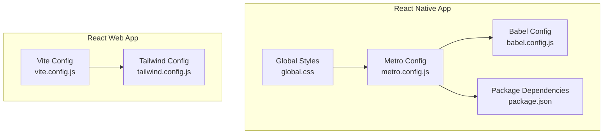
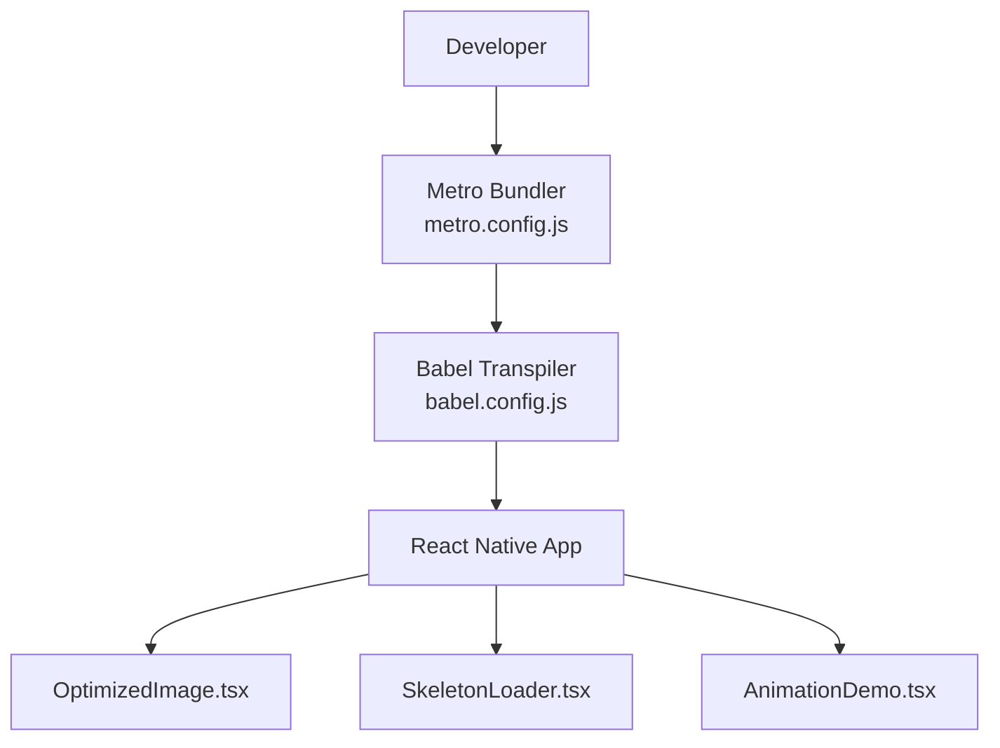
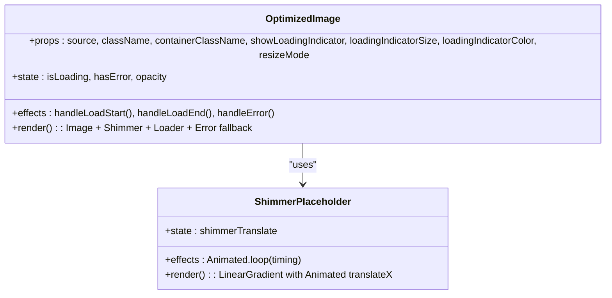
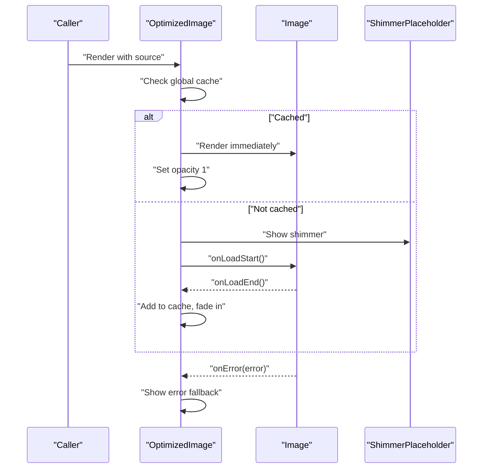
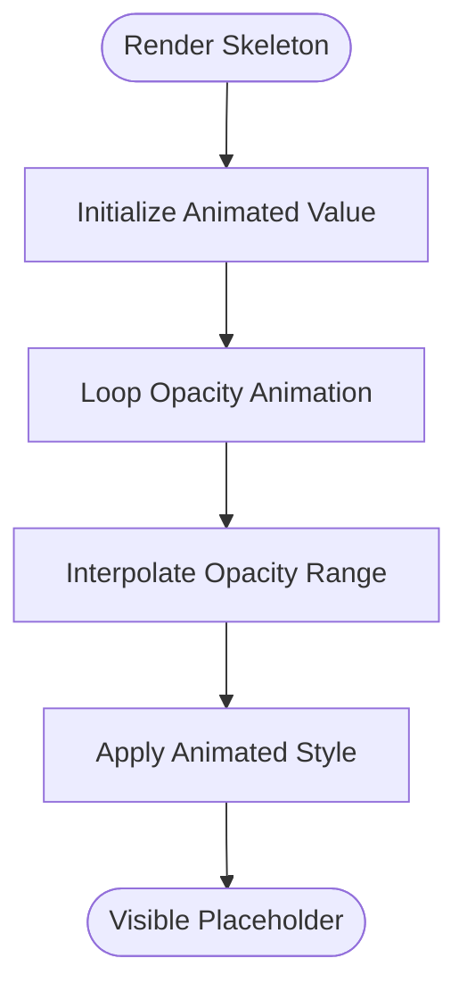
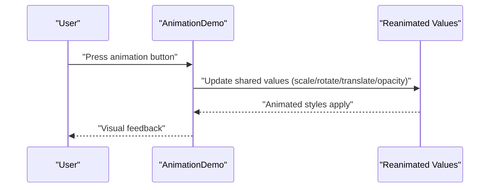
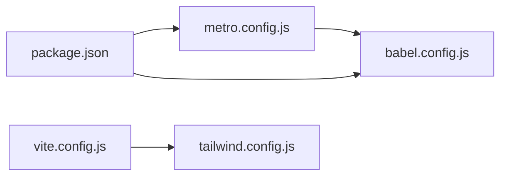

# Performance Optimization

<cite>
**Referenced Files in This Document**
- [metro.config.js](file://Estate_link_App/metro.config.js)
- [babel.config.js](file://Estate_link_App/babel.config.js)
- [package.json](file://Estate_link_App/package.json)
- [global.css](file://Estate_link_App/global.css)
- [OptimizedImage.tsx](file://Estate_link_App/src/components/OptimizedImage.tsx)
- [SkeletonLoader.tsx](file://Estate_link_App/src/components/SkeletonLoader.tsx)
- [AnimationDemo.tsx](file://Estate_link_App/src/components/AnimationDemo.tsx)
- [vite.config.js](file://frontend/vite.config.js)
- [tailwind.config.js](file://frontend/tailwind.config.js)
</cite>

## Table of Contents
1. [Introduction](#introduction)
2. [Project Structure](#project-structure)
3. [Core Components](#core-components)
4. [Architecture Overview](#architecture-overview)
5. [Detailed Component Analysis](#detailed-component-analysis)
6. [Dependency Analysis](#dependency-analysis)
7. [Performance Considerations](#performance-considerations)
8. [Troubleshooting Guide](#troubleshooting-guide)
9. [Conclusion](#conclusion)
10. [Appendices](#appendices)

## Introduction
This document provides a comprehensive guide to performance optimization strategies and techniques implemented in the project. It covers lazy loading, code splitting, bundle optimization, loading states and skeleton screens, progressive enhancement patterns, animation optimization, image handling, memory management, performance monitoring and profiling, and build/deployment considerations. The goal is to help developers understand how the existing components and build configurations contribute to performance and how to extend or refine them further.

## Project Structure
The project consists of two major frontends:
- React Native application under Estate_link_App, configured with Metro bundler and Babel.
- React web application under frontend, configured with Vite and Tailwind CSS.

Key performance-related areas:
- Build tooling and bundling configuration
- Component-level optimizations for images and skeletons
- Animation orchestration and rendering
- Styling pipeline and asset delivery

**Diagram sources**
- [metro.config.js](file://Estate_link_App/metro.config.js#L1-L33)
- [babel.config.js](file://Estate_link_App/babel.config.js#L1-L11)
- [package.json](file://Estate_link_App/package.json#L1-L93)
- [global.css](file://Estate_link_App/global.css#L1-L6)
- [vite.config.js](file://frontend/vite.config.js#L1-L50)
- [tailwind.config.js](file://frontend/tailwind.config.js#L1-L155)

**Section sources**
- [metro.config.js](file://Estate_link_App/metro.config.js#L1-L33)
- [babel.config.js](file://Estate_link_App/babel.config.js#L1-L11)
- [package.json](file://Estate_link_App/package.json#L1-L93)
- [global.css](file://Estate_link_App/global.css#L1-L6)
- [vite.config.js](file://frontend/vite.config.js#L1-L50)
- [tailwind.config.js](file://frontend/tailwind.config.js#L1-L155)

## Core Components
This section highlights the core performance-focused components and their roles:
- OptimizedImage: Implements loading states, shimmer effects, progressive rendering, and caching to reduce perceived latency and improve perceived performance.
- SkeletonLoader: Provides lightweight skeleton placeholders with native-driven opacity animations to maintain frame stability during data fetches.
- AnimationDemo: Demonstrates efficient animation composition using shared values and sequences to minimize layout thrashing and leverage hardware acceleration.

These components collectively support progressive enhancement and graceful degradation, ensuring smooth user experiences even under constrained conditions.

**Section sources**
- [OptimizedImage.tsx](file://Estate_link_App/src/components/OptimizedImage.tsx#L1-L197)
- [SkeletonLoader.tsx](file://Estate_link_App/src/components/SkeletonLoader.tsx#L1-L190)
- [AnimationDemo.tsx](file://Estate_link_App/src/components/AnimationDemo.tsx#L1-L155)

## Architecture Overview
The performance architecture integrates build-time optimizations with runtime UX enhancements:
- Metro and Babel configure the React Native bundler to suppress non-essential warnings and enable worklet-based plugins for smoother animations.
- Vite and Tailwind streamline the web build process, proxy API requests, and ensure styles remain minimal and safe-listed to avoid runtime style churn.
- Component-level patterns (images, skeletons, animations) are designed to reduce jank and maintain consistent frame rates.

**Diagram sources**
- [metro.config.js](file://Estate_link_App/metro.config.js#L1-L33)
- [babel.config.js](file://Estate_link_App/babel.config.js#L1-L11)
- [OptimizedImage.tsx](file://Estate_link_App/src/components/OptimizedImage.tsx#L1-L197)
- [SkeletonLoader.tsx](file://Estate_link_App/src/components/SkeletonLoader.tsx#L1-L190)
- [AnimationDemo.tsx](file://Estate_link_App/src/components/AnimationDemo.tsx#L1-L155)

## Detailed Component Analysis

### OptimizedImage Component
The OptimizedImage component implements a layered loading strategy:
- Global cache to detect previously loaded URIs and skip unnecessary loading states.
- Shimmer gradient overlay with native-driven animated translation for perceptual loading feedback.
- Optional activity indicator and error fallback icons.
- Fade-in animation and progressive rendering enabled for smoother image display.

**Diagram sources**
- [OptimizedImage.tsx](file://Estate_link_App/src/components/OptimizedImage.tsx#L1-L197)

**Diagram sources**
- [OptimizedImage.tsx](file://Estate_link_App/src/components/OptimizedImage.tsx#L72-L99)

**Section sources**
- [OptimizedImage.tsx](file://Estate_link_App/src/components/OptimizedImage.tsx#L1-L197)

### SkeletonLoader Component
SkeletonLoader provides animated placeholders using native-driven opacity animations. It supports:
- Single-line and card-based skeletons with configurable dimensions and radii.
- Grid layouts for lists and cards.
- Looping opacity animations to simulate activity without heavy computations.

**Diagram sources**
- [SkeletonLoader.tsx](file://Estate_link_App/src/components/SkeletonLoader.tsx#L18-L45)

**Section sources**
- [SkeletonLoader.tsx](file://Estate_link_App/src/components/SkeletonLoader.tsx#L1-L190)

### AnimationDemo Component
AnimationDemo showcases efficient animation composition:
- Shared values for transforms and opacity.
- Sequences and delays to coordinate multiple transitions.
- Hardware-accelerated animations via shared values and reanimated.

**Diagram sources**
- [AnimationDemo.tsx](file://Estate_link_App/src/components/AnimationDemo.tsx#L31-L88)

**Section sources**
- [AnimationDemo.tsx](file://Estate_link_App/src/components/AnimationDemo.tsx#L1-L155)

## Dependency Analysis
Build-time dependencies and configurations influence performance:
- Metro aliases and resolver mappings reduce module resolution overhead and enable shorter imports.
- Babel preset with nativewind and worklets plugin improves transpile performance and enables native-driven animations.
- Vite disables overlays in development to allow error boundaries to capture errors, aiding in diagnosing performance regressions.
- Tailwind safelist ensures critical form and UI states are not purged, preventing style flashes that could degrade perceived performance.

**Diagram sources**
- [package.json](file://Estate_link_App/package.json#L1-L93)
- [metro.config.js](file://Estate_link_App/metro.config.js#L1-L33)
- [babel.config.js](file://Estate_link_App/babel.config.js#L1-L11)
- [vite.config.js](file://frontend/vite.config.js#L1-L50)
- [tailwind.config.js](file://frontend/tailwind.config.js#L1-L155)

**Section sources**
- [package.json](file://Estate_link_App/package.json#L1-L93)
- [metro.config.js](file://Estate_link_App/metro.config.js#L1-L33)
- [babel.config.js](file://Estate_link_App/babel.config.js#L1-L11)
- [vite.config.js](file://frontend/vite.config.js#L1-L50)
- [tailwind.config.js](file://frontend/tailwind.config.js#L1-L155)

## Performance Considerations
- Lazy loading and code splitting
  - Prefer dynamic imports for route-level or feature-level chunks to reduce initial bundle size.
  - Split vendor libraries and frequently changing features to improve caching and parallel loading.
  - Use React.lazy and Suspense in React web builds to defer rendering until chunks are ready.

- Bundle optimization
  - Keep Metro aliases minimal and targeted to avoid unnecessary module resolution.
  - Enable tree-shaking and ensure imports are side-effect-free to allow dead-code elimination.
  - Monitor bundle size with tools like webpack-bundle-analyzer or Metro’s built-in analyzer.

- Loading states and skeleton screens
  - Use SkeletonLoader for predictable layout shifts and reduced CLS.
  - Combine skeletons with OptimizedImage to provide coherent loading feedback.

- Progressive enhancement
  - Start with minimal markup and progressively enhance with animations and advanced features.
  - Ensure degraded experiences remain usable when assets fail to load.

- Animation optimization
  - Use shared values and sequences to minimize layout recalculations.
  - Prefer hardware-accelerated properties (transform, opacity) and avoid triggering layout-heavy properties.

- Image handling
  - Leverage OptimizedImage’s caching and shimmer to reduce perceived latency.
  - Use appropriate image sizes and formats; consider progressive JPEGs or WebP where supported.
  - Avoid blocking layout with large images; set explicit dimensions.

- Memory management
  - Dispose of animations and timers in useEffect cleanup hooks.
  - Avoid retaining references to DOM nodes or large arrays unnecessarily.
  - Use FlatList or similar virtualized lists to limit DOM nodes in long lists.

- Performance monitoring and profiling
  - Use React DevTools Profiler and Flipper to identify expensive renders.
  - Measure First Contentful Paint (FCP), Largest Contentful Paint (LCP), and Cumulative Layout Shift (CLS).
  - Track runtime metrics such as frame rate and memory usage in production.

- Build and deployment
  - Configure Vite proxy for local development to avoid CORS issues and reduce dev-server overhead.
  - Ensure Tailwind safelist includes critical classes to prevent style flashes.
  - Minimize global CSS and rely on component-scoped styles to reduce cascade complexity.

[No sources needed since this section provides general guidance]

## Troubleshooting Guide
Common performance pitfalls and remedies:
- Excessive re-renders
  - Verify that memoization is used for expensive components and lists.
  - Ensure keys are stable and unique in lists.

- Heavy animations
  - Confirm animations use shared values and avoid layout-triggering properties.
  - Reduce the number of concurrent animations.

- Large bundles
  - Audit dependencies and remove unused packages.
  - Split large modules into smaller chunks.

- Poor image performance
  - Validate image dimensions and formats.
  - Ensure shimmer and caching are functioning as expected.

- Stylus purging issues
  - Confirm Tailwind safelist includes dynamically applied classes.

**Section sources**
- [OptimizedImage.tsx](file://Estate_link_App/src/components/OptimizedImage.tsx#L72-L99)
- [SkeletonLoader.tsx](file://Estate_link_App/src/components/SkeletonLoader.tsx#L18-L45)
- [AnimationDemo.tsx](file://Estate_link_App/src/components/AnimationDemo.tsx#L31-L88)
- [tailwind.config.js](file://frontend/tailwind.config.js#L4-L14)

## Conclusion
The project integrates practical performance strategies across build configuration and runtime components. By leveraging optimized images, skeleton loaders, and efficient animations, it delivers a responsive user experience. Extending these patterns with dynamic imports, bundle analysis, and continuous profiling will further strengthen performance outcomes.

[No sources needed since this section summarizes without analyzing specific files]

## Appendices
- Build configuration references
  - Metro resolver aliases and warning suppression
  - Babel preset and worklets plugin
  - Vite development overlay and proxy settings
  - Tailwind safelist and theme extensions

**Section sources**
- [metro.config.js](file://Estate_link_App/metro.config.js#L1-L33)
- [babel.config.js](file://Estate_link_App/babel.config.js#L1-L11)
- [vite.config.js](file://frontend/vite.config.js#L17-L44)
- [tailwind.config.js](file://frontend/tailwind.config.js#L4-L14)