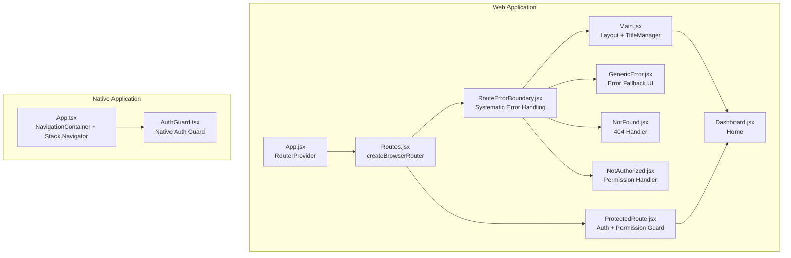
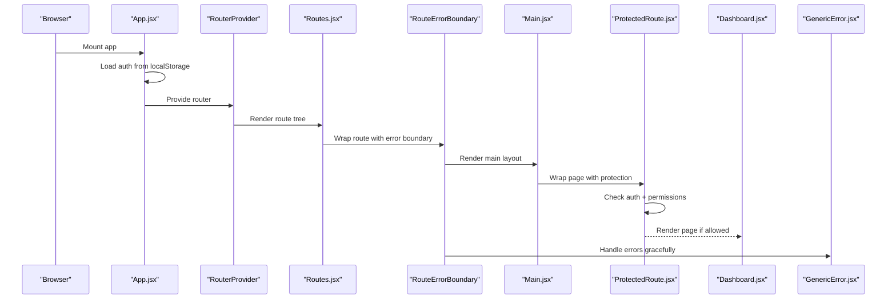
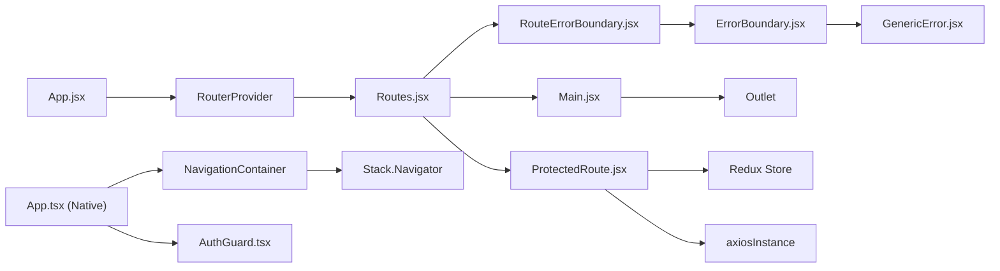

# Routing System

<cite>
**Referenced Files in This Document**
- [App.jsx](file://frontend/src/App.jsx)
- [Routes.jsx](file://frontend/src/Routes/Routes.jsx)
- [ProtectedRoute.jsx](file://frontend/src/Routes/ProtectedRoute.jsx)
- [Main.jsx](file://frontend/src/Layout/Main.jsx)
- [Dashboard.jsx](file://frontend/src/Layout/Dashboard.jsx)
- [ErrorBoundary.jsx](file://frontend/src/Components/Error/ErrorBoundary.jsx)
- [GenericError.jsx](file://frontend/src/Features/NotFound/GenericError.jsx)
- [NotFound.jsx](file://frontend/src/Features/NotFound/NotFound.jsx)
- [NotAuthorized.jsx](file://frontend/src/Features/NotFound/NotAuthorized.jsx)
- [AuthGuard.tsx](file://Estate_link_App/src/components/AuthGuard.tsx)
- [App.tsx](file://Estate_link_App/App.tsx)
</cite>

## Update Summary
**Changes Made**
- Added comprehensive RouteErrorBoundary system documentation
- Updated error handling mechanisms section to reflect systematic error handling approach
- Added new section on RouteErrorBoundary implementation
- Updated architecture overview to include error boundary system
- Enhanced troubleshooting guide with error boundary guidance

## Table of Contents
1. [Introduction](#introduction)
2. [Project Structure](#project-structure)
3. [Core Components](#core-components)
4. [Architecture Overview](#architecture-overview)
5. [Detailed Component Analysis](#detailed-component-analysis)
6. [RouteErrorBoundary System](#routeerrorboundary-system)
7. [Dependency Analysis](#dependency-analysis)
8. [Performance Considerations](#performance-considerations)
9. [Troubleshooting Guide](#troubleshooting-guide)
10. [Conclusion](#conclusion)

## Introduction
This document explains the routing system used in the frontend application built with React Router and React Router DOM. It covers route structure, navigation patterns, protected route handling, authentication guards, dynamic routing, programmatic navigation, Redux integration, error handling, and route-based code splitting. The system now features a comprehensive RouteErrorBoundary system that provides systematic error handling across all 40+ route elements, replacing individual ErrorBoundary wrappers with a centralized approach.

## Project Structure
The routing system is primarily implemented in the frontend application using React Router v6 with React Router DOM. The main entry point initializes the router provider and mounts the route tree. Protected routes wrap page components to enforce permission checks. A shared layout component manages the main application shell and dynamic titles. The comprehensive RouteErrorBoundary system ensures robust error handling across all routes.



**Diagram sources**
- [App.jsx](file://frontend/src/App.jsx#L1-L23)
- [Routes.jsx](file://frontend/src/Routes/Routes.jsx#L1-L23)
- [ProtectedRoute.jsx](file://frontend/src/Routes/ProtectedRoute.jsx#L1-L208)
- [ErrorBoundary.jsx](file://frontend/src/Components/Error/ErrorBoundary.jsx#L1-L43)
- [GenericError.jsx](file://frontend/src/Features/NotFound/GenericError.jsx#L1-L67)
- [NotFound.jsx](file://frontend/src/Features/NotFound/NotFound.jsx#L1-L54)
- [NotAuthorized.jsx](file://frontend/src/Features/NotFound/NotAuthorized.jsx#L1-L61)
- [Main.jsx](file://frontend/src/Layout/Main.jsx#L1-L222)
- [Dashboard.jsx](file://frontend/src/Layout/Dashboard.jsx#L1-L882)
- [App.tsx](file://Estate_link_App/App.tsx#L118-L415)
- [AuthGuard.tsx](file://Estate_link_App/src/components/AuthGuard.tsx#L1-L42)

**Section sources**
- [App.jsx](file://frontend/src/App.jsx#L1-L23)
- [Routes.jsx](file://frontend/src/Routes/Routes.jsx#L1-L23)
- [Main.jsx](file://frontend/src/Layout/Main.jsx#L1-L222)
- [Dashboard.jsx](file://frontend/src/Layout/Dashboard.jsx#L1-L882)
- [App.tsx](file://Estate_link_App/App.tsx#L118-L415)
- [AuthGuard.tsx](file://Estate_link_App/src/components/AuthGuard.tsx#L1-L42)

## Core Components
- Router initialization and provider: The web app initializes the router via a router provider and loads authentication state from localStorage on startup.
- Route configuration: Nested routes under a main layout define protected and public routes, with lazy-loaded components and Suspense fallbacks wrapped in systematic error boundaries.
- Protected route guard: Enforces authentication and optional permission/role checks, with resilient permission verification against both local and central APIs.
- Layout and title management: A layout component sets dynamic browser tab titles and renders the main content area.
- Native routing: The native app uses React Navigation with a stack navigator and a separate AuthGuard for native screens.
- **Updated** Comprehensive error boundary system: RouteErrorBoundary component provides systematic error handling across all 40+ route elements.

Key responsibilities:
- App.jsx: Initializes Redux, loads auth from storage, and mounts the router provider.
- Routes.jsx: Defines the route tree, nested routes, lazy loading, Suspense fallbacks, and systematic error boundary wrapping.
- ProtectedRoute.jsx: Handles authentication, permission checks, role checks, and redirects.
- Main.jsx: Provides the main layout, sidebar, header, and dynamic title manager.
- Dashboard.jsx: Home page component rendered under the main layout.
- **Updated** ErrorBoundary.jsx: Class-based error boundary component that catches runtime errors and displays GenericError fallback.
- **Updated** GenericError.jsx: Comprehensive error page component with reset functionality and navigation controls.
- App.tsx (native): Sets up the native navigation container and stack navigator.
- AuthGuard.tsx (native): Guards native screens and redirects unauthenticated users to login.

**Section sources**
- [App.jsx](file://frontend/src/App.jsx#L1-L23)
- [Routes.jsx](file://frontend/src/Routes/Routes.jsx#L1-L23)
- [ProtectedRoute.jsx](file://frontend/src/Routes/ProtectedRoute.jsx#L1-L208)
- [Main.jsx](file://frontend/src/Layout/Main.jsx#L1-L222)
- [Dashboard.jsx](file://frontend/src/Layout/Dashboard.jsx#L1-L882)
- [ErrorBoundary.jsx](file://frontend/src/Components/Error/ErrorBoundary.jsx#L1-L43)
- [GenericError.jsx](file://frontend/src/Features/NotFound/GenericError.jsx#L1-L67)
- [App.tsx](file://Estate_link_App/App.tsx#L118-L415)
- [AuthGuard.tsx](file://Estate_link_App/src/components/AuthGuard.tsx#L1-L42)

## Architecture Overview
The routing architecture separates concerns between:
- Web routing: React Router DOM with nested routes, lazy loading, Suspense, and a comprehensive RouteErrorBoundary wrapper system.
- Native routing: React Navigation with a stack navigator and a dedicated AuthGuard for native screens.
- State management: Redux is used for authentication and related slices; ProtectedRoute reads user state and dispatches actions to fetch additional data when needed.
- **Updated** Error handling: Systematic error boundary approach ensures consistent error handling across all route elements.



**Diagram sources**
- [App.jsx](file://frontend/src/App.jsx#L1-L23)
- [Routes.jsx](file://frontend/src/Routes/Routes.jsx#L1-L23)
- [ErrorBoundary.jsx](file://frontend/src/Components/Error/ErrorBoundary.jsx#L1-L43)
- [Main.jsx](file://frontend/src/Layout/Main.jsx#L1-L222)
- [ProtectedRoute.jsx](file://frontend/src/Routes/ProtectedRoute.jsx#L1-L208)
- [Dashboard.jsx](file://frontend/src/Layout/Dashboard.jsx#L1-L882)
- [GenericError.jsx](file://frontend/src/Features/NotFound/GenericError.jsx#L1-L67)

## Detailed Component Analysis

### Route Configuration and Nested Routes
- Root route: The root path "/" renders the main layout and a default child route rendering the Dashboard.
- Protected routes: Many routes under the main layout are wrapped with ProtectedRoute and require specific permissions.
- Dynamic routes: Routes with parameters (e.g., member profiles, edit forms) are supported with dynamic segments.
- Public routes: Login, forgot password, verify code, set new password, and others are publicly accessible.
- Wildcard route: A catch-all route renders a not-found page.
- **Updated** Systematic error handling: Every route element is wrapped with RouteErrorBoundary for consistent error management.

Examples of protected routes:
- Member management: list, create, profile, edit routes with appropriate permissions.
- Groups and roles: CRUD routes guarded by required permissions.
- Towers and units: Routes for viewing and editing towers, units, ownership, residents, staff, and vehicles.
- Communication portal: Announcements, bulletins, and notice board routes with view/create/edit permissions.
- Service fee management: Settings, payments, reports, schedule configuration, reminders, bill categories, and accounting routes.
- Accounting: Voucher list, financial entry, trial balance, and accounts ledger.

Programmatic navigation:
- The Dashboard component demonstrates programmatic navigation using the router's navigate function to move users to relevant sections (e.g., service fee payments, announcements).

Dynamic routing:
- Parameterized routes include member-profile/:id, general-information-edit/:id, edit-group/:id, unit-details/:id, and many others.
- Pattern-based title management in Main.jsx supports dynamic titles for parameterized routes.

Route-based code splitting:
- All major page components are lazy-loaded using React.lazy and wrapped with Suspense for improved initial load performance.
- **Updated** Error boundaries are systematically applied to all lazy-loaded components for robust error handling.

**Section sources**
- [Routes.jsx](file://frontend/src/Routes/Routes.jsx#L284-L1506)
- [Main.jsx](file://frontend/src/Layout/Main.jsx#L7-L90)
- [Dashboard.jsx](file://frontend/src/Layout/Dashboard.jsx#L31-L614)

### Protected Route Handling
ProtectedRoute enforces:
- Authentication: Redirects to login if no user is present.
- Permissions: Optional requiredPermission checks against local and central APIs for resilience.
- Roles: Optional requiredRole checks against normalized user roles.
- Self-access exceptions: Allows users to access their own profile pages without requiring explicit permissions.
- Data fetching: Dispatches an action to fetch heading data when visiting specific profile-related routes.

Permission verification strategy:
- Local permission check: Fast, synchronous check against user permission IDs.
- Central API check: Asynchronous verification against a central endpoint; if unavailable, falls back to local check.
- Combined result: Both checks must pass if the central API responds; otherwise, local check determines access.

Self-access logic:
- Extracts current user ID from localStorage (synchronous), then from Redux headingData, then from Redux user.
- Compares with the viewed member ID from route parameters to allow self-access without permissions.

Loading and error handling:
- Shows a loading animation while checks are in progress.
- Redirects to a not-authorized page if checks fail.
- Uses a modern loading animation component during suspense boundaries.
- **Updated** Integrated with RouteErrorBoundary for comprehensive error coverage.

**Section sources**
- [ProtectedRoute.jsx](file://frontend/src/Routes/ProtectedRoute.jsx#L1-L208)

### Authentication Guards and Session Management
- Web (React Router DOM):
  - App.jsx loads authentication state from localStorage on mount.
  - ProtectedRoute.jsx reads Redux state for user and permissions.
  - No explicit session refresh mechanism is shown in the referenced files; authentication state is expected to be persisted in Redux and localStorage.

- Native (React Navigation):
  - AuthGuard.tsx checks authentication state and redirects to the Login screen if the user is not authenticated.
  - Uses navigation reset to ensure clean navigation stack.

Note: The native app uses React Navigation's stack navigator and a separate AuthGuard, distinct from the web's ProtectedRoute.

**Section sources**
- [App.jsx](file://frontend/src/App.jsx#L8-L13)
- [ProtectedRoute.jsx](file://frontend/src/Routes/ProtectedRoute.jsx#L16-L19)
- [AuthGuard.tsx](file://Estate_link_App/src/components/AuthGuard.tsx#L10-L41)
- [App.tsx](file://Estate_link_App/App.tsx#L243-L407)

### Programmatic Navigation
- The Dashboard component uses programmatic navigation to move users to relevant sections (e.g., navigating to service fee payments or announcements).
- This pattern can be replicated in other components to improve UX by guiding users to related areas after actions.

**Section sources**
- [Dashboard.jsx](file://frontend/src/Layout/Dashboard.jsx#L603-L619)

### Integration with Redux
- App.jsx dispatches an action to hydrate authentication state from localStorage on mount.
- ProtectedRoute.jsx reads user state from Redux and dispatches an action to fetch heading data for specific routes.
- The Redux store is initialized in the web app and used across components for authentication and related slices.

**Section sources**
- [App.jsx](file://frontend/src/App.jsx#L8-L13)
- [ProtectedRoute.jsx](file://frontend/src/Routes/ProtectedRoute.jsx#L15-L44)

### Error Handling Mechanisms
- **Updated** Comprehensive RouteErrorBoundary system: Every route element is wrapped with RouteErrorBoundary, providing systematic error handling across all 40+ route elements.
- ErrorBoundary component: Class-based error boundary that catches runtime errors and displays GenericError fallback UI.
- GenericError component: Comprehensive error page with reset functionality, navigation controls, and user-friendly messaging.
- NotFound and NotAuthorized components: Specialized error handlers for different types of routing errors.
- Suspense fallbacks: Used across lazy-loaded routes to avoid blank screens during code-splitting.

**Section sources**
- [Routes.jsx](file://frontend/src/Routes/Routes.jsx#L9-L23)
- [ErrorBoundary.jsx](file://frontend/src/Components/Error/ErrorBoundary.jsx#L1-L43)
- [GenericError.jsx](file://frontend/src/Features/NotFound/GenericError.jsx#L1-L67)
- [NotFound.jsx](file://frontend/src/Features/NotFound/NotFound.jsx#L1-L54)
- [NotAuthorized.jsx](file://frontend/src/Features/NotFound/NotAuthorized.jsx#L1-L61)

### Route-Based Code Splitting and Lazy Loading
- All major page components are lazy-loaded using React.lazy.
- Suspense is used around each lazy component to provide a loading fallback.
- **Updated** RouteErrorBoundary is systematically applied to all lazy-loaded routes for robust error handling.
- ErrorBoundary is used for specific routes (e.g., test error) to demonstrate error handling during lazy loading.

**Section sources**
- [Routes.jsx](file://frontend/src/Routes/Routes.jsx#L52-L221)
- [Routes.jsx](file://frontend/src/Routes/Routes.jsx#L288-L292)
- [Routes.jsx](file://frontend/src/Routes/Routes.jsx#L9-L23)

## RouteErrorBoundary System

### Systematic Error Boundary Implementation
The comprehensive RouteErrorBoundary system provides centralized error handling across all 40+ route elements in the application. This systematic approach replaces individual ErrorBoundary wrappers with a standardized error handling mechanism.

#### RouteErrorBoundary Component
The RouteErrorBoundary component serves as a wrapper that applies error boundary functionality consistently across all routes:

```javascript
const RouteErrorBoundary = ({ children }) => {
  return (
    <ErrorBoundary>
      {children}
    </ErrorBoundary>
  );
};
```

#### ErrorBoundary Component
The underlying ErrorBoundary component provides robust error catching and recovery:

- **Class-based implementation**: Uses React's lifecycle methods for error catching
- **State management**: Tracks error state and provides reset functionality
- **Console logging**: Logs errors for debugging purposes
- **Graceful degradation**: Displays GenericError fallback UI when errors occur

#### Error Handling Flow
The error handling system follows a structured approach:

1. **Error Detection**: RouteErrorBoundary catches runtime errors in route components
2. **State Update**: ErrorBoundary updates internal state to trigger fallback UI
3. **Fallback Rendering**: GenericError component displays user-friendly error message
4. **Recovery Options**: Users can reset error boundary or navigate back to safety

#### Benefits of Systematic Approach
- **Consistency**: All routes receive identical error handling treatment
- **Maintainability**: Single source of truth for error boundary logic
- **Reliability**: Comprehensive coverage prevents unhandled errors
- **User Experience**: Professional error handling with clear recovery options

**Section sources**
- [Routes.jsx](file://frontend/src/Routes/Routes.jsx#L9-L23)
- [ErrorBoundary.jsx](file://frontend/src/Components/Error/ErrorBoundary.jsx#L1-L43)
- [GenericError.jsx](file://frontend/src/Features/NotFound/GenericError.jsx#L1-L67)

## Dependency Analysis
The routing system exhibits clear separation of concerns with enhanced error handling:
- App.jsx depends on RouterProvider and the router definition.
- Routes.jsx defines the route tree and imports lazy components, RouteErrorBoundary wrapper, and ProtectedRoute wrapper.
- ProtectedRoute.jsx depends on Redux for user state and permissions, and performs API calls for central permission verification.
- Main.jsx depends on Outlet and TitleManager to render the layout and manage titles.
- ErrorBoundary.jsx provides systematic error handling across all route elements.
- GenericError.jsx offers comprehensive error fallback UI with reset functionality.
- Native routing (App.tsx and AuthGuard.tsx) is independent and uses React Navigation.



**Diagram sources**
- [App.jsx](file://frontend/src/App.jsx#L1-L23)
- [Routes.jsx](file://frontend/src/Routes/Routes.jsx#L1-L23)
- [ErrorBoundary.jsx](file://frontend/src/Components/Error/ErrorBoundary.jsx#L1-L43)
- [GenericError.jsx](file://frontend/src/Features/NotFound/GenericError.jsx#L1-L67)
- [ProtectedRoute.jsx](file://frontend/src/Routes/ProtectedRoute.jsx#L1-L208)
- [Main.jsx](file://frontend/src/Layout/Main.jsx#L1-L222)
- [App.tsx](file://Estate_link_App/App.tsx#L118-L415)
- [AuthGuard.tsx](file://Estate_link_App/src/components/AuthGuard.tsx#L1-L42)

**Section sources**
- [App.jsx](file://frontend/src/App.jsx#L1-L23)
- [Routes.jsx](file://frontend/src/Routes/Routes.jsx#L1-L23)
- [ProtectedRoute.jsx](file://frontend/src/Routes/ProtectedRoute.jsx#L1-L208)
- [Main.jsx](file://frontend/src/Layout/Main.jsx#L1-L222)
- [ErrorBoundary.jsx](file://frontend/src/Components/Error/ErrorBoundary.jsx#L1-L43)
- [GenericError.jsx](file://frontend/src/Features/NotFound/GenericError.jsx#L1-L67)
- [App.tsx](file://Estate_link_App/App.tsx#L118-L415)
- [AuthGuard.tsx](file://Estate_link_App/src/components/AuthGuard.tsx#L1-L42)

## Performance Considerations
- Lazy loading: All major routes are lazy-loaded to reduce initial bundle size.
- Suspense fallbacks: Provide immediate feedback during code-splitting.
- Permission checks: Local permission checks are fast; central API checks are asynchronous and fall back gracefully.
- Layout and title management: Title updates are optimized with pattern matching and memoization.
- **Updated** Error boundary overhead: Minimal performance impact with significant reliability benefits.
- **Updated** Systematic error handling: Centralized error boundary reduces code duplication and improves maintainability.

## Troubleshooting Guide
Common issues and resolutions:
- Blank screen on initial load: Ensure Suspense fallbacks are configured for lazy components.
- Permission denied errors: Verify requiredPermission values and user permission IDs; note that central API failures fall back to local checks.
- Self-access blocked: Confirm that the current user ID extracted from localStorage or Redux matches the viewed member ID.
- Navigation loops in native app: AuthGuard resets navigation to the Login screen when unauthenticated; ensure navigation refs are properly set.
- **Updated** Route errors: All routes are protected by RouteErrorBoundary; check GenericError component for specific error details.
- **Updated** Error boundary issues: Verify RouteErrorBoundary wrapper is properly applied to route elements.
- **Updated** Error recovery: Use resetErrorBoundary functionality in GenericError component to recover from errors.

**Section sources**
- [ProtectedRoute.jsx](file://frontend/src/Routes/ProtectedRoute.jsx#L133-L141)
- [ProtectedRoute.jsx](file://frontend/src/Routes/ProtectedRoute.jsx#L166-L172)
- [ErrorBoundary.jsx](file://frontend/src/Components/Error/ErrorBoundary.jsx#L16-L19)
- [GenericError.jsx](file://frontend/src/Features/NotFound/GenericError.jsx#L9-L18)
- [AuthGuard.tsx](file://Estate_link_App/src/components/AuthGuard.tsx#L14-L23)

## Conclusion
The routing system combines React Router DOM for the web app with React Navigation for the native app. It emphasizes security through ProtectedRoute, resilience via dual permission checks, and performance through route-based code splitting. The comprehensive RouteErrorBoundary system provides systematic error handling across all 40+ route elements, ensuring consistent error management and improved user experience. The main layout and title management provide a consistent user experience, while Redux integrates authentication and state seamlessly. The native app maintains a separate but complementary routing strategy with its own AuthGuard. The systematic error handling approach significantly enhances the reliability and maintainability of the routing system.