# State Management

<cite>
**Referenced Files in This Document**
- [index.ts](file://Estate_link_App/src/store/index.ts)
- [hooks.ts](file://Estate_link_App/src/store/hooks.ts)
- [authSlice.ts](file://Estate_link_App/src/store/slices/authSlice.ts)
- [announcementSlice.ts](file://Estate_link_App/src/store/slices/announcementSlice.ts)
- [noticeSlice.ts](file://Estate_link_App/src/store/slices/noticeSlice.ts)
- [bulletinSlice.ts](file://Estate_link_App/src/store/slices/bulletinSlice.ts)
- [profileSlice.ts](file://Estate_link_App/src/store/slices/profileSlice.ts)
- [serviceFeeSlice.ts](file://Estate_link_App/src/store/slices/serviceFeeSlice.ts)
- [contactSlice.ts](file://Estate_link_App/src/store/slices/contactSlice.ts)
- [companySettingsSlice.ts](file://Estate_link_App/src/store/slices/companySettingsSlice.ts)
- [forgotPasswordSlice.ts](file://Estate_link_App/src/store/slices/forgotPasswordSlice.ts)
- [useAnnouncements.ts](file://Estate_link_App/src/hooks/useAnnouncements.ts)
- [useProfile.ts](file://Estate_link_App/src/hooks/useProfile.ts)
- [useBulletins.ts](file://Estate_link_App/src/hooks/useBulletins.ts)
</cite>

## Table of Contents
1. [Introduction](#introduction)
2. [Project Structure](#project-structure)
3. [Core Components](#core-components)
4. [Architecture Overview](#architecture-overview)
5. [Detailed Component Analysis](#detailed-component-analysis)
6. [Dependency Analysis](#dependency-analysis)
7. [Performance Considerations](#performance-considerations)
8. [Troubleshooting Guide](#troubleshooting-guide)
9. [Conclusion](#conclusion)

## Introduction
This document explains the Redux state management system used in the estate management application. It covers store configuration, slice organization, state structure patterns, authentication and API slices, async thunks, error handling, state persistence, integration with React via hooks, and performance and debugging strategies. The goal is to help developers understand how data flows through the app and how to extend or maintain the state layer effectively.

## Project Structure
The Redux layer is organized under a dedicated store module with a central store configuration and individual slices for each domain feature. A typed hooks wrapper ensures consistent typing across the app.

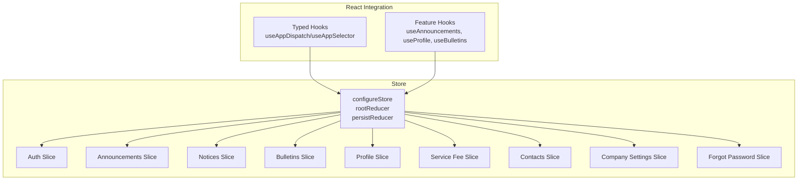

**Diagram sources**
- [index.ts](file://Estate_link_App/src/store/index.ts#L23-L36)
- [hooks.ts](file://Estate_link_App/src/store/hooks.ts#L1-L6)
- [authSlice.ts](file://Estate_link_App/src/store/slices/authSlice.ts#L361-L550)
- [announcementSlice.ts](file://Estate_link_App/src/store/slices/announcementSlice.ts#L139-L313)
- [noticeSlice.ts](file://Estate_link_App/src/store/slices/noticeSlice.ts#L139-L309)
- [bulletinSlice.ts](file://Estate_link_App/src/store/slices/bulletinSlice.ts#L224-L422)
- [profileSlice.ts](file://Estate_link_App/src/store/slices/profileSlice.ts#L216-L378)
- [serviceFeeSlice.ts](file://Estate_link_App/src/store/slices/serviceFeeSlice.ts#L614-L925)
- [contactSlice.ts](file://Estate_link_App/src/store/slices/contactSlice.ts#L72-L177)
- [companySettingsSlice.ts](file://Estate_link_App/src/store/slices/companySettingsSlice.ts#L84-L129)
- [forgotPasswordSlice.ts](file://Estate_link_App/src/store/slices/forgotPasswordSlice.ts#L198-L320)

**Section sources**
- [index.ts](file://Estate_link_App/src/store/index.ts#L1-L79)
- [hooks.ts](file://Estate_link_App/src/store/hooks.ts#L1-L6)

## Core Components
- Store configuration: Centralized store with persisted reducer and typed hooks.
- Slices: Feature-specific reducers and async thunks for each domain (auth, announcements, notices, bulletins, profile, service fees, contacts, company settings, forgot password).
- Typed hooks: Consistent typing for dispatch and selector usage.

Key responsibilities:
- Store: Combines reducers, applies persistence, configures middleware (including serializability exceptions).
- Slices: Encapsulate state, actions, reducers, and async thunks per domain.
- Hooks: Provide typed access to store and expose convenient APIs for components.

**Section sources**
- [index.ts](file://Estate_link_App/src/store/index.ts#L23-L79)
- [hooks.ts](file://Estate_link_App/src/store/hooks.ts#L1-L6)

## Architecture Overview
The store integrates with React via typed hooks and exposes domain-specific slices. Middleware supports async thunks and persistence. Some slices coordinate with external services and update normalized state.

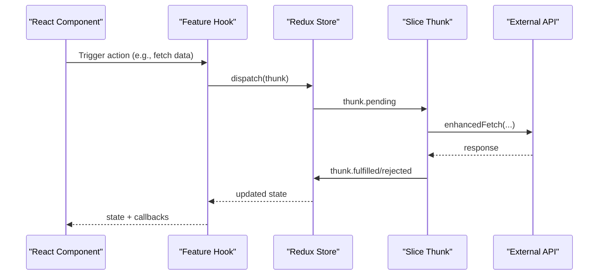

**Diagram sources**
- [useAnnouncements.ts](file://Estate_link_App/src/hooks/useAnnouncements.ts#L36-L41)
- [announcementSlice.ts](file://Estate_link_App/src/store/slices/announcementSlice.ts#L31-L38)
- [index.ts](file://Estate_link_App/src/store/index.ts#L40-L74)

## Detailed Component Analysis

### Store Configuration and Persistence
- Root reducer composes all slices.
- Persist configuration whitelists sensitive or frequently used slices for offline continuity.
- Serializability middleware ignores specific actions and paths to prevent warnings during async flows.

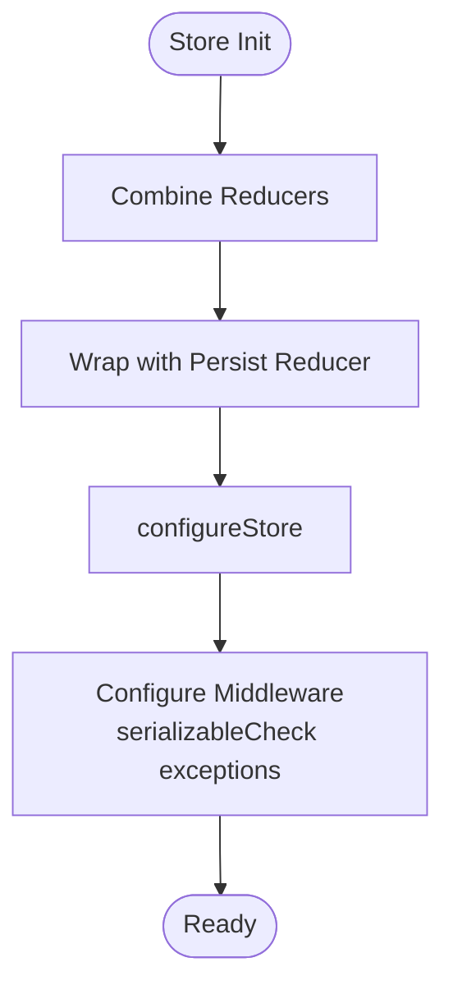

**Diagram sources**
- [index.ts](file://Estate_link_App/src/store/index.ts#L23-L74)

**Section sources**
- [index.ts](file://Estate_link_App/src/store/index.ts#L15-L79)

### Authentication Slice
- State: user identity, tokens, loading/error flags, OTP metadata.
- Async thunks: user status check, login (multi-type), OTP request/verify/resend, password set, password change.
- Reducers: lifecycle actions for loading/error management, OTP handling, logout, profile updates.
- Error handling: robust parsing of server responses, network checks, and user-friendly messages.

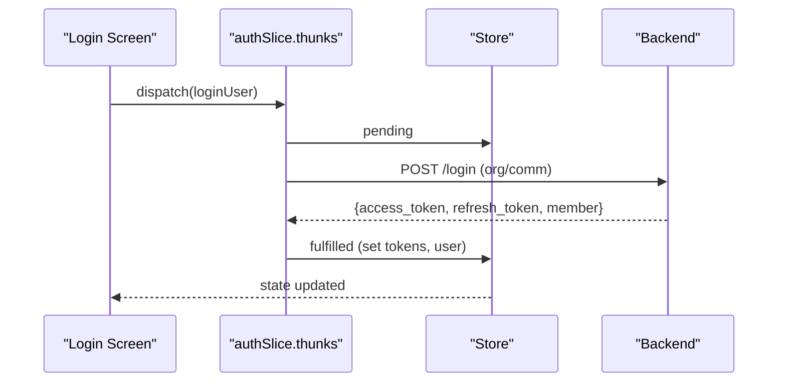

**Diagram sources**
- [authSlice.ts](file://Estate_link_App/src/store/slices/authSlice.ts#L200-L289)

**Section sources**
- [authSlice.ts](file://Estate_link_App/src/store/slices/authSlice.ts#L6-L564)

### Announcements Slice
- State: list of announcements, selected item, filters, counts, and load flags.
- Async thunks: fetch, create, update, delete, toggle pin, increment views, force expire, restore, and metadata fetches (towers, units, labels).
- Reducers: selection, filtering, clearing, and logout cleanup.
- Optimizations: conditional loading, optimistic updates, and selective state updates.

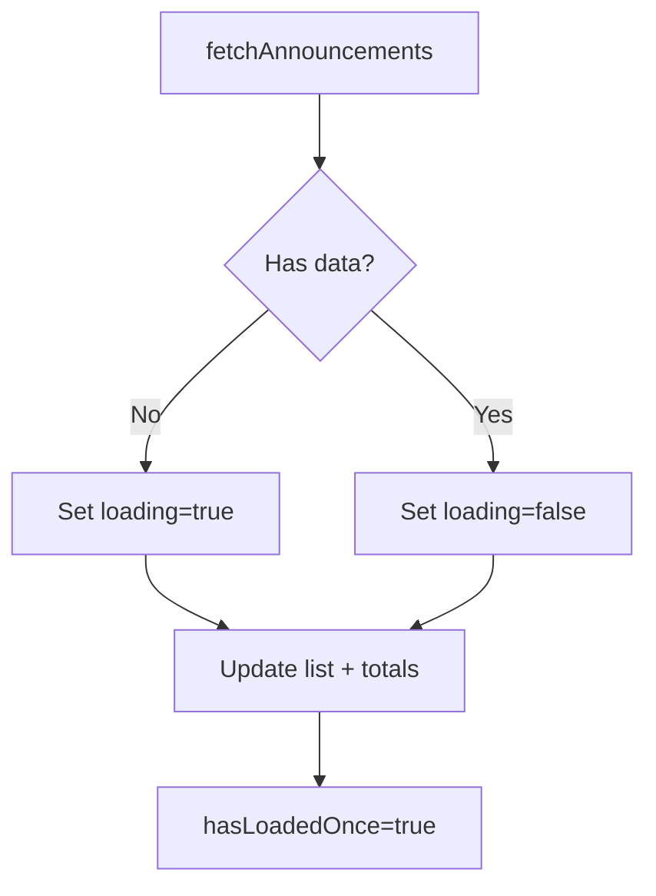

**Diagram sources**
- [announcementSlice.ts](file://Estate_link_App/src/store/slices/announcementSlice.ts#L162-L180)

**Section sources**
- [announcementSlice.ts](file://Estate_link_App/src/store/slices/announcementSlice.ts#L14-L324)

### Notices Slice
- Similar structure to announcements with domain-specific fields and async thunks for notices CRUD and metadata.
- State normalization mirrors announcements pattern.

**Section sources**
- [noticeSlice.ts](file://Estate_link_App/src/store/slices/noticeSlice.ts#L14-L320)

### Bulletins Slice
- State: separate arrays for current, pending, and archive bulletins, plus filters and timestamps.
- Async thunks: fetch, create, update, approve, reject, archive.
- Reducers: optimistic add/remove, cross-array updates, and status transitions.
- Optimistic UI: immediate state updates for smoother UX.

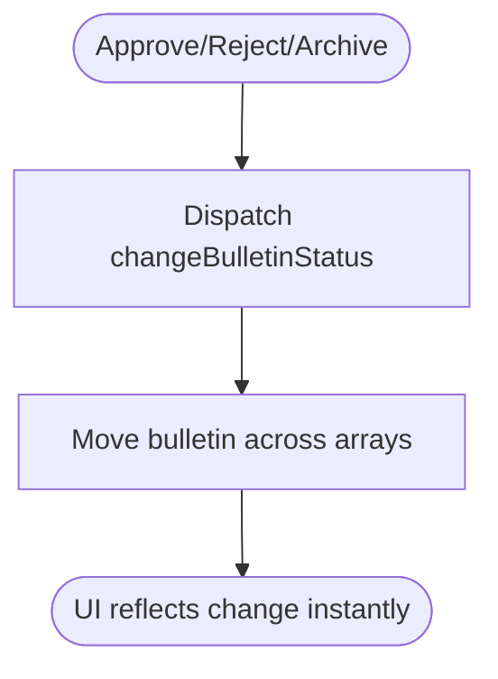

**Diagram sources**
- [bulletinSlice.ts](file://Estate_link_App/src/store/slices/bulletinSlice.ts#L274-L319)

**Section sources**
- [bulletinSlice.ts](file://Estate_link_App/src/store/slices/bulletinSlice.ts#L182-L449)

### Profile Slice
- State: profile data, related unit relationships, member types, and loading flags.
- Async thunks: fetch profile, member details, update profile, member types, user tower/unit, and member status change.
- Token retrieval: prioritizes Redux state, falls back to AsyncStorage when needed.

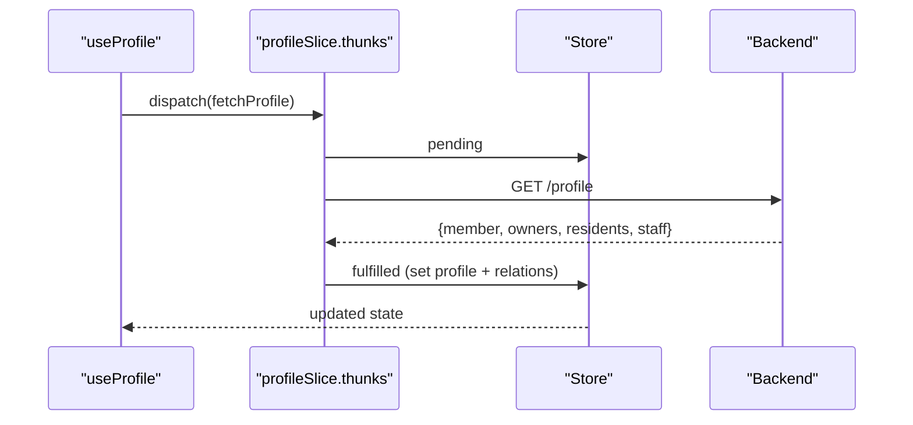

**Diagram sources**
- [profileSlice.ts](file://Estate_link_App/src/store/slices/profileSlice.ts#L71-L104)

**Section sources**
- [profileSlice.ts](file://Estate_link_App/src/store/slices/profileSlice.ts#L6-L389)

### Service Fee Slice
- State: units, accessible units, payments, upcoming billings, filters, stats, and loading/error flags.
- Async thunks: access check, fetch units/payments, create/update/delete payment, payment choices, filter options, upcoming billings.
- Behavior: preserves units from access check when API returns empty data; maintains selected unit context; stores receipt IDs and payment metadata.

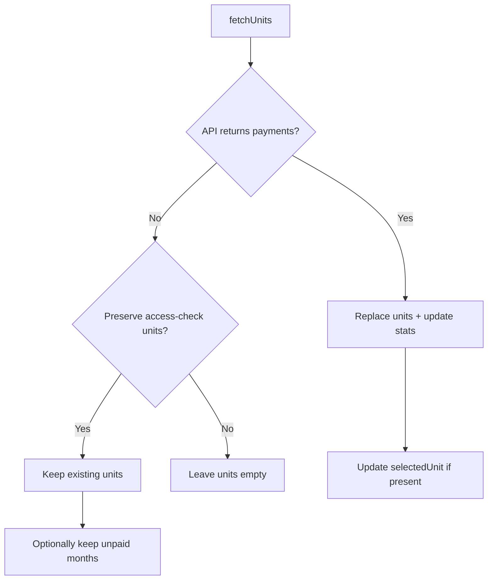

**Diagram sources**
- [serviceFeeSlice.ts](file://Estate_link_App/src/store/slices/serviceFeeSlice.ts#L674-L794)

**Section sources**
- [serviceFeeSlice.ts](file://Estate_link_App/src/store/slices/serviceFeeSlice.ts#L95-L936)

### Contacts Slice
- State: contacts list, selected contact, and load flags.
- Async thunks: fetch, create, update, delete, and by-id fetch.
- Cleanup: resets on logout.

**Section sources**
- [contactSlice.ts](file://Estate_link_App/src/store/slices/contactSlice.ts#L11-L187)

### Company Settings Slice
- State: public company settings, loading, error, last fetched timestamp, and “loaded once” flag.
- Async thunk: fetch with in-memory cache window; returns cached data if fresh; falls back to expired cache on error.

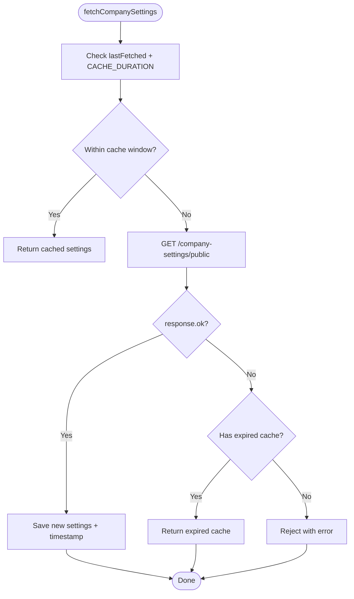

**Diagram sources**
- [companySettingsSlice.ts](file://Estate_link_App/src/store/slices/companySettingsSlice.ts#L38-L81)

**Section sources**
- [companySettingsSlice.ts](file://Estate_link_App/src/store/slices/companySettingsSlice.ts#L17-L134)

### Forgot Password Slice
- State: OTP messaging, loading, error, email, and reset completion flag.
- Async thunks: request OTP, resend OTP, verify OTP, set new password.
- Retry logic: exponential backoff with network checks; rejects with structured payloads.

**Section sources**
- [forgotPasswordSlice.ts](file://Estate_link_App/src/store/slices/forgotPasswordSlice.ts#L5-L324)

### React Integration with Hooks
- Typed hooks: useAppDispatch and useAppSelector provide strongly-typed access to the store.
- Feature hooks:
  - useAnnouncements: wraps announcement slice actions and computed helpers.
  - useProfile: wraps profile slice actions and auto-refresh logic.
  - useBulletins: hybrid approach mixing direct service calls and Redux slice actions.

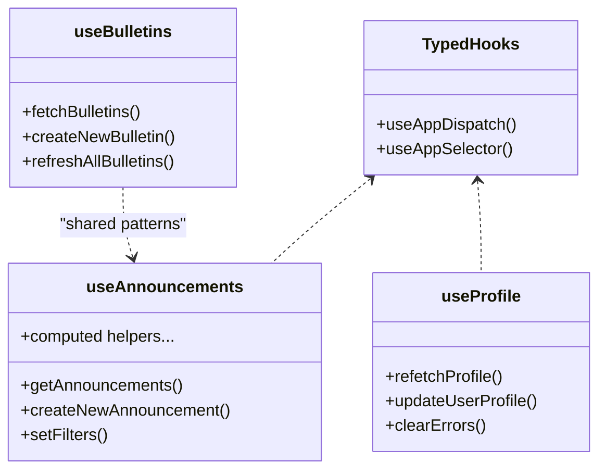

**Diagram sources**
- [hooks.ts](file://Estate_link_App/src/store/hooks.ts#L1-L6)
- [useAnnouncements.ts](file://Estate_link_App/src/hooks/useAnnouncements.ts#L23-L246)
- [useProfile.ts](file://Estate_link_App/src/hooks/useProfile.ts#L21-L183)
- [useBulletins.ts](file://Estate_link_App/src/hooks/useBulletins.ts#L14-L196)

**Section sources**
- [hooks.ts](file://Estate_link_App/src/store/hooks.ts#L1-L6)
- [useAnnouncements.ts](file://Estate_link_App/src/hooks/useAnnouncements.ts#L1-L247)
- [useProfile.ts](file://Estate_link_App/src/hooks/useProfile.ts#L1-L183)
- [useBulletins.ts](file://Estate_link_App/src/hooks/useBulletins.ts#L1-L196)

## Dependency Analysis
- Coupling: Slices depend on shared auth token retrieval and network utilities; some slices coordinate via logout actions to clear state consistently.
- Cohesion: Each slice encapsulates a domain’s state, actions, and async logic.
- External dependencies: Network utilities, AsyncStorage for persistence, and service modules.

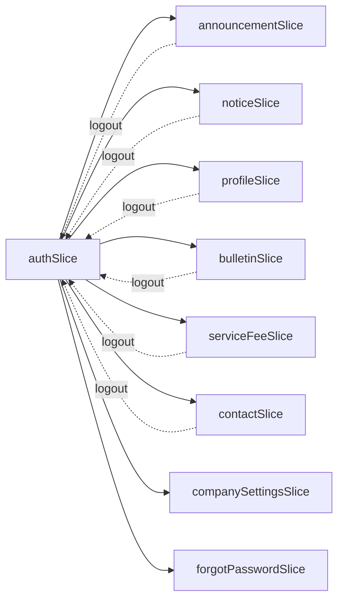

**Diagram sources**
- [authSlice.ts](file://Estate_link_App/src/store/slices/authSlice.ts#L361-L550)
- [announcementSlice.ts](file://Estate_link_App/src/store/slices/announcementSlice.ts#L301-L311)
- [noticeSlice.ts](file://Estate_link_App/src/store/slices/noticeSlice.ts#L297-L307)
- [profileSlice.ts](file://Estate_link_App/src/store/slices/profileSlice.ts#L365-L376)
- [bulletinSlice.ts](file://Estate_link_App/src/store/slices/bulletinSlice.ts#L411-L421)
- [serviceFeeSlice.ts](file://Estate_link_App/src/store/slices/serviceFeeSlice.ts#L919-L923)
- [contactSlice.ts](file://Estate_link_App/src/store/slices/contactSlice.ts#L174-L176)
- [companySettingsSlice.ts](file://Estate_link_App/src/store/slices/companySettingsSlice.ts#L84-L129)
- [forgotPasswordSlice.ts](file://Estate_link_App/src/store/slices/forgotPasswordSlice.ts#L314-L318)

**Section sources**
- [authSlice.ts](file://Estate_link_App/src/store/slices/authSlice.ts#L361-L550)
- [announcementSlice.ts](file://Estate_link_App/src/store/slices/announcementSlice.ts#L301-L311)
- [noticeSlice.ts](file://Estate_link_App/src/store/slices/noticeSlice.ts#L297-L307)
- [profileSlice.ts](file://Estate_link_App/src/store/slices/profileSlice.ts#L365-L376)
- [bulletinSlice.ts](file://Estate_link_App/src/store/slices/bulletinSlice.ts#L411-L421)
- [serviceFeeSlice.ts](file://Estate_link_App/src/store/slices/serviceFeeSlice.ts#L919-L923)
- [contactSlice.ts](file://Estate_link_App/src/store/slices/contactSlice.ts#L174-L176)
- [companySettingsSlice.ts](file://Estate_link_App/src/store/slices/companySettingsSlice.ts#L84-L129)
- [forgotPasswordSlice.ts](file://Estate_link_App/src/store/slices/forgotPasswordSlice.ts#L314-L318)

## Performance Considerations
- Conditional loading: Slices avoid redundant loading spinners by checking existing data before enabling loading flags.
- Optimistic updates: Bulletins and announcements update immediately upon create/update/delete to reduce perceived latency.
- Caching: Company settings slice caches responses with a TTL and gracefully falls back to expired cache on errors.
- Token retrieval: Profile slice prefers Redux state and falls back to AsyncStorage to minimize repeated reads.
- Pagination and filtering: Service fee slice supports pagination and filters to limit payload sizes.
- Middleware tuning: Serializability exceptions are configured to avoid noisy warnings for async flows.

[No sources needed since this section provides general guidance]

## Troubleshooting Guide
Common issues and resolutions:
- Authentication failures: Inspect login thunk error handling and ensure tokens are present in Redux state or AsyncStorage.
- Network errors: Thunks use retry logic with exponential backoff and network checks; verify connectivity before retry attempts.
- State not persisting: Confirm whitelist entries and serializability exceptions in the store configuration.
- Empty data scenarios: Service fee slice preserves units from access checks when API returns empty data; verify selected unit context.
- Logout cleanup: Several slices reset state on logout; ensure logout action is dispatched consistently.

**Section sources**
- [authSlice.ts](file://Estate_link_App/src/store/slices/authSlice.ts#L44-L79)
- [companySettingsSlice.ts](file://Estate_link_App/src/store/slices/companySettingsSlice.ts#L34-L81)
- [serviceFeeSlice.ts](file://Estate_link_App/src/store/slices/serviceFeeSlice.ts#L685-L751)
- [profileSlice.ts](file://Estate_link_App/src/store/slices/profileSlice.ts#L35-L68)
- [index.ts](file://Estate_link_App/src/store/index.ts#L40-L74)

## Conclusion
The Redux state layer is modular, typed, and resilient. It leverages async thunks, optimistic updates, and caching to deliver a responsive user experience while maintaining predictable state transitions. The typed hooks and slice boundaries simplify integration with React components and enable scalable maintenance across features.