# User Interface Components

<cite>
**Referenced Files in This Document**
- [Button.tsx](file://Estate_link_App/src/components/Button.tsx)
- [TextInput.tsx](file://Estate_link_App/components/TextInput.tsx)
- [ErrorMessage.tsx](file://Estate_link_App/components/ErrorMessage.tsx)
- [SuccessMessage.tsx](file://Estate_link_App/components/SuccessMessage.tsx)
- [ErrorPopup.tsx](file://Estate_link_App/components/ErrorPopup.tsx)
- [SuccessPopup.tsx](file://Estate_link_App/components/SuccessPopup.tsx)
- [DeleteConfirmationModal.tsx](file://Estate_link_App/components/DeleteConfirmationModal.tsx)
- [Label.tsx](file://Estate_link_App/src/components/Label.tsx)
- [SkeletonLoader.tsx](file://Estate_link_App/src/components/SkeletonLoader.tsx)
- [OptimizedImage.tsx](file://Estate_link_App/src/components/OptimizedImage.tsx)
- [NetworkStatusIndicator.tsx](file://Estate_link_App/src/components/NetworkStatusIndicator.tsx)
- [ResponsiveExample.tsx](file://Estate_link_App/src/components/ResponsiveExample.tsx)
- [responsiveStyles.ts](file://Estate_link_App/src/utils/responsiveStyles.ts)
- [responsiveUtils.ts](file://Estate_link_App/src/utils/responsiveUtils.ts)
- [globalResponsiveConfig.ts](file://Estate_link_App/src/utils/globalResponsiveConfig.ts)
- [index.ts (src components)](file://Estate_link_App/src/components/index.ts)
- [index.ts (shared components)](file://Estate_link_App/components/index.ts)
- [ErrorBoundary.jsx](file://frontend/src/Components/Error/ErrorBoundary.jsx)
- [GenericError.jsx](file://frontend/src/Features/NotFound/GenericError.jsx)
- [Routes.jsx](file://frontend/src/Routes/Routes.jsx)
- [TestErrorPage.jsx](file://frontend/src/pages/TestErrorPage.jsx)
</cite>

## Update Summary
**Changes Made**
- Added comprehensive error handling documentation for React ErrorBoundary and GenericError components
- Enhanced component composition patterns to include error boundary integration
- Updated troubleshooting guide with error boundary specific guidance
- Added PropTypes validation and defaultProps documentation for improved type safety

## Table of Contents
1. [Introduction](#introduction)
2. [Project Structure](#project-structure)
3. [Core Components](#core-components)
4. [Architecture Overview](#architecture-overview)
5. [Detailed Component Analysis](#detailed-component-analysis)
6. [Error Handling System](#error-handling-system)
7. [Dependency Analysis](#dependency-analysis)
8. [Performance Considerations](#performance-considerations)
9. [Troubleshooting Guide](#troubleshooting-guide)
10. [Conclusion](#conclusion)
11. [Appendices](#appendices)

## Introduction
This document describes the reusable UI component library used across the application. It focuses on form components, table-related patterns, button variants, and utility components. It explains component design patterns, prop interfaces, styling approaches, form validation and error display mechanisms, responsive design, accessibility features, component composition patterns, testing strategies, and usage guidelines.

**Updated** Enhanced with comprehensive error handling system documentation including ErrorBoundary and GenericError components with PropTypes validation and defaultProps for improved type safety and error handling reliability.

## Project Structure
The UI library is organized into two primary areas:
- Shared components under Estate_link_App/components (primarily form inputs, messages, and modals)
- Application components under Estate_link_App/src/components (buttons, labels, loaders, images, network indicators, responsive demos)
- Error handling components under frontend/src/Components/Error and frontend/src/Features/NotFound

Exports are centralized via index.ts files to simplify imports across the app.

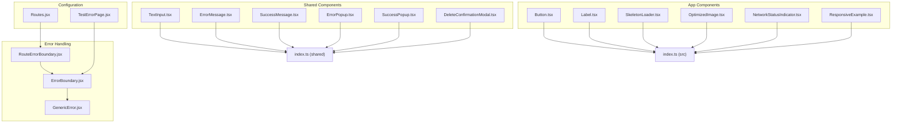

**Diagram sources**
- [ErrorBoundary.jsx](file://frontend/src/Components/Error/ErrorBoundary.jsx#L1-L43)
- [GenericError.jsx](file://frontend/src/Features/NotFound/GenericError.jsx#L1-L67)
- [Routes.jsx](file://frontend/src/Routes/Routes.jsx#L9-L23)
- [TestErrorPage.jsx](file://frontend/src/pages/TestErrorPage.jsx#L1-L32)

**Section sources**
- [index.ts (shared components)](file://Estate_link_App/components/index.ts#L1-L12)
- [index.ts (src components)](file://Estate_link_App/src/components/index.ts#L1-L18)

## Core Components
This section summarizes the primary reusable components and their responsibilities.

- Button: Variant and size-driven button with loading and disabled states.
- TextInput: Form input with optional floating label, focus handling, and error display.
- Messages and Popups: Dedicated components for success/error feedback and confirmation modals.
- Label: Tag-style labels with variants and sizes.
- SkeletonLoader: Animated skeleton placeholders for loading states.
- OptimizedImage: Image with caching, shimmer loading, and error fallback.
- NetworkStatusIndicator: Network connectivity status and manual handling controls.
- Responsive utilities: Hooks and helpers for responsive layouts and typography.
- **ErrorBoundary**: React ErrorBoundary component with PropTypes validation and error fallback UI.
- **GenericError**: Comprehensive error display component with reset functionality and navigation support.

**Section sources**
- [Button.tsx](file://Estate_link_App/src/components/Button.tsx#L10-L38)
- [TextInput.tsx](file://Estate_link_App/components/TextInput.tsx#L10-L38)
- [ErrorMessage.tsx](file://Estate_link_App/components/ErrorMessage.tsx#L3-L6)
- [SuccessMessage.tsx](file://Estate_link_App/components/SuccessMessage.tsx#L5-L10)
- [ErrorPopup.tsx](file://Estate_link_App/components/ErrorPopup.tsx#L7-L13)
- [SuccessPopup.tsx](file://Estate_link_App/components/SuccessPopup.tsx#L7-L13)
- [DeleteConfirmationModal.tsx](file://Estate_link_App/components/DeleteConfirmationModal.tsx#L5-L14)
- [Label.tsx](file://Estate_link_App/src/components/Label.tsx#L4-L11)
- [SkeletonLoader.tsx](file://Estate_link_App/src/components/SkeletonLoader.tsx#L5-L17)
- [OptimizedImage.tsx](file://Estate_link_App/src/components/OptimizedImage.tsx#L9-L17)
- [NetworkStatusIndicator.tsx](file://Estate_link_App/src/components/NetworkStatusIndicator.tsx#L5-L6)
- [ErrorBoundary.jsx](file://frontend/src/Components/Error/ErrorBoundary.jsx#L1-L43)
- [GenericError.jsx](file://frontend/src/Features/NotFound/GenericError.jsx#L1-L67)

## Architecture Overview
The UI library follows a modular pattern:
- Props-first design: Each component exposes a clear prop interface.
- Composition: Components are composed to build forms and screens.
- Responsive utilities: Hooks and helpers compute device-aware values.
- Accessibility: Focus handling, disabled states, and semantic feedback.
- **Error handling**: Integrated ErrorBoundary system with comprehensive error fallback and recovery mechanisms.

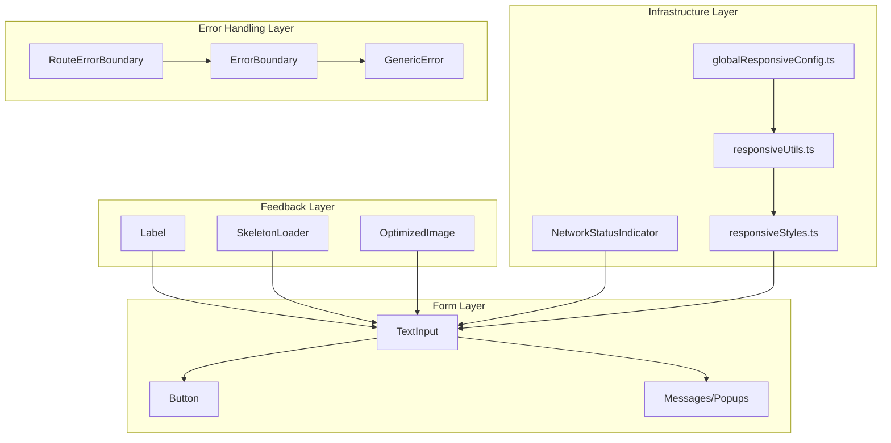

**Diagram sources**
- [responsiveUtils.ts](file://Estate_link_App/src/utils/responsiveUtils.ts#L14-L20)
- [responsiveStyles.ts](file://Estate_link_App/src/utils/responsiveStyles.ts#L16-L18)
- [globalResponsiveConfig.ts](file://Estate_link_App/src/utils/globalResponsiveConfig.ts#L105-L179)
- [ErrorBoundary.jsx](file://frontend/src/Components/Error/ErrorBoundary.jsx#L1-L43)
- [GenericError.jsx](file://frontend/src/Features/NotFound/GenericError.jsx#L1-L67)
- [Routes.jsx](file://frontend/src/Routes/Routes.jsx#L9-L23)

## Detailed Component Analysis

### Button
- Purpose: Unified button with variants (primary, secondary, outline, ghost), sizes (small, medium, large), and loading/disabled states.
- Props: title, onPress, disabled, loading, variant, size, fullWidth, className, textClassName, style, textStyle, activeOpacity.
- Styling: Computed class names and inline styles based on variant and size; loading state renders an ActivityIndicator with variant-aware color.
- Accessibility: Uses activeOpacity for feedback; disabled state prevents interaction.

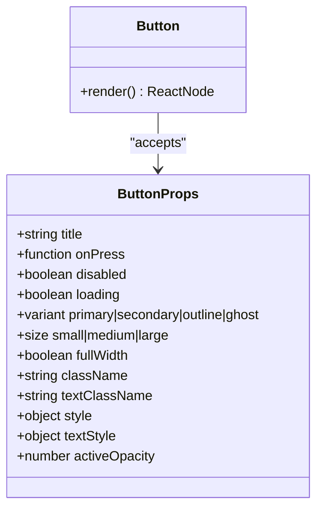

**Diagram sources**
- [Button.tsx](file://Estate_link_App/src/components/Button.tsx#L10-L38)

**Section sources**
- [Button.tsx](file://Estate_link_App/src/components/Button.tsx#L10-L96)

### TextInput
- Purpose: Form input with optional floating label animation, focus handling, and error messaging.
- Props: Extends TextInputProps with label, error, required, containerClassName, labelClassName, inputClassName, floatingLabel.
- Behavior: Animated label moves and resizes on focus/value presence; supports standard input mode when floatingLabel is false.
- Error display: Renders error text below the input when error is provided.

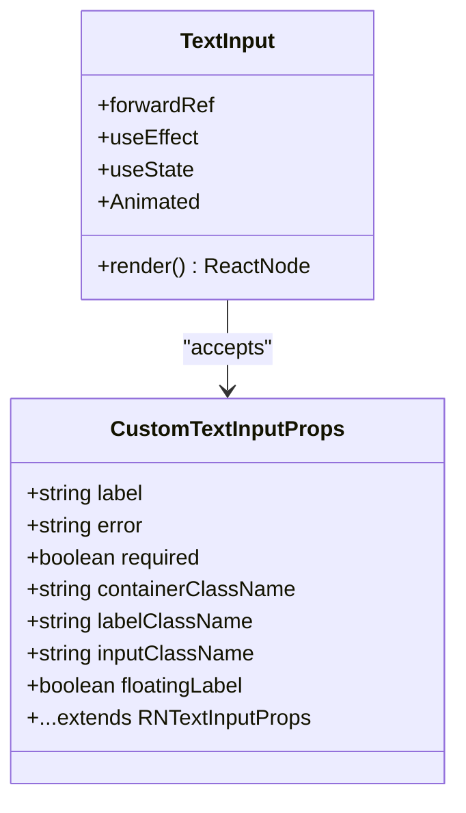

**Diagram sources**
- [TextInput.tsx](file://Estate_link_App/components/TextInput.tsx#L10-L38)

**Section sources**
- [TextInput.tsx](file://Estate_link_App/components/TextInput.tsx#L10-L142)

### Messages and Popups
- ErrorMessage: Lightweight row with icon and message text; conditionally rendered based on visibility.
- SuccessMessage: Modal with success icon, title, message, and OK action handler.
- ErrorPopup: Modal with red error icon, title, message, and OK action.
- SuccessPopup: Modal with green success icon, title, message, and OK action.
- DeleteConfirmationModal: Confirmation dialog with cancel/confirm actions and optional loading state.

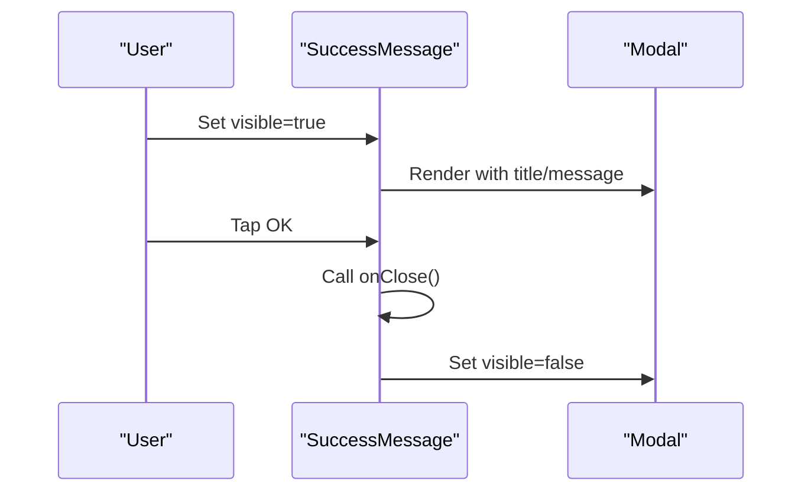

**Diagram sources**
- [SuccessMessage.tsx](file://Estate_link_App/components/SuccessMessage.tsx#L12-L94)

**Section sources**
- [ErrorMessage.tsx](file://Estate_link_App/components/ErrorMessage.tsx#L3-L24)
- [SuccessMessage.tsx](file://Estate_link_App/components/SuccessMessage.tsx#L5-L94)
- [ErrorPopup.tsx](file://Estate_link_App/components/ErrorPopup.tsx#L7-L153)
- [SuccessPopup.tsx](file://Estate_link_App/components/SuccessPopup.tsx#L7-L153)
- [DeleteConfirmationModal.tsx](file://Estate_link_App/components/DeleteConfirmationModal.tsx#L5-L171)

### Label
- Purpose: Tag-like labels with variant (default, success, warning, error, info) and size (sm, md, lg).
- Styling: Variant and size classes combined with platform-specific font adjustments and fallbacks.
- Accessibility: Selectable text disabled; allowFontScaling enabled with min/max constraints.

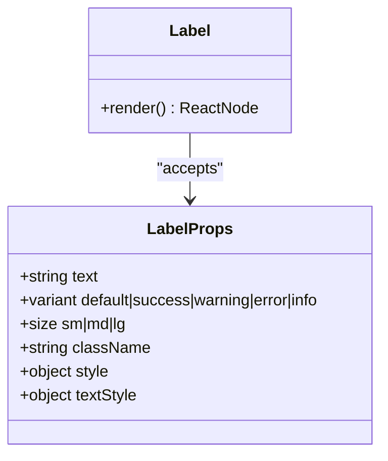

**Diagram sources**
- [Label.tsx](file://Estate_link_App/src/components/Label.tsx#L4-L20)

**Section sources**
- [Label.tsx](file://Estate_link_App/src/components/Label.tsx#L4-L121)

### SkeletonLoader
- Purpose: Animated skeleton placeholders for loading states.
- Variants: SkeletonLoader (basic), SkeletonCard (composite), SkeletonGrid (grid of cards).
- Behavior: Animated opacity loop; composes multiple skeletons for cards and grids.

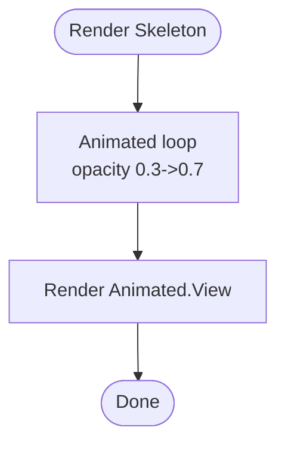

**Diagram sources**
- [SkeletonLoader.tsx](file://Estate_link_App/src/components/SkeletonLoader.tsx#L20-L40)

**Section sources**
- [SkeletonLoader.tsx](file://Estate_link_App/src/components/SkeletonLoader.tsx#L5-L190)

### OptimizedImage
- Purpose: Image with caching, shimmer loading, activity indicator, and error fallback.
- Features: Global cache of loaded URIs, fade-in on load, shimmer gradient animation, error icon, and progressive rendering.
- Props: Extends ImageProps with containerClassName, showLoadingIndicator, loadingIndicatorSize/color, and resizeMode.

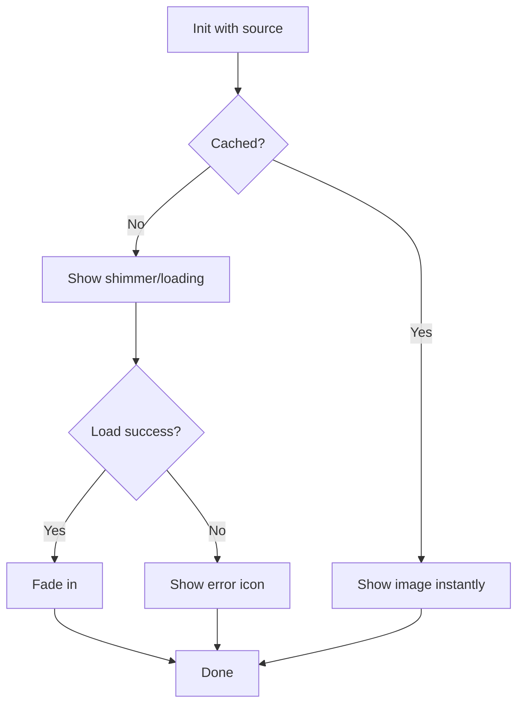

**Diagram sources**
- [OptimizedImage.tsx](file://Estate_link_App/src/components/OptimizedImage.tsx#L37-L99)

**Section sources**
- [OptimizedImage.tsx](file://Estate_link_App/src/components/OptimizedImage.tsx#L9-L197)

### NetworkStatusIndicator
- Purpose: Displays network status, last known IP, retry count, and provides manual handling and rediscovery actions.
- Props: None; uses a hook to derive state and handlers.
- UX: Alerts for success/failure; disables buttons during handling.

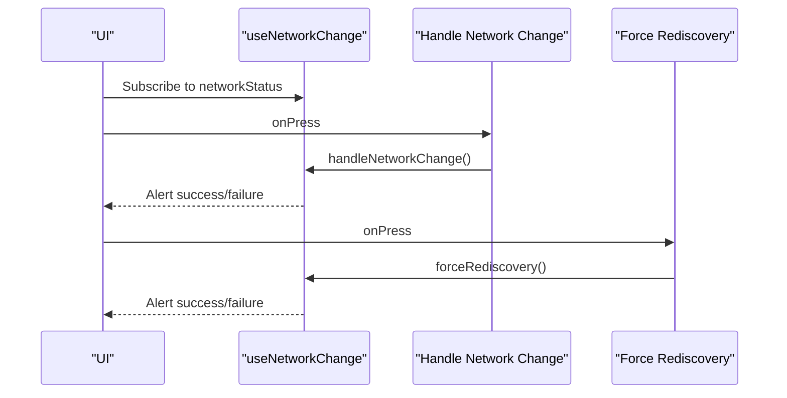

**Diagram sources**
- [NetworkStatusIndicator.tsx](file://Estate_link_App/src/components/NetworkStatusIndicator.tsx#L5-L32)

**Section sources**
- [NetworkStatusIndicator.tsx](file://Estate_link_App/src/components/NetworkStatusIndicator.tsx#L5-L138)

### Responsive Utilities
- responsiveUtils.ts: Provides responsive scaling, device detection, grid calculations, modal sizing, and spacing helpers.
- responsiveStyles.ts: Prebuilt responsive styles and utilities for common layouts.
- globalResponsiveConfig.ts: Global responsive configuration with breakpoints and device-aware values.

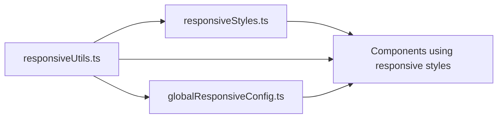

**Diagram sources**
- [responsiveUtils.ts](file://Estate_link_App/src/utils/responsiveUtils.ts#L14-L20)
- [responsiveStyles.ts](file://Estate_link_App/src/utils/responsiveStyles.ts#L16-L18)
- [globalResponsiveConfig.ts](file://Estate_link_App/src/utils/globalResponsiveConfig.ts#L105-L179)

**Section sources**
- [responsiveUtils.ts](file://Estate_link_App/src/utils/responsiveUtils.ts#L1-L492)
- [responsiveStyles.ts](file://Estate_link_App/src/utils/responsiveStyles.ts#L1-L342)
- [globalResponsiveConfig.ts](file://Estate_link_App/src/utils/globalResponsiveConfig.ts#L1-L279)

## Error Handling System

### ErrorBoundary Component
The ErrorBoundary component provides comprehensive error handling for React applications with PropTypes validation and robust error recovery mechanisms.

- Purpose: Catches JavaScript errors anywhere in the child component tree, logs them, and displays a fallback UI.
- Props: children (PropTypes.node.isRequired) - The content to wrap with error boundary functionality.
- State Management: Tracks hasError boolean and error object for rendering fallback UI.
- Lifecycle Methods: Implements getDerivedStateFromError for error state updates and componentDidCatch for error logging.
- Reset Functionality: Provides resetErrorBoundary method to recover from errors and restore normal rendering.

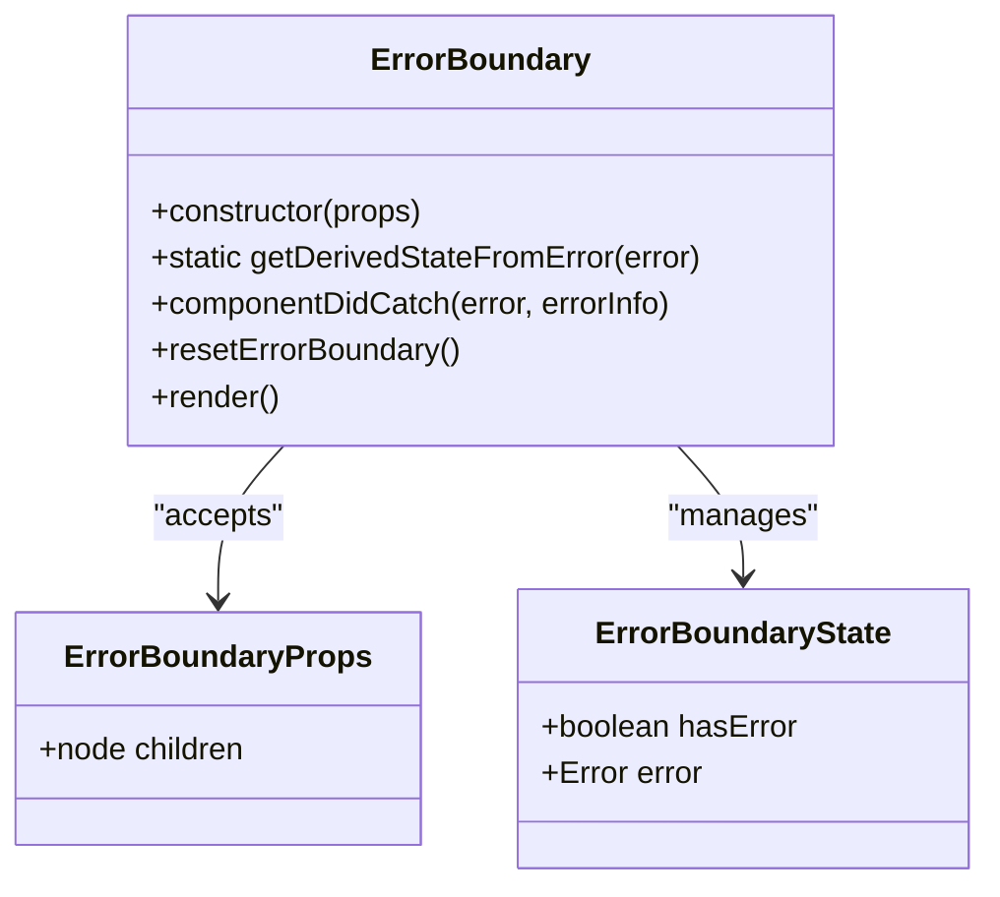

**Diagram sources**
- [ErrorBoundary.jsx](file://frontend/src/Components/Error/ErrorBoundary.jsx#L5-L37)

**Section sources**
- [ErrorBoundary.jsx](file://frontend/src/Components/Error/ErrorBoundary.jsx#L1-L43)

### GenericError Component
The GenericError component provides a comprehensive error display interface with PropTypes validation, defaultProps, and navigation capabilities.

- Purpose: Displays user-friendly error messages with reset functionality and navigation options.
- Props: 
  - error: PropTypes.shape({ message: PropTypes.string }) - Error object with message property.
  - resetErrorBoundary: PropTypes.func - Callback function to reset error boundary state.
- Defaults: error: null, resetErrorBoundary: null (PropTypes defaultProps).
- Navigation Logic: Attempts to reset error boundary if provided, otherwise navigates back or to home.
- Visual Design: Responsive layout with error illustration, descriptive message, and styled button.

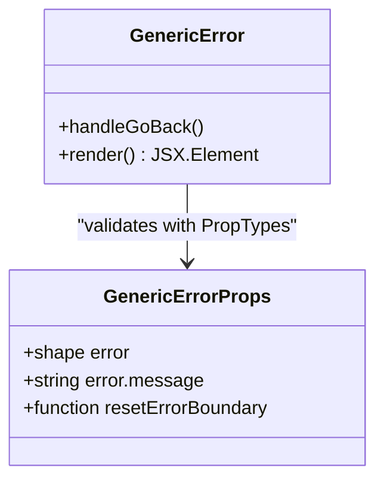

**Diagram sources**
- [GenericError.jsx](file://frontend/src/Features/NotFound/GenericError.jsx#L6-L53)

**Section sources**
- [GenericError.jsx](file://frontend/src/Features/NotFound/GenericError.jsx#L1-L67)

### RouteErrorBoundary Integration
The RouteErrorBoundary component provides route-level error handling by wrapping individual route components with error boundary functionality.

- Purpose: Wraps route elements with ErrorBoundary to provide granular error handling per route.
- Props: children (PropTypes.node.isRequired) - The route component to wrap.
- Implementation: Simple wrapper that renders ErrorBoundary with the wrapped children.
- Usage: Applied to all route configurations in Routes.jsx for comprehensive error coverage.

**Section sources**
- [Routes.jsx](file://frontend/src/Routes/Routes.jsx#L9-L23)

### Error Boundary Testing
The TestErrorPage component demonstrates error boundary functionality with interactive error triggering.

- Purpose: Provides a controlled environment to test error boundary behavior.
- Implementation: State-based error throwing mechanism with user-triggered error simulation.
- Usage: Used for development and testing of error handling workflows.

**Section sources**
- [TestErrorPage.jsx](file://frontend/src/pages/TestErrorPage.jsx#L1-L32)

## Dependency Analysis
- Component exports: Centralized via index.ts files to avoid scattered imports.
- Responsive coupling: Components consume responsive utilities and styles to adapt to device types.
- Modal and popup coupling: Modals depend on Dimensions and platform specifics for responsive sizing.
- **Error handling coupling**: ErrorBoundary depends on GenericError for fallback UI rendering.
- **Route integration**: RouteErrorBoundary wraps route components for comprehensive error coverage.

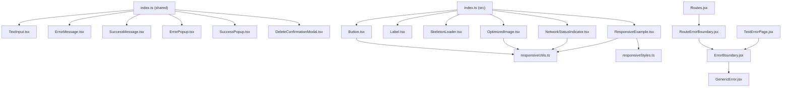

**Diagram sources**
- [index.ts (shared components)](file://Estate_link_App/components/index.ts#L1-L12)
- [index.ts (src components)](file://Estate_link_App/src/components/index.ts#L1-L18)
- [ErrorBoundary.jsx](file://frontend/src/Components/Error/ErrorBoundary.jsx#L1-L43)
- [GenericError.jsx](file://frontend/src/Features/NotFound/GenericError.jsx#L1-L67)
- [Routes.jsx](file://frontend/src/Routes/Routes.jsx#L9-L23)

**Section sources**
- [index.ts (shared components)](file://Estate_link_App/components/index.ts#L1-L12)
- [index.ts (src components)](file://Estate_link_App/src/components/index.ts#L1-L18)

## Performance Considerations
- Button: Uses activeOpacity and disabled state to prevent unnecessary re-renders; loading indicator color adapts to variant.
- TextInput: Animated.Value interpolation computed per render; floating label animation uses Animated.timing with native driver off to support text interpolation.
- SkeletonLoader: Uses Animated.loop with useNativeDriver for smooth opacity transitions.
- OptimizedImage: Global cache avoids redundant fetches; progressive rendering enabled; shimmer uses LinearGradient animation.
- NetworkStatusIndicator: Uses hooks to avoid unnecessary polling; alerts minimize UI overhead.
- **ErrorBoundary**: Minimal performance impact with efficient state management and conditional rendering based on error state.
- **PropTypes validation**: Added runtime type checking with minimal performance overhead for development builds.

## Troubleshooting Guide
- Button not responding:
  - Ensure disabled or loading props are not set; verify activeOpacity and press handler.
- TextInput label not animating:
  - Confirm floatingLabel is true and Animated.Value is initialized; check focus/blur handlers.
- Modal not resizing:
  - Verify responsive dimensions and platform-specific adjustments; ensure Dimensions are used for sizing.
- Image not showing:
  - Check source validity; confirm cache state and error fallback; ensure resizeMode is supported.
- Network indicator stuck:
  - Confirm hook returns updated networkStatus; verify alert messages for success/failure.
- **ErrorBoundary not catching errors**:
  - Verify ErrorBoundary is wrapping the component correctly; check PropTypes validation for children prop.
- **GenericError not displaying**:
  - Ensure error state is properly set in ErrorBoundary; verify error object has message property.
- **Error reset not working**:
  - Confirm resetErrorBoundary callback is passed correctly; check component lifecycle methods.

**Section sources**
- [Button.tsx](file://Estate_link_App/src/components/Button.tsx#L39-L94)
- [TextInput.tsx](file://Estate_link_App/components/TextInput.tsx#L43-L59)
- [responsiveUtils.ts](file://Estate_link_App/src/utils/responsiveUtils.ts#L23-L39)
- [OptimizedImage.tsx](file://Estate_link_App/src/components/OptimizedImage.tsx#L102-L105)
- [NetworkStatusIndicator.tsx](file://Estate_link_App/src/components/NetworkStatusIndicator.tsx#L8-L32)
- [ErrorBoundary.jsx](file://frontend/src/Components/Error/ErrorBoundary.jsx#L39-L41)
- [GenericError.jsx](file://frontend/src/Features/NotFound/GenericError.jsx#L55-L65)

## Conclusion
The UI component library emphasizes composability, responsiveness, and accessibility. Components expose clear prop interfaces, leverage shared responsive utilities, and provide consistent feedback patterns for forms, modals, and loading states. The enhanced error handling system with ErrorBoundary and GenericError components provides robust error management with PropTypes validation and defaultProps for improved type safety and reliability. Following the guidelines and patterns described here ensures consistent behavior across devices and contexts.

## Appendices

### Component Composition Patterns
- Forms: Combine TextInput with ErrorMessage and Button; use Label for field hints.
- Feedback: Use SuccessMessage/ErrorPopup for confirmation/error scenarios; SkeletonLoader for loading states.
- Media: Use OptimizedImage for scalable, resilient image rendering.
- Network: Integrate NetworkStatusIndicator for connectivity awareness.
- **Error Handling**: Wrap critical components with ErrorBoundary; use RouteErrorBoundary for route-level protection; implement GenericError for user-friendly error display.

### Testing Strategies
- Unit tests: Mock props and simulate user interactions (press, focus, blur).
- Snapshot tests: Capture rendered output for responsive variants and modal states.
- Accessibility tests: Verify disabled states, focus order, and semantic feedback.
- Responsive tests: Use Dimensions mock to assert computed styles and sizes.
- **Error boundary tests**: Test error propagation, fallback UI rendering, and reset functionality using TestErrorPage.

### Error Handling Best Practices
- **PropTypes validation**: Use PropTypes for runtime type checking in development.
- **defaultProps**: Provide sensible defaults for optional props to prevent undefined behavior.
- **Error boundaries**: Implement ErrorBoundary at appropriate levels (route-level, component-level).
- **User-friendly errors**: Use GenericError for consistent error presentation.
- **Error logging**: Implement comprehensive error logging in componentDidCatch for debugging.
- **Graceful degradation**: Ensure components degrade gracefully when errors occur.