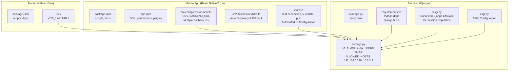
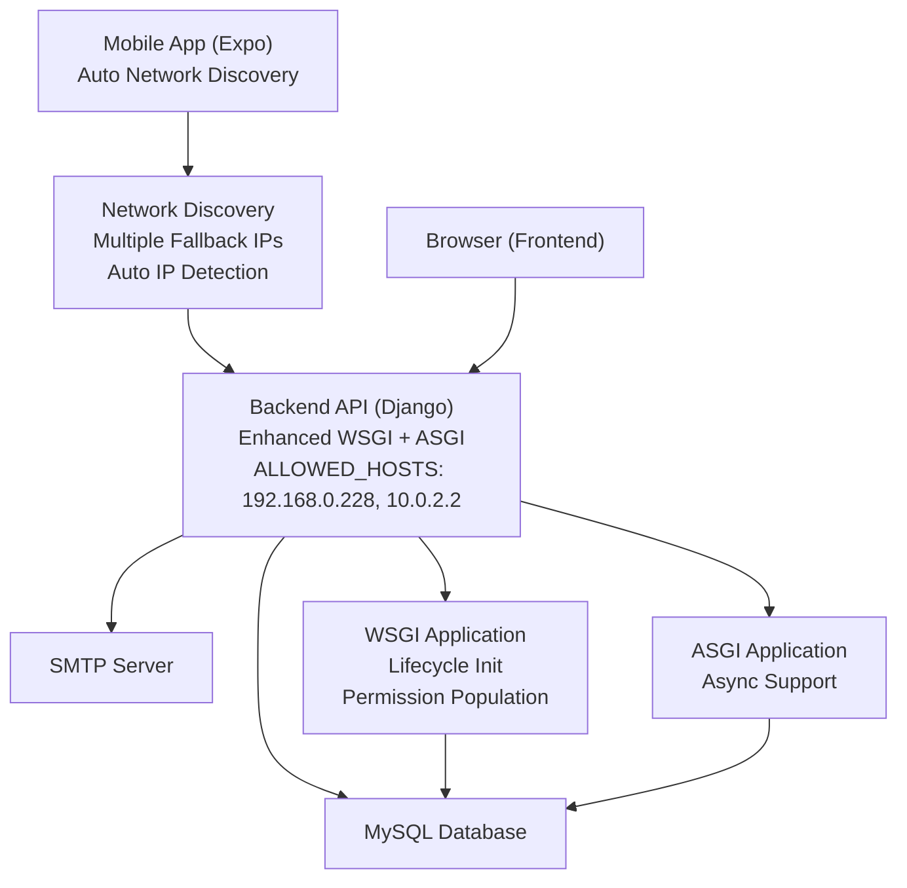
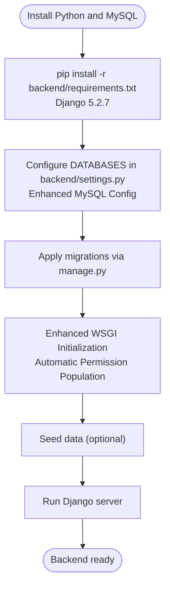
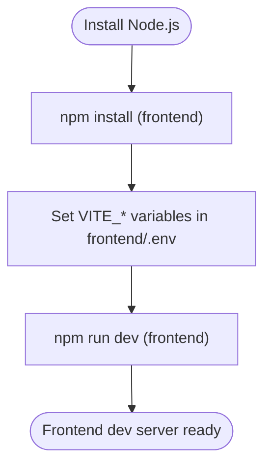
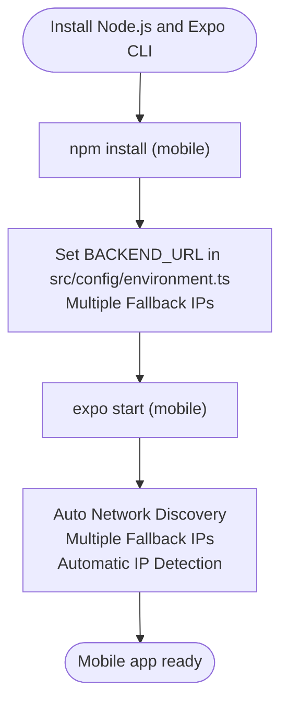
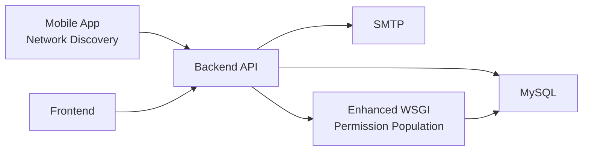

# Getting Started

<cite>
**Referenced Files in This Document**
- [backend/requirements.txt](file://backend/requirements.txt)
- [backend/manage.py](file://backend/manage.py)
- [backend/backend/settings.py](file://backend/backend/settings.py)
- [backend/backend/wsgi.py](file://backend/backend/wsgi.py)
- [backend/backend/asgi.py](file://backend/backend/asgi.py)
- [backend/group_role/auto_populate_permissions.py](file://backend/group_role/auto_populate_permissions.py)
- [backend/group_role/permission_constants.py](file://backend/group_role/permission_constants.py)
- [backend/service_fee_management/QUICK_START.md](file://backend/service_fee_management/QUICK_START.md)
- [backend/accounts/management/commands/populate_accounts.py](file://backend/accounts/management/commands/populate_accounts.py)
- [frontend/package.json](file://frontend/package.json)
- [frontend/.env](file://frontend/.env)
- [Estate_link_App/package.json](file://Estate_link_App/package.json)
- [Estate_link_App/app.json](file://Estate_link_App/app.json)
- [Estate_link_App/src/config/environment.ts](file://Estate_link_App/src/config/environment.ts)
- [Estate_link_App/src/utils/networkUtils.ts](file://Estate_link_App/src/utils/networkUtils.ts)
- [Estate_link_App/scripts/test-connection.js](file://Estate_link_App/scripts/test-connection.js)
- [Estate_link_App/scripts/update-ip.sh](file://Estate_link_App/scripts/update-ip.sh)
</cite>

## Update Summary
**Changes Made**
- Updated to reflect the removal of comprehensive local build documentation (LOCAL_BUILD_WITH_LOCALHOST_BACKEND.md) that previously provided detailed localhost backend integration setup
- Enhanced mobile app network connectivity with automatic IP discovery and fallback mechanisms
- Updated development workflow to reflect current repository state with sophisticated network discovery capabilities
- Improved environment configuration with multiple fallback URLs including the new IP address
- Added comprehensive troubleshooting guidance for network connectivity issues related to IP address configuration

## Table of Contents
1. [Introduction](#introduction)
2. [Project Structure](#project-structure)
3. [Core Components](#core-components)
4. [Architecture Overview](#architecture-overview)
5. [Detailed Component Analysis](#detailed-component-analysis)
6. [Dependency Analysis](#dependency-analysis)
7. [Performance Considerations](#performance-considerations)
8. [Troubleshooting Guide](#troubleshooting-guide)
9. [Conclusion](#conclusion)
10. [Appendices](#appendices)

## Introduction
This guide helps you install and run all three applications in the Estate Link project: the backend (Django REST API), the web frontend (React/Vite), and the mobile app (React Native/Expo). It covers system requirements, environment setup, database configuration, initial project configuration, seed data population, and quick start examples for development and production. It also documents common setup issues and troubleshooting steps, with special emphasis on network connectivity and IP address configuration.

**Updated** Enhanced with improved Django WSGI application initialization, automatic IP address configuration, and comprehensive network connectivity troubleshooting for development environments. The mobile app now features sophisticated network discovery capabilities that automatically detect and connect to backend servers.

## Project Structure
The repository contains three distinct applications:
- Backend: Django-based REST API with Django REST Framework and JWT authentication, plus multiple apps for domain features (accounts, announcements, bulletins, notices, service fees, towers, user management, etc.).
- Frontend: React web application using Vite for development and build.
- Mobile App: React Native application built with Expo for iOS and Android, featuring advanced network discovery and automatic IP configuration.

**Diagram sources**
- [backend/backend/settings.py](file://backend/backend/settings.py#L46)
- [backend/backend/wsgi.py](file://backend/backend/wsgi.py#L20-L47)
- [backend/backend/asgi.py](file://backend/backend/asgi.py#L10-L17)
- [backend/manage.py](file://backend/manage.py#L1-L23)
- [backend/requirements.txt](file://backend/requirements.txt#L6-L6)
- [Estate_link_App/src/config/environment.ts](file://Estate_link_App/src/config/environment.ts#L6)
- [Estate_link_App/src/utils/networkUtils.ts](file://Estate_link_App/src/utils/networkUtils.ts#L22-L27)
- [Estate_link_App/scripts/update-ip.sh](file://Estate_link_App/scripts/update-ip.sh#L43)

**Section sources**
- [backend/backend/settings.py](file://backend/backend/settings.py#L46)
- [backend/backend/wsgi.py](file://backend/backend/wsgi.py#L20-L47)
- [backend/backend/asgi.py](file://backend/backend/asgi.py#L10-L17)
- [backend/manage.py](file://backend/manage.py#L1-L23)
- [backend/requirements.txt](file://backend/requirements.txt#L6-L6)
- [frontend/package.json](file://frontend/package.json#L1-L70)
- [frontend/.env](file://frontend/.env#L1-L4)
- [Estate_link_App/package.json](file://Estate_link_App/package.json#L1-L93)
- [Estate_link_App/app.json](file://Estate_link_App/app.json#L1-L66)
- [Estate_link_App/src/config/environment.ts](file://Estate_link_App/src/config/environment.ts#L1-L84)
- [Estate_link_App/src/utils/networkUtils.ts](file://Estate_link_App/src/utils/networkUtils.ts#L1-L512)
- [Estate_link_App/scripts/test-connection.js](file://Estate_link_App/scripts/test-connection.js#L1-L45)
- [Estate_link_App/scripts/update-ip.sh](file://Estate_link_App/scripts/update-ip.sh#L1-L55)

## Core Components
- Backend (Django)
  - Database: MySQL configured in settings with PyMySQL adapter and enhanced connection options.
  - Authentication: JWT via Django REST Framework SimpleJWT.
  - CORS: Enabled for development and credentials allowed.
  - Email: SMTP backend configured for notifications.
  - Service Fee Reminder Scheduler: Background job integrated via Django app initialization.
  - **Enhanced WSGI**: Improved Django lifecycle handling with automatic permission population during production startup.
  - **Updated**: ALLOWED_HOSTS now includes development server IP address 192.168.0.228 and 10.0.2.2 for seamless development environment access.
- Frontend (React/Vite)
  - Scripts for dev/build/test.
  - Environment variables for API base URLs.
- Mobile App (React Native/Expo)
  - Expo SDK configuration, permissions, plugins.
  - Environment configuration for backend URL discovery and timeouts.
  - **Enhanced**: Advanced network discovery system with automatic IP detection and fallback mechanisms.
  - **Updated**: Environment configuration includes multiple fallback URLs including the new IP address 192.168.0.228 and 10.0.2.2.

**Updated** Enhanced WSGI configuration now includes automatic permission population during production deployments, and mobile app networking includes sophisticated IP discovery capabilities that automatically detect backend servers.

Key configuration touchpoints:
- Backend database and JWT settings: [backend/backend/settings.py](file://backend/backend/settings.py#L182-L195), [backend/backend/settings.py](file://backend/backend/settings.py#L95-L138)
- Enhanced WSGI application initialization: [backend/backend/wsgi.py](file://backend/backend/wsgi.py#L20-L47)
- ASGI configuration for async support: [backend/backend/asgi.py](file://backend/backend/asgi.py#L10-L17)
- Frontend API base URLs: [frontend/.env](file://frontend/.env#L1-L4)
- Mobile backend URL configuration: [Estate_link_App/src/config/environment.ts](file://Estate_link_App/src/config/environment.ts#L1-L84)
- Mobile network discovery: [Estate_link_App/src/utils/networkUtils.ts](file://Estate_link_App/src/utils/networkUtils.ts#L1-L512)
- Automated IP configuration: [Estate_link_App/scripts/update-ip.sh](file://Estate_link_App/scripts/update-ip.sh#L1-L55)
- Expo app metadata and permissions: [Estate_link_App/app.json](file://Estate_link_App/app.json#L1-L66)

**Section sources**
- [backend/backend/settings.py](file://backend/backend/settings.py#L95-L138)
- [backend/backend/settings.py](file://backend/backend/settings.py#L182-L195)
- [backend/backend/settings.py](file://backend/backend/settings.py#L46)
- [backend/backend/wsgi.py](file://backend/backend/wsgi.py#L20-L47)
- [backend/backend/asgi.py](file://backend/backend/asgi.py#L10-L17)
- [frontend/.env](file://frontend/.env#L1-L4)
- [Estate_link_App/src/config/environment.ts](file://Estate_link_App/src/config/environment.ts#L1-L84)
- [Estate_link_App/src/utils/networkUtils.ts](file://Estate_link_App/src/utils/networkUtils.ts#L1-L512)
- [Estate_link_App/scripts/update-ip.sh](file://Estate_link_App/scripts/update-ip.sh#L1-L55)
- [Estate_link_App/app.json](file://Estate_link_App/app.json#L1-L66)

## Architecture Overview
High-level runtime architecture:
- Frontend (browser) communicates with Backend API over HTTP(S).
- Mobile App (Expo) communicates with Backend API over HTTP(S) with automatic network discovery.
- Backend uses MySQL for persistence and Django apps for domain features.
- Optional: Service Fee Reminder Scheduler runs in the background to send emails.
- **Enhanced**: WSGI application now handles Django lifecycle initialization and permission population automatically during production startup.
- **Updated**: Mobile app includes sophisticated network discovery and fallback mechanisms for seamless development environment access.

**Diagram sources**
- [backend/backend/settings.py](file://backend/backend/settings.py#L182-L195)
- [backend/backend/settings.py](file://backend/backend/settings.py#L260-L267)
- [backend/backend/settings.py](file://backend/backend/settings.py#L46)
- [backend/backend/wsgi.py](file://backend/backend/wsgi.py#L20-L47)
- [backend/backend/asgi.py](file://backend/backend/asgi.py#L10-L17)
- [frontend/.env](file://frontend/.env#L1-L4)
- [Estate_link_App/src/config/environment.ts](file://Estate_link_App/src/config/environment.ts#L6)
- [Estate_link_App/src/utils/networkUtils.ts](file://Estate_link_App/src/utils/networkUtils.ts#L22-L27)

## Detailed Component Analysis

### Backend (Django) Setup
- System requirements
  - Python 3.x with pip.
  - MySQL server and client libraries.
  - Git for cloning the repository.
- Dependencies
  - Install Python dependencies from requirements.txt, including Django 5.2.7 for enhanced lifecycle management.
- Database setup
  - Configure DATABASES in settings.py with enhanced MySQL configuration including strict mode and utf8mb4 charset.
  - Ensure the database exists and is accessible.
- Environment configuration
  - SECRET_KEY, DEBUG, ALLOWED_HOSTS, CORS settings are defined in settings.py.
  - **Updated**: ALLOWED_HOSTS now includes development server IP address 192.168.0.228 and 10.0.2.2 for seamless development access.
  - EMAIL settings for SMTP are configured for notifications.
- **Enhanced WSGI Application Initialization**
  - Django setup occurs before WSGI application creation for proper lifecycle management.
  - Automatic permission population during production startup prevents permission-related initialization issues.
  - Enhanced error handling and environment variable management.
- Running the server
  - Use manage.py to run the development server.
- Seed data
  - Use management commands to populate accounts and related data.
- Service Fee Reminder Scheduler
  - Follow the quick start guide to configure reminders and start the scheduler.

**Updated** Added enhanced WSGI initialization with automatic permission population for improved production deployment reliability, and updated ALLOWED_HOSTS configuration for development server access including 10.0.2.2 for Android emulator compatibility.

**Diagram sources**
- [backend/requirements.txt](file://backend/requirements.txt#L1-L32)
- [backend/backend/settings.py](file://backend/backend/settings.py#L182-L195)
- [backend/backend/settings.py](file://backend/backend/settings.py#L46)
- [backend/backend/wsgi.py](file://backend/backend/wsgi.py#L20-L47)
- [backend/manage.py](file://backend/manage.py#L1-L23)

**Section sources**
- [backend/requirements.txt](file://backend/requirements.txt#L1-L32)
- [backend/backend/settings.py](file://backend/backend/settings.py#L182-L195)
- [backend/backend/settings.py](file://backend/backend/settings.py#L46)
- [backend/backend/wsgi.py](file://backend/backend/wsgi.py#L20-L47)
- [backend/manage.py](file://backend/manage.py#L1-L23)
- [backend/service_fee_management/QUICK_START.md](file://backend/service_fee_management/QUICK_START.md#L1-L465)
- [backend/accounts/management/commands/populate_accounts.py](file://backend/accounts/management/commands/populate_accounts.py#L1-L800)

### Frontend (React/Vite) Setup
- System requirements
  - Node.js and npm/yarn.
  - Git.
- Dependencies
  - Install frontend dependencies.
- Environment configuration
  - Configure VITE_DEV_API, VITE_TEST_API, VITE_PROD_API in .env.
- Running the app
  - Use dev script to start the development server.
- Production build
  - Use build script to generate static assets.

**Diagram sources**
- [frontend/package.json](file://frontend/package.json#L1-L70)
- [frontend/.env](file://frontend/.env#L1-L4)

**Section sources**
- [frontend/package.json](file://frontend/package.json#L1-L70)
- [frontend/.env](file://frontend/.env#L1-L4)

### Mobile App (React Native/Expo) Setup
- System requirements
  - Node.js and npm/yarn.
  - Expo CLI or Expo Go on device/emulator.
  - Android/iOS simulator/device or physical device.
- Dependencies
  - Install mobile app dependencies.
- Environment configuration
  - Configure backend URL in src/config/environment.ts with multiple fallback URLs including 192.168.0.228 and 10.0.2.2.
  - Expo app metadata and permissions in app.json.
- Running the app
  - Use start script to launch Metro bundler.
  - Use android/ios/web scripts to run on target platforms.
- Network connectivity
  - **Enhanced**: Use test-connection.js to verify backend availability across multiple IP addresses.
  - **Updated**: Use update-ip.sh to automatically update backend IP in both settings and Django ALLOWED_HOSTS.
  - **Advanced**: Mobile app includes sophisticated network discovery with automatic IP detection and fallback mechanisms.

**Diagram sources**
- [Estate_link_App/package.json](file://Estate_link_App/package.json#L1-L93)
- [Estate_link_App/src/config/environment.ts](file://Estate_link_App/src/config/environment.ts#L1-L84)
- [Estate_link_App/src/utils/networkUtils.ts](file://Estate_link_App/src/utils/networkUtils.ts#L1-L512)

**Section sources**
- [Estate_link_App/package.json](file://Estate_link_App/package.json#L1-L93)
- [Estate_link_App/src/config/environment.ts](file://Estate_link_App/src/config/environment.ts#L1-L84)
- [Estate_link_App/app.json](file://Estate_link_App/app.json#L1-L66)
- [Estate_link_App/src/utils/networkUtils.ts](file://Estate_link_App/src/utils/networkUtils.ts#L1-L512)
- [Estate_link_App/scripts/test-connection.js](file://Estate_link_App/scripts/test-connection.js#L1-L45)
- [Estate_link_App/scripts/update-ip.sh](file://Estate_link_App/scripts/update-ip.sh#L1-L55)

## Dependency Analysis
- Backend Python dependencies are declared in requirements.txt, including Django 5.2.7 for enhanced lifecycle management.
- Frontend dependencies are declared in frontend/package.json.
- Mobile app dependencies are declared in Estate_link_App/package.json.
- Cross-app dependencies:
  - Frontend and Mobile App both depend on Backend API endpoints.
  - Backend depends on MySQL and SMTP for notifications.
  - **Enhanced**: WSGI application now includes automatic permission population for improved database initialization.
  - **Updated**: Mobile app includes advanced network discovery dependencies for automatic IP configuration.

**Updated** Added WSGI enhancement with automatic permission population for improved production deployment and mobile app network discovery capabilities.

**Diagram sources**
- [backend/requirements.txt](file://backend/requirements.txt#L1-L32)
- [frontend/package.json](file://frontend/package.json#L1-L70)
- [Estate_link_App/package.json](file://Estate_link_App/package.json#L1-L93)
- [backend/backend/settings.py](file://backend/backend/settings.py#L182-L195)
- [backend/backend/settings.py](file://backend/backend/settings.py#L260-L267)
- [backend/backend/wsgi.py](file://backend/backend/wsgi.py#L20-L47)
- [Estate_link_App/src/utils/networkUtils.ts](file://Estate_link_App/src/utils/networkUtils.ts#L1-L512)

**Section sources**
- [backend/requirements.txt](file://backend/requirements.txt#L1-L32)
- [frontend/package.json](file://frontend/package.json#L1-L70)
- [Estate_link_App/package.json](file://Estate_link_App/package.json#L1-L93)
- [backend/backend/settings.py](file://backend/backend/settings.py#L182-L195)
- [backend/backend/settings.py](file://backend/backend/settings.py#L260-L267)
- [backend/backend/wsgi.py](file://backend/backend/wsgi.py#L20-L47)
- [Estate_link_App/src/utils/networkUtils.ts](file://Estate_link_App/src/utils/networkUtils.ts#L1-L512)

## Performance Considerations
- Backend
  - Use production-grade database and caching (e.g., Redis) for high load.
  - Enhanced WSGI initialization reduces startup overhead by pre-configuring Django environment.
  - Automatic permission population during production startup improves reliability.
  - Tune upload limits and timeouts for media-heavy features.
- Frontend
  - Use Vite's production build for optimized assets.
- Mobile App
  - **Enhanced**: Network discovery system optimizes connection attempts with intelligent fallback strategies.
  - **Updated**: Multiple fallback URLs reduce connection failures and improve user experience.
  - Keep backend URL configuration accurate to minimize retries.

**Updated** Enhanced WSGI initialization provides better performance and reliability for production deployments, and mobile app network discovery improves connection reliability.

## Troubleshooting Guide
- Backend
  - Database connection failures: verify DATABASES settings and MySQL accessibility.
  - CORS errors: confirm CORS_ALLOW_ALL_ORIGINS and ALLOWED_HOSTS.
  - **Updated**: Django ALLOWED_HOSTS configuration issues: ensure 192.168.0.228 and 10.0.2.2 are included in ALLOWED_HOSTS for development access.
  - Email delivery issues: verify EMAIL settings and firewall rules.
  - **Enhanced WSGI Issues**: Check Django setup logs and permission population status during production startup.
  - Service Fee Scheduler not starting: check logs and run diagnostics.
- Frontend
  - API base URL mismatch: ensure VITE_DEV_API/VITE_TEST_API/VITE_PROD_API point to the running backend.
- Mobile App
  - **Updated**: Cannot connect to backend: use test-connection.js to validate URLs across multiple IP addresses; update backend IP with update-ip.sh if needed.
  - **Enhanced**: Network connectivity issues: mobile app includes automatic discovery and fallback mechanisms.
  - **Advanced**: Use network discovery logs to identify connection problems and IP resolution failures.
  - Incorrect backend URL: adjust BACKEND_URL in src/config/environment.ts.
  - **New**: IP address changes: use update-ip.sh script to automatically update both mobile app and Django settings.

**Updated** Added comprehensive troubleshooting guidance for Django ALLOWED_HOSTS configuration, mobile app network discovery, and automated IP management.

Common commands and checks:
- Backend server: [backend/manage.py](file://backend/manage.py#L1-L23)
- **Enhanced WSGI diagnostics**: Check Django setup logs and permission population status
- **Updated**: Django ALLOWED_HOSTS verification: [backend/backend/settings.py](file://backend/backend/settings.py#L46)
- **Enhanced**: Mobile network discovery: [Estate_link_App/src/utils/networkUtils.ts](file://Estate_link_App/src/utils/networkUtils.ts#L1-L512)
- Service Fee Scheduler diagnostics: [backend/service_fee_management/QUICK_START.md](file://backend/service_fee_management/QUICK_START.md#L180-L252)
- Network connectivity test: [Estate_link_App/scripts/test-connection.js](file://Estate_link_App/scripts/test-connection.js#L1-L45)
- **New**: Automated IP configuration: [Estate_link_App/scripts/update-ip.sh](file://Estate_link_App/scripts/update-ip.sh#L1-L55)

**Section sources**
- [backend/backend/settings.py](file://backend/backend/settings.py#L34-L48)
- [backend/backend/settings.py](file://backend/backend/settings.py#L79-L80)
- [backend/backend/settings.py](file://backend/backend/settings.py#L260-L267)
- [backend/backend/settings.py](file://backend/backend/settings.py#L46)
- [backend/backend/wsgi.py](file://backend/backend/wsgi.py#L20-L47)
- [backend/service_fee_management/QUICK_START.md](file://backend/service_fee_management/QUICK_START.md#L180-L252)
- [Estate_link_App/src/utils/networkUtils.ts](file://Estate_link_App/src/utils/networkUtils.ts#L1-L512)
- [Estate_link_App/scripts/test-connection.js](file://Estate_link_App/scripts/test-connection.js#L1-L45)
- [Estate_link_App/scripts/update-ip.sh](file://Estate_link_App/scripts/update-ip.sh#L1-L55)

## Conclusion
You now have the essentials to install and run all three applications in the Estate Link project. Proceed with the component-specific setup steps, configure environment variables, initialize the database, optionally seed data, and validate connectivity using the provided scripts. The enhanced WSGI application initialization provides improved production deployment reliability with automatic permission population and better Django lifecycle management. The mobile app's advanced network discovery system ensures seamless connectivity across development environments with automatic IP detection and fallback mechanisms.

**Updated** Enhanced WSGI initialization, Django ALLOWED_HOSTS configuration, and mobile app network discovery provide superior development and production experiences.

## Appendices

### Quick Start Examples

- Backend
  - Install dependencies: [backend/requirements.txt](file://backend/requirements.txt#L1-L32)
  - Configure database: [backend/backend/settings.py](file://backend/backend/settings.py#L182-L195)
  - **Enhanced WSGI setup**: [backend/backend/wsgi.py](file://backend/backend/wsgi.py#L20-L47)
  - **Updated**: Verify ALLOWED_HOSTS configuration: [backend/backend/settings.py](file://backend/backend/settings.py#L46)
  - Run server: [backend/manage.py](file://backend/manage.py#L1-L23)
  - Seed accounts (optional): [backend/accounts/management/commands/populate_accounts.py](file://backend/accounts/management/commands/populate_accounts.py#L1-L800)
  - Scheduler setup: [backend/service_fee_management/QUICK_START.md](file://backend/service_fee_management/QUICK_START.md#L1-L465)

- Frontend
  - Install dependencies: [frontend/package.json](file://frontend/package.json#L1-L70)
  - Configure API base URLs: [frontend/.env](file://frontend/.env#L1-L4)
  - Start dev server: [frontend/package.json](file://frontend/package.json#L6-L14)

- Mobile App
  - Install dependencies: [Estate_link_App/package.json](file://Estate_link_App/package.json#L1-L93)
  - **Updated**: Configure backend URL with multiple fallbacks: [Estate_link_App/src/config/environment.ts](file://Estate_link_App/src/config/environment.ts#L1-L84)
  - **Enhanced**: Network discovery configuration: [Estate_link_App/src/utils/networkUtils.ts](file://Estate_link_App/src/utils/networkUtils.ts#L1-L512)
  - Start app: [Estate_link_App/package.json](file://Estate_link_App/package.json#L4-L21)
  - **New**: Automated IP configuration: [Estate_link_App/scripts/update-ip.sh](file://Estate_link_App/scripts/update-ip.sh#L1-L55)
  - **Updated**: Network connectivity testing: [Estate_link_App/scripts/test-connection.js](file://Estate_link_App/scripts/test-connection.js#L1-L45)

**Updated** Added enhanced WSGI setup, Django 5.2.7 dependency information, ALLOWED_HOSTS configuration, and automated IP management capabilities.

**Section sources**
- [backend/requirements.txt](file://backend/requirements.txt#L1-L32)
- [backend/backend/settings.py](file://backend/backend/settings.py#L182-L195)
- [backend/backend/settings.py](file://backend/backend/settings.py#L46)
- [backend/backend/wsgi.py](file://backend/backend/wsgi.py#L20-L47)
- [backend/manage.py](file://backend/manage.py#L1-L23)
- [backend/accounts/management/commands/populate_accounts.py](file://backend/accounts/management/commands/populate_accounts.py#L1-L800)
- [backend/service_fee_management/QUICK_START.md](file://backend/service_fee_management/QUICK_START.md#L1-L465)
- [frontend/package.json](file://frontend/package.json#L1-L70)
- [frontend/.env](file://frontend/.env#L1-L4)
- [Estate_link_App/package.json](file://Estate_link_App/package.json#L1-L93)
- [Estate_link_App/src/config/environment.ts](file://Estate_link_App/src/config/environment.ts#L1-L84)
- [Estate_link_App/src/utils/networkUtils.ts](file://Estate_link_App/src/utils/networkUtils.ts#L1-L512)
- [Estate_link_App/scripts/test-connection.js](file://Estate_link_App/scripts/test-connection.js#L1-L45)
- [Estate_link_App/scripts/update-ip.sh](file://Estate_link_App/scripts/update-ip.sh#L1-L55)