# Authentication & Security

<cite>
**Referenced Files in This Document**
- [authUtils.ts](file://Estate_link_App/src/utils/authUtils.ts)
- [AuthGuard.tsx](file://Estate_link_App/src/components/AuthGuard.tsx)
- [AuthMonitor.tsx](file://Estate_link_App/src/components/AuthMonitor.tsx)
- [index.ts](file://Estate_link_App/src/store/index.ts)
- [authSlice.ts](file://Estate_link_App/src/store/slices/authSlice.ts)
- [Login.tsx](file://Estate_link_App/src/Features/LoginScreen/Login.tsx)
- [ForgotPassword.tsx](file://Estate_link_App/src/Features/ForgetPasswordScreen/ForgotPassword.tsx)
- [VerifyCode.tsx](file://Estate_link_App/src/Features/VerifyCodeScreen/VerifyCode.tsx)
- [SetPassword.tsx](file://Estate_link_App/src/Features/SetPasswordScreen/SetPassword.tsx)
- [InitialScreen.tsx](file://Estate_link_App/src/Features/InitialResetPassword/InitialScreen.tsx)
- [PasswordReset.tsx](file://Estate_link_App/src/Features/InitialResetPassword/PasswordReset.tsx)
- [environment.ts](file://Estate_link_App/src/config/environment.ts)
- [networkUtils.ts](file://Estate_link_App/src/utils/networkUtils.ts)
</cite>

## Update Summary
**Changes Made**
- Updated environment configuration section to reflect new backend URL (192.168.0.219:8000)
- Enhanced authentication error handling documentation with improved Redux state management
- Added comprehensive network discovery and fallback mechanisms
- Updated authentication flow to include organization-only member restrictions
- Enhanced retry logic and error categorization for better user experience

## Table of Contents
1. [Introduction](#introduction)
2. [Project Structure](#project-structure)
3. [Core Components](#core-components)
4. [Architecture Overview](#architecture-overview)
5. [Detailed Component Analysis](#detailed-component-analysis)
6. [Environment Configuration & Network Management](#environment-configuration--network-management)
7. [Enhanced Authentication Error Handling](#enhanced-authentication-error-handling)
8. [Organization-Only Member Restrictions](#organization-only-member-restrictions)
9. [Dependency Analysis](#dependency-analysis)
10. [Performance Considerations](#performance-considerations)
11. [Troubleshooting Guide](#troubleshooting-guide)
12. [Conclusion](#conclusion)
13. [Appendices](#appendices)

## Introduction
This document explains the mobile application's authentication and security system. It covers the complete authentication flow (login, password reset, OTP verification, and secure token management), JWT handling, session persistence, automatic re-authentication, protected routing, and mobile-specific security practices such as secure storage of credentials and username/password suggestions. The system now includes enhanced error handling with improved Redux state management for organization-only members and comprehensive network discovery capabilities.

## Project Structure
The authentication system spans three primary areas:
- State management and persistence via Redux with redux-persist
- Authentication utilities for token retrieval, headers, and secure storage
- Feature screens implementing login, OTP request/verify, and password reset flows
- Environment configuration with dynamic backend URL discovery
- Enhanced network management with automatic fallback mechanisms

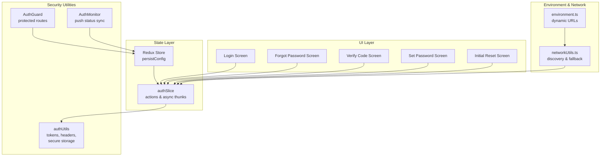

**Diagram sources**
- [index.ts](file://Estate_link_App/src/store/index.ts#L15-L20)
- [authSlice.ts](file://Estate_link_App/src/store/slices/authSlice.ts#L1-L564)
- [authUtils.ts](file://Estate_link_App/src/utils/authUtils.ts#L1-L219)
- [AuthGuard.tsx](file://Estate_link_App/src/components/AuthGuard.tsx#L1-L42)
- [AuthMonitor.tsx](file://Estate_link_App/src/components/AuthMonitor.tsx#L1-L27)
- [environment.ts](file://Estate_link_App/src/config/environment.ts#L1-L84)
- [networkUtils.ts](file://Estate_link_App/src/utils/networkUtils.ts#L1-L511)

**Section sources**
- [index.ts](file://Estate_link_App/src/store/index.ts#L1-L79)
- [authSlice.ts](file://Estate_link_App/src/store/slices/authSlice.ts#L1-L564)
- [authUtils.ts](file://Estate_link_App/src/utils/authUtils.ts#L1-L219)
- [AuthGuard.tsx](file://Estate_link_App/src/components/AuthGuard.tsx#L1-L42)
- [AuthMonitor.tsx](file://Estate_link_App/src/components/AuthMonitor.tsx#L1-L27)
- [environment.ts](file://Estate_link_App/src/config/environment.ts#L1-L84)
- [networkUtils.ts](file://Estate_link_App/src/utils/networkUtils.ts#L1-L511)

## Core Components
- Authentication state slice: Manages user identity, tokens, OTP metadata, loading/error states, and async flows for login, OTP request/verify, and password reset.
- Authentication utilities: Provide token retrieval, header generation, remember-me username storage, username history, and secure password suggestions.
- Protected routing guard: Redirects unauthenticated users to the login screen and renders children only when authenticated.
- Auth monitor: Synchronizes push notification login status and badge updates with authentication state.
- Environment configuration: Dynamic backend URL management with fallback mechanisms and automatic network discovery.
- Network utilities: Comprehensive network connectivity checking, backend server discovery, and automatic fallback strategies.

Key responsibilities:
- Token lifecycle: retrieve, update, and attach JWT Bearer tokens to API requests.
- Session persistence: persist authentication state across app restarts.
- OTP lifecycle: request, verify, resend OTP, track attempts, and coordinate with password reset.
- Protected routes: enforce authentication gating for sensitive screens.
- Network resilience: automatic backend discovery and fallback URL management.

**Section sources**
- [authSlice.ts](file://Estate_link_App/src/store/slices/authSlice.ts#L6-L42)
- [authSlice.ts](file://Estate_link_App/src/store/slices/authSlice.ts#L200-L289)
- [authSlice.ts](file://Estate_link_App/src/store/slices/authSlice.ts#L131-L198)
- [authUtils.ts](file://Estate_link_App/src/utils/authUtils.ts#L5-L83)
- [AuthGuard.tsx](file://Estate_link_App/src/components/AuthGuard.tsx#L10-L41)
- [AuthMonitor.tsx](file://Estate_link_App/src/components/AuthMonitor.tsx#L10-L26)
- [environment.ts](file://Estate_link_App/src/config/environment.ts#L1-L84)
- [networkUtils.ts](file://Estate_link_App/src/utils/networkUtils.ts#L1-L511)

## Architecture Overview
The authentication architecture integrates Redux for state, async thunks for server interactions, and secure storage for tokens and credentials. Protected routes are enforced by a dedicated guard component. The system now includes comprehensive network management with automatic backend discovery and fallback mechanisms.

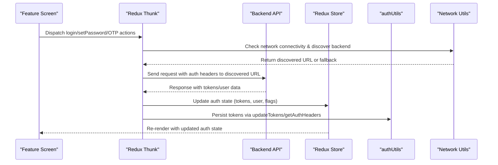

**Diagram sources**
- [authSlice.ts](file://Estate_link_App/src/store/slices/authSlice.ts#L200-L289)
- [authSlice.ts](file://Estate_link_App/src/store/slices/authSlice.ts#L131-L198)
- [authUtils.ts](file://Estate_link_App/src/utils/authUtils.ts#L41-L83)
- [index.ts](file://Estate_link_App/src/store/index.ts#L15-L20)
- [networkUtils.ts](file://Estate_link_App/src/utils/networkUtils.ts#L14-L155)

## Detailed Component Analysis

### Authentication State Management
The auth slice defines the state shape, reducers, and async thunks for:
- Login with dual fallback (organization and community login)
- OTP request, resend, and verify
- Password reset (set new password)
- Token updates and logout
- OTP attempt tracking and reset

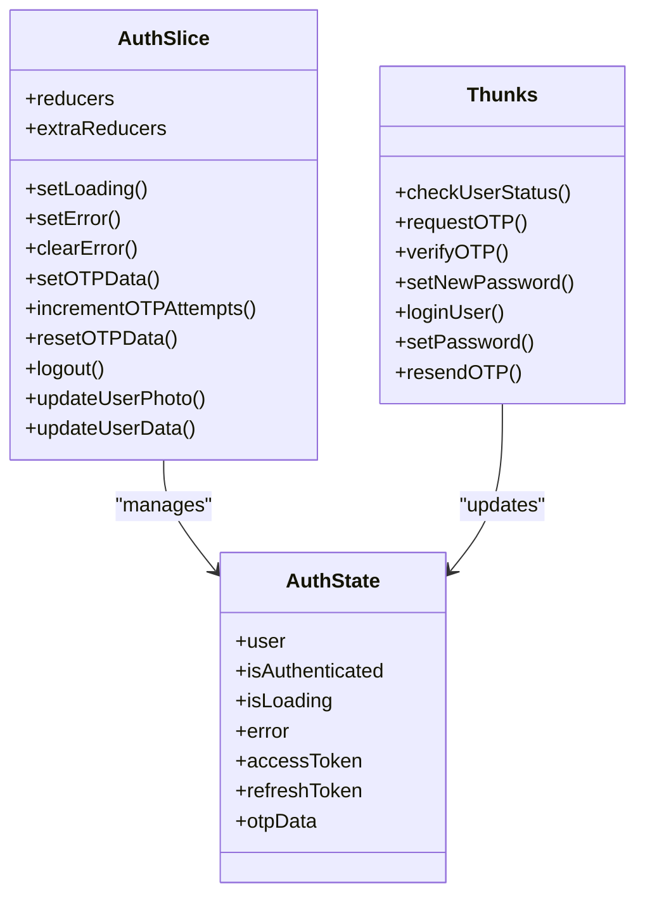

**Diagram sources**
- [authSlice.ts](file://Estate_link_App/src/store/slices/authSlice.ts#L6-L42)
- [authSlice.ts](file://Estate_link_App/src/store/slices/authSlice.ts#L361-L564)

**Section sources**
- [authSlice.ts](file://Estate_link_App/src/store/slices/authSlice.ts#L6-L42)
- [authSlice.ts](file://Estate_link_App/src/store/slices/authSlice.ts#L408-L549)

### Token Handling and Secure Storage
- Retrieve tokens from persisted Redux state.
- Generate Authorization headers for API requests.
- Persist tokens back to persisted state after successful operations.
- Securely store username/password suggestions using platform secure storage.

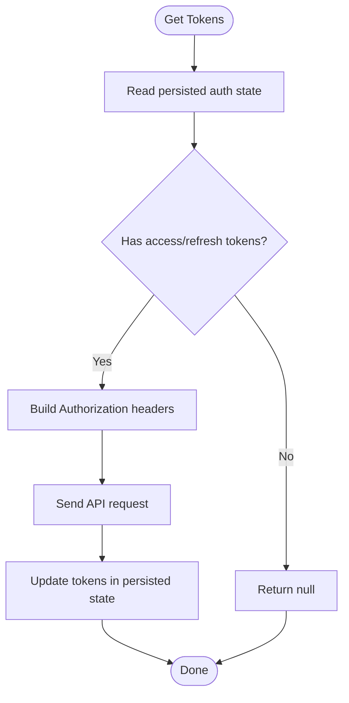

**Diagram sources**
- [authUtils.ts](file://Estate_link_App/src/utils/authUtils.ts#L5-L83)
- [authUtils.ts](file://Estate_link_App/src/utils/authUtils.ts#L41-L59)
- [index.ts](file://Estate_link_App/src/store/index.ts#L15-L20)

**Section sources**
- [authUtils.ts](file://Estate_link_App/src/utils/authUtils.ts#L5-L83)
- [authUtils.ts](file://Estate_link_App/src/utils/authUtils.ts#L41-L59)
- [index.ts](file://Estate_link_App/src/store/index.ts#L15-L20)

### Protected Route Handling
The AuthGuard checks authentication state and redirects to the login screen if the user is not authenticated. It renders a loading indicator while the app determines the current auth status.

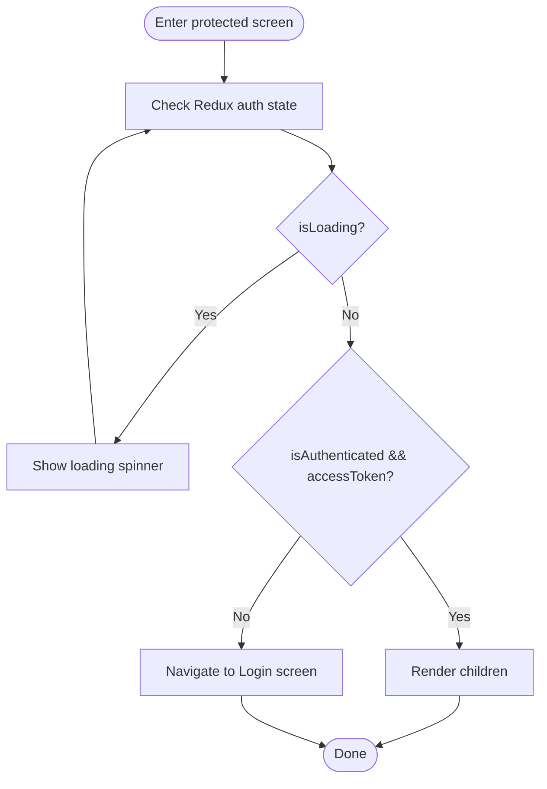

**Diagram sources**
- [AuthGuard.tsx](file://Estate_link_App/src/components/AuthGuard.tsx#L10-L41)

**Section sources**
- [AuthGuard.tsx](file://Estate_link_App/src/components/AuthGuard.tsx#L10-L41)

### Push Notification Login Status Sync
The AuthMonitor listens to authentication changes and updates push notification login status and badge counts accordingly.

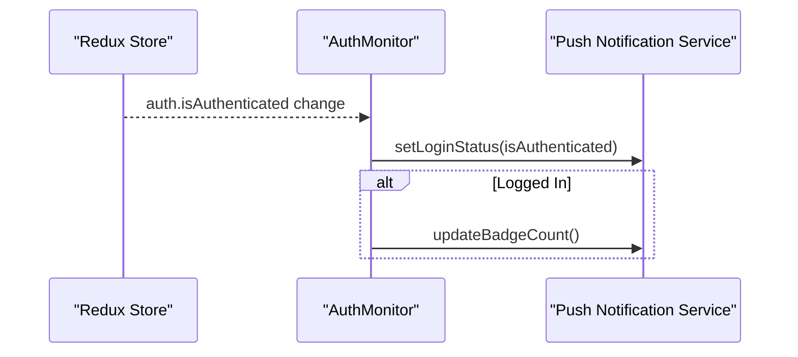

**Diagram sources**
- [AuthMonitor.tsx](file://Estate_link_App/src/components/AuthMonitor.tsx#L10-L26)

**Section sources**
- [AuthMonitor.tsx](file://Estate_link_App/src/components/AuthMonitor.tsx#L10-L26)

### Login Flow
The login flow supports two login types and handles errors gracefully. On success, tokens and user data are stored in state. The system now includes enhanced error handling for organization-only members.

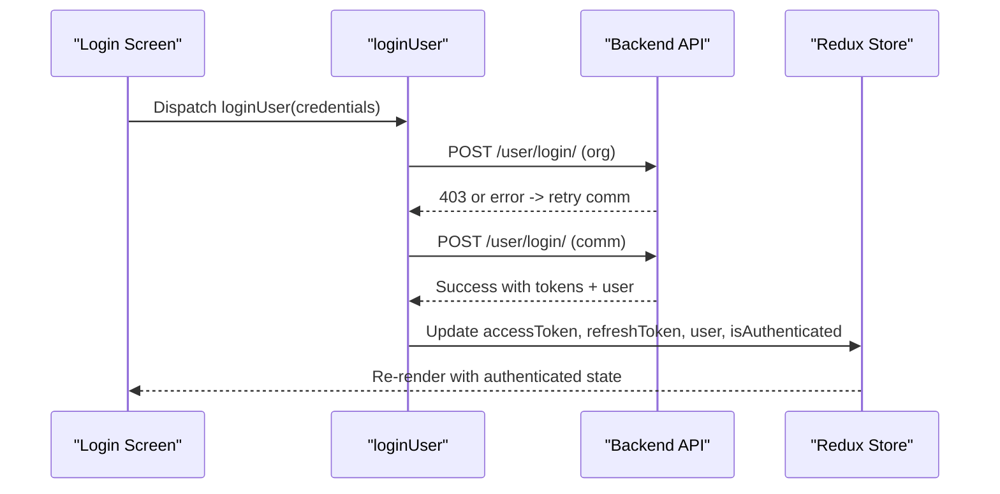

**Diagram sources**
- [authSlice.ts](file://Estate_link_App/src/store/slices/authSlice.ts#L200-L289)
- [Login.tsx](file://Estate_link_App/src/Features/LoginScreen/Login.tsx)

**Section sources**
- [authSlice.ts](file://Estate_link_App/src/store/slices/authSlice.ts#L200-L289)
- [Login.tsx](file://Estate_link_App/src/Features/LoginScreen/Login.tsx)

### Password Reset Workflow
The password reset flow consists of requesting OTP, verifying OTP, and setting a new password. OTP attempts are tracked, and resend OTP resets attempt counters.

```mermaid
sequenceDiagram
participant UI as "Forgot Password Screen"
participant Thunk as "requestOTP"
participant API as "Backend API"
participant Store as "Redux Store"
UI->>Thunk : Dispatch requestOTP({email, method})
Thunk->>API : POST /user/forgot_password/request_otp/
API-->>Thunk : OK
Thunk->>Store : Set otpData (email, method, attempts=0)
UI->>Verify as "Verify Code Screen"
Verify->>VerifyThunk as "verifyOTP"
VerifyThunk->>API : POST /user/forgot_password/verify_otp/
API-->>VerifyThunk : OK or error
VerifyThunk->>Store : Update state (success/error)
UI->>Set as "Set Password Screen"
Set->>SetThunk as "setNewPassword"
SetThunk->>API : POST /user/forgot_password/set_new_password/
API-->>SetThunk : OK
SetThunk->>Store : Clear otpData, update state
```

**Diagram sources**
- [authSlice.ts](file://Estate_link_App/src/store/slices/authSlice.ts#L131-L198)
- [ForgotPassword.tsx](file://Estate_link_App/src/Features/ForgetPasswordScreen/ForgotPassword.tsx)
- [VerifyCode.tsx](file://Estate_link_App/src/Features/VerifyCodeScreen/VerifyCode.tsx)
- [SetPassword.tsx](file://Estate_link_App/src/Features/SetPasswordScreen/SetPassword.tsx)
- [InitialScreen.tsx](file://Estate_link_App/src/Features/InitialResetPassword/InitialScreen.tsx)
- [PasswordReset.tsx](file://Estate_link_App/src/Features/InitialResetPassword/PasswordReset.tsx)

**Section sources**
- [authSlice.ts](file://Estate_link_App/src/store/slices/authSlice.ts#L131-L198)
- [ForgotPassword.tsx](file://Estate_link_App/src/Features/ForgetPasswordScreen/ForgotPassword.tsx)
- [VerifyCode.tsx](file://Estate_link_App/src/Features/VerifyCodeScreen/VerifyCode.tsx)
- [SetPassword.tsx](file://Estate_link_App/src/Features/SetPasswordScreen/SetPassword.tsx)
- [InitialScreen.tsx](file://Estate_link_App/src/Features/InitialResetPassword/InitialScreen.tsx)
- [PasswordReset.tsx](file://Estate_link_App/src/Features/InitialResetPassword/PasswordReset.tsx)

### OTP Verification Process
OTP verification increments attempt counters and tracks last attempt timestamps. Resending OTP resets attempts.

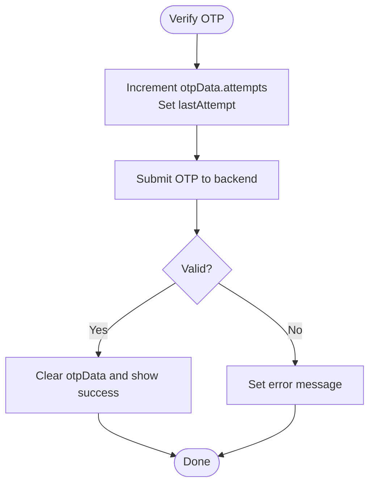

**Diagram sources**
- [authSlice.ts](file://Estate_link_App/src/store/slices/authSlice.ts#L374-L385)
- [authSlice.ts](file://Estate_link_App/src/store/slices/authSlice.ts#L450-L462)
- [authSlice.ts](file://Estate_link_App/src/store/slices/authSlice.ts#L532-L548)

**Section sources**
- [authSlice.ts](file://Estate_link_App/src/store/slices/authSlice.ts#L374-L385)
- [authSlice.ts](file://Estate_link_App/src/store/slices/authSlice.ts#L450-L462)
- [authSlice.ts](file://Estate_link_App/src/store/slices/authSlice.ts#L532-L548)

### Automatic Re-authentication and Session Persistence
- Authentication state is persisted via redux-persist with a whitelist containing the auth slice.
- On app launch, persisted state hydrates the store, enabling automatic re-authentication.
- AuthGuard enforces redirection to Login when state indicates not authenticated.

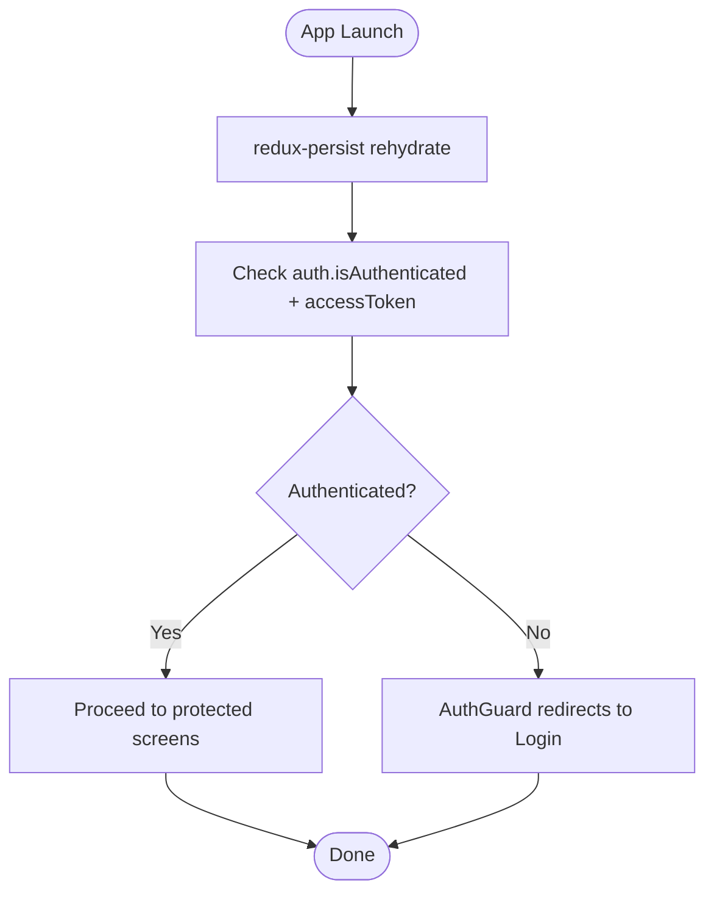

**Diagram sources**
- [index.ts](file://Estate_link_App/src/store/index.ts#L15-L20)
- [AuthGuard.tsx](file://Estate_link_App/src/components/AuthGuard.tsx#L14-L23)

**Section sources**
- [index.ts](file://Estate_link_App/src/store/index.ts#L15-L20)
- [AuthGuard.tsx](file://Estate_link_App/src/components/AuthGuard.tsx#L14-L23)

### Mobile-Specific Security Patterns
- Secure credential suggestions:
  - Username history stored in AsyncStorage.
  - Password suggestions per username stored securely via platform secure storage.
- Remember-me username support with toggle flag.
- Token headers generated without overriding Content-Type for multipart/form-data when needed.

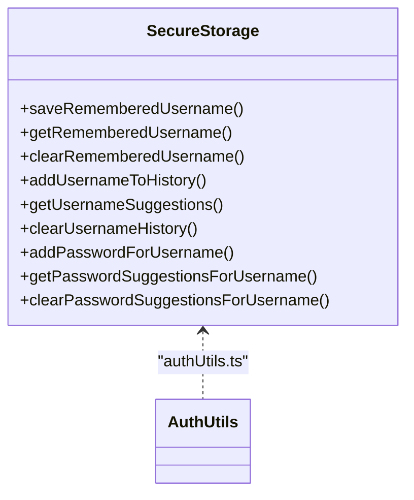

**Diagram sources**
- [authUtils.ts](file://Estate_link_App/src/utils/authUtils.ts#L85-L219)

**Section sources**
- [authUtils.ts](file://Estate_link_App/src/utils/authUtils.ts#L85-L219)

### Biometric Authentication Integration
Biometric authentication is not present in the current codebase. To integrate biometrics:
- Use a cross-platform library to authenticate users and receive a short-lived secret.
- On success, call the login thunk with the secret and dispatch a "use biometric" action to mark the session trusted.
- Enforce biometric re-authentication for sensitive operations by checking a "needsBiometric" flag before allowing privileged actions.

## Environment Configuration & Network Management

### Dynamic Backend URL Configuration
The system now uses a sophisticated environment configuration system with dynamic backend URL discovery and fallback mechanisms. The default backend URL has been updated from 192.168.0.228:8000 to 192.168.0.219:8000, reflecting network infrastructure changes.

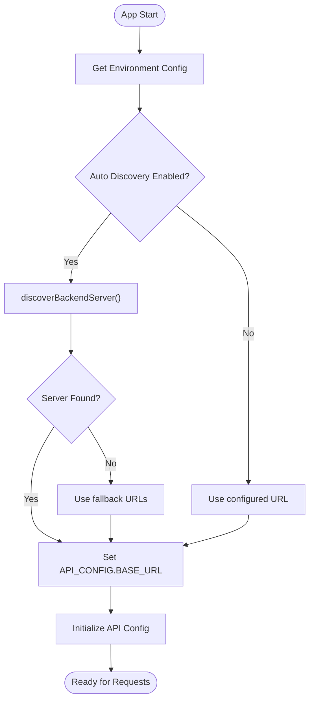

**Diagram sources**
- [environment.ts](file://Estate_link_App/src/config/environment.ts#L14-L84)
- [networkUtils.ts](file://Estate_link_App/src/utils/networkUtils.ts#L14-L155)
- [networkUtils.ts](file://Estate_link_App/src/utils/networkUtils.ts#L295-L312)

**Section sources**
- [environment.ts](file://Estate_link_App/src/config/environment.ts#L1-L84)
- [networkUtils.ts](file://Estate_link_App/src/utils/networkUtils.ts#L14-L155)
- [networkUtils.ts](file://Estate_link_App/src/utils/networkUtils.ts#L295-L312)

### Network Discovery and Fallback Mechanisms
The system implements comprehensive network discovery with multiple fallback strategies:

- **Primary Discovery**: Tests configured backend URL first
- **Common IP Testing**: Attempts common local network IPs (192.168.0.x, localhost, 127.0.0.1)
- **Network Scanning**: Scans subnet range (1-254) for backend servers
- **Port Testing**: Tests common ports (3000, 5000, 8000, 8080, 9000) on discovered IPs
- **Fallback URLs**: Uses predefined fallback URLs for different environments

**Section sources**
- [networkUtils.ts](file://Estate_link_App/src/utils/networkUtils.ts#L14-L155)
- [networkUtils.ts](file://Estate_link_App/src/utils/networkUtils.ts#L204-L238)
- [environment.ts](file://Estate_link_App/src/config/environment.ts#L77-L84)

## Enhanced Authentication Error Handling

### Improved Redux State Management
The authentication system now includes enhanced error handling with improved Redux state management:

- **Dedicated Error State**: Each async thunk maintains its own error state separate from global auth error
- **Network-Aware Error Categorization**: Distinguishes between network errors and server-side validation errors
- **Enhanced Error Messages**: Provides user-friendly error messages based on error type
- **Retry Logic Integration**: Network errors trigger automatic retry mechanisms

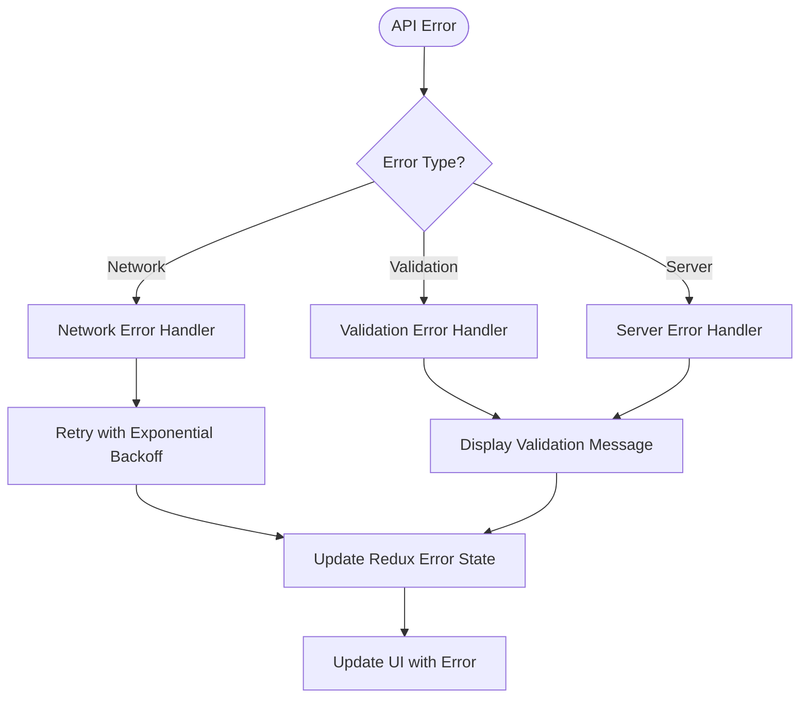

**Diagram sources**
- [authSlice.ts](file://Estate_link_App/src/store/slices/authSlice.ts#L44-L79)
- [networkUtils.ts](file://Estate_link_App/src/utils/networkUtils.ts#L240-L269)

**Section sources**
- [authSlice.ts](file://Estate_link_App/src/store/slices/authSlice.ts#L44-L79)
- [networkUtils.ts](file://Estate_link_App/src/utils/networkUtils.ts#L240-L269)

### Enhanced Retry Logic
The system implements sophisticated retry logic with exponential backoff:

- **Configurable Retry Attempts**: Default 3 attempts with exponential backoff
- **Network Connectivity Checks**: Verifies internet connectivity before retrying
- **Timeout Management**: Configurable timeouts for different environments
- **Selective Retry**: Only retries on network errors, not validation errors

**Section sources**
- [authSlice.ts](file://Estate_link_App/src/store/slices/authSlice.ts#L44-L79)
- [authSlice.ts](file://Estate_link_App/src/store/slices/authSlice.ts#L131-L198)

## Organization-Only Member Restrictions

### Enhanced Login Validation
The login system now includes enhanced validation for organization-only members:

- **Dual Membership Check**: Validates both organization and community membership status
- **Access Control**: Prevents organization-only members from accessing community features
- **Specific Error Messaging**: Provides clear error messages for restricted access
- **Redux State Integration**: Updates Redux state with membership validation results

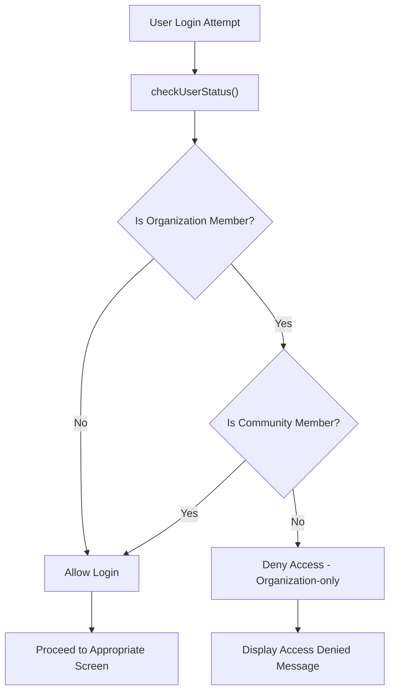

**Diagram sources**
- [Login.tsx](file://Estate_link_App/src/Features/LoginScreen/Login.tsx#L199-L205)
- [authSlice.ts](file://Estate_link_App/src/store/slices/authSlice.ts#L82-L129)

**Section sources**
- [Login.tsx](file://Estate_link_App/src/Features/LoginScreen/Login.tsx#L199-L205)
- [authSlice.ts](file://Estate_link_App/src/store/slices/authSlice.ts#L82-L129)

### Membership Status Tracking
The system tracks detailed membership information:

- **First Login Detection**: Identifies new users requiring initial password setup
- **Membership Type**: Tracks whether user is organization-only, community-only, or both
- **User Data Mapping**: Maps backend membership data to frontend user state
- **Conditional Navigation**: Routes users based on membership status and first-login status

**Section sources**
- [authSlice.ts](file://Estate_link_App/src/store/slices/authSlice.ts#L410-L428)
- [Login.tsx](file://Estate_link_App/src/Features/LoginScreen/Login.tsx#L207-L213)

## Dependency Analysis
The authentication system exhibits low coupling and clear separation of concerns:
- UI screens depend on Redux actions/thunks.
- Thunks encapsulate network logic and update state.
- Utilities provide reusable token/header logic.
- Guard and monitor components observe state without modifying it.
- Environment configuration manages dynamic backend URL discovery.
- Network utilities provide comprehensive network management.

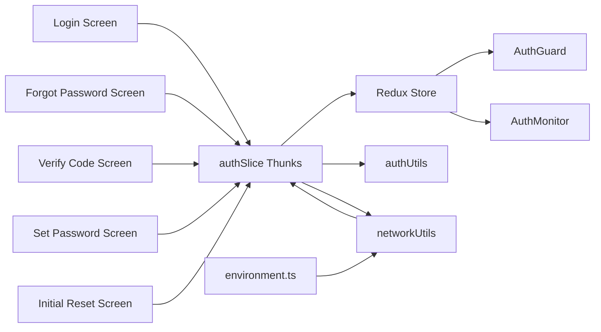

**Diagram sources**
- [authSlice.ts](file://Estate_link_App/src/store/slices/authSlice.ts#L200-L289)
- [authSlice.ts](file://Estate_link_App/src/store/slices/authSlice.ts#L131-L198)
- [AuthGuard.tsx](file://Estate_link_App/src/components/AuthGuard.tsx#L10-L41)
- [AuthMonitor.tsx](file://Estate_link_App/src/components/AuthMonitor.tsx#L10-L26)
- [authUtils.ts](file://Estate_link_App/src/utils/authUtils.ts#L1-L219)
- [environment.ts](file://Estate_link_App/src/config/environment.ts#L1-L84)
- [networkUtils.ts](file://Estate_link_App/src/utils/networkUtils.ts#L1-L511)

**Section sources**
- [authSlice.ts](file://Estate_link_App/src/store/slices/authSlice.ts#L200-L289)
- [authSlice.ts](file://Estate_link_App/src/store/slices/authSlice.ts#L131-L198)
- [AuthGuard.tsx](file://Estate_link_App/src/components/AuthGuard.tsx#L10-L41)
- [AuthMonitor.tsx](file://Estate_link_App/src/components/AuthMonitor.tsx#L10-L26)
- [authUtils.ts](file://Estate_link_App/src/utils/authUtils.ts#L1-L219)
- [environment.ts](file://Estate_link_App/src/config/environment.ts#L1-L84)
- [networkUtils.ts](file://Estate_link_App/src/utils/networkUtils.ts#L1-L511)

## Performance Considerations
- Prefer batched state updates and avoid unnecessary re-renders by selecting only required auth fields in components.
- Debounce OTP resend requests to reduce server load.
- Cache minimal user metadata in state to minimize persistence overhead.
- Use exponential backoff judiciously to balance responsiveness and server load.
- Implement network caching strategies for frequently accessed data.
- Optimize retry logic based on error types to minimize unnecessary requests.

## Troubleshooting Guide
Common issues and remedies:
- Stuck on loading: Ensure auth state hydration completes; verify persisted state keys and whitelist.
- Redirect loop to Login: Confirm tokens are persisted and accessible; check token retrieval logic.
- OTP failures: Validate OTP attempts and lastAttempt timestamps; ensure resend resets attempts.
- Push notification badge not updating: Confirm AuthMonitor runs inside Redux Provider and receives authentication changes.
- Network connectivity issues: Check network discovery logs; verify backend server accessibility.
- Organization-only member access denied: Verify membership status and ensure user has community access.
- Environment configuration problems: Check CURRENT_ENV setting and BACKEND_URL configuration.

**Section sources**
- [AuthGuard.tsx](file://Estate_link_App/src/components/AuthGuard.tsx#L14-L23)
- [AuthMonitor.tsx](file://Estate_link_App/src/components/AuthMonitor.tsx#L13-L23)
- [authSlice.ts](file://Estate_link_App/src/store/slices/authSlice.ts#L374-L385)
- [authSlice.ts](file://Estate_link_App/src/store/slices/authSlice.ts#L532-L548)
- [networkUtils.ts](file://Estate_link_App/src/utils/networkUtils.ts#L14-L155)
- [environment.ts](file://Estate_link_App/src/config/environment.ts#L1-L84)

## Conclusion
The authentication system combines Redux for state management, secure storage for credentials, and guarded routing to deliver a robust, user-friendly mobile experience. The enhanced error handling with improved Redux state management, comprehensive network discovery capabilities, and organization-only member restrictions provide reliability, security, and flexibility. The system now includes automatic backend URL discovery, sophisticated retry logic, and comprehensive error categorization. Extending the system with biometric authentication and stricter token refresh policies would further enhance security and usability.

## Appendices
- API endpoints used by thunks:
  - POST /user/login/
  - POST /user/check_status/
  - POST /user/forgot_password/request_otp/
  - POST /user/forgot_password/verify_otp/
  - POST /user/forgot_password/set_new_password/
  - POST /user/set_password/
  - POST /user/forgot_password/resend_otp/
  - POST /user/token/refresh/
- Environment configuration:
  - Default backend URL: 192.168.0.219:8000
  - Auto-discovery enabled for development
  - Configurable retry attempts and timeouts
  - Fallback URL arrays for different environments

**Section sources**
- [authSlice.ts](file://Estate_link_App/src/store/slices/authSlice.ts#L82-L198)
- [environment.ts](file://Estate_link_App/src/config/environment.ts#L1-L84)
- [networkUtils.ts](file://Estate_link_App/src/utils/networkUtils.ts#L295-L312)