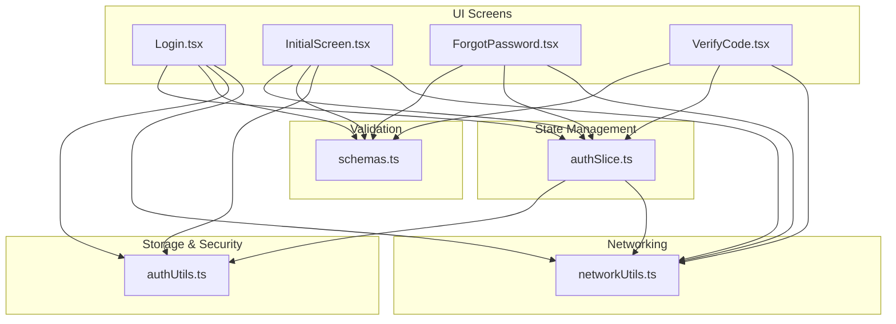
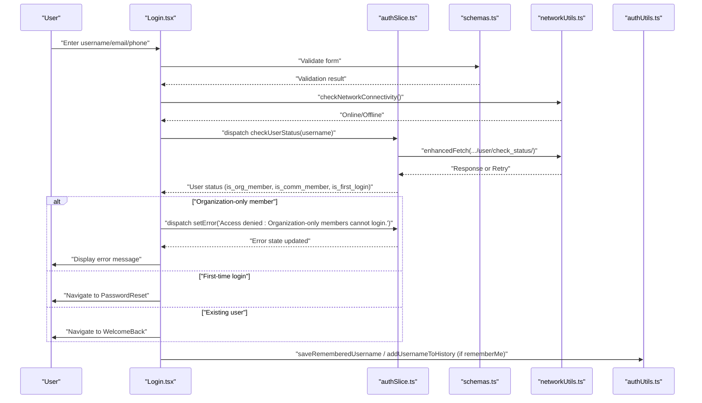
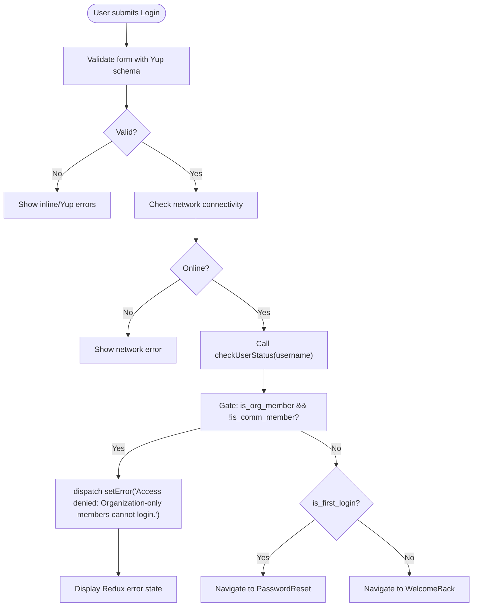
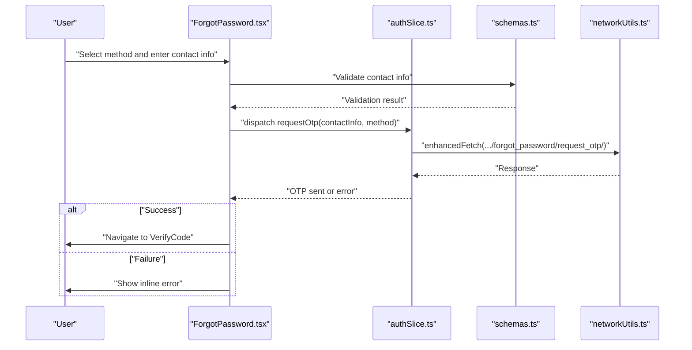
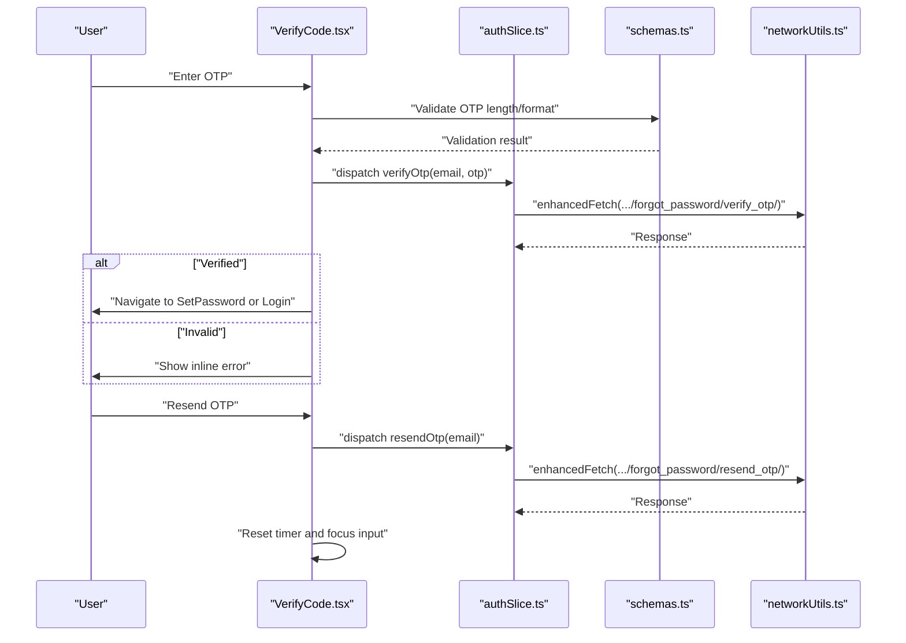
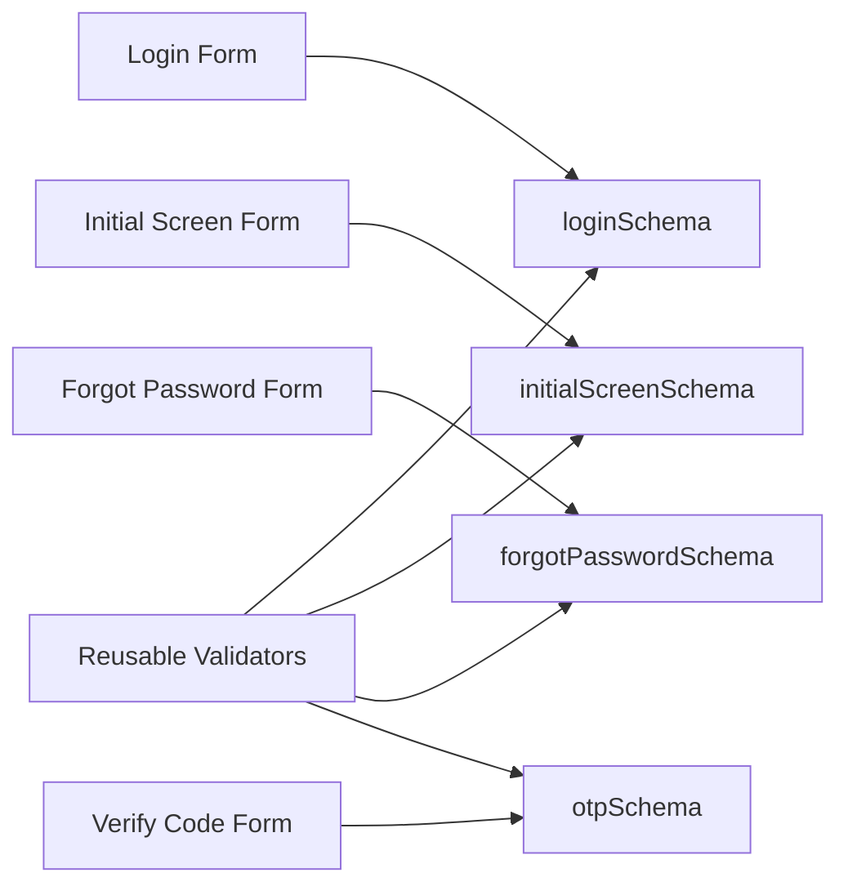
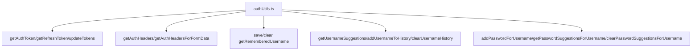
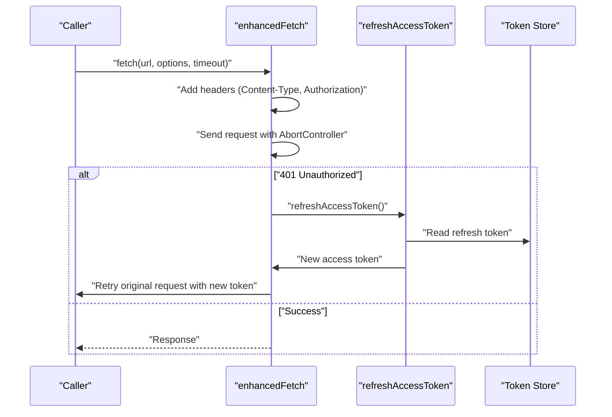
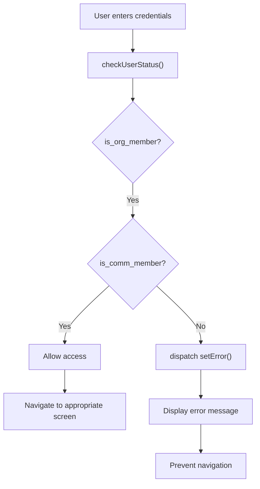
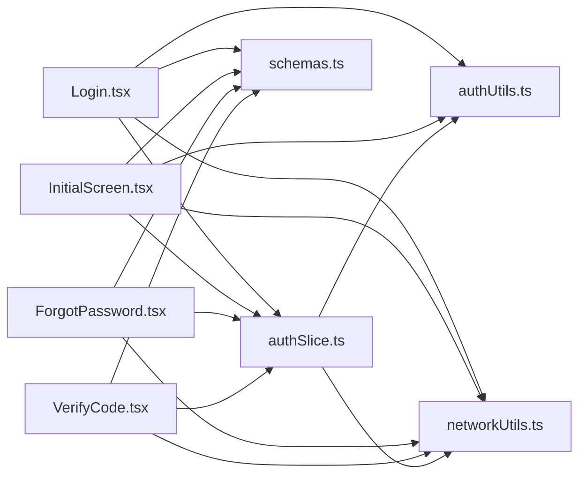

# Login Flow & User Authentication

<cite>
**Referenced Files in This Document**
- [Login.tsx](file://Estate_link_App/src/Features/LoginScreen/Login.tsx)
- [InitialScreen.tsx](file://Estate_link_App/src/Features/InitialResetPassword/InitialScreen.tsx)
- [ForgotPassword.tsx](file://Estate_link_App/src/Features/ForgetPasswordScreen/ForgotPassword.tsx)
- [VerifyCode.tsx](file://Estate_link_App/src/Features/VerifyCodeScreen/VerifyCode.tsx)
- [authSlice.ts](file://Estate_link_App/src/store/slices/authSlice.ts)
- [authUtils.ts](file://Estate_link_App/src/utils/authUtils.ts)
- [schemas.ts](file://Estate_link_App/src/validation/schemas.ts)
- [networkUtils.ts](file://Estate_link_App/src/utils/networkUtils.ts)
</cite>

## Update Summary
**Changes Made**
- Enhanced error handling for organization-only members in mobile authentication flow
- Updated Login and InitialScreen components to dispatch error states to Redux store
- Improved consistency in error management throughout authentication process
- Added comprehensive error state handling for access denial scenarios

## Table of Contents
1. [Introduction](#introduction)
2. [Project Structure](#project-structure)
3. [Core Components](#core-components)
4. [Architecture Overview](#architecture-overview)
5. [Detailed Component Analysis](#detailed-component-analysis)
6. [Enhanced Error Handling](#enhanced-error-handling)
7. [Dependency Analysis](#dependency-analysis)
8. [Performance Considerations](#performance-considerations)
9. [Troubleshooting Guide](#troubleshooting-guide)
10. [Conclusion](#conclusion)

## Introduction
This document explains the mobile application's login flow and user authentication system end-to-end. It covers the complete journey from the Login screen to authenticated state, including username/email/phone validation, user status checks, navigation logic, form validation via Yup schemas, keyboard handling for different screen sizes, username suggestion functionality, Redux slice integration for authentication state management, error handling patterns, and network connectivity checks. It also documents mobile-specific authentication patterns, "remember me" functionality with local storage, first-time user detection, backend authentication endpoint integration, token handling, automatic re-authentication mechanisms, security considerations, input sanitization, and graceful error handling for network failures.

**Updated** Enhanced error handling now consistently dispatches error states to Redux store for better error management across all authentication screens.

## Project Structure
The authentication system spans several layers:
- UI screens for Login, Initial Reset Password, Forgot Password, and Verify Code
- Redux slices for managing authentication state and async flows
- Validation schemas powered by Yup
- Utilities for secure token and username/password storage
- Network utilities for connectivity checks and enhanced fetch with retry and token refresh



**Diagram sources**
- [Login.tsx](file://Estate_link_App/src/Features/LoginScreen/Login.tsx#L1-L426)
- [InitialScreen.tsx](file://Estate_link_App/src/Features/InitialResetPassword/InitialScreen.tsx#L1-L440)
- [ForgotPassword.tsx](file://Estate_link_App/src/Features/ForgetPasswordScreen/ForgotPassword.tsx#L1-L452)
- [VerifyCode.tsx](file://Estate_link_App/src/Features/VerifyCodeScreen/VerifyCode.tsx#L1-L422)
- [authSlice.ts](file://Estate_link_App/src/store/slices/authSlice.ts#L1-L564)
- [schemas.ts](file://Estate_link_App/src/validation/schemas.ts#L1-L443)
- [authUtils.ts](file://Estate_link_App/src/utils/authUtils.ts#L1-L219)
- [networkUtils.ts](file://Estate_link_App/src/utils/networkUtils.ts#L1-L511)

**Section sources**
- [Login.tsx](file://Estate_link_App/src/Features/LoginScreen/Login.tsx#L1-L426)
- [InitialScreen.tsx](file://Estate_link_App/src/Features/InitialResetPassword/InitialScreen.tsx#L1-L440)
- [authSlice.ts](file://Estate_link_App/src/store/slices/authSlice.ts#L1-L564)
- [schemas.ts](file://Estate_link_App/src/validation/schemas.ts#L1-L443)
- [authUtils.ts](file://Estate_link_App/src/utils/authUtils.ts#L1-L219)
- [networkUtils.ts](file://Estate_link_App/src/utils/networkUtils.ts#L1-L511)

## Core Components
- Login screen: Handles username/email/phone input, validation, keyboard responsiveness, username suggestions/history, "remember me", and navigates based on user status and first-time login. Now dispatches error states to Redux store for consistent error management.
- Initial Reset Password screen: Similar functionality to Login but specifically designed for first-time users and organization-only members with enhanced error handling.
- Forgot Password screen: Allows selecting recovery method (email/phone/WhatsApp), validates contact info, requests OTP, and manages navigation to Verify Code.
- Verify Code screen: Accepts OTP, verifies it, supports resend with countdown, and navigates to Set Password or Login depending on state.
- Auth Redux slice: Manages authentication state, async flows for login, user status checks, OTP lifecycle, and token storage updates. Provides centralized error state management.
- Validation schemas: Centralized Yup-based validation for login, OTP, and related forms.
- Auth utilities: Secure token retrieval/update, "remember me" username persistence, username history and suggestions, and password suggestions per username.
- Network utilities: Dynamic backend discovery, connectivity checks, enhanced fetch with retry, timeouts, and automatic token refresh on 401.

**Updated** Both Login and InitialScreen components now consistently dispatch error states to Redux store, ensuring uniform error handling across all authentication screens.

**Section sources**
- [Login.tsx](file://Estate_link_App/src/Features/LoginScreen/Login.tsx#L1-L426)
- [InitialScreen.tsx](file://Estate_link_App/src/Features/InitialResetPassword/InitialScreen.tsx#L1-L440)
- [ForgotPassword.tsx](file://Estate_link_App/src/Features/ForgetPasswordScreen/ForgotPassword.tsx#L1-L452)
- [VerifyCode.tsx](file://Estate_link_App/src/Features/VerifyCodeScreen/VerifyCode.tsx#L1-L422)
- [authSlice.ts](file://Estate_link_App/src/store/slices/authSlice.ts#L1-L564)
- [schemas.ts](file://Estate_link_App/src/validation/schemas.ts#L1-L443)
- [authUtils.ts](file://Estate_link_App/src/utils/authUtils.ts#L1-L219)
- [networkUtils.ts](file://Estate_link_App/src/utils/networkUtils.ts#L1-L511)

## Architecture Overview
The authentication architecture follows a layered pattern:
- UI layer triggers actions and renders state from Redux.
- Validation layer enforces form rules before dispatching.
- State management layer orchestrates async flows and updates the store.
- Storage layer persists tokens and user preferences securely.
- Networking layer ensures robust connectivity, retries, and token refresh.



**Diagram sources**
- [Login.tsx](file://Estate_link_App/src/Features/LoginScreen/Login.tsx#L170-L225)
- [InitialScreen.tsx](file://Estate_link_App/src/Features/InitialResetPassword/InitialScreen.tsx#L174-L211)
- [authSlice.ts](file://Estate_link_App/src/store/slices/authSlice.ts#L82-L129)
- [networkUtils.ts](file://Estate_link_App/src/utils/networkUtils.ts#L169-L202)
- [authUtils.ts](file://Estate_link_App/src/utils/authUtils.ts#L89-L148)
- [schemas.ts](file://Estate_link_App/src/validation/schemas.ts#L3-L11)

## Detailed Component Analysis

### Login Screen
- Input handling: Tracks username, rememberMe, and displays inline and Yup-based errors. Clears Redux error on input change.
- Validation: Uses Yup schema to validate username length, format, and presence. Real-time validation feedback.
- Keyboard handling: Listeners track visibility and height, scroll to input, and adjust layout for small screens.
- Username suggestions: Loads history and filters suggestions as the user types; taps select a suggestion.
- Navigation gating: Calls user status check, enforces access rules (org vs comm member), and navigates accordingly.
- Remember me: Persists username and toggles flag; adds to history; clears on uncheck.
- Loading and error states: Reflects Redux loading/error state in UI.
- **Enhanced Error Handling**: Now dispatches error states to Redux store for consistent error management across the application.



**Diagram sources**
- [Login.tsx](file://Estate_link_App/src/Features/LoginScreen/Login.tsx#L170-L225)
- [authSlice.ts](file://Estate_link_App/src/store/slices/authSlice.ts#L82-L129)
- [schemas.ts](file://Estate_link_App/src/validation/schemas.ts#L3-L11)

**Section sources**
- [Login.tsx](file://Estate_link_App/src/Features/LoginScreen/Login.tsx#L1-L426)
- [schemas.ts](file://Estate_link_App/src/validation/schemas.ts#L3-L11)
- [authUtils.ts](file://Estate_link_App/src/utils/authUtils.ts#L89-L148)

### Initial Reset Password Screen
- **Enhanced Error Handling**: Implements the same error dispatch pattern as Login screen for organization-only member access denial.
- Input handling: Similar to Login but designed for first-time users and organization-only members.
- Validation: Uses initialScreenSchema for comprehensive username/email/phone validation.
- Navigation gating: Enforces access rules and handles organization-only member restrictions.
- Error state management: Consistently uses Redux error state for displaying access denial messages.

**Section sources**
- [InitialScreen.tsx](file://Estate_link_App/src/Features/InitialResetPassword/InitialScreen.tsx#L1-L440)
- [schemas.ts](file://Estate_link_App/src/validation/schemas.ts#L136-L223)

### Forgot Password Screen
- Recovery method selection: Supports email, phone, or WhatsApp.
- Contact info validation: Inline validation and Yup schema validation.
- OTP request: Dispatches requestOtp thunk; stores email on success; handles AbortError and other errors gracefully.
- Navigation: On success, navigates to Verify Code; includes safe back navigation to Login.



**Diagram sources**
- [ForgotPassword.tsx](file://Estate_link_App/src/Features/ForgetPasswordScreen/ForgotPassword.tsx#L210-L280)
- [authSlice.ts](file://Estate_link_App/src/store/slices/authSlice.ts#L131-L152)
- [networkUtils.ts](file://Estate_link_App/src/utils/networkUtils.ts#L382-L508)
- [schemas.ts](file://Estate_link_App/src/validation/schemas.ts#L13-L42)

**Section sources**
- [ForgotPassword.tsx](file://Estate_link_App/src/Features/ForgetPasswordScreen/ForgotPassword.tsx#L1-L452)
- [authSlice.ts](file://Estate_link_App/src/store/slices/authSlice.ts#L131-L152)
- [schemas.ts](file://Estate_link_App/src/validation/schemas.ts#L13-L42)
- [networkUtils.ts](file://Estate_link_App/src/utils/networkUtils.ts#L382-L508)

### Verify Code Screen
- OTP input: Numeric-only, up to 6 digits; clears inline and Redux errors on input.
- Verification: Dispatches verifyOtp thunk; on success, shows success and navigates to Set Password or directly to Login if already reset.
- Resend OTP: Resets timer, clears state, and focuses input.
- Countdown: 2-minute timer with formatted display.



**Diagram sources**
- [VerifyCode.tsx](file://Estate_link_App/src/Features/VerifyCodeScreen/VerifyCode.tsx#L169-L248)
- [authSlice.ts](file://Estate_link_App/src/store/slices/authSlice.ts#L154-L175)
- [networkUtils.ts](file://Estate_link_App/src/utils/networkUtils.ts#L382-L508)
- [schemas.ts](file://Estate_link_App/src/validation/schemas.ts#L44-L50)

**Section sources**
- [VerifyCode.tsx](file://Estate_link_App/src/Features/VerifyCodeScreen/VerifyCode.tsx#L1-L422)
- [authSlice.ts](file://Estate_link_App/src/store/slices/authSlice.ts#L154-L175)
- [schemas.ts](file://Estate_link_App/src/validation/schemas.ts#L44-L50)
- [networkUtils.ts](file://Estate_link_App/src/utils/networkUtils.ts#L382-L508)

### Auth Redux Slice
- State model: Holds user profile, auth flags, loading/error states, access/refresh tokens, and OTP metadata.
- Async thunks:
  - checkUserStatus: Validates authenticator and gates access based on membership type.
  - requestOTP/verifyOTP/resendOTP: Manage forgot-password flow with retry logic.
  - loginUser: Attempts org login, falls back to comm login, and stores tokens and user data.
  - setPassword: Updates password for first-time users and clears first-login flag.
- Reducers: Loading/error setters, OTP data management, logout, and user data updates.
- Retry and connectivity: Uses enhancedFetch with retry attempts and network checks.
- **Enhanced Error Management**: Provides centralized error state management through setError and clearError actions.

```mermaid
classDiagram
class AuthState {
+user : object|null
+isAuthenticated : boolean
+isLoading : boolean
+error : string|null
+accessToken : string|null
+refreshToken : string|null
+otpData : object|null
}
class Thunks {
+checkUserStatus(authenticator)
+requestOTP({email, method})
+verifyOTP({email, otp})
+resendOTP({email, method})
+loginUser({username, password?})
+setPassword({userId, oldPassword, newPassword, confirmPassword})
}
class Reducers {
+setLoading(bool)
+setError(str|null)
+clearError()
+setOTPData(obj)
+incrementOTPAttempts()
+resetOTPData()
+logout()
+updateUserPhoto(url)
+updateUserData(partial)
}
AuthState <.. Thunks : "produces"
AuthState <.. Reducers : "updates"
```

**Diagram sources**
- [authSlice.ts](file://Estate_link_App/src/store/slices/authSlice.ts#L5-L564)

**Section sources**
- [authSlice.ts](file://Estate_link_App/src/store/slices/authSlice.ts#L1-L564)

### Validation Schemas
- Login schema: Username/email/phone required, length constraints, rememberMe boolean.
- Forgot password schema: Contact info required with method-dependent validation; method enum.
- OTP schema: 4–6 digit numeric OTP.
- Initial screen schema: Comprehensive validation for username/email/phone with spelling validation.
- Additional reusable helpers: email, phone, username validators.
- Centralized exports: validationSchemas map for easy reuse.



**Diagram sources**
- [schemas.ts](file://Estate_link_App/src/validation/schemas.ts#L3-L11)
- [schemas.ts](file://Estate_link_App/src/validation/schemas.ts#L136-L223)
- [schemas.ts](file://Estate_link_App/src/validation/schemas.ts#L13-L42)
- [schemas.ts](file://Estate_link_App/src/validation/schemas.ts#L44-L50)
- [schemas.ts](file://Estate_link_App/src/validation/schemas.ts#L97-L134)

**Section sources**
- [schemas.ts](file://Estate_link_App/src/validation/schemas.ts#L1-L443)

### Auth Utilities
- Token retrieval and updates: Reads/writes access/refresh tokens from persisted Redux state.
- Auth headers: Builds Content-Type and Authorization headers for requests.
- Remember me: Stores username and flag in AsyncStorage; clears on uncheck.
- Username history and suggestions: Maintains a limited list of recent usernames; filters suggestions.
- Secure password vault: Per-username password suggestions stored securely; sanitized keys.



**Diagram sources**
- [authUtils.ts](file://Estate_link_App/src/utils/authUtils.ts#L1-L219)

**Section sources**
- [authUtils.ts](file://Estate_link_App/src/utils/authUtils.ts#L1-L219)

### Network Utilities
- Dynamic backend discovery: Attempts configured URL, common IPs, subnet scanning, and fallbacks.
- connectivity checks: HEAD requests to backend and Google; tracks status and retry count.
- Enhanced fetch: Adds timeouts, retries, and automatic token refresh on 401; supports subscriber-based refresh notifications.
- API config: Centralized timeout, retry attempts, and base URL initialization.



**Diagram sources**
- [networkUtils.ts](file://Estate_link_App/src/utils/networkUtils.ts#L382-L508)
- [networkUtils.ts](file://Estate_link_App/src/utils/networkUtils.ts#L330-L380)

**Section sources**
- [networkUtils.ts](file://Estate_link_App/src/utils/networkUtils.ts#L1-L511)

## Enhanced Error Handling

### Organization-Only Member Access Control
Both Login and InitialScreen components now implement enhanced error handling for organization-only members:

- **Access Gate Logic**: After user status check, components verify `is_org_member && !is_comm_member` condition.
- **Consistent Error Dispatch**: When organization-only access is detected, components dispatch `setError` action to Redux store.
- **Dual Error Display**: Error is shown both as inline field error and Redux error state for maximum visibility.
- **Navigation Prevention**: Access denial prevents navigation to any protected screens.



**Diagram sources**
- [Login.tsx](file://Estate_link_App/src/Features/LoginScreen/Login.tsx#L199-L205)
- [InitialScreen.tsx](file://Estate_link_App/src/Features/InitialResetPassword/InitialScreen.tsx#L183-L189)
- [authSlice.ts](file://Estate_link_App/src/store/slices/authSlice.ts#L368-L373)

### Redux Error State Management
The authSlice provides centralized error state management:

- **setError Action**: Sets error state with custom error messages.
- **clearError Action**: Clears error state when user interacts with form fields.
- **Error Propagation**: Error state is accessible across all components via useSelector hook.
- **Consistent UI Rendering**: Components can render errors from either field-level or Redux state.

**Section sources**
- [Login.tsx](file://Estate_link_App/src/Features/LoginScreen/Login.tsx#L170-L227)
- [InitialScreen.tsx](file://Estate_link_App/src/Features/InitialResetPassword/InitialScreen.tsx#L158-L211)
- [authSlice.ts](file://Estate_link_App/src/store/slices/authSlice.ts#L368-L373)

## Dependency Analysis
- UI depends on Redux slices and validation schemas.
- Redux slices depend on network utilities for HTTP calls and auth utilities for token/header management.
- Validation schemas are shared across UI and thunks.
- Auth utilities bridge Redux state and persistent storage.
- **Enhanced Error Dependencies**: Both Login and InitialScreen components now depend on Redux error state for consistent error management.



**Diagram sources**
- [Login.tsx](file://Estate_link_App/src/Features/LoginScreen/Login.tsx#L1-L426)
- [InitialScreen.tsx](file://Estate_link_App/src/Features/InitialResetPassword/InitialScreen.tsx#L1-L440)
- [ForgotPassword.tsx](file://Estate_link_App/src/Features/ForgetPasswordScreen/ForgotPassword.tsx#L1-L452)
- [VerifyCode.tsx](file://Estate_link_App/src/Features/VerifyCodeScreen/VerifyCode.tsx#L1-L422)
- [authSlice.ts](file://Estate_link_App/src/store/slices/authSlice.ts#L1-L564)
- [schemas.ts](file://Estate_link_App/src/validation/schemas.ts#L1-L443)
- [authUtils.ts](file://Estate_link_App/src/utils/authUtils.ts#L1-L219)
- [networkUtils.ts](file://Estate_link_App/src/utils/networkUtils.ts#L1-L511)

**Section sources**
- [Login.tsx](file://Estate_link_App/src/Features/LoginScreen/Login.tsx#L1-L426)
- [InitialScreen.tsx](file://Estate_link_App/src/Features/InitialResetPassword/InitialScreen.tsx#L1-L440)
- [ForgotPassword.tsx](file://Estate_link_App/src/Features/ForgetPasswordScreen/ForgotPassword.tsx#L1-L452)
- [VerifyCode.tsx](file://Estate_link_App/src/Features/VerifyCodeScreen/VerifyCode.tsx#L1-L422)
- [authSlice.ts](file://Estate_link_App/src/store/slices/authSlice.ts#L1-L564)
- [schemas.ts](file://Estate_link_App/src/validation/schemas.ts#L1-L443)
- [authUtils.ts](file://Estate_link_App/src/utils/authUtils.ts#L1-L219)
- [networkUtils.ts](file://Estate_link_App/src/utils/networkUtils.ts#L1-L511)

## Performance Considerations
- Keyboard handling: Debounced scrolling and minimal re-renders improve UX on smaller screens.
- Validation: Real-time Yup validation reduces unnecessary network calls.
- Retry strategy: Exponential backoff with network checks prevents wasted retries.
- Token refresh: Single concurrent refresh with subscriber notifications avoids redundant refreshes.
- Storage: AsyncStorage and SecureStore operations are batched and debounced.
- **Enhanced Error Handling**: Redux error state eliminates redundant error rendering and improves performance.

## Troubleshooting Guide
- Network failures:
  - Use connectivity checks before retrying; handle AbortError and timeout messages.
  - On repeated failures, trigger backend rediscovery and update API config.
- 401 Unauthorized:
  - Automatic token refresh; if refresh fails, return original 401 to UI for logout or re-auth.
- Form errors:
  - Combine inline and Yup errors; clear Redux errors on input change.
- OTP issues:
  - Validate OTP length/format; support resend with countdown; clear state on resend.
- Remember me:
  - Ensure AsyncStorage writes succeed; clear on uncheck; handle edge cases where storage is unavailable.
- **Organization-only Member Issues**:
  - Verify membership status from backend response.
  - Check that error state is properly dispatched to Redux store.
  - Ensure error messages are displayed consistently across all authentication screens.

**Section sources**
- [networkUtils.ts](file://Estate_link_App/src/utils/networkUtils.ts#L240-L269)
- [networkUtils.ts](file://Estate_link_App/src/utils/networkUtils.ts#L430-L490)
- [authSlice.ts](file://Estate_link_App/src/store/slices/authSlice.ts#L44-L79)
- [VerifyCode.tsx](file://Estate_link_App/src/Features/VerifyCodeScreen/VerifyCode.tsx#L217-L248)
- [authUtils.ts](file://Estate_link_App/src/utils/authUtils.ts#L89-L117)

## Conclusion
The authentication system integrates UI, validation, state management, secure storage, and robust networking to deliver a seamless login experience. It enforces strong validation, handles diverse input formats, supports mobile-specific UX patterns, and provides resilient error handling and automatic re-authentication. The enhanced error handling for organization-only members ensures consistent error management across all authentication screens through Redux state dispatching. The modular design allows for easy extension and maintenance while preserving security and reliability.

**Updated** The recent enhancements provide improved error handling consistency and better user experience for organization-only member access control scenarios.