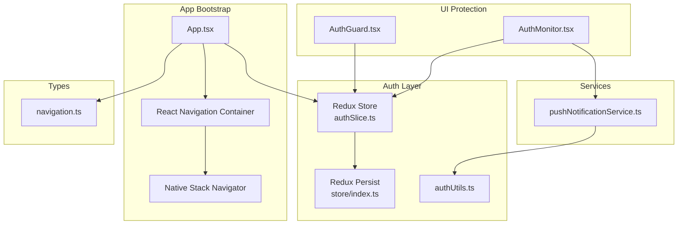
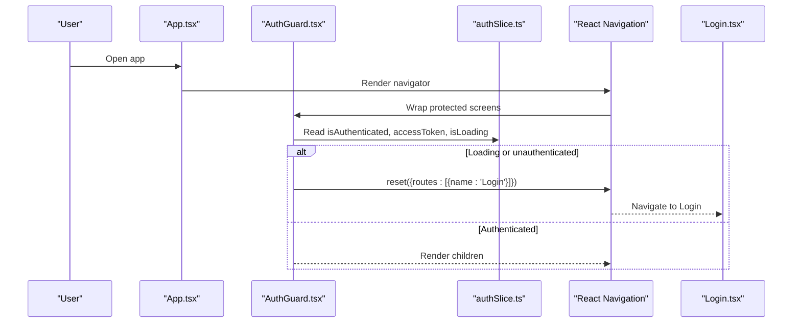
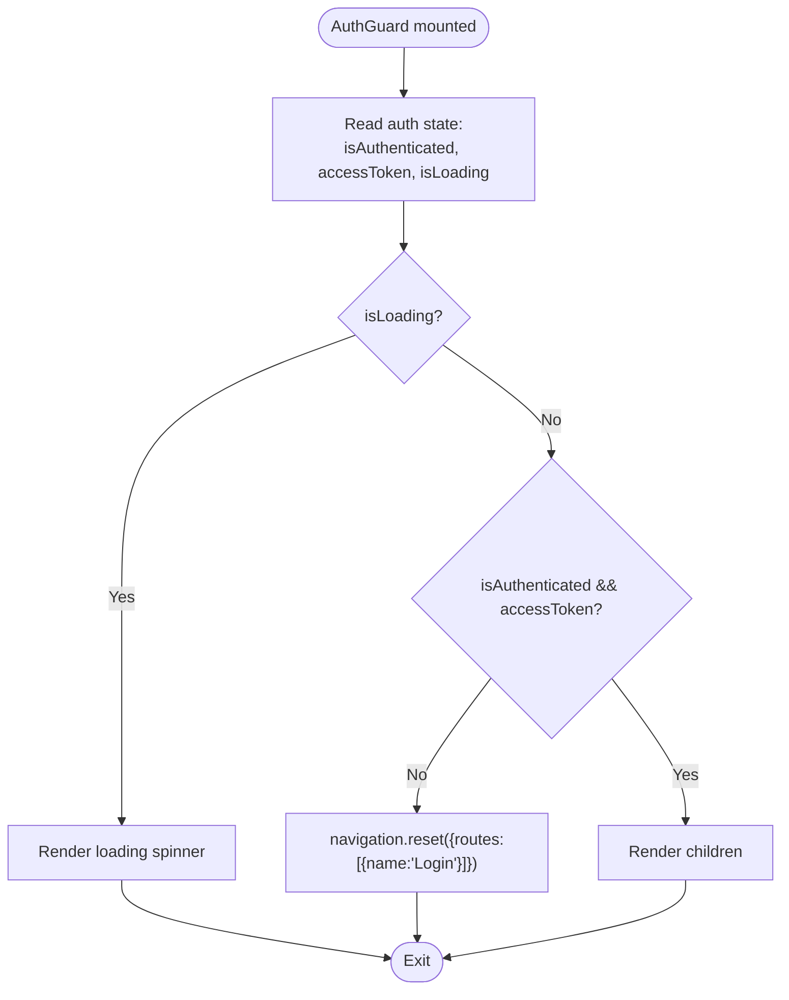
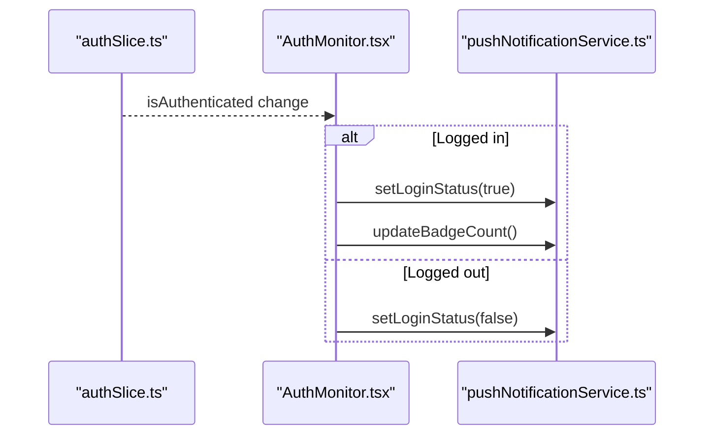
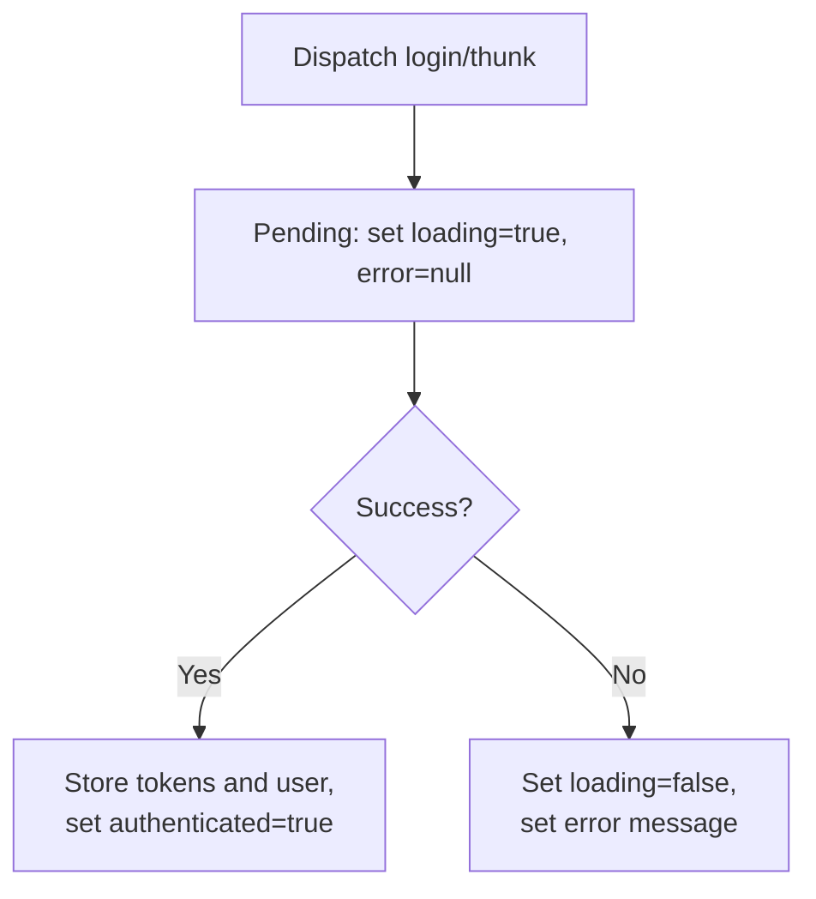
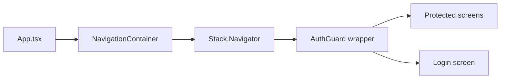
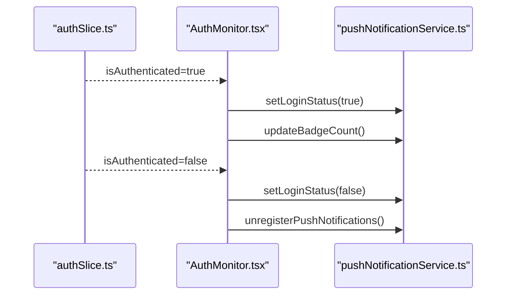
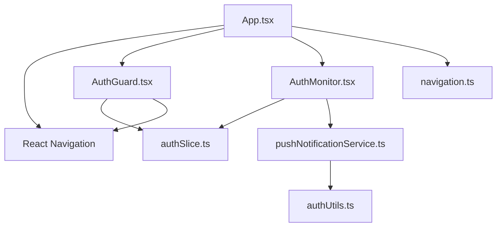

# Protected Routes & Navigation Guards

<cite>
**Referenced Files in This Document**
- [App.tsx](file://Estate_link_App/App.tsx)
- [AuthGuard.tsx](file://Estate_link_App/src/components/AuthGuard.tsx)
- [AuthMonitor.tsx](file://Estate_link_App/src/components/AuthMonitor.tsx)
- [authSlice.ts](file://Estate_link_App/src/store/slices/authSlice.ts)
- [store/index.ts](file://Estate_link_App/src/store/index.ts)
- [authUtils.ts](file://Estate_link_App/src/utils/authUtils.ts)
- [pushNotificationService.ts](file://Estate_link_App/src/services/pushNotificationService.ts)
- [navigation.ts](file://Estate_link_App/src/types/navigation.ts)
- [Login.tsx](file://Estate_link_App/src/Features/LoginScreen/Login.tsx)
</cite>

## Table of Contents
1. [Introduction](#introduction)
2. [Project Structure](#project-structure)
3. [Core Components](#core-components)
4. [Architecture Overview](#architecture-overview)
5. [Detailed Component Analysis](#detailed-component-analysis)
6. [Dependency Analysis](#dependency-analysis)
7. [Performance Considerations](#performance-considerations)
8. [Troubleshooting Guide](#troubleshooting-guide)
9. [Conclusion](#conclusion)

## Introduction
This document explains the mobile application’s protected routes system and navigation guards. It focuses on how authentication state is monitored, enforced at the route level, and integrated with React Navigation. It covers:
- How AuthGuard protects sensitive screens and blocks unauthorized access
- Conditional navigation based on authentication state
- Automatic redirection logic and loading states during authentication checks
- Integration with React Navigation for seamless transitions
- Handling authentication state changes and push notification synchronization
- Public vs private route classification, redirect URL preservation, and state restoration
- Error handling, graceful degradation, and performance considerations

## Project Structure
The protected routes system spans several layers:
- Application bootstrap and navigation container
- Authentication state management via Redux
- Route protection guard component
- Authentication monitoring for push notifications
- Utility functions for token retrieval and headers
- Type-safe navigation parameter definitions

**Diagram sources**
- [App.tsx](file://Estate_link_App/App.tsx#L118-L415)
- [authSlice.ts](file://Estate_link_App/src/store/slices/authSlice.ts#L1-L564)
- [store/index.ts](file://Estate_link_App/src/store/index.ts#L1-L79)
- [AuthGuard.tsx](file://Estate_link_App/src/components/AuthGuard.tsx#L1-L42)
- [AuthMonitor.tsx](file://Estate_link_App/src/components/AuthMonitor.tsx#L1-L27)
- [authUtils.ts](file://Estate_link_App/src/utils/authUtils.ts#L1-L219)
- [pushNotificationService.ts](file://Estate_link_App/src/services/pushNotificationService.ts#L1-L767)
- [navigation.ts](file://Estate_link_App/src/types/navigation.ts#L1-L40)

**Section sources**
- [App.tsx](file://Estate_link_App/App.tsx#L118-L415)
- [store/index.ts](file://Estate_link_App/src/store/index.ts#L1-L79)
- [navigation.ts](file://Estate_link_App/src/types/navigation.ts#L1-L40)

## Core Components
- AuthGuard: A route-level guard that checks authentication state and either renders children or redirects to the login screen. It displays a loading spinner while authentication is being verified.
- AuthMonitor: A passive monitor that listens to authentication changes and synchronizes push notification preferences and badge counts.
- authSlice: Manages authentication state, loading flags, errors, and tokens. Provides async thunks for login and status checks.
- Redux Store and Persistence: Centralizes auth state and persists it across sessions.
- authUtils: Provides token retrieval and header generation utilities used by services.
- pushNotificationService: Integrates with Expo notifications, respects login state, and navigates based on notification payloads.
- navigation.ts: Defines typed navigation parameters for the entire app.

**Section sources**
- [AuthGuard.tsx](file://Estate_link_App/src/components/AuthGuard.tsx#L1-L42)
- [AuthMonitor.tsx](file://Estate_link_App/src/components/AuthMonitor.tsx#L1-L27)
- [authSlice.ts](file://Estate_link_App/src/store/slices/authSlice.ts#L1-L564)
- [store/index.ts](file://Estate_link_App/src/store/index.ts#L1-L79)
- [authUtils.ts](file://Estate_link_App/src/utils/authUtils.ts#L1-L219)
- [pushNotificationService.ts](file://Estate_link_App/src/services/pushNotificationService.ts#L1-L767)
- [navigation.ts](file://Estate_link_App/src/types/navigation.ts#L1-L40)

## Architecture Overview
The protected routes system enforces authentication at two levels:
- Route-level protection via AuthGuard
- Navigation-level enforcement via React Navigation configuration and programmatic redirects

**Diagram sources**
- [App.tsx](file://Estate_link_App/App.tsx#L242-L409)
- [AuthGuard.tsx](file://Estate_link_App/src/components/AuthGuard.tsx#L10-L41)
- [authSlice.ts](file://Estate_link_App/src/store/slices/authSlice.ts#L361-L564)
- [Login.tsx](file://Estate_link_App/src/Features/LoginScreen/Login.tsx#L39-L225)

## Detailed Component Analysis

### AuthGuard: Route-Level Protection
Authenticates and authorizes access to protected screens:
- Reads authentication state from Redux
- Redirects to Login using a hard reset when not authenticated and not loading
- Renders a loading spinner while authentication is being checked
- Returns null for unauthenticated users to prevent rendering protected content
- Renders children when authenticated

**Diagram sources**
- [AuthGuard.tsx](file://Estate_link_App/src/components/AuthGuard.tsx#L10-L41)

**Section sources**
- [AuthGuard.tsx](file://Estate_link_App/src/components/AuthGuard.tsx#L1-L42)

### AuthMonitor: Authentication Change Synchronization
Monitors authentication state and updates push notification preferences:
- Subscribes to Redux auth state changes
- Updates push notification login status
- On login, triggers badge count refresh
- Does not render UI

**Diagram sources**
- [AuthMonitor.tsx](file://Estate_link_App/src/components/AuthMonitor.tsx#L10-L26)
- [pushNotificationService.ts](file://Estate_link_App/src/services/pushNotificationService.ts#L77-L84)

**Section sources**
- [AuthMonitor.tsx](file://Estate_link_App/src/components/AuthMonitor.tsx#L1-L27)
- [pushNotificationService.ts](file://Estate_link_App/src/services/pushNotificationService.ts#L1-L767)

### Authentication State Management (Redux)
Centralized state for authentication:
- Tracks user, tokens, loading, error, and OTP data
- Provides async thunks for login and status checks
- Persists auth state across sessions

Key behaviors:
- Pending: sets loading flag and clears error
- Fulfilled: stores tokens and user data, marks authenticated
- Rejected: sets loading flag and error message

**Diagram sources**
- [authSlice.ts](file://Estate_link_App/src/store/slices/authSlice.ts#L481-L513)

**Section sources**
- [authSlice.ts](file://Estate_link_App/src/store/slices/authSlice.ts#L1-L564)
- [store/index.ts](file://Estate_link_App/src/store/index.ts#L1-L79)

### Navigation Integration and Programmatic Redirection
- React Navigation container is initialized at the app root
- Protected screens are wrapped with AuthGuard
- Programmatic redirect to Login uses navigation.reset to replace the entire stack
- Gesture controls are disabled on the dashboard to prevent accidental navigation back to Login

**Diagram sources**
- [App.tsx](file://Estate_link_App/App.tsx#L242-L409)
- [AuthGuard.tsx](file://Estate_link_App/src/components/AuthGuard.tsx#L10-L41)

**Section sources**
- [App.tsx](file://Estate_link_App/App.tsx#L242-L409)

### Public vs Private Route Classification
- Public routes: Login, WelcomeBack, InitialScreen, PasswordReset, ForgotPassword, VerifyCode, SetPassword
- Private routes: Dashboard and other screens under the bottom tab navigator
- Classification is implicit through the navigation stack definition and AuthGuard wrapping

**Section sources**
- [App.tsx](file://Estate_link_App/App.tsx#L253-L407)
- [AuthGuard.tsx](file://Estate_link_App/src/components/AuthGuard.tsx#L10-L41)

### Redirect URL Preservation and State Restoration
- The system uses navigation.reset to redirect unauthenticated users to Login, clearing the stack
- After successful authentication, the app proceeds to the intended destination (e.g., Dashboard)
- State restoration relies on Redux persistence; tokens and user data are restored on app launch

Note: There is no explicit “redirect URL” preservation mechanism in the current implementation. To support returning users to a requested screen after login, consider pushing the target route onto the stack before redirecting to Login and then popping it upon successful authentication.

**Section sources**
- [AuthGuard.tsx](file://Estate_link_App/src/components/AuthGuard.tsx#L14-L23)
- [store/index.ts](file://Estate_link_App/src/store/index.ts#L16-L20)

### Handling Authentication State Changes and Push Notifications
- AuthMonitor updates push notification login status and badge count on login
- pushNotificationService dynamically configures foreground notification handling based on login status
- On logout, push notifications are unregistered and badge count cleared

**Diagram sources**
- [AuthMonitor.tsx](file://Estate_link_App/src/components/AuthMonitor.tsx#L10-L26)
- [pushNotificationService.ts](file://Estate_link_App/src/services/pushNotificationService.ts#L58-L84)
- [pushNotificationService.ts](file://Estate_link_App/src/services/pushNotificationService.ts#L513-L558)

**Section sources**
- [AuthMonitor.tsx](file://Estate_link_App/src/components/AuthMonitor.tsx#L1-L27)
- [pushNotificationService.ts](file://Estate_link_App/src/services/pushNotificationService.ts#L1-L767)

### Error Handling and Graceful Degradation
- AuthGuard renders a loading spinner while authentication is being checked
- On authentication failure or missing tokens, AuthGuard redirects to Login
- Redux authSlice sets error messages on rejected actions; Login screen displays errors
- pushNotificationService gracefully handles failures (e.g., missing tokens) without crashing the app

Recommendations:
- Display user-friendly error messages near the Login form
- Consider retry mechanisms for transient network errors
- Ensure AuthGuard hides UI until authentication state is confirmed

**Section sources**
- [AuthGuard.tsx](file://Estate_link_App/src/components/AuthGuard.tsx#L25-L41)
- [authSlice.ts](file://Estate_link_App/src/store/slices/authSlice.ts#L510-L513)
- [Login.tsx](file://Estate_link_App/src/Features/LoginScreen/Login.tsx#L354-L358)
- [pushNotificationService.ts](file://Estate_link_App/src/services/pushNotificationService.ts#L176-L179)

## Dependency Analysis
The protected routes system depends on:
- Redux for centralized authentication state
- React Navigation for route management and programmatic navigation
- Push notification service for login-state-aware notification handling
- Typed navigation parameters for compile-time safety

**Diagram sources**
- [AuthGuard.tsx](file://Estate_link_App/src/components/AuthGuard.tsx#L1-L42)
- [AuthMonitor.tsx](file://Estate_link_App/src/components/AuthMonitor.tsx#L1-L27)
- [authSlice.ts](file://Estate_link_App/src/store/slices/authSlice.ts#L1-L564)
- [pushNotificationService.ts](file://Estate_link_App/src/services/pushNotificationService.ts#L1-L767)
- [authUtils.ts](file://Estate_link_App/src/utils/authUtils.ts#L1-L219)
- [App.tsx](file://Estate_link_App/App.tsx#L118-L415)
- [navigation.ts](file://Estate_link_App/src/types/navigation.ts#L1-L40)

**Section sources**
- [App.tsx](file://Estate_link_App/App.tsx#L118-L415)
- [AuthGuard.tsx](file://Estate_link_App/src/components/AuthGuard.tsx#L1-L42)
- [AuthMonitor.tsx](file://Estate_link_App/src/components/AuthMonitor.tsx#L1-L27)
- [authSlice.ts](file://Estate_link_App/src/store/slices/authSlice.ts#L1-L564)
- [pushNotificationService.ts](file://Estate_link_App/src/services/pushNotificationService.ts#L1-L767)
- [authUtils.ts](file://Estate_link_App/src/utils/authUtils.ts#L1-L219)
- [navigation.ts](file://Estate_link_App/src/types/navigation.ts#L1-L40)

## Performance Considerations
- Minimize re-renders by keeping AuthGuard lightweight and relying on Redux selectors
- Use freezeOnBlur and gesture disabling judiciously to balance UX and performance
- Persist only essential slices (e.g., auth) to reduce hydration overhead
- Debounce or throttle authentication checks to avoid redundant network calls
- Avoid heavy computations in AuthGuard; defer to Redux state and navigation APIs

## Troubleshooting Guide
Common issues and resolutions:
- Users stuck on a blank screen while logging in
  - Cause: AuthGuard rendering loading spinner while authentication resolves
  - Resolution: Ensure isLoading is properly toggled in authSlice pending/fulfilled/rejected handlers
- Unauthorized access to protected screens
  - Cause: Missing AuthGuard wrapper or incorrect route classification
  - Resolution: Wrap all protected screens with AuthGuard and verify navigation stack
- Push notifications appearing when logged out
  - Cause: Foreground notification handler not respecting login status
  - Resolution: Confirm AuthMonitor updates pushNotificationService login status and badge count
- Navigation not working after logout
  - Cause: Navigation ref not set or push notification service still referencing stale state
  - Resolution: Ensure pushNotificationService.setNavigationRef is called and AuthMonitor updates login status

**Section sources**
- [AuthGuard.tsx](file://Estate_link_App/src/components/AuthGuard.tsx#L25-L41)
- [authSlice.ts](file://Estate_link_App/src/store/slices/authSlice.ts#L481-L513)
- [AuthMonitor.tsx](file://Estate_link_App/src/components/AuthMonitor.tsx#L10-L26)
- [pushNotificationService.ts](file://Estate_link_App/src/services/pushNotificationService.ts#L14-L35)
- [App.tsx](file://Estate_link_App/App.tsx#L149-L206)

## Conclusion
The protected routes system leverages a combination of route-level guards, Redux state management, and React Navigation to enforce authentication consistently. AuthGuard provides immediate protection for sensitive screens, while AuthMonitor ensures push notification behavior aligns with authentication state. With minor enhancements—such as preserving redirect URLs and refining error messaging—the system can offer a robust, user-friendly, and performant authentication experience.