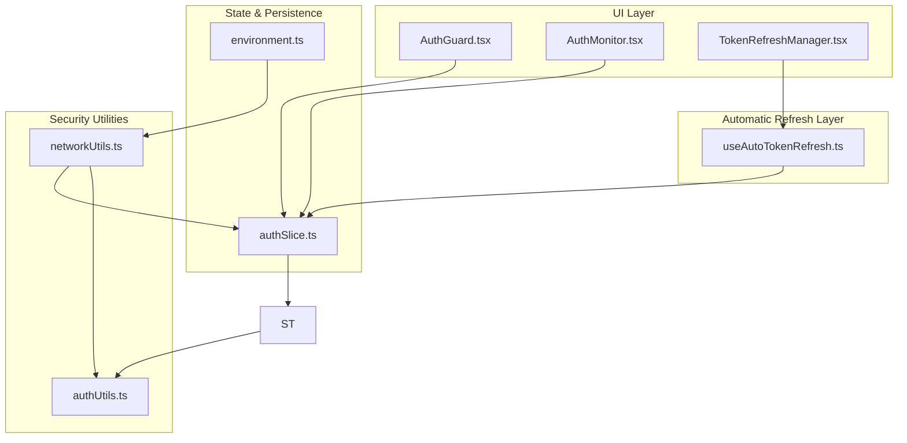
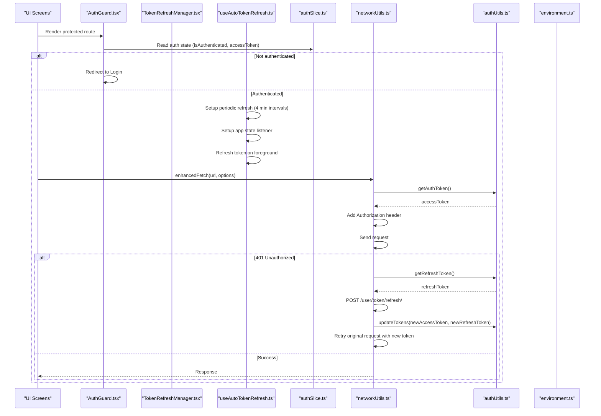
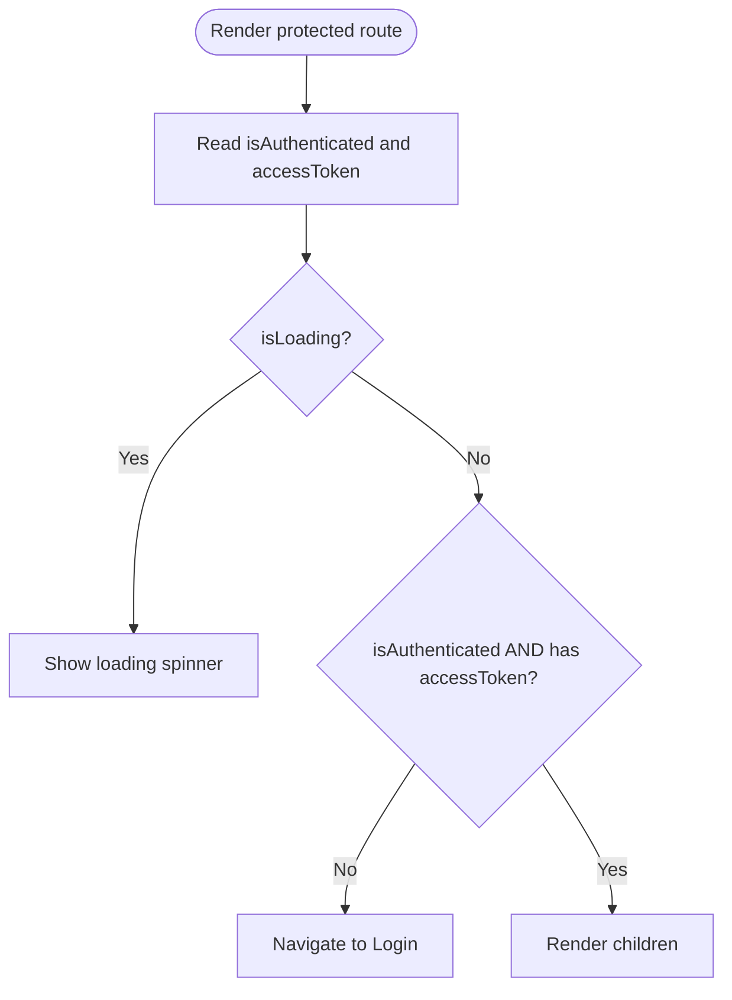
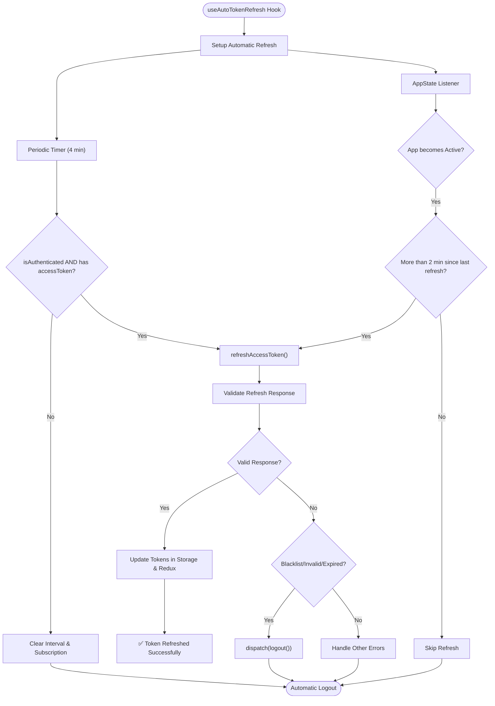
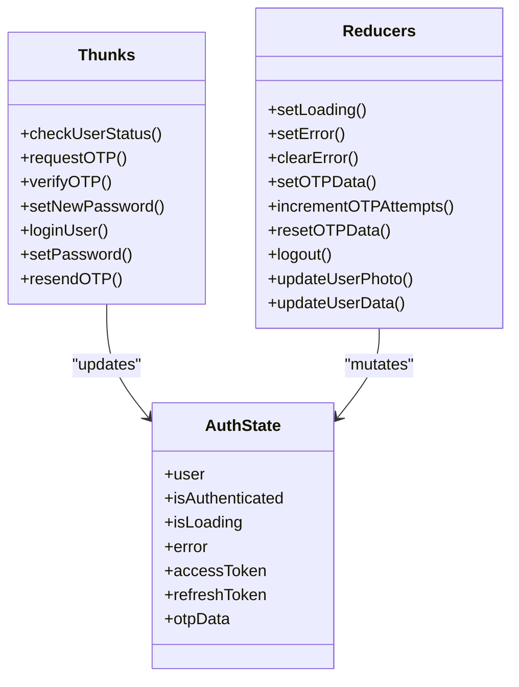
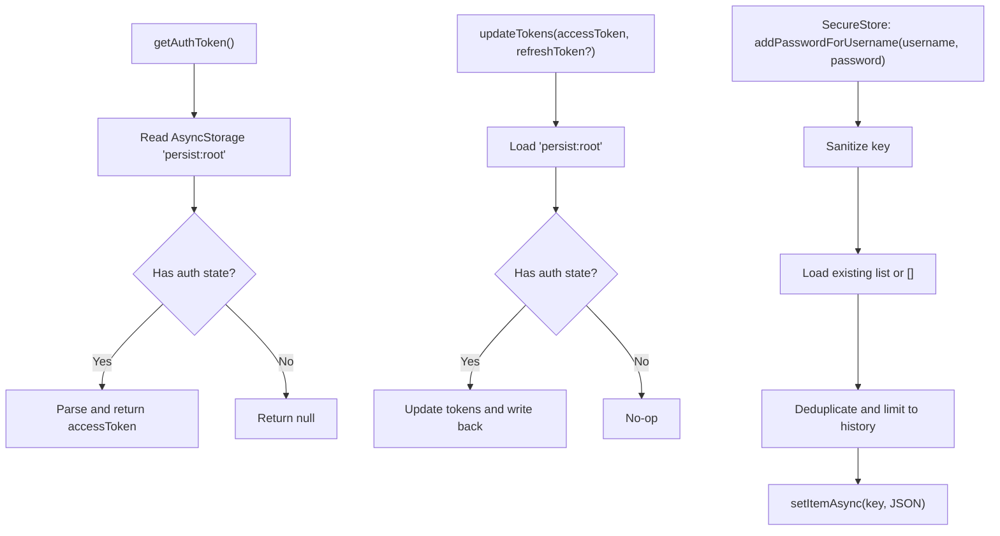
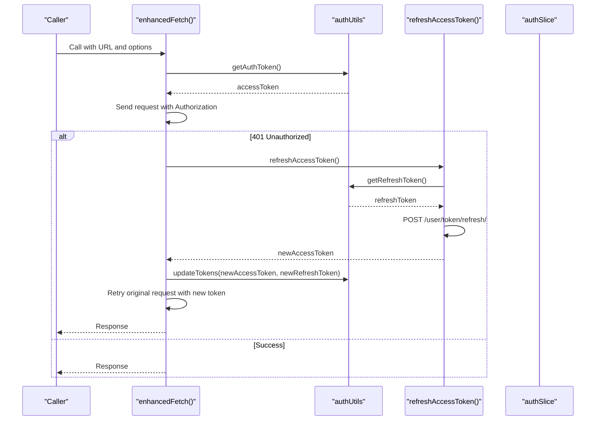
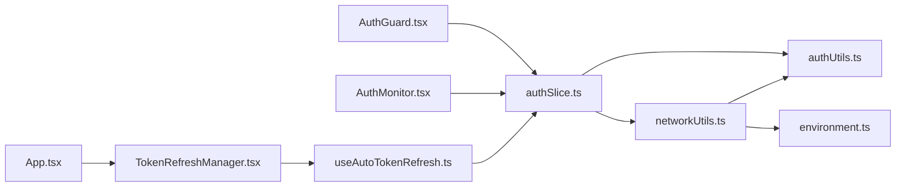

# Security Mechanisms & Token Management

<cite>
**Referenced Files in This Document**
- [AuthGuard.tsx](file://Estate_link_App/src/components/AuthGuard.tsx)
- [AuthMonitor.tsx](file://Estate_link_App/src/components/AuthMonitor.tsx)
- [TokenRefreshManager.tsx](file://Estate_link_App/src/components/TokenRefreshManager.tsx)
- [useAutoTokenRefresh.ts](file://Estate_link_App/src/hooks/useAutoTokenRefresh.ts)
- [authUtils.ts](file://Estate_link_App/src/utils/authUtils.ts)
- [authSlice.ts](file://Estate_link_App/src/store/slices/authSlice.ts)
- [networkUtils.ts](file://Estate_link_App/src/utils/networkUtils.ts)
- [environment.ts](file://Estate_link_App/src/config/environment.ts)
- [App.tsx](file://Estate_link_App/App.tsx)
</cite>

## Update Summary
**Changes Made**
- Added comprehensive documentation for the new automatic token refresh system
- Updated architecture diagrams to reflect the dual-layer token refresh approach
- Enhanced token validation and blacklist detection procedures
- Expanded automatic logout mechanisms for invalid/expired tokens
- Added app state change handling for seamless token renewal

## Table of Contents
1. [Introduction](#introduction)
2. [Project Structure](#project-structure)
3. [Core Components](#core-components)
4. [Architecture Overview](#architecture-overview)
5. [Detailed Component Analysis](#detailed-component-analysis)
6. [Dependency Analysis](#dependency-analysis)
7. [Performance Considerations](#performance-considerations)
8. [Troubleshooting Guide](#troubleshooting-guide)
9. [Conclusion](#conclusion)

## Introduction
This document explains the mobile application's security mechanisms and token management system. It covers JWT token handling, secure storage practices, automatic token refresh, route protection via an AuthGuard component, authentication state persistence across app sessions, and secure communication with backend APIs. The system now features a dual-layer automatic token refresh mechanism that provides seamless JWT token renewal 4 minutes before expiration, handles app state changes, detects token blacklist conditions, and implements automatic logout procedures for invalid/expired tokens.

## Project Structure
The security-related logic spans four primary areas:
- Authentication state and persistence: Redux store with persisted auth slice and environment configuration
- Token lifecycle and secure storage: Utilities for token retrieval, updates, and secure credential vaults
- Automatic token refresh: Dual-layer system with both periodic and app-state-based refresh mechanisms
- Network layer and token refresh: Enhanced fetch wrapper with automatic retry, token refresh, and network monitoring

**Diagram sources**
- [AuthGuard.tsx](file://Estate_link_App/src/components/AuthGuard.tsx#L1-L42)
- [AuthMonitor.tsx](file://Estate_link_App/src/components/AuthMonitor.tsx#L1-L27)
- [TokenRefreshManager.tsx](file://Estate_link_App/src/components/TokenRefreshManager.tsx#L1-L14)
- [useAutoTokenRefresh.ts](file://Estate_link_App/src/hooks/useAutoTokenRefresh.ts#L1-L151)
- [authSlice.ts](file://Estate_link_App/src/store/slices/authSlice.ts#L1-L653)
- [authUtils.ts](file://Estate_link_App/src/utils/authUtils.ts#L1-L219)
- [networkUtils.ts](file://Estate_link_App/src/utils/networkUtils.ts#L1-L512)
- [environment.ts](file://Estate_link_App/src/config/environment.ts#L1-L84)

**Section sources**
- [AuthGuard.tsx](file://Estate_link_App/src/components/AuthGuard.tsx#L1-L42)
- [TokenRefreshManager.tsx](file://Estate_link_App/src/components/TokenRefreshManager.tsx#L1-L14)
- [useAutoTokenRefresh.ts](file://Estate_link_App/src/hooks/useAutoTokenRefresh.ts#L1-L151)
- [authSlice.ts](file://Estate_link_App/src/store/slices/authSlice.ts#L1-L653)
- [authUtils.ts](file://Estate_link_App/src/utils/authUtils.ts#L1-L219)
- [networkUtils.ts](file://Estate_link_App/src/utils/networkUtils.ts#L1-L512)
- [environment.ts](file://Estate_link_App/src/config/environment.ts#L1-L84)

## Core Components
- AuthGuard: Protects routes by ensuring the user is authenticated and has a valid access token before rendering child screens. It redirects unauthenticated users to the login screen and displays a loading indicator during authentication checks.
- AuthMonitor: Synchronizes authentication status with push notification service, enabling badge updates and login state awareness.
- TokenRefreshManager: Component that initializes and manages the automatic token refresh system, ensuring seamless token renewal without user intervention.
- useAutoTokenRefresh: Custom hook implementing the automatic token refresh system with dual-layer approach - periodic refresh every 4 minutes and app-state-based refresh on foreground activation.
- authSlice: Manages authentication state, user metadata, tokens, OTP data, and async thunks for login, OTP flows, and password changes. It persists selected slices and coordinates with network utilities.
- authUtils: Provides token retrieval, updates, and secure credential vaults using AsyncStorage and Expo SecureStore. Also supports "remember me" username history and suggestions.
- networkUtils: Implements enhanced fetch with automatic retry, exponential backoff, network connectivity checks, backend discovery, and automatic token refresh on 401 responses. It manages token refresh concurrency and subscriber notifications.
- environment: Defines environment-specific configurations including backend URLs, timeouts, retry attempts, and discovery toggles.

**Section sources**
- [AuthGuard.tsx](file://Estate_link_App/src/components/AuthGuard.tsx#L10-L41)
- [AuthMonitor.tsx](file://Estate_link_App/src/components/AuthMonitor.tsx#L10-L26)
- [TokenRefreshManager.tsx](file://Estate_link_App/src/components/TokenRefreshManager.tsx#L3-L13)
- [useAutoTokenRefresh.ts](file://Estate_link_App/src/hooks/useAutoTokenRefresh.ts#L9-L15)
- [authSlice.ts](file://Estate_link_App/src/store/slices/authSlice.ts#L6-L42)
- [authUtils.ts](file://Estate_link_App/src/utils/authUtils.ts#L4-L219)
- [networkUtils.ts](file://Estate_link_App/src/utils/networkUtils.ts#L382-L508)
- [environment.ts](file://Estate_link_App/src/config/environment.ts#L3-L34)

## Architecture Overview
The system integrates Redux for state management, AsyncStorage for persisted slices, and a secure token vault using Expo SecureStore. The automatic token refresh system operates through two complementary mechanisms: a periodic timer that refreshes tokens 4 minutes before expiration, and an app-state listener that refreshes tokens when the app returns to the foreground. The network layer wraps fetch to handle retries, timeouts, and automatic token refresh on unauthorized responses.

**Diagram sources**
- [AuthGuard.tsx](file://Estate_link_App/src/components/AuthGuard.tsx#L14-L23)
- [TokenRefreshManager.tsx](file://Estate_link_App/src/components/TokenRefreshManager.tsx#L7-L9)
- [useAutoTokenRefresh.ts](file://Estate_link_App/src/hooks/useAutoTokenRefresh.ts#L111-L144)
- [authSlice.ts](file://Estate_link_App/src/store/slices/authSlice.ts#L485-L513)
- [networkUtils.ts](file://Estate_link_App/src/utils/networkUtils.ts#L382-L508)
- [authUtils.ts](file://Estate_link_App/src/utils/authUtils.ts#L5-L59)
- [environment.ts](file://Estate_link_App/src/config/environment.ts#L46-L49)

## Detailed Component Analysis

### AuthGuard: Route Protection
- Purpose: Prevents rendering of protected content until authentication is confirmed. Displays a loading spinner while determining state and redirects to the login screen if missing credentials.
- Behavior:
  - Reads authentication state from Redux
  - Resets navigation to the Login route when not authenticated or missing tokens
  - Returns null to block rendering otherwise
- Security impact: Ensures unauthorized users cannot access protected screens, reducing accidental exposure.

**Diagram sources**
- [AuthGuard.tsx](file://Estate_link_App/src/components/AuthGuard.tsx#L14-L23)

**Section sources**
- [AuthGuard.tsx](file://Estate_link_App/src/components/AuthGuard.tsx#L10-L41)

### AuthMonitor: Authentication Status Synchronization
- Purpose: Observes authentication changes and informs the push notification service about login/logout events. On login, it triggers badge count updates.
- Security impact: Maintains external integrations aligned with auth state, preventing stale or inconsistent push behavior.

**Section sources**
- [AuthMonitor.tsx](file://Estate_link_App/src/components/AuthMonitor.tsx#L10-L26)

### TokenRefreshManager: Automatic Token Refresh Initialization
- Purpose: Component wrapper that initializes the automatic token refresh system by mounting the useAutoTokenRefresh hook.
- Implementation: Simple component that calls useAutoTokenRefresh() and renders nothing, positioned at the root level of the application.
- Security impact: Ensures automatic token refresh is active throughout the application lifecycle without manual intervention.

**Section sources**
- [TokenRefreshManager.tsx](file://Estate_link_App/src/components/TokenRefreshManager.tsx#L3-L13)

### useAutoTokenRefresh: Dual-Layer Automatic Token Refresh System
- Purpose: Implements a comprehensive automatic token refresh system that prevents token expiration and maintains seamless user experience.
- Dual-Layer Approach:
  - Periodic Refresh: Automatically refreshes tokens every 4 minutes (assuming 5-minute token expiry) to ensure tokens remain valid
  - App-State Based Refresh: Monitors app state changes and refreshes tokens when the app returns to foreground after being inactive
- Blacklist Detection and Automatic Logout:
  - Validates token refresh responses for blacklist, invalid, or expired conditions
  - Automatically logs out users when token validation fails
  - Provides detailed error logging for debugging purposes
- Implementation Details:
  - Uses AppState API to detect app state changes (background/foreground)
  - Maintains refresh interval references for proper cleanup
  - Tracks last refresh time to prevent unnecessary refresh operations
  - Integrates with Redux store for token updates
  - Uses AsyncStorage for local token storage

**Diagram sources**
- [useAutoTokenRefresh.ts](file://Estate_link_App/src/hooks/useAutoTokenRefresh.ts#L15-L151)

**Section sources**
- [useAutoTokenRefresh.ts](file://Estate_link_App/src/hooks/useAutoTokenRefresh.ts#L9-L15)
- [useAutoTokenRefresh.ts](file://Estate_link_App/src/hooks/useAutoTokenRefresh.ts#L22-L82)
- [useAutoTokenRefresh.ts](file://Estate_link_App/src/hooks/useAutoTokenRefresh.ts#L84-L108)
- [useAutoTokenRefresh.ts](file://Estate_link_App/src/hooks/useAutoTokenRefresh.ts#L110-L144)

### authSlice: Authentication State and Lifecycle
- State fields: user metadata, authentication flags, loading/error states, access/refresh tokens, and OTP data.
- Async thunks:
  - Login: Supports dual login types and handles error mapping
  - OTP flows: request, verify, resend
  - Password management: set password with field-specific validation
  - User status check: lightweight endpoint to validate authenticator presence
- Persistence: Only selected slices are persisted via Redux Persist; auth slice is whitelisted.
- Token Management: Provides updateTokens action for seamless token updates from both automatic refresh and manual refresh processes.

**Diagram sources**
- [authSlice.ts](file://Estate_link_App/src/store/slices/authSlice.ts#L6-L42)
- [authSlice.ts](file://Estate_link_App/src/store/slices/authSlice.ts#L485-L513)

**Section sources**
- [authSlice.ts](file://Estate_link_App/src/store/slices/authSlice.ts#L6-L42)
- [authSlice.ts](file://Estate_link_App/src/store/slices/authSlice.ts#L485-L513)
- [authSlice.ts](file://Estate_link_App/src/store/slices/authSlice.ts#L486-L494)

### authUtils: Secure Storage and Credential Vault
- Token retrieval and updates:
  - Reads/writes access/refresh tokens from persisted Redux state stored in AsyncStorage
- Headers:
  - Generates Authorization headers for JSON and FormData requests
- "Remember me":
  - Stores username and a flag in AsyncStorage; maintains username history with deduplication and limits
- Secure credential vault:
  - Uses Expo SecureStore to store password suggestions per username with sanitization of keys and history limits
- Security practices:
  - Avoids storing passwords in persistent storage
  - Sanitizes SecureStore keys to ensure compatibility and prevent collisions

**Diagram sources**
- [authUtils.ts](file://Estate_link_App/src/utils/authUtils.ts#L4-L59)
- [authUtils.ts](file://Estate_link_App/src/utils/authUtils.ts#L178-L217)

**Section sources**
- [authUtils.ts](file://Estate_link_App/src/utils/authUtils.ts#L4-L72)
- [authUtils.ts](file://Estate_link_App/src/utils/authUtils.ts#L85-L117)
- [authUtils.ts](file://Estate_link_App/src/utils/authUtils.ts#L158-L217)

### networkUtils: Enhanced Fetch, Retry, Discovery, and Token Refresh
- Enhanced fetch:
  - Adds Accept and Content-Type headers conditionally
  - Injects Authorization header from token storage or parameter
  - Automatic retry on transient network errors
- Token refresh:
  - Detects 401 responses
  - Serializes refresh requests to avoid concurrent refresh storms
  - Subscribes callers while refreshing to retry with a new token
  - Updates tokens in storage and notifies subscribers
- Network discovery and connectivity:
  - Discovers backend URL by testing configured and common IPs
  - Tracks connectivity status and retry counts
  - Handles network changes and rediscovery
- Security posture:
  - Centralizes header injection and error handling
  - Minimizes token exposure by avoiding manual header construction outside the utility

**Diagram sources**
- [networkUtils.ts](file://Estate_link_App/src/utils/networkUtils.ts#L382-L508)
- [authUtils.ts](file://Estate_link_App/src/utils/authUtils.ts#L23-L59)
- [authSlice.ts](file://Estate_link_App/src/store/slices/authSlice.ts#L487-L489)

**Section sources**
- [networkUtils.ts](file://Estate_link_App/src/utils/networkUtils.ts#L382-L508)
- [networkUtils.ts](file://Estate_link_App/src/utils/networkUtils.ts#L330-L380)
- [networkUtils.ts](file://Estate_link_App/src/utils/networkUtils.ts#L13-L155)
- [networkUtils.ts](file://Estate_link_App/src/utils/networkUtils.ts#L168-L226)

### environment: Environment Configuration
- Defines environment profiles (DEV, LOCAL, PROD) with backend URLs, timeouts, retry attempts, discovery flags, and intervals
- Provides helpers to get current configuration, backend URL, and fallback URLs for discovery
- Controls whether auto-discovery is enabled and how often network checks occur

**Section sources**
- [environment.ts](file://Estate_link_App/src/config/environment.ts#L3-L34)
- [environment.ts](file://Estate_link_App/src/config/environment.ts#L46-L84)

## Dependency Analysis
- AuthGuard depends on Redux selectors to enforce route protection
- AuthMonitor depends on Redux to observe authentication changes and interacts with push notification service
- TokenRefreshManager depends on useAutoTokenRefresh hook for automatic token refresh initialization
- useAutoTokenRefresh depends on AppState API, Redux store, AsyncStorage, and authUtils for token operations
- authSlice orchestrates async flows and updates state; it relies on networkUtils for API calls and authUtils for token operations
- networkUtils depends on authUtils for token retrieval and updates, and on environment for backend URL configuration
- App.tsx integrates TokenRefreshManager at the root level to ensure automatic refresh system is always active

**Diagram sources**
- [AuthGuard.tsx](file://Estate_link_App/src/components/AuthGuard.tsx#L1-L42)
- [AuthMonitor.tsx](file://Estate_link_App/src/components/AuthMonitor.tsx#L1-L27)
- [TokenRefreshManager.tsx](file://Estate_link_App/src/components/TokenRefreshManager.tsx#L1-L14)
- [useAutoTokenRefresh.ts](file://Estate_link_App/src/hooks/useAutoTokenRefresh.ts#L1-L151)
- [authSlice.ts](file://Estate_link_App/src/store/slices/authSlice.ts#L1-L653)
- [networkUtils.ts](file://Estate_link_App/src/utils/networkUtils.ts#L1-L512)
- [authUtils.ts](file://Estate_link_App/src/utils/authUtils.ts#L1-L219)
- [App.tsx](file://Estate_link_App/App.tsx#L250-L251)

**Section sources**
- [App.tsx](file://Estate_link_App/App.tsx#L250-L251)
- [TokenRefreshManager.tsx](file://Estate_link_App/src/components/TokenRefreshManager.tsx#L7-L9)
- [useAutoTokenRefresh.ts](file://Estate_link_App/src/hooks/useAutoTokenRefresh.ts#L16-L17)
- [authSlice.ts](file://Estate_link_App/src/store/slices/authSlice.ts#L1-L653)
- [networkUtils.ts](file://Estate_link_App/src/utils/networkUtils.ts#L1-L512)
- [authUtils.ts](file://Estate_link_App/src/utils/authUtils.ts#L1-L219)

## Performance Considerations
- Token refresh concurrency: The refresh mechanism prevents multiple simultaneous refreshes and subscribes callers to retry with a new token, minimizing redundant requests.
- Dual-layer refresh efficiency: The combination of periodic and app-state-based refresh prevents unnecessary token refresh operations while ensuring tokens remain valid.
- App state optimization: The 2-minute threshold for foreground refresh prevents excessive network requests when the app returns to foreground frequently.
- Retry strategy: Exponential backoff reduces load on failing endpoints and improves resilience.
- Network discovery: Scans common IPs and ports with short timeouts; falls back to configured URLs to minimize latency.
- Persistence: Only essential slices are persisted to reduce overhead and improve startup performance.

## Troubleshooting Guide
- Authentication redirection loops:
  - Verify AuthGuard reads correct state and that authSlice sets isAuthenticated and accessToken upon successful login
  - Confirm Redux Persist whitelist includes the auth slice
- Automatic token refresh failures:
  - Check useAutoTokenRefresh hook logs for refresh operation results
  - Verify AppState event listeners are properly registered and cleaned up
  - Monitor refresh interval timers for proper cleanup on component unmount
- Blacklist detection issues:
  - Review useAutoTokenRefresh error handling for token validation failures
  - Check automatic logout dispatch actions when blacklist/invalid/expired tokens are detected
- 401 Unauthorized errors:
  - Ensure refreshAccessToken is invoked and tokens are updated in storage
  - Check that enhancedFetch injects Authorization headers and retries with the new token
- Network connectivity issues:
  - Use getNetworkStatus to inspect connectivity and retry counts
  - Trigger handleNetworkChange on network changes to rediscover backend
- Debugging utilities:
  - Log statements in AuthGuard, AuthMonitor, useAutoTokenRefresh, networkUtils, and authUtils provide visibility into state transitions and failures
  - Use getNetworkErrorMessage to present user-friendly messages derived from underlying errors

**Section sources**
- [AuthGuard.tsx](file://Estate_link_App/src/components/AuthGuard.tsx#L14-L23)
- [AuthMonitor.tsx](file://Estate_link_App/src/components/AuthMonitor.tsx#L13-L23)
- [useAutoTokenRefresh.ts](file://Estate_link_App/src/hooks/useAutoTokenRefresh.ts#L23-L82)
- [useAutoTokenRefresh.ts](file://Estate_link_App/src/hooks/useAutoTokenRefresh.ts#L44-L55)
- [networkUtils.ts](file://Estate_link_App/src/utils/networkUtils.ts#L510-L511)
- [networkUtils.ts](file://Estate_link_App/src/utils/networkUtils.ts#L240-L269)

## Conclusion
The application employs a comprehensive layered security approach: route protection via AuthGuard, robust authentication state management with Redux Persist, secure token storage and vaulting, and a sophisticated dual-layer automatic token refresh system. The new automatic token refresh system provides seamless JWT token renewal 4 minutes before expiration, handles app state changes for optimal user experience, detects blacklist conditions and automatically logs out invalid/expired tokens, and maintains integration with the existing network layer's token refresh capabilities. These mechanisms collectively mitigate common risks such as unauthorized access, token theft, insecure communication, and session expiration, while maintaining usability and reliability across environments.