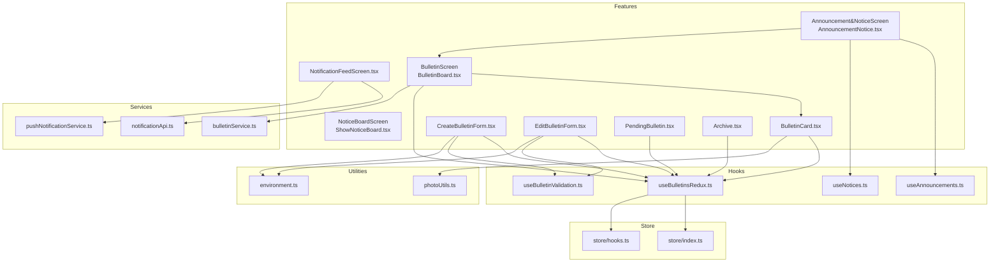
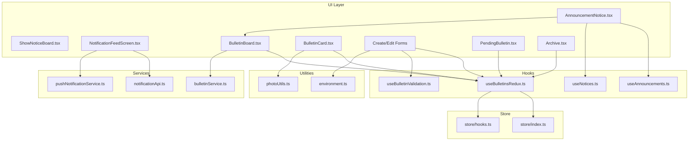
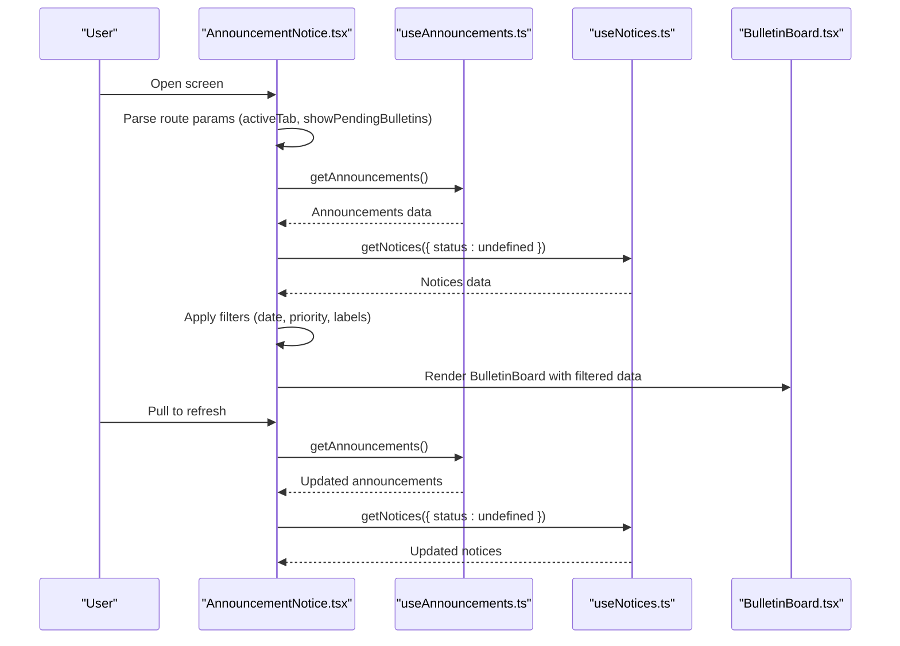
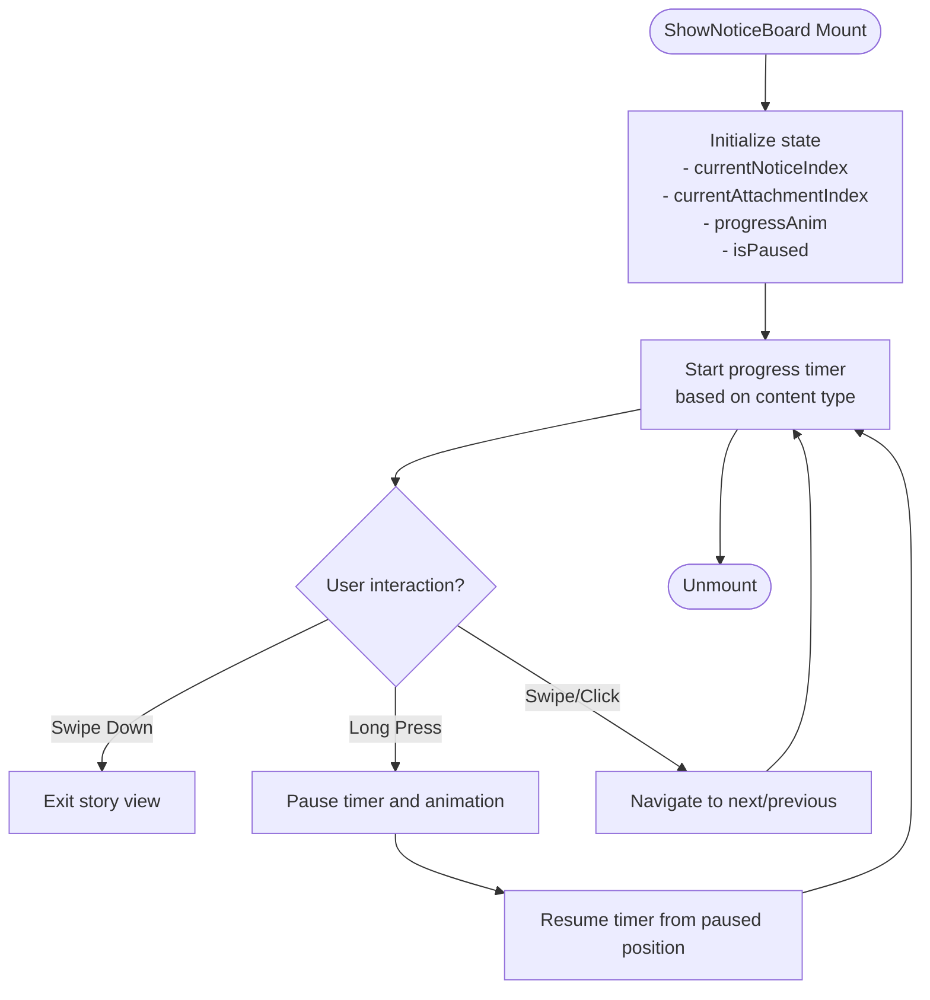
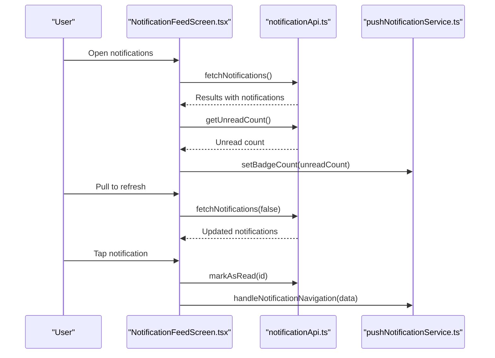
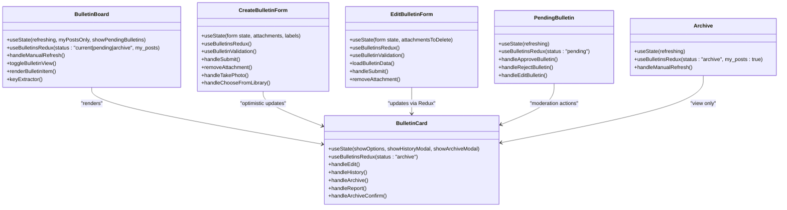
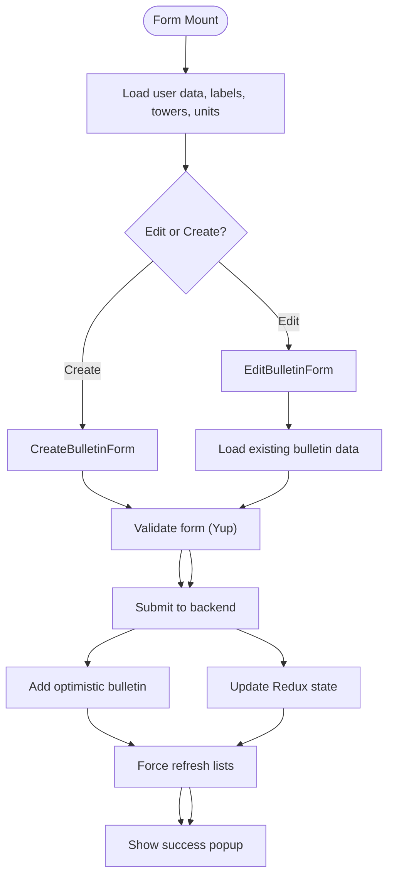
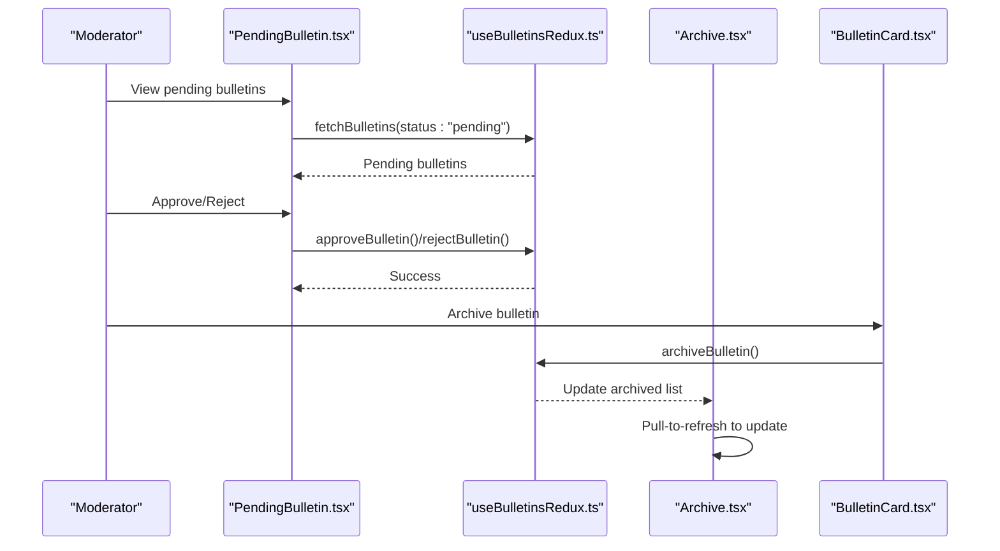
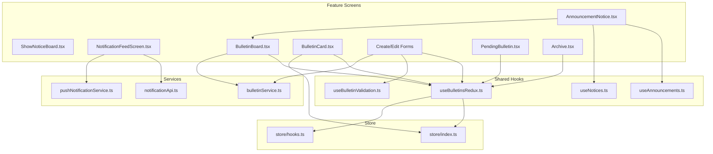

# Communication Portal

<cite>
**Referenced Files in This Document**
- [AnnouncementNotice.tsx](file://Estate_link_App/src/Features/Announcement&NoticeScreen/AnnouncementNotice.tsx)
- [ShowNoticeBoard.tsx](file://Estate_link_App/src/Features/NoticeBoardScreen/ShowNoticeBoard.tsx)
- [NotificationFeedScreen.tsx](file://Estate_link_App/src/Features/NotificationFeedScreen.tsx)
- [BulletinBoard.tsx](file://Estate_link_App/src/Features/BulletinScreen/BulletinBoard.tsx)
- [BulletinCard.tsx](file://Estate_link_App/src/Features/BulletinScreen/BulletinCard.tsx)
- [CreateBulletinForm.tsx](file://Estate_link_App/src/Features/BulletinScreen/CreateBulletinForm.tsx)
- [EditBulletinForm.tsx](file://Estate_link_App/src/Features/BulletinScreen/EditBulletinForm.tsx)
- [PendingBulletin.tsx](file://Estate_link_App/src/Features/BulletinScreen/PendingBulletin.tsx)
- [Archive.tsx](file://Estate_link_App/src/Features/BulletinScreen/Archive.tsx)
- [useAnnouncements.ts](file://Estate_link_App/src/hooks/useAnnouncements.ts)
- [useNotices.ts](file://Estate_link_App/src/hooks/useNotices.ts)
- [useBulletinsRedux.ts](file://Estate_link_App/src/hooks/useBulletinsRedux.ts)
- [useBulletinValidation.ts](file://Estate_link_App/src/hooks/useBulletinValidation.ts)
- [bulletinService.ts](file://Estate_link_App/src/services/bulletinService.ts)
- [notificationApi.ts](file://Estate_link_App/src/services/notificationApi.ts)
- [pushNotificationService.ts](file://Estate_link_App/src/services/pushNotificationService.ts)
- [photoUtils.ts](file://Estate_link_App/src/utils/photoUtils.ts)
- [environment.ts](file://Estate_link_App/src/config/environment.ts)
- [store/index.ts](file://Estate_link_App/src/store/index.ts)
- [store/hooks.ts](file://Estate_link_App/src/store/hooks.ts)
</cite>

## Table of Contents
1. [Introduction](#introduction)
2. [Project Structure](#project-structure)
3. [Core Components](#core-components)
4. [Architecture Overview](#architecture-overview)
5. [Detailed Component Analysis](#detailed-component-analysis)
6. [Dependency Analysis](#dependency-analysis)
7. [Performance Considerations](#performance-considerations)
8. [Troubleshooting Guide](#troubleshooting-guide)
9. [Conclusion](#conclusion)

## Introduction
This document provides comprehensive technical documentation for the mobile communication portal features. It covers the announcement and notice board implementations, bulletin system functionality, and activity feed components. The documentation explains form handling for creating and editing bulletins, approval workflows, and archive management. It also details mobile-specific UI patterns for content display, filtering, and search functionality, along with component architecture, hook implementations, and utility functions. Integration with backend APIs, real-time updates, and offline content handling are addressed alongside mobile-specific features such as pull-to-refresh, infinite scrolling, and responsive content presentation.

## Project Structure
The communication portal is organized into feature-based screens under the `src/Features` directory, with supporting hooks, services, utilities, and Redux store modules. Key areas include:
- Announcement and Notice Board screens
- Bulletin Board with create/edit/archive/pending workflows
- Notification feed with grouping and real-time updates
- Shared components and utilities for media, forms, and responsive layouts

**Diagram sources**
- [AnnouncementNotice.tsx](file://Estate_link_App/src/Features/Announcement&NoticeScreen/AnnouncementNotice.tsx#L1-L1189)
- [ShowNoticeBoard.tsx](file://Estate_link_App/src/Features/NoticeBoardScreen/ShowNoticeBoard.tsx#L1-L908)
- [NotificationFeedScreen.tsx](file://Estate_link_App/src/Features/NotificationFeedScreen.tsx#L1-L275)
- [BulletinBoard.tsx](file://Estate_link_App/src/Features/BulletinScreen/BulletinBoard.tsx#L1-L756)
- [BulletinCard.tsx](file://Estate_link_App/src/Features/BulletinScreen/BulletinCard.tsx#L1-L816)
- [CreateBulletinForm.tsx](file://Estate_link_App/src/Features/BulletinScreen/CreateBulletinForm.tsx#L1-L1751)
- [EditBulletinForm.tsx](file://Estate_link_App/src/Features/BulletinScreen/EditBulletinForm.tsx#L1-L1951)
- [PendingBulletin.tsx](file://Estate_link_App/src/Features/BulletinScreen/PendingBulletin.tsx#L1-L284)
- [Archive.tsx](file://Estate_link_App/src/Features/BulletinScreen/Archive.tsx#L1-L265)
- [useAnnouncements.ts](file://Estate_link_App/src/hooks/useAnnouncements.ts)
- [useNotices.ts](file://Estate_link_App/src/hooks/useNotices.ts)
- [useBulletinsRedux.ts](file://Estate_link_App/src/hooks/useBulletinsRedux.ts)
- [useBulletinValidation.ts](file://Estate_link_App/src/hooks/useBulletinValidation.ts)
- [bulletinService.ts](file://Estate_link_App/src/services/bulletinService.ts)
- [notificationApi.ts](file://Estate_link_App/src/services/notificationApi.ts)
- [pushNotificationService.ts](file://Estate_link_App/src/services/pushNotificationService.ts)
- [photoUtils.ts](file://Estate_link_App/src/utils/photoUtils.ts)
- [environment.ts](file://Estate_link_App/src/config/environment.ts)
- [store/index.ts](file://Estate_link_App/src/store/index.ts)
- [store/hooks.ts](file://Estate_link_App/src/store/hooks.ts)

**Section sources**
- [AnnouncementNotice.tsx](file://Estate_link_App/src/Features/Announcement&NoticeScreen/AnnouncementNotice.tsx#L1-L1189)
- [ShowNoticeBoard.tsx](file://Estate_link_App/src/Features/NoticeBoardScreen/ShowNoticeBoard.tsx#L1-L908)
- [NotificationFeedScreen.tsx](file://Estate_link_App/src/Features/NotificationFeedScreen.tsx#L1-L275)
- [BulletinBoard.tsx](file://Estate_link_App/src/Features/BulletinScreen/BulletinBoard.tsx#L1-L756)
- [BulletinCard.tsx](file://Estate_link_App/src/Features/BulletinScreen/BulletinCard.tsx#L1-L816)
- [CreateBulletinForm.tsx](file://Estate_link_App/src/Features/BulletinScreen/CreateBulletinForm.tsx#L1-L1751)
- [EditBulletinForm.tsx](file://Estate_link_App/src/Features/BulletinScreen/EditBulletinForm.tsx#L1-L1951)
- [PendingBulletin.tsx](file://Estate_link_App/src/Features/BulletinScreen/PendingBulletin.tsx#L1-L284)
- [Archive.tsx](file://Estate_link_App/src/Features/BulletinScreen/Archive.tsx#L1-L265)

## Core Components
This section outlines the primary components and their responsibilities:

- AnnouncementNotice: Orchestrates tabbed content for announcements/notices and bulletin board, manages authentication state, route parameters, filtering, and scroll-to-highlight functionality.
- ShowNoticeBoard: Implements a story-like viewer for notices with auto-advance, swipe navigation, pause/resume on interaction, and PDF handling.
- NotificationFeedScreen: Displays grouped notifications with pull-to-refresh, auto-refresh, mark-all-as-read, and deep-link navigation to related content.
- BulletinBoard: Renders bulletin lists (current/pending) with filtering, optimized FlatList rendering, and scroll-to-highlight for specific bulletins.
- BulletinCard: Individual bulletin display with options menu (edit/history/archive/report), attachment previews, and responsive layouts.
- Create/Edit Bulletin Forms: Comprehensive forms with validation, attachment handling, label management, and optimistic updates.
- PendingBulletin: Moderation screen for approving/rejecting bulletins with inline editing support.
- Archive: Dedicated screen for browsing archived bulletins with pull-to-refresh and responsive layouts.

**Section sources**
- [AnnouncementNotice.tsx](file://Estate_link_App/src/Features/Announcement&NoticeScreen/AnnouncementNotice.tsx#L42-L313)
- [ShowNoticeBoard.tsx](file://Estate_link_App/src/Features/NoticeBoardScreen/ShowNoticeBoard.tsx#L28-L641)
- [NotificationFeedScreen.tsx](file://Estate_link_App/src/Features/NotificationFeedScreen.tsx#L16-L84)
- [BulletinBoard.tsx](file://Estate_link_App/src/Features/BulletinScreen/BulletinBoard.tsx#L38-L727)
- [BulletinCard.tsx](file://Estate_link_App/src/Features/BulletinScreen/BulletinCard.tsx#L56-L816)
- [CreateBulletinForm.tsx](file://Estate_link_App/src/Features/BulletinScreen/CreateBulletinForm.tsx#L85-L925)
- [EditBulletinForm.tsx](file://Estate_link_App/src/Features/BulletinScreen/EditBulletinForm.tsx#L93-L1103)
- [PendingBulletin.tsx](file://Estate_link_App/src/Features/BulletinScreen/PendingBulletin.tsx#L13-L135)
- [Archive.tsx](file://Estate_link_App/src/Features/BulletinScreen/Archive.tsx#L37-L102)

## Architecture Overview
The architecture follows a modular React Native pattern with feature-based screens, shared hooks for data fetching and validation, service modules for API interactions, and a Redux store for state management. Mobile-specific UI patterns leverage React Native primitives with responsive design utilities.

**Diagram sources**
- [AnnouncementNotice.tsx](file://Estate_link_App/src/Features/Announcement&NoticeScreen/AnnouncementNotice.tsx#L1-L1189)
- [ShowNoticeBoard.tsx](file://Estate_link_App/src/Features/NoticeBoardScreen/ShowNoticeBoard.tsx#L1-L908)
- [NotificationFeedScreen.tsx](file://Estate_link_App/src/Features/NotificationFeedScreen.tsx#L1-L275)
- [BulletinBoard.tsx](file://Estate_link_App/src/Features/BulletinScreen/BulletinBoard.tsx#L1-L756)
- [BulletinCard.tsx](file://Estate_link_App/src/Features/BulletinScreen/BulletinCard.tsx#L1-L816)
- [CreateBulletinForm.tsx](file://Estate_link_App/src/Features/BulletinScreen/CreateBulletinForm.tsx#L1-L1751)
- [EditBulletinForm.tsx](file://Estate_link_App/src/Features/BulletinScreen/EditBulletinForm.tsx#L1-L1951)
- [PendingBulletin.tsx](file://Estate_link_App/src/Features/BulletinScreen/PendingBulletin.tsx#L1-L284)
- [Archive.tsx](file://Estate_link_App/src/Features/BulletinScreen/Archive.tsx#L1-L265)
- [useAnnouncements.ts](file://Estate_link_App/src/hooks/useAnnouncements.ts)
- [useNotices.ts](file://Estate_link_App/src/hooks/useNotices.ts)
- [useBulletinsRedux.ts](file://Estate_link_App/src/hooks/useBulletinsRedux.ts)
- [useBulletinValidation.ts](file://Estate_link_App/src/hooks/useBulletinValidation.ts)
- [bulletinService.ts](file://Estate_link_App/src/services/bulletinService.ts)
- [notificationApi.ts](file://Estate_link_App/src/services/notificationApi.ts)
- [pushNotificationService.ts](file://Estate_link_App/src/services/pushNotificationService.ts)
- [photoUtils.ts](file://Estate_link_App/src/utils/photoUtils.ts)
- [environment.ts](file://Estate_link_App/src/config/environment.ts)
- [store/index.ts](file://Estate_link_App/src/store/index.ts)
- [store/hooks.ts](file://Estate_link_App/src/store/hooks.ts)

## Detailed Component Analysis

### Announcement and Notice Board Implementation
The AnnouncementNotice screen combines announcements, notices, and the bulletin board into a unified interface with tabbed navigation. It manages:
- Authentication state and route parameters for cross-screen navigation
- Filtering for announcements by date, priority, and labels
- Scroll-to-highlight for specific announcements and bulletins
- Pull-to-refresh and auto-refresh mechanisms
- Responsive layout adjustments and debounced tab switching

**Diagram sources**
- [AnnouncementNotice.tsx](file://Estate_link_App/src/Features/Announcement&NoticeScreen/AnnouncementNotice.tsx#L140-L177)
- [useAnnouncements.ts](file://Estate_link_App/src/hooks/useAnnouncements.ts)
- [useNotices.ts](file://Estate_link_App/src/hooks/useNotices.ts)
- [BulletinBoard.tsx](file://Estate_link_App/src/Features/BulletinScreen/BulletinBoard.tsx#L237-L291)

**Section sources**
- [AnnouncementNotice.tsx](file://Estate_link_App/src/Features/Announcement&NoticeScreen/AnnouncementNotice.tsx#L42-L313)
- [useAnnouncements.ts](file://Estate_link_App/src/hooks/useAnnouncements.ts)
- [useNotices.ts](file://Estate_link_App/src/hooks/useNotices.ts)

### Notice Board Viewer (Story Mode)
The ShowNoticeBoard implements a story-like viewer for notices with:
- Auto-advance timers with Animated progress bars
- Touch gestures for navigation (swipe left/right, tap left/right, swipe down to exit)
- Pause/resume on long press and interaction
- Multi-notice and single-notice modes with attachment indexing
- PDF download flow and image preview

**Diagram sources**
- [ShowNoticeBoard.tsx](file://Estate_link_App/src/Features/NoticeBoardScreen/ShowNoticeBoard.tsx#L91-L392)
- [ShowNoticeBoard.tsx](file://Estate_link_App/src/Features/NoticeBoardScreen/ShowNoticeBoard.tsx#L476-L564)

**Section sources**
- [ShowNoticeBoard.tsx](file://Estate_link_App/src/Features/NoticeBoardScreen/ShowNoticeBoard.tsx#L28-L641)

### Notification Feed and Real-Time Updates
The NotificationFeedScreen provides:
- Grouped notifications by time (Today, Yesterday, This Week, Older)
- Pull-to-refresh and periodic auto-refresh (every 60 seconds)
- Mark all as read functionality with badge updates
- Deep-link navigation to related content (announcements, bulletins, notices)
- Mobile-optimized display with minimal metadata for notices

**Diagram sources**
- [NotificationFeedScreen.tsx](file://Estate_link_App/src/Features/NotificationFeedScreen.tsx#L24-L84)
- [notificationApi.ts](file://Estate_link_App/src/services/notificationApi.ts)
- [pushNotificationService.ts](file://Estate_link_App/src/services/pushNotificationService.ts)

**Section sources**
- [NotificationFeedScreen.tsx](file://Estate_link_App/src/Features/NotificationFeedScreen.tsx#L16-L275)

### Bulletin System: Board, Cards, Forms, Approval, Archive
The bulletin system encompasses multiple screens and components:

- BulletinBoard: Renders current/pending bulletins with filtering, optimized FlatList, and scroll-to-highlight for specific bulletins.
- BulletinCard: Displays individual bulletins with options menu (edit/history/archive/report), attachment previews, and responsive layouts.
- Create/Edit Forms: Comprehensive forms with validation, attachment handling, label management, and optimistic updates.
- PendingBulletin: Moderation screen for approving/rejecting bulletins with inline editing support.
- Archive: Dedicated screen for browsing archived bulletins with pull-to-refresh and responsive layouts.

**Diagram sources**
- [BulletinBoard.tsx](file://Estate_link_App/src/Features/BulletinScreen/BulletinBoard.tsx#L38-L727)
- [BulletinCard.tsx](file://Estate_link_App/src/Features/BulletinScreen/BulletinCard.tsx#L56-L816)
- [CreateBulletinForm.tsx](file://Estate_link_App/src/Features/BulletinScreen/CreateBulletinForm.tsx#L85-L925)
- [EditBulletinForm.tsx](file://Estate_link_App/src/Features/BulletinScreen/EditBulletinForm.tsx#L93-L1103)
- [PendingBulletin.tsx](file://Estate_link_App/src/Features/BulletinScreen/PendingBulletin.tsx#L13-L135)
- [Archive.tsx](file://Estate_link_App/src/Features/BulletinScreen/Archive.tsx#L37-L102)

**Section sources**
- [BulletinBoard.tsx](file://Estate_link_App/src/Features/BulletinScreen/BulletinBoard.tsx#L38-L727)
- [BulletinCard.tsx](file://Estate_link_App/src/Features/BulletinScreen/BulletinCard.tsx#L56-L816)
- [CreateBulletinForm.tsx](file://Estate_link_App/src/Features/BulletinScreen/CreateBulletinForm.tsx#L85-L925)
- [EditBulletinForm.tsx](file://Estate_link_App/src/Features/BulletinScreen/EditBulletinForm.tsx#L93-L1103)
- [PendingBulletin.tsx](file://Estate_link_App/src/Features/BulletinScreen/PendingBulletin.tsx#L13-L135)
- [Archive.tsx](file://Estate_link_App/src/Features/BulletinScreen/Archive.tsx#L37-L102)

### Form Handling: Creating and Editing Bulletins
The form system provides:
- Real-time validation using Yup-based hooks
- Attachment management with size limits and type constraints
- Label selection with search and creation
- Optimistic updates for immediate UI feedback
- Tower/unit targeting with caching and multi-selection
- Responsive design and keyboard handling

**Diagram sources**
- [CreateBulletinForm.tsx](file://Estate_link_App/src/Features/BulletinScreen/CreateBulletinForm.tsx#L833-L925)
- [EditBulletinForm.tsx](file://Estate_link_App/src/Features/BulletinScreen/EditBulletinForm.tsx#L1040-L1103)
- [useBulletinValidation.ts](file://Estate_link_App/src/hooks/useBulletinValidation.ts)
- [useBulletinsRedux.ts](file://Estate_link_App/src/hooks/useBulletinsRedux.ts)

**Section sources**
- [CreateBulletinForm.tsx](file://Estate_link_App/src/Features/BulletinScreen/CreateBulletinForm.tsx#L85-L925)
- [EditBulletinForm.tsx](file://Estate_link_App/src/Features/BulletinScreen/EditBulletinForm.tsx#L93-L1103)
- [useBulletinValidation.ts](file://Estate_link_App/src/hooks/useBulletinValidation.ts)
- [useBulletinsRedux.ts](file://Estate_link_App/src/hooks/useBulletinsRedux.ts)

### Approval Workflows and Archive Management
Approval workflows:
- PendingBulletin screen displays pending bulletins with approve/reject actions
- Inline editing support for pending bulletins
- Redux actions for approve/reject operations

Archive management:
- Archive screen shows only current user's archived bulletins
- Pull-to-refresh and responsive layouts
- Archive action from BulletinCard triggers Redux update

**Diagram sources**
- [PendingBulletin.tsx](file://Estate_link_App/src/Features/BulletinScreen/PendingBulletin.tsx#L56-L130)
- [useBulletinsRedux.ts](file://Estate_link_App/src/hooks/useBulletinsRedux.ts)
- [Archive.tsx](file://Estate_link_App/src/Features/BulletinScreen/Archive.tsx#L68-L102)
- [BulletinCard.tsx](file://Estate_link_App/src/Features/BulletinScreen/BulletinCard.tsx#L253-L310)

**Section sources**
- [PendingBulletin.tsx](file://Estate_link_App/src/Features/BulletinScreen/PendingBulletin.tsx#L13-L135)
- [Archive.tsx](file://Estate_link_App/src/Features/BulletinScreen/Archive.tsx#L37-L102)
- [BulletinCard.tsx](file://Estate_link_App/src/Features/BulletinScreen/BulletinCard.tsx#L253-L310)

### Mobile-Specific UI Patterns and Responsiveness
Mobile-specific features implemented:
- Pull-to-refresh using RefreshControl with debounce and loading states
- Infinite scrolling with FlatList and optimized rendering
- Responsive content presentation with dynamic padding and spacing
- Touch gesture handling for story navigation and attachment previews
- Keyboard avoidance with KeyboardAvoidingView and dynamic padding
- Debounced tab switching to prevent layout jumps
- Optimized image loading with placeholders and caching

**Section sources**
- [AnnouncementNotice.tsx](file://Estate_link_App/src/Features/Announcement&NoticeScreen/AnnouncementNotice.tsx#L468-L508)
- [BulletinBoard.tsx](file://Estate_link_App/src/Features/BulletinScreen/BulletinBoard.tsx#L669-L724)
- [CreateBulletinForm.tsx](file://Estate_link_App/src/Features/BulletinScreen/CreateBulletinForm.tsx#L953-L983)
- [ShowNoticeBoard.tsx](file://Estate_link_App/src/Features/NoticeBoardScreen/ShowNoticeBoard.tsx#L476-L564)

## Dependency Analysis
The system exhibits clear separation of concerns with well-defined dependencies:

**Diagram sources**
- [AnnouncementNotice.tsx](file://Estate_link_App/src/Features/Announcement&NoticeScreen/AnnouncementNotice.tsx#L1-L1189)
- [ShowNoticeBoard.tsx](file://Estate_link_App/src/Features/NoticeBoardScreen/ShowNoticeBoard.tsx#L1-L908)
- [NotificationFeedScreen.tsx](file://Estate_link_App/src/Features/NotificationFeedScreen.tsx#L1-L275)
- [BulletinBoard.tsx](file://Estate_link_App/src/Features/BulletinScreen/BulletinBoard.tsx#L1-L756)
- [BulletinCard.tsx](file://Estate_link_App/src/Features/BulletinScreen/BulletinCard.tsx#L1-L816)
- [CreateBulletinForm.tsx](file://Estate_link_App/src/Features/BulletinScreen/CreateBulletinForm.tsx#L1-L1751)
- [EditBulletinForm.tsx](file://Estate_link_App/src/Features/BulletinScreen/EditBulletinForm.tsx#L1-L1951)
- [PendingBulletin.tsx](file://Estate_link_App/src/Features/BulletinScreen/PendingBulletin.tsx#L1-L284)
- [Archive.tsx](file://Estate_link_App/src/Features/BulletinScreen/Archive.tsx#L1-L265)
- [useAnnouncements.ts](file://Estate_link_App/src/hooks/useAnnouncements.ts)
- [useNotices.ts](file://Estate_link_App/src/hooks/useNotices.ts)
- [useBulletinsRedux.ts](file://Estate_link_App/src/hooks/useBulletinsRedux.ts)
- [useBulletinValidation.ts](file://Estate_link_App/src/hooks/useBulletinValidation.ts)
- [bulletinService.ts](file://Estate_link_App/src/services/bulletinService.ts)
- [notificationApi.ts](file://Estate_link_App/src/services/notificationApi.ts)
- [pushNotificationService.ts](file://Estate_link_App/src/services/pushNotificationService.ts)
- [store/index.ts](file://Estate_link_App/src/store/index.ts)
- [store/hooks.ts](file://Estate_link_App/src/store/hooks.ts)

**Section sources**
- [store/index.ts](file://Estate_link_App/src/store/index.ts)
- [store/hooks.ts](file://Estate_link_App/src/store/hooks.ts)

## Performance Considerations
- Optimized rendering: FlatList with keyExtractor and memoized render functions reduce re-renders.
- Debounced operations: Tab switching and refresh handlers prevent rapid successive operations.
- Caching: Tower/units data caching avoids redundant API calls.
- Lazy loading: Images use optimized components with loading indicators.
- Memory management: Proper cleanup of timers and listeners in effects.
- Offline handling: Local state management with optimistic updates for immediate feedback.

## Troubleshooting Guide
Common issues and resolutions:
- Authentication failures: Check access token availability and navigation to login screen.
- Data loading states: Verify loading flags and hasLoadedOnce to prevent unnecessary refreshes.
- Attachment size limits: Implement proper validation and user feedback for exceeding limits.
- Navigation loops: Route parameter handling prevents infinite navigation loops.
- Scroll positioning: Debounced tab switching and scroll-to-highlight prevent layout jumps.

**Section sources**
- [AnnouncementNotice.tsx](file://Estate_link_App/src/Features/Announcement&NoticeScreen/AnnouncementNotice.tsx#L115-L124)
- [CreateBulletinForm.tsx](file://Estate_link_App/src/Features/BulletinScreen/CreateBulletinForm.tsx#L618-L679)
- [EditBulletinForm.tsx](file://Estate_link_App/src/Features/BulletinScreen/EditBulletinForm.tsx#L800-L820)

## Conclusion
The communication portal delivers a comprehensive mobile-first solution for announcements, notices, bulletins, and notifications. Its architecture emphasizes modularity, performance, and user experience through thoughtful UI patterns, robust form handling, and seamless integration with backend services. The system supports real-time updates, offline-friendly interactions, and responsive design across various device sizes.