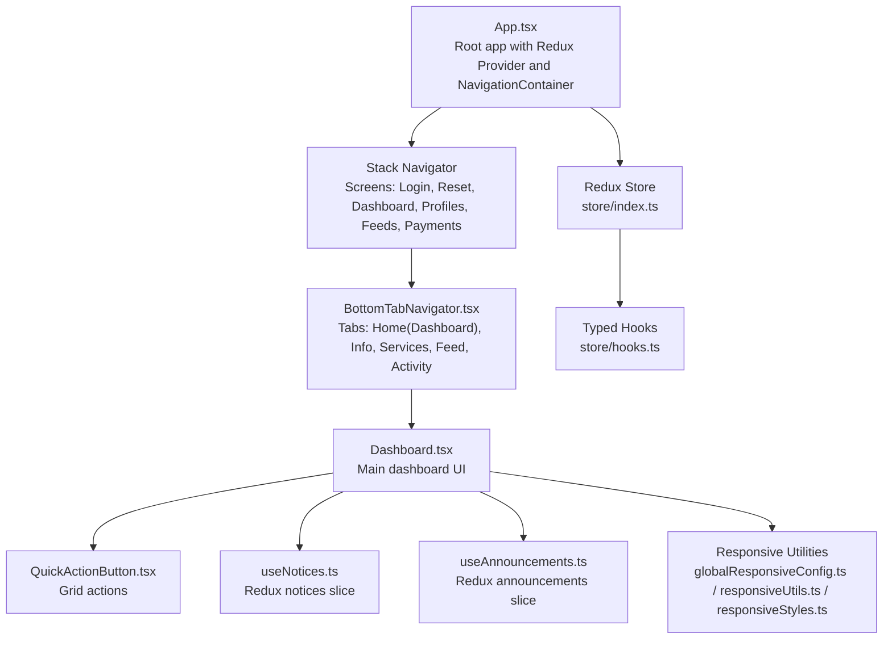
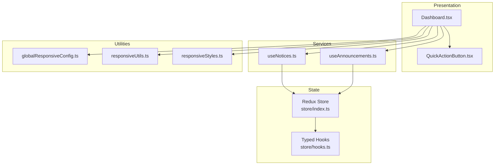
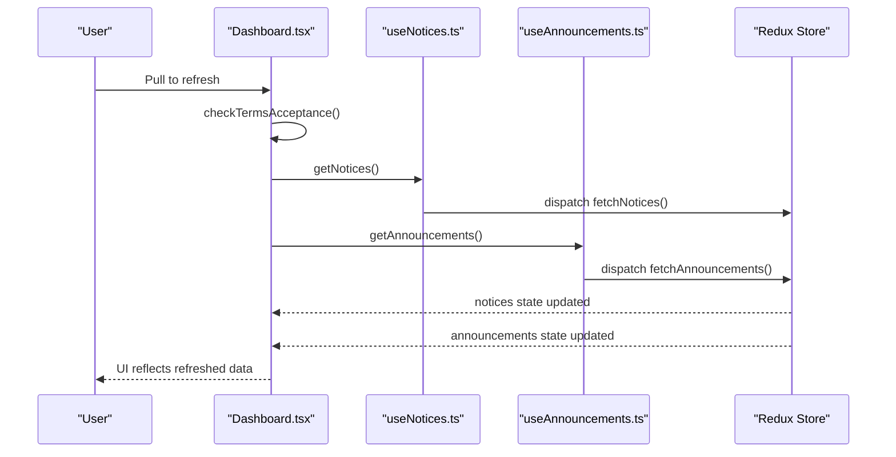
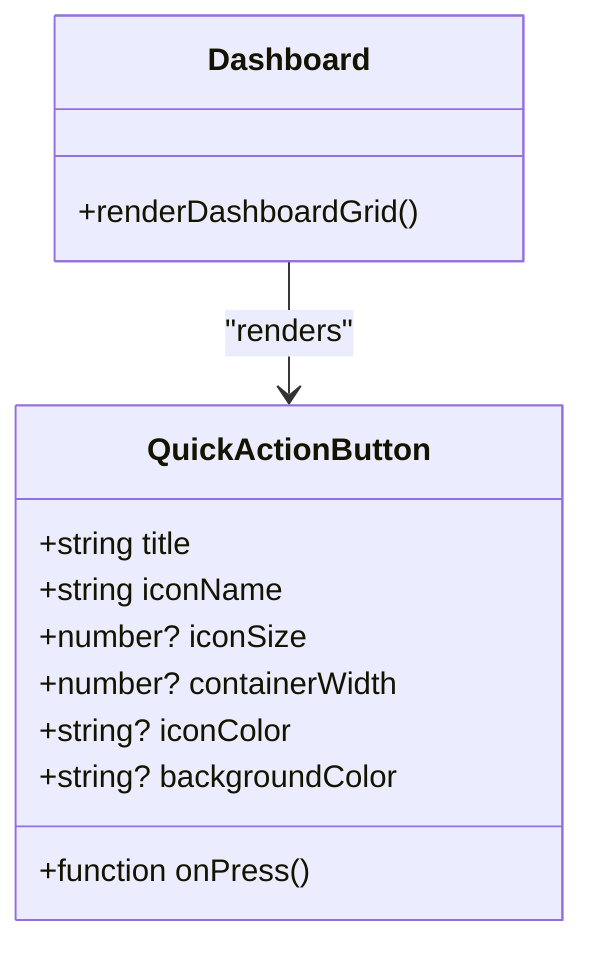
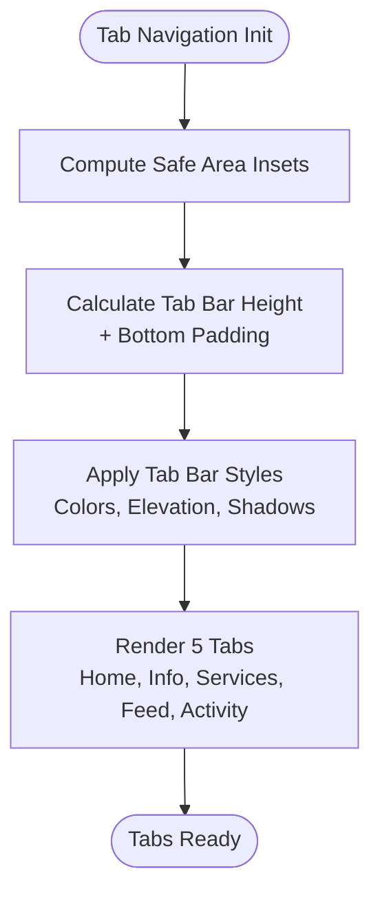
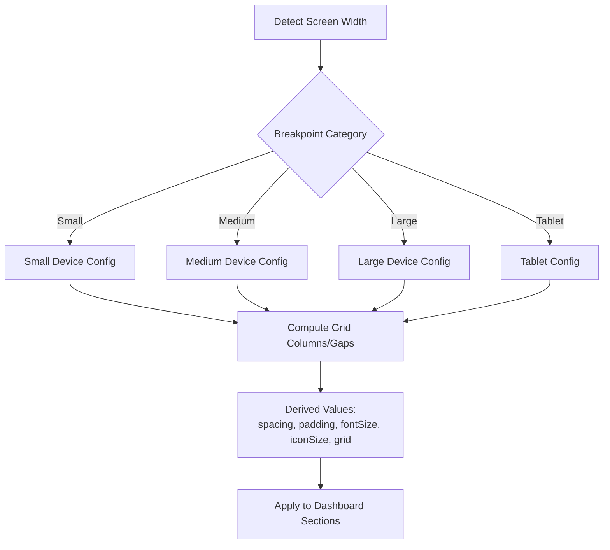
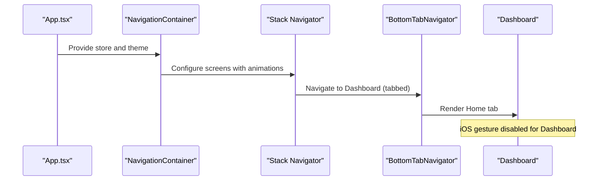
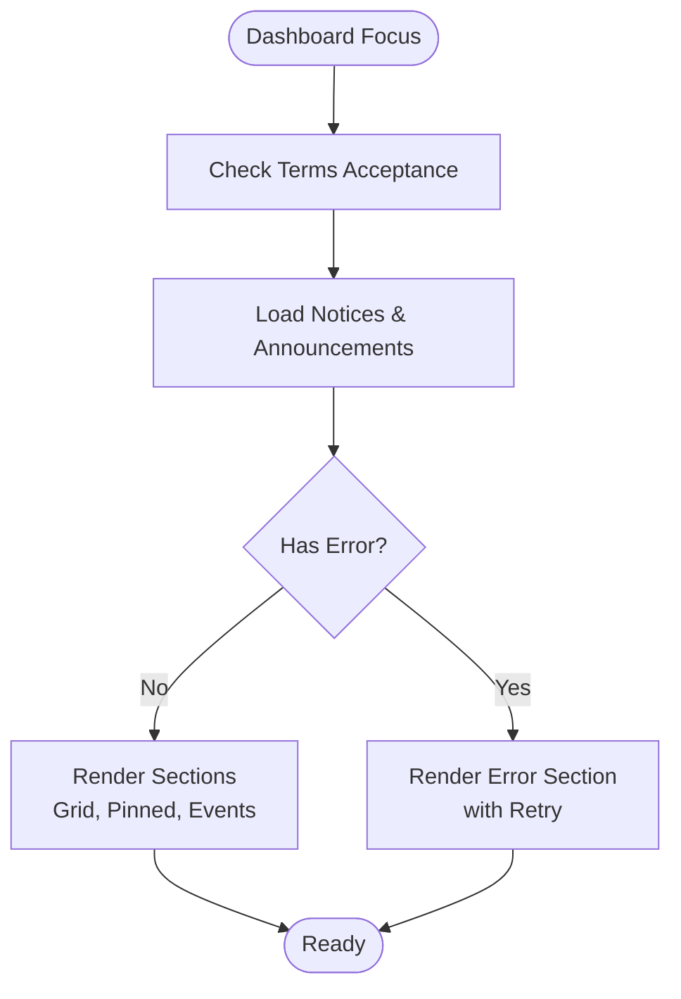
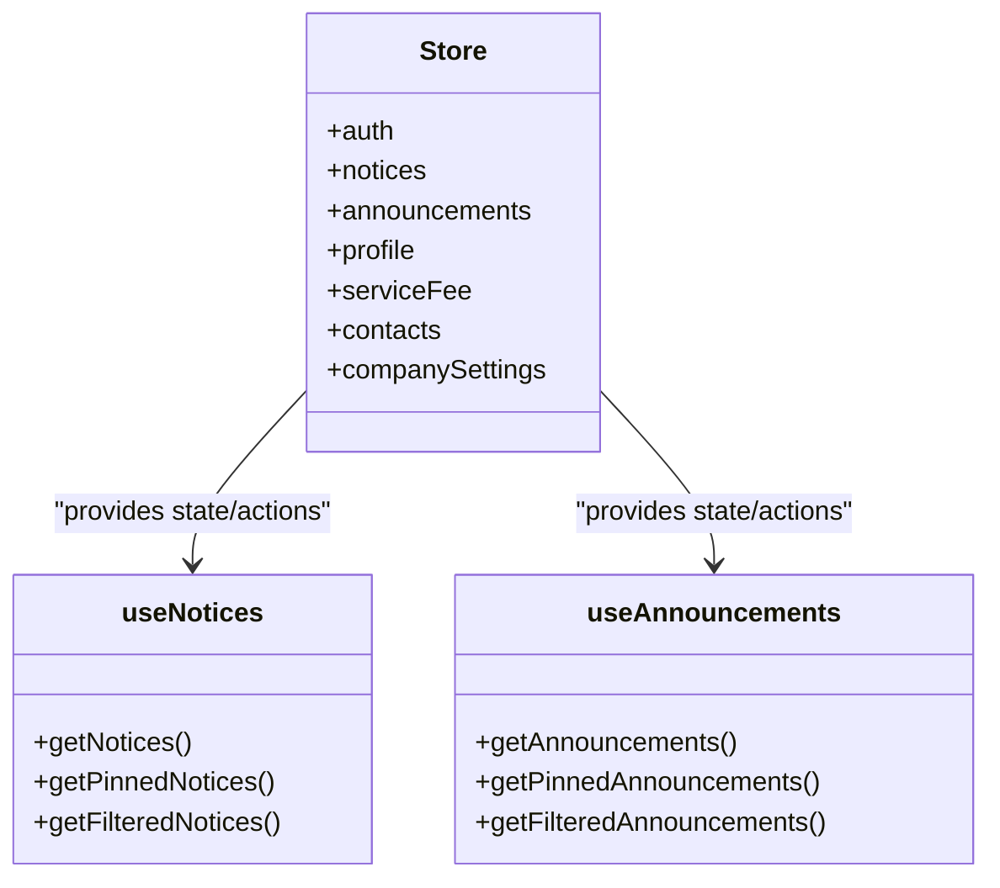
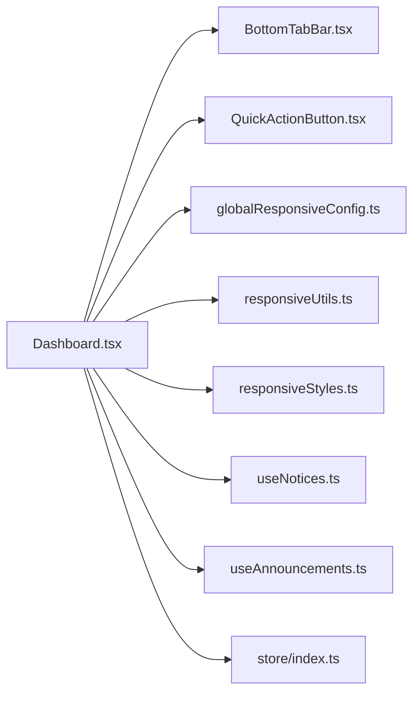

# Dashboard & Main Interface

<cite>
**Referenced Files in This Document**
- [App.tsx](file://Estate_link_App/App.tsx)
- [BottomTabBar.tsx](file://Estate_link_App/components/BottomTabBar.tsx)
- [Dashboard.tsx](file://Estate_link_App/src/Features/DashboardScreen/Dashboard.tsx)
- [QuickActionButton.tsx](file://Estate_link_App/src/components/QuickActionButton.tsx)
- [globalResponsiveConfig.ts](file://Estate_link_App/src/utils/globalResponsiveConfig.ts)
- [responsiveUtils.ts](file://Estate_link_App/src/utils/responsiveUtils.ts)
- [responsiveStyles.ts](file://Estate_link_App/src/utils/responsiveStyles.ts)
- [useNotices.ts](file://Estate_link_App/src/hooks/useNotices.ts)
- [useAnnouncements.ts](file://Estate_link_App/src/hooks/useAnnouncements.ts)
- [store/index.ts](file://Estate_link_App/src/store/index.ts)
- [store/hooks.ts](file://Estate_link_App/src/store/hooks.ts)
</cite>

## Table of Contents
1. [Introduction](#introduction)
2. [Project Structure](#project-structure)
3. [Core Components](#core-components)
4. [Architecture Overview](#architecture-overview)
5. [Detailed Component Analysis](#detailed-component-analysis)
6. [Dependency Analysis](#dependency-analysis)
7. [Performance Considerations](#performance-considerations)
8. [Troubleshooting Guide](#troubleshooting-guide)
9. [Conclusion](#conclusion)

## Introduction
This document explains the mobile dashboard interface and main application layout for the Estate Link project. It covers the dashboard component structure, quick action buttons, content organization patterns, responsive design, screen transitions, loading states, Redux state integration, real-time data updates, performance optimizations, mobile-specific UI patterns, touch interactions, accessibility considerations, testing strategies, component composition, and UX best practices tailored for mobile interfaces.

## Project Structure
The mobile application is structured around a bottom-tabbed main interface with the dashboard as the primary home screen. Navigation is managed via a native stack and bottom tab navigator, integrating Redux for state management and custom responsive utilities for adaptive layouts.

**Diagram sources**
- [App.tsx](file://Estate_link_App/App.tsx#L236-L414)
- [BottomTabBar.tsx](file://Estate_link_App/components/BottomTabBar.tsx#L15-L159)
- [Dashboard.tsx](file://Estate_link_App/src/Features/DashboardScreen/Dashboard.tsx#L51-L800)
- [QuickActionButton.tsx](file://Estate_link_App/src/components/QuickActionButton.tsx#L15-L55)
- [useNotices.ts](file://Estate_link_App/src/hooks/useNotices.ts#L24-L253)
- [useAnnouncements.ts](file://Estate_link_App/src/hooks/useAnnouncements.ts#L23-L247)
- [globalResponsiveConfig.ts](file://Estate_link_App/src/utils/globalResponsiveConfig.ts#L105-L180)
- [responsiveUtils.ts](file://Estate_link_App/src/utils/responsiveUtils.ts#L103-L128)
- [responsiveStyles.ts](file://Estate_link_App/src/utils/responsiveStyles.ts#L16-L270)
- [store/index.ts](file://Estate_link_App/src/store/index.ts#L1-L79)
- [store/hooks.ts](file://Estate_link_App/src/store/hooks.ts#L1-L6)

**Section sources**
- [App.tsx](file://Estate_link_App/App.tsx#L236-L414)
- [BottomTabBar.tsx](file://Estate_link_App/components/BottomTabBar.tsx#L15-L159)

## Core Components
- Dashboard screen orchestrates content sections, responsive layout, loading states, pull-to-refresh, and navigation.
- Quick action buttons provide primary navigation targets with consistent touch targets and visual feedback.
- Bottom tab navigator manages persistent header and tab bar layout with platform-safe insets and styling.
- Responsive utilities compute grid columns, spacing, paddings, font sizes, and icon sizes per device category.
- Redux store integrates auth, notices, announcements, profiles, and service fees with persistence and typed hooks.

**Section sources**
- [Dashboard.tsx](file://Estate_link_App/src/Features/DashboardScreen/Dashboard.tsx#L51-L800)
- [QuickActionButton.tsx](file://Estate_link_App/src/components/QuickActionButton.tsx#L15-L55)
- [BottomTabBar.tsx](file://Estate_link_App/components/BottomTabBar.tsx#L15-L159)
- [globalResponsiveConfig.ts](file://Estate_link_App/src/utils/globalResponsiveConfig.ts#L105-L180)
- [responsiveUtils.ts](file://Estate_link_App/src/utils/responsiveUtils.ts#L103-L128)
- [responsiveStyles.ts](file://Estate_link_App/src/utils/responsiveStyles.ts#L16-L270)
- [store/index.ts](file://Estate_link_App/src/store/index.ts#L1-L79)
- [store/hooks.ts](file://Estate_link_App/src/store/hooks.ts#L1-L6)

## Architecture Overview
The dashboard participates in a layered architecture:
- Presentation layer: Dashboard renders sections and handles user interactions.
- State layer: Redux slices manage notices and announcements; store is persisted for auth and company settings.
- Services layer: Hooks dispatch actions to fetch and mutate data.
- Utilities layer: Responsive utilities adapt UI to device characteristics.

**Diagram sources**
- [Dashboard.tsx](file://Estate_link_App/src/Features/DashboardScreen/Dashboard.tsx#L51-L800)
- [QuickActionButton.tsx](file://Estate_link_App/src/components/QuickActionButton.tsx#L15-L55)
- [useNotices.ts](file://Estate_link_App/src/hooks/useNotices.ts#L24-L253)
- [useAnnouncements.ts](file://Estate_link_App/src/hooks/useAnnouncements.ts#L23-L247)
- [globalResponsiveConfig.ts](file://Estate_link_App/src/utils/globalResponsiveConfig.ts#L105-L180)
- [responsiveUtils.ts](file://Estate_link_App/src/utils/responsiveUtils.ts#L103-L128)
- [responsiveStyles.ts](file://Estate_link_App/src/utils/responsiveStyles.ts#L16-L270)
- [store/index.ts](file://Estate_link_App/src/store/index.ts#L1-L79)
- [store/hooks.ts](file://Estate_link_App/src/store/hooks.ts#L1-L6)

## Detailed Component Analysis

### Dashboard Component
The dashboard composes:
- A virtualized list of sections to optimize rendering and scrolling performance.
- A responsive grid of quick action buttons sized and spaced according to device type.
- Sections for pinned announcements, recent notices, and upcoming events.
- Pull-to-refresh with term acceptance checks and targeted data refresh.
- Back button blocking logic to prevent navigation to authentication screens.
- Highlighted notice support when navigating from push notifications.

Key implementation highlights:
- Virtualized sections: [Dashboard.tsx](file://Estate_link_App/src/Features/DashboardScreen/Dashboard.tsx#L490-L525)
- Quick action grid rendering: [Dashboard.tsx](file://Estate_link_App/src/Features/DashboardScreen/Dashboard.tsx#L527-L572)
- Pinned announcements carousel: [Dashboard.tsx](file://Estate_link_App/src/Features/DashboardScreen/Dashboard.tsx#L636-L720)
- Upcoming events carousel: [Dashboard.tsx](file://Estate_link_App/src/Features/DashboardScreen/Dashboard.tsx#L722-L778)
- Refresh control and data refresh: [Dashboard.tsx](file://Estate_link_App/src/Features/DashboardScreen/Dashboard.tsx#L328-L354)
- Back navigation guard: [Dashboard.tsx](file://Estate_link_App/src/Features/DashboardScreen/Dashboard.tsx#L196-L252)
- Push notification route param handling: [Dashboard.tsx](file://Estate_link_App/src/Features/DashboardScreen/Dashboard.tsx#L125-L149)

**Diagram sources**
- [Dashboard.tsx](file://Estate_link_App/src/Features/DashboardScreen/Dashboard.tsx#L328-L354)
- [useNotices.ts](file://Estate_link_App/src/hooks/useNotices.ts#L36-L42)
- [useAnnouncements.ts](file://Estate_link_App/src/hooks/useAnnouncements.ts#L35-L41)
- [store/index.ts](file://Estate_link_App/src/store/index.ts#L1-L79)

**Section sources**
- [Dashboard.tsx](file://Estate_link_App/src/Features/DashboardScreen/Dashboard.tsx#L51-L800)
- [useNotices.ts](file://Estate_link_App/src/hooks/useNotices.ts#L24-L253)
- [useAnnouncements.ts](file://Estate_link_App/src/hooks/useAnnouncements.ts#L23-L247)

### Quick Action Buttons
The quick action button component provides:
- Consistent icon sizing and background styling.
- Touch feedback with ripple effect.
- Centered label with single-line truncation.
- Configurable icon size, container width, and colors.

Usage in dashboard:
- Grid of quick actions mapped to navigation destinations.
- Dynamic item width computed from responsive configuration.

**Diagram sources**
- [QuickActionButton.tsx](file://Estate_link_App/src/components/QuickActionButton.tsx#L5-L23)
- [Dashboard.tsx](file://Estate_link_App/src/Features/DashboardScreen/Dashboard.tsx#L527-L572)

**Section sources**
- [QuickActionButton.tsx](file://Estate_link_App/src/components/QuickActionButton.tsx#L15-L55)
- [Dashboard.tsx](file://Estate_link_App/src/Features/DashboardScreen/Dashboard.tsx#L527-L572)

### Bottom Tab Bar
The bottom tab navigator:
- Wraps the dashboard within a shared header and tab bar.
- Computes tab bar height and padding based on safe area insets and platform specifics.
- Provides icons and labels for five tabs: Home, Info, Services, Feed, Activity.

**Diagram sources**
- [BottomTabBar.tsx](file://Estate_link_App/components/BottomTabBar.tsx#L15-L159)

**Section sources**
- [BottomTabBar.tsx](file://Estate_link_App/components/BottomTabBar.tsx#L15-L159)

### Responsive Design Implementation
Responsive utilities compute:
- Device type and breakpoints.
- Grid columns, gaps, and item widths.
- Spacing, paddings, font sizes, and icon sizes.
- Helpers for single-line text, modal dimensions, and control button sizes.

Dashboard leverages:
- Column count and item width for the action grid.
- Container padding and spacing for consistent gutters.
- Icon and font sizes for readability across devices.

**Diagram sources**
- [globalResponsiveConfig.ts](file://Estate_link_App/src/utils/globalResponsiveConfig.ts#L105-L180)
- [responsiveUtils.ts](file://Estate_link_App/src/utils/responsiveUtils.ts#L103-L128)
- [responsiveStyles.ts](file://Estate_link_App/src/utils/responsiveStyles.ts#L16-L270)
- [Dashboard.tsx](file://Estate_link_App/src/Features/DashboardScreen/Dashboard.tsx#L169-L194)

**Section sources**
- [globalResponsiveConfig.ts](file://Estate_link_App/src/utils/globalResponsiveConfig.ts#L105-L180)
- [responsiveUtils.ts](file://Estate_link_App/src/utils/responsiveUtils.ts#L103-L128)
- [responsiveStyles.ts](file://Estate_link_App/src/utils/responsiveStyles.ts#L16-L270)
- [Dashboard.tsx](file://Estate_link_App/src/Features/DashboardScreen/Dashboard.tsx#L169-L194)

### Screen Transitions and Navigation
- Root app wraps the entire app with Redux provider and navigation container.
- Stack navigator defines screens and animations; the Dashboard is embedded inside the bottom tab navigator.
- iOS-specific gesture controls are disabled on the Dashboard to prevent accidental navigation back to login.

**Diagram sources**
- [App.tsx](file://Estate_link_App/App.tsx#L236-L414)
- [BottomTabBar.tsx](file://Estate_link_App/components/BottomTabBar.tsx#L15-L159)
- [Dashboard.tsx](file://Estate_link_App/src/Features/DashboardScreen/Dashboard.tsx#L151-L167)

**Section sources**
- [App.tsx](file://Estate_link_App/App.tsx#L236-L414)
- [BottomTabBar.tsx](file://Estate_link_App/components/BottomTabBar.tsx#L15-L159)
- [Dashboard.tsx](file://Estate_link_App/src/Features/DashboardScreen/Dashboard.tsx#L151-L167)

### Loading States and Error Handling
- Dashboard displays skeleton loaders and activity indicators conditionally based on loading states and initial load flags.
- Dedicated error sections render for notices and announcements with retry actions.
- Terms acceptance is checked on focus to gate navigation to privacy screens.

**Diagram sources**
- [Dashboard.tsx](file://Estate_link_App/src/Features/DashboardScreen/Dashboard.tsx#L62-L102)
- [Dashboard.tsx](file://Estate_link_App/src/Features/DashboardScreen/Dashboard.tsx#L112-L123)
- [Dashboard.tsx](file://Estate_link_App/src/Features/DashboardScreen/Dashboard.tsx#L574-L622)

**Section sources**
- [Dashboard.tsx](file://Estate_link_App/src/Features/DashboardScreen/Dashboard.tsx#L62-L102)
- [Dashboard.tsx](file://Estate_link_App/src/Features/DashboardScreen/Dashboard.tsx#L574-L622)

### Redux State Management and Real-Time Updates
- Store combines reducers for auth, notices, announcements, profiles, service fees, contacts, and company settings.
- Persistence configured for auth and company settings; serializable checks tuned for async thunks.
- Typed hooks simplify dispatch and selector usage.
- Hooks encapsulate actions for notices and announcements, exposing computed getters and filters.

**Diagram sources**
- [store/index.ts](file://Estate_link_App/src/store/index.ts#L23-L33)
- [useNotices.ts](file://Estate_link_App/src/hooks/useNotices.ts#L24-L253)
- [useAnnouncements.ts](file://Estate_link_App/src/hooks/useAnnouncements.ts#L23-L247)

**Section sources**
- [store/index.ts](file://Estate_link_App/src/store/index.ts#L1-L79)
- [store/hooks.ts](file://Estate_link_App/src/store/hooks.ts#L1-L6)
- [useNotices.ts](file://Estate_link_App/src/hooks/useNotices.ts#L24-L253)
- [useAnnouncements.ts](file://Estate_link_App/src/hooks/useAnnouncements.ts#L23-L247)

### Mobile-Specific UI Patterns and Accessibility
- Touch targets: Control button sizes enforce minimum touch target thresholds across device categories.
- Single-line text: Ensures concise labels for quick actions and cards.
- Safe areas: Tab bar adapts to system bars and platform differences.
- Typography: Font scaling and line heights optimized for readability.
- Icons: Consistent sizing and color contrast for actionable items.

**Section sources**
- [responsiveUtils.ts](file://Estate_link_App/src/utils/responsiveUtils.ts#L309-L338)
- [responsiveUtils.ts](file://Estate_link_App/src/utils/responsiveUtils.ts#L200-L211)
- [BottomTabBar.tsx](file://Estate_link_App/components/BottomTabBar.tsx#L18-L43)
- [responsiveStyles.ts](file://Estate_link_App/src/utils/responsiveStyles.ts#L76-L112)

### Testing Strategies
- Dashboard test suites include basic, integration, performance, pure, simple, standalone, and working tests.
- Tests validate rendering, navigation, refresh behavior, and responsive layout under various conditions.
- Recommended approach: isolate hooks, mock Redux slices, and simulate user interactions (pull-to-refresh, tapping quick actions).

Note: Specific test files are located under the dashboard test directory and can be reviewed for assertion patterns and coverage.

**Section sources**
- [Dashboard.tsx](file://Estate_link_App/src/Features/DashboardScreen/Dashboard.tsx#L51-L800)

## Dependency Analysis
The dashboard depends on:
- Navigation and tab infrastructure for routing and transitions.
- Responsive utilities for layout calculations.
- Redux hooks for data fetching and state updates.
- Quick action component for interactive tiles.

**Diagram sources**
- [Dashboard.tsx](file://Estate_link_App/src/Features/DashboardScreen/Dashboard.tsx#L51-L800)
- [BottomTabBar.tsx](file://Estate_link_App/components/BottomTabBar.tsx#L15-L159)
- [QuickActionButton.tsx](file://Estate_link_App/src/components/QuickActionButton.tsx#L15-L55)
- [globalResponsiveConfig.ts](file://Estate_link_App/src/utils/globalResponsiveConfig.ts#L105-L180)
- [responsiveUtils.ts](file://Estate_link_App/src/utils/responsiveUtils.ts#L103-L128)
- [responsiveStyles.ts](file://Estate_link_App/src/utils/responsiveStyles.ts#L16-L270)
- [useNotices.ts](file://Estate_link_App/src/hooks/useNotices.ts#L24-L253)
- [useAnnouncements.ts](file://Estate_link_App/src/hooks/useAnnouncements.ts#L23-L247)
- [store/index.ts](file://Estate_link_App/src/store/index.ts#L1-L79)

**Section sources**
- [Dashboard.tsx](file://Estate_link_App/src/Features/DashboardScreen/Dashboard.tsx#L51-L800)
- [BottomTabBar.tsx](file://Estate_link_App/components/BottomTabBar.tsx#L15-L159)
- [QuickActionButton.tsx](file://Estate_link_App/src/components/QuickActionButton.tsx#L15-L55)
- [globalResponsiveConfig.ts](file://Estate_link_App/src/utils/globalResponsiveConfig.ts#L105-L180)
- [responsiveUtils.ts](file://Estate_link_App/src/utils/responsiveUtils.ts#L103-L128)
- [responsiveStyles.ts](file://Estate_link_App/src/utils/responsiveStyles.ts#L16-L270)
- [useNotices.ts](file://Estate_link_App/src/hooks/useNotices.ts#L24-L253)
- [useAnnouncements.ts](file://Estate_link_App/src/hooks/useAnnouncements.ts#L23-L247)
- [store/index.ts](file://Estate_link_App/src/store/index.ts#L1-L79)

## Performance Considerations
- Virtualized sections minimize re-renders and memory usage on scroll-heavy dashboards.
- Memoization of pinned announcements avoids unnecessary recomputation.
- Conditional loading indicators only appear on first-load empty states.
- Persistent store reduces redundant network requests across sessions.
- Responsive calculations are derived once per layout pass to avoid repeated computations.

[No sources needed since this section provides general guidance]

## Troubleshooting Guide
Common issues and remedies:
- Permission errors on notices/announcements: Dashboard surfaces error sections with retry actions; verify backend permissions and token validity.
- Terms acceptance gating: On focus, dashboard checks acceptance and navigates to privacy screen if not accepted.
- Back navigation blocking: Hardware back button is blocked when appropriate to prevent exiting the app into authentication screens.
- iOS gesture conflicts: Gesture-enabled option is disabled for the Dashboard to avoid accidental navigation.

**Section sources**
- [Dashboard.tsx](file://Estate_link_App/src/Features/DashboardScreen/Dashboard.tsx#L574-L622)
- [Dashboard.tsx](file://Estate_link_App/src/Features/DashboardScreen/Dashboard.tsx#L62-L102)
- [Dashboard.tsx](file://Estate_link_App/src/Features/DashboardScreen/Dashboard.tsx#L196-L252)
- [Dashboard.tsx](file://Estate_link_App/src/Features/DashboardScreen/Dashboard.tsx#L151-L167)

## Conclusion
The dashboard integrates a responsive, performant, and accessible mobile interface with robust navigation, state management, and data handling. Its modular structure supports maintainability and scalability, while responsive utilities and Redux ensure consistent behavior across devices and sessions. The included testing strategies and troubleshooting guidance facilitate reliable development and deployment.