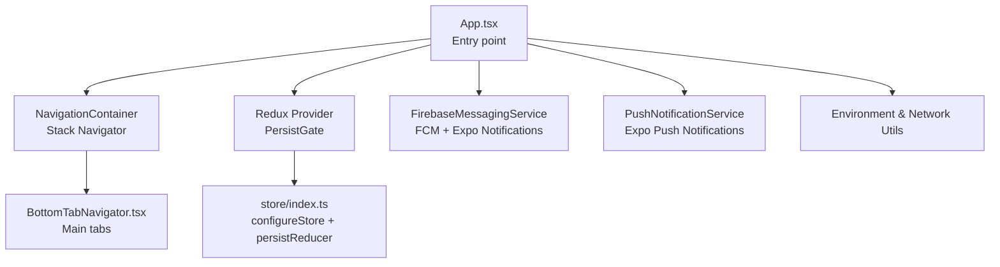
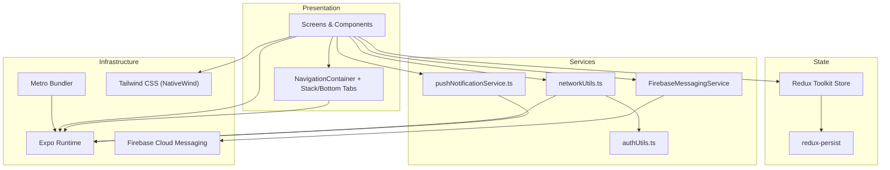
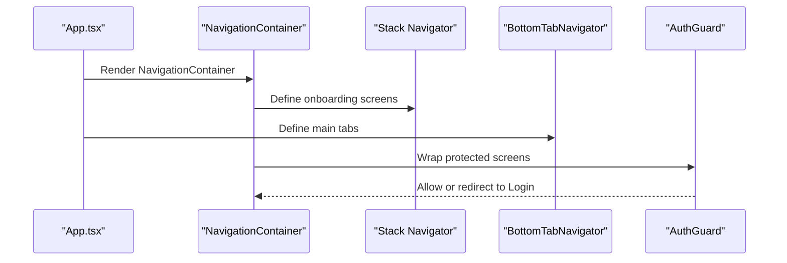
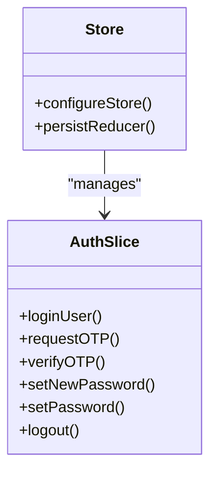
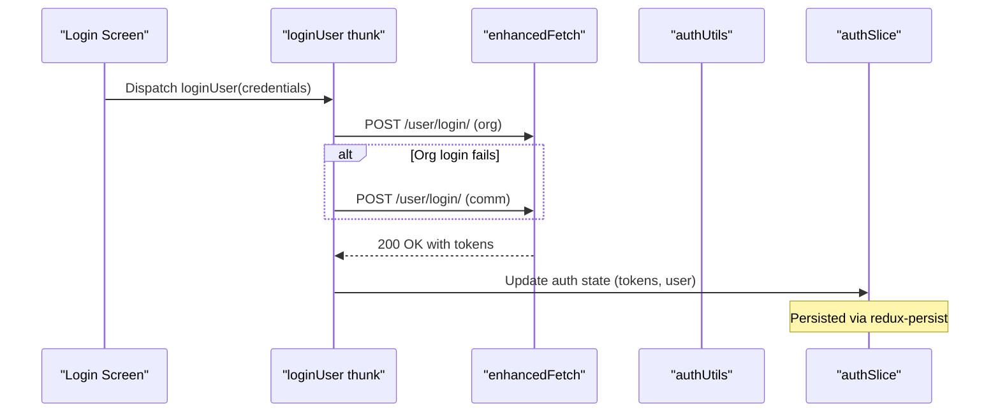
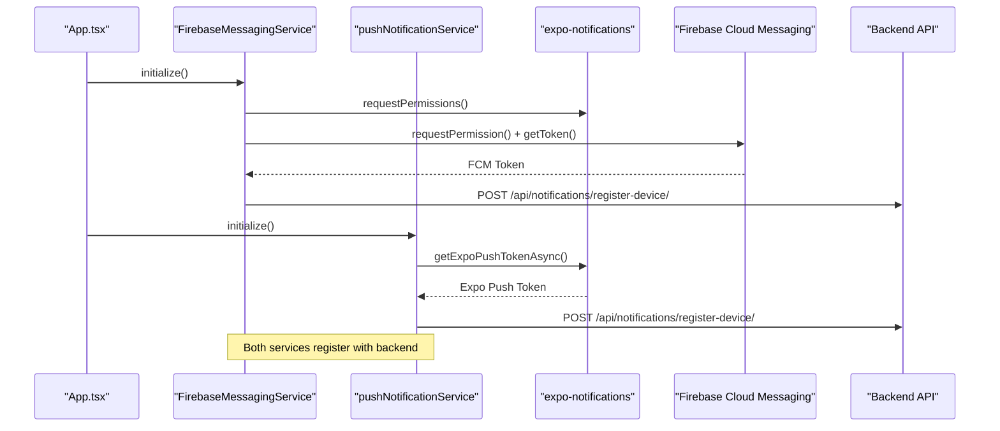
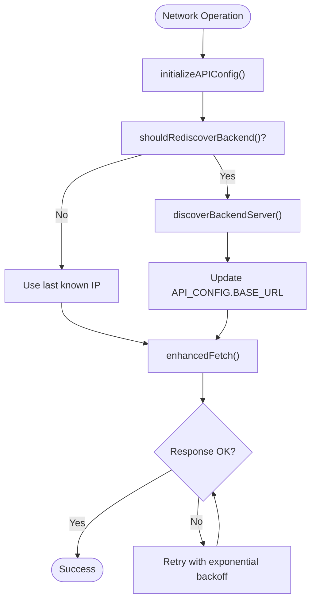
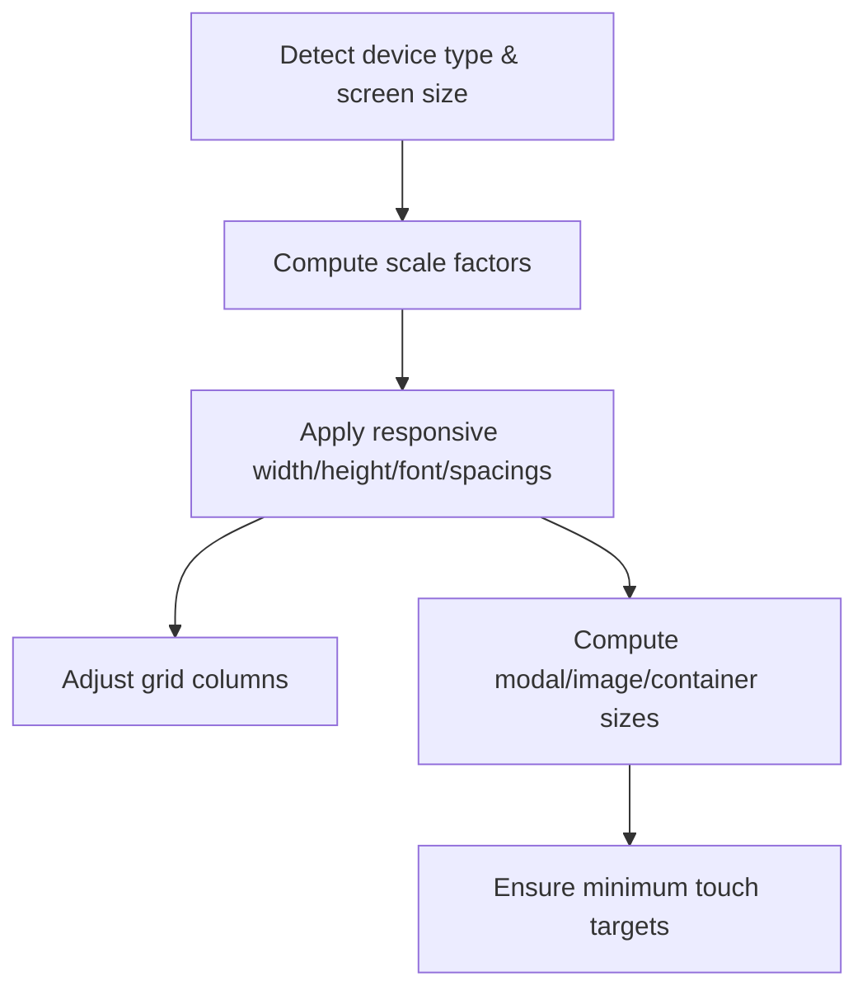
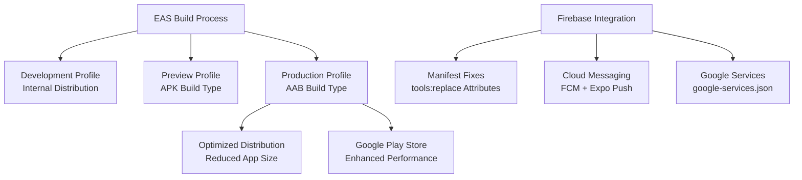
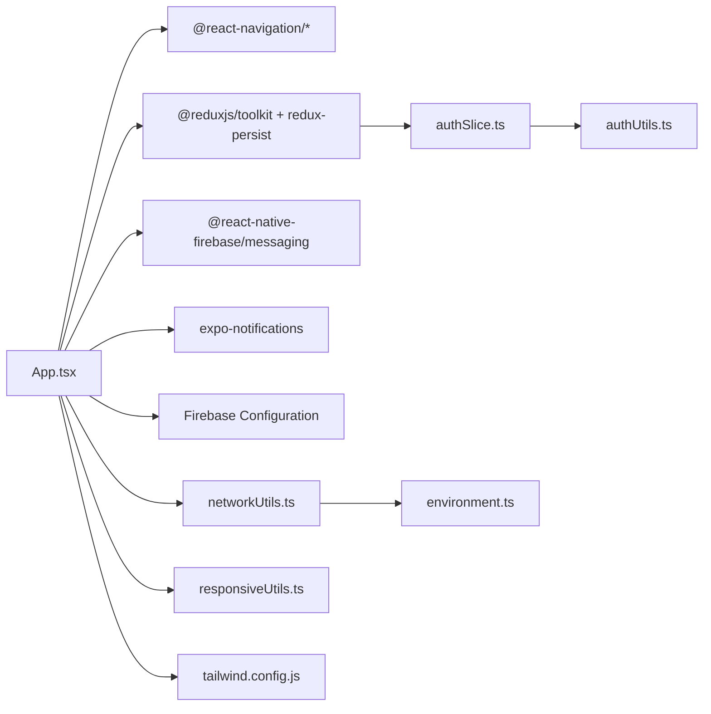

# Mobile Application

<cite>
**Referenced Files in This Document**
- [App.tsx](file://Estate_link_App/App.tsx)
- [app.json](file://Estate_link_App/app.json)
- [package.json](file://Estate_link_App/package.json)
- [eas.json](file://Estate_link_App/eas.json)
- [google-services.json](file://Estate_link_App/google-services.json)
- [withFirebaseManifestFix.js](file://Estate_link_App/plugins/withFirebaseManifestFix.js)
- [firebaseMessagingService.ts](file://Estate_link_App/src/services/firebaseMessagingService.ts)
- [pushNotificationService.ts](file://Estate_link_App/src/services/pushNotificationService.ts)
- [FIX_BUILD_ISSUES.md](file://Estate_link_App/FIX_BUILD_ISSUES.md)
- [FIX_GRADLE_BUILD.md](file://Estate_link_App/FIX_GRADLE_BUILD.md)
- [FIX_MIN_SDK_ERROR.md](file://Estate_link_App/FIX_MIN_SDK_ERROR.md)
- [metro.config.js](file://Estate_link_App/metro.config.js)
- [environment.ts](file://Estate_link_App/src/config/environment.ts)
- [index.ts](file://Estate_link_App/src/store/index.ts)
- [authSlice.ts](file://Estate_link_App/src/store/slices/authSlice.ts)
- [BottomTabBar.tsx](file://Estate_link_App/components/BottomTabBar.tsx)
- [AuthGuard.tsx](file://Estate_link_App/src/components/AuthGuard.tsx)
- [responsiveUtils.ts](file://Estate_link_App/src/utils/responsiveUtils.ts)
- [networkUtils.ts](file://Estate_link_App/src/utils/networkUtils.ts)
- [authUtils.ts](file://Estate_link_App/src/utils/authUtils.ts)
- [tailwind.config.js](file://Estate_link_App/tailwind.config.js)
</cite>

## Update Summary
**Changes Made**
- Updated Build Configuration section to reflect Android build system modernization from APK to AAB format
- Added new Firebase Messaging Service integration documentation
- Updated Push Notification Integration section to cover dual notification systems
- Enhanced Build Configuration and Deployment section with Firebase manifest fixes
- Added troubleshooting guidance for Firebase and Android build issues

## Table of Contents
1. [Introduction](#introduction)
2. [Project Structure](#project-structure)
3. [Core Components](#core-components)
4. [Architecture Overview](#architecture-overview)
5. [Detailed Component Analysis](#detailed-component-analysis)
6. [Dependency Analysis](#dependency-analysis)
7. [Performance Considerations](#performance-considerations)
8. [Troubleshooting Guide](#troubleshooting-guide)
9. [Conclusion](#conclusion)
10. [Appendices](#appendices)

## Introduction
This document describes the React Native mobile application for the EstateLink platform. It focuses on the mobile-first design approach, navigation structure, cross-platform compatibility, component architecture, Redux Toolkit state management, offline resilience, authentication flow, push notification integration, device-specific features, responsive design patterns, touch interactions, mobile UX best practices, build configuration for iOS and Android, deployment processes, and performance optimization tailored for mobile devices.

**Updated** The application now features a modernized Android build system using AAB (Android App Bundle) format for optimized distribution, enhanced Firebase messaging integration, and comprehensive build configuration improvements including manifest fixes for Firebase compatibility.

## Project Structure
The application is organized around a React Native + Expo architecture with TypeScript, Tailwind CSS via NativeWind, Redux Toolkit for state management, and a modular feature-based component layout. Key areas:
- Entry point initializes providers, navigation, fonts, splash screen, and push notifications.
- Navigation uses a stack navigator for onboarding and screens, and a bottom tab navigator for the main app.
- State management is centralized with Redux Toolkit and persisted for selected slices.
- Utilities provide responsive scaling, network handling, authentication helpers, and environment configuration.
- Build configuration integrates EAS Build, Expo plugins, and platform-specific settings with modern Android AAB distribution.

**Diagram sources**
- [App.tsx](file://Estate_link_App/App.tsx#L118-L414)
- [BottomTabBar.tsx](file://Estate_link_App/components/BottomTabBar.tsx#L15-L163)
- [index.ts](file://Estate_link_App/src/store/index.ts#L1-L79)
- [firebaseMessagingService.ts](file://Estate_link_App/src/services/firebaseMessagingService.ts#L1-L251)
- [pushNotificationService.ts](file://Estate_link_App/src/services/pushNotificationService.ts#L1-L364)

**Section sources**
- [App.tsx](file://Estate_link_App/App.tsx#L1-L415)
- [package.json](file://Estate_link_App/package.json#L1-L101)
- [app.json](file://Estate_link_App/app.json#L1-L74)
- [eas.json](file://Estate_link_App/eas.json#L1-L29)
- [metro.config.js](file://Estate_link_App/metro.config.js#L1-L33)

## Core Components
- App entry and providers: Initializes Redux, persistence, navigation, fonts, splash screen, and push notifications.
- Bottom tab navigator: Implements a mobile-first tab bar with safe area awareness and responsive sizing.
- Auth guard: Protects routes by enforcing authentication state.
- Redux store: Centralizes state with persisted slices for auth and company settings.
- Firebase messaging service: Handles Firebase Cloud Messaging (FCM) with dual notification system support.
- Push notification service: Legacy Expo push notification service for backward compatibility.
- Responsive utilities: Provide scalable dimensions, typography, spacing, and grid layouts across device sizes.
- Network utilities: Dynamic backend discovery, connectivity checks, token refresh, and enhanced fetch with retries.

**Updated** The core components now include Firebase messaging service alongside the existing push notification service, providing dual notification system support for better compatibility and reliability.

**Section sources**
- [App.tsx](file://Estate_link_App/App.tsx#L118-L414)
- [BottomTabBar.tsx](file://Estate_link_App/components/BottomTabBar.tsx#L15-L163)
- [AuthGuard.tsx](file://Estate_link_App/src/components/AuthGuard.tsx#L1-L42)
- [index.ts](file://Estate_link_App/src/store/index.ts#L1-L79)
- [firebaseMessagingService.ts](file://Estate_link_App/src/services/firebaseMessagingService.ts#L1-L251)
- [pushNotificationService.ts](file://Estate_link_App/src/services/pushNotificationService.ts#L1-L364)
- [responsiveUtils.ts](file://Estate_link_App/src/utils/responsiveUtils.ts#L1-L492)
- [networkUtils.ts](file://Estate_link_App/src/utils/networkUtils.ts#L1-L511)

## Architecture Overview
The app follows a layered architecture with enhanced Firebase integration:
- Presentation layer: React Native components and navigators.
- State layer: Redux slices and persisted state.
- Services layer: Firebase messaging, push notifications, network utilities, and environment configuration.
- Infrastructure: Expo runtime, Metro bundler, and NativeWind for styling.

**Updated** The architecture now includes Firebase Cloud Messaging integration alongside the existing Expo push notification service, providing a comprehensive notification solution.

**Diagram sources**
- [App.tsx](file://Estate_link_App/App.tsx#L118-L414)
- [index.ts](file://Estate_link_App/src/store/index.ts#L1-L79)
- [networkUtils.ts](file://Estate_link_App/src/utils/networkUtils.ts#L1-L511)
- [authUtils.ts](file://Estate_link_App/src/utils/authUtils.ts#L1-L219)
- [firebaseMessagingService.ts](file://Estate_link_App/src/services/firebaseMessagingService.ts#L1-L251)
- [pushNotificationService.ts](file://Estate_link_App/src/services/pushNotificationService.ts#L1-L364)
- [tailwind.config.js](file://Estate_link_App/tailwind.config.js#L1-L82)

## Detailed Component Analysis

### Navigation and Routing
- Stack navigator manages onboarding and screen transitions with slide animations and frozen screens for performance.
- Bottom tab navigator centralizes main app navigation with icons, labels, and responsive styling.
- Auth guard wraps protected screens to enforce authentication and redirect to login when needed.

**Diagram sources**
- [App.tsx](file://Estate_link_App/App.tsx#L242-L414)
- [BottomTabBar.tsx](file://Estate_link_App/components/BottomTabBar.tsx#L15-L163)
- [AuthGuard.tsx](file://Estate_link_App/src/components/AuthGuard.tsx#L10-L41)

**Section sources**
- [App.tsx](file://Estate_link_App/App.tsx#L242-L414)
- [BottomTabBar.tsx](file://Estate_link_App/components/BottomTabBar.tsx#L15-L163)
- [AuthGuard.tsx](file://Estate_link_App/src/components/AuthGuard.tsx#L1-L42)

### State Management with Redux Toolkit
- Store configuration combines reducers and persists selected slices (auth, companySettings).
- Middleware ignores non-serializable actions and paths to avoid warnings.
- Auth slice encapsulates login, OTP, password reset, and user data updates with async thunks and optimistic updates.

**Diagram sources**
- [index.ts](file://Estate_link_App/src/store/index.ts#L1-L79)
- [authSlice.ts](file://Estate_link_App/src/store/slices/authSlice.ts#L1-L564)

**Section sources**
- [index.ts](file://Estate_link_App/src/store/index.ts#L1-L79)
- [authSlice.ts](file://Estate_link_App/src/store/slices/authSlice.ts#L1-L564)

### Authentication Flow
- Multi-step process: user status check, OTP request/verification, password reset, and login with dual login types (org/comm).
- Token refresh mechanism handles 401 responses by refreshing tokens and retrying requests.
- Auth guard ensures protected routes are only accessible when authenticated.

**Diagram sources**
- [authSlice.ts](file://Estate_link_App/src/store/slices/authSlice.ts#L200-L289)
- [networkUtils.ts](file://Estate_link_App/src/utils/networkUtils.ts#L382-L508)
- [authUtils.ts](file://Estate_link_App/src/utils/authUtils.ts#L1-L219)

**Section sources**
- [authSlice.ts](file://Estate_link_App/src/store/slices/authSlice.ts#L1-L564)
- [networkUtils.ts](file://Estate_link_App/src/utils/networkUtils.ts#L314-L508)
- [authUtils.ts](file://Estate_link_App/src/utils/authUtils.ts#L1-L219)
- [AuthGuard.tsx](file://Estate_link_App/src/components/AuthGuard.tsx#L1-L42)

### Push Notification Integration
**Updated** The application now features a dual notification system supporting both Firebase Cloud Messaging (FCM) and Expo push notifications for maximum compatibility and reliability.

#### Firebase Cloud Messaging (FCM) Integration
- Uses @react-native-firebase/messaging for native FCM support.
- Requests notification permissions and obtains FCM tokens.
- Registers tokens with backend for reliable delivery.
- Handles foreground, background, and notification tap events.
- Creates Android notification channels for optimal user experience.

#### Legacy Expo Push Notification Service
- Maintains backward compatibility with existing Expo push notification system.
- Handles Expo push tokens and device registration.
- Provides unified notification handling interface.

**Diagram sources**
- [firebaseMessagingService.ts](file://Estate_link_App/src/services/firebaseMessagingService.ts#L84-L139)
- [pushNotificationService.ts](file://Estate_link_App/src/services/pushNotificationService.ts#L161-L176)
- [App.tsx](file://Estate_link_App/App.tsx#L147-L153)

**Section sources**
- [firebaseMessagingService.ts](file://Estate_link_App/src/services/firebaseMessagingService.ts#L1-L251)
- [pushNotificationService.ts](file://Estate_link_App/src/services/pushNotificationService.ts#L1-L364)
- [App.tsx](file://Estate_link_App/App.tsx#L147-L153)

### Offline Capabilities and Network Resilience
- Dynamic backend discovery scans common IPs and subnets to locate the backend server.
- Connectivity checks fall back to external endpoints when internal server is unreachable.
- Enhanced fetch supports retries, timeouts, and token refresh on 401 responses.
- Network status tracking helps decide when to re-discover backend.

**Diagram sources**
- [networkUtils.ts](file://Estate_link_App/src/utils/networkUtils.ts#L272-L312)
- [networkUtils.ts](file://Estate_link_App/src/utils/networkUtils.ts#L13-L155)
- [networkUtils.ts](file://Estate_link_App/src/utils/networkUtils.ts#L382-L508)

**Section sources**
- [networkUtils.ts](file://Estate_link_App/src/utils/networkUtils.ts#L1-L511)
- [environment.ts](file://Estate_link_App/src/config/environment.ts#L1-L84)

### Responsive Design Patterns and Touch Interactions
- Responsive utilities compute device type, screen size, and scale factors for width, height, font size, spacing, and icon sizes.
- Grid columns adapt to screen size; modal and image containers adjust proportionally.
- Touch targets meet accessibility guidelines; minimum sizes enforced across device categories.

**Diagram sources**
- [responsiveUtils.ts](file://Estate_link_App/src/utils/responsiveUtils.ts#L14-L185)
- [responsiveUtils.ts](file://Estate_link_App/src/utils/responsiveUtils.ts#L214-L440)

**Section sources**
- [responsiveUtils.ts](file://Estate_link_App/src/utils/responsiveUtils.ts#L1-L492)

### Cross-Platform Compatibility
- Expo SDK 54 runtime provides unified APIs for iOS and Android.
- Platform-specific handling for safe area insets, tab bar height, and Android notification channels.
- Metro aliases and NativeWind enable consistent styling across platforms.

**Section sources**
- [app.json](file://Estate_link_App/app.json#L1-L74)
- [BottomTabBar.tsx](file://Estate_link_App/components/BottomTabBar.tsx#L18-L43)
- [metro.config.js](file://Estate_link_App/metro.config.js#L23-L32)
- [tailwind.config.js](file://Estate_link_App/tailwind.config.js#L1-L82)

### Build Configuration and Deployment
**Updated** The build configuration has been modernized with Android App Bundle (AAB) format for optimized distribution and comprehensive Firebase integration.

#### Android Build System Modernization
- **AAB Format**: Production builds now use Android App Bundle (AAB) instead of APK for optimized distribution and reduced app size.
- **Enhanced SDK Versions**: Updated to compileSdkVersion 35, targetSdkVersion 34, and minSdkVersion 24 for better compatibility.
- **Gradle 8.3**: Upgraded to Gradle 8.3 with Java 17 compatibility for modern Android development.

#### Firebase Integration
- **Google Services**: Integrated Firebase configuration via google-services.json for cloud messaging.
- **Manifest Fixes**: Automated Firebase manifest merger conflict resolution using withFirebaseManifestFix plugin.
- **Dual Notification Support**: Compatible with both FCM and Expo push notification systems.

#### EAS Build Configuration
- **Development**: Internal distribution with development client support.
- **Preview**: APK builds for testing and preview purposes.
- **Production**: AAB builds optimized for Google Play Store distribution.

**Diagram sources**
- [eas.json](file://Estate_link_App/eas.json#L5-L23)
- [app.json](file://Estate_link_App/app.json#L14-L38)
- [withFirebaseManifestFix.js](file://Estate_link_App/plugins/withFirebaseManifestFix.js#L1-L74)

**Section sources**
- [eas.json](file://Estate_link_App/eas.json#L1-L29)
- [app.json](file://Estate_link_App/app.json#L14-L38)
- [google-services.json](file://Estate_link_App/google-services.json#L1-L29)
- [withFirebaseManifestFix.js](file://Estate_link_App/plugins/withFirebaseManifestFix.js#L1-L74)
- [package.json](file://Estate_link_App/package.json#L4-L26)
- [metro.config.js](file://Estate_link_App/metro.config.js#L1-L33)

## Dependency Analysis
The application's dependencies are primarily managed through Expo and React Native ecosystem packages with enhanced Firebase integration. Key relationships:
- App depends on navigation, Redux, persistence, and dual notification services.
- Store depends on auth utilities for token retrieval and updates.
- Network utilities depend on environment configuration and auth utilities.
- UI components depend on responsive utilities and Tailwind CSS classes.
- Firebase messaging service depends on @react-native-firebase/messaging and expo-notifications.

**Updated** The dependency graph now includes Firebase messaging dependencies and dual notification service integrations.

**Diagram sources**
- [App.tsx](file://Estate_link_App/App.tsx#L1-L50)
- [index.ts](file://Estate_link_App/src/store/index.ts#L1-L79)
- [authSlice.ts](file://Estate_link_App/src/store/slices/authSlice.ts#L1-L50)
- [authUtils.ts](file://Estate_link_App/src/utils/authUtils.ts#L1-L20)
- [networkUtils.ts](file://Estate_link_App/src/utils/networkUtils.ts#L1-L20)
- [environment.ts](file://Estate_link_App/src/config/environment.ts#L1-L20)
- [responsiveUtils.ts](file://Estate_link_App/src/utils/responsiveUtils.ts#L1-L20)
- [tailwind.config.js](file://Estate_link_App/tailwind.config.js#L1-L20)
- [firebaseMessagingService.ts](file://Estate_link_App/src/services/firebaseMessagingService.ts#L1-L10)

**Section sources**
- [package.json](file://Estate_link_App/package.json#L27-L77)
- [App.tsx](file://Estate_link_App/App.tsx#L1-L50)
- [index.ts](file://Estate_link_App/src/store/index.ts#L1-L79)

## Performance Considerations
- Freeze on blur and screen freezing improve navigation performance.
- Persisted slices minimize hydration overhead.
- Enhanced fetch with exponential backoff and token refresh reduces redundant failures.
- Responsive utilities and NativeWind reduce layout thrashing and improve rendering performance.
- Metro aliasing and warning suppression streamline bundling and runtime logs.
- **AAB Optimization**: Android App Bundle format reduces app size and improves download performance.
- **Dual Notification System**: Reduces notification delivery failures through redundant notification pathways.

## Troubleshooting Guide
**Updated** Enhanced troubleshooting guide covering Firebase and Android build issues.

### Firebase and Android Build Issues
- **Manifest Merger Conflicts**: Fixed using withFirebaseManifestFix plugin that adds tools:replace attributes to resolve Firebase notification color conflicts.
- **SDK Version Errors**: Updated to compileSdkVersion 35, targetSdkVersion 34, and minSdkVersion 24 to meet Firebase requirements.
- **Gradle Compatibility**: Upgraded to Gradle 8.3 with Java 17 for modern Android development support.
- **AAB Build Failures**: Use `eas build --profile production --platform android` for AAB builds or `bash fix-manifest.sh && cd android && ./gradlew bundleRelease` for manual AAB generation.

### Push Notifications Issues
- **FCM vs Expo Conflicts**: The dual notification system automatically handles both FCM and Expo push tokens for maximum compatibility.
- **Notification Channel Issues**: Android notification channels are automatically created during initialization.
- **Token Registration Failures**: Check backend connectivity and ensure proper authentication tokens are available.

### General Build Issues
- **Clean Build Process**: Use `rm -rf android ios node_modules && npm install && npx expo prebuild --clean` for complete rebuild.
- **Manifest Fix Automation**: Use the withFirebaseManifestFix plugin to automatically resolve Firebase manifest conflicts.
- **SDK Requirements**: Ensure Android SDK 35, Build Tools 35.0.0, and minSdkVersion 24 are properly configured.

**Section sources**
- [FIX_BUILD_ISSUES.md](file://Estate_link_App/FIX_BUILD_ISSUES.md#L1-L205)
- [FIX_GRADLE_BUILD.md](file://Estate_link_App/FIX_GRADLE_BUILD.md#L1-L160)
- [FIX_MIN_SDK_ERROR.md](file://Estate_link_App/FIX_MIN_SDK_ERROR.md#L1-L78)
- [withFirebaseManifestFix.js](file://Estate_link_App/plugins/withFirebaseManifestFix.js#L1-L74)
- [firebaseMessagingService.ts](file://Estate_link_App/src/services/firebaseMessagingService.ts#L84-L139)
- [pushNotificationService.ts](file://Estate_link_App/src/services/pushNotificationService.ts#L161-L176)

## Conclusion
The EstateLink mobile application leverages a robust React Native + Expo foundation with a mobile-first design, resilient navigation, and comprehensive state management. Its modernized Android build system using AAB format, dual notification system supporting both Firebase Cloud Messaging and Expo push notifications, and enhanced Firebase integration deliver superior performance and reliability. The offline-aware networking, secure authentication, and comprehensive notification solutions provide a cohesive mobile experience. Responsive utilities and platform-aware components ensure consistent UX across devices, while the enhanced build and Metro configurations streamline development and deployment with automated Firebase manifest fixes.

## Appendices
- Environment configuration supports development, local, and production modes with dynamic backend discovery and retry policies.
- Tailwind CSS with NativeWind enables consistent, utility-driven styling across components.
- **Firebase Configuration**: Comprehensive Firebase integration via google-services.json with automated manifest fixes.
- **Build Profiles**: Development (internal), Preview (APK), and Production (AAB) build configurations for optimal distribution.

**Section sources**
- [environment.ts](file://Estate_link_App/src/config/environment.ts#L1-L84)
- [tailwind.config.js](file://Estate_link_App/tailwind.config.js#L1-L82)
- [google-services.json](file://Estate_link_App/google-services.json#L1-L29)
- [eas.json](file://Estate_link_App/eas.json#L1-L29)