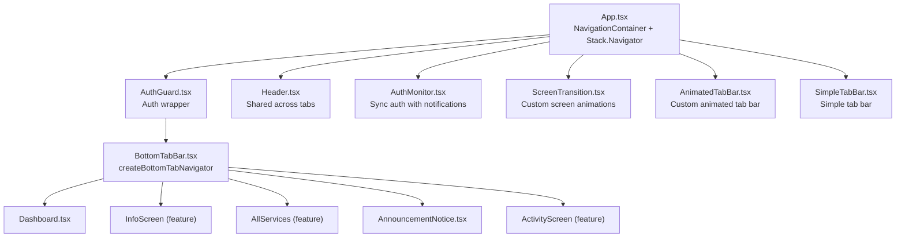
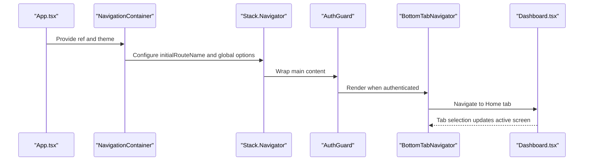
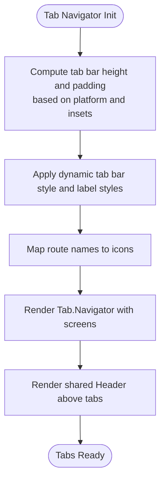
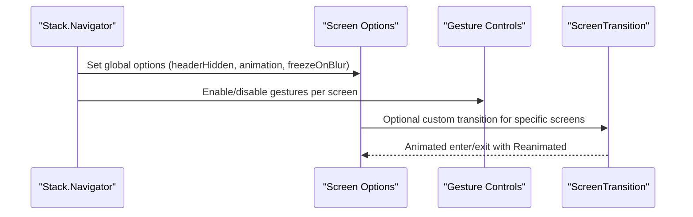
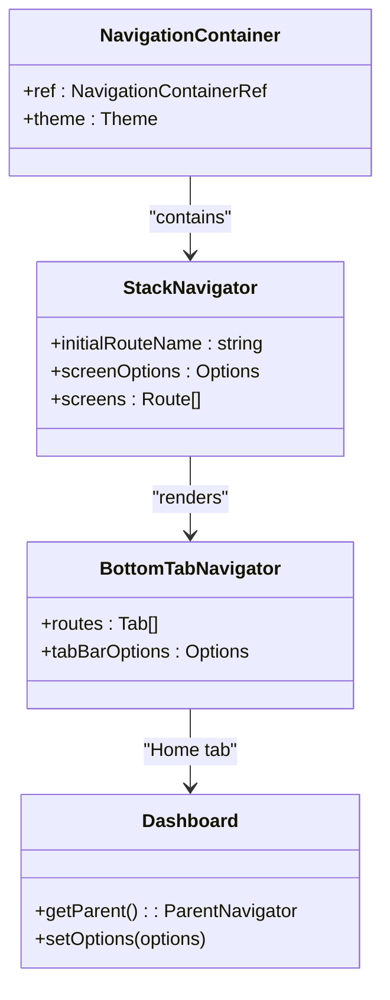
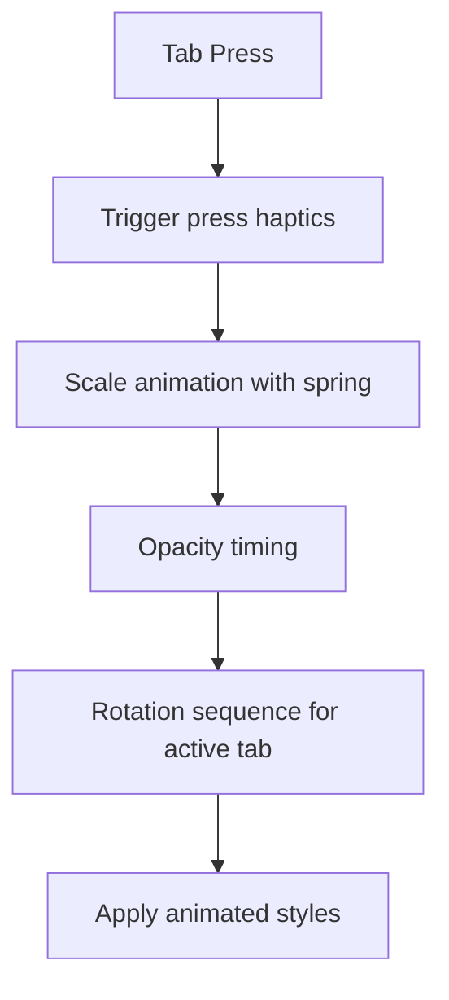
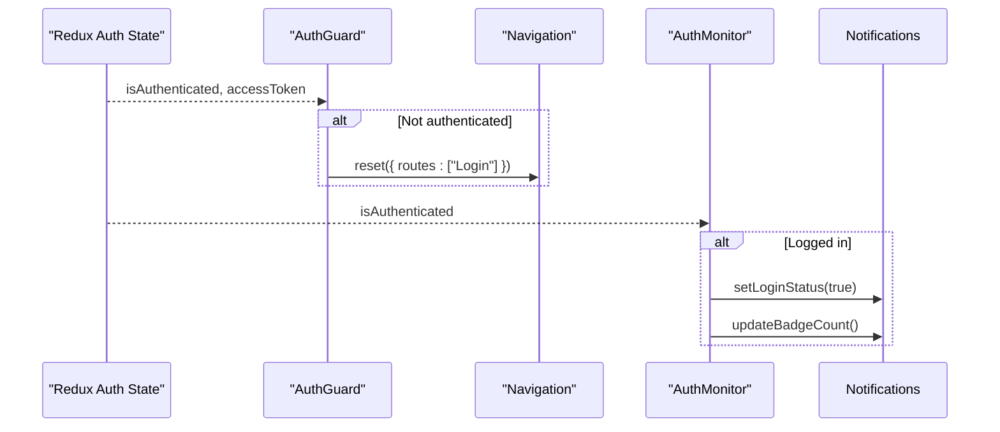
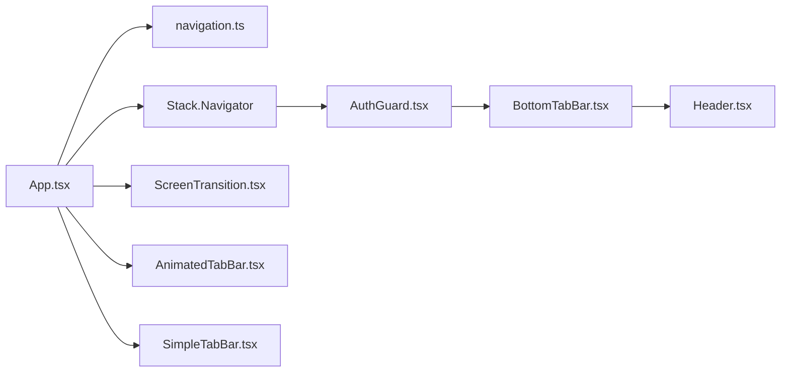

# Navigation & Routing

<cite>
**Referenced Files in This Document**
- [App.tsx](file://Estate_link_App/App.tsx)
- [BottomTabBar.tsx](file://Estate_link_App/components/BottomTabBar.tsx)
- [AnimatedTabBar.tsx](file://Estate_link_App/src/components/AnimatedTabBar.tsx)
- [SimpleTabBar.tsx](file://Estate_link_App/src/components/SimpleTabBar.tsx)
- [Header.tsx](file://Estate_link_App/components/Header.tsx)
- [AuthGuard.tsx](file://Estate_link_App/src/components/AuthGuard.tsx)
- [AuthMonitor.tsx](file://Estate_link_App/src/components/AuthMonitor.tsx)
- [ScreenTransition.tsx](file://Estate_link_App/src/components/ScreenTransition.tsx)
- [Dashboard.tsx](file://Estate_link_App/src/Features/DashboardScreen/Dashboard.tsx)
- [AnnouncementNotice.tsx](file://Estate_link_App/src/Features/Announcement&NoticeScreen/AnnouncementNotice.tsx)
- [navigation.ts](file://Estate_link_App/src/types/navigation.ts)
- [app.json](file://Estate_link_App/app.json)
</cite>

## Table of Contents
1. [Introduction](#introduction)
2. [Project Structure](#project-structure)
3. [Core Components](#core-components)
4. [Architecture Overview](#architecture-overview)
5. [Detailed Component Analysis](#detailed-component-analysis)
6. [Dependency Analysis](#dependency-analysis)
7. [Performance Considerations](#performance-considerations)
8. [Troubleshooting Guide](#troubleshooting-guide)
9. [Conclusion](#conclusion)

## Introduction
This document explains the mobile application’s navigation architecture built with React Navigation. It covers the bottom tab bar implementation, stack navigation patterns, screen transitions, navigation container setup, route configuration, gesture handling, animated tab bar components, custom navigation animations, responsive navigation behavior, state management, deep linking support, navigation guards, screen options, header configurations, performance optimizations, debugging, route persistence, and cross-platform consistency between iOS and Android.

## Project Structure
The navigation system centers around a single entry point that configures a native stack navigator and embeds a bottom tab navigator for the main app shell. Authentication guards wrap the main content to enforce access control. The header is shared across tabs and integrates with push notifications and user profile navigation.

**Diagram sources**
- [App.tsx](file://Estate_link_App/App.tsx#L242-L407)
- [BottomTabBar.tsx](file://Estate_link_App/components/BottomTabBar.tsx#L15-L159)
- [Dashboard.tsx](file://Estate_link_App/src/Features/DashboardScreen/Dashboard.tsx#L51-L800)
- [Header.tsx](file://Estate_link_App/components/Header.tsx#L41-L360)
- [AuthGuard.tsx](file://Estate_link_App/src/components/AuthGuard.tsx#L10-L41)
- [AuthMonitor.tsx](file://Estate_link_App/src/components/AuthMonitor.tsx#L10-L26)
- [ScreenTransition.tsx](file://Estate_link_App/src/components/ScreenTransition.tsx#L18-L92)
- [AnimatedTabBar.tsx](file://Estate_link_App/src/components/AnimatedTabBar.tsx#L28-L142)
- [SimpleTabBar.tsx](file://Estate_link_App/src/components/SimpleTabBar.tsx#L16-L56)

**Section sources**
- [App.tsx](file://Estate_link_App/App.tsx#L118-L414)
- [BottomTabBar.tsx](file://Estate_link_App/components/BottomTabBar.tsx#L15-L159)

## Core Components
- Navigation container and stack configuration: centralizes route definitions, global screen options, and disables gestures on specific screens to prevent back navigation to authentication flows.
- Bottom tab navigator: defines five tabs with custom icons, labels, and responsive styling; includes a shared header that persists across tabs.
- Authentication guard: redirects unauthenticated users to the login flow and renders a loader while checking auth state.
- Auth monitor: synchronizes authentication state with push notification service and updates badge counts when logged in.
- Custom screen transitions: provides fade and directional slide animations via Reanimated.
- Animated and simple tab bars: reusable UI components for custom tab experiences.

**Section sources**
- [App.tsx](file://Estate_link_App/App.tsx#L242-L407)
- [BottomTabBar.tsx](file://Estate_link_App/components/BottomTabBar.tsx#L57-L155)
- [AuthGuard.tsx](file://Estate_link_App/src/components/AuthGuard.tsx#L10-L41)
- [AuthMonitor.tsx](file://Estate_link_App/src/components/AuthMonitor.tsx#L10-L26)
- [ScreenTransition.tsx](file://Estate_link_App/src/components/ScreenTransition.tsx#L18-L92)
- [AnimatedTabBar.tsx](file://Estate_link_App/src/components/AnimatedTabBar.tsx#L28-L142)
- [SimpleTabBar.tsx](file://Estate_link_App/src/components/SimpleTabBar.tsx#L16-L56)

## Architecture Overview
The app uses a two-layer navigation architecture:
- Outer stack navigator: manages authentication and main app screens, with per-route animation and gesture controls.
- Inner bottom tab navigator: hosts the primary app content with a persistent header and tab-specific screens.

**Diagram sources**
- [App.tsx](file://Estate_link_App/App.tsx#L242-L407)
- [BottomTabBar.tsx](file://Estate_link_App/components/BottomTabBar.tsx#L15-L159)
- [Dashboard.tsx](file://Estate_link_App/src/Features/DashboardScreen/Dashboard.tsx#L51-L110)

## Detailed Component Analysis

### Bottom Tab Bar Implementation
- Uses createBottomTabNavigator to define five tabs: Home, Info, Services, Feed, Activity.
- Custom tab icons mapped by route name; labels styled with a bold font family.
- Dynamic tab bar height and padding computed based on platform and safe area insets to ensure consistent appearance across devices and navigation modes (gesture vs. button).
- Shared header is rendered above the tab navigator to maintain branding and user actions.

**Diagram sources**
- [BottomTabBar.tsx](file://Estate_link_App/components/BottomTabBar.tsx#L15-L159)

**Section sources**
- [BottomTabBar.tsx](file://Estate_link_App/components/BottomTabBar.tsx#L57-L155)

### Stack Navigation Patterns and Screen Transitions
- The outer Stack.Navigator sets global options: hidden header, slide-from-right animation, enabled gestures, freezeOnBlur, and a white content background.
- Specific screens disable gestures to prevent returning to authentication screens after login.
- Custom screen transitions are available via ScreenTransition for targeted screens requiring fade or directional slide effects.

**Diagram sources**
- [App.tsx](file://Estate_link_App/App.tsx#L243-L269)
- [ScreenTransition.tsx](file://Estate_link_App/src/components/ScreenTransition.tsx#L18-L92)

**Section sources**
- [App.tsx](file://Estate_link_App/App.tsx#L243-L407)
- [ScreenTransition.tsx](file://Estate_link_App/src/components/ScreenTransition.tsx#L18-L92)

### Navigation Container Setup and Route Configuration
- NavigationContainer holds the navigation ref and theme; the stack navigator defines routes and options.
- Route types are strongly typed via RootStackParamList to ensure type safety across navigations.
- The Dashboard screen uses getParent to adjust gestureEnabled on iOS to prevent swipe-back to authentication screens.

**Diagram sources**
- [App.tsx](file://Estate_link_App/App.tsx#L242-L407)
- [BottomTabBar.tsx](file://Estate_link_App/components/BottomTabBar.tsx#L15-L159)
- [Dashboard.tsx](file://Estate_link_App/src/Features/DashboardScreen/Dashboard.tsx#L153-L167)

**Section sources**
- [App.tsx](file://Estate_link_App/App.tsx#L242-L407)
- [navigation.ts](file://Estate_link_App/src/types/navigation.ts#L1-L40)
- [Dashboard.tsx](file://Estate_link_App/src/Features/DashboardScreen/Dashboard.tsx#L153-L167)

### Gesture Handling
- Global gestureEnabled is enabled; individual screens disable gestures to prevent navigation back to authentication flows.
- On iOS, the Dashboard screen adjusts gestureEnabled via its parent navigator to further restrict swipe-back behavior.

**Section sources**
- [App.tsx](file://Estate_link_App/App.tsx#L248-L268)
- [Dashboard.tsx](file://Estate_link_App/src/Features/DashboardScreen/Dashboard.tsx#L153-L167)

### Animated Tab Bar Components
- AnimatedTabBar: Provides spring-based scaling, opacity, and subtle rotation animations on tab press and selection changes using Reanimated.
- SimpleTabBar: Lightweight alternative with basic tinted icons and labels.

**Diagram sources**
- [AnimatedTabBar.tsx](file://Estate_link_App/src/components/AnimatedTabBar.tsx#L28-L142)

**Section sources**
- [AnimatedTabBar.tsx](file://Estate_link_App/src/components/AnimatedTabBar.tsx#L28-L142)
- [SimpleTabBar.tsx](file://Estate_link_App/src/components/SimpleTabBar.tsx#L16-L56)

### Custom Navigation Animations
- ScreenTransition supports fade and directional slide animations (left/right/up/down) with configurable duration and easing.
- Reanimated is used to animate opacity, translation, and scale for smooth transitions.

**Section sources**
- [ScreenTransition.tsx](file://Estate_link_App/src/components/ScreenTransition.tsx#L18-L92)

### Responsive Navigation Behavior
- BottomTabBar computes tab bar height and padding based on platform and safe area insets, ensuring consistent spacing on iOS and Android.
- The header adapts to portrait orientation and integrates with the tab bar’s z-index to remain above content.

**Section sources**
- [BottomTabBar.tsx](file://Estate_link_App/components/BottomTabBar.tsx#L18-L43)
- [Header.tsx](file://Estate_link_App/components/Header.tsx#L41-L360)

### Navigation State Management
- AuthGuard checks authentication state and resets navigation to the Login screen when needed, preventing unauthorized access.
- AuthMonitor listens to Redux auth state and updates push notification service login status and badge counts.

**Diagram sources**
- [AuthGuard.tsx](file://Estate_link_App/src/components/AuthGuard.tsx#L10-L41)
- [AuthMonitor.tsx](file://Estate_link_App/src/components/AuthMonitor.tsx#L10-L26)

**Section sources**
- [AuthGuard.tsx](file://Estate_link_App/src/components/AuthGuard.tsx#L10-L41)
- [AuthMonitor.tsx](file://Estate_link_App/src/components/AuthMonitor.tsx#L10-L26)

### Deep Linking Support
- The app.json defines bundle identifiers and permissions for iOS and Android, enabling deep linking and notification integration.
- AnnouncementNotice handles route parameters to highlight specific items and refresh data when navigated from push notifications.

**Section sources**
- [app.json](file://Estate_link_App/app.json#L49-L63)
- [AnnouncementNotice.tsx](file://Estate_link_App/src/Features/Announcement&NoticeScreen/AnnouncementNotice.tsx#L234-L313)

### Navigation Guards
- AuthGuard enforces authentication by redirecting to Login when not authenticated.
- Dashboard applies platform-specific gesture restrictions to prevent accidental navigation back to authentication screens.

**Section sources**
- [AuthGuard.tsx](file://Estate_link_App/src/components/AuthGuard.tsx#L10-L41)
- [Dashboard.tsx](file://Estate_link_App/src/Features/DashboardScreen/Dashboard.tsx#L153-L167)

### Screen Options and Header Configurations
- Global stack options hide headers, set slide animations, enable gestures, and freeze inactive screens.
- BottomTabNavigator sets tab bar colors, styles, icons, and labels; the shared Header displays branding, user info, and notification bell.

**Section sources**
- [App.tsx](file://Estate_link_App/App.tsx#L245-L252)
- [BottomTabBar.tsx](file://Estate_link_App/components/BottomTabBar.tsx#L58-L118)
- [Header.tsx](file://Estate_link_App/components/Header.tsx#L218-L258)

### Cross-Platform Navigation Consistency
- Platform detection and safe area insets ensure consistent tab bar sizing on iOS and Android.
- Orientation is locked to portrait in app.json to simplify layout and navigation behavior.

**Section sources**
- [BottomTabBar.tsx](file://Estate_link_App/components/BottomTabBar.tsx#L18-L43)
- [app.json](file://Estate_link_App/app.json#L38-L39)

## Dependency Analysis
The navigation stack depends on React Navigation primitives and Reanimated for animations. Type safety is enforced via a centralized RootStackParamList. The header integrates with notification APIs and user profile navigation.

**Diagram sources**
- [App.tsx](file://Estate_link_App/App.tsx#L242-L407)
- [navigation.ts](file://Estate_link_App/src/types/navigation.ts#L1-L40)
- [BottomTabBar.tsx](file://Estate_link_App/components/BottomTabBar.tsx#L15-L159)
- [Header.tsx](file://Estate_link_App/components/Header.tsx#L41-L360)
- [AuthGuard.tsx](file://Estate_link_App/src/components/AuthGuard.tsx#L10-L41)
- [ScreenTransition.tsx](file://Estate_link_App/src/components/ScreenTransition.tsx#L18-L92)
- [AnimatedTabBar.tsx](file://Estate_link_App/src/components/AnimatedTabBar.tsx#L28-L142)
- [SimpleTabBar.tsx](file://Estate_link_App/src/components/SimpleTabBar.tsx#L16-L56)

**Section sources**
- [navigation.ts](file://Estate_link_App/src/types/navigation.ts#L1-L40)
- [App.tsx](file://Estate_link_App/App.tsx#L242-L407)

## Performance Considerations
- freezeOnBlur reduces memory usage by freezing inactive screens.
- Reanimated-based transitions minimize layout thrashing and leverage GPU acceleration.
- Virtualized lists and memoization in Dashboard and AnnouncementNotice optimize rendering performance.
- Debounced tab switching prevents excessive re-renders during rapid tab changes.

[No sources needed since this section provides general guidance]

## Troubleshooting Guide
- Authentication loop or unexpected redirects: verify AuthGuard behavior and ensure Redux auth state is correctly initialized before rendering protected content.
- Tab bar spacing issues on Android: confirm safe area insets and platform-specific padding calculations.
- Gesture conflicts: review per-route gestureEnabled settings and iOS-specific getParent adjustments.
- Notification badge count not updating: check AuthMonitor synchronization and push notification service initialization.
- Route parameter persistence: ensure navigation.setParams is used to clear transient parameters after consumption.

**Section sources**
- [AuthGuard.tsx](file://Estate_link_App/src/components/AuthGuard.tsx#L10-L41)
- [BottomTabBar.tsx](file://Estate_link_App/components/BottomTabBar.tsx#L18-L43)
- [Dashboard.tsx](file://Estate_link_App/src/Features/DashboardScreen/Dashboard.tsx#L153-L167)
- [AuthMonitor.tsx](file://Estate_link_App/src/components/AuthMonitor.tsx#L10-L26)
- [AnnouncementNotice.tsx](file://Estate_link_App/src/Features/Announcement&NoticeScreen/AnnouncementNotice.tsx#L290-L312)

## Conclusion
The navigation architecture combines a robust stack navigator with a custom bottom tab bar, strong type safety, and platform-aware responsive design. Authentication guards, custom animations, and careful gesture handling deliver a secure and polished user experience across iOS and Android. The modular components and centralized configuration facilitate maintainability and extensibility.