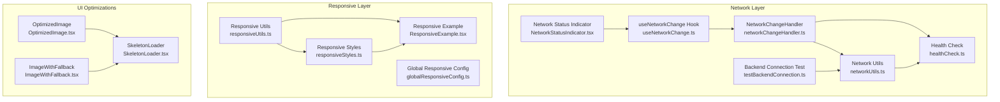
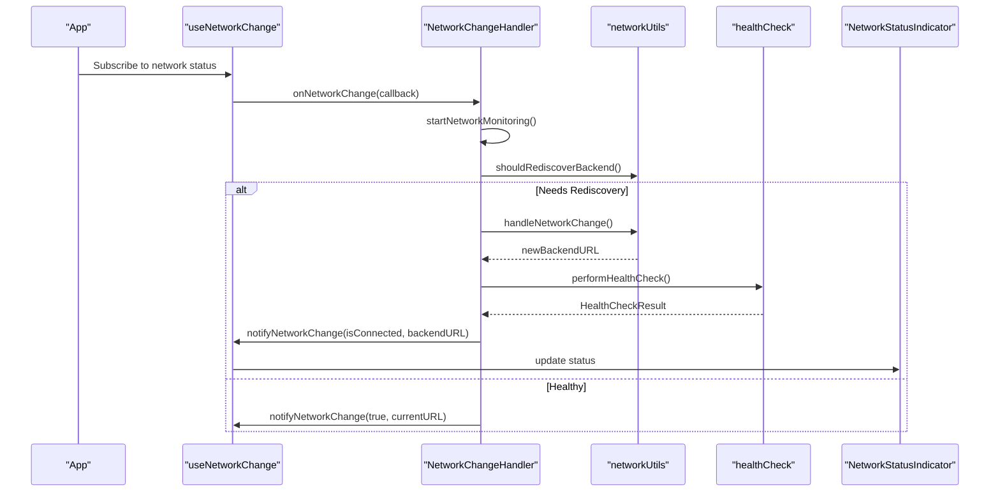
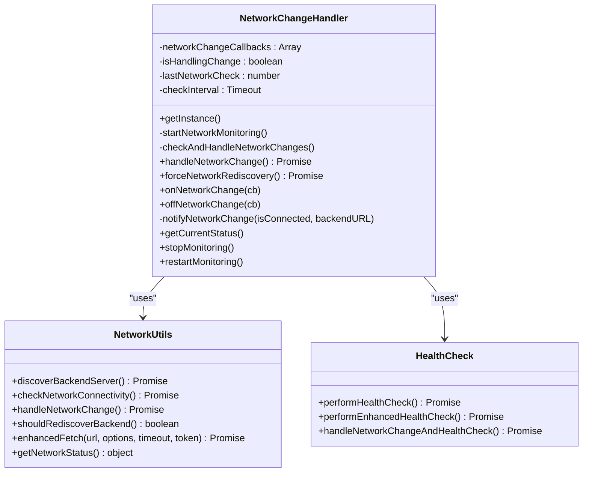
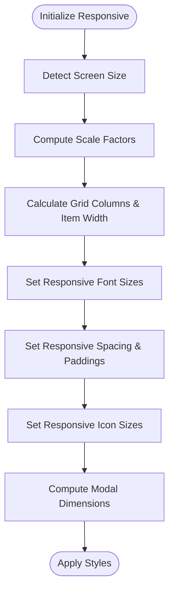
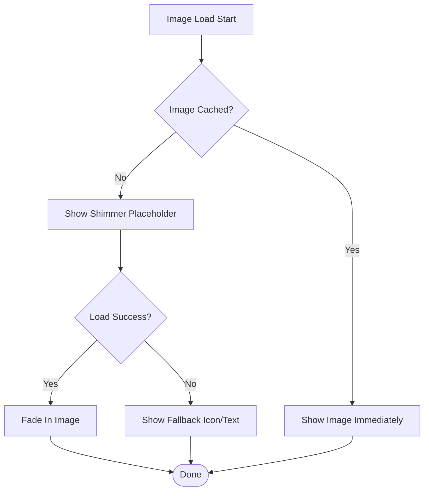
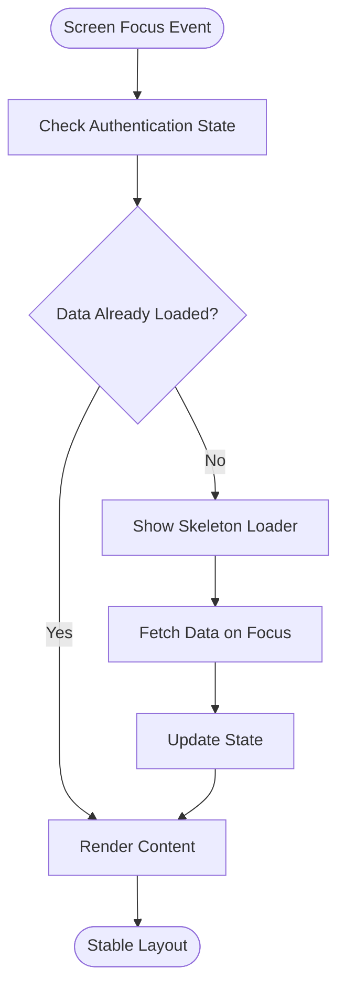
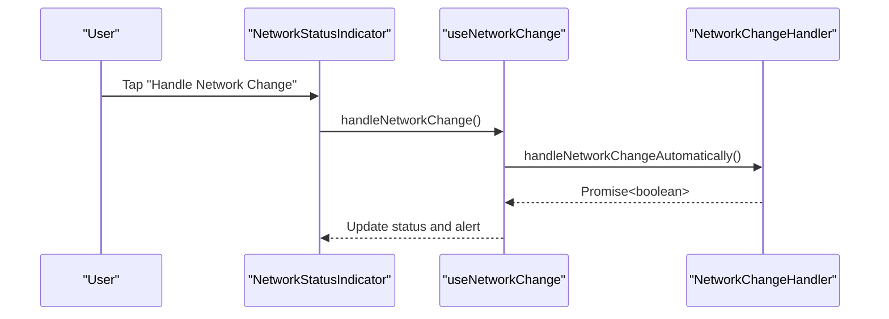
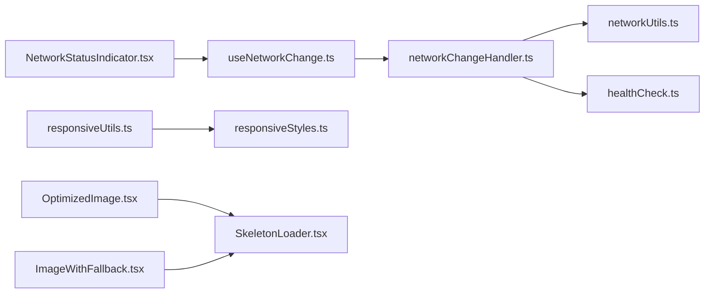

# Performance & Optimization

<cite>
**Referenced Files in This Document**
- [NETWORK_CHANGE_SOLUTION.md](file://Estate_link_App/NETWORK_CHANGE_SOLUTION.md)
- [SCREEN_SHAKING_FIX.md](file://Estate_link_App/SCREEN_SHAKING_FIX.md)
- [README-NETWORK.md](file://Estate_link_App/README-NETWORK.md)
- [networkChangeHandler.ts](file://Estate_link_App/src/utils/networkChangeHandler.ts)
- [networkUtils.ts](file://Estate_link_App/src/utils/networkUtils.ts)
- [healthCheck.ts](file://Estate_link_App/src/utils/healthCheck.ts)
- [testBackendConnection.ts](file://Estate_link_App/src/utils/testBackendConnection.ts)
- [useNetworkChange.ts](file://Estate_link_App/src/hooks/useNetworkChange.ts)
- [responsiveUtils.ts](file://Estate_link_App/src/utils/responsiveUtils.ts)
- [responsiveStyles.ts](file://Estate_link_App/src/utils/responsiveStyles.ts)
- [globalResponsiveConfig.ts](file://Estate_link_App/src/utils/globalResponsiveConfig.ts)
- [ResponsiveExample.tsx](file://Estate_link_App/src/components/ResponsiveExample.tsx)
- [OptimizedImage.tsx](file://Estate_link_App/src/components/OptimizedImage.tsx)
- [ImageWithFallback.tsx](file://Estate_link_App/src/components/ImageWithFallback.tsx)
- [SkeletonLoader.tsx](file://Estate_link_App/src/components/SkeletonLoader.tsx)
- [NetworkStatusIndicator.tsx](file://Estate_link_App/src/components/NetworkStatusIndicator.tsx)
</cite>

## Table of Contents
1. [Introduction](#introduction)
2. [Project Structure](#project-structure)
3. [Core Components](#core-components)
4. [Architecture Overview](#architecture-overview)
5. [Detailed Component Analysis](#detailed-component-analysis)
6. [Dependency Analysis](#dependency-analysis)
7. [Performance Considerations](#performance-considerations)
8. [Troubleshooting Guide](#troubleshooting-guide)
9. [Conclusion](#conclusion)
10. [Appendices](#appendices)

## Introduction
This document consolidates the mobile application’s performance optimization and network handling strategies. It covers responsive design utilities, network connectivity detection, health checks, screen shaking fixes, network change handlers, performance monitoring, backend connection testing, error handling, graceful degradation, memory management, image optimization, bundle size optimization, integration with React Native performance tools, profiling techniques, debugging workflows, mobile-specific performance considerations, battery optimization, and offline-first strategies.

## Project Structure
The performance and optimization features are organized around:
- Network utilities and health checks
- Responsive design utilities and styles
- Image optimization and skeleton loaders
- Network status indicator and hooks
- Backend connection testing utilities

**Diagram sources**
- [networkChangeHandler.ts](file://Estate_link_App/src/utils/networkChangeHandler.ts#L1-L181)
- [networkUtils.ts](file://Estate_link_App/src/utils/networkUtils.ts#L1-L511)
- [healthCheck.ts](file://Estate_link_App/src/utils/healthCheck.ts#L1-L199)
- [testBackendConnection.ts](file://Estate_link_App/src/utils/testBackendConnection.ts#L1-L208)
- [useNetworkChange.ts](file://Estate_link_App/src/hooks/useNetworkChange.ts#L1-L84)
- [NetworkStatusIndicator.tsx](file://Estate_link_App/src/components/NetworkStatusIndicator.tsx#L1-L138)
- [responsiveUtils.ts](file://Estate_link_App/src/utils/responsiveUtils.ts#L1-L492)
- [responsiveStyles.ts](file://Estate_link_App/src/utils/responsiveStyles.ts#L1-L342)
- [globalResponsiveConfig.ts](file://Estate_link_App/src/utils/globalResponsiveConfig.ts#L1-L279)
- [ResponsiveExample.tsx](file://Estate_link_App/src/components/ResponsiveExample.tsx#L1-L427)
- [OptimizedImage.tsx](file://Estate_link_App/src/components/OptimizedImage.tsx#L1-L197)
- [ImageWithFallback.tsx](file://Estate_link_App/src/components/ImageWithFallback.tsx#L1-L192)
- [SkeletonLoader.tsx](file://Estate_link_App/src/components/SkeletonLoader.tsx#L1-L190)

**Section sources**
- [NETWORK_CHANGE_SOLUTION.md](file://Estate_link_App/NETWORK_CHANGE_SOLUTION.md#L1-L244)
- [README-NETWORK.md](file://Estate_link_App/README-NETWORK.md#L1-L135)

## Core Components
- NetworkChangeHandler: Singleton orchestrating periodic network checks, change handling, and health verification with callbacks.
- Network Utils: Dynamic backend discovery, connectivity checks, enhanced fetch with token refresh, and status tracking.
- Health Check: Health verification with discovery fallback and detailed results.
- Backend Connection Test: End-to-end connectivity and authentication test with detailed diagnostics.
- useNetworkChange Hook: React hook exposing network status and actions to handle changes or force rediscovery.
- Network Status Indicator: UI component displaying live status and manual controls.
- Responsive Utilities: Device-aware scaling, grid layouts, typography, spacing, and modal sizing.
- Image Optimizations: OptimizedImage and ImageWithFallback with shimmer loading, caching, and error handling.
- Skeleton Loader: Animated placeholders to stabilize layouts and improve perceived performance.

**Section sources**
- [networkChangeHandler.ts](file://Estate_link_App/src/utils/networkChangeHandler.ts#L1-L181)
- [networkUtils.ts](file://Estate_link_App/src/utils/networkUtils.ts#L1-L511)
- [healthCheck.ts](file://Estate_link_App/src/utils/healthCheck.ts#L1-L199)
- [testBackendConnection.ts](file://Estate_link_App/src/utils/testBackendConnection.ts#L1-L208)
- [useNetworkChange.ts](file://Estate_link_App/src/hooks/useNetworkChange.ts#L1-L84)
- [NetworkStatusIndicator.tsx](file://Estate_link_App/src/components/NetworkStatusIndicator.tsx#L1-L138)
- [responsiveUtils.ts](file://Estate_link_App/src/utils/responsiveUtils.ts#L1-L492)
- [responsiveStyles.ts](file://Estate_link_App/src/utils/responsiveStyles.ts#L1-L342)
- [globalResponsiveConfig.ts](file://Estate_link_App/src/utils/globalResponsiveConfig.ts#L1-L279)
- [OptimizedImage.tsx](file://Estate_link_App/src/components/OptimizedImage.tsx#L1-L197)
- [ImageWithFallback.tsx](file://Estate_link_App/src/components/ImageWithFallback.tsx#L1-L192)
- [SkeletonLoader.tsx](file://Estate_link_App/src/components/SkeletonLoader.tsx#L1-L190)

## Architecture Overview
The system integrates network resilience, responsive design, and UI optimizations into a cohesive pipeline:
- Periodic and event-driven network checks trigger health verification and backend rediscovery.
- Enhanced fetch centralizes authentication, retries, and token refresh.
- Responsive utilities ensure consistent layouts across devices.
- Image and skeleton loaders reduce jank and improve perceived performance.
- A status indicator exposes real-time state and manual controls.

**Diagram sources**
- [useNetworkChange.ts](file://Estate_link_App/src/hooks/useNetworkChange.ts#L1-L84)
- [networkChangeHandler.ts](file://Estate_link_App/src/utils/networkChangeHandler.ts#L1-L181)
- [networkUtils.ts](file://Estate_link_App/src/utils/networkUtils.ts#L204-L226)
- [healthCheck.ts](file://Estate_link_App/src/utils/healthCheck.ts#L10-L70)
- [NetworkStatusIndicator.tsx](file://Estate_link_App/src/components/NetworkStatusIndicator.tsx#L1-L138)

## Detailed Component Analysis

### Network Connectivity and Health
- NetworkChangeHandler manages periodic checks, change handling, and health verification with callback notifications.
- Network Utils provides dynamic backend discovery, connectivity checks, enhanced fetch with token refresh, and status tracking.
- Health Check performs health verification and attempts rediscovery with detailed results.
- Backend Connection Test validates connectivity and authentication across key endpoints.

**Diagram sources**
- [networkChangeHandler.ts](file://Estate_link_App/src/utils/networkChangeHandler.ts#L1-L181)
- [networkUtils.ts](file://Estate_link_App/src/utils/networkUtils.ts#L1-L511)
- [healthCheck.ts](file://Estate_link_App/src/utils/healthCheck.ts#L1-L199)

**Section sources**
- [networkChangeHandler.ts](file://Estate_link_App/src/utils/networkChangeHandler.ts#L1-L181)
- [networkUtils.ts](file://Estate_link_App/src/utils/networkUtils.ts#L1-L511)
- [healthCheck.ts](file://Estate_link_App/src/utils/healthCheck.ts#L1-L199)
- [testBackendConnection.ts](file://Estate_link_App/src/utils/testBackendConnection.ts#L1-L208)

### Responsive Design Utilities
- responsiveUtils: Device-aware scaling, grid calculation, typography, spacing, icons, and modal sizing.
- responsiveStyles: Prebuilt StyleSheet fragments leveraging responsive utilities.
- globalResponsiveConfig: Breakpoints, spacing, paddings, fonts, icons, and grid configuration.
- ResponsiveExample: Demonstrates responsive grids, typography, spacing, images, buttons, and percentage-based layouts.

**Diagram sources**
- [responsiveUtils.ts](file://Estate_link_App/src/utils/responsiveUtils.ts#L1-L492)
- [responsiveStyles.ts](file://Estate_link_App/src/utils/responsiveStyles.ts#L1-L342)
- [globalResponsiveConfig.ts](file://Estate_link_App/src/utils/globalResponsiveConfig.ts#L1-L279)
- [ResponsiveExample.tsx](file://Estate_link_App/src/components/ResponsiveExample.tsx#L1-L427)

**Section sources**
- [responsiveUtils.ts](file://Estate_link_App/src/utils/responsiveUtils.ts#L1-L492)
- [responsiveStyles.ts](file://Estate_link_App/src/utils/responsiveStyles.ts#L1-L342)
- [globalResponsiveConfig.ts](file://Estate_link_App/src/utils/globalResponsiveConfig.ts#L1-L279)
- [ResponsiveExample.tsx](file://Estate_link_App/src/components/ResponsiveExample.tsx#L1-L427)

### Image Optimization and Skeleton Loaders
- OptimizedImage: Shimmer loading, activity indicator, error fallback, fade-in animation, and global cache.
- ImageWithFallback: Shimmer loading, error fallback, global cache, and debug info.
- SkeletonLoader: Animated placeholders for cards, grids, and generic shapes to stabilize layouts.

**Diagram sources**
- [OptimizedImage.tsx](file://Estate_link_App/src/components/OptimizedImage.tsx#L1-L197)
- [ImageWithFallback.tsx](file://Estate_link_App/src/components/ImageWithFallback.tsx#L1-L192)
- [SkeletonLoader.tsx](file://Estate_link_App/src/components/SkeletonLoader.tsx#L1-L190)

**Section sources**
- [OptimizedImage.tsx](file://Estate_link_App/src/components/OptimizedImage.tsx#L1-L197)
- [ImageWithFallback.tsx](file://Estate_link_App/src/components/ImageWithFallback.tsx#L1-L192)
- [SkeletonLoader.tsx](file://Estate_link_App/src/components/SkeletonLoader.tsx#L1-L190)

### Screen Shaking Fix Solutions
- Replaced generic useEffect with useFocusEffect to fetch data only when screens come into focus.
- Implemented skeleton loaders to maintain stable layout dimensions during loading.
- Improved loading state management to avoid repeated re-renders and layout shifts.
- Centralized authentication handling to prevent conditional rendering loops.

**Diagram sources**
- [SCREEN_SHAKING_FIX.md](file://Estate_link_App/SCREEN_SHAKING_FIX.md#L1-L162)

**Section sources**
- [SCREEN_SHAKING_FIX.md](file://Estate_link_App/SCREEN_SHAKING_FIX.md#L1-L162)

### Network Change Handlers and Status Indicators
- useNetworkChange: Exposes network status and actions to handle changes or force rediscovery.
- NetworkStatusIndicator: Real-time status display with manual controls and alerts.

**Diagram sources**
- [NetworkStatusIndicator.tsx](file://Estate_link_App/src/components/NetworkStatusIndicator.tsx#L1-L138)
- [useNetworkChange.ts](file://Estate_link_App/src/hooks/useNetworkChange.ts#L1-L84)
- [networkChangeHandler.ts](file://Estate_link_App/src/utils/networkChangeHandler.ts#L76-L97)

**Section sources**
- [useNetworkChange.ts](file://Estate_link_App/src/hooks/useNetworkChange.ts#L1-L84)
- [NetworkStatusIndicator.tsx](file://Estate_link_App/src/components/NetworkStatusIndicator.tsx#L1-L138)
- [networkChangeHandler.ts](file://Estate_link_App/src/utils/networkChangeHandler.ts#L1-L181)

## Dependency Analysis
- Coupling: NetworkChangeHandler depends on networkUtils and healthCheck; useNetworkChange depends on NetworkChangeHandler; NetworkStatusIndicator depends on useNetworkChange.
- Cohesion: Each module encapsulates a single concern—networking, responsiveness, or UI optimization.
- External Dependencies: React Native core, Expo Linear Gradient, and vector icons for UI components.

**Diagram sources**
- [useNetworkChange.ts](file://Estate_link_App/src/hooks/useNetworkChange.ts#L1-L84)
- [networkChangeHandler.ts](file://Estate_link_App/src/utils/networkChangeHandler.ts#L1-L181)
- [networkUtils.ts](file://Estate_link_App/src/utils/networkUtils.ts#L1-L511)
- [healthCheck.ts](file://Estate_link_App/src/utils/healthCheck.ts#L1-L199)
- [NetworkStatusIndicator.tsx](file://Estate_link_App/src/components/NetworkStatusIndicator.tsx#L1-L138)
- [responsiveUtils.ts](file://Estate_link_App/src/utils/responsiveUtils.ts#L1-L492)
- [responsiveStyles.ts](file://Estate_link_App/src/utils/responsiveStyles.ts#L1-L342)
- [OptimizedImage.tsx](file://Estate_link_App/src/components/OptimizedImage.tsx#L1-L197)
- [ImageWithFallback.tsx](file://Estate_link_App/src/components/ImageWithFallback.tsx#L1-L192)
- [SkeletonLoader.tsx](file://Estate_link_App/src/components/SkeletonLoader.tsx#L1-L190)

**Section sources**
- [networkChangeHandler.ts](file://Estate_link_App/src/utils/networkChangeHandler.ts#L1-L181)
- [networkUtils.ts](file://Estate_link_App/src/utils/networkUtils.ts#L1-L511)
- [healthCheck.ts](file://Estate_link_App/src/utils/healthCheck.ts#L1-L199)
- [useNetworkChange.ts](file://Estate_link_App/src/hooks/useNetworkChange.ts#L1-L84)
- [NetworkStatusIndicator.tsx](file://Estate_link_App/src/components/NetworkStatusIndicator.tsx#L1-L138)
- [responsiveUtils.ts](file://Estate_link_App/src/utils/responsiveUtils.ts#L1-L492)
- [responsiveStyles.ts](file://Estate_link_App/src/utils/responsiveStyles.ts#L1-L342)
- [OptimizedImage.tsx](file://Estate_link_App/src/components/OptimizedImage.tsx#L1-L197)
- [ImageWithFallback.tsx](file://Estate_link_App/src/components/ImageWithFallback.tsx#L1-L192)
- [SkeletonLoader.tsx](file://Estate_link_App/src/components/SkeletonLoader.tsx#L1-L190)

## Performance Considerations
- Network Resilience
  - Automatic backend discovery and health checks reduce downtime on network changes.
  - Enhanced fetch with token refresh and retry minimizes failed requests.
  - Network status tracking and callbacks enable UI updates without blocking user tasks.
- Responsive Design
  - Device-aware scaling and grid layouts prevent layout thrashing across screen sizes.
  - Percentage-based dimensions and precomputed styles improve render predictability.
- UI Optimization
  - Skeleton loaders stabilize layouts and reduce layout shifts.
  - Shimmer placeholders and fade-in animations improve perceived performance.
  - Global image caches reduce redundant network requests.
- Memory Management
  - Avoid unnecessary re-renders by using focused data fetching and stable keys.
  - Use skeleton loaders and minimal DOM trees during loading states.
- Bundle Size Optimization
  - Lazy-load heavy components and images.
  - Tree-shake unused responsive utilities and styles.
  - Prefer platform-agnostic libraries and minimize third-party dependencies.
- Battery Optimization
  - Limit polling frequency; use adaptive intervals based on connectivity.
  - Debounce user-triggered network actions.
  - Avoid excessive gradient animations on low-end devices.
- Offline-First Strategies
  - Cache frequently accessed data locally.
  - Show skeleton loaders and cached content while validating connectivity.
  - Gracefully degrade non-critical features during poor connectivity.

[No sources needed since this section provides general guidance]

## Troubleshooting Guide
- Network Requests Fail After Network Change
  - Use the Network Status Indicator to trigger manual handling or force rediscovery.
  - Verify backend URL discovery and health check results.
- Slow or Unstable Connectivity
  - Adjust timeout and retry configurations in environment settings.
  - Use enhanced fetch to leverage automatic token refresh and retry.
- Image Loading Issues
  - Confirm image URLs and fallback icons are rendered.
  - Inspect shimmer and loading indicators; ensure global cache is effective.
- Responsive Layout Problems
  - Validate screen size detection and grid calculations.
  - Confirm responsive styles and breakpoints align with device type.

**Section sources**
- [README-NETWORK.md](file://Estate_link_App/README-NETWORK.md#L67-L135)
- [NETWORK_CHANGE_SOLUTION.md](file://Estate_link_App/NETWORK_CHANGE_SOLUTION.md#L190-L244)
- [NetworkStatusIndicator.tsx](file://Estate_link_App/src/components/NetworkStatusIndicator.tsx#L1-L138)
- [networkUtils.ts](file://Estate_link_App/src/utils/networkUtils.ts#L240-L269)

## Conclusion
The application integrates robust network resilience, responsive design, and UI optimizations to deliver a smooth, performant mobile experience. By combining automatic discovery, health checks, skeleton loaders, optimized images, and device-aware layouts, the system achieves stability across diverse networks and devices while maintaining excellent user experience.

[No sources needed since this section summarizes without analyzing specific files]

## Appendices
- Backend Connection Testing
  - Run the backend connection test to validate connectivity and authentication across endpoints.
- Environment Configuration
  - Configure environment-specific timeouts, retry attempts, and backend URLs for optimal performance.

**Section sources**
- [testBackendConnection.ts](file://Estate_link_App/src/utils/testBackendConnection.ts#L1-L208)
- [README-NETWORK.md](file://Estate_link_App/README-NETWORK.md#L14-L52)