# Profile Management

<cite>
**Referenced Files in This Document**
- [ProfileManagement.tsx](file://Estate_link_App/src/Features/ProfileManagement/ProfileManagement.tsx)
- [EditGeneralInfo.tsx](file://Estate_link_App/src/Features/ProfileManagement/EditGeneralInfoScreen/EditGeneralInfo.tsx)
- [EditLoginInfo.tsx](file://Estate_link_App/src/Features/ProfileManagement/EditLoginInfoScreen/EditLoginInfo.tsx)
- [InfoAndSupport.tsx](file://Estate_link_App/src/Features/ProfileManagement/InfoAndSupportScreen/InfoAndSupport.tsx)
- [TermsAndPrivacy.tsx](file://Estate_link_App/src/Features/ProfileManagement/TermsAndPrivacyScreen/TermsAndPrivacy.tsx)
- [ProfileManagementSettings.tsx](file://Estate_link_App/src/Features/ProfileManagement/ProfileManagementSettings/ProfileManagementSettings.tsx)
- [profileService.ts](file://Estate_link_App/src/services/profileService.ts)
- [useProfile.ts](file://Estate_link_App/src/hooks/useProfile.ts)
- [profileSlice.ts](file://Estate_link_App/src/store/slices/profileSlice.ts)
- [schemas.ts](file://Estate_link_App/src/validation/schemas.ts)
- [photoUtils.ts](file://Estate_link_App/src/utils/photoUtils.ts)
- [ProfileImage.tsx](file://Estate_link_App/src/components/ProfileImage.tsx)
</cite>

## Table of Contents
1. [Introduction](#introduction)
2. [Project Structure](#project-structure)
3. [Core Components](#core-components)
4. [Architecture Overview](#architecture-overview)
5. [Detailed Component Analysis](#detailed-component-analysis)
6. [Dependency Analysis](#dependency-analysis)
7. [Performance Considerations](#performance-considerations)
8. [Troubleshooting Guide](#troubleshooting-guide)
9. [Conclusion](#conclusion)

## Introduction
This document describes the mobile profile management system for the Estate Link application. It covers the profile overview screen, settings management, and information editing capabilities. It explains the general information editing workflow, login information updates, and support ticket submission. It also documents terms and privacy management, profile image handling, and data validation processes. Mobile-specific features such as camera integration, file uploads, and responsive form layouts are included, along with integration details for backend profile APIs, real-time updates, and offline synchronization strategies.

## Project Structure
The profile management feature is organized around a central ProfileManagement screen that displays user profile data and provides navigation to settings and editing screens. Supporting screens include general information editing, login information editing, info and support, and terms and privacy management. Shared utilities and services handle API communication, validation, and image processing.

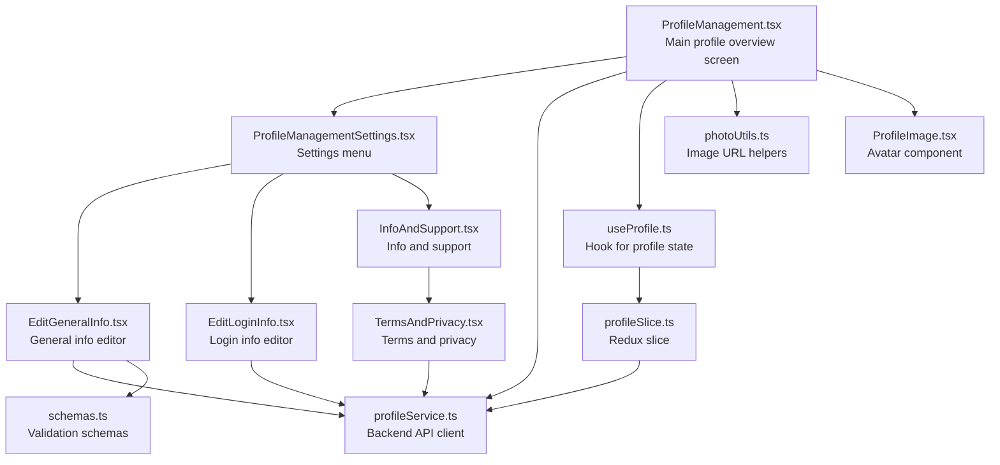

**Diagram sources**
- [ProfileManagement.tsx](file://Estate_link_App/src/Features/ProfileManagement/ProfileManagement.tsx#L1-L811)
- [ProfileManagementSettings.tsx](file://Estate_link_App/src/Features/ProfileManagement/ProfileManagementSettings/ProfileManagementSettings.tsx#L1-L89)
- [EditGeneralInfo.tsx](file://Estate_link_App/src/Features/ProfileManagement/EditGeneralInfoScreen/EditGeneralInfo.tsx#L1-L993)
- [EditLoginInfo.tsx](file://Estate_link_App/src/Features/ProfileManagement/EditLoginInfoScreen/EditLoginInfo.tsx#L1-L281)
- [InfoAndSupport.tsx](file://Estate_link_App/src/Features/ProfileManagement/InfoAndSupportScreen/InfoAndSupport.tsx#L1-L125)
- [TermsAndPrivacy.tsx](file://Estate_link_App/src/Features/ProfileManagement/TermsAndPrivacyScreen/TermsAndPrivacy.tsx#L1-L222)
- [profileService.ts](file://Estate_link_App/src/services/profileService.ts#L1-L295)
- [useProfile.ts](file://Estate_link_App/src/hooks/useProfile.ts#L1-L183)
- [profileSlice.ts](file://Estate_link_App/src/store/slices/profileSlice.ts#L1-L389)
- [schemas.ts](file://Estate_link_App/src/validation/schemas.ts#L368-L443)
- [photoUtils.ts](file://Estate_link_App/src/utils/photoUtils.ts#L1-L84)
- [ProfileImage.tsx](file://Estate_link_App/src/components/ProfileImage.tsx#L1-L101)

**Section sources**
- [ProfileManagement.tsx](file://Estate_link_App/src/Features/ProfileManagement/ProfileManagement.tsx#L1-L811)
- [ProfileManagementSettings.tsx](file://Estate_link_App/src/Features/ProfileManagement/ProfileManagementSettings/ProfileManagementSettings.tsx#L1-L89)

## Core Components
- Profile overview screen: Displays user profile header, membership badges, position/unit information, tabs for general info and activity, ID card images, and logout controls. Supports pull-to-refresh and image downloads.
- Settings management: Provides navigation to general info editing, login info editing, and info/support screens.
- Information editing: General info editor with responsive forms, validation, camera/gallery integration for NID images, and success/error feedback.
- Login info editor: Updates delivery method for login credentials with validation and feedback.
- Info and support: Displays company information, support contact links, and navigation to terms and privacy.
- Terms and privacy: Manages terms acceptance with modal viewing, mandatory acceptance during login flow, and success feedback.
- Backend integration: ProfileService encapsulates API calls for fetching and updating profiles, including multipart/form-data handling for images.
- State management: useProfile hook and profileSlice coordinate profile data fetching, caching, and updates via Redux Thunks.
- Validation: Yup schemas enforce field constraints for general info editing and login info updates.
- Image handling: photoUtils constructs full URLs for profile and attachment images; ProfileImage renders optimized avatars.

**Section sources**
- [ProfileManagement.tsx](file://Estate_link_App/src/Features/ProfileManagement/ProfileManagement.tsx#L1-L811)
- [EditGeneralInfo.tsx](file://Estate_link_App/src/Features/ProfileManagement/EditGeneralInfoScreen/EditGeneralInfo.tsx#L1-L993)
- [EditLoginInfo.tsx](file://Estate_link_App/src/Features/ProfileManagement/EditLoginInfoScreen/EditLoginInfo.tsx#L1-L281)
- [InfoAndSupport.tsx](file://Estate_link_App/src/Features/ProfileManagement/InfoAndSupportScreen/InfoAndSupport.tsx#L1-L125)
- [TermsAndPrivacy.tsx](file://Estate_link_App/src/Features/ProfileManagement/TermsAndPrivacyScreen/TermsAndPrivacy.tsx#L1-L222)
- [profileService.ts](file://Estate_link_App/src/services/profileService.ts#L1-L295)
- [useProfile.ts](file://Estate_link_App/src/hooks/useProfile.ts#L1-L183)
- [profileSlice.ts](file://Estate_link_App/src/store/slices/profileSlice.ts#L1-L389)
- [schemas.ts](file://Estate_link_App/src/validation/schemas.ts#L368-L443)
- [photoUtils.ts](file://Estate_link_App/src/utils/photoUtils.ts#L1-L84)
- [ProfileImage.tsx](file://Estate_link_App/src/components/ProfileImage.tsx#L1-L101)

## Architecture Overview
The profile management system follows a layered architecture:
- UI Layer: React Native screens and components for profile overview, editing, settings, and support.
- Hook and Slice Layer: useProfile hook and Redux profileSlice manage state transitions and async operations.
- Service Layer: ProfileService abstracts backend API interactions with proper error handling and FormData preparation.
- Utility Layer: photoUtils and validation schemas support image URL resolution and form validation.

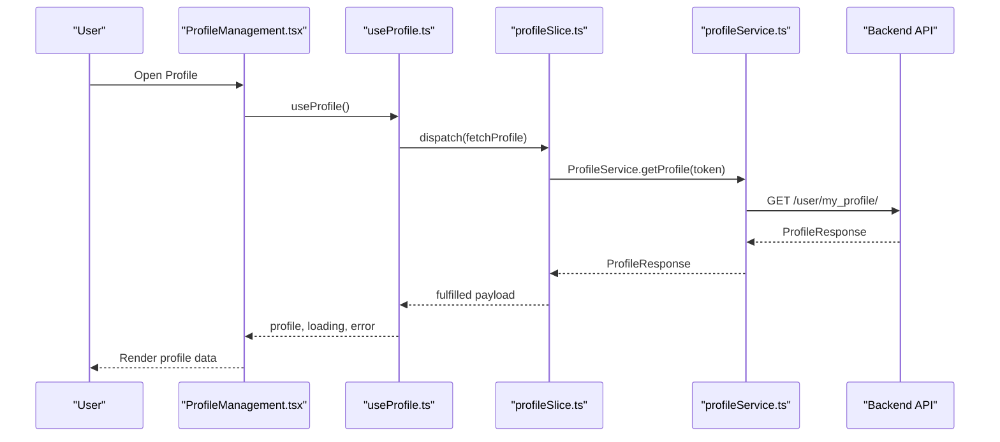

**Diagram sources**
- [ProfileManagement.tsx](file://Estate_link_App/src/Features/ProfileManagement/ProfileManagement.tsx#L1-L811)
- [useProfile.ts](file://Estate_link_App/src/hooks/useProfile.ts#L1-L183)
- [profileSlice.ts](file://Estate_link_App/src/store/slices/profileSlice.ts#L70-L104)
- [profileService.ts](file://Estate_link_App/src/services/profileService.ts#L112-L150)

## Detailed Component Analysis

### Profile Overview Screen
The profile overview screen presents:
- Profile header with name, contact, and email, with a clickable camera icon to change the profile photo.
- Membership badges indicating organization and community membership.
- Position and unit information cards showing primary and additional unit relationships.
- Tabbed content for general information and activity.
- ID card images section with front/back NID previews and download actions.
- Logout controls with confirmation modal.

Mobile-specific features:
- Pull-to-refresh for manual sync.
- Camera integration via expo-image-picker for profile photo and NID images.
- Responsive layout with safe areas and adaptive text wrapping for addresses.
- Image download opens the image URL in the browser for saving.

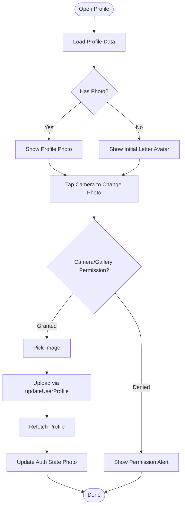

**Diagram sources**
- [ProfileManagement.tsx](file://Estate_link_App/src/Features/ProfileManagement/ProfileManagement.tsx#L218-L367)
- [useProfile.ts](file://Estate_link_App/src/hooks/useProfile.ts#L87-L111)
- [profileService.ts](file://Estate_link_App/src/services/profileService.ts#L173-L242)

**Section sources**
- [ProfileManagement.tsx](file://Estate_link_App/src/Features/ProfileManagement/ProfileManagement.tsx#L1-L811)
- [photoUtils.ts](file://Estate_link_App/src/utils/photoUtils.ts#L10-L61)
- [ProfileImage.tsx](file://Estate_link_App/src/components/ProfileImage.tsx#L1-L101)

### Settings Management
The settings screen provides navigation to:
- Edit General Info: Full personal details editing with validation and image uploads.
- Edit Login Info: Delivery method updates for login credentials.
- Info and Support: Company details, support contacts, and terms navigation.

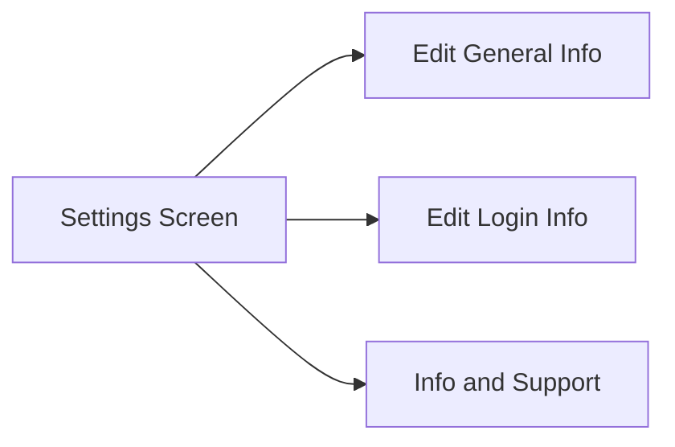

**Diagram sources**
- [ProfileManagementSettings.tsx](file://Estate_link_App/src/Features/ProfileManagement/ProfileManagementSettings/ProfileManagementSettings.tsx#L22-L89)

**Section sources**
- [ProfileManagementSettings.tsx](file://Estate_link_App/src/Features/ProfileManagement/ProfileManagementSettings/ProfileManagementSettings.tsx#L1-L89)

### General Information Editing Workflow
The general info editor supports:
- Pre-populated form from profile data with defensive handling for NID numbers and dates.
- Inline validation using Yup schema with immediate error feedback.
- Camera/gallery integration for NID front/back images with aspect ratios and quality settings.
- Submission via updateUserProfile, followed by profile refetch and auth state sync.

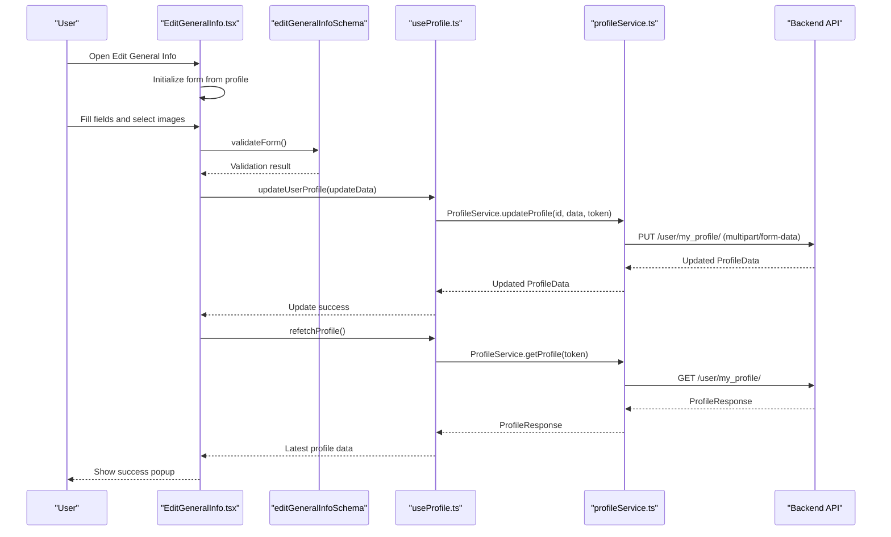

**Diagram sources**
- [EditGeneralInfo.tsx](file://Estate_link_App/src/Features/ProfileManagement/EditGeneralInfoScreen/EditGeneralInfo.tsx#L306-L528)
- [schemas.ts](file://Estate_link_App/src/validation/schemas.ts#L368-L424)
- [useProfile.ts](file://Estate_link_App/src/hooks/useProfile.ts#L87-L111)
- [profileService.ts](file://Estate_link_App/src/services/profileService.ts#L173-L242)

**Section sources**
- [EditGeneralInfo.tsx](file://Estate_link_App/src/Features/ProfileManagement/EditGeneralInfoScreen/EditGeneralInfo.tsx#L1-L993)
- [schemas.ts](file://Estate_link_App/src/validation/schemas.ts#L368-L443)

### Login Information Updates
The login info editor:
- Detects whether login credentials are email or contact-based.
- Validates input against regex patterns for email/phone formats.
- Submits delivery_method updates via updateUserProfile and refetches profile data.

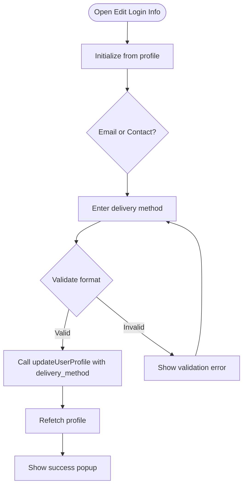

**Diagram sources**
- [EditLoginInfo.tsx](file://Estate_link_App/src/Features/ProfileManagement/EditLoginInfoScreen/EditLoginInfo.tsx#L79-L133)
- [useProfile.ts](file://Estate_link_App/src/hooks/useProfile.ts#L87-L111)
- [profileService.ts](file://Estate_link_App/src/services/profileService.ts#L173-L242)

**Section sources**
- [EditLoginInfo.tsx](file://Estate_link_App/src/Features/ProfileManagement/EditLoginInfoScreen/EditLoginInfo.tsx#L1-L281)

### Info and Support
The info and support screen:
- Displays company branding and address.
- Provides quick access to phone and email support.
- Links to terms and privacy management.

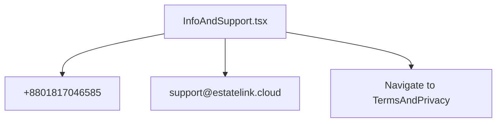

**Diagram sources**
- [InfoAndSupport.tsx](file://Estate_link_App/src/Features/ProfileManagement/InfoAndSupportScreen/InfoAndSupport.tsx#L23-L125)

**Section sources**
- [InfoAndSupport.tsx](file://Estate_link_App/src/Features/ProfileManagement/InfoAndSupportScreen/InfoAndSupport.tsx#L1-L125)

### Terms and Privacy Management
The terms and privacy screen:
- Blocks back navigation when terms are mandatory (e.g., during login flow).
- Allows viewing and reading terms via modal.
- Acceptance sends a POST request to accept terms and updates Redux state.
- Success modal navigates to dashboard after login flow.

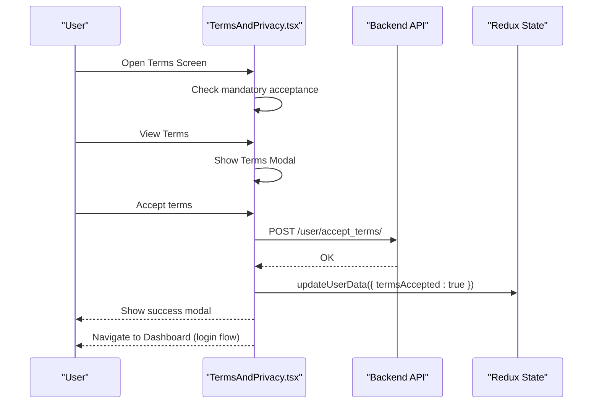

**Diagram sources**
- [TermsAndPrivacy.tsx](file://Estate_link_App/src/Features/ProfileManagement/TermsAndPrivacyScreen/TermsAndPrivacy.tsx#L38-L116)
- [profileSlice.ts](file://Estate_link_App/src/store/slices/profileSlice.ts#L366-L376)

**Section sources**
- [TermsAndPrivacy.tsx](file://Estate_link_App/src/Features/ProfileManagement/TermsAndPrivacyScreen/TermsAndPrivacy.tsx#L1-L222)

### Profile Image Handling
Image handling utilities:
- getPhotoURL constructs absolute URLs for profile and attachment images, supporting absolute URLs, backend/media paths, and media prefixes.
- getInitialLetter generates initials for avatar fallbacks.
- ProfileImage renders optimized images with consistent sizing and fallback icons.

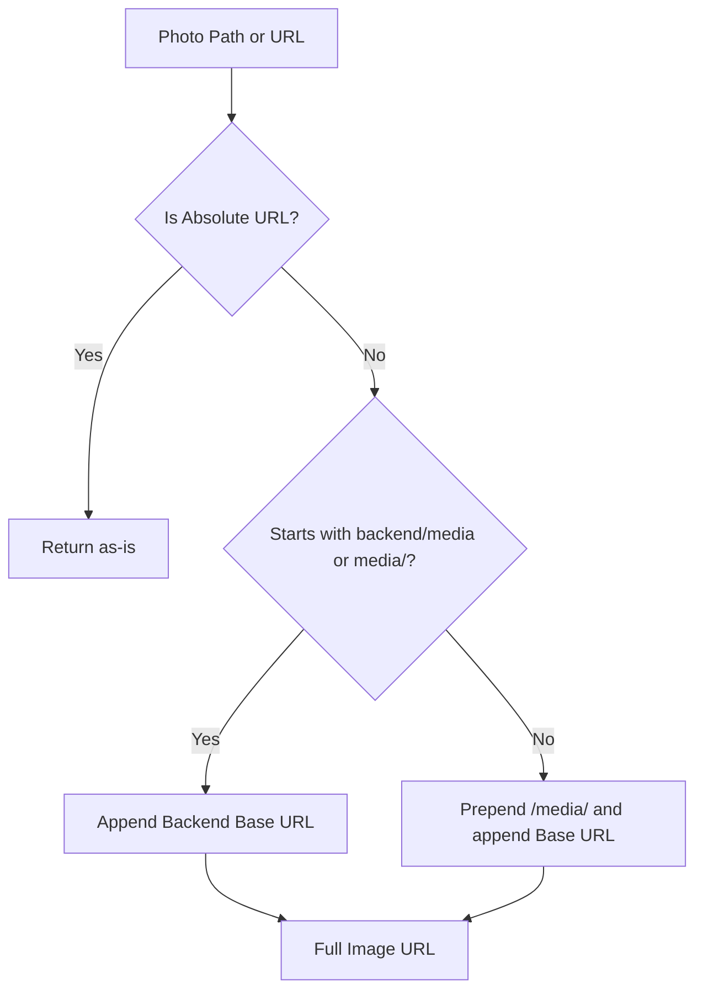

**Diagram sources**
- [photoUtils.ts](file://Estate_link_App/src/utils/photoUtils.ts#L10-L61)
- [ProfileImage.tsx](file://Estate_link_App/src/components/ProfileImage.tsx#L60-L98)

**Section sources**
- [photoUtils.ts](file://Estate_link_App/src/utils/photoUtils.ts#L1-L84)
- [ProfileImage.tsx](file://Estate_link_App/src/components/ProfileImage.tsx#L1-L101)

### Data Validation Processes
Validation is enforced through Yup schemas:
- editGeneralInfoSchema validates general info fields including name, email, gender, date of birth, addresses, and optional NID number.
- Login info editor uses regex-based validation for email and phone formats.
- Validation errors are cleared on user input and displayed inline for immediate feedback.

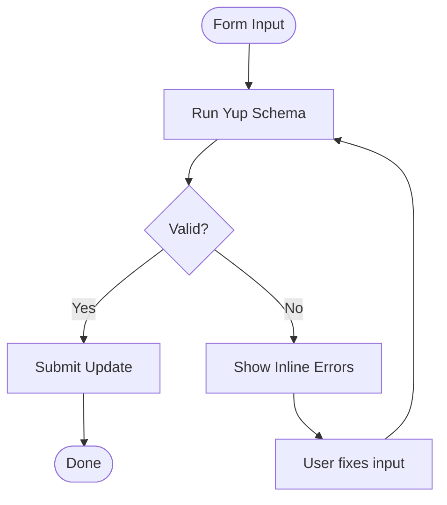

**Diagram sources**
- [schemas.ts](file://Estate_link_App/src/validation/schemas.ts#L368-L443)
- [EditGeneralInfo.tsx](file://Estate_link_App/src/Features/ProfileManagement/EditGeneralInfoScreen/EditGeneralInfo.tsx#L306-L323)
- [EditLoginInfo.tsx](file://Estate_link_App/src/Features/ProfileManagement/EditLoginInfoScreen/EditLoginInfo.tsx#L79-L98)

**Section sources**
- [schemas.ts](file://Estate_link_App/src/validation/schemas.ts#L368-L443)
- [EditGeneralInfo.tsx](file://Estate_link_App/src/Features/ProfileManagement/EditGeneralInfoScreen/EditGeneralInfo.tsx#L306-L323)
- [EditLoginInfo.tsx](file://Estate_link_App/src/Features/ProfileManagement/EditLoginInfoScreen/EditLoginInfo.tsx#L79-L98)

### Integration with Backend Profile APIs
ProfileService encapsulates:
- GET /user/my_profile/ for fetching current user profile.
- PUT /user/my_profile/ for updating profile with multipart/form-data, including profile photo and NID images.
- Additional endpoints for member types, user tower/unit, and member status changes.

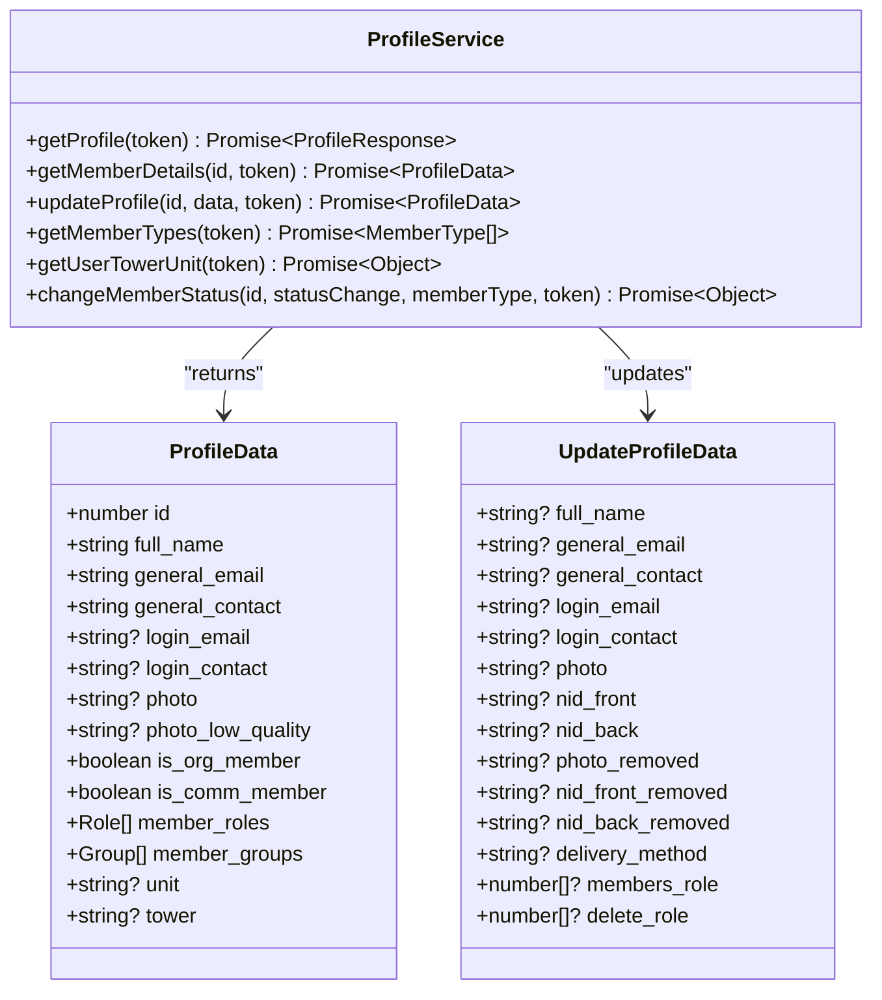

**Diagram sources**
- [profileService.ts](file://Estate_link_App/src/services/profileService.ts#L112-L295)
- [profileSlice.ts](file://Estate_link_App/src/store/slices/profileSlice.ts#L6-L32)

**Section sources**
- [profileService.ts](file://Estate_link_App/src/services/profileService.ts#L1-L295)
- [profileSlice.ts](file://Estate_link_App/src/store/slices/profileSlice.ts#L1-L389)

### Real-Time Updates and Offline Synchronization
Real-time updates:
- useProfile hook automatically refetches profile data on user changes and initial load when authenticated.
- Redux Thunks (fetchProfile, updateProfile) manage loading states and error propagation.

Offline synchronization:
- Profile data is cached in Redux state; updates are merged and persisted until next fetch.
- On logout, profile state is cleared to prevent stale data.

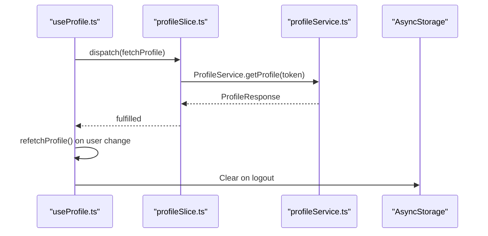

**Diagram sources**
- [useProfile.ts](file://Estate_link_App/src/hooks/useProfile.ts#L119-L167)
- [profileSlice.ts](file://Estate_link_App/src/store/slices/profileSlice.ts#L70-L104)
- [profileSlice.ts](file://Estate_link_App/src/store/slices/profileSlice.ts#L366-L376)

**Section sources**
- [useProfile.ts](file://Estate_link_App/src/hooks/useProfile.ts#L1-L183)
- [profileSlice.ts](file://Estate_link_App/src/store/slices/profileSlice.ts#L1-L389)

## Dependency Analysis
The profile management system exhibits clear separation of concerns:
- UI components depend on useProfile hook and navigation.
- useProfile depends on Redux profileSlice and ProfileService.
- profileSlice depends on ProfileService and authSlice for logout cleanup.
- Validation schemas are consumed by editing screens.
- Utilities like photoUtils are used across screens and components.

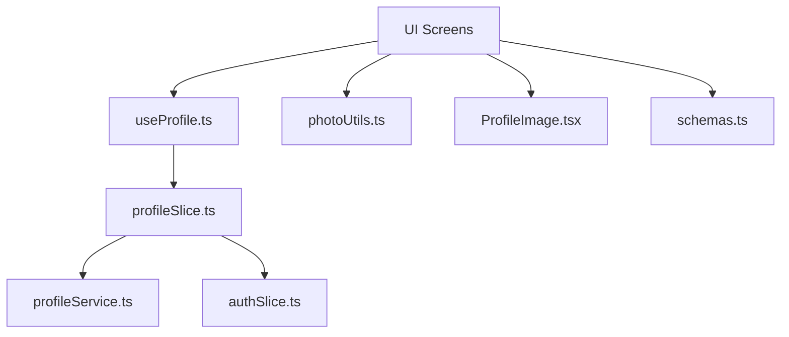

**Diagram sources**
- [useProfile.ts](file://Estate_link_App/src/hooks/useProfile.ts#L1-L183)
- [profileSlice.ts](file://Estate_link_App/src/store/slices/profileSlice.ts#L1-L389)
- [profileService.ts](file://Estate_link_App/src/services/profileService.ts#L1-L295)
- [photoUtils.ts](file://Estate_link_App/src/utils/photoUtils.ts#L1-L84)
- [ProfileImage.tsx](file://Estate_link_App/src/components/ProfileImage.tsx#L1-L101)
- [schemas.ts](file://Estate_link_App/src/validation/schemas.ts#L368-L443)

**Section sources**
- [useProfile.ts](file://Estate_link_App/src/hooks/useProfile.ts#L1-L183)
- [profileSlice.ts](file://Estate_link_App/src/store/slices/profileSlice.ts#L1-L389)
- [profileService.ts](file://Estate_link_App/src/services/profileService.ts#L1-L295)
- [photoUtils.ts](file://Estate_link_App/src/utils/photoUtils.ts#L1-L84)
- [ProfileImage.tsx](file://Estate_link_App/src/components/ProfileImage.tsx#L1-L101)
- [schemas.ts](file://Estate_link_App/src/validation/schemas.ts#L368-L443)

## Performance Considerations
- Image optimization: ProfileImage and getPhotoURL help construct efficient image URLs; consider thumbnail generation and lazy loading for large galleries.
- Network efficiency: Use pull-to-refresh judiciously; debounce frequent updates to reduce redundant API calls.
- State updates: Merge partial updates carefully to avoid unnecessary re-renders; leverage Redux selectors for derived data.
- Validation: Run validations on blur or submit to minimize real-time computation overhead.

## Troubleshooting Guide
Common issues and resolutions:
- Authentication errors: If "not authenticated" appears, ensure the user is logged in and token is available; the system clears non-auth errors to avoid misleading messages.
- Update failures: ProfileService parses backend error responses; check validation messages embedded in error payloads and surface user-friendly messages.
- Image upload problems: Verify camera/gallery permissions and file types; ensure multipart/form-data is constructed correctly with proper filenames and MIME types.
- Terms acceptance: During login flow, back navigation is blocked until acceptance; ensure the acceptance endpoint is reachable and Redux state is updated.

**Section sources**
- [profileSlice.ts](file://Estate_link_App/src/store/slices/profileSlice.ts#L260-L280)
- [profileService.ts](file://Estate_link_App/src/services/profileService.ts#L122-L145)
- [EditGeneralInfo.tsx](file://Estate_link_App/src/Features/ProfileManagement/EditGeneralInfoScreen/EditGeneralInfo.tsx#L494-L528)
- [TermsAndPrivacy.tsx](file://Estate_link_App/src/Features/ProfileManagement/TermsAndPrivacyScreen/TermsAndPrivacy.tsx#L38-L52)

## Conclusion
The mobile profile management system integrates UI, state management, validation, and backend services cohesively. It supports essential user workflows including profile viewing, editing, image uploads, and terms management, with robust error handling and responsive design. The architecture enables maintainability and scalability for future enhancements such as advanced image optimization, offline-first strategies, and expanded validation rules.