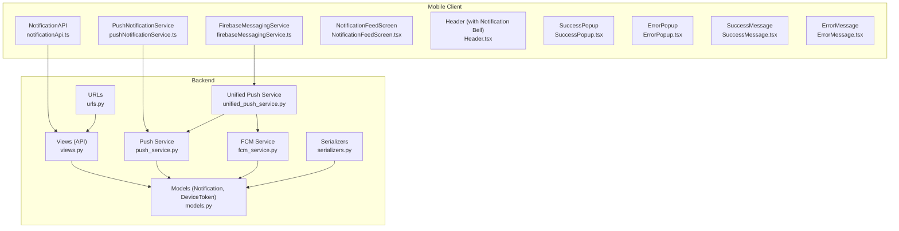
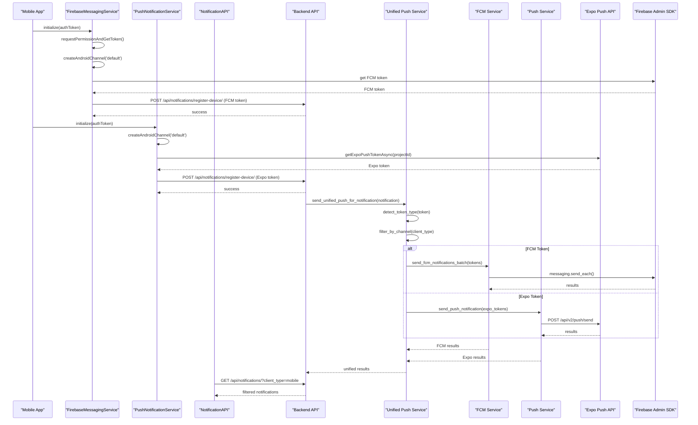
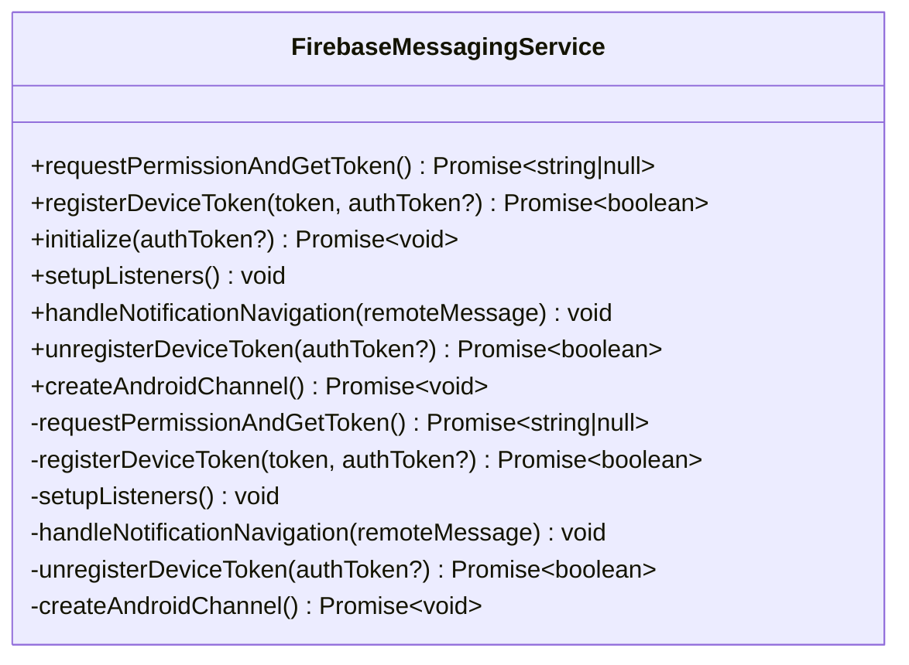
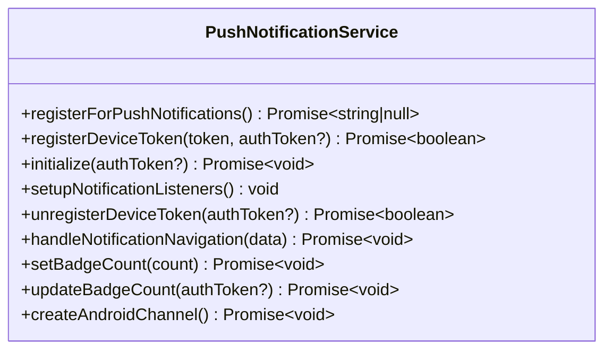
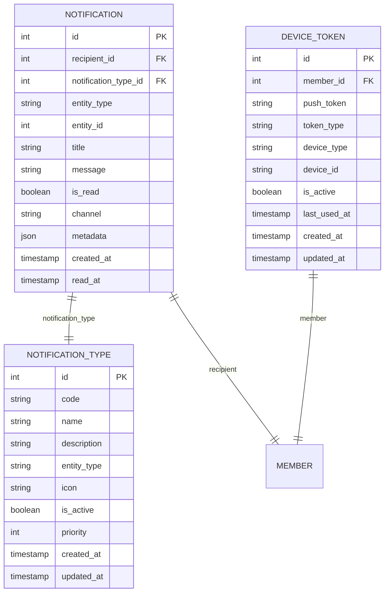
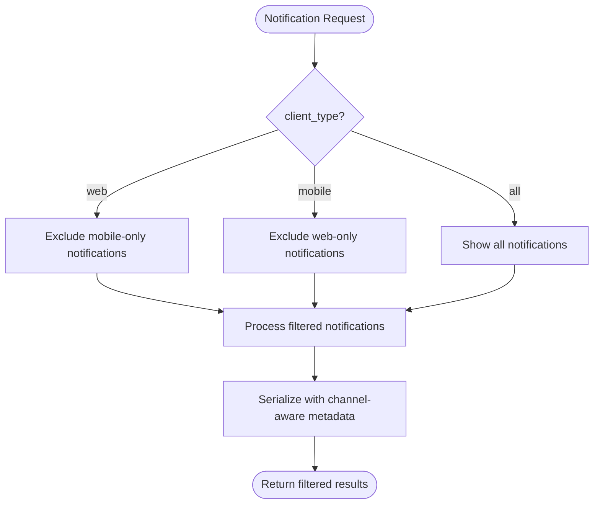
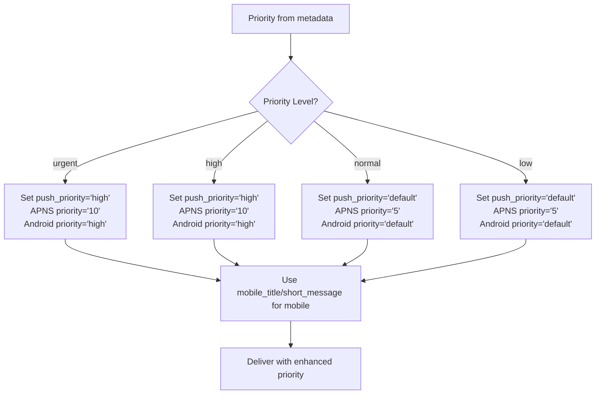
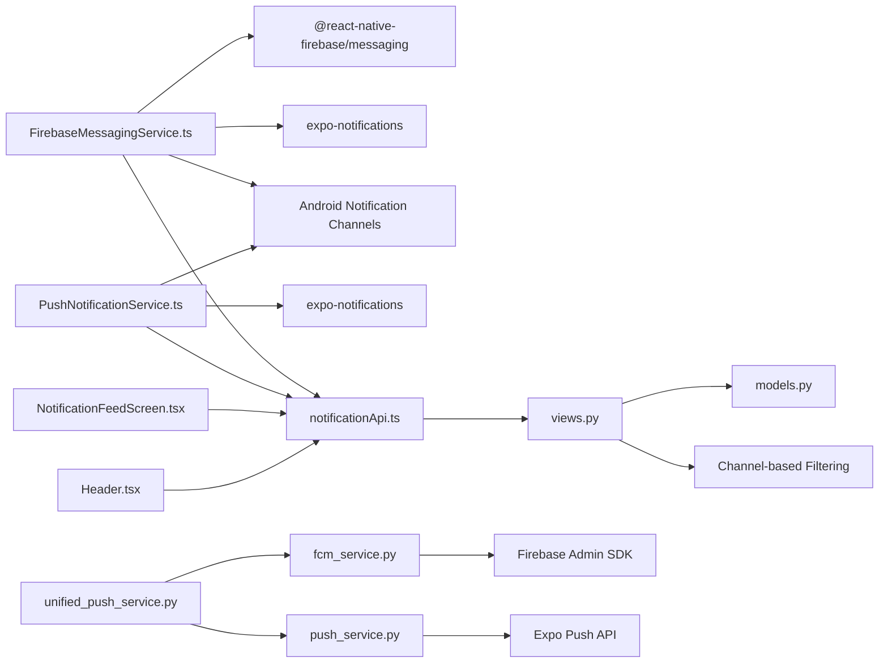

# Push Notifications & Alerts

<cite>
**Referenced Files in This Document**
- [firebaseMessagingService.ts](file://Estate_link_App/src/services/firebaseMessagingService.ts)
- [pushNotificationService.ts](file://Estate_link_App/src/services/pushNotificationService.ts)
- [notificationApi.ts](file://Estate_link_App/src/services/notificationApi.ts)
- [NotificationFeedScreen.tsx](file://Estate_link_App/src/Features/NotificationFeedScreen.tsx)
- [Header.tsx](file://Estate_link_App/components/Header.tsx)
- [SuccessPopup.tsx](file://Estate_link_App/components/SuccessPopup.tsx)
- [ErrorPopup.tsx](file://Estate_link_App/components/ErrorPopup.tsx)
- [SuccessMessage.tsx](file://Estate_link_App/components/SuccessMessage.tsx)
- [ErrorMessage.tsx](file://Estate_link_App/components/ErrorMessage.tsx)
- [fcm_service.py](file://backend/notifications/fcm_service.py)
- [unified_push_service.py](file://backend/notifications/unified_push_service.py)
- [push_service.py](file://backend/notifications/push_service.py)
- [models.py](file://backend/notifications/models.py)
- [views.py](file://backend/notifications/views.py)
- [urls.py](file://backend/notifications/urls.py)
- [serializers.py](file://backend/notifications/serializers.py)
- [google-services.json](file://Estate_link_App/google-services.json)
</cite>

## Update Summary
**Changes Made**
- Enhanced notification system with channel-based filtering capabilities for web and mobile platforms
- Implemented mobile-specific delivery channels with dedicated notification channels
- Improved push notification triggers with priority-based scheduling for immediate delivery
- Enhanced mobile push notification service with better priority handling and delivery reliability
- Added comprehensive mobile notification channel management with Android-specific configurations
- Implemented priority-based notification routing with urgent/high/normal/low priority levels
- Enhanced notification metadata with mobile_title and short_message for resident-friendly content

## Table of Contents
1. [Introduction](#introduction)
2. [Project Structure](#project-structure)
3. [Core Components](#core-components)
4. [Architecture Overview](#architecture-overview)
5. [Detailed Component Analysis](#detailed-component-analysis)
6. [Channel-Based Filtering System](#channel-based-filtering-system)
7. [Priority-Based Notification Delivery](#priority-based-notification-delivery)
8. [Mobile-Specific Enhancements](#mobile-specific-enhancements)
9. [Dependency Analysis](#dependency-analysis)
10. [Performance Considerations](#performance-considerations)
11. [Troubleshooting Guide](#troubleshooting-guide)
12. [Conclusion](#conclusion)

## Introduction
This document describes the enhanced mobile notification system for the Estate Link application. The system now features comprehensive channel-based filtering, mobile-specific delivery channels, and priority-based notification delivery mechanisms. It covers push notification implementation, notification feed display, and in-app alert systems with enhanced cross-platform compatibility and improved delivery reliability. The system supports both Expo Push Notifications and Firebase Cloud Messaging (FCM) for dual-platform notification delivery, with sophisticated channel filtering for web and mobile platforms, priority-based scheduling for immediate delivery, and mobile-specific notification formatting.

## Project Structure
The enhanced notification system spans two primary areas with comprehensive channel-based filtering and priority handling:
- Mobile client (React Native): Firebase messaging service, push notification service with Android channel management, notification feed screen with mobile-specific filtering, header with bell, and popup/alert components
- Backend (Django): Unified push service supporting both Expo and FCM with channel filtering, FCM service for direct Firebase delivery, notification models with channel support, API endpoints with client_type filtering, and serializers

**Diagram sources**
- [firebaseMessagingService.ts](file://Estate_link_App/src/services/firebaseMessagingService.ts#L1-L251)
- [pushNotificationService.ts](file://Estate_link_App/src/services/pushNotificationService.ts#L1-L364)
- [notificationApi.ts](file://Estate_link_App/src/services/notificationApi.ts#L1-L233)
- [NotificationFeedScreen.tsx](file://Estate_link_App/src/Features/NotificationFeedScreen.tsx#L1-L262)
- [Header.tsx](file://Estate_link_App/components/Header.tsx#L1-L360)
- [SuccessPopup.tsx](file://Estate_link_App/components/SuccessPopup.tsx#L1-L153)
- [ErrorPopup.tsx](file://Estate_link_App/components/ErrorPopup.tsx#L1-L153)
- [SuccessMessage.tsx](file://Estate_link_App/components/SuccessMessage.tsx#L1-L94)
- [ErrorMessage.tsx](file://Estate_link_App/components/ErrorMessage.tsx#L1-L24)
- [unified_push_service.py](file://backend/notifications/unified_push_service.py#L1-L380)
- [fcm_service.py](file://backend/notifications/fcm_service.py#L1-L354)
- [push_service.py](file://backend/notifications/push_service.py#L1-L305)
- [models.py](file://backend/notifications/models.py#L1-L257)
- [views.py](file://backend/notifications/views.py#L1-L709)
- [urls.py](file://backend/notifications/urls.py#L1-L19)
- [serializers.py](file://backend/notifications/serializers.py#L1-L136)

**Section sources**
- [firebaseMessagingService.ts](file://Estate_link_App/src/services/firebaseMessagingService.ts#L1-L251)
- [pushNotificationService.ts](file://Estate_link_App/src/services/pushNotificationService.ts#L1-L364)
- [notificationApi.ts](file://Estate_link_App/src/services/notificationApi.ts#L1-L233)
- [NotificationFeedScreen.tsx](file://Estate_link_App/src/Features/NotificationFeedScreen.tsx#L1-L262)
- [Header.tsx](file://Estate_link_App/components/Header.tsx#L1-L360)
- [unified_push_service.py](file://backend/notifications/unified_push_service.py#L1-L380)
- [fcm_service.py](file://backend/notifications/fcm_service.py#L1-L354)
- [push_service.py](file://backend/notifications/push_service.py#L1-L305)
- [models.py](file://backend/notifications/models.py#L1-L257)
- [views.py](file://backend/notifications/views.py#L1-L709)
- [urls.py](file://backend/notifications/urls.py#L1-L19)
- [serializers.py](file://backend/notifications/serializers.py#L1-L136)

## Core Components
- **FirebaseMessagingService**: Enhanced FCM-based messaging service with native FCM token acquisition, registration, and notification processing with Android-specific channel management.
- **PushNotificationService**: Enhanced service with Android notification channel configuration, mobile-specific badge management, and improved navigation handling.
- **Unified Push Service**: Centralized service with channel-based filtering, priority-based routing, and intelligent token type detection for both Expo and FCM.
- **FCM Service**: Direct Firebase Cloud Messaging integration with platform-specific configurations, priority handling, and batch processing capabilities.
- **NotificationAPI**: Enhanced API with client_type filtering for mobile-specific notification retrieval and badge count management.
- **NotificationFeedScreen**: Mobile-optimized notification display with channel-aware filtering, priority-based grouping, and mobile-specific content formatting.
- **Backend Models**: Enhanced Notification model with channel filtering support, priority levels, and comprehensive metadata including mobile_title and short_message.
- **Backend Views**: API endpoints with client_type parameter for channel-specific filtering, priority-based notification retrieval, and mobile-optimized content delivery.

**Section sources**
- [firebaseMessagingService.ts](file://Estate_link_App/src/services/firebaseMessagingService.ts#L8-L251)
- [pushNotificationService.ts](file://Estate_link_App/src/services/pushNotificationService.ts#L25-L364)
- [unified_push_service.py](file://backend/notifications/unified_push_service.py#L21-L167)
- [fcm_service.py](file://backend/notifications/fcm_service.py#L21-L354)
- [notificationApi.ts](file://Estate_link_App/src/services/notificationApi.ts#L48-L233)
- [NotificationFeedScreen.tsx](file://Estate_link_App/src/Features/NotificationFeedScreen.tsx#L16-L262)
- [models.py](file://backend/notifications/models.py#L137-L148)
- [views.py](file://backend/notifications/views.py#L64-L73)

## Architecture Overview
The enhanced system features comprehensive channel-based filtering and priority-based delivery:
- Mobile devices use Android notification channels with MAX importance for critical notifications
- Unified backend service filters notifications by channel based on client_type parameter
- Priority-based notification delivery with urgent, high, normal, and low priority levels
- Mobile-specific content formatting with mobile_title and short_message metadata
- Enhanced badge management synchronized with backend unread counts

**Diagram sources**
- [firebaseMessagingService.ts](file://Estate_link_App/src/services/firebaseMessagingService.ts#L36-L43)
- [pushNotificationService.ts](file://Estate_link_App/src/services/pushNotificationService.ts#L36-L43)
- [unified_push_service.py](file://backend/notifications/unified_push_service.py#L36-L167)
- [fcm_service.py](file://backend/notifications/fcm_service.py#L192-L354)
- [push_service.py](file://backend/notifications/push_service.py#L172-L258)
- [notificationApi.ts](file://Estate_link_App/src/services/notificationApi.ts#L85-L86)

## Detailed Component Analysis

### Enhanced Firebase Messaging Service (Mobile) - **New**
Responsibilities:
- Native FCM token acquisition with Android channel configuration
- Automatic device token registration with backend including channel support
- Foreground and background notification processing with channel awareness
- Mobile-specific notification channel management with MAX importance
- Enhanced badge count synchronization with backend

Key behaviors:
- Creates Android notification channel 'default' with MAX importance for critical notifications
- Uses @react-native-firebase/messaging for native FCM integration
- Handles both foreground and background notification states with channel awareness
- Integrates with Expo Notifications for consistent notification display
- Supports automatic token refresh and backend synchronization

**Diagram sources**
- [firebaseMessagingService.ts](file://Estate_link_App/src/services/firebaseMessagingService.ts#L12-L251)

**Section sources**
- [firebaseMessagingService.ts](file://Estate_link_App/src/services/firebaseMessagingService.ts#L12-L40)
- [firebaseMessagingService.ts](file://Estate_link_App/src/services/firebaseMessagingService.ts#L36-L43)
- [firebaseMessagingService.ts](file://Estate_link_App/src/services/firebaseMessagingService.ts#L84-L139)
- [firebaseMessagingService.ts](file://Estate_link_App/src/services/firebaseMessagingService.ts#L144-L203)
- [firebaseMessagingService.ts](file://Estate_link_App/src/services/firebaseMessagingService.ts#L208-L221)
- [firebaseMessagingService.ts](file://Estate_link_App/src/services/firebaseMessagingService.ts#L226-L249)

### Enhanced Push Notification Service (Mobile) - **Enhanced**
Responsibilities:
- Android notification channel configuration with MAX importance
- Mobile-specific badge management synchronized with backend
- Enhanced navigation handling with improved entity type support
- Improved error handling and logging
- Better integration with unified backend services

Key behaviors:
- Creates Android notification channel 'default' with MAX importance for critical notifications
- Maintains backward compatibility with existing Expo-based implementation
- Supports both camelCase and snake_case notification data formats
- Enhanced badge count synchronization with backend unread counts

**Diagram sources**
- [pushNotificationService.ts](file://Estate_link_App/src/services/pushNotificationService.ts#L30-L364)

**Section sources**
- [pushNotificationService.ts](file://Estate_link_App/src/services/pushNotificationService.ts#L36-L43)
- [pushNotificationService.ts](file://Estate_link_App/src/services/pushNotificationService.ts#L81-L156)
- [pushNotificationService.ts](file://Estate_link_App/src/services/pushNotificationService.ts#L161-L176)
- [pushNotificationService.ts](file://Estate_link_App/src/services/pushNotificationService.ts#L181-L233)
- [pushNotificationService.ts](file://Estate_link_App/src/services/pushNotificationService.ts#L238-L261)
- [pushNotificationService.ts](file://Estate_link_App/src/services/pushNotificationService.ts#L267-L311)
- [pushNotificationService.ts](file://Estate_link_App/src/services/pushNotificationService.ts#L316-L358)

### Enhanced Backend Notification Models - **Enhanced**
Responsibilities:
- DeviceToken model enhanced with token_type field for Expo/FCM distinction
- Notification model with channel filtering support (web, mobile, both)
- Priority levels integrated with notification types for delivery scheduling
- Enhanced metadata support including mobile_title and short_message
- Improved token type classification and validation

**Diagram sources**
- [models.py](file://backend/notifications/models.py#L93-L188)
- [models.py](file://backend/notifications/models.py#L190-L256)

**Section sources**
- [models.py](file://backend/notifications/models.py#L137-L148)
- [models.py](file://backend/notifications/models.py#L190-L256)

### Enhanced Backend Notification API - **Enhanced**
Endpoints with channel filtering support:
- GET /api/notifications/: list notifications with client_type filtering (web/mobile/all)
- GET /api/notifications/<id>/: get notification detail
- PATCH /api/notifications/<id>/: update notification (only is_read)
- DELETE /api/notifications/<id>/: delete notification
- POST /api/notifications/mark-all-read/: mark all as read (mobile-optimized)
- GET /api/notifications/unread-count/: get unread count (mobile-optimized)
- POST /api/notifications/register-device/: register/update device token (supports both Expo and FCM)
- POST /api/notifications/unregister-device/: deactivate device token

**Section sources**
- [views.py](file://backend/notifications/views.py#L64-L73)
- [views.py](file://backend/notifications/views.py#L134-L151)
- [notificationApi.ts](file://Estate_link_App/src/services/notificationApi.ts#L85-L86)

## Channel-Based Filtering System
The enhanced notification system implements sophisticated channel-based filtering for optimal delivery across platforms:

### Channel Types
- **Web Only**: Notifications delivered only to web clients, excluded from mobile delivery
- **Mobile Only**: Notifications delivered only to mobile clients, excluded from web delivery  
- **Both**: Notifications delivered to both web and mobile clients

### Implementation Details
- Backend filtering uses client_type query parameter (web, mobile, all)
- Mobile app automatically sets client_type=mobile for all API calls
- Channel filtering occurs at database level for optimal performance
- Notification metadata supports mobile-specific content formatting

**Diagram sources**
- [views.py](file://backend/notifications/views.py#L64-L73)
- [notificationApi.ts](file://Estate_link_App/src/services/notificationApi.ts#L85-L86)

**Section sources**
- [views.py](file://backend/notifications/views.py#L64-L73)
- [notificationApi.ts](file://Estate_link_App/src/services/notificationApi.ts#L85-L86)

## Priority-Based Notification Delivery
The system implements comprehensive priority-based delivery with urgent, high, normal, and low priority levels:

### Priority Levels
- **Urgent**: Highest priority with immediate delivery and high importance
- **High**: High priority with enhanced delivery reliability
- **Normal**: Standard priority with regular delivery timing
- **Low**: Lower priority with delayed delivery optimization

### Implementation Details
- Priority extracted from notification metadata with fallback to normal
- FCM APNS priority headers set to '10' for urgent, '5' for high, 'default' otherwise
- Android notification priority set to 'high' for urgent/high, 'default' otherwise
- Mobile-specific content formatting with mobile_title and short_message for resident-friendly notifications

**Diagram sources**
- [unified_push_service.py](file://backend/notifications/unified_push_service.py#L269-L271)
- [fcm_service.py](file://backend/notifications/fcm_service.py#L135-L149)
- [push_service.py](file://backend/notifications/push_service.py#L312-L314)

**Section sources**
- [unified_push_service.py](file://backend/notifications/unified_push_service.py#L269-L271)
- [fcm_service.py](file://backend/notifications/fcm_service.py#L118-L149)
- [push_service.py](file://backend/notifications/push_service.py#L312-L314)

## Mobile-Specific Enhancements
The system includes comprehensive mobile-specific optimizations:

### Android Channel Management
- Default notification channel created with MAX importance for critical notifications
- Vibration patterns configured for mobile-specific user experience
- Light color settings for notification indicators
- Channel importance levels optimized for mobile delivery

### Mobile Content Formatting
- mobile_title and short_message metadata for resident-friendly notifications
- Priority-based title formatting (Urgent Announcement, Important Announcement)
- Label-based notification categorization
- Entity-specific metadata for navigation

### Badge Management
- Automatic badge count synchronization with backend unread counts
- Mobile-optimized badge display with proper count updates
- Background badge updates for offline users

**Section sources**
- [firebaseMessagingService.ts](file://Estate_link_App/src/services/firebaseMessagingService.ts#L36-L43)
- [pushNotificationService.ts](file://Estate_link_App/src/services/pushNotificationService.ts#L36-L43)
- [NotificationFeedScreen.tsx](file://Estate_link_App/src/Features/NotificationFeedScreen.tsx#L150-L157)

## Dependency Analysis
- Mobile client enhanced with:
  - @react-native-firebase/messaging for native FCM support with Android channel management
  - @firebase/messaging for web-compatible FCM integration
  - Enhanced fetch utilities for API calls with client_type filtering
  - Auth utilities for bearer tokens
  - Navigation container for deep linking
- Backend enhanced with:
  - Firebase Admin SDK for direct FCM message delivery with priority handling
  - Unified push service for intelligent token routing with channel filtering
  - Enhanced device token management with token type support
  - Improved error handling and logging across both notification platforms
  - Channel-based filtering for optimal delivery across platforms

**Diagram sources**
- [firebaseMessagingService.ts](file://Estate_link_App/src/services/firebaseMessagingService.ts#L1-L6)
- [pushNotificationService.ts](file://Estate_link_App/src/services/pushNotificationService.ts#L1-L7)
- [unified_push_service.py](file://backend/notifications/unified_push_service.py#L9-L16)
- [fcm_service.py](file://backend/notifications/fcm_service.py#L12-L15)

**Section sources**
- [firebaseMessagingService.ts](file://Estate_link_App/src/services/firebaseMessagingService.ts#L1-L6)
- [pushNotificationService.ts](file://Estate_link_App/src/services/pushNotificationService.ts#L1-L7)
- [unified_push_service.py](file://backend/notifications/unified_push_service.py#L9-L16)
- [fcm_service.py](file://backend/notifications/fcm_service.py#L12-L15)

## Performance Considerations
- Mobile:
  - Android notification channels improve delivery reliability and user experience
  - Channel-based filtering reduces unnecessary notification processing
  - Priority-based delivery optimizes resource usage for urgent notifications
  - Enhanced badge management prevents excessive badge count updates
- Backend:
  - Channel filtering occurs at database level for optimal performance
  - Unified push service processes tokens in batches with intelligent routing
  - Priority-based routing reduces delivery failures for high-priority notifications
  - Mobile-specific content formatting minimizes data transfer overhead

## Troubleshooting Guide
Common issues and resolutions:
- **Channel filtering issues**:
  - Verify client_type parameter is set to 'mobile' for mobile app API calls
  - Check channel field values (web, mobile, both) in notification records
  - Ensure mobile app is using NotificationAPI with client_type filtering
- **Priority delivery problems**:
  - Verify priority metadata is correctly set in notification records
  - Check FCM APNS priority headers for urgent/high priority notifications
  - Ensure Android notification priority is set correctly for mobile delivery
- **Mobile-specific content issues**:
  - Verify mobile_title and short_message metadata exists for notice notifications
  - Check notification type icon availability for mobile display
  - Ensure entity-specific metadata is properly formatted for navigation
- **Android channel problems**:
  - Verify Android notification channel 'default' is created during initialization
  - Check channel importance level is set to MAX for critical notifications
  - Ensure vibration patterns and light colors are properly configured

**Section sources**
- [views.py](file://backend/notifications/views.py#L64-L73)
- [notificationApi.ts](file://Estate_link_App/src/services/notificationApi.ts#L85-L86)
- [firebaseMessagingService.ts](file://Estate_link_App/src/services/firebaseMessagingService.ts#L36-L43)
- [fcm_service.py](file://backend/notifications/fcm_service.py#L135-L149)

## Conclusion
The enhanced mobile notification system provides a comprehensive, channel-aware, priority-based notification delivery solution. The system now supports sophisticated channel filtering for optimal delivery across web and mobile platforms, with priority-based scheduling for immediate delivery of urgent notifications. Mobile-specific enhancements include Android notification channels, mobile-friendly content formatting, and enhanced badge management. The unified push service intelligently routes notifications based on token type while respecting channel preferences and priority levels. This hybrid approach ensures maximum reach across different device types and platforms while maintaining system reliability, performance, and user experience optimization.