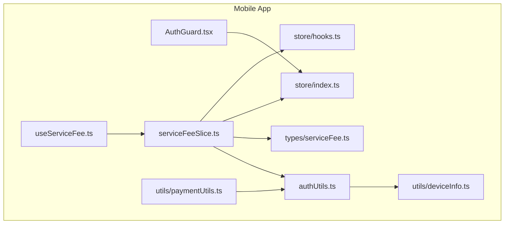
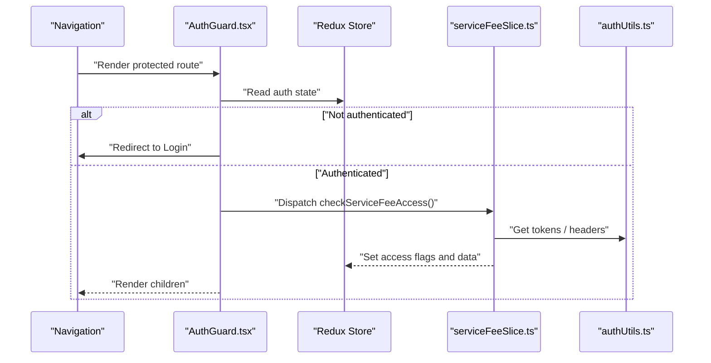
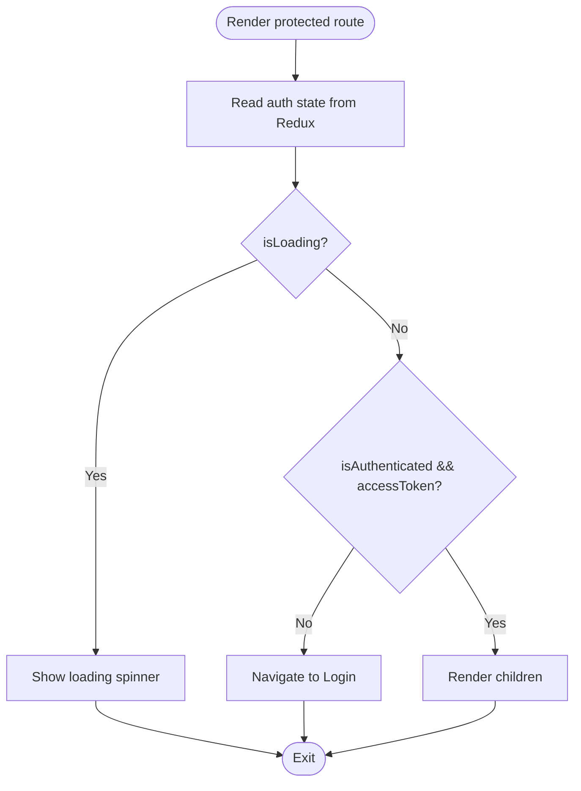
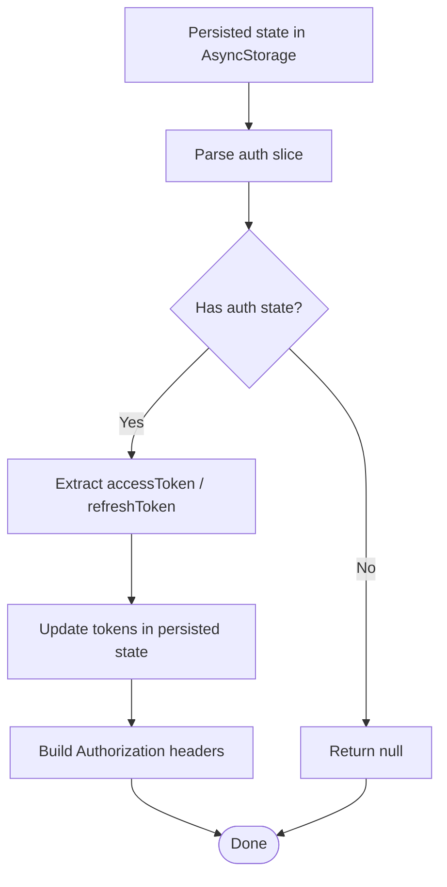
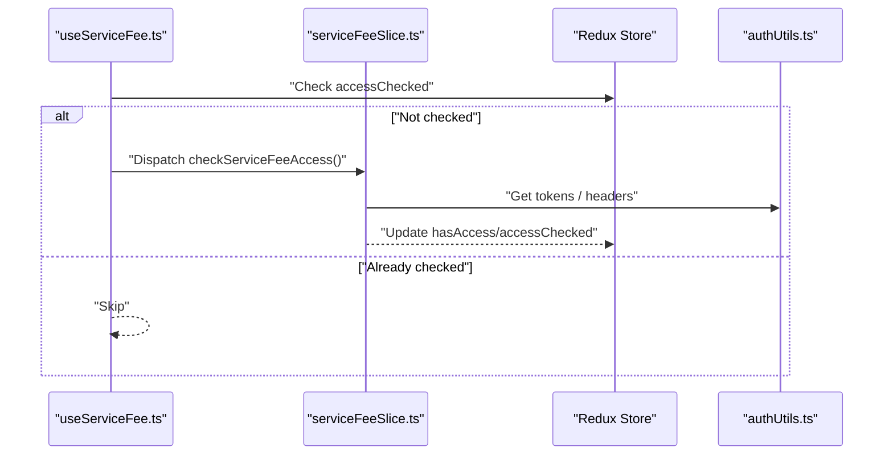
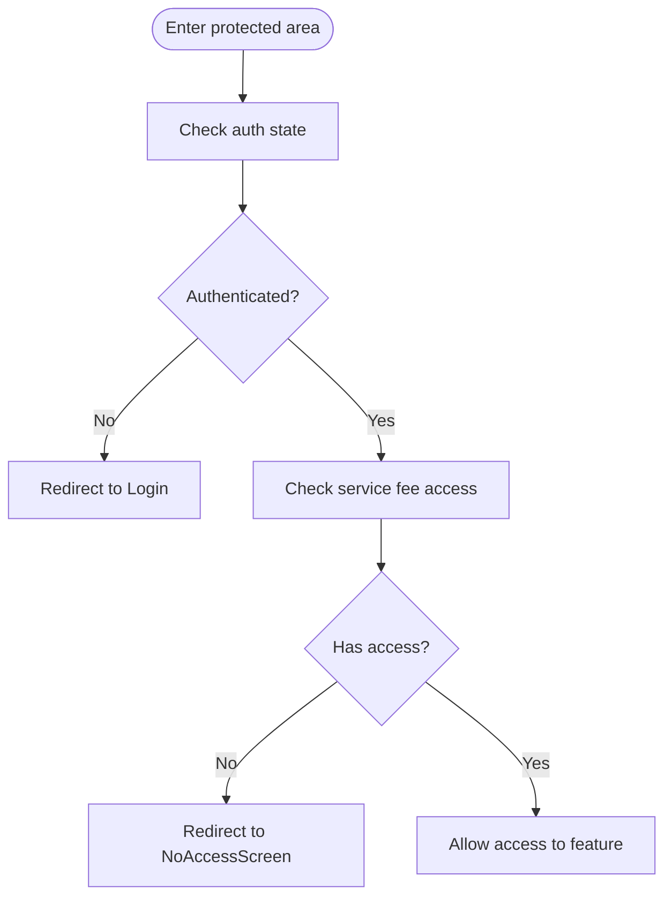
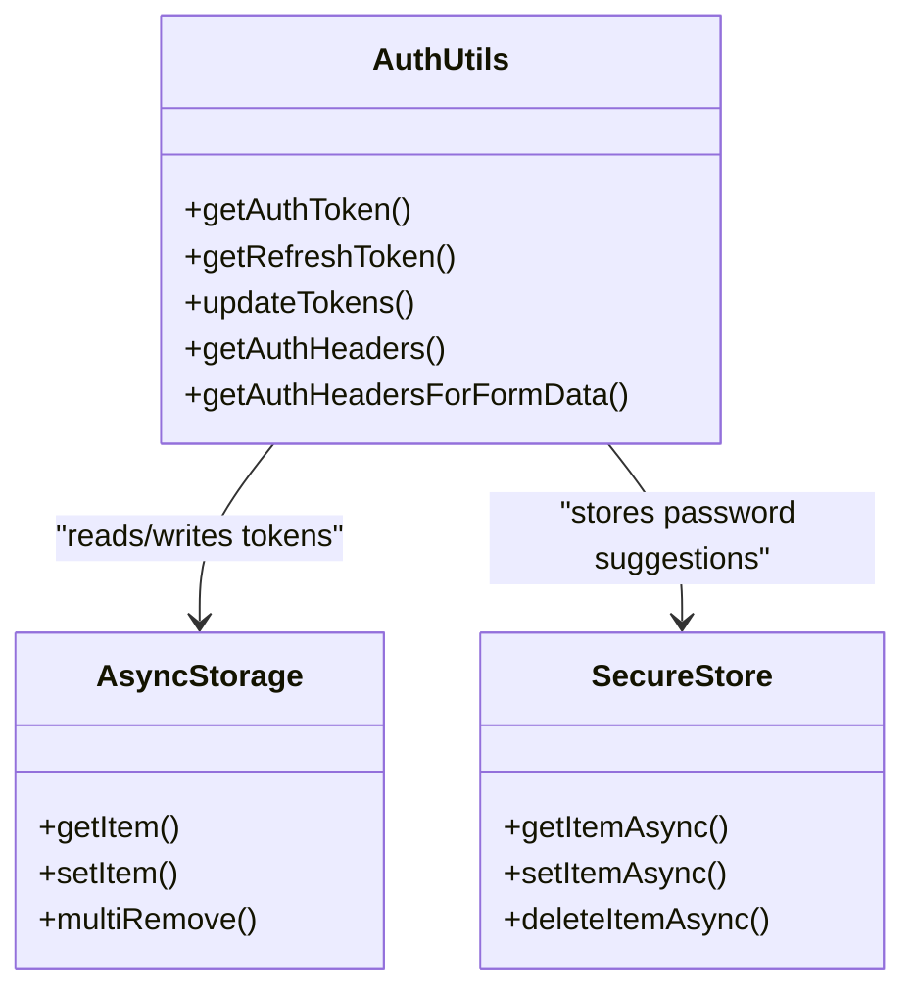
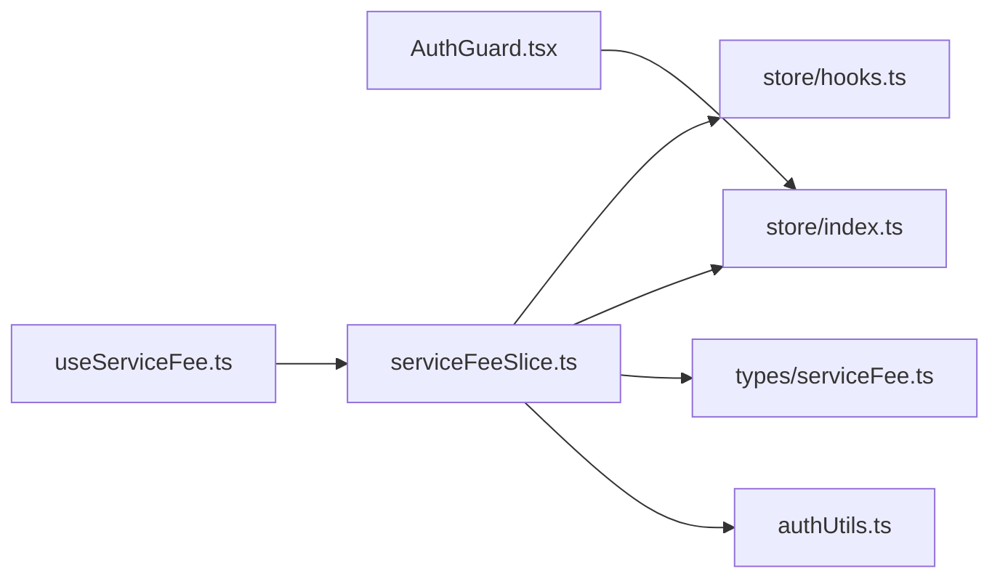

# Access Control & Security

<cite>
**Referenced Files in This Document**
- [AuthGuard.tsx](file://Estate_link_App/src/components/AuthGuard.tsx)
- [authUtils.ts](file://Estate_link_App/src/utils/authUtils.ts)
- [useServiceFee.ts](file://Estate_link_App/src/hooks/useServiceFee.ts)
- [serviceFeeSlice.ts](file://Estate_link_App/src/store/slices/serviceFeeSlice.ts)
- [index.ts](file://Estate_link_App/src/store/index.ts)
- [hooks.ts](file://Estate_link_App/src/store/hooks.ts)
- [serviceFee.ts](file://Estate_link_App/src/types/serviceFee.ts)
- [paymentUtils.ts](file://Estate_link_App/src/utils/paymentUtils.ts)
- [deviceInfo.ts](file://Estate_link_App/src/utils/deviceInfo.ts)
</cite>

## Table of Contents
1. [Introduction](#introduction)
2. [Project Structure](#project-structure)
3. [Core Components](#core-components)
4. [Architecture Overview](#architecture-overview)
5. [Detailed Component Analysis](#detailed-component-analysis)
6. [Dependency Analysis](#dependency-analysis)
7. [Performance Considerations](#performance-considerations)
8. [Security Considerations](#security-considerations)
9. [Troubleshooting Guide](#troubleshooting-guide)
10. [Conclusion](#conclusion)

## Introduction
This document describes the mobile service fee access control and security system. It explains how user authorization is enforced, how permissions are validated, and how access restrictions are applied. It also documents the integration with backend authentication, token management, and session handling, along with security considerations for protecting payment data and ensuring compliance with financial regulations. Mobile-specific protections such as secure storage and encrypted credentials are covered.

## Project Structure
The access control and security system spans three primary areas:
- Authentication guard and routing enforcement
- Token retrieval, updates, and header generation utilities
- Redux-based service fee access checks and state management

**Diagram sources**
- [AuthGuard.tsx](file://Estate_link_App/src/components/AuthGuard.tsx#L1-L42)
- [authUtils.ts](file://Estate_link_App/src/utils/authUtils.ts#L1-L219)
- [useServiceFee.ts](file://Estate_link_App/src/hooks/useServiceFee.ts#L1-L188)
- [serviceFeeSlice.ts](file://Estate_link_App/src/store/slices/serviceFeeSlice.ts)
- [index.ts](file://Estate_link_App/src/store/index.ts)
- [hooks.ts](file://Estate_link_App/src/store/hooks.ts)
- [serviceFee.ts](file://Estate_link_App/src/types/serviceFee.ts#L1-L97)
- [paymentUtils.ts](file://Estate_link_App/src/utils/paymentUtils.ts)
- [deviceInfo.ts](file://Estate_link_App/src/utils/deviceInfo.ts)

**Section sources**
- [AuthGuard.tsx](file://Estate_link_App/src/components/AuthGuard.tsx#L1-L42)
- [authUtils.ts](file://Estate_link_App/src/utils/authUtils.ts#L1-L219)
- [useServiceFee.ts](file://Estate_link_App/src/hooks/useServiceFee.ts#L1-L188)
- [serviceFeeSlice.ts](file://Estate_link_App/src/store/slices/serviceFeeSlice.ts)
- [index.ts](file://Estate_link_App/src/store/index.ts)
- [hooks.ts](file://Estate_link_App/src/store/hooks.ts)
- [serviceFee.ts](file://Estate_link_App/src/types/serviceFee.ts#L1-L97)
- [paymentUtils.ts](file://Estate_link_App/src/utils/paymentUtils.ts)
- [deviceInfo.ts](file://Estate_link_App/src/utils/deviceInfo.ts)

## Core Components
- AuthGuard enforces authentication at the navigation level. It redirects unauthenticated users to the login screen and renders a loading indicator while authentication state resolves.
- authUtils centralizes token retrieval, refresh token handling, token updates, and Authorization header construction. It uses AsyncStorage for persisted state and Expo SecureStore for secure password suggestions keyed by username.
- useServiceFee integrates with Redux to check service fee access on mount and exposes computed values and actions for managing units, payments, filters, and access flags.
- serviceFeeSlice manages service fee domain state, including access flags, units, payments, and upcoming billings. It orchestrates access checks and interacts with auth utilities for headers and tokens.
- Types define the shape of service fee payments, units, statistics, filter options, and filters to support type-safe access control and UI rendering.
- paymentUtils and deviceInfo provide supporting utilities for payment-related operations and device metadata that can influence security posture.

**Section sources**
- [AuthGuard.tsx](file://Estate_link_App/src/components/AuthGuard.tsx#L10-L41)
- [authUtils.ts](file://Estate_link_App/src/utils/authUtils.ts#L4-L72)
- [useServiceFee.ts](file://Estate_link_App/src/hooks/useServiceFee.ts#L24-L186)
- [serviceFeeSlice.ts](file://Estate_link_App/src/store/slices/serviceFeeSlice.ts)
- [serviceFee.ts](file://Estate_link_App/src/types/serviceFee.ts#L1-L97)
- [paymentUtils.ts](file://Estate_link_App/src/utils/paymentUtils.ts)
- [deviceInfo.ts](file://Estate_link_App/src/utils/deviceInfo.ts)

## Architecture Overview
The system enforces access control through a layered approach:
- UI guard prevents unauthorized navigation until authentication is confirmed.
- Redux slice performs domain-specific access checks and maintains access flags.
- Utilities supply tokens and build authenticated requests.
- Types ensure consistent data structures across components.

**Diagram sources**
- [AuthGuard.tsx](file://Estate_link_App/src/components/AuthGuard.tsx#L14-L23)
- [useServiceFee.ts](file://Estate_link_App/src/hooks/useServiceFee.ts#L48-L58)
- [serviceFeeSlice.ts](file://Estate_link_App/src/store/slices/serviceFeeSlice.ts)
- [authUtils.ts](file://Estate_link_App/src/utils/authUtils.ts#L4-L72)

## Detailed Component Analysis

### AuthGuard: Authentication Enforcement
- Purpose: Prevents rendering of protected screens until authentication is verified. Displays a loader while resolving authentication state.
- Behavior:
  - Reads authentication state from Redux.
  - Redirects to the login screen if not authenticated or missing tokens.
  - Renders a loading spinner during authentication resolution.
  - Returns null if not authenticated; otherwise renders children.

**Diagram sources**
- [AuthGuard.tsx](file://Estate_link_App/src/components/AuthGuard.tsx#L14-L32)

**Section sources**
- [AuthGuard.tsx](file://Estate_link_App/src/components/AuthGuard.tsx#L10-L41)

### Token Management and Authorization Headers
- Token retrieval:
  - Access token and refresh token are extracted from persisted Redux state stored in AsyncStorage.
- Token updates:
  - Tokens are updated atomically in the persisted state to maintain consistency.
- Authorization headers:
  - Helpers construct Authorization headers for JSON and FormData requests.
- Secure storage:
  - Password suggestions are stored securely using Expo SecureStore, keyed by sanitized usernames.

**Diagram sources**
- [authUtils.ts](file://Estate_link_App/src/utils/authUtils.ts#L4-L72)

**Section sources**
- [authUtils.ts](file://Estate_link_App/src/utils/authUtils.ts#L4-L72)
- [authUtils.ts](file://Estate_link_App/src/utils/authUtils.ts#L158-L217)

### Service Fee Access Control Hook and Slice
- Access check on mount:
  - The hook triggers a service fee access check when access has not been evaluated yet.
- Exposed state and actions:
  - Access flags (hasAccess, accessChecked) and data loaders (units, payments, upcoming billings).
  - Actions for filtering, selection, and lifecycle management.
- Data types:
  - Strongly typed models for payments, units, statistics, and filters.

**Diagram sources**
- [useServiceFee.ts](file://Estate_link_App/src/hooks/useServiceFee.ts#L48-L58)
- [serviceFeeSlice.ts](file://Estate_link_App/src/store/slices/serviceFeeSlice.ts)
- [authUtils.ts](file://Estate_link_App/src/utils/authUtils.ts#L4-L72)

**Section sources**
- [useServiceFee.ts](file://Estate_link_App/src/hooks/useServiceFee.ts#L24-L186)
- [serviceFee.ts](file://Estate_link_App/src/types/serviceFee.ts#L1-L97)

### NoAccessScreen Functionality
- Conceptual overview:
  - When access is denied or not yet determined, the system should prevent navigation to payment screens and display an appropriate access-restricted screen.
  - AuthGuard handles redirection to the login screen for unauthenticated users.
  - Domain-level access checks (via the service fee slice) can set access flags to block rendering of payment features until authorized.
- Implementation guidance:
  - Introduce a dedicated NoAccessScreen component to render when hasAccess is false.
  - Gate feature rendering using the hasAccess flag from the service fee state.
  - Combine AuthGuard with domain access checks to ensure robust protection.

[No sources needed since this section provides conceptual guidance]

### Permission Validation and User Redirection Logic
- Authentication validation:
  - AuthGuard ensures users are authenticated before rendering protected screens.
- Domain permission validation:
  - The service fee slice evaluates whether the user has access to service fee features.
- Redirection:
  - Unauthenticated users are redirected to the login screen.
  - Unauthorized users are redirected away from payment features or shown a restricted screen.

**Diagram sources**
- [AuthGuard.tsx](file://Estate_link_App/src/components/AuthGuard.tsx#L14-L23)
- [useServiceFee.ts](file://Estate_link_App/src/hooks/useServiceFee.ts#L48-L58)

**Section sources**
- [AuthGuard.tsx](file://Estate_link_App/src/components/AuthGuard.tsx#L14-L23)
- [useServiceFee.ts](file://Estate_link_App/src/hooks/useServiceFee.ts#L48-L58)

### Integration with Backend Authentication, Token Management, and Session Handling
- Token persistence:
  - Tokens are stored in AsyncStorage under the persisted Redux state and updated atomically.
- Header construction:
  - Authorization headers are built using the Bearer scheme for authenticated requests.
- Session handling:
  - The system relies on persisted tokens and does not implement explicit session expiration handling in the provided files.

**Diagram sources**
- [authUtils.ts](file://Estate_link_App/src/utils/authUtils.ts#L4-L72)
- [authUtils.ts](file://Estate_link_App/src/utils/authUtils.ts#L158-L217)

**Section sources**
- [authUtils.ts](file://Estate_link_App/src/utils/authUtils.ts#L4-L72)
- [authUtils.ts](file://Estate_link_App/src/utils/authUtils.ts#L158-L217)

## Dependency Analysis
- AuthGuard depends on navigation and Redux auth state to enforce access.
- useServiceFee depends on serviceFeeSlice for access checks and state.
- serviceFeeSlice depends on authUtils for tokens and headers.
- Types provide compile-time safety for service fee domain data.

**Diagram sources**
- [AuthGuard.tsx](file://Estate_link_App/src/components/AuthGuard.tsx#L1-L42)
- [useServiceFee.ts](file://Estate_link_App/src/hooks/useServiceFee.ts#L1-L188)
- [serviceFeeSlice.ts](file://Estate_link_App/src/store/slices/serviceFeeSlice.ts)
- [authUtils.ts](file://Estate_link_App/src/utils/authUtils.ts#L1-L219)
- [serviceFee.ts](file://Estate_link_App/src/types/serviceFee.ts#L1-L97)
- [index.ts](file://Estate_link_App/src/store/index.ts)
- [hooks.ts](file://Estate_link_App/src/store/hooks.ts)

**Section sources**
- [AuthGuard.tsx](file://Estate_link_App/src/components/AuthGuard.tsx#L1-L42)
- [useServiceFee.ts](file://Estate_link_App/src/hooks/useServiceFee.ts#L1-L188)
- [serviceFeeSlice.ts](file://Estate_link_App/src/store/slices/serviceFeeSlice.ts)
- [authUtils.ts](file://Estate_link_App/src/utils/authUtils.ts#L1-L219)
- [serviceFee.ts](file://Estate_link_App/src/types/serviceFee.ts#L1-L97)
- [index.ts](file://Estate_link_App/src/store/index.ts)
- [hooks.ts](file://Estate_link_App/src/store/hooks.ts)

## Performance Considerations
- Minimize re-renders by memoizing callbacks in the service fee hook.
- Debounce or throttle access checks to avoid redundant network calls.
- Cache access decisions locally to reduce repeated backend validation.
- Use lazy loading for heavy components behind access controls.

[No sources needed since this section provides general guidance]

## Security Considerations
- Payment data protection:
  - Avoid logging sensitive payment data. Mask PII and monetary amounts in logs.
  - Sanitize user inputs and validate payloads server-side.
- Secure communication:
  - Enforce HTTPS/TLS for all network requests.
  - Pin certificates if necessary and monitor for certificate transparency.
- Compliance with financial regulations:
  - Follow PCI DSS for cardholder data if applicable.
  - Implement audit trails for payment events and access attempts.
- Mobile-specific protections:
  - Use secure storage for tokens and sensitive data (as implemented).
  - Avoid storing secrets in plain text; leverage platform keychains and secure stores.
  - Consider biometric authentication prompts for sensitive operations (conceptual enhancement).
- Token lifecycle:
  - Implement token refresh mechanisms and secure storage for refresh tokens.
  - Invalidate tokens on logout and clear persisted state.
- Device integrity:
  - Monitor for jailbreak/root and tampering indicators via deviceInfo utilities.
  - Apply transport layer security and consider device-bound keys.

**Section sources**
- [authUtils.ts](file://Estate_link_App/src/utils/authUtils.ts#L158-L217)
- [deviceInfo.ts](file://Estate_link_App/src/utils/deviceInfo.ts)

## Troubleshooting Guide
- Users stuck on loading:
  - Verify authentication state is being written to Redux and persisted in AsyncStorage.
  - Confirm that the AuthGuard receives non-loading state before rendering children.
- Redirect loops to login:
  - Ensure tokens are present and valid; check token parsing logic.
  - Validate that the persisted state structure matches expectations.
- Access denied unexpectedly:
  - Confirm that the service fee access check completes and sets access flags.
  - Review network errors and backend responses for access validation.
- Token not found:
  - Inspect AsyncStorage keys and persisted state structure.
  - Verify that updateTokens writes to the correct slice of the persisted state.

**Section sources**
- [AuthGuard.tsx](file://Estate_link_App/src/components/AuthGuard.tsx#L14-L32)
- [authUtils.ts](file://Estate_link_App/src/utils/authUtils.ts#L4-L72)
- [useServiceFee.ts](file://Estate_link_App/src/hooks/useServiceFee.ts#L48-L58)

## Conclusion
The mobile service fee access control system combines a navigation guard with domain-level access checks and robust token management. By centralizing authentication utilities and enforcing access at both routing and feature levels, the system provides a strong foundation for secure payment workflows. Enhancements such as biometric prompts, stricter token refresh, and device integrity checks can further strengthen security and compliance.