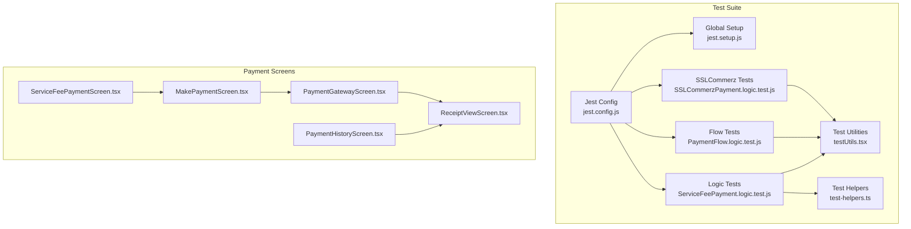
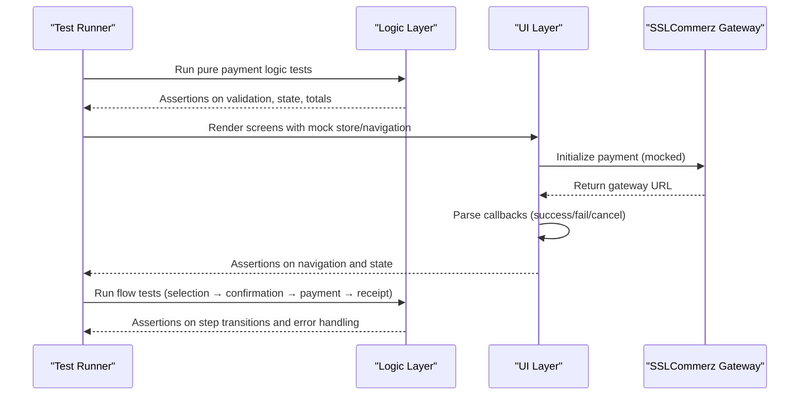
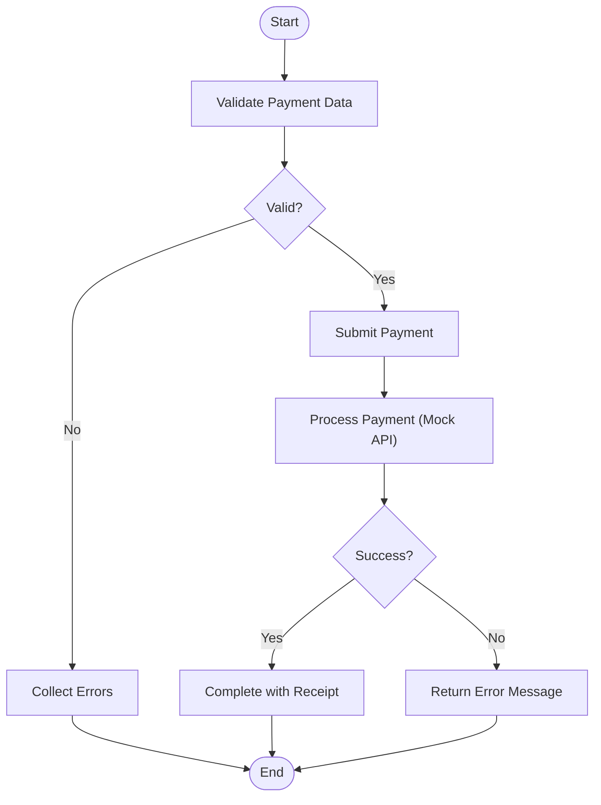
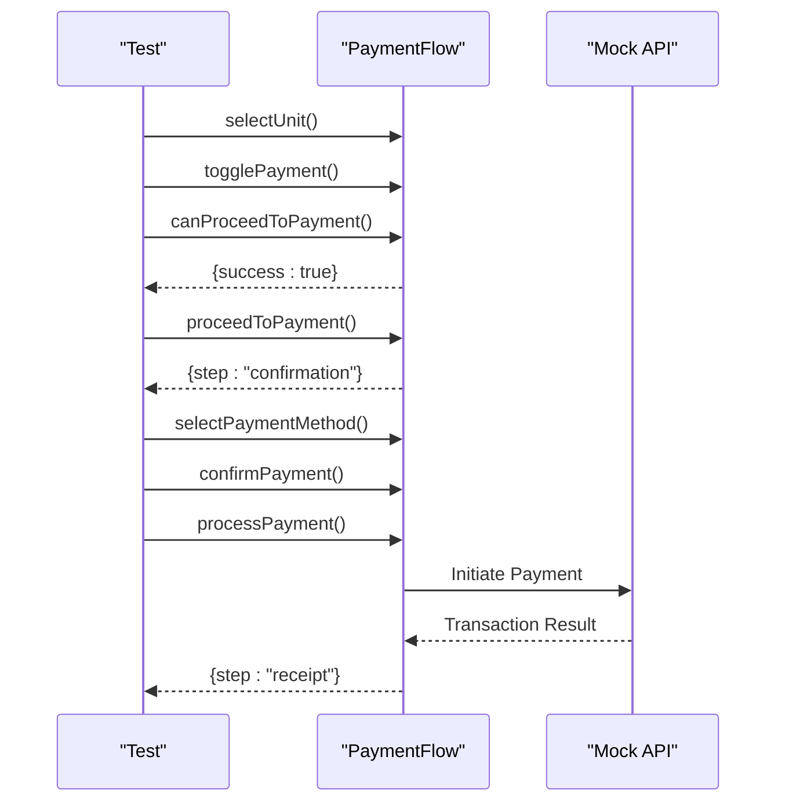
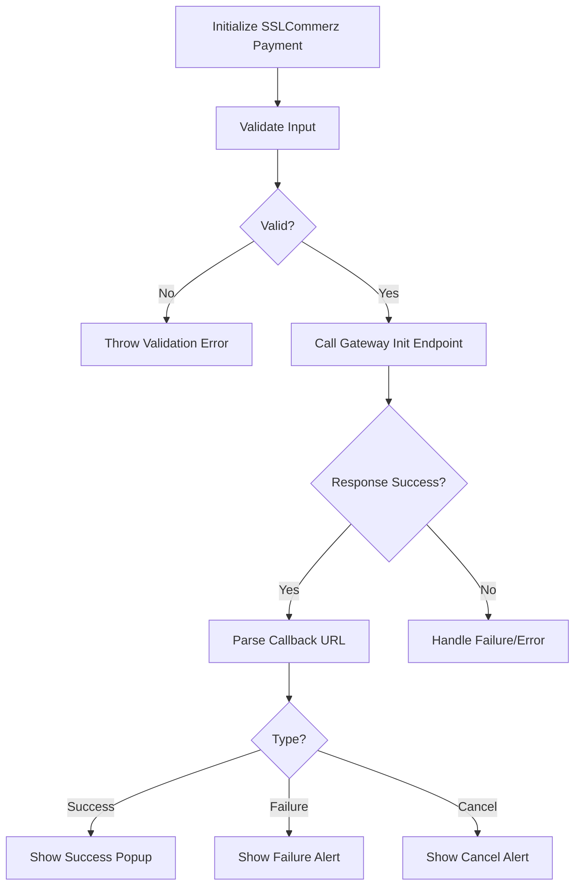
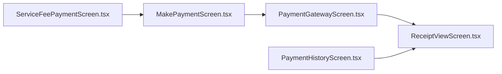
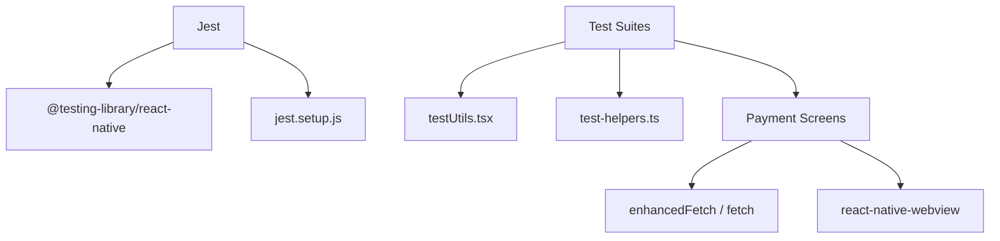

# Mobile Integration & Testing

<cite>
**Referenced Files in This Document**
- [jest.config.js](file://Estate_link_App/jest.config.js)
- [jest.setup.js](file://Estate_link_App/jest.setup.js)
- [ServiceFeePayment.logic.test.js](file://Estate_link_App/src/Features/ServiceFeePayment/TestServiceFeePayment/ServiceFeePayment.logic.test.js)
- [PaymentFlow.logic.test.js](file://Estate_link_App/src/Features/ServiceFeePayment/TestServiceFeePayment/PaymentFlow.logic.test.js)
- [SSLCommerzPayment.logic.test.js](file://Estate_link_App/src/Features/ServiceFeePayment/TestServiceFeePayment/SSLCommerzPayment.logic.test.js)
- [testUtils.tsx](file://Estate_link_App/src/Features/ServiceFeePayment/TestServiceFeePayment/testUtils.tsx)
- [test-helpers.ts](file://Estate_link_App/src/Features/ServiceFeePayment/test-helpers.ts)
- [ServiceFeePaymentScreen.tsx](file://Estate_link_App/src/Features/ServiceFeePayment/ServiceFeePaymentScreen.tsx)
- [MakePaymentScreen.tsx](file://Estate_link_App/src/Features/ServiceFeePayment/MakePaymentScreen.tsx)
- [PaymentGatewayScreen.tsx](file://Estate_link_App/src/Features/ServiceFeePayment/PaymentGatewayScreen.tsx)
- [PaymentHistoryScreen.tsx](file://Estate_link_App/src/Features/ServiceFeePayment/PaymentHistoryScreen.tsx)
- [ReceiptViewScreen.tsx](file://Estate_link_App/src/Features/ServiceFeePayment/ReceiptViewScreen.tsx)
</cite>

## Table of Contents
1. [Introduction](#introduction)
2. [Project Structure](#project-structure)
3. [Core Components](#core-components)
4. [Architecture Overview](#architecture-overview)
5. [Detailed Component Analysis](#detailed-component-analysis)
6. [Dependency Analysis](#dependency-analysis)
7. [Performance Considerations](#performance-considerations)
8. [Troubleshooting Guide](#troubleshooting-guide)
9. [Conclusion](#conclusion)

## Introduction
This document provides comprehensive guidance for testing and integrating the mobile service fee payment system. It covers the test suite structure, automated testing strategies, mock data generation, integration testing with backend APIs, and mobile-specific considerations such as device compatibility, network conditions, and performance testing. The goal is to enable reliable, repeatable testing of payment workflows, robust error handling, and edge-case coverage across Android and iOS environments.

## Project Structure
The mobile payment testing ecosystem is organized around:
- Feature-specific test suites under `src/Features/ServiceFeePayment/TestServiceFeePayment/`
- Component screens under `src/Features/ServiceFeePayment/`
- Shared test utilities and helpers
- Jest configuration for test execution and mocking

**Diagram sources**
- [jest.config.js](file://Estate_link_App/jest.config.js#L1-L82)
- [jest.setup.js](file://Estate_link_App/jest.setup.js#L1-L378)
- [ServiceFeePayment.logic.test.js](file://Estate_link_App/src/Features/ServiceFeePayment/TestServiceFeePayment/ServiceFeePayment.logic.test.js#L1-L556)
- [PaymentFlow.logic.test.js](file://Estate_link_App/src/Features/ServiceFeePayment/TestServiceFeePayment/PaymentFlow.logic.test.js#L1-L582)
- [SSLCommerzPayment.logic.test.js](file://Estate_link_App/src/Features/ServiceFeePayment/TestServiceFeePayment/SSLCommerzPayment.logic.test.js#L1-L437)
- [testUtils.tsx](file://Estate_link_App/src/Features/ServiceFeePayment/TestServiceFeePayment/testUtils.tsx#L1-L467)
- [test-helpers.ts](file://Estate_link_App/src/Features/ServiceFeePayment/test-helpers.ts#L1-L363)
- [ServiceFeePaymentScreen.tsx](file://Estate_link_App/src/Features/ServiceFeePayment/ServiceFeePaymentScreen.tsx#L1-L800)
- [MakePaymentScreen.tsx](file://Estate_link_App/src/Features/ServiceFeePayment/MakePaymentScreen.tsx#L1-L639)
- [PaymentGatewayScreen.tsx](file://Estate_link_App/src/Features/ServiceFeePayment/PaymentGatewayScreen.tsx#L1-L327)
- [PaymentHistoryScreen.tsx](file://Estate_link_App/src/Features/ServiceFeePayment/PaymentHistoryScreen.tsx#L1-L800)
- [ReceiptViewScreen.tsx](file://Estate_link_App/src/Features/ServiceFeePayment/ReceiptViewScreen.tsx#L1-L800)

**Section sources**
- [jest.config.js](file://Estate_link_App/jest.config.js#L1-L82)
- [jest.setup.js](file://Estate_link_App/jest.setup.js#L1-L378)

## Core Components
This section outlines the primary testing components and their responsibilities:
- Logic tests validate pure payment calculations, state transitions, and payment processing without React Native components.
- Flow tests model the end-to-end payment journey from selection to receipt.
- SSLCommerz tests validate gateway initialization, callback parsing, and cancellation flows.
- Test utilities provide mock data, Redux stores, navigation mocks, and helper functions for assertions and timers.
- Test helpers encapsulate common patterns for WebView navigation, date filters, SSLCommerz requests, and payment history filtering.

Key capabilities:
- Pure logic validation for payment state machines and calculations
- End-to-end flow simulation with realistic success/failure paths
- SSLCommerz integration testing with mocked callbacks and timeouts
- Comprehensive mock store and navigation setup for component rendering tests
- Assertion helpers for common UI patterns and payment history filtering

**Section sources**
- [ServiceFeePayment.logic.test.js](file://Estate_link_App/src/Features/ServiceFeePayment/TestServiceFeePayment/ServiceFeePayment.logic.test.js#L1-L556)
- [PaymentFlow.logic.test.js](file://Estate_link_App/src/Features/ServiceFeePayment/TestServiceFeePayment/PaymentFlow.logic.test.js#L1-L582)
- [SSLCommerzPayment.logic.test.js](file://Estate_link_App/src/Features/ServiceFeePayment/TestServiceFeePayment/SSLCommerzPayment.logic.test.js#L1-L437)
- [testUtils.tsx](file://Estate_link_App/src/Features/ServiceFeePayment/TestServiceFeePayment/testUtils.tsx#L1-L467)
- [test-helpers.ts](file://Estate_link_App/src/Features/ServiceFeePayment/test-helpers.ts#L1-L363)

## Architecture Overview
The payment testing architecture separates concerns across three layers:
- Pure logic layer: Validates payment calculations, state transitions, and gateway interactions without UI.
- Integration layer: Uses mocked fetch and WebView navigation to simulate backend and gateway flows.
- UI layer: Renders components with mocked Redux and navigation to verify user interactions and state updates.

**Diagram sources**
- [ServiceFeePayment.logic.test.js](file://Estate_link_App/src/Features/ServiceFeePayment/TestServiceFeePayment/ServiceFeePayment.logic.test.js#L135-L556)
- [PaymentFlow.logic.test.js](file://Estate_link_App/src/Features/ServiceFeePayment/TestServiceFeePayment/PaymentFlow.logic.test.js#L150-L582)
- [SSLCommerzPayment.logic.test.js](file://Estate_link_App/src/Features/ServiceFeePayment/TestServiceFeePayment/SSLCommerzPayment.logic.test.js#L77-L437)
- [MakePaymentScreen.tsx](file://Estate_link_App/src/Features/ServiceFeePayment/MakePaymentScreen.tsx#L299-L488)
- [PaymentGatewayScreen.tsx](file://Estate_link_App/src/Features/ServiceFeePayment/PaymentGatewayScreen.tsx#L76-L164)

## Detailed Component Analysis

### Logic Tests: Payment State and Calculations
These tests validate:
- Payment validation rules (amount, unit, method, selections)
- State transitions and total recalculations
- Processing success and error handling
- Edge cases (rapid toggling, large amounts, negatives, decimals)

**Diagram sources**
- [ServiceFeePayment.logic.test.js](file://Estate_link_App/src/Features/ServiceFeePayment/TestServiceFeePayment/ServiceFeePayment.logic.test.js#L34-L133)

**Section sources**
- [ServiceFeePayment.logic.test.js](file://Estate_link_App/src/Features/ServiceFeePayment/TestServiceFeePayment/ServiceFeePayment.logic.test.js#L135-L556)

### Flow Tests: End-to-End Payment Journey
These tests simulate the complete payment flow:
- Unit and payment selection
- Proceed to payment and method selection
- Confirmation and processing
- Receipt retrieval and state resets

**Diagram sources**
- [PaymentFlow.logic.test.js](file://Estate_link_App/src/Features/ServiceFeePayment/TestServiceFeePayment/PaymentFlow.logic.test.js#L4-L148)

**Section sources**
- [PaymentFlow.logic.test.js](file://Estate_link_App/src/Features/ServiceFeePayment/TestServiceFeePayment/PaymentFlow.logic.test.js#L150-L582)

### SSLCommerz Integration Tests
These tests validate:
- Payment initialization with validation
- Callback parsing for success/failure/cancel
- Cancellation flow and error handling
- Security checks and URL validation

**Diagram sources**
- [SSLCommerzPayment.logic.test.js](file://Estate_link_App/src/Features/ServiceFeePayment/TestServiceFeePayment/SSLCommerzPayment.logic.test.js#L6-L76)

**Section sources**
- [SSLCommerzPayment.logic.test.js](file://Estate_link_App/src/Features/ServiceFeePayment/TestServiceFeePayment/SSLCommerzPayment.logic.test.js#L77-L437)

### Test Utilities and Helpers
- Mock data generators for units, payments, and scenarios
- Redux store creation with preloaded state
- Navigation mocks and route params
- Assertion helpers for UI elements and payment cards
- Timer utilities for asynchronous flows
- Helpers for WebView navigation, date filters, and SSLCommerz requests

**Section sources**
- [testUtils.tsx](file://Estate_link_App/src/Features/ServiceFeePayment/TestServiceFeePayment/testUtils.tsx#L1-L467)
- [test-helpers.ts](file://Estate_link_App/src/Features/ServiceFeePayment/test-helpers.ts#L1-L363)

### Component-Level Integration Testing
- ServiceFeePaymentScreen: Unit selection, payment lists, upcoming billings, and refresh logic
- MakePaymentScreen: Amount editing, payment initiation, authentication checks, and SSLCommerz integration
- PaymentGatewayScreen: WebView navigation, callback handling, and cancellation
- PaymentHistoryScreen: Date filtering, payment list rendering, and navigation to receipts
- ReceiptViewScreen: PDF generation, sharing, and status display

**Diagram sources**
- [ServiceFeePaymentScreen.tsx](file://Estate_link_App/src/Features/ServiceFeePayment/ServiceFeePaymentScreen.tsx#L1-L800)
- [MakePaymentScreen.tsx](file://Estate_link_App/src/Features/ServiceFeePayment/MakePaymentScreen.tsx#L1-L639)
- [PaymentGatewayScreen.tsx](file://Estate_link_App/src/Features/ServiceFeePayment/PaymentGatewayScreen.tsx#L1-L327)
- [PaymentHistoryScreen.tsx](file://Estate_link_App/src/Features/ServiceFeePayment/PaymentHistoryScreen.tsx#L1-L800)
- [ReceiptViewScreen.tsx](file://Estate_link_App/src/Features/ServiceFeePayment/ReceiptViewScreen.tsx#L1-L800)

**Section sources**
- [ServiceFeePaymentScreen.tsx](file://Estate_link_App/src/Features/ServiceFeePayment/ServiceFeePaymentScreen.tsx#L1-L800)
- [MakePaymentScreen.tsx](file://Estate_link_App/src/Features/ServiceFeePayment/MakePaymentScreen.tsx#L1-L639)
- [PaymentGatewayScreen.tsx](file://Estate_link_App/src/Features/ServiceFeePayment/PaymentGatewayScreen.tsx#L1-L327)
- [PaymentHistoryScreen.tsx](file://Estate_link_App/src/Features/ServiceFeePayment/PaymentHistoryScreen.tsx#L1-L800)
- [ReceiptViewScreen.tsx](file://Estate_link_App/src/Features/ServiceFeePayment/ReceiptViewScreen.tsx#L1-L800)

## Dependency Analysis
The testing stack relies on:
- Jest for test orchestration and mocking
- React Native Testing Library for component rendering
- Custom test utilities for Redux and navigation
- Mocked fetch for backend integration
- WebView navigation for SSLCommerz callbacks

**Diagram sources**
- [jest.config.js](file://Estate_link_App/jest.config.js#L1-L82)
- [testUtils.tsx](file://Estate_link_App/src/Features/ServiceFeePayment/TestServiceFeePayment/testUtils.tsx#L1-L467)
- [test-helpers.ts](file://Estate_link_App/src/Features/ServiceFeePayment/test-helpers.ts#L1-L363)
- [MakePaymentScreen.tsx](file://Estate_link_App/src/Features/ServiceFeePayment/MakePaymentScreen.tsx#L29-L29)
- [PaymentGatewayScreen.tsx](file://Estate_link_App/src/Features/ServiceFeePayment/PaymentGatewayScreen.tsx#L11-L11)

**Section sources**
- [jest.config.js](file://Estate_link_App/jest.config.js#L1-L82)
- [test-helpers.ts](file://Estate_link_App/src/Features/ServiceFeePayment/test-helpers.ts#L120-L158)

## Performance Considerations
- Use fake timers for predictable async flows in logic and flow tests
- Minimize real network calls by mocking fetch and SSLCommerz endpoints
- Optimize WebView navigation tests by simulating URL changes rather than loading external pages
- Batch UI assertions to reduce test runtime
- Leverage snapshot-like assertions for complex UI structures to avoid excessive rendering

## Troubleshooting Guide
Common issues and resolutions:
- CSS/NativeWind conflicts: Resolved via extensive mocks in global setup
- Navigation and Redux state mismatches: Use provided test wrappers and mock stores
- SSLCommerz callback parsing: Validate URL patterns and case sensitivity
- WebView navigation errors: Implement error handlers and retry logic
- Authentication timeouts: Ensure access tokens are present before initiating payments

**Section sources**
- [jest.setup.js](file://Estate_link_App/jest.setup.js#L3-L82)
- [PaymentGatewayScreen.tsx](file://Estate_link_App/src/Features/ServiceFeePayment/PaymentGatewayScreen.tsx#L166-L189)
- [MakePaymentScreen.tsx](file://Estate_link_App/src/Features/ServiceFeePayment/MakePaymentScreen.tsx#L422-L448)

## Conclusion
The mobile service fee payment testing framework provides comprehensive coverage for logic, integration, and UI layers. By leveraging pure logic tests, flow simulations, and robust integration tests with mocked gateways, teams can confidently validate payment workflows, error handling, and edge cases. The provided utilities and helpers streamline setup and assertions, enabling efficient test maintenance and continuous integration.