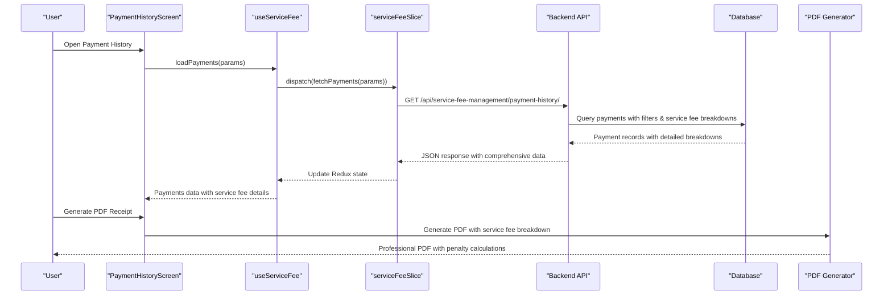
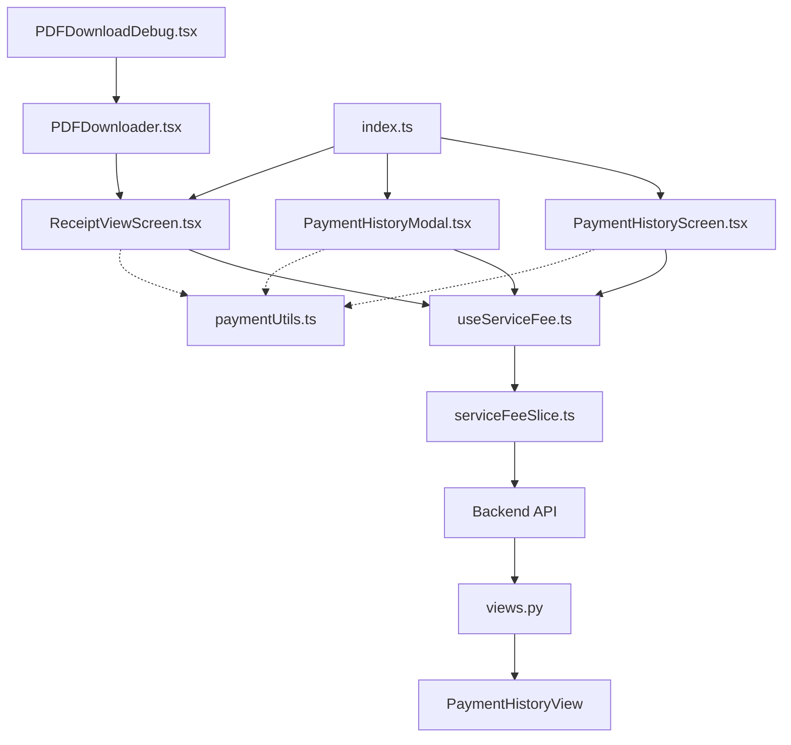

# Payment History & Records

<cite>
**Referenced Files in This Document**
- [PaymentHistoryScreen.tsx](file://Estate_link_App/src/Features/ServiceFeePayment/PaymentHistoryScreen.tsx)
- [PaymentHistoryModal.tsx](file://Estate_link_App/src/Features/ServiceFeePayment/PaymentHistoryModal.tsx)
- [ReceiptViewScreen.tsx](file://Estate_link_App/src/Features/ServiceFeePayment/ReceiptViewScreen.tsx)
- [serviceFeeSlice.ts](file://Estate_link_App/src/store/slices/serviceFeeSlice.ts)
- [useServiceFee.ts](file://Estate_link_App/src/hooks/useServiceFee.ts)
- [paymentUtils.ts](file://Estate_link_App/src/utils/paymentUtils.ts)
- [index.ts](file://Estate_link_App/src/Features/ServiceFeePayment/index.ts)
- [ServiceFeePaymentScreen.tsx](file://Estate_link_App/src/Features/ServiceFeePayment/ServiceFeePaymentScreen.tsx)
- [urls.py](file://backend/service_fee_management/urls.py)
- [views.py](file://backend/service_fee_management/views.py)
</cite>

## Update Summary
**Changes Made**
- Enhanced PDF export functionality with comprehensive service fee breakdowns
- Added detailed penalty calculations and professional invoice formatting
- Integrated expo-print and expo-sharing libraries for receipt generation
- Updated payment history screen with advanced filtering capabilities
- Improved receipt viewing interface with professional PDF generation

## Table of Contents
1. [Introduction](#introduction)
2. [Project Structure](#project-structure)
3. [Core Components](#core-components)
4. [Architecture Overview](#architecture-overview)
5. [Detailed Component Analysis](#detailed-component-analysis)
6. [Enhanced PDF Export Functionality](#enhanced-pdf-export-functionality)
7. [Advanced Payment History Features](#advanced-payment-history-features)
8. [Dependency Analysis](#dependency-analysis)
9. [Performance Considerations](#performance-considerations)
10. [Troubleshooting Guide](#troubleshooting-guide)
11. [Conclusion](#conclusion)

## Introduction
This document provides comprehensive documentation for the mobile payment history management system with enhanced PDF export capabilities. The system now features sophisticated bill detail screens with detailed service fee breakdowns, comprehensive penalty calculations, and professional invoice formatting using expo-print and expo-sharing libraries. It covers payment history screen implementation, transaction listing, filtering capabilities, pagination handling, modal functionality, detailed transaction view, and advanced receipt generation features. The system maintains robust data synchronization between the mobile app and backend API, offline data caching, and real-time updates while providing enhanced user experience for browsing historical payments, searching specific transactions, and managing payment records.

## Project Structure
The payment history management system spans both the mobile application (React Native) and the backend Django REST framework. The mobile app implements screens for payment history, modal dialogs, and enhanced receipt viewing with PDF export capabilities, while the backend exposes endpoints for retrieving payment data, generating detailed receipts, and managing payment records with comprehensive service fee breakdowns.

```mermaid
graph TB
subgraph "Mobile App (React Native)"
PHS["PaymentHistoryScreen.tsx"]
PHM["PaymentHistoryModal.tsx"]
RVS["ReceiptViewScreen.tsx"]
USS["useServiceFee.ts"]
SSS["serviceFeeSlice.ts"]
PU["paymentUtils.ts"]
IDX["index.ts"]
PDF["PDFDownloader.tsx"]
PDD["PDFDownloadDebug.tsx"]
end
subgraph "Backend (Django REST)"
URLS["urls.py"]
VIEWS["views.py"]
PHV["PaymentHistoryView"]
end
PHS --> USS
PHM --> USS
RVS --> USS
USS --> SSS
SSS --> URLS
URLS --> VIEWS
VIEWS --> PHV
PHS -.-> PU
PHM -.-> PU
RVS -.-> PU
PDF --> RVS
PDD --> PDF
```

**Diagram sources**
- [PaymentHistoryScreen.tsx](file://Estate_link_App/src/Features/ServiceFeePayment/PaymentHistoryScreen.tsx#L1-L1151)
- [PaymentHistoryModal.tsx](file://Estate_link_App/src/Features/ServiceFeePayment/PaymentHistoryModal.tsx#L1-L388)
- [ReceiptViewScreen.tsx](file://Estate_link_App/src/Features/ServiceFeePayment/ReceiptViewScreen.tsx#L1-L913)
- [PDFDownloader.tsx](file://Estate_link_App/src/components/PDFDownloader.tsx#L1-L46)
- [PDFDownloadDebug.tsx](file://Estate_link_App/src/components/PDFDownloadDebug.tsx#L1-L36)
- [useServiceFee.ts](file://Estate_link_App/src/hooks/useServiceFee.ts#L1-L188)
- [serviceFeeSlice.ts](file://Estate_link_App/src/store/slices/serviceFeeSlice.ts#L1-L1018)
- [paymentUtils.ts](file://Estate_link_App/src/utils/paymentUtils.ts#L1-L324)
- [index.ts](file://Estate_link_App/src/Features/ServiceFeePayment/index.ts#L1-L9)
- [urls.py](file://backend/service_fee_management/urls.py#L1-L176)
- [views.py](file://backend/service_fee_management/views.py#L8750-L9149)

**Section sources**
- [PaymentHistoryScreen.tsx](file://Estate_link_App/src/Features/ServiceFeePayment/PaymentHistoryScreen.tsx#L1-L1151)
- [PaymentHistoryModal.tsx](file://Estate_link_App/src/Features/ServiceFeePayment/PaymentHistoryModal.tsx#L1-L388)
- [ReceiptViewScreen.tsx](file://Estate_link_App/src/Features/ServiceFeePayment/ReceiptViewScreen.tsx#L1-L913)
- [PDFDownloader.tsx](file://Estate_link_App/src/components/PDFDownloader.tsx#L1-L46)
- [PDFDownloadDebug.tsx](file://Estate_link_App/src/components/PDFDownloadDebug.tsx#L1-L36)
- [serviceFeeSlice.ts](file://Estate_link_App/src/store/slices/serviceFeeSlice.ts#L1-L1018)
- [useServiceFee.ts](file://Estate_link_App/src/hooks/useServiceFee.ts#L1-L188)
- [paymentUtils.ts](file://Estate_link_App/src/utils/paymentUtils.ts#L1-L324)
- [index.ts](file://Estate_link_App/src/Features/ServiceFeePayment/index.ts#L1-L9)
- [urls.py](file://backend/service_fee_management/urls.py#L1-L176)
- [views.py](file://backend/service_fee_management/views.py#L8750-L9149)

## Core Components
- **PaymentHistoryScreen**: Implements the main payment history screen with transaction listing, advanced filtering by date ranges, service periods, and payment methods, navigation to detailed receipt view, and enhanced PDF export functionality.
- **PaymentHistoryModal**: Provides a modal interface for viewing payment history within other screens context with comprehensive payment details display and status indicators.
- **ReceiptViewScreen**: Handles detailed transaction view with comprehensive service fee breakdowns, penalty calculations, professional PDF generation using expo-print, download, and sharing capabilities via expo-sharing.
- **serviceFeeSlice**: Manages Redux state for payments, units, and upcoming billings with enhanced asynchronous thunks for fetching data from backend endpoints including detailed payment history.
- **useServiceFee**: Custom hook that encapsulates Redux actions and selectors for service fee-related operations with enhanced payment history functionality.
- **paymentUtils**: Utility functions for payment data processing, validation, and ID management with enhanced support for complex payment scenarios.
- **PDFDownloader**: Component for downloading and sharing PDF documents with customizable styling and size options.
- **PDFDownloadDebug**: Debug component for testing PDF download functionality and troubleshooting issues.
- **Backend URLs and Views**: Expose endpoints for payment retrieval, filtering, payment history with detailed service fee breakdowns, and comprehensive receipt generation.

**Section sources**
- [PaymentHistoryScreen.tsx](file://Estate_link_App/src/Features/ServiceFeePayment/PaymentHistoryScreen.tsx#L21-L54)
- [PaymentHistoryModal.tsx](file://Estate_link_App/src/Features/ServiceFeePayment/PaymentHistoryModal.tsx#L14-L24)
- [ReceiptViewScreen.tsx](file://Estate_link_App/src/Features/ServiceFeePayment/ReceiptViewScreen.tsx#L18-L25)
- [PDFDownloader.tsx](file://Estate_link_App/src/components/PDFDownloader.tsx#L8-L14)
- [PDFDownloadDebug.tsx](file://Estate_link_App/src/components/PDFDownloadDebug.tsx#L1-L7)
- [serviceFeeSlice.ts](file://Estate_link_App/src/store/slices/serviceFeeSlice.ts#L5-L50)
- [useServiceFee.ts](file://Estate_link_App/src/hooks/useServiceFee.ts#L24-L46)
- [paymentUtils.ts](file://Estate_link_App/src/utils/paymentUtils.ts#L8-L31)
- [urls.py](file://backend/service_fee_management/urls.py#L105-L106)
- [views.py](file://backend/service_fee_management/views.py#L8750-L8756)

## Architecture Overview
The system follows a client-server architecture with the mobile app acting as the client and the Django backend as the server. The mobile app uses Redux for state management and React Navigation for screen transitions. Data synchronization occurs via REST API calls with comprehensive query parameters for filtering, pagination, and detailed service fee breakdowns. The enhanced architecture now supports sophisticated PDF generation with professional invoice formatting and comprehensive payment detail reporting.

**Diagram sources**
- [PaymentHistoryScreen.tsx](file://Estate_link_App/src/Features/ServiceFeePayment/PaymentHistoryScreen.tsx#L62-L206)
- [useServiceFee.ts](file://Estate_link_App/src/hooks/useServiceFee.ts#L64-L66)
- [serviceFeeSlice.ts](file://Estate_link_App/src/store/slices/serviceFeeSlice.ts#L320-L402)
- [urls.py](file://backend/service_fee_management/urls.py#L105-L106)
- [views.py](file://backend/service_fee_management/views.py#L8750-L8756)

## Detailed Component Analysis

### PaymentHistoryScreen
Implements the primary payment history interface with enhanced capabilities:
- **Transaction listing** using filtered data with comprehensive service fee breakdowns
- **Advanced filtering** by date ranges (All Time, Last 3 Months, This Year, Custom Range), service periods, payment methods, and status
- **Custom date picker modal** for precise date selection with validation
- **Pull-to-refresh functionality** with enhanced loading states
- **Navigation to detailed receipt view** with comprehensive payment information
- **Currency formatting** and localized date/time display with service fee details
- **Status display logic** for payment results with historical status preservation
- **Enhanced payment history** with detailed service fee breakdowns and penalty calculations

Key features:
- **Service period filtering** calculates exact date ranges for "Last 3 Months" and "This Year" with proper month boundary handling
- **Custom date range validation** prevents invalid selections with comprehensive error handling
- **Payment status determination** prioritizes historical payment result display with service fee status preservation
- **Receipt navigation** passes payment and unit data with detailed service fee information for comprehensive view
- **Advanced filtering** supports multiple filter criteria including tower, unit, status, payment method, and amount ranges

**Section sources**
- [PaymentHistoryScreen.tsx](file://Estate_link_App/src/Features/ServiceFeePayment/PaymentHistoryScreen.tsx#L58-L206)
- [PaymentHistoryScreen.tsx](file://Estate_link_App/src/Features/ServiceFeePayment/PaymentHistoryScreen.tsx#L208-L364)
- [PaymentHistoryScreen.tsx](file://Estate_link_App/src/Features/ServiceFeePayment/PaymentHistoryScreen.tsx#L367-L486)
- [PaymentHistoryScreen.tsx](file://Estate_link_App/src/Features/ServiceFeePayment/PaymentHistoryScreen.tsx#L487-L668)
- [PaymentHistoryScreen.tsx](file://Estate_link_App/src/Features/ServiceFeePayment/PaymentHistoryScreen.tsx#L670-L774)

### PaymentHistoryModal
Provides an embedded payment history view within other screens:
- **Modal presentation** with slide animation and pageSheet presentation style
- **Unit-specific payment filtering** with comprehensive payment details display
- **Refresh control** for manual updates with enhanced loading states
- **Comprehensive payment details** display with service fee breakdowns and status indicators
- **Status badges** with color-coded indicators for payment status
- **Payment progress visualization** for partial payments with service fee allocation
- **Enhanced filtering** by service period, payment method, and status

Implementation highlights:
- **Unit-based filtering** using unit ID with comprehensive payment history
- **Status determination** considering fully paid, partial, overdue, and due states with service fee context
- **Payment method normalization** for consistent display with service fee details
- **Scrollable content** with refresh control and enhanced loading indicators
- **Service fee integration** displaying detailed breakdowns and penalty calculations

**Section sources**
- [PaymentHistoryModal.tsx](file://Estate_link_App/src/Features/ServiceFeePayment/PaymentHistoryModal.tsx#L20-L52)
- [PaymentHistoryModal.tsx](file://Estate_link_App/src/Features/ServiceFeePayment/PaymentHistoryModal.tsx#L54-L71)
- [PaymentHistoryModal.tsx](file://Estate_link_App/src/Features/ServiceFeePayment/PaymentHistoryModal.tsx#L73-L89)
- [PaymentHistoryModal.tsx](file://Estate_link_App/src/Features/ServiceFeePayment/PaymentHistoryModal.tsx#L91-L171)

### ReceiptViewScreen
Handles detailed transaction view and enhanced PDF generation with comprehensive service fee breakdowns:
- **Professional receipt layout** with property details, payment information, and comprehensive service fee breakdown
- **Dynamic payment method extraction** from notes and payment data with service fee context
- **Payment status display** with appropriate styling and service fee status indication
- **Advanced PDF generation** using Expo Print with A4 dimensions and professional formatting
- **Download and sharing functionality** via Expo Sharing with comprehensive error handling
- **Print capability** through native printing APIs with service fee details
- **Service fee breakdown display** showing base fees, penalty amounts, waived amounts, and advance payments
- **Professional invoice formatting** with detailed payment allocation and service fee calculations

PDF generation features:
- **HTML template** with responsive design and comprehensive service fee breakdown
- **Conditional content** for partial vs. full payments with service fee allocation details
- **Proper currency formatting** and localization with service fee context
- **Watermark and styling** for professional appearance with service fee details
- **Service fee itemization** showing base service fee, additional bill categories, penalties, and waivers
- **Advance payment handling** with separate display for future bill credits

**Section sources**
- [ReceiptViewScreen.tsx](file://Estate_link_App/src/Features/ServiceFeePayment/ReceiptViewScreen.tsx#L27-L40)
- [ReceiptViewScreen.tsx](file://Estate_link_App/src/Features/ServiceFeePayment/ReceiptViewScreen.tsx#L42-L80)
- [ReceiptViewScreen.tsx](file://Estate_link_App/src/Features/ServiceFeePayment/ReceiptViewScreen.tsx#L82-L202)
- [ReceiptViewScreen.tsx](file://Estate_link_App/src/Features/ServiceFeePayment/ReceiptViewScreen.tsx#L227-L591)
- [ReceiptViewScreen.tsx](file://Estate_link_App/src/Features/ServiceFeePayment/ReceiptViewScreen.tsx#L593-L703)

### Data Synchronization and State Management
Redux slice manages enhanced payment data with comprehensive service fee details:
- **Payment data fetching** with query parameters including unit, date range, service period, and pagination
- **Loading states** and error handling with enhanced service fee context
- **Access control checks** for mobile endpoints with service fee permissions
- **Upcoming billing data** for context with service fee details
- **Stats aggregation** for analytics with comprehensive payment history
- **Service fee integration** providing detailed breakdowns and penalty calculations
- **Enhanced fetch operations** with timeout and authentication for reliable API communication

Asynchronous operations:
- **fetchPayments**: Retrieves paginated payment data with comprehensive filtering and service fee details
- **checkServiceFeeAccess**: Validates mobile access with dedicated endpoint and service fee permissions
- **fetchUpcomingBillings**: Loads next month's billing context with service fee settings
- **Enhanced fetch** with comprehensive timeout and authentication for reliable communication

**Section sources**
- [serviceFeeSlice.ts](file://Estate_link_App/src/store/slices/serviceFeeSlice.ts#L320-L402)
- [serviceFeeSlice.ts](file://Estate_link_App/src/store/slices/serviceFeeSlice.ts#L175-L231)
- [serviceFeeSlice.ts](file://Estate_link_App/src/store/slices/serviceFeeSlice.ts#L562-L611)
- [serviceFeeSlice.ts](file://Estate_link_App/src/store/slices/serviceFeeSlice.ts#L800-L834)

### Backend Integration
Backend endpoints with enhanced payment history capabilities:
- **Payment history**: `/api/service-fee-management/payment-history/` with comprehensive query parameters
- **Payment details**: `/api/service-fee-management/payment-details/` with detailed service fee breakdowns
- **Mobile-specific endpoints**: access check and upcoming billing with service fee context
- **SSLCommerz payment gateway integration** with service fee processing
- **Enhanced filtering**: supports service period, tower, unit, status, payment method, and amount ranges

Query parameter support:
- **Filtering**: status, method, tower_id, resident_id, unit, service_period_month, service_period_year
- **Pagination**: page, page_size, ordering with service fee context
- **Date range**: start_date, end_date with service fee processing
- **Service period**: month/year ranges with comprehensive filtering
- **Advanced filtering**: search, min_amount, max_amount, advance_filter with service fee details

**Section sources**
- [urls.py](file://backend/service_fee_management/urls.py#L105-L106)
- [urls.py](file://backend/service_fee_management/urls.py#L88-L89)
- [serviceFeeSlice.ts](file://Estate_link_App/src/store/slices/serviceFeeSlice.ts#L360-L365)

### Payment Utilities
Utility functions for enhanced payment processing:
- **Payment ID parsing** supporting multiple formats with service fee context
- **Payment data lookup** by ID components with comprehensive service fee details
- **Selected payment processing** with chronological sorting and service fee allocation
- **Payment validation** with comprehensive error/warning reporting including service fee constraints
- **Amount and date formatting** for display with service fee context
- **Transaction ID generation** with service fee tracking
- **Customer data sanitization** with service fee processing context

**Section sources**
- [paymentUtils.ts](file://Estate_link_App/src/utils/paymentUtils.ts#L40-L101)
- [paymentUtils.ts](file://Estate_link_App/src/utils/paymentUtils.ts#L106-L144)
- [paymentUtils.ts](file://Estate_link_App/src/utils/paymentUtils.ts#L149-L175)
- [paymentUtils.ts](file://Estate_link_App/src/utils/paymentUtils.ts#L180-L230)
- [paymentUtils.ts](file://Estate_link_App/src/utils/paymentUtils.ts#L286-L324)

## Enhanced PDF Export Functionality
The system now features comprehensive PDF export capabilities with professional invoice formatting:

### PDF Generation Architecture
- **Expo Print Integration**: Uses expo-print library for native PDF generation with A4 dimensions (595x842 points)
- **Professional Invoice Design**: HTML template with responsive design and comprehensive service fee breakdown
- **Service Fee Itemization**: Detailed breakdown showing base service fee, additional bill categories, penalties, and waivers
- **Advanced Styling**: CSS styling with professional appearance including company branding and invoice formatting
- **Multi-platform Support**: Works seamlessly across iOS and Android platforms

### PDF Content Structure
- **Header Section**: Company branding with EstateLink Community Management logo and contact information
- **Receipt Information**: Receipt number, transaction ID, and payment date with service fee context
- **Resident Information**: Tower, unit number, and resident details with service fee allocation
- **Payment Method Details**: Payment method, account information, and service fee processing details
- **Service Fee Breakdown**: Comprehensive itemization with base fees, penalties, waivers, and advance payments
- **Summary Section**: Total amounts, service fee allocations, and payment status with professional formatting
- **Notes Section**: Additional payment information and service fee processing notes
- **Footer**: Official receipt information and contact details

### PDF Generation Features
- **Dynamic Content**: Service fee breakdowns, penalty calculations, and advance payment handling
- **Professional Formatting**: Proper currency formatting, localization, and service fee context
- **Watermark Support**: Optional watermark for official receipts with service fee details
- **Error Handling**: Comprehensive error handling for PDF generation failures
- **Sharing Integration**: Direct sharing via expo-sharing with file type specification

**Section sources**
- [ReceiptViewScreen.tsx](file://Estate_link_App/src/Features/ServiceFeePayment/ReceiptViewScreen.tsx#L255-L563)
- [ReceiptViewScreen.tsx](file://Estate_link_App/src/Features/ServiceFeePayment/ReceiptViewScreen.tsx#L565-L621)
- [ReceiptViewScreen.tsx](file://Estate_link_App/src/Features/ServiceFeePayment/ReceiptViewScreen.tsx#L623-L675)

## Advanced Payment History Features
The enhanced payment history system provides comprehensive functionality:

### Enhanced Filtering Capabilities
- **Service Period Filtering**: Filter by specific months and years with comprehensive service fee context
- **Tower and Unit Filtering**: Multi-select filtering by tower and unit with service fee allocation
- **Status Filtering**: Filter by payment status including fully paid, partial, overdue, and due states
- **Payment Method Filtering**: Filter by payment methods with service fee processing details
- **Amount Range Filtering**: Filter by payment amount ranges with service fee context
- **Date Range Filtering**: Comprehensive date range filtering with service fee processing dates

### Service Fee Integration
- **Detailed Breakdowns**: Comprehensive service fee itemization with base fees, penalties, and waivers
- **Penalty Calculations**: Real-time penalty calculations with service fee context
- **Advance Payment Tracking**: Separate display for advance payments and future bill credits
- **Waiver Details**: Comprehensive waiver information with service fee processing
- **Service Fee Allocation**: Detailed allocation of payments across service fee items

### Advanced Display Features
- **Professional Receipts**: PDF generation with comprehensive service fee breakdowns
- **Status Indicators**: Color-coded status displays with service fee context
- **Payment Progress**: Visual payment progress with service fee allocation
- **Service Fee Details**: Comprehensive service fee information with penalty calculations
- **Advanced Search**: Broad search functionality including unit, owner, and receipt IDs

**Section sources**
- [PaymentHistoryScreen.tsx](file://Estate_link_App/src/Features/ServiceFeePayment/PaymentHistoryScreen.tsx#L82-L212)
- [PaymentHistoryScreen.tsx](file://Estate_link_App/src/Features/ServiceFeePayment/PaymentHistoryScreen.tsx#L282-L307)
- [PaymentHistoryScreen.tsx](file://Estate_link_App/src/Features/ServiceFeePayment/PaymentHistoryScreen.tsx#L620-L702)

## Dependency Analysis
The system exhibits clear separation of concerns with well-defined dependencies and enhanced PDF export capabilities:

**Diagram sources**
- [PaymentHistoryScreen.tsx](file://Estate_link_App/src/Features/ServiceFeePayment/PaymentHistoryScreen.tsx#L1-L1151)
- [PaymentHistoryModal.tsx](file://Estate_link_App/src/Features/ServiceFeePayment/PaymentHistoryModal.tsx#L1-L388)
- [ReceiptViewScreen.tsx](file://Estate_link_App/src/Features/ServiceFeePayment/ReceiptViewScreen.tsx#L1-L913)
- [PDFDownloader.tsx](file://Estate_link_App/src/components/PDFDownloader.tsx#L1-L46)
- [PDFDownloadDebug.tsx](file://Estate_link_App/src/components/PDFDownloadDebug.tsx#L1-L36)
- [useServiceFee.ts](file://Estate_link_App/src/hooks/useServiceFee.ts#L1-L188)
- [serviceFeeSlice.ts](file://Estate_link_App/src/store/slices/serviceFeeSlice.ts#L1-L1018)
- [paymentUtils.ts](file://Estate_link_App/src/utils/paymentUtils.ts#L1-L324)
- [index.ts](file://Estate_link_App/src/Features/ServiceFeePayment/index.ts#L1-L9)
- [views.py](file://backend/service_fee_management/views.py#L8750-L9149)

**Section sources**
- [index.ts](file://Estate_link_App/src/Features/ServiceFeePayment/index.ts#L1-L9)
- [useServiceFee.ts](file://Estate_link_App/src/hooks/useServiceFee.ts#L1-L188)
- [serviceFeeSlice.ts](file://Estate_link_App/src/store/slices/serviceFeeSlice.ts#L1-L1018)

## Performance Considerations
- **Pagination**: Backend supports pagination via page and page_size parameters to handle large datasets efficiently with service fee context
- **Filtering**: Query parameters enable server-side filtering to reduce payload sizes with comprehensive service fee filtering
- **Caching**: Redux state provides client-side caching of payment data with loading states and service fee details
- **Date calculations**: Frontend performs efficient date range calculations for "Last 3 Months" and "This Year" filters with service fee processing
- **PDF generation**: Optimized HTML template with minimal JavaScript for responsive PDF creation with service fee context
- **Network timeouts**: Enhanced fetch includes configurable timeouts for reliable API communication with service fee processing
- **Service fee optimization**: Backend uses optimized queries with LEFT JOINs and direct column aliases for comprehensive service fee data
- **Memory management**: PDF generation handles large datasets efficiently with proper memory management

## Troubleshooting Guide
Common issues and resolutions:
- **Empty payment data**: Check access permissions and ensure unit has payment records with service fee context
- **Date filter problems**: Verify date format and range validation logic with service fee processing dates
- **PDF generation failures**: Confirm device sharing availability, storage permissions, and service fee data completeness
- **Network connectivity**: Implement retry logic and user feedback for failed requests with service fee processing
- **State synchronization**: Monitor Redux state updates and loading indicators with service fee details
- **Service fee breakdown issues**: Verify service fee data integrity and penalty calculation accuracy
- **PDF sharing problems**: Check expo-sharing availability and file permissions for PDF generation
- **Advanced filtering issues**: Verify filter parameter formats and service fee filtering logic

**Section sources**
- [serviceFeeSlice.ts](file://Estate_link_App/src/store/slices/serviceFeeSlice.ts#L800-L834)
- [ReceiptViewScreen.tsx](file://Estate_link_App/src/Features/ServiceFeePayment/ReceiptViewScreen.tsx#L639-L648)

## Conclusion
The enhanced mobile payment history management system provides a comprehensive solution for viewing, filtering, and managing payment records with advanced PDF export capabilities. The implementation leverages modern React Native patterns with Redux for state management, robust backend integration with Django REST framework, and professional PDF generation capabilities with comprehensive service fee breakdowns. The system offers excellent user experience through intuitive navigation, real-time updates, comprehensive payment history visualization, and sophisticated receipt generation with detailed service fee information. The enhanced architecture supports advanced filtering, comprehensive service fee integration, and professional PDF formatting, making it an ideal solution for property management systems requiring detailed payment tracking and professional receipt generation.