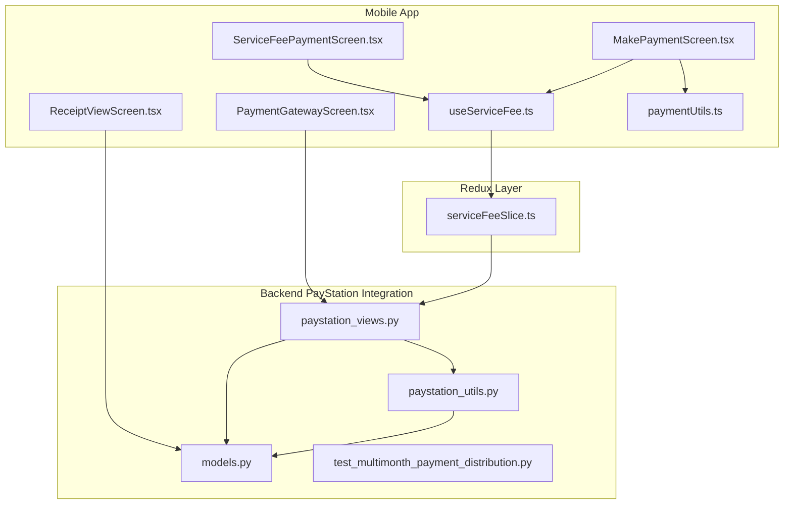
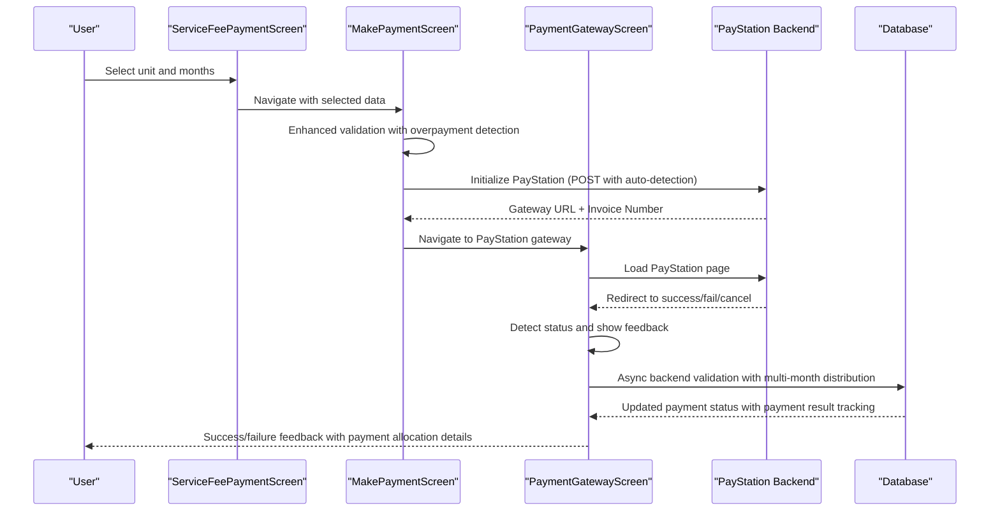
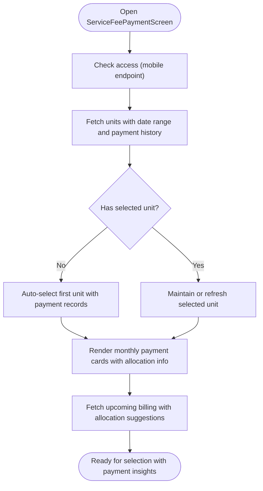
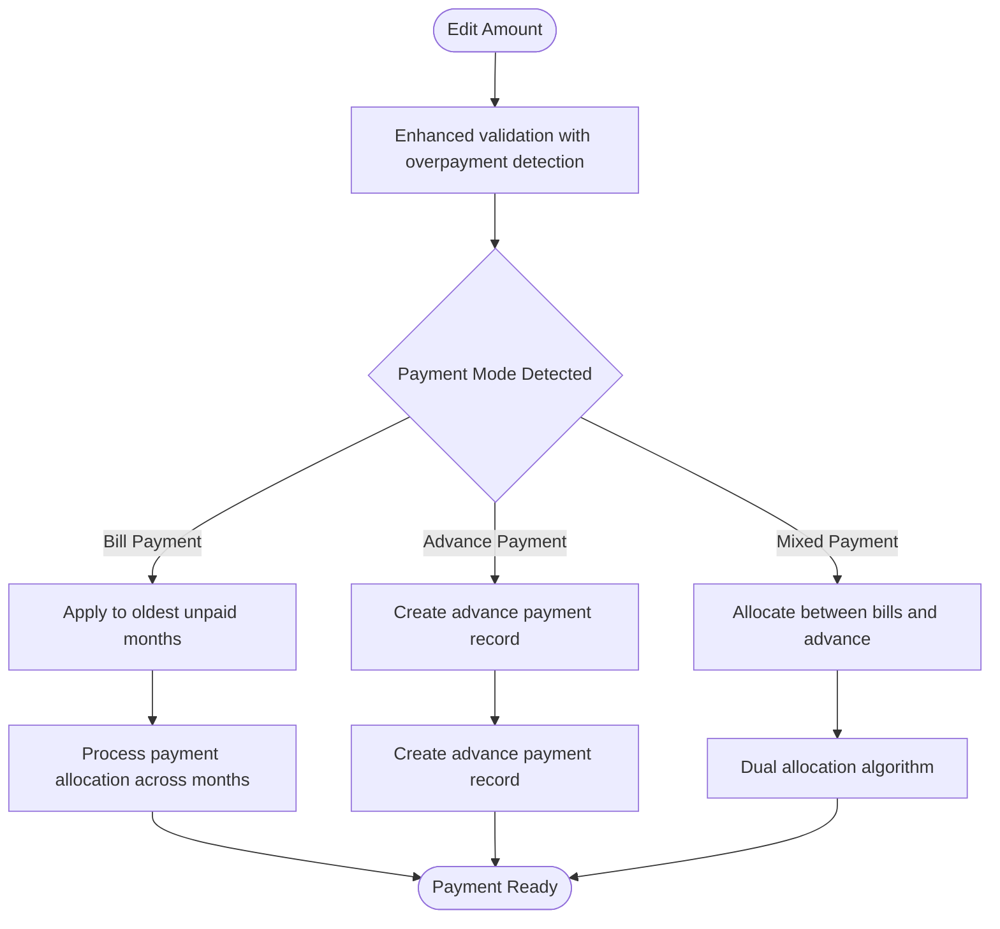
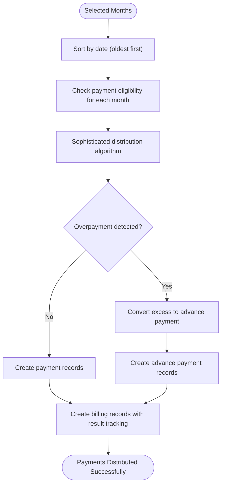
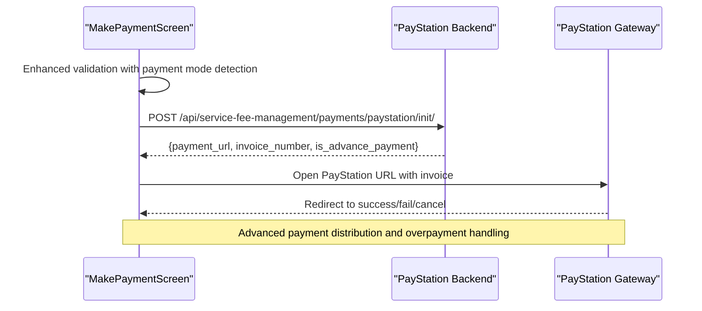
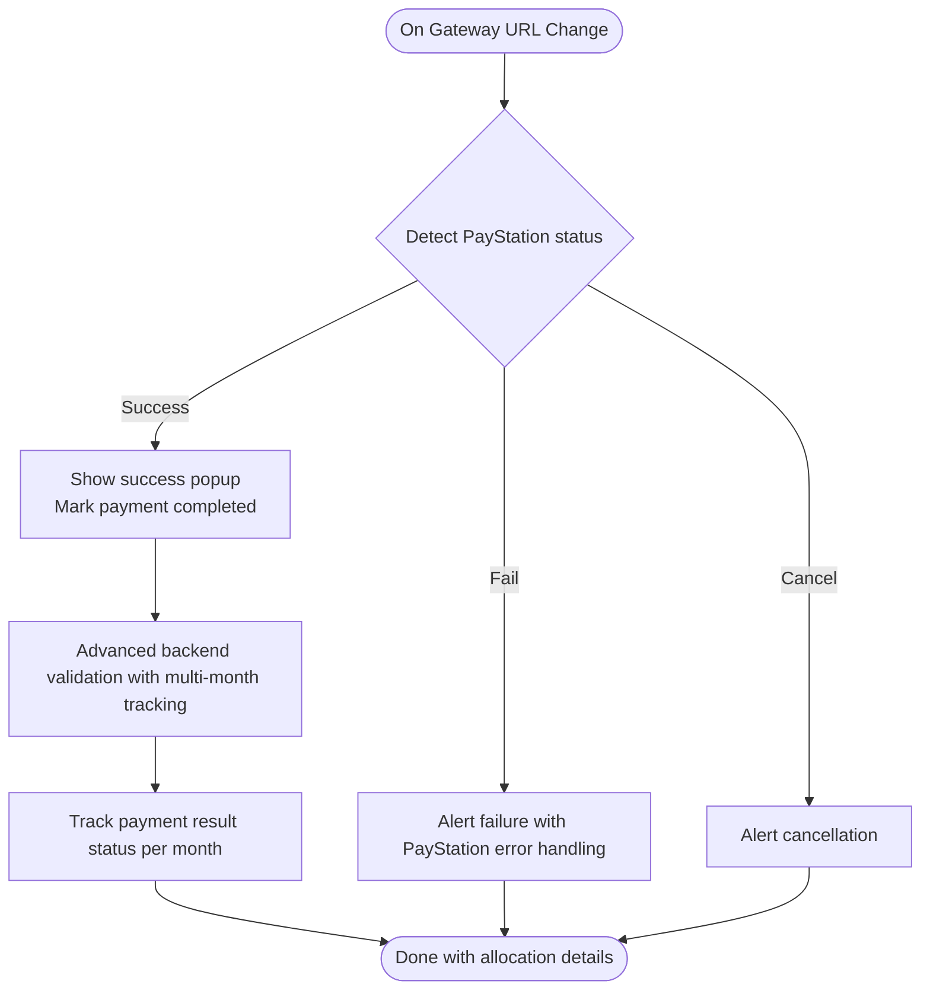
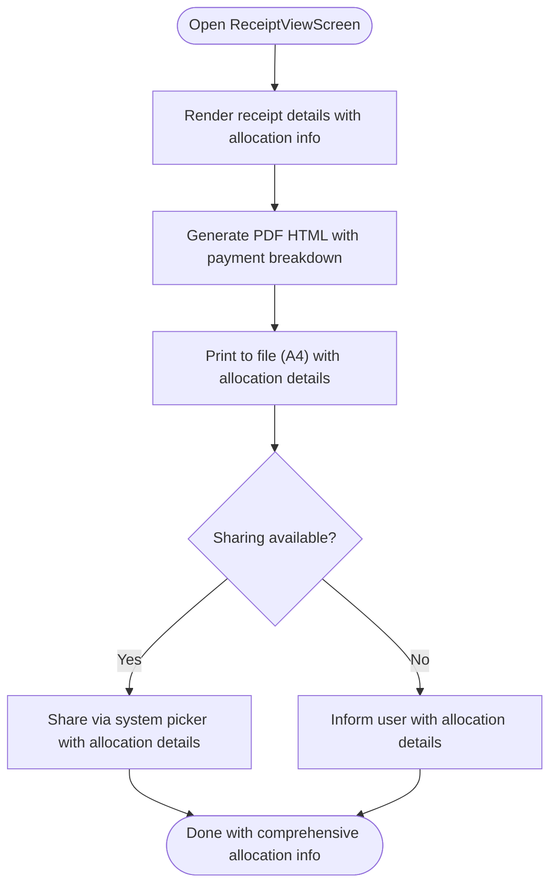
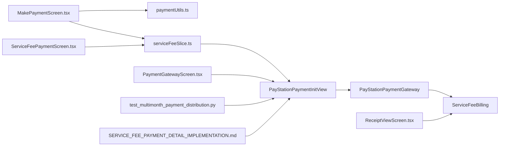

# Payment Workflow & Processing

<cite>
**Referenced Files in This Document**
- [ServiceFeePaymentScreen.tsx](file://Estate_link_App/src/Features/ServiceFeePayment/ServiceFeePaymentScreen.tsx)
- [MakePaymentScreen.tsx](file://Estate_link_App/src/Features/ServiceFeePayment/MakePaymentScreen.tsx)
- [PaymentGatewayScreen.tsx](file://Estate_link_App/src/Features/ServiceFeePayment/PaymentGatewayScreen.tsx)
- [ReceiptViewScreen.tsx](file://Estate_link_App/src/Features/ServiceFeePayment/ReceiptViewScreen.tsx)
- [useServiceFee.ts](file://Estate_link_App/src/hooks/useServiceFee.ts)
- [paymentUtils.ts](file://Estate_link_App/src/utils/paymentUtils.ts)
- [serviceFeeSlice.ts](file://Estate_link_App/src/store/slices/serviceFeeSlice.ts)
- [PayStationPaymentInitView](file://backend/service_fee_management/paystation_views.py)
- [PayStationPaymentSuccessView](file://backend/service_fee_management/paystation_views.py)
- [PayStationPaymentCancelView](file://backend/service_fee_management/paystation_views.py)
- [PayStationPaymentGateway](file://backend/service_fee_management/utils/paystation_utils.py)
- [ServiceFeeBilling](file://backend/service_fee_management/models.py)
- [test_multimonth_payment_distribution.py](file://backend/test_multimonth_payment_distribution.py)
- [SERVICE_FEE_PAYMENT_DETAIL_IMPLEMENTATION.md](file://backend/SERVICE_FEE_PAYMENT_DETAIL_IMPLEMENTATION.md)
</cite>

## Update Summary
**Changes Made**
- Updated payment gateway integration from SSLCommerz to PayStation implementation
- Enhanced payment validation logic with automatic overpayment detection
- Implemented sophisticated payment distribution algorithms for multi-month billing scenarios
- Added advanced payment allocation modal for complex payment scenarios
- Improved automatic advance payment conversion from overpayments

## Table of Contents
1. [Introduction](#introduction)
2. [Project Structure](#project-structure)
3. [Core Components](#core-components)
4. [Architecture Overview](#architecture-overview)
5. [Detailed Component Analysis](#detailed-component-analysis)
6. [Dependency Analysis](#dependency-analysis)
7. [Performance Considerations](#performance-considerations)
8. [Troubleshooting Guide](#troubleshooting-guide)
9. [Conclusion](#conclusion)

## Introduction
This document describes the complete mobile service fee payment workflow, from unit selection and fee calculation to payment confirmation and receipt generation. The system now features an enhanced PayStation payment gateway integration with sophisticated payment distribution algorithms, automatic overpayment detection, and intelligent advance payment conversion for multi-month billing scenarios.

Key enhancements include:
- PayStation payment gateway integration replacing SSLCommerz
- Automatic overpayment detection and advance payment conversion
- Sophisticated payment distribution algorithms for multi-month billing
- Advanced payment allocation modal for complex payment scenarios
- Enhanced payment validation logic with automatic detection of payment modes

## Project Structure
The payment workflow spans three layers with PayStation integration:
- Mobile app screens and utilities with PayStation support
- Redux slice managing state and async actions
- Backend PayStation integration with advanced payment processing

**Diagram sources**
- [ServiceFeePaymentScreen.tsx](file://Estate_link_App/src/Features/ServiceFeePayment/ServiceFeePaymentScreen.tsx#L1-L200)
- [MakePaymentScreen.tsx](file://Estate_link_App/src/Features/ServiceFeePayment/MakePaymentScreen.tsx#L1-L200)
- [PaymentGatewayScreen.tsx](file://Estate_link_App/src/Features/ServiceFeePayment/PaymentGatewayScreen.tsx#L1-L120)
- [ReceiptViewScreen.tsx](file://Estate_link_App/src/Features/ServiceFeePayment/ReceiptViewScreen.tsx#L1-L120)
- [useServiceFee.ts](file://Estate_link_App/src/hooks/useServiceFee.ts#L1-L120)
- [paymentUtils.ts](file://Estate_link_App/src/utils/paymentUtils.ts#L1-L120)
- [serviceFeeSlice.ts](file://Estate_link_App/src/store/slices/serviceFeeSlice.ts#L1-L120)
- [PayStationPaymentInitView](file://backend/service_fee_management/paystation_views.py#L92-L476)
- [PayStationPaymentGateway](file://backend/service_fee_management/utils/paystation_utils.py#L23-L313)
- [ServiceFeeBilling](file://backend/service_fee_management/models.py#L12-L200)

**Section sources**
- [ServiceFeePaymentScreen.tsx](file://Estate_link_App/src/Features/ServiceFeePayment/ServiceFeePaymentScreen.tsx#L1-L200)
- [serviceFeeSlice.ts](file://Estate_link_App/src/store/slices/serviceFeeSlice.ts#L1-L120)

## Core Components
- **ServiceFeePaymentScreen**: Unit selection, monthly payment cards, upcoming billing preview, pull-to-refresh, and navigation to payment flow
- **MakePaymentScreen**: Amount editing, enhanced payment validation, PayStation initialization, payment allocation modal, and gateway navigation
- **PaymentGatewayScreen**: WebView-based PayStation checkout, URL callbacks, success/failure/cancellation detection, and cancellation cleanup
- **ReceiptViewScreen**: Receipt rendering, PDF generation, sharing, and status display
- **useServiceFee hook**: Centralized state management for units, payments, filters, and async actions
- **paymentUtils**: Enhanced payment data processing, validation, formatting, transaction ID generation, and payment allocation algorithms
- **serviceFeeSlice**: Redux slice orchestrating async thunks for access checks, unit fetching, upcoming billing, and payment CRUD
- **PayStationPaymentInitView**: Backend PayStation payment initialization with automatic overpayment detection
- **PayStationPaymentSuccessView**: Advanced payment completion processing with multi-month distribution
- **PayStationPaymentGateway**: PayStation API integration with connection pooling and retry strategies
- **ServiceFeeBilling**: Enhanced billing model with payment result status tracking

**Section sources**
- [ServiceFeePaymentScreen.tsx](file://Estate_link_App/src/Features/ServiceFeePayment/ServiceFeePaymentScreen.tsx#L1-L200)
- [MakePaymentScreen.tsx](file://Estate_link_App/src/Features/ServiceFeePayment/MakePaymentScreen.tsx#L1-L200)
- [PaymentGatewayScreen.tsx](file://Estate_link_App/src/Features/ServiceFeePayment/PaymentGatewayScreen.tsx#L1-L120)
- [ReceiptViewScreen.tsx](file://Estate_link_App/src/Features/ServiceFeePayment/ReceiptViewScreen.tsx#L1-L120)
- [useServiceFee.ts](file://Estate_link_App/src/hooks/useServiceFee.ts#L1-L120)
- [paymentUtils.ts](file://Estate_link_App/src/utils/paymentUtils.ts#L1-L120)
- [serviceFeeSlice.ts](file://Estate_link_App/src/store/slices/serviceFeeSlice.ts#L1-L120)
- [PayStationPaymentInitView](file://backend/service_fee_management/paystation_views.py#L92-L476)
- [PayStationPaymentSuccessView](file://backend/service_fee_management/paystation_views.py#L478-L800)
- [PayStationPaymentGateway](file://backend/service_fee_management/utils/paystation_utils.py#L23-L313)
- [ServiceFeeBilling](file://backend/service_fee_management/models.py#L12-L200)

## Architecture Overview
The enhanced payment workflow now follows a sophisticated PayStation integration with automatic payment mode detection:
1. Access check and unit retrieval
2. Selection of one or more monthly installments with automatic distribution
3. Enhanced amount editing with automatic overpayment detection
4. PayStation initialization with automatic payment mode detection (bill payment vs advance)
5. Advanced payment distribution across multiple months
6. Automatic overpayment conversion to advance payments
7. Real-time status updates and receipt generation

**Diagram sources**
- [ServiceFeePaymentScreen.tsx](file://Estate_link_App/src/Features/ServiceFeePayment/ServiceFeePaymentScreen.tsx#L1-L200)
- [MakePaymentScreen.tsx](file://Estate_link_App/src/Features/ServiceFeePayment/MakePaymentScreen.tsx#L367-L407)
- [PaymentGatewayScreen.tsx](file://Estate_link_App/src/Features/ServiceFeePayment/PaymentGatewayScreen.tsx#L76-L164)
- [PayStationPaymentInitView](file://backend/service_fee_management/paystation_views.py#L92-L476)
- [PayStationPaymentSuccessView](file://backend/service_fee_management/paystation_views.py#L478-L800)

## Detailed Component Analysis

### Enhanced Unit Selection and Monthly Installment Display
The main screen now includes advanced payment allocation visualization and automatic payment mode detection:
- Lists monthly installments per selected unit with payment status indicators
- Supports auto-selection of the first unit with payment records
- Maintains selection across refreshes with enhanced payment history
- Displays upcoming billing preview with payment allocation suggestions

**Diagram sources**
- [ServiceFeePaymentScreen.tsx](file://Estate_link_App/src/Features/ServiceFeePayment/ServiceFeePaymentScreen.tsx#L171-L345)
- [serviceFeeSlice.ts](file://Estate_link_App/src/store/slices/serviceFeeSlice.ts#L233-L318)
- [serviceFeeSlice.ts](file://Estate_link_App/src/store/slices/serviceFeeSlice.ts#L562-L611)

**Section sources**
- [ServiceFeePaymentScreen.tsx](file://Estate_link_App/src/Features/ServiceFeePayment/ServiceFeePaymentScreen.tsx#L145-L345)
- [serviceFeeSlice.ts](file://Estate_link_App/src/store/slices/serviceFeeSlice.ts#L233-L318)

### Advanced Payment Amount Determination and Validation
Enhanced validation now includes automatic payment mode detection and overpayment handling:
- Users can edit the amount to pay with intelligent payment mode detection
- Automatic detection of overpayment scenarios for advance payment conversion
- Sophisticated payment allocation algorithms for multi-month distribution
- Validation ensures amount > 0 and handles both bill payment and advance payment modes
- Selected months are processed with automatic distribution across oldest-first priority

**Diagram sources**
- [MakePaymentScreen.tsx](file://Estate_link_App/src/Features/ServiceFeePayment/MakePaymentScreen.tsx#L247-L297)
- [MakePaymentScreen.tsx](file://Estate_link_App/src/Features/ServiceFeePayment/MakePaymentScreen.tsx#L398-L407)
- [paymentUtils.ts](file://Estate_link_App/src/utils/paymentUtils.ts#L177-L230)

**Section sources**
- [MakePaymentScreen.tsx](file://Estate_link_App/src/Features/ServiceFeePayment/MakePaymentScreen.tsx#L247-L297)
- [MakePaymentScreen.tsx](file://Estate_link_App/src/Features/ServiceFeePayment/MakePaymentScreen.tsx#L398-L407)
- [paymentUtils.ts](file://Estate_link_App/src/utils/paymentUtils.ts#L177-L230)

### Sophisticated Installment Options and Multi-Month Payment Distribution
Advanced payment distribution algorithms now handle complex payment scenarios:
- Multiple months can be selected with automatic oldest-first distribution
- Intelligent payment allocation considering partial payments and overpayments
- Automatic detection of when all selected months are fully paid (convert to advance)
- Sophisticated algorithms for distributing payments across multiple months
- Payment result tracking for each individual month (full, partial, overpayment)

**Diagram sources**
- [paymentUtils.ts](file://Estate_link_App/src/utils/paymentUtils.ts#L146-L175)
- [paymentUtils.ts](file://Estate_link_App/src/utils/paymentUtils.ts#L232-L281)
- [paymentUtils.ts](file://Estate_link_App/src/utils/paymentUtils.ts#L312-L327)
- [PayStationPaymentInitView](file://backend/service_fee_management/paystation_views.py#L326-L344)

**Section sources**
- [paymentUtils.ts](file://Estate_link_App/src/utils/paymentUtils.ts#L146-L175)
- [paymentUtils.ts](file://Estate_link_App/src/utils/paymentUtils.ts#L232-L281)
- [paymentUtils.ts](file://Estate_link_App/src/utils/paymentUtils.ts#L312-L327)
- [PayStationPaymentInitView](file://backend/service_fee_management/paystation_views.py#L326-L344)

### Enhanced Payment Confirmation and PayStation Integration
The payment initiation now includes automatic payment mode detection and advanced distribution:
- The payment initiation screen builds a payload with unit ID, service fee ID, amount, selected months, and customer info
- Enhanced validation includes automatic detection of payment modes (bill payment vs advance)
- Automatic overpayment detection converts excess payments to advance payments
- Sophisticated payment distribution across multiple months with oldest-first priority
- PayStation initialization with advanced transaction mapping and invoice number generation

**Diagram sources**
- [MakePaymentScreen.tsx](file://Estate_link_App/src/Features/ServiceFeePayment/MakePaymentScreen.tsx#L382-L407)
- [MakePaymentScreen.tsx](file://Estate_link_App/src/Features/ServiceFeePayment/MakePaymentScreen.tsx#L409-L656)
- [PayStationPaymentInitView](file://backend/service_fee_management/paystation_views.py#L92-L476)

**Section sources**
- [MakePaymentScreen.tsx](file://Estate_link_App/src/Features/ServiceFeePayment/MakePaymentScreen.tsx#L382-L407)
- [MakePaymentScreen.tsx](file://Estate_link_App/src/Features/ServiceFeePayment/MakePaymentScreen.tsx#L409-L656)
- [PayStationPaymentInitView](file://backend/service_fee_management/paystation_views.py#L92-L476)

### Advanced PayStation Gateway and Real-Time Status Updates
Enhanced gateway handling with sophisticated status processing:
- The gateway screen loads PayStation in a WebView with advanced URL pattern detection
- Enhanced success/failure/cancel detection with PayStation-specific URL patterns
- Automatic payment mode detection and appropriate handling for each scenario
- Advanced backend validation with multi-month payment distribution tracking
- Sophisticated error handling with user-friendly messages for PayStation-specific errors

**Diagram sources**
- [PaymentGatewayScreen.tsx](file://Estate_link_App/src/Features/ServiceFeePayment/PaymentGatewayScreen.tsx#L76-L164)
- [PaymentGatewayScreen.tsx](file://Estate_link_App/src/Features/ServiceFeePayment/PaymentGatewayScreen.tsx#L41-L74)
- [PayStationPaymentSuccessView](file://backend/service_fee_management/paystation_views.py#L478-L800)

**Section sources**
- [PaymentGatewayScreen.tsx](file://Estate_link_App/src/Features/ServiceFeePayment/PaymentGatewayScreen.tsx#L76-L164)
- [PaymentGatewayScreen.tsx](file://Estate_link_App/src/Features/ServiceFeePayment/PaymentGatewayScreen.tsx#L41-L74)
- [PayStationPaymentSuccessView](file://backend/service_fee_management/paystation_views.py#L478-L800)

### Enhanced Receipt Generation and Payment Allocation Display
Advanced receipt generation with detailed payment allocation information:
- The receipt screen renders comprehensive payment details with allocation breakdown
- Displays payment result status for each individual month (full, partial, overpayment)
- Formats currency and dates with enhanced localization support
- Generates detailed PDF with payment allocation information
- Supports sharing via Expo Sharing with payment allocation details

**Diagram sources**
- [ReceiptViewScreen.tsx](file://Estate_link_App/src/Features/ServiceFeePayment/ReceiptViewScreen.tsx#L227-L591)
- [ReceiptViewScreen.tsx](file://Estate_link_App/src/Features/ServiceFeePayment/ReceiptViewScreen.tsx#L593-L703)
- [ServiceFeeBilling](file://backend/service_fee_management/models.py#L50-L62)

**Section sources**
- [ReceiptViewScreen.tsx](file://Estate_link_App/src/Features/ServiceFeePayment/ReceiptViewScreen.tsx#L227-L591)
- [ReceiptViewScreen.tsx](file://Estate_link_App/src/Features/ServiceFeePayment/ReceiptViewScreen.tsx#L593-L703)
- [ServiceFeeBilling](file://backend/service_fee_management/models.py#L50-L62)

### Enhanced Form Validation, Error Handling, and User Feedback
Advanced validation with automatic payment mode detection:
- Enhanced validation includes automatic detection of payment modes (bill payment vs advance)
- Sophisticated error handling with PayStation-specific error messages
- Advanced user feedback with payment allocation previews
- Automatic overpayment detection and conversion to advance payments
- Comprehensive loading indicators and refresh controls for complex payment scenarios

**Section sources**
- [MakePaymentScreen.tsx](file://Estate_link_App/src/Features/ServiceFeePayment/MakePaymentScreen.tsx#L247-L297)
- [MakePaymentScreen.tsx](file://Estate_link_App/src/Features/ServiceFeePayment/MakePaymentScreen.tsx#L398-L407)
- [paymentUtils.ts](file://Estate_link_App/src/utils/paymentUtils.ts#L177-L230)
- [ServiceFeePaymentScreen.tsx](file://Estate_link_App/src/Features/ServiceFeePayment/ServiceFeePaymentScreen.tsx#L399-L441)

### Advanced Mobile-Specific Considerations
Enhanced mobile UX with sophisticated payment handling:
- Touch interactions optimized for complex payment allocation scenarios
- Responsive layouts supporting detailed payment allocation information
- Advanced offline payment handling with PayStation integration
- Enhanced loading states for complex payment distribution processing
- Sophisticated error messaging with actionable solutions

**Section sources**
- [ServiceFeePaymentScreen.tsx](file://Estate_link_App/src/Features/ServiceFeePayment/ServiceFeePaymentScreen.tsx#L45-L48)
- [MakePaymentScreen.tsx](file://Estate_link_App/src/Features/ServiceFeePayment/MakePaymentScreen.tsx#L528-L574)
- [PaymentGatewayScreen.tsx](file://Estate_link_App/src/Features/ServiceFeePayment/PaymentGatewayScreen.tsx#L256-L285)

### Enhanced Security Measures, Token Handling, and Compliance
Advanced security with PayStation integration:
- Authentication enforcement with enhanced token validation
- Secure PayStation integration with encrypted communication
- Advanced data protection with payment allocation tracking
- Enhanced backend compliance with PayStation API standards
- Sophisticated audit trails for all payment allocation decisions

**Section sources**
- [MakePaymentScreen.tsx](file://Estate_link_App/src/Features/ServiceFeePayment/MakePaymentScreen.tsx#L101-L122)
- [MakePaymentScreen.tsx](file://Estate_link_App/src/Features/ServiceFeePayment/MakePaymentScreen.tsx#L411-L448)
- [PayStationPaymentGateway](file://backend/service_fee_management/utils/paystation_utils.py#L23-L313)
- [PayStationPaymentInitView](file://backend/service_fee_management/paystation_views.py#L92-L476)

## Dependency Analysis
The enhanced payment workflow now depends on:
- Redux slice for state orchestration and async data fetching
- Enhanced utility functions for payment processing, validation, and allocation algorithms
- Backend PayStation integration for payment session creation and advanced validation
- Database models with enhanced payment result tracking and allocation details
- Advanced payment distribution algorithms for multi-month scenarios

**Diagram sources**
- [MakePaymentScreen.tsx](file://Estate_link_App/src/Features/ServiceFeePayment/MakePaymentScreen.tsx#L19-L29)
- [paymentUtils.ts](file://Estate_link_App/src/utils/paymentUtils.ts#L1-L32)
- [serviceFeeSlice.ts](file://Estate_link_App/src/store/slices/serviceFeeSlice.ts#L1-L5)
- [PayStationPaymentInitView](file://backend/service_fee_management/paystation_views.py#L92-L476)
- [PayStationPaymentGateway](file://backend/service_fee_management/utils/paystation_utils.py#L23-L313)
- [ServiceFeeBilling](file://backend/service_fee_management/models.py#L12-L200)
- [ServiceFeePaymentScreen.tsx](file://Estate_link_App/src/Features/ServiceFeePayment/ServiceFeePaymentScreen.tsx#L18-L42)
- [PaymentGatewayScreen.tsx](file://Estate_link_App/src/Features/ServiceFeePayment/PaymentGatewayScreen.tsx#L1-L16)
- [ReceiptViewScreen.tsx](file://Estate_link_App/src/Features/ServiceFeePayment/ReceiptViewScreen.tsx#L1-L16)
- [test_multimonth_payment_distribution.py](file://backend/test_multimonth_payment_distribution.py#L71-L113)
- [SERVICE_FEE_PAYMENT_DETAIL_IMPLEMENTATION.md](file://backend/SERVICE_FEE_PAYMENT_DETAIL_IMPLEMENTATION.md#L129-L166)

**Section sources**
- [serviceFeeSlice.ts](file://Estate_link_App/src/store/slices/serviceFeeSlice.ts#L1-L5)
- [PayStationPaymentInitView](file://backend/service_fee_management/paystation_views.py#L92-L476)
- [PayStationPaymentGateway](file://backend/service_fee_management/utils/paystation_utils.py#L23-L313)
- [ServiceFeeBilling](file://backend/service_fee_management/models.py#L12-L200)

## Performance Considerations
Enhanced performance with PayStation integration:
- Network efficiency with PayStation's optimized API endpoints
- Advanced caching strategies for payment allocation calculations
- Connection pooling and retry strategies for PayStation API reliability
- Enhanced UI responsiveness with real-time payment allocation updates
- Optimized gateway performance with PayStation's streamlined checkout process
- Advanced backend reliability with PayStation's robust infrastructure

## Troubleshooting Guide
Enhanced troubleshooting for PayStation integration:
- Authentication errors: If the access token is missing or invalid, the app redirects to login
- PayStation initialization failures: Validate amount and selected months; check PayStation credentials and network connectivity
- Gateway WebView errors: Confirm PayStation URL validity and network connectivity; handle HTTP errors gracefully
- Payment not reflected: Advanced backend validation runs asynchronously with multi-month distribution tracking
- Overpayment handling: Automatic conversion to advance payments with proper allocation tracking
- Payment mode detection: Automatic detection of bill payment vs advance payment scenarios

**Section sources**
- [MakePaymentScreen.tsx](file://Estate_link_App/src/Features/ServiceFeePayment/MakePaymentScreen.tsx#L390-L448)
- [PaymentGatewayScreen.tsx](file://Estate_link_App/src/Features/ServiceFeePayment/PaymentGatewayScreen.tsx#L166-L189)
- [PayStationPaymentInitView](file://backend/service_fee_management/paystation_views.py#L92-L476)
- [PayStationPaymentSuccessView](file://backend/service_fee_management/paystation_views.py#L478-L800)

## Conclusion
The enhanced mobile service fee payment workflow now features sophisticated PayStation integration with automatic payment mode detection, advanced payment distribution algorithms, and intelligent overpayment handling. The system provides comprehensive payment allocation tracking, sophisticated multi-month payment processing, and seamless user experience with enhanced security and compliance measures. The PayStation integration ensures reliable payment processing with advanced error handling and real-time status updates, while the enhanced backend architecture supports complex payment scenarios with automatic overpayment conversion and detailed payment result tracking.