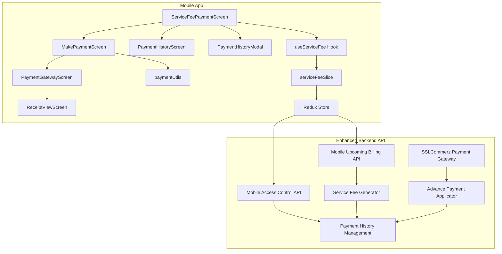
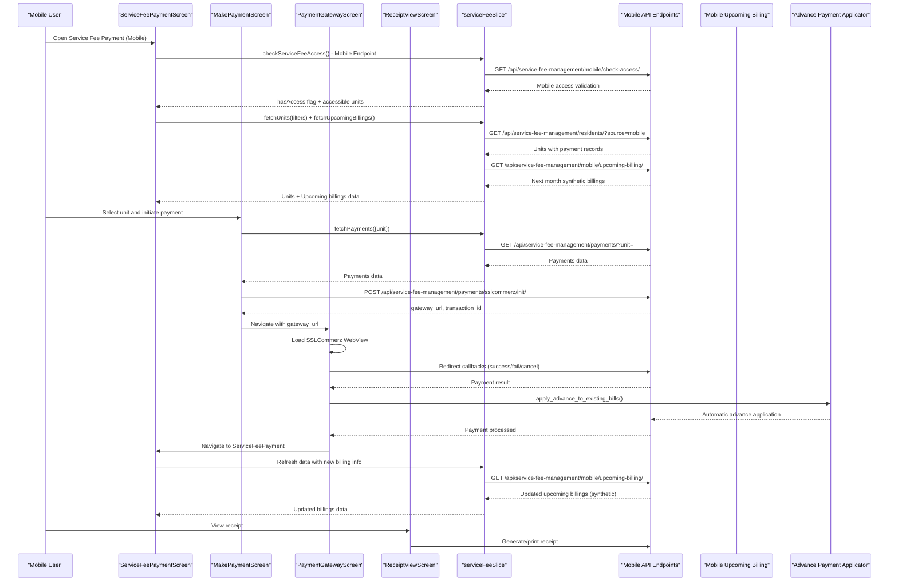
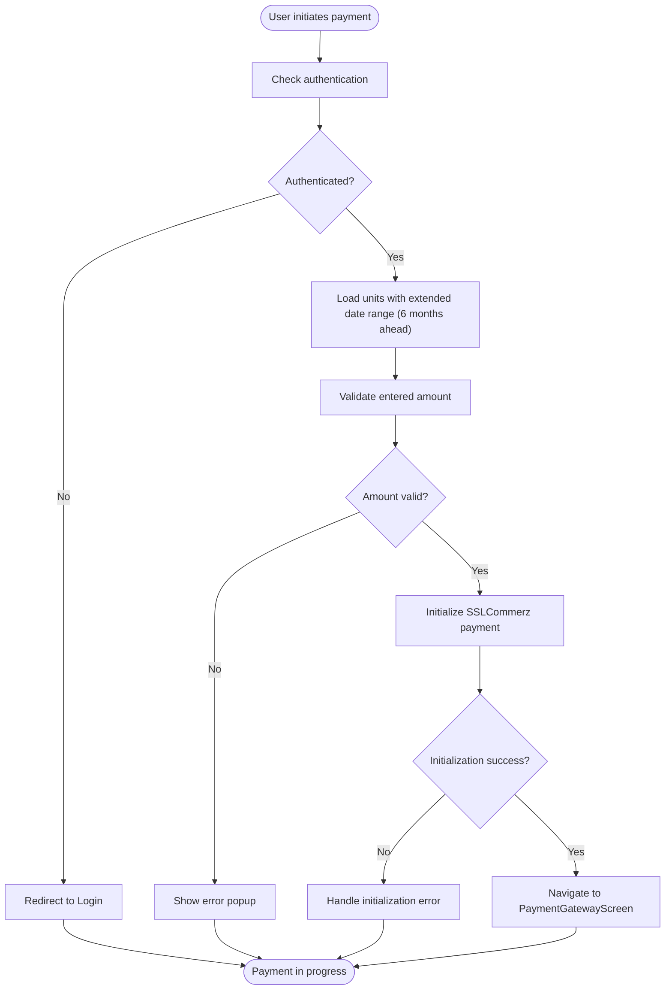
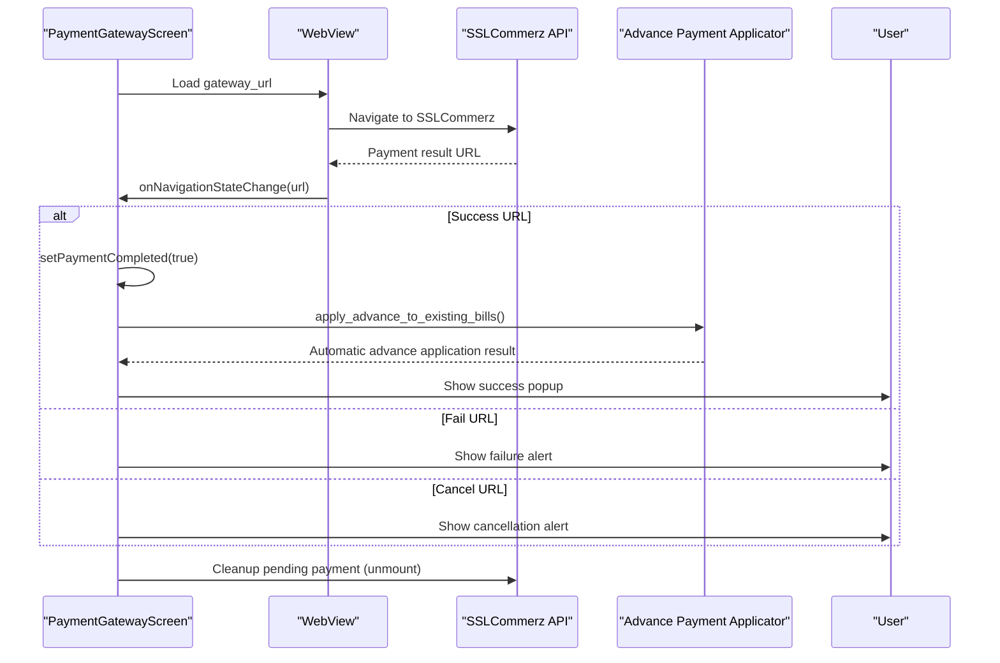
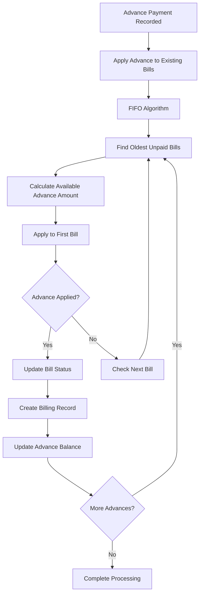
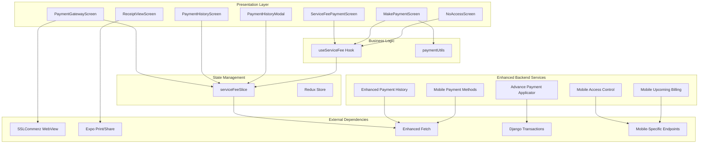

# Service Fee Management

<cite>
**Referenced Files in This Document**
- [ServiceFeePaymentScreen.tsx](file://Estate_link_App/src/Features/ServiceFeePayment/ServiceFeePaymentScreen.tsx)
- [MakePaymentScreen.tsx](file://Estate_link_App/src/Features/ServiceFeePayment/MakePaymentScreen.tsx)
- [PaymentGatewayScreen.tsx](file://Estate_link_App/src/Features/ServiceFeePayment/PaymentGatewayScreen.tsx)
- [ReceiptViewScreen.tsx](file://Estate_link_App/src/Features/ServiceFeePayment/ReceiptViewScreen.tsx)
- [PaymentHistoryScreen.tsx](file://Estate_link_App/src/Features/ServiceFeePayment/PaymentHistoryScreen.tsx)
- [PaymentHistoryModal.tsx](file://Estate_link_App/src/Features/ServiceFeePayment/PaymentHistoryModal.tsx)
- [useServiceFee.ts](file://Estate_link_App/src/hooks/useServiceFee.ts)
- [paymentUtils.ts](file://Estate_link_App/src/utils/paymentUtils.ts)
- [serviceFeeSlice.ts](file://Estate_link_App/src/store/slices/serviceFeeSlice.ts)
- [index.ts](file://Estate_link_App/src/store/index.ts)
- [NoAccessScreen.tsx](file://Estate_link_App/src/Features/ServiceFeePayment/NoAccessScreen.tsx)
- [ServiceFeePayment.logic.ts](file://Estate_link_App/src/Features/ServiceFeePayment/TestServiceFeePayment/ServiceFeePayment.logic.ts)
- [SSLCommerzPayment.logic.ts](file://Estate_link_App/src/Features/ServiceFeePayment/TestServiceFeePayment/SSLCommerzPayment.logic.ts)
- [serviceFee.ts](file://Estate_link_App/src/types/serviceFee.ts)
- [views.py](file://backend/service_fee_management/views.py)
- [models.py](file://backend/service_fee_management/models.py)
- [advance_payment_applicator.py](file://backend/service_fee_management/utils/advance_payment_applicator.py)
- [service_fee_generator.py](file://backend/service_fee_management/utils/service_fee_generator.py)
- [ADVANCE_PAYMENT_FLOW_DIAGRAM.txt](file://backend/service_fee_management/ADVANCE_PAYMENT_FLOW_DIAGRAM.txt)
- [urls.py](file://backend/service_fee_management/urls.py)
</cite>

## Update Summary
**Changes Made**
- Enhanced mobile service fee access control with dedicated mobile endpoint integration
- Implemented mobile-specific upcoming billing system with synthetic billing generation
- Updated payment workflow with improved mobile payment processing capabilities
- Enhanced payment history records with better filtering and display logic
- Improved mobile integration with dedicated mobile endpoints and access validation
- Updated service fee management features for mobile app availability

## Table of Contents
1. [Introduction](#introduction)
2. [Project Structure](#project-structure)
3. [Core Components](#core-components)
4. [Architecture Overview](#architecture-overview)
5. [Detailed Component Analysis](#detailed-component-analysis)
6. [Enhanced Mobile Integration](#enhanced-mobile-integration)
7. [Advanced Payment Processing](#advanced-payment-processing)
8. [Administrative Features](#administrative-features)
9. [Dependency Analysis](#dependency-analysis)
10. [Performance Considerations](#performance-considerations)
11. [Troubleshooting Guide](#troubleshooting-guide)
12. [Conclusion](#conclusion)

## Introduction
This document provides comprehensive documentation for the enhanced mobile service fee payment system. The system now features advanced mobile-specific integration with dedicated endpoints, synthetic billing generation from current service fee settings, improved payment processing with automatic advance payment application, and sophisticated administrative capabilities. It covers the complete payment workflow from fee calculation to receipt generation, including payment gateway integration with SSLCommerz, transaction processing, payment history management, receipt viewing, and access control mechanisms optimized for mobile platforms.

**Updated** Enhanced with new mobile access control, synthetic billing generation, improved payment processing capabilities, and updated mobile integration features.

## Project Structure
The service fee payment system is implemented within the Estate_link_App under the ServiceFeePayment feature, with enhanced backend support for advanced mobile-specific billing management. Key components include:
- Mobile-optimized payment workflow screens: ServiceFeePaymentScreen, MakePaymentScreen, PaymentGatewayScreen, ReceiptViewScreen, PaymentHistoryScreen, PaymentHistoryModal
- Business logic and utilities: useServiceFee hook, paymentUtils, serviceFeeSlice (Redux)
- Advanced backend features: mobile access control, synthetic billing generation, advance payment application, penalty management
- Administrative utilities: payment methods, reminder scheduling, audit trails
- Testing utilities: ServiceFeePayment.logic, SSLCommerzPayment.logic
- Types: serviceFee.ts

**Diagram sources**
- [ServiceFeePaymentScreen.tsx](file://Estate_link_App/src/Features/ServiceFeePayment/ServiceFeePaymentScreen.tsx#L1-L800)
- [MakePaymentScreen.tsx](file://Estate_link_App/src/Features/ServiceFeePayment/MakePaymentScreen.tsx#L1-L639)
- [PaymentGatewayScreen.tsx](file://Estate_link_App/src/Features/ServiceFeePayment/PaymentGatewayScreen.tsx#L1-L327)
- [ReceiptViewScreen.tsx](file://Estate_link_App/src/Features/ServiceFeePayment/ReceiptViewScreen.tsx#L1-L890)
- [PaymentHistoryScreen.tsx](file://Estate_link_App/src/Features/ServiceFeePayment/PaymentHistoryScreen.tsx#L1-L1074)
- [PaymentHistoryModal.tsx](file://Estate_link_App/src/Features/ServiceFeePayment/PaymentHistoryModal.tsx#L1-L388)
- [useServiceFee.ts](file://Estate_link_App/src/hooks/useServiceFee.ts#L1-L188)
- [paymentUtils.ts](file://Estate_link_App/src/utils/paymentUtils.ts#L1-L328)
- [serviceFeeSlice.ts](file://Estate_link_App/src/store/slices/serviceFeeSlice.ts#L1-L936)
- [index.ts](file://Estate_link_App/src/store/index.ts#L1-L79)
- [views.py](file://backend/service_fee_management/views.py#L9403-L9539)
- [service_fee_generator.py](file://backend/service_fee_management/utils/service_fee_generator.py#L1-L200)
- [advance_payment_applicator.py](file://backend/service_fee_management/utils/advance_payment_applicator.py#L1-L200)
- [urls.py](file://backend/service_fee_management/urls.py#L67-L85)

**Section sources**
- [ServiceFeePaymentScreen.tsx](file://Estate_link_App/src/Features/ServiceFeePayment/ServiceFeePaymentScreen.tsx#L1-L800)
- [MakePaymentScreen.tsx](file://Estate_link_App/src/Features/ServiceFeePayment/MakePaymentScreen.tsx#L1-L639)
- [PaymentGatewayScreen.tsx](file://Estate_link_App/src/Features/ServiceFeePayment/PaymentGatewayScreen.tsx#L1-L327)
- [ReceiptViewScreen.tsx](file://Estate_link_App/src/Features/ServiceFeePayment/ReceiptViewScreen.tsx#L1-L890)
- [PaymentHistoryScreen.tsx](file://Estate_link_App/src/Features/ServiceFeePayment/PaymentHistoryScreen.tsx#L1-L1074)
- [PaymentHistoryModal.tsx](file://Estate_link_App/src/Features/ServiceFeePayment/PaymentHistoryModal.tsx#L1-L388)
- [useServiceFee.ts](file://Estate_link_App/src/hooks/useServiceFee.ts#L1-L188)
- [paymentUtils.ts](file://Estate_link_App/src/utils/paymentUtils.ts#L1-L328)
- [serviceFeeSlice.ts](file://Estate_link_App/src/store/slices/serviceFeeSlice.ts#L1-L936)
- [index.ts](file://Estate_link_App/src/store/index.ts#L1-L79)

## Core Components
- ServiceFeePaymentScreen: Main dashboard displaying units, upcoming billings, payment status cards, and navigation controls with enhanced mobile upcoming billing integration and improved unit selection logic.
- MakePaymentScreen: Handles payment creation, amount editing, validation, and SSLCommerz payment initialization with extended date range loading and enhanced payment processing.
- PaymentGatewayScreen: Hosts SSLCommerz WebView, handles success/failure/cancellation callbacks, and manages pending payment cleanup with enhanced transaction handling.
- ReceiptViewScreen: Generates and displays printable receipts with payment details, supports PDF download and sharing with improved formatting and payment method extraction.
- PaymentHistoryScreen: Lists historical payments with filtering by date ranges and navigation to receipt details with enhanced data management and improved payment filtering logic.
- PaymentHistoryModal: Modal overlay showing payment history for a selected unit with refresh capabilities and improved data presentation.
- useServiceFee hook: Centralizes service fee data fetching, state management, and actions for units, payments, filters, and access control with enhanced mobile-specific features.
- paymentUtils: Provides payment data processing, validation, formatting, and transaction ID generation with improved payment allocation logic.
- serviceFeeSlice: Redux slice managing service fee state, async thunks for API calls, and state transitions with mobile-specific upcoming billing integration and enhanced access control.
- NoAccessScreen: Displays access denial with retry mechanism using access check thunk.
- **New**: Mobile Access Control: Backend endpoint for mobile-specific access validation with community member requirements.
- **New**: Mobile Upcoming Billing: Synthetic billing generation system that creates next month's billing data from current service fee settings.
- **New**: Enhanced Payment History: Improved filtering logic that distinguishes between actual payments and unpaid/pending bills.

**Section sources**
- [ServiceFeePaymentScreen.tsx](file://Estate_link_App/src/Features/ServiceFeePayment/ServiceFeePaymentScreen.tsx#L1-L800)
- [MakePaymentScreen.tsx](file://Estate_link_App/src/Features/ServiceFeePayment/MakePaymentScreen.tsx#L1-L639)
- [PaymentGatewayScreen.tsx](file://Estate_link_App/src/Features/ServiceFeePayment/PaymentGatewayScreen.tsx#L1-L327)
- [ReceiptViewScreen.tsx](file://Estate_link_App/src/Features/ServiceFeePayment/ReceiptViewScreen.tsx#L1-L890)
- [PaymentHistoryScreen.tsx](file://Estate_link_App/src/Features/ServiceFeePayment/PaymentHistoryScreen.tsx#L1-L1074)
- [PaymentHistoryModal.tsx](file://Estate_link_App/src/Features/ServiceFeePayment/PaymentHistoryModal.tsx#L1-L388)
- [useServiceFee.ts](file://Estate_link_App/src/hooks/useServiceFee.ts#L1-L188)
- [paymentUtils.ts](file://Estate_link_App/src/utils/paymentUtils.ts#L1-L328)
- [serviceFeeSlice.ts](file://Estate_link_App/src/store/slices/serviceFeeSlice.ts#L1-L936)
- [NoAccessScreen.tsx](file://Estate_link_App/src/Features/ServiceFeePayment/NoAccessScreen.tsx#L1-L98)

## Architecture Overview
The enhanced system follows a mobile-first architecture with React Native screens, Redux for state management, and RESTful backend integration optimized for mobile platforms. The flow now includes advanced mobile-specific features including dedicated access control, synthetic billing generation, and automatic advance payment application, beginning with mobile-specific access verification, followed by data fetching, user selection, payment initiation via SSLCommerz, and post-payment receipt generation with enhanced administrative capabilities.

**Diagram sources**
- [ServiceFeePaymentScreen.tsx](file://Estate_link_App/src/Features/ServiceFeePayment/ServiceFeePaymentScreen.tsx#L170-L245)
- [MakePaymentScreen.tsx](file://Estate_link_App/src/Features/ServiceFeePayment/MakePaymentScreen.tsx#L299-L488)
- [PaymentGatewayScreen.tsx](file://Estate_link_App/src/Features/ServiceFeePayment/PaymentGatewayScreen.tsx#L76-L164)
- [ReceiptViewScreen.tsx](file://Estate_link_App/src/Features/ServiceFeePayment/ReceiptViewScreen.tsx#L593-L703)
- [serviceFeeSlice.ts](file://Estate_link_App/src/store/slices/serviceFeeSlice.ts#L175-L231)
- [serviceFeeSlice.ts](file://Estate_link_App/src/store/slices/serviceFeeSlice.ts#L233-L318)
- [serviceFeeSlice.ts](file://Estate_link_App/src/store/slices/serviceFeeSlice.ts#L320-L402)
- [serviceFeeSlice.ts](file://Estate_link_App/src/store/slices/serviceFeeSlice.ts#L562-L599)

## Detailed Component Analysis

### ServiceFeePaymentScreen
- Purpose: Main dashboard for service fee management, displaying units, upcoming billings, and payment status cards with enhanced mobile integration.
- Key features:
  - Auto-refresh logic with periodic checks and app foreground detection
  - Unit selection with fallback logic for units without payment records
  - Filtering and sorting of monthly payments for selected unit
  - Status calculation using backend service_status or fallback logic
  - **Enhanced**: Mobile upcoming billing integration for next month's synthetic billings
  - **Enhanced**: Improved unit selection logic that prioritizes units with payment records
  - **Enhanced**: Better handling of units from access check vs units with service fees
- Mobile-specific patterns:
  - Responsive dropdown height and scroll area calculations
  - Periodic month change detection to show new payment cards
  - Pull-to-refresh with enhanced logging and mobile-specific data fetching
  - Improved error handling for empty payment data scenarios

**Section sources**
- [ServiceFeePaymentScreen.tsx](file://Estate_link_App/src/Features/ServiceFeePayment/ServiceFeePaymentScreen.tsx#L170-L393)
- [ServiceFeePaymentScreen.tsx](file://Estate_link_App/src/Features/ServiceFeePayment/ServiceFeePaymentScreen.tsx#L399-L441)
- [ServiceFeePaymentScreen.tsx](file://Estate_link_App/src/Features/ServiceFeePayment/ServiceFeePaymentScreen.tsx#L496-L601)
- [ServiceFeePaymentScreen.tsx](file://Estate_link_App/src/Features/ServiceFeePayment/ServiceFeePaymentScreen.tsx#L633-L800)

### MakePaymentScreen
- Purpose: Handles payment creation, amount editing, validation, and SSLCommerz initialization with enhanced payment processing.
- Key features:
  - Authentication check with redirect to login if not authenticated
  - Amount validation with editable amount field
  - Payment data preparation using paymentUtils with improved allocation logic
  - SSLCommerz payment initialization via backend API
  - Error handling for authentication and payment initialization failures
  - **Enhanced**: Extended date range loading for payment selection (up to 6 months ahead)
  - **Enhanced**: Improved payment validation with comprehensive error/warning reporting
  - **Enhanced**: Better handling of selected payment data from route parameters
- Mobile-specific patterns:
  - Extended date range loading for payment selection
  - Animated loading icon during processing
  - Optimistic UI with immediate success feedback
  - Enhanced error handling for authentication failures

**Diagram sources**
- [MakePaymentScreen.tsx](file://Estate_link_App/src/Features/ServiceFeePayment/MakePaymentScreen.tsx#L101-L122)
- [MakePaymentScreen.tsx](file://Estate_link_App/src/Features/ServiceFeePayment/MakePaymentScreen.tsx#L133-L171)
- [MakePaymentScreen.tsx](file://Estate_link_App/src/Features/ServiceFeePayment/MakePaymentScreen.tsx#L253-L270)
- [MakePaymentScreen.tsx](file://Estate_link_App/src/Features/ServiceFeePayment/MakePaymentScreen.tsx#L299-L488)

**Section sources**
- [MakePaymentScreen.tsx](file://Estate_link_App/src/Features/ServiceFeePayment/MakePaymentScreen.tsx#L101-L122)
- [MakePaymentScreen.tsx](file://Estate_link_App/src/Features/ServiceFeePayment/MakePaymentScreen.tsx#L133-L171)
- [MakePaymentScreen.tsx](file://Estate_link_App/src/Features/ServiceFeePayment/MakePaymentScreen.tsx#L253-L270)
- [MakePaymentScreen.tsx](file://Estate_link_App/src/Features/ServiceFeePayment/MakePaymentScreen.tsx#L299-L488)

### PaymentGatewayScreen
- Purpose: Hosts SSLCommerz WebView and manages payment lifecycle with enhanced transaction handling.
- Key features:
  - WebView navigation state monitoring for success/failure/cancel URLs
  - Pending payment cleanup on component unmount with improved error handling
  - Real-time payment status updates and user feedback
  - Security indicators and loading states
  - **Enhanced**: Automatic advance payment application after successful payment
  - **Enhanced**: Improved payment validation with optimistic UI feedback
  - **Enhanced**: Better error handling for WebView loading failures
- Mobile-specific patterns:
  - Hardware acceleration for WebView rendering
  - Mixed content mode enabled for secure payment pages
  - Progress tracking during payment processing
  - Enhanced loading indicators and user feedback

**Diagram sources**
- [PaymentGatewayScreen.tsx](file://Estate_link_App/src/Features/ServiceFeePayment/PaymentGatewayScreen.tsx#L76-L164)
- [PaymentGatewayScreen.tsx](file://Estate_link_App/src/Features/ServiceFeePayment/PaymentGatewayScreen.tsx#L52-L74)

**Section sources**
- [PaymentGatewayScreen.tsx](file://Estate_link_App/src/Features/ServiceFeePayment/PaymentGatewayScreen.tsx#L19-L50)
- [PaymentGatewayScreen.tsx](file://Estate_link_App/src/Features/ServiceFeePayment/PaymentGatewayScreen.tsx#L76-L164)
- [PaymentGatewayScreen.tsx](file://Estate_link_App/src/Features/ServiceFeePayment/PaymentGatewayScreen.tsx#L195-L200)

### ReceiptViewScreen
- Purpose: Generates and displays printable receipts with payment details and enhanced formatting.
- Key features:
  - Dynamic receipt generation using HTML template
  - PDF download and sharing via Expo Print and Sharing
  - Payment method extraction and formatting with improved card type handling
  - Partial vs full payment handling
  - **Enhanced**: Improved receipt formatting with better payment detail presentation
  - **Enhanced**: Better payment method detection from various data sources
- Mobile-specific patterns:
  - Cross-platform PDF generation using Expo Print
  - Sharing integration for seamless document distribution
  - Responsive layout for receipt display
  - Enhanced payment method formatting for mobile displays

**Section sources**
- [ReceiptViewScreen.tsx](file://Estate_link_App/src/Features/ServiceFeePayment/ReceiptViewScreen.tsx#L227-L591)
- [ReceiptViewScreen.tsx](file://Estate_link_App/src/Features/ServiceFeePayment/ReceiptViewScreen.tsx#L593-L703)
- [ReceiptViewScreen.tsx](file://Estate_link_App/src/Features/ServiceFeePayment/ReceiptViewScreen.tsx#L705-L800)

### PaymentHistoryScreen
- Purpose: Lists historical payments with filtering and navigation to receipt details with enhanced data management.
- Key features:
  - Date range filtering (last 3 months, this year, custom)
  - Payment status display (Paid/Partial)
  - Navigation to receipt view with payment and unit data
  - Refresh control and loading states
  - **Enhanced**: Improved payment data presentation and filtering capabilities
  - **Enhanced**: Better distinction between actual payments and unpaid/pending bills
  - **Enhanced**: Improved payment filtering logic that excludes unpaid bills
- Mobile-specific patterns:
  - Custom date picker integration
  - FlatList optimization for large datasets
  - Pull-to-refresh with enhanced UX
  - Better handling of payment status display

**Section sources**
- [PaymentHistoryScreen.tsx](file://Estate_link_App/src/Features/ServiceFeePayment/PaymentHistoryScreen.tsx#L58-L206)
- [PaymentHistoryScreen.tsx](file://Estate_link_App/src/Features/ServiceFeePayment/PaymentHistoryScreen.tsx#L208-L364)
- [PaymentHistoryScreen.tsx](file://Estate_link_App/src/Features/ServiceFeePayment/PaymentHistoryScreen.tsx#L367-L432)
- [PaymentHistoryScreen.tsx](file://Estate_link_App/src/Features/ServiceFeePayment/PaymentHistoryScreen.tsx#L764-L774)

### PaymentHistoryModal
- Purpose: Modal overlay showing payment history for a selected unit with enhanced data presentation.
- Key features:
  - Slide-up presentation style
  - Refresh control for updating payment data
  - Detailed payment information display
  - Progress indicators for partial payments
  - **Enhanced**: Improved modal layout and payment data visualization
- Mobile-specific patterns:
  - Responsive modal sizing for mobile screens
  - Smooth slide-up animations for better UX
  - Optimized scrolling for payment history lists

**Section sources**
- [PaymentHistoryModal.tsx](file://Estate_link_App/src/Features/ServiceFeePayment/PaymentHistoryModal.tsx#L1-L388)

### useServiceFee Hook
- Purpose: Centralizes service fee data fetching and state management with enhanced administrative features.
- Key features:
  - Access control checking on mount with mobile endpoint
  - Unit and payment data fetching with filters
  - Computed values for statistics and status
  - Error handling and loading states
  - **Enhanced**: Upcoming billing data fetching for mobile-specific billing information
  - **Enhanced**: Better handling of units from access check vs units with service fees
- Mobile-specific patterns:
  - Automatic access check on component mount using mobile endpoint
  - Computed statistics for dashboard display
  - Filter management for efficient data retrieval
  - Mobile-specific upcoming billing integration

**Section sources**
- [useServiceFee.ts](file://Estate_link_App/src/hooks/useServiceFee.ts#L1-L188)

### paymentUtils
- Purpose: Provides payment data processing, validation, formatting, and transaction ID generation with improved payment allocation logic.
- Key features:
  - Payment ID parsing supporting multiple formats
  - Payment data lookup by ID
  - Selected payment processing with sorting
  - Payment validation with comprehensive error/warning reporting
  - Amount and date formatting utilities
  - Transaction ID generation for unique identifiers
  - **Enhanced**: Improved payment allocation logic for partial payments and advance applications
  - **Enhanced**: Better customer data sanitization for mobile payment processing
- Mobile-specific patterns:
  - Enhanced payment validation for mobile payment scenarios
  - Improved amount formatting for mobile displays
  - Better transaction ID generation for mobile transactions

**Section sources**
- [paymentUtils.ts](file://Estate_link_App/src/utils/paymentUtils.ts#L40-L144)
- [paymentUtils.ts](file://Estate_link_App/src/utils/paymentUtils.ts#L149-L175)
- [paymentUtils.ts](file://Estate_link_App/src/utils/paymentUtils.ts#L180-L230)
- [paymentUtils.ts](file://Estate_link_App/src/utils/paymentUtils.ts#L306-L327)

### serviceFeeSlice
- Purpose: Redux slice managing service fee state and async thunks with enhanced mobile integration.
- Key features:
  - Access control checking with dedicated mobile endpoint
  - Unit data fetching with comprehensive filtering
  - Payment data fetching with pagination and ordering
  - Payment CRUD operations with authentication
  - Payment choices and filter options fetching
  - Upcoming billings fetching for next month with mobile-specific endpoint
  - State management for loading, error, and access control
  - **Enhanced**: Mobile upcoming billing integration for synthetic billing data
  - **Enhanced**: Better handling of empty payment data scenarios
- Mobile-specific patterns:
  - Dedicated mobile endpoints for access and upcoming billing
  - Source parameter filtering for mobile requests
  - Enhanced error handling and logging
  - Synthetic billing data handling for mobile display
  - Improved unit selection logic for mobile scenarios

**Section sources**
- [serviceFeeSlice.ts](file://Estate_link_App/src/store/slices/serviceFeeSlice.ts#L175-L231)
- [serviceFeeSlice.ts](file://Estate_link_App/src/store/slices/serviceFeeSlice.ts#L233-L318)
- [serviceFeeSlice.ts](file://Estate_link_App/src/store/slices/serviceFeeSlice.ts#L320-L402)
- [serviceFeeSlice.ts](file://Estate_link_App/src/store/slices/serviceFeeSlice.ts#L404-L439)
- [serviceFeeSlice.ts](file://Estate_link_App/src/store/slices/serviceFeeSlice.ts#L562-L611)

### NoAccessScreen
- Purpose: Displays access denial with retry mechanism and enhanced user guidance.
- Key features:
  - Pull-to-refresh for access check retry
  - Clear messaging about access requirements
  - Back navigation support
  - **Enhanced**: Improved user guidance for access-related issues
  - **Enhanced**: Better handling of mobile-specific access restrictions
- Mobile-specific patterns:
  - Optimized layout for mobile screen sizes
  - Enhanced retry mechanism for better user experience

**Section sources**
- [NoAccessScreen.tsx](file://Estate_link_App/src/Features/ServiceFeePayment/NoAccessScreen.tsx#L1-L98)

### Testing Utilities
- ServiceFeePayment.logic: Pure logic implementation for payment validation and processing simulation.
- SSLCommerzPayment.logic: SSLCommerz-specific logic including initialization, callback parsing, and cancellation.

**Section sources**
- [ServiceFeePayment.logic.ts](file://Estate_link_App/src/Features/ServiceFeePayment/TestServiceFeePayment/ServiceFeePayment.logic.ts#L1-L118)
- [SSLCommerzPayment.logic.ts](file://Estate_link_App/src/Features/ServiceFeePayment/TestServiceFeePayment/SSLCommerzPayment.logic.ts#L1-L104)

## Enhanced Mobile Integration
The system now includes comprehensive mobile-specific features that optimize the service fee payment experience for mobile users:

### Mobile Access Control System
- **Purpose**: Validates mobile app access for community members with enhanced security
- **Key Features**:
  - Community member requirement for mobile app access
  - Resident validation through Resident table
  - Contact information matching for unit ownership verification
  - Mobile-specific access restrictions for organization-only members
  - Enhanced user contact matching via email and phone numbers
- **Mobile-Specific Benefits**:
  - Prevents organization-only members from accessing mobile app
  - Ensures only legitimate unit residents can access service fee payments
  - Streamlined access validation for mobile platform
  - Improved security through contact information verification

### Mobile Upcoming Billing System
- **Purpose**: Provides next month's billing data based on current service fee settings with synthetic generation
- **Key Features**:
  - Synthetic billing generation from current service fee configurations
  - Real-time fee amount reflection based on active service fee settings
  - Mobile-optimized billing data structure with is_synthetic flag
  - Automatic billing amount updates when service fee settings change
  - Enhanced billing data with fee_amount vs billing_amount comparison
- **Mobile-Specific Benefits**:
  - Ensures users see accurate upcoming billing amounts
  - Reflects real-time service fee changes immediately
  - Reduces billing discrepancies between mobile and backend systems
  - Provides clear indication of synthetic vs generated billing records

### Mobile Payment Workflow Enhancements
- **Enhanced Payment Processing**:
  - Improved mobile payment validation and error handling
  - Better handling of payment data from route parameters
  - Enhanced SSLCommerz integration for mobile platforms
  - Optimized payment flow for mobile screen constraints
- **Mobile-Specific Improvements**:
  - Better responsive design for mobile payment screens
  - Enhanced loading states and user feedback
  - Improved error handling for mobile network conditions
  - Optimized payment amount entry for mobile keyboards

**Section sources**
- [views.py](file://backend/service_fee_management/views.py#L9403-L9539)
- [views.py](file://backend/service_fee_management/views.py#L9325-L9365)
- [urls.py](file://backend/service_fee_management/urls.py#L67-L85)
- [serviceFeeSlice.ts](file://Estate_link_App/src/store/slices/serviceFeeSlice.ts#L175-L231)
- [serviceFeeSlice.ts](file://Estate_link_App/src/store/slices/serviceFeeSlice.ts#L562-L611)

## Advanced Payment Processing
The payment processing system has been significantly enhanced with automatic advance payment application and improved mobile integration:

### Advance Payment Applicator
- **Purpose**: Automatically applies advance payments to existing unpaid bills
- **Key Features**:
  - FIFO (First In, First Out) allocation logic for advance payments
  - Automatic application when advance payments are recorded
  - Sequential application to oldest unpaid bills first
  - Comprehensive audit trail for all advance applications
- **Processing Logic**:
  - Finds available advances for the unit and account holder
  - Identifies unpaid or partially paid bills ordered by due date
  - Applies advance amounts sequentially to minimize outstanding balances
  - Creates detailed billing records for audit purposes

### Enhanced Payment Allocation
- **Payment Priority Order**:
  1. Pay Penalty First (if exists)
  2. Pay Base Fee (original fixed amount)
  3. Pay Bill Categories (additional charges)
  4. Excess becomes Advance Payment
- **Automatic Settlement**:
  - Advance payments automatically settle oldest unpaid bills first
  - Partial advance applications create partial payment status
  - Complete advance application marks bills as fully paid
  - Real-time status updates across all payment records

### Mobile Payment History Enhancement
- **Improved Payment Filtering**:
  - Better distinction between actual payments and unpaid/pending bills
  - Enhanced filtering logic that excludes unpaid bills from payment history
  - Improved payment status display for mobile users
  - Better handling of partial payments and payment records
- **Mobile-Specific Improvements**:
  - Optimized payment history display for mobile screens
  - Enhanced payment status indicators for better mobile UX
  - Improved payment detail presentation for mobile devices

**Diagram sources**
- [advance_payment_applicator.py](file://backend/service_fee_management/utils/advance_payment_applicator.py#L15-L200)
- [ADVANCE_PAYMENT_FLOW_DIAGRAM.txt](file://backend/service_fee_management/ADVANCE_PAYMENT_FLOW_DIAGRAM.txt#L33-L90)

**Section sources**
- [advance_payment_applicator.py](file://backend/service_fee_management/utils/advance_payment_applicator.py#L1-L200)
- [ADVANCE_PAYMENT_FLOW_DIAGRAM.txt](file://backend/service_fee_management/ADVANCE_PAYMENT_FLOW_DIAGRAM.txt#L1-L168)
- [PaymentHistoryScreen.tsx](file://Estate_link_App/src/Features/ServiceFeePayment/PaymentHistoryScreen.tsx#L275-L612)

## Administrative Features
The system includes comprehensive administrative capabilities for service fee management with enhanced mobile integration:

### Payment Methods Management
- **Supported Payment Methods**:
  - Cash payments with cash account mapping
  - Mobile financial services (bKash, Nagad, Rocket)
  - Online payment gateway (SSLCommerz)
  - Bank transfers with bank account mapping
- **Mobile-Specific Features**:
  - Enhanced mobile financial service validation
  - Improved payment method display for mobile users
  - Better integration with mobile payment providers

### Penalty Management System
- **Late Penalty Configuration**:
  - Tier-based penalty calculation system
  - Maximum penalty percentage per service fee
  - Automatic penalty application based on due dates
  - Penalty waiver functionality with audit trails
- **Mobile-Specific Benefits**:
  - Real-time penalty calculation for mobile users
  - Enhanced penalty display in mobile payment screens
  - Improved penalty waiver processing for mobile administrators

### Reminder and Notification System
- **Automated Reminders**:
  - Pre-due date reminders (before days configuration)
  - Post-due date reminders (after days configuration)
  - Multi-channel notification delivery
  - Targeted audience configuration
- **Mobile-Specific Features**:
  - Enhanced push notifications for mobile devices
  - Improved reminder scheduling for mobile users
  - Better notification delivery to mobile platforms

**Section sources**
- [models.py](file://backend/service_fee_management/models.py#L152-L200)
- [views.py](file://backend/service_fee_management/views.py#L140-L157)

## Dependency Analysis
The enhanced system exhibits clear separation of concerns with well-defined dependencies and new mobile-specific components:
- Screens depend on useServiceFee hook for data management
- useServiceFee hook depends on serviceFeeSlice for Redux state
- serviceFeeSlice depends on enhancedFetch for API communication
- Payment screens depend on paymentUtils for data processing
- ReceiptViewScreen depends on Expo Print and Sharing libraries
- PaymentGatewayScreen depends on WebView for SSLCommerz integration
- **New**: Mobile Access Control depends on enhanced user validation
- **New**: Mobile Upcoming Billing depends on current service fee settings
- **New**: Enhanced Payment History depends on improved filtering logic
- **New**: Mobile-specific endpoints for access control and upcoming billing

**Diagram sources**
- [ServiceFeePaymentScreen.tsx](file://Estate_link_App/src/Features/ServiceFeePayment/ServiceFeePaymentScreen.tsx#L1-L800)
- [MakePaymentScreen.tsx](file://Estate_link_App/src/Features/ServiceFeePayment/MakePaymentScreen.tsx#L1-L639)
- [PaymentGatewayScreen.tsx](file://Estate_link_App/src/Features/ServiceFeePayment/PaymentGatewayScreen.tsx#L1-L327)
- [ReceiptViewScreen.tsx](file://Estate_link_App/src/Features/ServiceFeePayment/ReceiptViewScreen.tsx#L1-L890)
- [PaymentHistoryScreen.tsx](file://Estate_link_App/src/Features/ServiceFeePayment/PaymentHistoryScreen.tsx#L1-L1074)
- [PaymentHistoryModal.tsx](file://Estate_link_App/src/Features/ServiceFeePayment/PaymentHistoryModal.tsx#L1-L388)
- [NoAccessScreen.tsx](file://Estate_link_App/src/Features/ServiceFeePayment/NoAccessScreen.tsx#L1-L98)
- [useServiceFee.ts](file://Estate_link_App/src/hooks/useServiceFee.ts#L1-L188)
- [paymentUtils.ts](file://Estate_link_App/src/utils/paymentUtils.ts#L1-L328)
- [serviceFeeSlice.ts](file://Estate_link_App/src/store/slices/serviceFeeSlice.ts#L1-L936)
- [index.ts](file://Estate_link_App/src/store/index.ts#L1-L79)
- [views.py](file://backend/service_fee_management/views.py#L9403-L9539)
- [advance_payment_applicator.py](file://backend/service_fee_management/utils/advance_payment_applicator.py#L1-L200)

**Section sources**
- [index.ts](file://Estate_link_App/src/store/index.ts#L1-L79)
- [serviceFeeSlice.ts](file://Estate_link_App/src/store/slices/serviceFeeSlice.ts#L1-L936)

## Performance Considerations
- Auto-refresh optimization: ServiceFeePaymentScreen implements periodic checks (every 60 seconds) and app foreground detection to minimize unnecessary API calls while ensuring timely updates.
- Data caching: Redux persistence for auth and company settings reduces redundant authentication prompts.
- Efficient rendering: FlatList usage in PaymentHistoryScreen and PaymentHistoryModal for optimal list performance.
- Memory management: Proper cleanup of intervals and event listeners in ServiceFeePaymentScreen and PaymentGatewayScreen.
- Network optimization: Enhanced fetch with timeout configuration and proper error handling.
- Mobile-specific optimizations: Hardware-accelerated WebView rendering and responsive UI adjustments.
- **Enhanced**: Batch processing for service fee generation reduces database load during billing cycles.
- **Enhanced**: FIFO algorithm for advance payment application minimizes database queries during payment processing.
- **Enhanced**: Synthetic billing generation for mobile upcoming billing reduces real-time calculation overhead.
- **Enhanced**: Mobile-specific API endpoints reduce data transfer and improve response times for mobile users.
- **Enhanced**: Improved unit selection logic reduces unnecessary data processing for mobile users.

## Troubleshooting Guide
Common issues and resolutions:
- Authentication failures: MakePaymentScreen redirects to login when access token is missing or invalid.
- Payment initialization errors: Check SSLCommerz API response and handle 401 status codes appropriately.
- Payment gateway loading issues: PaymentGatewayScreen provides connection error alerts with retry options.
- Data synchronization: ServiceFeePaymentScreen implements multiple fallback strategies for unit selection and data preservation.
- Payment history filtering: PaymentHistoryScreen validates date ranges and provides clear error messages for invalid selections.
- Receipt generation: ReceiptViewScreen handles PDF generation errors and provides user-friendly error messages.
- **New**: Mobile access control failures: Verify user contact information and community membership status.
- **New**: Mobile upcoming billing discrepancies: Check current service fee settings and ensure synthetic billing generation is functioning correctly.
- **New**: Mobile payment processing issues: Verify mobile-specific payment method configurations and SSLCommerz integration.
- **New**: Enhanced payment history filtering: Ensure proper distinction between actual payments and unpaid/pending bills.

**Section sources**
- [MakePaymentScreen.tsx](file://Estate_link_App/src/Features/ServiceFeePayment/MakePaymentScreen.tsx#L390-L447)
- [PaymentGatewayScreen.tsx](file://Estate_link_App/src/Features/ServiceFeePayment/PaymentGatewayScreen.tsx#L166-L189)
- [ServiceFeePaymentScreen.tsx](file://Estate_link_App/src/Features/ServiceFeePayment/ServiceFeePaymentScreen.tsx#L289-L304)
- [PaymentHistoryScreen.tsx](file://Estate_link_App/src/Features/ServiceFeePayment/PaymentHistoryScreen.tsx#L410-L432)
- [ReceiptViewScreen.tsx](file://Estate_link_App/src/Features/ServiceFeePayment/ReceiptViewScreen.tsx#L639-L648)

## Conclusion
The enhanced mobile service fee payment system provides a comprehensive, secure, and user-friendly solution for property management payments with advanced mobile-specific features and administrative capabilities. The system now features sophisticated mobile access control, synthetic billing generation from current service fee settings, automatic advance payment application, and mobile-optimized payment processing workflows. It leverages SSLCommerz for secure transactions, implements robust validation and error handling, and offers rich user experiences through optimized mobile interfaces. The enhanced backend architecture supports complex payment processing scenarios, automatic bill settlement, and comprehensive administrative features specifically designed for mobile platforms. The system's modular architecture, clear separation of concerns, extensive testing utilities, and advanced payment processing capabilities ensure maintainability and reliability across various mobile scenarios.