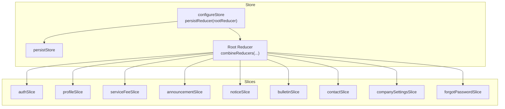
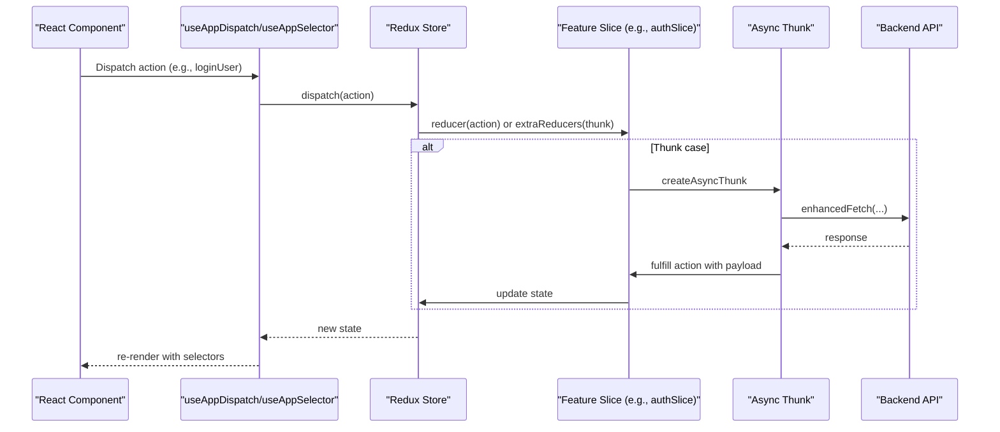
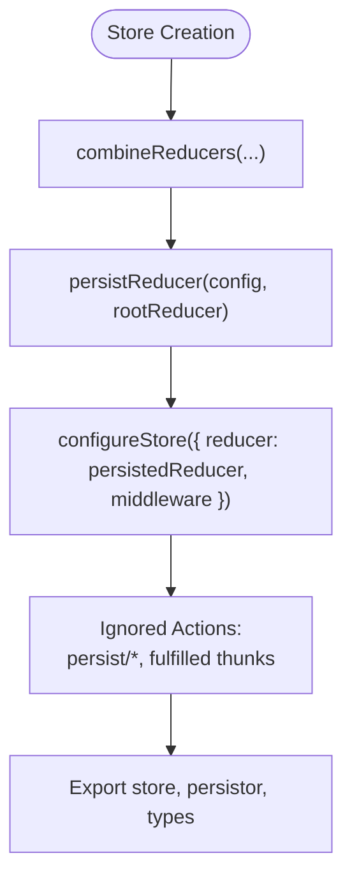
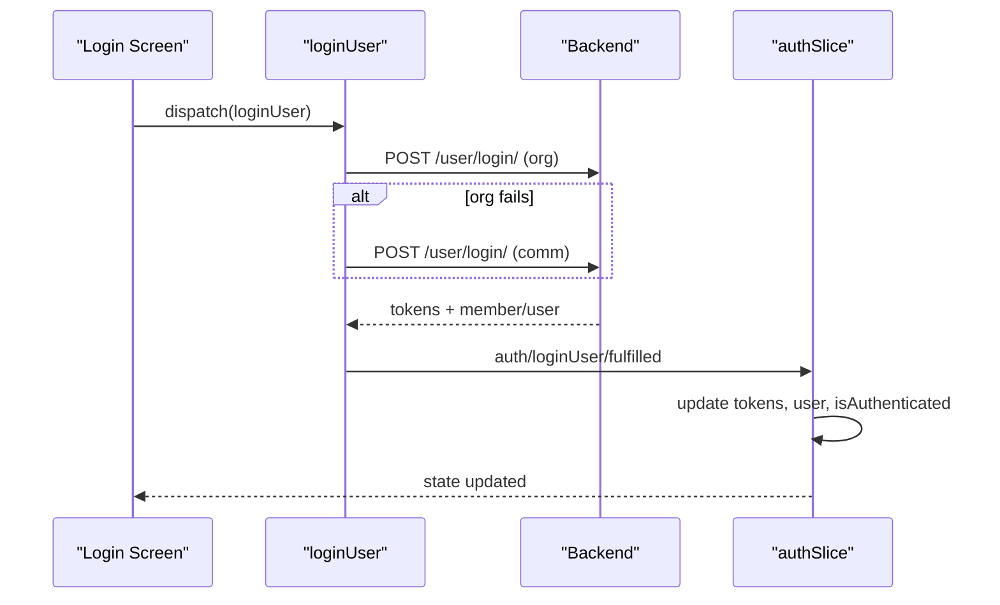
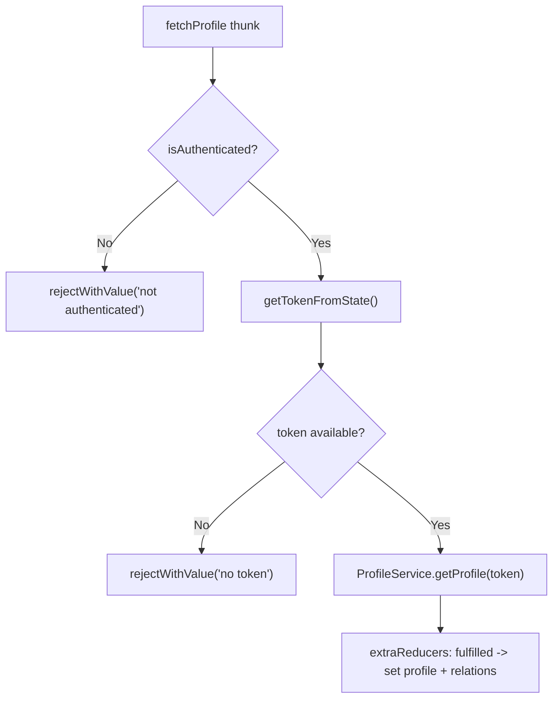
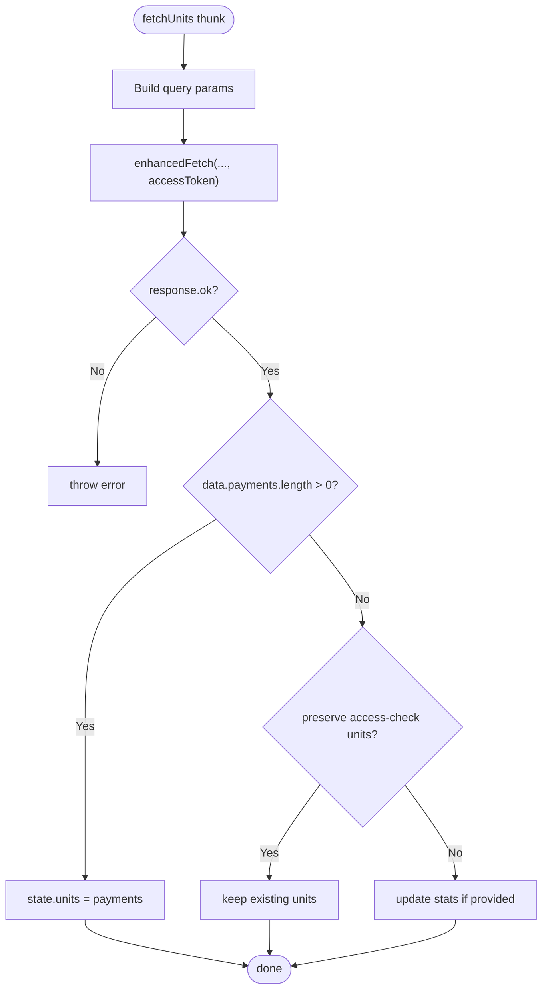
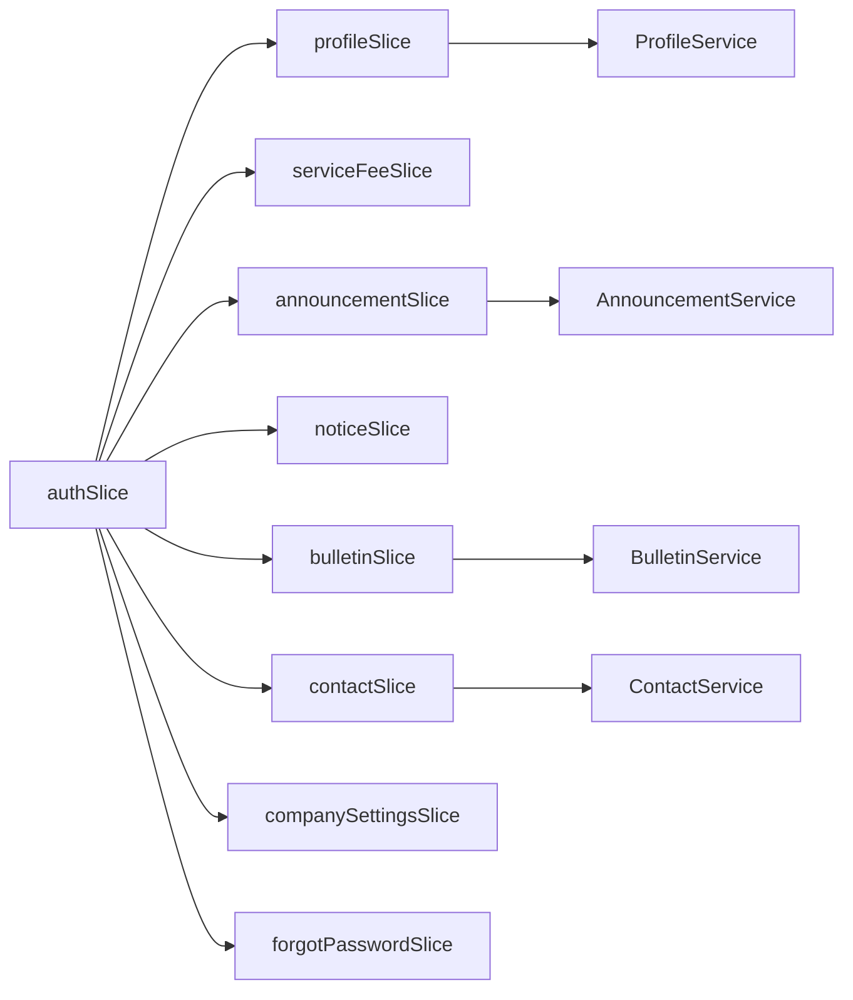

# State Management & Redux

<cite>
**Referenced Files in This Document**
- [store/index.ts](file://Estate_link_App/src/store/index.ts)
- [store/hooks.ts](file://Estate_link_App/src/store/hooks.ts)
- [store/slices/authSlice.ts](file://Estate_link_App/src/store/slices/authSlice.ts)
- [store/slices/profileSlice.ts](file://Estate_link_App/src/store/slices/profileSlice.ts)
- [store/slices/serviceFeeSlice.ts](file://Estate_link_App/src/store/slices/serviceFeeSlice.ts)
- [store/slices/announcementSlice.ts](file://Estate_link_App/src/store/slices/announcementSlice.ts)
- [store/slices/noticeSlice.ts](file://Estate_link_App/src/store/slices/noticeSlice.ts)
- [store/slices/bulletinSlice.ts](file://Estate_link_App/src/store/slices/bulletinSlice.ts)
- [store/slices/contactSlice.ts](file://Estate_link_App/src/store/slices/contactSlice.ts)
- [store/slices/companySettingsSlice.ts](file://Estate_link_App/src/store/slices/companySettingsSlice.ts)
- [store/slices/forgotPasswordSlice.ts](file://Estate_link_App/src/store/slices/forgotPasswordSlice.ts)
- [services/profileService.ts](file://Estate_link_App/src/services/profileService.ts)
- [services/announcementService.ts](file://Estate_link_App/src/services/announcementService.ts)
- [services/bulletinService.ts](file://Estate_link_App/src/services/bulletinService.ts)
- [services/contactService.ts](file://Estate_link_App/src/services/contactService.ts)
</cite>

## Table of Contents
1. [Introduction](#introduction)
2. [Project Structure](#project-structure)
3. [Core Components](#core-components)
4. [Architecture Overview](#architecture-overview)
5. [Detailed Component Analysis](#detailed-component-analysis)
6. [Dependency Analysis](#dependency-analysis)
7. [Performance Considerations](#performance-considerations)
8. [Troubleshooting Guide](#troubleshooting-guide)
9. [Conclusion](#conclusion)

## Introduction
This document explains the mobile application’s Redux state management architecture. It covers store configuration, slice organization, state persistence with Redux Persist, authentication and profile state handling, feature-specific slices, action creators and reducers, selectors, async thunk implementations, middleware configuration, React Hooks integration, performance optimizations, debugging approaches, state hydration, offline synchronization strategies, and state migration patterns.

## Project Structure
The Redux setup centers around a single configured store with a persisted root reducer and typed hooks for React integration. Feature slices encapsulate domain logic and async flows for announcements, notices, bulletins, profiles, service fees, contacts, company settings, and forgot-password flows.

**Diagram sources**
- [store/index.ts](file://Estate_link_App/src/store/index.ts#L1-L79)

**Section sources**
- [store/index.ts](file://Estate_link_App/src/store/index.ts#L1-L79)

## Core Components
- Store configuration with Redux Toolkit and Redux Persist
- Typed hooks for dispatch and selector usage
- Feature slices for authentication, profile, service fees, announcements, notices, bulletins, contacts, company settings, and forgot-password flows
- Async thunks for network-bound operations with retry logic and optimistic updates
- Middleware configuration to handle serializability and persistence lifecycle actions

**Section sources**
- [store/index.ts](file://Estate_link_App/src/store/index.ts#L1-L79)
- [store/hooks.ts](file://Estate_link_App/src/store/hooks.ts#L1-L6)

## Architecture Overview
The store integrates a persisted root reducer with whitelisted slices. Serializability checks are relaxed for known persistence and fulfilled actions. Thunks orchestrate network calls via shared utilities and update normalized slices.

**Diagram sources**
- [store/index.ts](file://Estate_link_App/src/store/index.ts#L38-L76)
- [store/slices/authSlice.ts](file://Estate_link_App/src/store/slices/authSlice.ts#L200-L289)

**Section sources**
- [store/index.ts](file://Estate_link_App/src/store/index.ts#L38-L76)

## Detailed Component Analysis

### Store Configuration and Persistence
- Root reducer combines all slices under logical namespaces.
- Persist configuration whitelists sensitive and reusable slices (auth, companySettings).
- Serializability exceptions include persistence lifecycle actions and fulfilled async thunks to avoid warnings for non-serializable payloads.
- Typed RootState and AppDispatch are exported for safe React integration.

**Diagram sources**
- [store/index.ts](file://Estate_link_App/src/store/index.ts#L15-L76)

**Section sources**
- [store/index.ts](file://Estate_link_App/src/store/index.ts#L15-L76)

### Authentication State Management (authSlice)
- State includes user identity, auth flags, tokens, and OTP metadata.
- Async thunks implement retry logic with exponential backoff and network checks.
- Multi-step flows: checkUserStatus, requestOTP/verifyOTP/resendOTP, setNewPassword, loginUser, setPassword, logout.
- Reducers manage loading/error states and token/user updates.

**Diagram sources**
- [store/slices/authSlice.ts](file://Estate_link_App/src/store/slices/authSlice.ts#L200-L289)

**Section sources**
- [store/slices/authSlice.ts](file://Estate_link_App/src/store/slices/authSlice.ts#L6-L564)

### Profile Data Handling (profileSlice)
- Token resolution prioritizes Redux state, falls back to AsyncStorage for hydration scenarios.
- Async thunks: fetchProfile, fetchMemberDetails, updateProfile, fetchMemberTypes, fetchUserTowerUnit, changeMemberStatus.
- Optimistic updates and error extraction for validation payloads.
- Clears profile on logout.

**Diagram sources**
- [store/slices/profileSlice.ts](file://Estate_link_App/src/store/slices/profileSlice.ts#L71-L120)
- [services/profileService.ts](file://Estate_link_App/src/services/profileService.ts#L114-L150)

**Section sources**
- [store/slices/profileSlice.ts](file://Estate_link_App/src/store/slices/profileSlice.ts#L1-L389)
- [services/profileService.ts](file://Estate_link_App/src/services/profileService.ts#L1-L295)

### Service Fee State (serviceFeeSlice)
- Manages units, payments, upcoming billings, filters, and stats.
- Async thunks: checkServiceFeeAccess, fetchUnits, fetchPayments, create/update/delete payment, fetchPaymentChoices, fetchFilterOptions, fetchUpcomingBillings.
- Access-first strategy: stores accessible units even when no payment records exist.
- Robust handling of empty API responses while preserving unpaid months and selected unit context.

**Diagram sources**
- [store/slices/serviceFeeSlice.ts](file://Estate_link_App/src/store/slices/serviceFeeSlice.ts#L233-L318)

**Section sources**
- [store/slices/serviceFeeSlice.ts](file://Estate_link_App/src/store/slices/serviceFeeSlice.ts#L1-L936)

### Announcements (announcementSlice)
- Async thunks: fetchAnnouncements, fetchAnnouncementById, create/update/delete, togglePin, incrementViews, forceExpire, restore, fetchTowers, fetchUnits, fetchLabels.
- Selectors and filters support UI composition.
- Clears data on logout.

**Section sources**
- [store/slices/announcementSlice.ts](file://Estate_link_App/src/store/slices/announcementSlice.ts#L1-L324)
- [services/announcementService.ts](file://Estate_link_App/src/services/announcementService.ts#L1-L341)

### Notices (noticeSlice)
- Similar CRUD and filtering pattern as announcements.
- Async thunks mirror service endpoints.

**Section sources**
- [store/slices/noticeSlice.ts](file://Estate_link_App/src/store/slices/noticeSlice.ts#L1-L320)

### Bulletins (bulletinSlice)
- Async thunks: fetchBulletins, createNewBulletin, updateExistingBulletin, approve/reject/archive, plus labels retrieval.
- Optimistic UI updates for immediate feedback on create/update/status changes.
- Maintains separate arrays per status with last-fetched timestamps.

**Section sources**
- [store/slices/bulletinSlice.ts](file://Estate_link_App/src/store/slices/bulletinSlice.ts#L1-L449)
- [services/bulletinService.ts](file://Estate_link_App/src/services/bulletinService.ts#L1-L705)

### Contacts (contactSlice)
- CRUD operations for important contacts with token-based auth.
- Selectors and loading/error states.

**Section sources**
- [store/slices/contactSlice.ts](file://Estate_link_App/src/store/slices/contactSlice.ts#L1-L187)
- [services/contactService.ts](file://Estate_link_App/src/services/contactService.ts#L1-L226)

### Company Settings (companySettingsSlice)
- Public endpoint with in-memory cache and forced refresh capability.
- Prevents unnecessary network calls with short TTL.

**Section sources**
- [store/slices/companySettingsSlice.ts](file://Estate_link_App/src/store/slices/companySettingsSlice.ts#L1-L134)

### Forgot Password (forgotPasswordSlice)
- OTP request/resend/verify and set-new-password flows with retry logic.
- Preserves completion state across navigation.

**Section sources**
- [store/slices/forgotPasswordSlice.ts](file://Estate_link_App/src/store/slices/forgotPasswordSlice.ts#L1-L324)

### React Hooks Integration
- Typed hooks wrap dispatch and selector for type-safe access to state and dispatch.

**Section sources**
- [store/hooks.ts](file://Estate_link_App/src/store/hooks.ts#L1-L6)

## Dependency Analysis
- Slices depend on shared network utilities and service classes.
- Cross-slice dependencies are minimal; logout clears dependent slices’ data.
- Async thunks coordinate with services and update normalized state.

**Diagram sources**
- [store/index.ts](file://Estate_link_App/src/store/index.ts#L5-L13)
- [services/profileService.ts](file://Estate_link_App/src/services/profileService.ts#L1-L295)
- [services/announcementService.ts](file://Estate_link_App/src/services/announcementService.ts#L1-L341)
- [services/bulletinService.ts](file://Estate_link_App/src/services/bulletinService.ts#L1-L705)
- [services/contactService.ts](file://Estate_link_App/src/services/contactService.ts#L1-L226)

**Section sources**
- [store/index.ts](file://Estate_link_App/src/store/index.ts#L5-L13)

## Performance Considerations
- Prefer whitelisting only essential slices for persistence to minimize hydration overhead.
- Use targeted loading flags per slice to avoid unnecessary re-renders.
- Normalize related entities (e.g., owners/residents/staff) to reduce duplication and simplify updates.
- Cache public data (company settings) with short TTL to balance freshness and performance.
- Debounce or throttle frequent UI triggers (filters, search) before dispatching thunks.

## Troubleshooting Guide
- Network failures: Inspect fulfilled/rejected paths and error payloads; leverage retry logic in thunks.
- Hydration timing: Ensure token availability before dispatching protected thunks; fallback to AsyncStorage when Redux state is not yet hydrated.
- Serializability warnings: Confirm ignored actions and fulfilled thunks are whitelisted in middleware configuration.
- Offline behavior: Implement optimistic updates and queue operations; reconcile on reconnect using access checks and selective refetches.

**Section sources**
- [store/index.ts](file://Estate_link_App/src/store/index.ts#L40-L76)
- [store/slices/profileSlice.ts](file://Estate_link_App/src/store/slices/profileSlice.ts#L34-L68)

## Conclusion
The Redux architecture organizes mobile state cleanly by feature slices, centralizes async flows with robust thunks, and persists critical slices for seamless user sessions. By combining typed hooks, normalized state, and pragmatic caching/offline strategies, the system balances reliability, performance, and maintainability.