# UI Components & Design System

<cite>
**Referenced Files in This Document**
- [Button.tsx](file://Estate_link_App/src/components/Button.tsx)
- [Label.tsx](file://Estate_link_App/src/components/Label.tsx)
- [ProfileImage.tsx](file://Estate_link_App/src/components/ProfileImage.tsx)
- [MediaViewer.tsx](file://Estate_link_App/src/components/MediaViewer.tsx)
- [SkeletonLoader.tsx](file://Estate_link_App/src/components/SkeletonLoader.tsx)
- [ImageWithFallback.tsx](file://Estate_link_App/src/components/ImageWithFallback.tsx)
- [OptimizedImage.tsx](file://Estate_link_App/src/components/OptimizedImage.tsx)
- [AttachmentViewer.tsx](file://Estate_link_App/src/components/AttachmentViewer.tsx)
- [PDFDownloader.tsx](file://Estate_link_App/src/components/PDFDownloader.tsx)
- [responsiveUtils.ts](file://Estate_link_App/src/utils/responsiveUtils.ts)
- [responsiveStyles.ts](file://Estate_link_App/src/utils/responsiveStyles.ts)
- [photoUtils.ts](file://Estate_link_App/src/utils/photoUtils.ts)
- [deviceInfo.ts](file://Estate_link_App/src/utils/deviceInfo.ts)
- [tailwind.config.js](file://Estate_link_App/tailwind.config.js)
- [global.css](file://Estate_link_App/global.css)
- [components index (src)](file://Estate_link_App/src/components/index.ts)
- [components index (app)](file://Estate_link_App/components/index.ts)
</cite>

## Table of Contents
1. [Introduction](#introduction)
2. [Project Structure](#project-structure)
3. [Core Components](#core-components)
4. [Architecture Overview](#architecture-overview)
5. [Detailed Component Analysis](#detailed-component-analysis)
6. [Dependency Analysis](#dependency-analysis)
7. [Performance Considerations](#performance-considerations)
8. [Accessibility Features](#accessibility-features)
9. [Responsive Design Implementation](#responsive-design-implementation)
10. [Global Styling System and Theme](#global-styling-system-and-theme)
11. [Component Customization Options](#component-customization-options)
12. [Testing Strategies](#testing-strategies)
13. [Mobile-Specific UI Patterns](#mobile-specific-ui-patterns)
14. [Troubleshooting Guide](#troubleshooting-guide)
15. [Conclusion](#conclusion)

## Introduction
This document describes the mobile UI component library and design system used in the Estate Link application. It focuses on reusable components for buttons, text inputs, labels, and media handling, including profile image rendering, media attachment display, and skeleton loaders. It also covers component architecture, prop interfaces, styling patterns using Tailwind CSS, responsive design, accessibility, performance optimization, and testing strategies.

## Project Structure
The UI components live primarily under the src/components directory, with supporting utilities for responsive scaling, device detection, and image URL resolution. Tailwind CSS is configured to work with NativeWind for React Native styling.

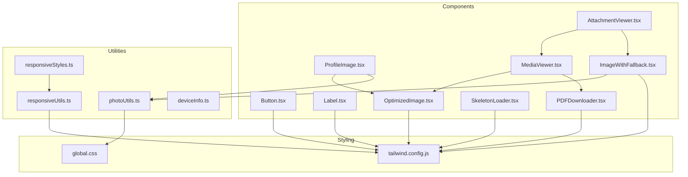

**Diagram sources**
- [Button.tsx](file://Estate_link_App/src/components/Button.tsx#L1-L96)
- [Label.tsx](file://Estate_link_App/src/components/Label.tsx#L1-L121)
- [ProfileImage.tsx](file://Estate_link_App/src/components/ProfileImage.tsx#L1-L101)
- [OptimizedImage.tsx](file://Estate_link_App/src/components/OptimizedImage.tsx#L1-L197)
- [ImageWithFallback.tsx](file://Estate_link_App/src/components/ImageWithFallback.tsx#L1-L192)
- [MediaViewer.tsx](file://Estate_link_App/src/components/MediaViewer.tsx#L1-L359)
- [AttachmentViewer.tsx](file://Estate_link_App/src/components/AttachmentViewer.tsx#L1-L139)
- [SkeletonLoader.tsx](file://Estate_link_App/src/components/SkeletonLoader.tsx#L1-L190)
- [PDFDownloader.tsx](file://Estate_link_App/src/components/PDFDownloader.tsx#L1-L366)
- [responsiveUtils.ts](file://Estate_link_App/src/utils/responsiveUtils.ts#L1-L492)
- [responsiveStyles.ts](file://Estate_link_App/src/utils/responsiveStyles.ts#L1-L342)
- [photoUtils.ts](file://Estate_link_App/src/utils/photoUtils.ts#L1-L84)
- [tailwind.config.js](file://Estate_link_App/tailwind.config.js#L1-L82)
- [global.css](file://Estate_link_App/global.css#L1-L6)

**Section sources**
- [components index (src)](file://Estate_link_App/src/components/index.ts#L1-L18)
- [components index (app)](file://Estate_link_App/components/index.ts#L1-L12)

## Core Components
This section summarizes the primary UI components and their responsibilities.

- Button: A versatile action component with variants, sizes, loading states, and Tailwind-based styling.
- Label: A compact badge-style label with variants and sizes, optimized for iOS text rendering.
- ProfileImage: Displays avatars for users, groups, and creators with optimized image loading and fallback icons.
- OptimizedImage: A robust image component with shimmer loading, activity indicators, and error handling.
- ImageWithFallback: A flexible image renderer with caching, progressive loading, and debug info.
- AttachmentViewer: Horizontal gallery for attachments with preview modal and swipe navigation.
- MediaViewer: Full-screen modal for images and PDFs with swipe gestures, download controls, and responsive layouts.
- SkeletonLoader: Animated skeleton placeholders for content loading states, including cards and grids.
- PDFDownloader: Cross-platform PDF download and sharing with permission handling and fallbacks.

**Section sources**
- [Button.tsx](file://Estate_link_App/src/components/Button.tsx#L10-L38)
- [Label.tsx](file://Estate_link_App/src/components/Label.tsx#L4-L20)
- [ProfileImage.tsx](file://Estate_link_App/src/components/ProfileImage.tsx#L8-L28)
- [OptimizedImage.tsx](file://Estate_link_App/src/components/OptimizedImage.tsx#L9-L36)
- [ImageWithFallback.tsx](file://Estate_link_App/src/components/ImageWithFallback.tsx#L10-L34)
- [AttachmentViewer.tsx](file://Estate_link_App/src/components/AttachmentViewer.tsx#L18-L30)
- [MediaViewer.tsx](file://Estate_link_App/src/components/MediaViewer.tsx#L31-L49)
- [SkeletonLoader.tsx](file://Estate_link_App/src/components/SkeletonLoader.tsx#L5-L17)
- [PDFDownloader.tsx](file://Estate_link_App/src/components/PDFDownloader.tsx#L8-L22)

## Architecture Overview
The component library follows a modular architecture:
- Presentational components encapsulate styling and behavior (Button, Label, SkeletonLoader).
- Composite components orchestrate multiple smaller components (AttachmentViewer, MediaViewer).
- Utility modules provide responsive scaling, device detection, and image URL resolution.
- Tailwind CSS with NativeWind enables consistent, theme-driven styling across components.

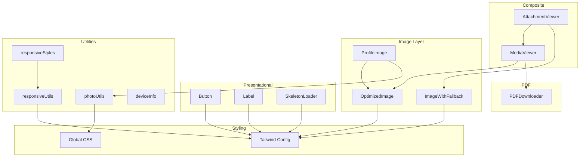

**Diagram sources**
- [Button.tsx](file://Estate_link_App/src/components/Button.tsx#L25-L94)
- [Label.tsx](file://Estate_link_App/src/components/Label.tsx#L13-L117)
- [SkeletonLoader.tsx](file://Estate_link_App/src/components/SkeletonLoader.tsx#L12-L61)
- [AttachmentViewer.tsx](file://Estate_link_App/src/components/AttachmentViewer.tsx#L25-L136)
- [MediaViewer.tsx](file://Estate_link_App/src/components/MediaViewer.tsx#L44-L356)
- [OptimizedImage.tsx](file://Estate_link_App/src/components/OptimizedImage.tsx#L27-L153)
- [ImageWithFallback.tsx](file://Estate_link_App/src/components/ImageWithFallback.tsx#L22-L149)
- [ProfileImage.tsx](file://Estate_link_App/src/components/ProfileImage.tsx#L21-L98)
- [PDFDownloader.tsx](file://Estate_link_App/src/components/PDFDownloader.tsx#L16-L360)
- [responsiveUtils.ts](file://Estate_link_App/src/utils/responsiveUtils.ts#L14-L491)
- [responsiveStyles.ts](file://Estate_link_App/src/utils/responsiveStyles.ts#L16-L339)
- [photoUtils.ts](file://Estate_link_App/src/utils/photoUtils.ts#L10-L61)
- [tailwind.config.js](file://Estate_link_App/tailwind.config.js#L16-L81)
- [global.css](file://Estate_link_App/global.css#L1-L6)

## Detailed Component Analysis

### Button Component
- Purpose: Unified action control with variants (primary, secondary, outline, ghost), sizes (small, medium, large), and loading states.
- Props: title, onPress, disabled, loading, variant, size, fullWidth, className, textClassName, style, textStyle, activeOpacity.
- Styling: Uses Tailwind classes for layout and colors; integrates with theme tokens.
- Accessibility: Inherits RN touch feedback; disabled state prevents interaction.

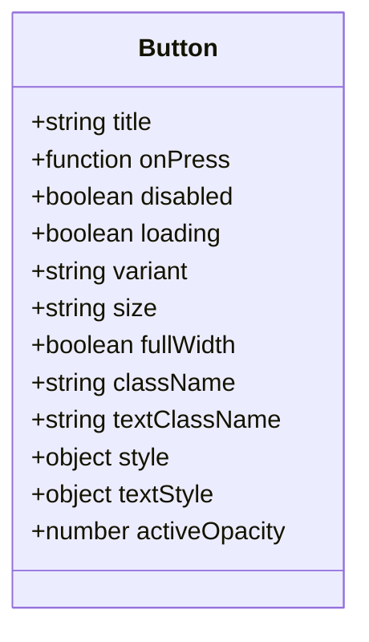

**Diagram sources**
- [Button.tsx](file://Estate_link_App/src/components/Button.tsx#L10-L38)

**Section sources**
- [Button.tsx](file://Estate_link_App/src/components/Button.tsx#L25-L94)

### Label Component
- Purpose: Badge-like labels with semantic variants (success, warning, error, info) and sizing.
- iOS optimizations: Font family, line height, centering, and fallback handling for reliable rendering.
- Props: text, variant, size, className, style, textStyle.

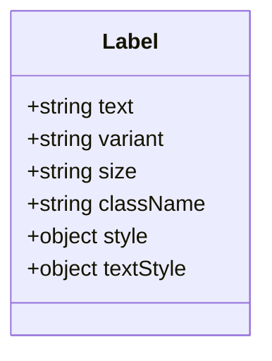

**Diagram sources**
- [Label.tsx](file://Estate_link_App/src/components/Label.tsx#L4-L20)

**Section sources**
- [Label.tsx](file://Estate_link_App/src/components/Label.tsx#L13-L117)

### ProfileImage Component
- Purpose: Consistent avatar display for members, creators, and groups with optimized image loading and fallback icons.
- Props: postAs, memberPhoto, creatorPhoto, creatorObject, size, showBorder.
- Behavior: Chooses appropriate icon or image based on post type and available photos; applies border and background styles conditionally.

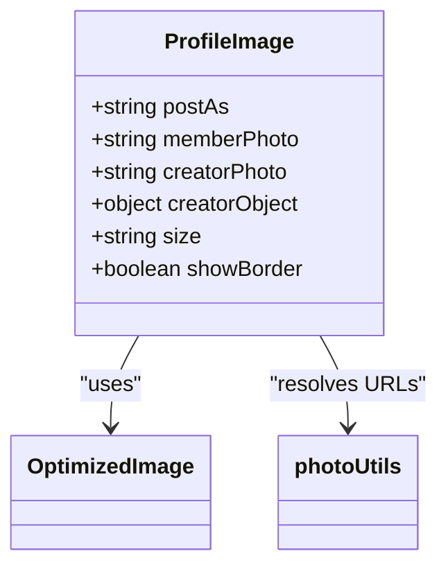

**Diagram sources**
- [ProfileImage.tsx](file://Estate_link_App/src/components/ProfileImage.tsx#L8-L28)
- [OptimizedImage.tsx](file://Estate_link_App/src/components/OptimizedImage.tsx#L27-L36)
- [photoUtils.ts](file://Estate_link_App/src/utils/photoUtils.ts#L10-L61)

**Section sources**
- [ProfileImage.tsx](file://Estate_link_App/src/components/ProfileImage.tsx#L21-L98)

### OptimizedImage Component
- Purpose: Robust image rendering with shimmer loading, activity indicator, error state, and fade-in animation.
- Props: source, className, containerClassName, showLoadingIndicator, loadingIndicatorSize, loadingIndicatorColor, resizeMode.
- Caching: Global cache to skip loading states for previously loaded URIs.

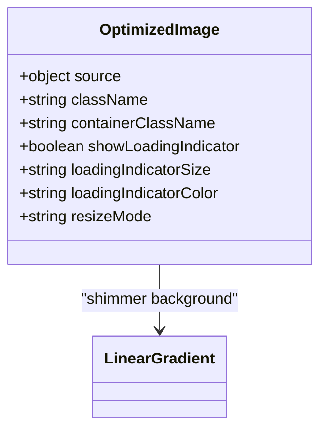

**Diagram sources**
- [OptimizedImage.tsx](file://Estate_link_App/src/components/OptimizedImage.tsx#L9-L36)

**Section sources**
- [OptimizedImage.tsx](file://Estate_link_App/src/components/OptimizedImage.tsx#L27-L153)

### ImageWithFallback Component
- Purpose: Flexible image renderer with global caching, progressive loading, shimmer, and error/fallback UI.
- Props: file, file_url, fileName, fallbackIcon, fallbackText, debugName, containerClassName, fallbackTextClassName, showDebugInfo.
- Error handling: Logs and displays fallback icon/text; supports onError callback.

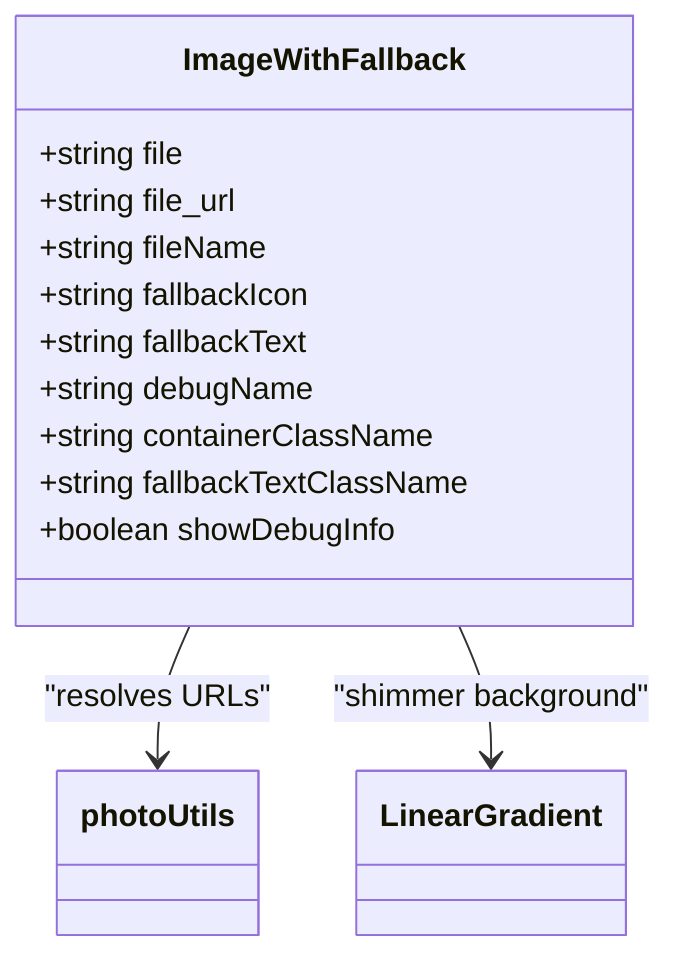

**Diagram sources**
- [ImageWithFallback.tsx](file://Estate_link_App/src/components/ImageWithFallback.tsx#L10-L34)
- [photoUtils.ts](file://Estate_link_App/src/utils/photoUtils.ts#L10-L61)

**Section sources**
- [ImageWithFallback.tsx](file://Estate_link_App/src/components/ImageWithFallback.tsx#L22-L149)

### AttachmentViewer Component
- Purpose: Horizontal gallery of attachments with preview modal and swipe navigation.
- Props: attachments, maxDisplay, notice, announcement.
- Behavior: Opens MediaViewer for images/PDFs; shows details for other file types; overlays "+X" indicator for hidden images.

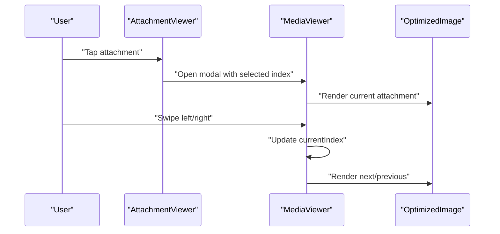

**Diagram sources**
- [AttachmentViewer.tsx](file://Estate_link_App/src/components/AttachmentViewer.tsx#L25-L136)
- [MediaViewer.tsx](file://Estate_link_App/src/components/MediaViewer.tsx#L44-L356)
- [OptimizedImage.tsx](file://Estate_link_App/src/components/OptimizedImage.tsx#L27-L153)

**Section sources**
- [AttachmentViewer.tsx](file://Estate_link_App/src/components/AttachmentViewer.tsx#L25-L136)

### MediaViewer Component
- Purpose: Full-screen modal for images and PDFs with swipe gestures, navigation dots, and download controls.
- Props: visible, onClose, attachments, initialIndex.
- Behavior: Renders images via OptimizedImage; shows PDF download interface; handles external app opening; resets state on visibility changes.

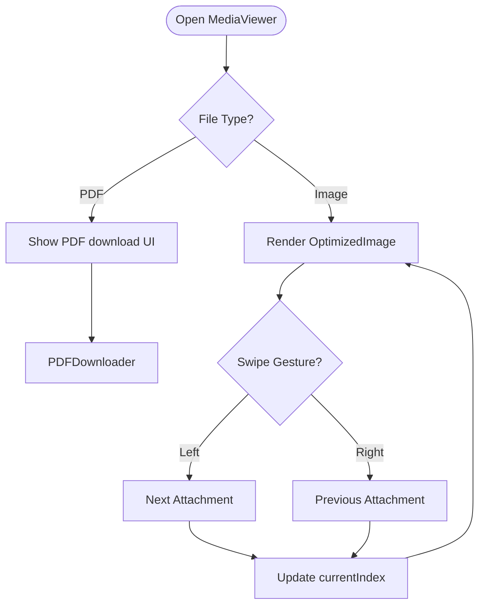

**Diagram sources**
- [MediaViewer.tsx](file://Estate_link_App/src/components/MediaViewer.tsx#L44-L356)
- [PDFDownloader.tsx](file://Estate_link_App/src/components/PDFDownloader.tsx#L16-L360)
- [OptimizedImage.tsx](file://Estate_link_App/src/components/OptimizedImage.tsx#L27-L153)

**Section sources**
- [MediaViewer.tsx](file://Estate_link_App/src/components/MediaViewer.tsx#L44-L356)

### SkeletonLoader Component
- Purpose: Animated skeleton placeholders for loading states.
- Variants: SkeletonLoader, SkeletonCard, SkeletonGrid with configurable shapes and content blocks.

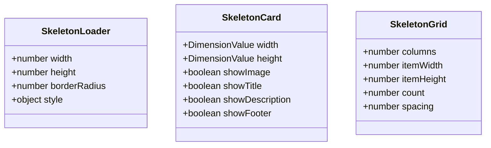

**Diagram sources**
- [SkeletonLoader.tsx](file://Estate_link_App/src/components/SkeletonLoader.tsx#L5-L17)
- [SkeletonLoader.tsx](file://Estate_link_App/src/components/SkeletonLoader.tsx#L63-L79)
- [SkeletonLoader.tsx](file://Estate_link_App/src/components/SkeletonLoader.tsx#L140-L146)

**Section sources**
- [SkeletonLoader.tsx](file://Estate_link_App/src/components/SkeletonLoader.tsx#L12-L187)

### PDFDownloader Component
- Purpose: Cross-platform PDF download and sharing with permission handling and fallbacks.
- Props: pdfUri, fileName, title, size, variant.
- Behavior: Android uses MediaLibrary with fallback sharing; iOS opens directly or shares; includes error handling and user prompts.

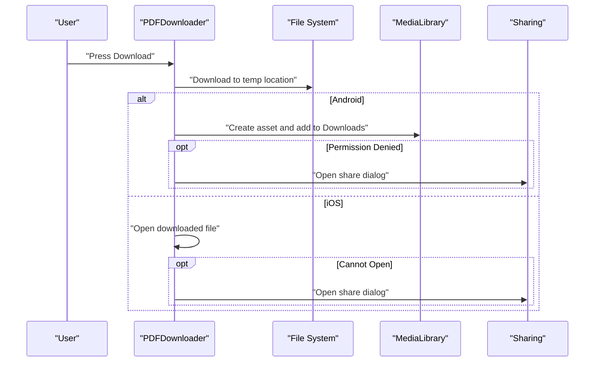

**Diagram sources**
- [PDFDownloader.tsx](file://Estate_link_App/src/components/PDFDownloader.tsx#L16-L360)

**Section sources**
- [PDFDownloader.tsx](file://Estate_link_App/src/components/PDFDownloader.tsx#L16-L360)

## Dependency Analysis
The components depend on shared utilities for responsive scaling, device detection, and image URL resolution. Tailwind CSS provides consistent theming.

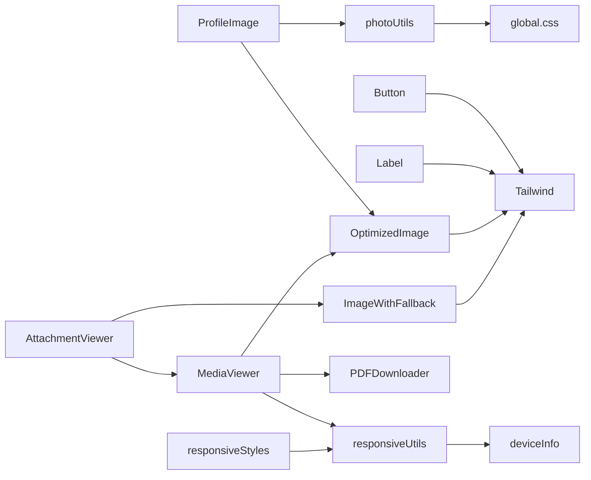

**Diagram sources**
- [Button.tsx](file://Estate_link_App/src/components/Button.tsx#L25-L94)
- [Label.tsx](file://Estate_link_App/src/components/Label.tsx#L13-L117)
- [OptimizedImage.tsx](file://Estate_link_App/src/components/OptimizedImage.tsx#L27-L153)
- [ImageWithFallback.tsx](file://Estate_link_App/src/components/ImageWithFallback.tsx#L22-L149)
- [ProfileImage.tsx](file://Estate_link_App/src/components/ProfileImage.tsx#L21-L98)
- [AttachmentViewer.tsx](file://Estate_link_App/src/components/AttachmentViewer.tsx#L25-L136)
- [MediaViewer.tsx](file://Estate_link_App/src/components/MediaViewer.tsx#L44-L356)
- [PDFDownloader.tsx](file://Estate_link_App/src/components/PDFDownloader.tsx#L16-L360)
- [responsiveUtils.ts](file://Estate_link_App/src/utils/responsiveUtils.ts#L14-L491)
- [responsiveStyles.ts](file://Estate_link_App/src/utils/responsiveStyles.ts#L16-L339)
- [photoUtils.ts](file://Estate_link_App/src/utils/photoUtils.ts#L10-L61)
- [tailwind.config.js](file://Estate_link_App/tailwind.config.js#L16-L81)
- [global.css](file://Estate_link_App/global.css#L1-L6)

**Section sources**
- [responsiveUtils.ts](file://Estate_link_App/src/utils/responsiveUtils.ts#L14-L491)
- [deviceInfo.ts](file://Estate_link_App/src/utils/deviceInfo.ts#L5-L78)
- [photoUtils.ts](file://Estate_link_App/src/utils/photoUtils.ts#L10-L61)

## Performance Considerations
- Image optimization: Both OptimizedImage and ImageWithFallback implement progressive rendering, shimmer loading, and global caching to reduce re-downloads.
- Animated placeholders: SkeletonLoader uses native driver animations for smooth performance.
- Modal rendering: MediaViewer leverages hardware acceleration and resets state on close to avoid stale renders.
- Responsive scaling: responsiveUtils and responsiveStyles minimize layout thrashing by precomputing values per device type.

[No sources needed since this section provides general guidance]

## Accessibility Features
- Touch targets: Control button sizes adhere to minimum touch target guidelines via responsive utilities.
- Text scaling: Label component respects allowFontScaling and minimum/maximum font scale multipliers.
- Focus and selection: Labels disable text selection; buttons provide visual feedback via activeOpacity.
- Platform-specific rendering: Label includes iOS-specific adjustments for font rendering and centering.

**Section sources**
- [responsiveUtils.ts](file://Estate_link_App/src/utils/responsiveUtils.ts#L309-L338)
- [Label.tsx](file://Estate_link_App/src/components/Label.tsx#L104-L112)

## Responsive Design Implementation
- Device detection: isTablet/isPhone determine layout variations.
- Scaling functions: responsiveWidth, responsiveHeight, responsiveFontSize scale consistently across devices.
- Grid and spacing: getGridColumns, getGridItemWidth, spacing tokens adapt to screen size.
- Modal responsiveness: getResponsiveModalStyles computes dimensions, paddings, and control sizes for modals.

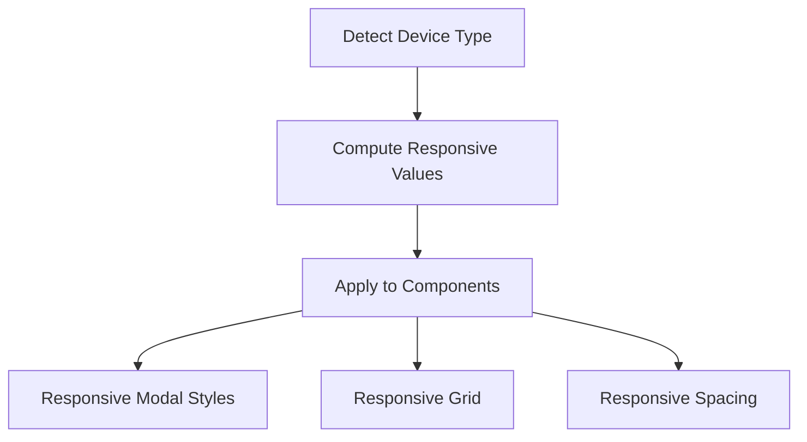

**Diagram sources**
- [responsiveUtils.ts](file://Estate_link_App/src/utils/responsiveUtils.ts#L14-L491)
- [responsiveStyles.ts](file://Estate_link_App/src/utils/responsiveStyles.ts#L16-L339)
- [deviceInfo.ts](file://Estate_link_App/src/utils/deviceInfo.ts#L5-L78)

**Section sources**
- [responsiveUtils.ts](file://Estate_link_App/src/utils/responsiveUtils.ts#L14-L491)
- [responsiveStyles.ts](file://Estate_link_App/src/utils/responsiveStyles.ts#L16-L339)

## Global Styling System and Theme
- Tailwind configuration: Defines brand colors, semantic tokens, and typography families; includes safelist entries to preserve dynamic classes.
- Global CSS: Imports Oxanium font and enables Tailwind directives.
- Theme tokens: Primary, secondary, success, error, warning, info, and payment status colors unify component styling.

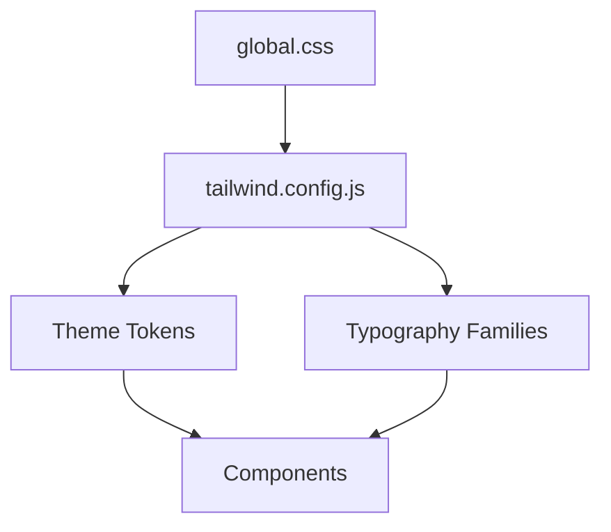

**Diagram sources**
- [tailwind.config.js](file://Estate_link_App/tailwind.config.js#L16-L81)
- [global.css](file://Estate_link_App/global.css#L1-L6)

**Section sources**
- [tailwind.config.js](file://Estate_link_App/tailwind.config.js#L16-L81)
- [global.css](file://Estate_link_App/global.css#L1-L6)

## Component Customization Options
- Tailwind classes: All components accept className/style props to override default styles.
- Variant and size props: Button, Label, PDFDownloader expose variant and size options for consistent theming.
- Image customization: OptimizedImage and ImageWithFallback allow container and image class overrides, loading indicator customization, and resize modes.
- Media controls: MediaViewer exposes initialIndex and closes via onClose; AttachmentViewer limits visible attachments and shows overlays.

**Section sources**
- [Button.tsx](file://Estate_link_App/src/components/Button.tsx#L10-L38)
- [Label.tsx](file://Estate_link_App/src/components/Label.tsx#L4-L20)
- [PDFDownloader.tsx](file://Estate_link_App/src/components/PDFDownloader.tsx#L8-L22)
- [OptimizedImage.tsx](file://Estate_link_App/src/components/OptimizedImage.tsx#L9-L36)
- [ImageWithFallback.tsx](file://Estate_link_App/src/components/ImageWithFallback.tsx#L10-L34)
- [MediaViewer.tsx](file://Estate_link_App/src/components/MediaViewer.tsx#L31-L49)
- [AttachmentViewer.tsx](file://Estate_link_App/src/components/AttachmentViewer.tsx#L18-L30)

## Testing Strategies
- Unit testing: Jest configuration files exist for various scenarios; use them to test component rendering and prop combinations.
- Image handling: photoUtils can be tested for URL generation and normalization.
- Responsive behavior: responsiveUtils can be unit-tested for dimension calculations and device categorization.
- Component composition: AttachmentViewer and MediaViewer can be tested for modal transitions, swipe gestures, and download flows.

[No sources needed since this section provides general guidance]

## Mobile-Specific UI Patterns
- Touch-friendly controls: Minimum touch targets and active opacity ensure tactile feedback.
- Gestural navigation: MediaViewer supports swipe-to-navigate between attachments.
- Adaptive layouts: Grid columns and item widths adjust to screen size; modals scale with getResponsiveModalStyles.
- Platform-specific text rendering: Label includes iOS-specific font adjustments for consistent appearance.

**Section sources**
- [responsiveUtils.ts](file://Estate_link_App/src/utils/responsiveUtils.ts#L309-L338)
- [MediaViewer.tsx](file://Estate_link_App/src/components/MediaViewer.tsx#L145-L167)
- [Label.tsx](file://Estate_link_App/src/components/Label.tsx#L62-L79)

## Troubleshooting Guide
- Image loading failures: Use ImageWithFallback’s onError callback and debug logs; verify URLs via photoUtils.
- PDF download issues: Check permissions on Android (MediaLibrary) and fallback to sharing; iOS relies on system handlers.
- Modal state resets: MediaViewer resets currentIndex and PDF viewer type when visibility changes; ensure initialIndex updates propagate.
- Font rendering problems: Label includes iOS-specific fixes; verify Oxanium font availability and fallbacks.

**Section sources**
- [ImageWithFallback.tsx](file://Estate_link_App/src/components/ImageWithFallback.tsx#L64-L98)
- [PDFDownloader.tsx](file://Estate_link_App/src/components/PDFDownloader.tsx#L101-L342)
- [MediaViewer.tsx](file://Estate_link_App/src/components/MediaViewer.tsx#L66-L101)
- [Label.tsx](file://Estate_link_App/src/components/Label.tsx#L62-L79)

## Conclusion
The Estate Link mobile UI component library emphasizes consistency, performance, and accessibility through a combination of presentational components, composite viewers, robust image handling, and a responsive design system powered by Tailwind CSS and NativeWind. The utilities for device detection, responsive scaling, and image URL resolution enable scalable, cross-platform experiences across phones and tablets.