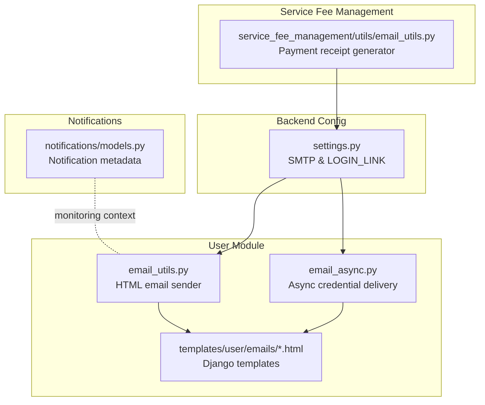
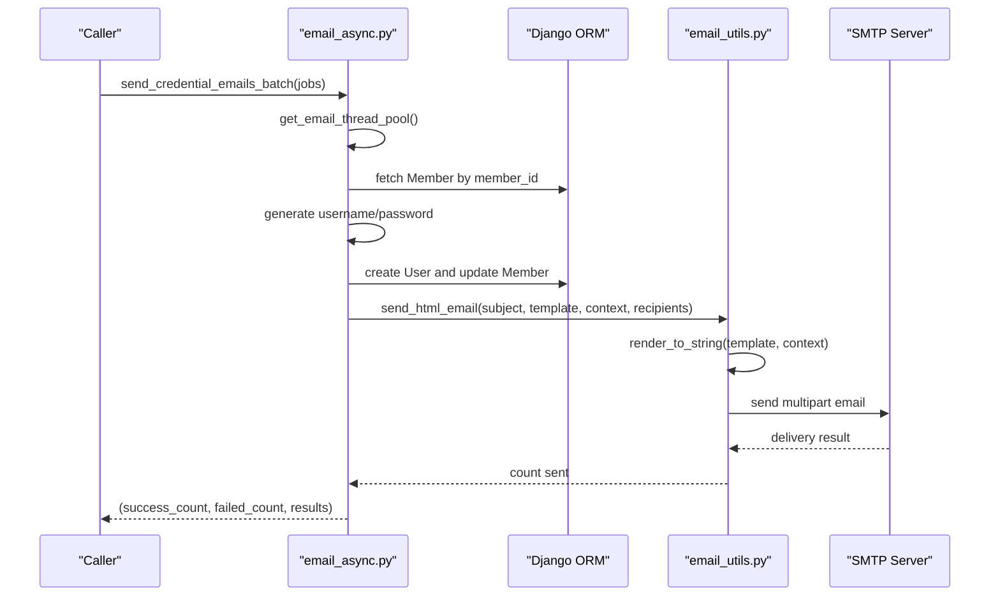
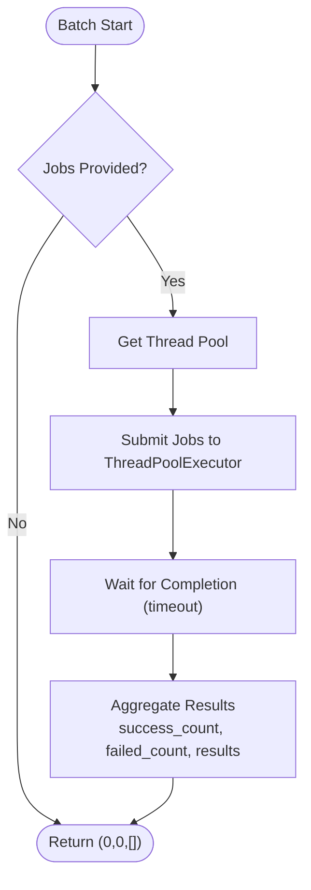
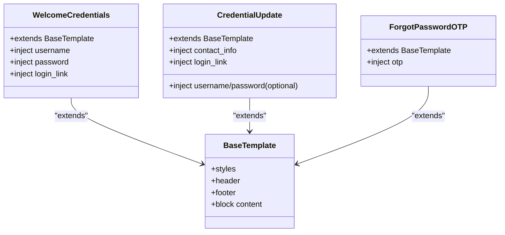
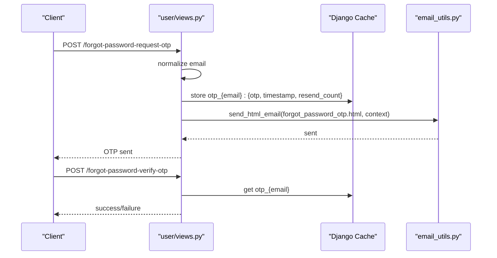
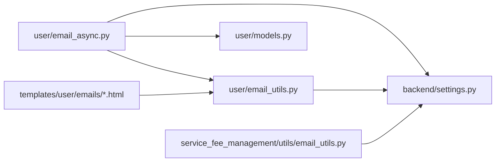

# Email Notification System

<cite>
**Referenced Files in This Document**
- [settings.py](file://backend/backend/settings.py)
- [email_utils.py](file://backend/user/email_utils.py)
- [email_async.py](file://backend/user/email_async.py)
- [base_email.html](file://backend/user/templates/user/emails/base_email.html)
- [welcome_credentials.html](file://backend/user/templates/user/emails/welcome_credentials.html)
- [credential_update.html](file://backend/user/templates/user/emails/credential_update.html)
- [forgot_password_otp.html](file://backend/user/templates/user/emails/forgot_password_otp.html)
- [views.py](file://backend/user/views.py)
- [models.py](file://backend/user/models.py)
- [email_utils.py](file://backend/service_fee_management/utils/email_utils.py)
- [models.py](file://backend/notifications/models.py)
</cite>

## Table of Contents
1. [Introduction](#introduction)
2. [Project Structure](#project-structure)
3. [Core Components](#core-components)
4. [Architecture Overview](#architecture-overview)
5. [Detailed Component Analysis](#detailed-component-analysis)
6. [Dependency Analysis](#dependency-analysis)
7. [Performance Considerations](#performance-considerations)
8. [Troubleshooting Guide](#troubleshooting-guide)
9. [Conclusion](#conclusion)

## Introduction
This document describes the email notification system in the Estate Link project. It covers template management, asynchronous email processing, SMTP configuration, personalization, and operational monitoring. The system uses Django’s email backend with HTML templates rendered via Django’s template engine, and includes utilities for batch credential delivery and payment receipts.

## Project Structure
The email system spans several modules:
- Backend configuration defines SMTP settings and login link constants.
- User module provides HTML email utilities, asynchronous credential delivery, and reusable templates.
- Service fee management module generates payment receipt emails with rich HTML.
- Notifications module defines models for storing notification metadata (useful for monitoring and audit trails).

**Diagram sources**
- [settings.py](file://backend/backend/settings.py#L261-L269)
- [email_utils.py](file://backend/user/email_utils.py#L9-L47)
- [email_async.py](file://backend/user/email_async.py#L35-L213)
- [base_email.html](file://backend/user/templates/user/emails/base_email.html#L1-L179)
- [email_utils.py](file://backend/service_fee_management/utils/email_utils.py#L619-L706)
- [models.py](file://backend/notifications/models.py#L93-L198)

**Section sources**
- [settings.py](file://backend/backend/settings.py#L261-L269)
- [email_utils.py](file://backend/user/email_utils.py#L9-L47)
- [email_async.py](file://backend/user/email_async.py#L35-L213)
- [base_email.html](file://backend/user/templates/user/emails/base_email.html#L1-L179)
- [email_utils.py](file://backend/service_fee_management/utils/email_utils.py#L619-L706)
- [models.py](file://backend/notifications/models.py#L93-L198)

## Core Components
- SMTP configuration and constants
  - SMTP backend, host, port, TLS, and sender credentials are defined centrally.
  - Login link constant used across templates and emails.
- HTML email utilities
  - Renders Django templates to HTML, generates plain-text fallback, and sends multipart emails.
- Asynchronous credential delivery
  - Thread pool-based parallel sending for bulk credential emails with timeouts and logging.
- Template system
  - Base template with shared styles and blocks; page-specific templates extend the base.
- Payment receipt generation
  - Generates rich HTML receipts for service fees with multi-month support and currency formatting.

**Section sources**
- [settings.py](file://backend/backend/settings.py#L261-L269)
- [email_utils.py](file://backend/user/email_utils.py#L9-L47)
- [email_async.py](file://backend/user/email_async.py#L24-L107)
- [base_email.html](file://backend/user/templates/user/emails/base_email.html#L1-L179)
- [email_utils.py](file://backend/service_fee_management/utils/email_utils.py#L76-L618)

## Architecture Overview
The email pipeline integrates Django’s email backend with reusable templates and utilities. For credential emails, a thread pool enables parallel dispatch. Payment receipts are generated programmatically with HTML formatting.

**Diagram sources**
- [email_async.py](file://backend/user/email_async.py#L49-L107)
- [email_async.py](file://backend/user/email_async.py#L110-L213)
- [email_utils.py](file://backend/user/email_utils.py#L9-L47)

## Detailed Component Analysis

### SMTP Configuration and Constants
- Backend settings define the SMTP backend, host, port, TLS flag, sender credentials, and login link constant used in templates.
- These settings are consumed by both the HTML email utility and the async credential sender.

**Section sources**
- [settings.py](file://backend/backend/settings.py#L261-L269)

### HTML Email Utilities
- The HTML email utility renders a Django template to produce HTML content, strips HTML tags to create a plain-text fallback, attaches alternatives, and sends via the configured backend.
- It accepts a subject, template name, context dictionary, recipient list, and optional sender override.

**Section sources**
- [email_utils.py](file://backend/user/email_utils.py#L9-L47)

### Asynchronous Credential Delivery
- Thread pool initialization is guarded by a lock to ensure singleton thread pool creation.
- Parallel batch sending submits jobs to the thread pool and aggregates results with counts and per-email statuses.
- Worker function validates recipient email, retrieves member, ensures uniqueness of user accounts, creates a new user, updates the member, and sends an HTML email using the welcome template.

**Diagram sources**
- [email_async.py](file://backend/user/email_async.py#L24-L32)
- [email_async.py](file://backend/user/email_async.py#L49-L107)

**Section sources**
- [email_async.py](file://backend/user/email_async.py#L24-L32)
- [email_async.py](file://backend/user/email_async.py#L49-L107)
- [email_async.py](file://backend/user/email_async.py#L110-L213)

### Email Templates and Personalization
- Base template defines shared styles, header, body, and footer blocks.
- Page-specific templates extend the base and inject personalized variables such as username, password, login link, and OTP.
- Dynamic content injection is performed by passing a context dictionary to the template renderer.

**Diagram sources**
- [base_email.html](file://backend/user/templates/user/emails/base_email.html#L1-L179)
- [welcome_credentials.html](file://backend/user/templates/user/emails/welcome_credentials.html#L1-L27)
- [credential_update.html](file://backend/user/templates/user/emails/credential_update.html#L1-L28)
- [forgot_password_otp.html](file://backend/user/templates/user/emails/forgot_password_otp.html#L1-L25)

**Section sources**
- [base_email.html](file://backend/user/templates/user/emails/base_email.html#L1-L179)
- [welcome_credentials.html](file://backend/user/templates/user/emails/welcome_credentials.html#L1-L27)
- [credential_update.html](file://backend/user/templates/user/emails/credential_update.html#L1-L28)
- [forgot_password_otp.html](file://backend/user/templates/user/emails/forgot_password_otp.html#L1-L25)

### Password Reset OTP Workflow
- The OTP request endpoint validates the email, stores a normalized key in cache with timestamp and resend counters, and sends an HTML email containing the OTP.
- The OTP verification endpoint retrieves cached data and validates against the provided OTP.

**Diagram sources**
- [views.py](file://backend/user/views.py#L740-L782)
- [email_utils.py](file://backend/user/email_utils.py#L9-L47)

**Section sources**
- [views.py](file://backend/user/views.py#L740-L782)
- [email_utils.py](file://backend/user/email_utils.py#L9-L47)

### Payment Receipt Emails
- The service fee utility generates rich HTML receipts with formatted dates, currency, and multi-month details.
- It constructs a subject based on single or multiple months and sends an HTML email with a plain-text fallback.

**Section sources**
- [email_utils.py](file://backend/service_fee_management/utils/email_utils.py#L76-L618)
- [email_utils.py](file://backend/service_fee_management/utils/email_utils.py#L619-L706)

### Notification Monitoring Context
- The notifications module defines models for storing notification metadata, which can be leveraged to track delivery outcomes and correlate with email events.
- Indexes on recipient, read status, and entity references support efficient queries for monitoring.

**Section sources**
- [models.py](file://backend/notifications/models.py#L93-L198)

## Dependency Analysis
- email_async.py depends on:
  - Django settings for SMTP and login link.
  - user.email_utils for HTML email rendering and sending.
  - Django ORM for Member/User operations.
- email_utils.py depends on:
  - Django template loader and email backend.
  - settings for sender configuration.
- Templates depend on:
  - Base template for shared layout and styles.
- Payment receipt generator depends on:
  - Django settings for sender address.
  - Currency and date formatting utilities.

**Diagram sources**
- [email_async.py](file://backend/user/email_async.py#L1-L15)
- [email_utils.py](file://backend/user/email_utils.py#L1-L10)
- [settings.py](file://backend/backend/settings.py#L261-L269)
- [models.py](file://backend/user/models.py#L15-L56)
- [email_utils.py](file://backend/service_fee_management/utils/email_utils.py#L1-L6)

**Section sources**
- [email_async.py](file://backend/user/email_async.py#L1-L15)
- [email_utils.py](file://backend/user/email_utils.py#L1-L10)
- [settings.py](file://backend/backend/settings.py#L261-L269)
- [models.py](file://backend/user/models.py#L15-L56)
- [email_utils.py](file://backend/service_fee_management/utils/email_utils.py#L1-L6)

## Performance Considerations
- Parallel sending: The thread pool caps concurrency to prevent overwhelming the SMTP server; adjust worker count based on provider limits.
- Timeouts: Per-job timeout avoids indefinite blocking; tune based on expected SMTP latency.
- Template rendering: Keep templates lightweight; avoid heavy computations in templates.
- Cache usage: OTP requests leverage cache for short-lived data to reduce repeated database lookups.

[No sources needed since this section provides general guidance]

## Troubleshooting Guide
- SMTP authentication failures
  - Verify sender credentials and enable “Less secure app access” if using Gmail, or configure an App Password.
  - Confirm TLS settings and port match the provider requirements.
- Email not delivered
  - Check provider’s inbox/spam folders; ensure sender address matches verified domain/sender.
  - Review logs for exceptions raised during template rendering or email sending.
- Parallel sending issues
  - Inspect per-email results returned by the batch function for specific failures and error messages.
  - Monitor thread pool utilization and adjust worker count if needed.
- OTP not received
  - Validate cache key normalization and expiration; ensure the email exists and is not first-time user requiring password reset via system-generated password.

**Section sources**
- [email_async.py](file://backend/user/email_async.py#L87-L107)
- [email_utils.py](file://backend/user/email_utils.py#L46-L47)
- [views.py](file://backend/user/views.py#L740-L782)

## Conclusion
The email notification system combines Django’s SMTP backend with reusable HTML templates and a thread-pool-based asynchronous sender. It supports credential delivery, OTP-based password resets, and rich payment receipts. While the current implementation focuses on SMTP and Django templates, integrating a dedicated email delivery service or Celery would enhance scalability, retry policies, and observability.