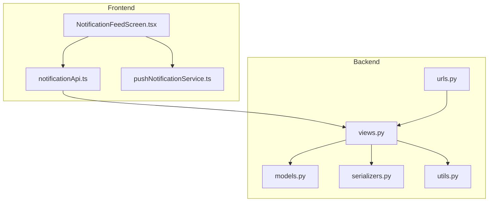
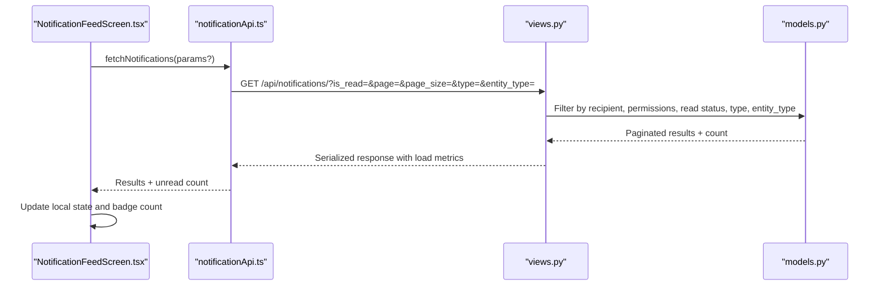
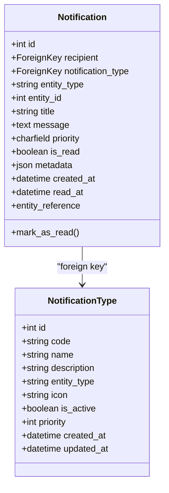
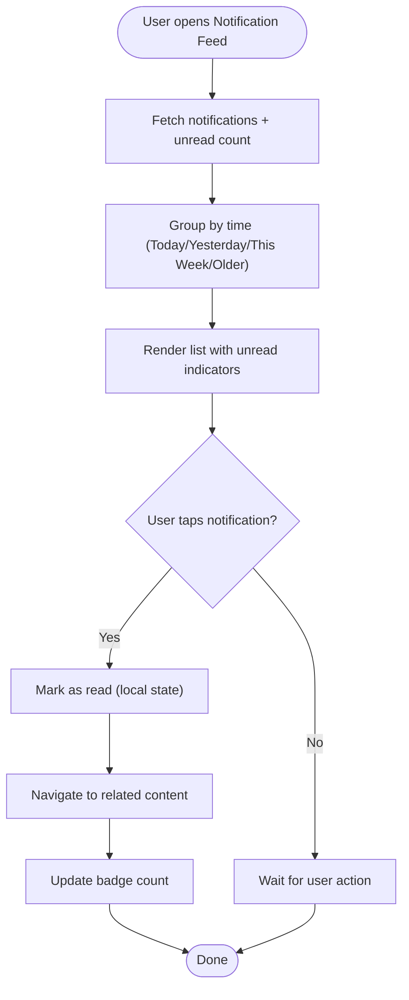
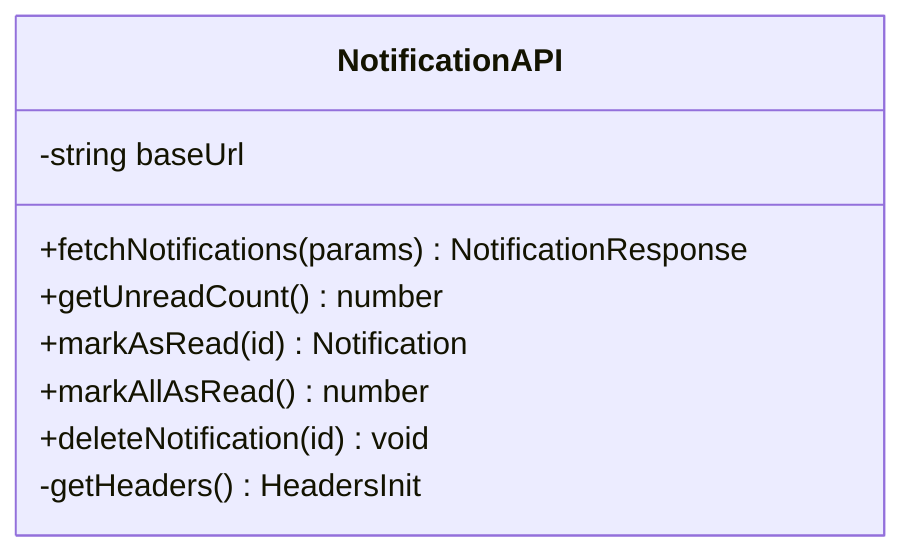
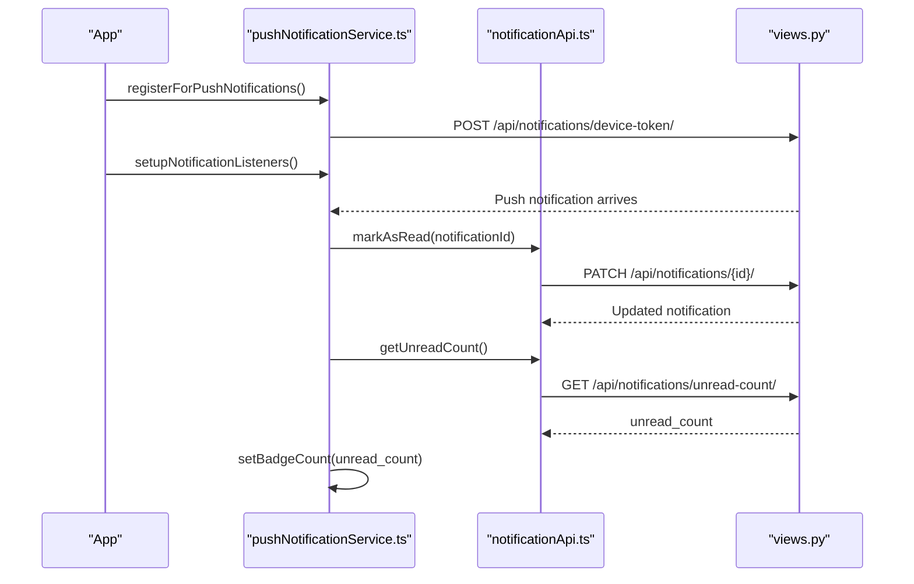
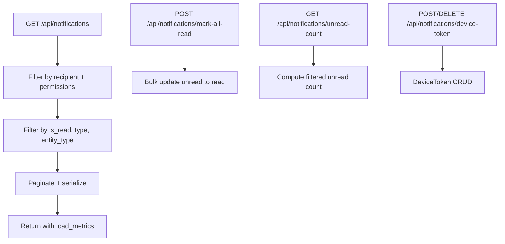
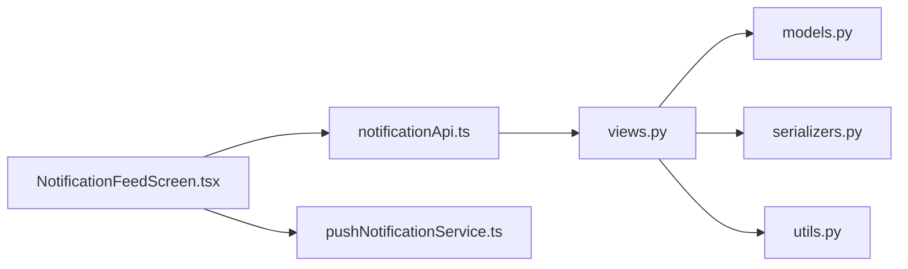

# In-App Notification Feed

<cite>
**Referenced Files in This Document**
- [NotificationFeedScreen.tsx](file://Estate_link_App/src/Features/NotificationFeedScreen.tsx)
- [notificationApi.ts](file://Estate_link_App/src/services/notificationApi.ts)
- [pushNotificationService.ts](file://Estate_link_App/src/services/pushNotificationService.ts)
- [models.py](file://backend/notifications/models.py)
- [views.py](file://backend/notifications/views.py)
- [urls.py](file://backend/notifications/urls.py)
- [serializers.py](file://backend/notifications/serializers.py)
- [utils.py](file://backend/notifications/utils.py)
- [0013_alter_notification_priority.py](file://backend/notifications/migrations/0013_alter_notification_priority.py)
</cite>

## Table of Contents
1. [Introduction](#introduction)
2. [Project Structure](#project-structure)
3. [Core Components](#core-components)
4. [Architecture Overview](#architecture-overview)
5. [Detailed Component Analysis](#detailed-component-analysis)
6. [Dependency Analysis](#dependency-analysis)
7. [Performance Considerations](#performance-considerations)
8. [Troubleshooting Guide](#troubleshooting-guide)
9. [Conclusion](#conclusion)

## Introduction
This document describes the in-app notification feed implementation, covering storage, retrieval, display, and user interaction. It explains the Notification model structure, read/unread status tracking, priority-based filtering, and the UI components for displaying notifications. It also documents the API endpoints for fetching notifications, marking as read, managing device tokens, and the push notification system. Finally, it outlines performance optimizations, caching strategies, real-time updates, and user controls for notification preferences.

## Project Structure
The notification system spans both the frontend React Native app and the Django backend:
- Frontend: A dedicated notification feed screen, a typed notification API client, and a push notification service for device token registration and navigation handling.
- Backend: A robust notification model with dynamic notification types, paginated list views, per-user filtering, unread counts, and device token management.

**Diagram sources**
- [NotificationFeedScreen.tsx](file://Estate_link_App/src/Features/NotificationFeedScreen.tsx#L1-L275)
- [notificationApi.ts](file://Estate_link_App/src/services/notificationApi.ts#L1-L231)
- [pushNotificationService.ts](file://Estate_link_App/src/services/pushNotificationService.ts#L1-L767)
- [models.py](file://backend/notifications/models.py#L1-L264)
- [views.py](file://backend/notifications/views.py#L1-L523)
- [urls.py](file://backend/notifications/urls.py#L1-L19)
- [serializers.py](file://backend/notifications/serializers.py#L1-L128)
- [utils.py](file://backend/notifications/utils.py#L1-L71)

**Section sources**
- [NotificationFeedScreen.tsx](file://Estate_link_App/src/Features/NotificationFeedScreen.tsx#L1-L275)
- [notificationApi.ts](file://Estate_link_App/src/services/notificationApi.ts#L1-L231)
- [pushNotificationService.ts](file://Estate_link_App/src/services/pushNotificationService.ts#L1-L767)
- [models.py](file://backend/notifications/models.py#L1-L264)
- [views.py](file://backend/notifications/views.py#L1-L523)
- [urls.py](file://backend/notifications/urls.py#L1-L19)
- [serializers.py](file://backend/notifications/serializers.py#L1-L128)
- [utils.py](file://backend/notifications/utils.py#L1-L71)

## Core Components
- Notification model: Stores notification metadata, priority, read status, and entity references. Includes indexes for efficient queries.
- Notification API client: Typed client for fetching notifications, unread counts, marking as read, marking all as read, and deleting notifications.
- Push notification service: Handles device token registration, foreground/background notification handling, badge updates, and navigation based on notification payload.
- Notification feed screen: Renders grouped notifications by time, displays unread indicators, supports pull-to-refresh, and handles taps to navigate to relevant content.

Key responsibilities:
- Storage: Backend models persist notifications per user with entity references and metadata.
- Retrieval: Backend views filter by permissions, read status, type, and entity type; paginated with performance metrics.
- Display: Frontend groups notifications by time, shows unread indicators, and navigates to related content.
- Real-time: Push notifications are delivered via Expo and mapped to in-app navigation.

**Section sources**
- [models.py](file://backend/notifications/models.py#L93-L198)
- [notificationApi.ts](file://Estate_link_App/src/services/notificationApi.ts#L48-L231)
- [pushNotificationService.ts](file://Estate_link_App/src/services/pushNotificationService.ts#L58-L767)
- [NotificationFeedScreen.tsx](file://Estate_link_App/src/Features/NotificationFeedScreen.tsx#L16-L275)

## Architecture Overview
The notification architecture integrates frontend UI, API, and backend services:

**Diagram sources**
- [NotificationFeedScreen.tsx](file://Estate_link_App/src/Features/NotificationFeedScreen.tsx#L24-L61)
- [notificationApi.ts](file://Estate_link_App/src/services/notificationApi.ts#L73-L123)
- [views.py](file://backend/notifications/views.py#L31-L191)
- [models.py](file://backend/notifications/models.py#L93-L198)

## Detailed Component Analysis

### Notification Model and Priority
The backend Notification model defines:
- Recipient, notification type (via foreign key), entity reference (entity_type + entity_id), title, message, priority, read status, metadata, timestamps.
- Indexes optimized for recipient queries, read status, notification type, and entity references.
- Priority levels: urgent, high, medium, low. Low priority notifications are feed-only and do not trigger push.

**Diagram sources**
- [models.py](file://backend/notifications/models.py#L93-L198)
- [models.py](file://backend/notifications/models.py#L6-L91)

**Section sources**
- [models.py](file://backend/notifications/models.py#L93-L198)
- [0013_alter_notification_priority.py](file://backend/notifications/migrations/0013_alter_notification_priority.py#L12-L18)

### Notification Feed UI
The frontend notification feed:
- Fetches notifications and unread count on mount and periodically.
- Groups notifications by time (Today, Yesterday, This Week, Older).
- Displays unread indicators and supports marking all as read.
- On tap, marks individual notifications as read locally and navigates to the relevant content based on entity_type/entity_id.

**Diagram sources**
- [NotificationFeedScreen.tsx](file://Estate_link_App/src/Features/NotificationFeedScreen.tsx#L24-L148)
- [pushNotificationService.ts](file://Estate_link_App/src/services/pushNotificationService.ts#L639-L739)

**Section sources**
- [NotificationFeedScreen.tsx](file://Estate_link_App/src/Features/NotificationFeedScreen.tsx#L16-L275)

### Notification API Client
The typed API client exposes:
- fetchNotifications(params?): Optional filters for is_read, page, page_size, type (notification type code or ID), entity_type.
- getUnreadCount(): Unread count for badge display.
- markAsRead(id): Mark a single notification as read.
- markAllAsRead(): Mark all unread notifications as read.
- deleteNotification(id): Delete a notification.

**Diagram sources**
- [notificationApi.ts](file://Estate_link_App/src/services/notificationApi.ts#L48-L231)

**Section sources**
- [notificationApi.ts](file://Estate_link_App/src/services/notificationApi.ts#L48-L231)

### Push Notification Service
The push notification service:
- Registers device tokens with the backend and configures notification channels on Android.
- Handles foreground/background notifications, navigation, and badge updates.
- Ignores notifications when the user is logged out.
- Updates badge counts from backend unread counts.

**Diagram sources**
- [pushNotificationService.ts](file://Estate_link_App/src/services/pushNotificationService.ts#L89-L229)
- [pushNotificationService.ts](file://Estate_link_App/src/services/pushNotificationService.ts#L234-L491)
- [notificationApi.ts](file://Estate_link_App/src/services/notificationApi.ts#L129-L203)
- [views.py](file://backend/notifications/views.py#L338-L383)

**Section sources**
- [pushNotificationService.ts](file://Estate_link_App/src/services/pushNotificationService.ts#L58-L767)
- [notificationApi.ts](file://Estate_link_App/src/services/notificationApi.ts#L129-L203)
- [views.py](file://backend/notifications/views.py#L338-L383)

### Backend Views and Endpoints
The backend provides:
- GET /api/notifications/: List notifications with filtering by read status, notification type (code or ID), and entity type; paginated; includes performance metrics.
- GET /api/notifications/<id>/: Retrieve a specific notification with permission checks.
- PATCH /api/notifications/<id>/: Update notification (only is_read supported).
- DELETE /api/notifications/<id>/: Delete a notification.
- POST /api/notifications/mark-all-read/: Mark all unread notifications as read.
- GET /api/notifications/unread-count/: Unread count respecting permissions and retroactivity rules.
- POST /api/notifications/device-token/: Register/update device token.
- DELETE /api/notifications/device-token/: Deactivate device token.

**Diagram sources**
- [views.py](file://backend/notifications/views.py#L31-L191)
- [views.py](file://backend/notifications/views.py#L297-L330)
- [views.py](file://backend/notifications/views.py#L332-L383)
- [views.py](file://backend/notifications/views.py#L447-L523)
- [urls.py](file://backend/notifications/urls.py#L11-L18)

**Section sources**
- [views.py](file://backend/notifications/views.py#L24-L330)
- [urls.py](file://backend/notifications/urls.py#L11-L18)

### Priority-Based Filtering and Push Behavior
Priority affects push delivery:
- Urgent/High priority notifications trigger push; Low priority is feed-only.
- Backend utils determine priority based on entity type and notification type code.
- Frontend groups notifications by time and highlights unread items.

**Section sources**
- [models.py](file://backend/notifications/models.py#L98-L151)
- [utils.py](file://backend/notifications/utils.py#L20-L71)
- [NotificationFeedScreen.tsx](file://Estate_link_App/src/Features/NotificationFeedScreen.tsx#L87-L117)

### Notification Categories and Entity Navigation
- Entity types supported include announcement, bulletin, member, notice, payment, service_fee, document, role, group, unit, resident, unit_staff, other.
- The push notification service maps notification payloads to navigation routes based on entity_type and entity_id.

**Section sources**
- [models.py](file://backend/notifications/models.py#L12-L26)
- [pushNotificationService.ts](file://Estate_link_App/src/services/pushNotificationService.ts#L639-L739)

### Pagination and Search Capabilities
- Backend pagination: page_size and page parameters; max page size enforced.
- Frontend grouping: time-based grouping; no explicit search UI in the feed screen.
- Search and filtering are present in other parts of the system (e.g., notices), but the notification feed focuses on time grouping and read/unread status.

**Section sources**
- [views.py](file://backend/notifications/views.py#L15-L22)
- [notificationApi.ts](file://Estate_link_App/src/services/notificationApi.ts#L73-L103)
- [NotificationFeedScreen.tsx](file://Estate_link_App/src/Features/NotificationFeedScreen.tsx#L87-L117)

### Bulk Actions and History Management
- Bulk mark all as read endpoint on the backend; frontend updates local state and badge count.
- Delete notification endpoint available; frontend updates local state and unread count accordingly.

**Section sources**
- [views.py](file://backend/notifications/views.py#L297-L330)
- [notificationApi.ts](file://Estate_link_App/src/services/notificationApi.ts#L183-L203)
- [notificationApi.ts](file://Estate_link_App/src/services/notificationApi.ts#L209-L226)

## Dependency Analysis
- Frontend depends on:
  - notificationApi.ts for HTTP requests to backend endpoints.
  - pushNotificationService.ts for device token management, badge updates, and navigation.
- Backend depends on:
  - models.py for persistence and indexes.
  - serializers.py for serialization/deserialization.
  - utils.py for permission checks and priority determination.

**Diagram sources**
- [NotificationFeedScreen.tsx](file://Estate_link_App/src/Features/NotificationFeedScreen.tsx#L1-L20)
- [notificationApi.ts](file://Estate_link_App/src/services/notificationApi.ts#L1-L10)
- [pushNotificationService.ts](file://Estate_link_App/src/services/pushNotificationService.ts#L1-L10)
- [views.py](file://backend/notifications/views.py#L1-L12)
- [models.py](file://backend/notifications/models.py#L1-L10)
- [serializers.py](file://backend/notifications/serializers.py#L1-L10)
- [utils.py](file://backend/notifications/utils.py#L1-L10)

**Section sources**
- [NotificationFeedScreen.tsx](file://Estate_link_App/src/Features/NotificationFeedScreen.tsx#L1-L20)
- [notificationApi.ts](file://Estate_link_App/src/services/notificationApi.ts#L1-L10)
- [pushNotificationService.ts](file://Estate_link_App/src/services/pushNotificationService.ts#L1-L10)
- [views.py](file://backend/notifications/views.py#L1-L12)
- [models.py](file://backend/notifications/models.py#L1-L10)
- [serializers.py](file://backend/notifications/serializers.py#L1-L10)
- [utils.py](file://backend/notifications/utils.py#L1-L10)

## Performance Considerations
- Database indexes: recipient, is_read, notification_type, entity_type+entity_id, priority+is_read improve query performance.
- Efficient filtering: backend filters by permissions and retroactivity at the database level where possible, falling back to Python filtering only when necessary.
- Bulk updates: mark-all-read uses bulk update for speed.
- Pagination: page_size limits and max_page_size cap reduce payload sizes.
- Frontend optimizations: useMemo for grouping, useCallback for handlers, and periodic polling with loader toggling.

Recommendations:
- Consider server-side caching for unread counts if traffic increases.
- Implement cursor-based pagination for very large histories.
- Debounce frequent fetches and avoid redundant re-renders.

**Section sources**
- [models.py](file://backend/notifications/models.py#L170-L179)
- [views.py](file://backend/notifications/views.py#L313-L329)
- [views.py](file://backend/notifications/views.py#L14-L22)
- [NotificationFeedScreen.tsx](file://Estate_link_App/src/Features/NotificationFeedScreen.tsx#L49-L55)

## Troubleshooting Guide
Common issues and resolutions:
- Notifications not appearing:
  - Verify device token registration and backend device-token endpoint.
  - Confirm push notification service is initialized and listeners are set.
- Badge count not updating:
  - Ensure getUnreadCount is called after marking as read and badge count is set.
- Navigation failures:
  - Check entity_type/entity_id mapping and navigation ref readiness.
- Permission denials:
  - Backend filters notifications by view permissions; ensure user has appropriate permissions for entity types.

**Section sources**
- [pushNotificationService.ts](file://Estate_link_App/src/services/pushNotificationService.ts#L14-L35)
- [pushNotificationService.ts](file://Estate_link_App/src/services/pushNotificationService.ts#L234-L491)
- [views.py](file://backend/notifications/views.py#L80-L111)

## Conclusion
The in-app notification feed combines a robust backend notification model with a responsive frontend UI and a comprehensive push notification service. It supports read/unread tracking, priority-based filtering, time-based grouping, and real-time updates. The system is designed for scalability with database indexes, bulk operations, and pagination, while maintaining a clean separation of concerns between frontend and backend components.