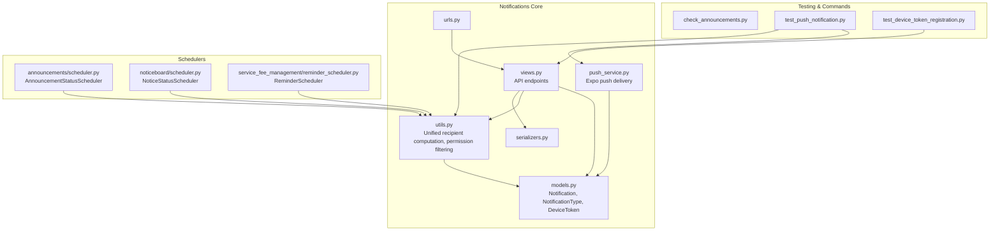
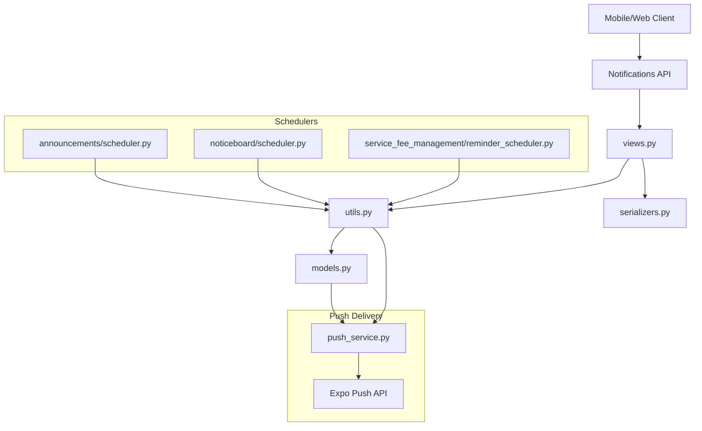
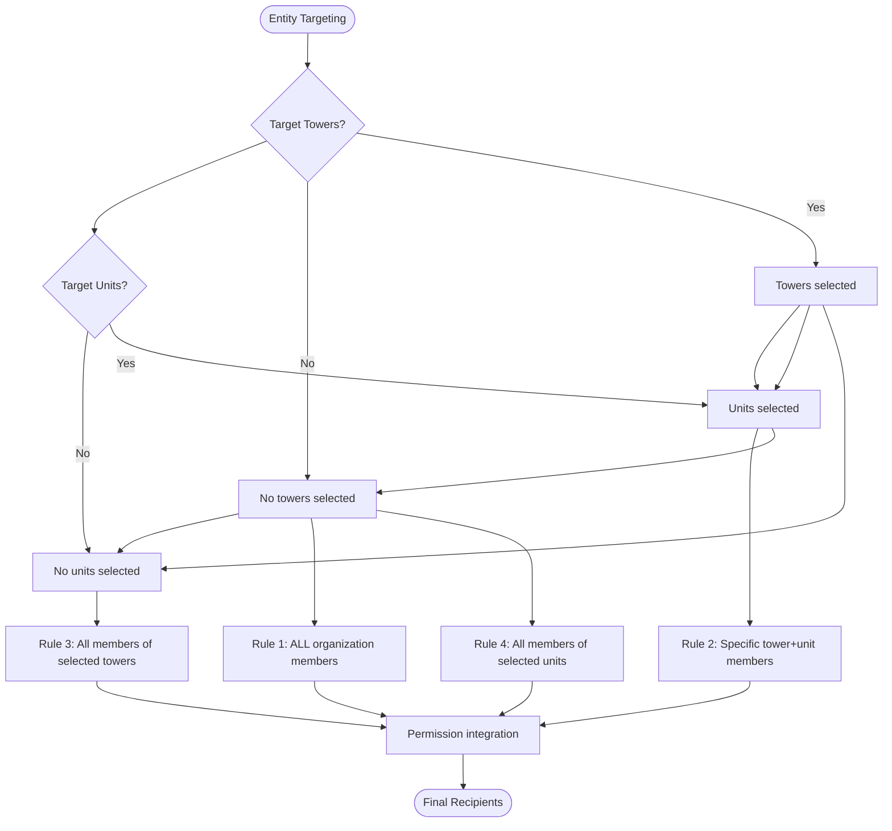
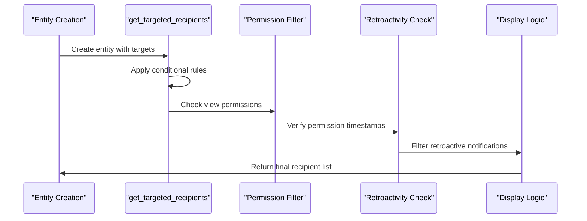
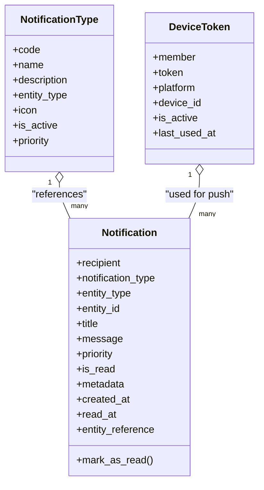
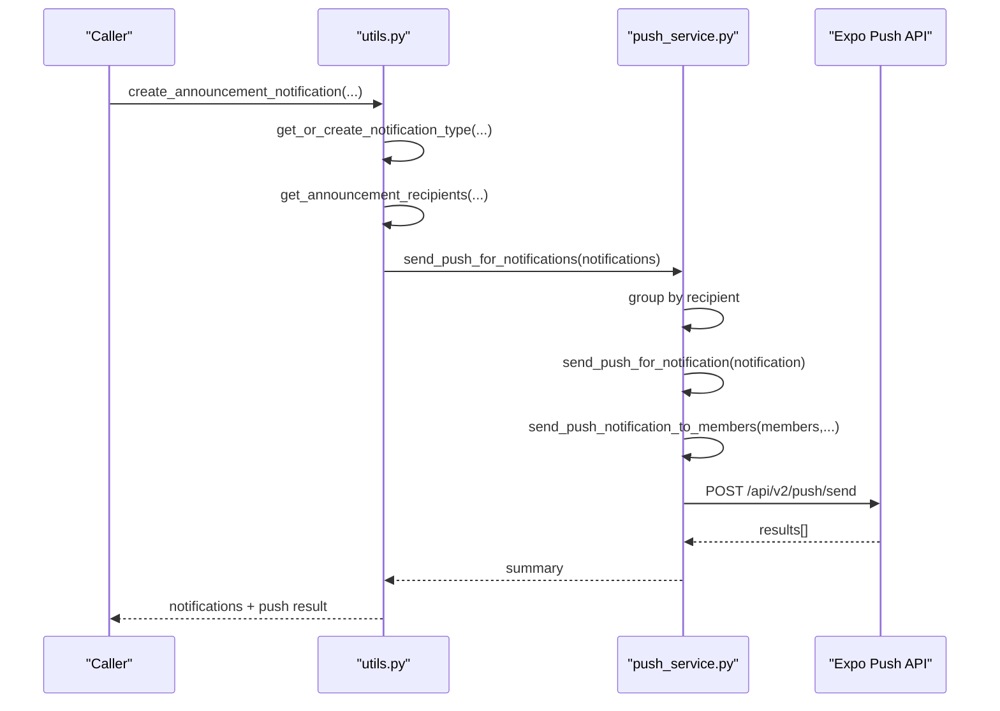
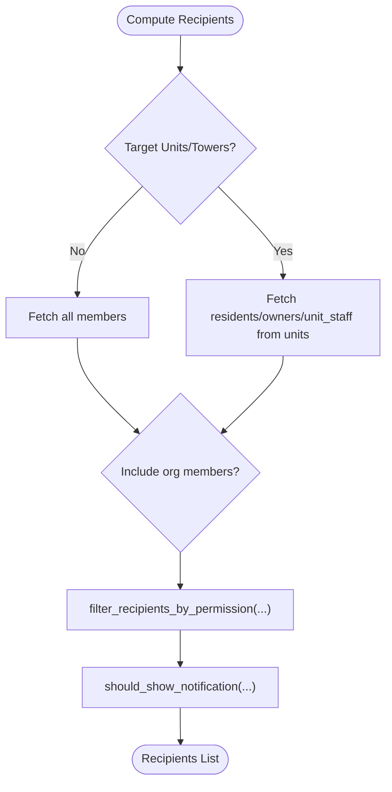
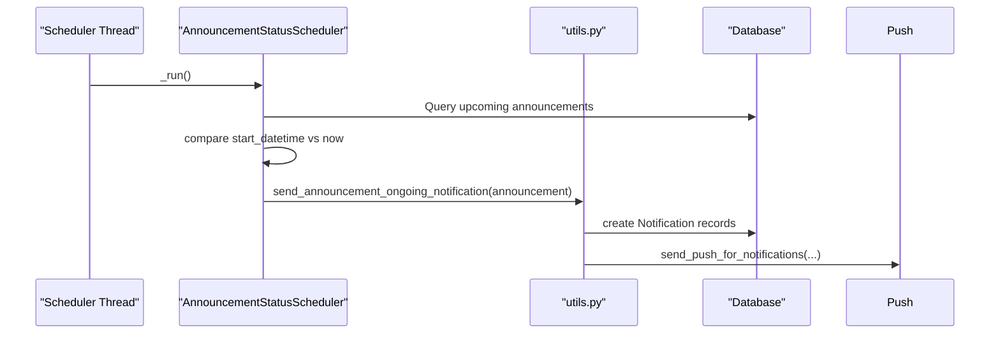
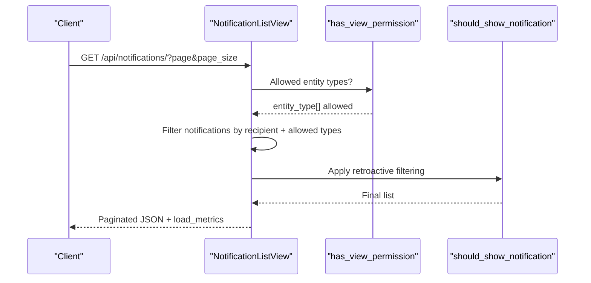
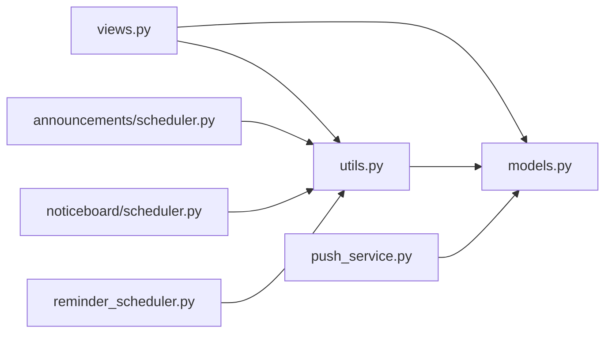

# Notification Scheduling & Delivery

<cite>
**Referenced Files in This Document**
- [models.py](file://backend/notifications/models.py)
- [push_service.py](file://backend/notifications/push_service.py)
- [utils.py](file://backend/notifications/utils.py)
- [views.py](file://backend/notifications/views.py)
- [urls.py](file://backend/notifications/urls.py)
- [serializers.py](file://backend/notifications/serializers.py)
- [scheduler.py](file://backend/announcements/scheduler.py)
- [scheduler.py](file://backend/noticeboard/scheduler.py)
- [reminder_scheduler.py](file://backend/service_fee_management/reminder_scheduler.py)
- [check_announcements.py](file://backend/announcements/management/commands/check_announcements.py)
- [test_push_notification.py](file://backend/announcements/management/commands/test_push_notification.py)
- [test_device_token_registration.py](file://backend/announcements/management/commands/test_device_token_registration.py)
</cite>

## Update Summary
**Changes Made**
- Updated notification recipient computation section to reflect unified `get_targeted_recipients` function
- Enhanced permission-based filtering documentation with new retroactivity enforcement system
- Added comprehensive coverage of conditional logic replacing previous complex branching
- Updated notification routing system documentation to include new unified targeting approach
- Revised delivery tracking and filtering sections to reflect new permission enforcement

## Table of Contents
1. [Introduction](#introduction)
2. [Project Structure](#project-structure)
3. [Core Components](#core-components)
4. [Architecture Overview](#architecture-overview)
5. [Detailed Component Analysis](#detailed-component-analysis)
6. [Dependency Analysis](#dependency-analysis)
7. [Performance Considerations](#performance-considerations)
8. [Troubleshooting Guide](#troubleshooting-guide)
9. [Conclusion](#conclusion)
10. [Appendices](#appendices)

## Introduction
This document explains the notification scheduling, delivery workflows, and automation systems implemented in the backend. It covers:
- Unified notification recipient computation using `get_targeted_recipients` function with conditional logic
- Enhanced permission-based filtering and retroactivity enforcement integrated into new targeting system
- Notification scheduler implementation using background threads for status transitions
- Push notification delivery via Expo with priority handling and batching
- Routing logic that determines recipients based on permissions and targeting
- Delivery tracking, success/failure metrics, and deduplication
- Rate limiting, throttling, and batching strategies
- Monitoring and testing utilities

## Project Structure
The notification system spans three primary areas:
- Core notification models and push delivery
- Entity-specific schedulers for announcements and notices
- Automated reminder scheduler for service fees with deduplication and logs

**Diagram sources**
- [models.py](file://backend/notifications/models.py#L6-L264)
- [utils.py](file://backend/notifications/utils.py#L363-L507)
- [push_service.py](file://backend/notifications/push_service.py#L17-L305)
- [views.py](file://backend/notifications/views.py#L24-L676)
- [serializers.py](file://backend/notifications/serializers.py#L5-L128)
- [urls.py](file://backend/notifications/urls.py#L1-L19)
- [scheduler.py](file://backend/announcements/scheduler.py#L13-L120)
- [scheduler.py](file://backend/noticeboard/scheduler.py#L13-L122)
- [reminder_scheduler.py](file://backend/service_fee_management/reminder_scheduler.py#L33-L473)
- [check_announcements.py](file://backend/announcements/management/commands/check_announcements.py#L7-L101)
- [test_push_notification.py](file://backend/announcements/management/commands/test_push_notification.py#L21-L213)
- [test_device_token_registration.py](file://backend/announcements/management/commands/test_device_token_registration.py#L17-L109)

**Section sources**
- [models.py](file://backend/notifications/models.py#L6-L264)
- [utils.py](file://backend/notifications/utils.py#L363-L507)
- [push_service.py](file://backend/notifications/push_service.py#L17-L305)
- [views.py](file://backend/notifications/views.py#L24-L676)
- [serializers.py](file://backend/notifications/serializers.py#L5-L128)
- [urls.py](file://backend/notifications/urls.py#L1-L19)
- [scheduler.py](file://backend/announcements/scheduler.py#L13-L120)
- [scheduler.py](file://backend/noticeboard/scheduler.py#L13-L122)
- [reminder_scheduler.py](file://backend/service_fee_management/reminder_scheduler.py#L33-L473)
- [check_announcements.py](file://backend/announcements/management/commands/check_announcements.py#L7-L101)
- [test_push_notification.py](file://backend/announcements/management/commands/test_push_notification.py#L21-L213)
- [test_device_token_registration.py](file://backend/announcements/management/commands/test_device_token_registration.py#L17-L109)

## Core Components
- Notification model: Stores title, message, priority, read status, and metadata; supports generic entity references.
- NotificationType model: Dynamic master for notification categories with priority and entity type mapping.
- DeviceToken model: Stores active push tokens per member with platform and timestamps.
- Push service: Sends push notifications to Expo tokens with grouping and payload enrichment.
- Unified recipient computation: `get_targeted_recipients` function with conditional logic replacing previous complex branching.
- Enhanced permission filtering: Integrated permission-based filtering with retroactivity enforcement.
- Utility functions: Priority calculation, recipient routing, permission checks, and notification creation helpers.
- API endpoints: List, detail, mark-all-read, unread count, batch owner notifications, and device token registration.

**Section sources**
- [models.py](file://backend/notifications/models.py#L93-L198)
- [models.py](file://backend/notifications/models.py#L6-L91)
- [models.py](file://backend/notifications/models.py#L200-L262)
- [push_service.py](file://backend/notifications/push_service.py#L17-L305)
- [utils.py](file://backend/notifications/utils.py#L363-L507)
- [utils.py](file://backend/notifications/utils.py#L290-L360)
- [utils.py](file://backend/notifications/utils.py#L410-L674)
- [utils.py](file://backend/notifications/utils.py#L889-L1153)
- [views.py](file://backend/notifications/views.py#L24-L676)

## Architecture Overview
The system separates concerns across models, utilities, push delivery, and schedulers:
- Models define storage and indexes for efficient queries.
- Utilities encapsulate routing and priority logic with unified recipient computation.
- Push service abstracts external API calls and batching.
- Schedulers run periodic checks and trigger notifications for status changes.
- API layer exposes read, write, and device token operations.

**Diagram sources**
- [views.py](file://backend/notifications/views.py#L24-L676)
- [utils.py](file://backend/notifications/utils.py#L363-L507)
- [models.py](file://backend/notifications/models.py#L6-L264)
- [push_service.py](file://backend/notifications/push_service.py#L17-L305)
- [scheduler.py](file://backend/announcements/scheduler.py#L13-L120)
- [scheduler.py](file://backend/noticeboard/scheduler.py#L13-L122)
- [reminder_scheduler.py](file://backend/service_fee_management/reminder_scheduler.py#L33-L473)

## Detailed Component Analysis

### Unified Notification Recipient Computation
**Updated** The notification recipient computation now uses a unified `get_targeted_recipients` function with conditional logic replacing previous complex branching.

- **Conditional Logic**: Four distinct targeting rules based on tower/unit selections:
  - Rule 1: No tower AND no unit → ALL organization members
  - Rule 2: Tower AND unit → ONLY members of that specific tower+unit
  - Rule 3: Only tower (no unit) → ALL members of that tower
  - Rule 4: Only unit (with tower implied) → ALL members of that unit
- **Enhanced Permission Integration**: Automatically includes organization members with view permissions for targeted notifications
- **Streamlined Architecture**: Replaces previous separate functions with unified approach

**Diagram sources**
- [utils.py](file://backend/notifications/utils.py#L363-L507)

**Section sources**
- [utils.py](file://backend/notifications/utils.py#L363-L507)

### Enhanced Permission-Based Filtering and Retroactivity Enforcement
**Updated** Permission-based filtering and retroactivity enforcement are now integrated into the new unified targeting system.

- **Integrated Permission System**: Permission checks are performed within the unified recipient computation
- **Retroactivity Enforcement**: Notifications are filtered to ensure recipients only see items created after permission grants
- **Dynamic Permission Checking**: Real-time permission verification with fallback mechanisms
- **Creator Bypass Logic**: Ensures creators always receive notifications regardless of permission status

**Diagram sources**
- [utils.py](file://backend/notifications/utils.py#L290-L360)
- [utils.py](file://backend/notifications/utils.py#L20-L210)

**Section sources**
- [utils.py](file://backend/notifications/utils.py#L290-L360)
- [utils.py](file://backend/notifications/utils.py#L20-L210)

### Notification Models and Priority
- Priority levels: Urgent, High, Medium, Low influence push delivery and UI prominence.
- Generic entity references enable notifications for announcements, bulletins, notices, and more.
- Indexes optimize filtering by recipient, read status, type, and entity reference.

**Diagram sources**
- [models.py](file://backend/notifications/models.py#L6-L91)
- [models.py](file://backend/notifications/models.py#L93-L198)
- [models.py](file://backend/notifications/models.py#L200-L262)

**Section sources**
- [models.py](file://backend/notifications/models.py#L93-L198)
- [models.py](file://backend/notifications/models.py#L6-L91)
- [models.py](file://backend/notifications/models.py#L200-L262)

### Push Notification Delivery
- send_push_notification: Sends to multiple Expo tokens with error handling and counts.
- send_push_notification_to_members: Resolves tokens for recipients and updates last_used_at.
- send_push_for_notification: Applies priority and metadata for push payloads.
- send_push_for_notifications: Batches by recipient to avoid duplicate sends.

**Diagram sources**
- [utils.py](file://backend/notifications/utils.py#L920-L1153)
- [push_service.py](file://backend/notifications/push_service.py#L17-L305)

**Section sources**
- [push_service.py](file://backend/notifications/push_service.py#L17-L305)
- [utils.py](file://backend/notifications/utils.py#L920-L1153)

### Notification Routing and Permission Filtering
- get_*_recipients: Compute recipients based on unified `get_targeted_recipients` function with conditional logic.
- filter_recipients_by_permission: Enforces view permissions and excludes retroactive notifications.
- should_show_notification: Final gate ensuring recipients only see items created after permission grants.

**Diagram sources**
- [utils.py](file://backend/notifications/utils.py#L410-L674)
- [utils.py](file://backend/notifications/utils.py#L337-L408)
- [utils.py](file://backend/notifications/utils.py#L74-L265)

**Section sources**
- [utils.py](file://backend/notifications/utils.py#L410-L674)
- [utils.py](file://backend/notifications/utils.py#L337-L408)
- [utils.py](file://backend/notifications/utils.py#L74-L265)

### Scheduling and Automation
- AnnouncementStatusScheduler: Periodically checks upcoming announcements and triggers ongoing notifications.
- NoticeStatusScheduler: Similar for notices moving to ongoing.
- ReminderScheduler: Background thread that checks current minute, deduplicates by ReminderLog, and logs delivery.

**Diagram sources**
- [scheduler.py](file://backend/announcements/scheduler.py#L40-L100)
- [utils.py](file://backend/notifications/utils.py#L1189-L1204)
- [push_service.py](file://backend/notifications/push_service.py#L261-L305)

**Section sources**
- [scheduler.py](file://backend/announcements/scheduler.py#L13-L120)
- [scheduler.py](file://backend/noticeboard/scheduler.py#L13-L122)
- [reminder_scheduler.py](file://backend/service_fee_management/reminder_scheduler.py#L33-L473)
- [utils.py](file://backend/notifications/utils.py#L1189-L1204)

### API Endpoints and Pagination
- NotificationListView: Filters by read status, type, entity type; enforces permissions; paginates results; measures load time.
- NotificationDetailView: Updates is_read, supports cross-user access via on-the-fly notification creation.
- NotificationMarkAllReadView: Bulk update unread notifications.
- NotificationUnreadCountView: Computes unread count with retroactive filtering.
- DeviceTokenView: Registers/updates/deactivates device tokens.

**Diagram sources**
- [views.py](file://backend/notifications/views.py#L24-L191)
- [utils.py](file://backend/notifications/utils.py#L74-L265)

**Section sources**
- [views.py](file://backend/notifications/views.py#L24-L676)
- [serializers.py](file://backend/notifications/serializers.py#L25-L101)
- [urls.py](file://backend/notifications/urls.py#L1-L19)

### Delivery Tracking, Deduplication, and Retry
- ReminderScheduler deduplicates by checking ReminderLog for today's exact time/channel/unit combinations.
- Push delivery logs results and updates DeviceToken.last_used_at.
- On-demand push sending uses grouping by recipient to avoid redundant sends.

**Section sources**
- [reminder_scheduler.py](file://backend/service_fee_management/reminder_scheduler.py#L227-L258)
- [push_service.py](file://backend/notifications/push_service.py#L137-L169)
- [push_service.py](file://backend/notifications/push_service.py#L261-L305)

### Monitoring Dashboards and Alerting
- API load metrics returned in list responses for performance visibility.
- Logging throughout schedulers and push service captures successes, failures, and errors.
- Management commands provide operational insights and testing capabilities.

**Section sources**
- [views.py](file://backend/notifications/views.py#L176-L191)
- [reminder_scheduler.py](file://backend/service_fee_management/reminder_scheduler.py#L33-L473)
- [test_push_notification.py](file://backend/announcements/management/commands/test_push_notification.py#L55-L213)

## Dependency Analysis
- Cohesion: Notification utilities encapsulate routing, priority, and creation logic with unified recipient computation; push service isolates external API concerns.
- Coupling: Views depend on utils for permission and filtering; schedulers depend on utils for notification creation; push service depends on models for tokens.
- External dependencies: Expo Push API for mobile delivery; Django ORM and serializers for persistence and API.

**Diagram sources**
- [views.py](file://backend/notifications/views.py#L24-L676)
- [utils.py](file://backend/notifications/utils.py#L363-L507)
- [models.py](file://backend/notifications/models.py#L6-L264)
- [push_service.py](file://backend/notifications/push_service.py#L17-L305)
- [scheduler.py](file://backend/announcements/scheduler.py#L13-L120)
- [scheduler.py](file://backend/noticeboard/scheduler.py#L13-L122)
- [reminder_scheduler.py](file://backend/service_fee_management/reminder_scheduler.py#L33-L473)

**Section sources**
- [views.py](file://backend/notifications/views.py#L24-L676)
- [utils.py](file://backend/notifications/utils.py#L363-L507)
- [models.py](file://backend/notifications/models.py#L6-L264)
- [push_service.py](file://backend/notifications/push_service.py#L17-L305)
- [scheduler.py](file://backend/announcements/scheduler.py#L13-L120)
- [scheduler.py](file://backend/noticeboard/scheduler.py#L13-L122)
- [reminder_scheduler.py](file://backend/service_fee_management/reminder_scheduler.py#L33-L473)

## Performance Considerations
- Database indexes on recipient, read status, notification type, and entity references improve query performance.
- select_related and prefetch_related minimize N+1 queries in views and schedulers.
- Pagination limits response sizes; bulk updates reduce DB writes for mark-all-read.
- Grouping recipients in push delivery avoids redundant sends and reduces API calls.
- **Updated** Unified recipient computation reduces code complexity and improves maintainability.

## Troubleshooting Guide
- Device token registration: Use the device token endpoint to register or deactivate tokens; verify active tokens exist before testing push.
- Push delivery: Confirm should_send_push metadata and priority mapping; verify tokens are active and last_used_at is updated.
- Permission filtering: If users do not see notifications, verify has_view_permission and retroactive filtering logic.
- Scheduler checks: Use management commands to inspect and fix announcement statuses; validate schedulers are running.
- **Updated** Recipient computation: Verify unified `get_targeted_recipients` function is properly handling conditional logic for different tower/unit combinations.

**Section sources**
- [views.py](file://backend/notifications/views.py#L447-L676)
- [test_device_token_registration.py](file://backend/announcements/management/commands/test_device_token_registration.py#L17-L109)
- [test_push_notification.py](file://backend/announcements/management/commands/test_push_notification.py#L55-L213)
- [check_announcements.py](file://backend/announcements/management/commands/check_announcements.py#L7-L101)

## Conclusion
The notification system combines robust routing, permission-aware filtering, and scalable push delivery. The unified recipient computation system with conditional logic replaces previous complex branching, while enhanced permission-based filtering ensures proper access control and retroactivity enforcement. Schedulers automate status-driven notifications, while utilities centralize priority and recipient logic. Delivery tracking, deduplication, and logging provide observability, and management commands support testing and maintenance.

## Appendices

### API Definitions
- List notifications: GET /api/notifications/
  - Query params: is_read, type (code or ID), entity_type, page, page_size
  - Response: count, next, previous, results[], load_metrics
- Notification detail: GET/PUT/DELETE /api/notifications/{id}/
  - PUT supports is_read updates; cross-user access supported via on-the-fly creation
- Mark all read: POST /api/notifications/mark-all-read/
- Unread count: GET /api/notifications/unread-count/
- Batch owner notification: POST /api/notifications/batch_owner_notification/
- Device token: POST/DELETE /api/notifications/device-token/

**Section sources**
- [urls.py](file://backend/notifications/urls.py#L1-L19)
- [views.py](file://backend/notifications/views.py#L24-L676)
- [serializers.py](file://backend/notifications/serializers.py#L25-L101)