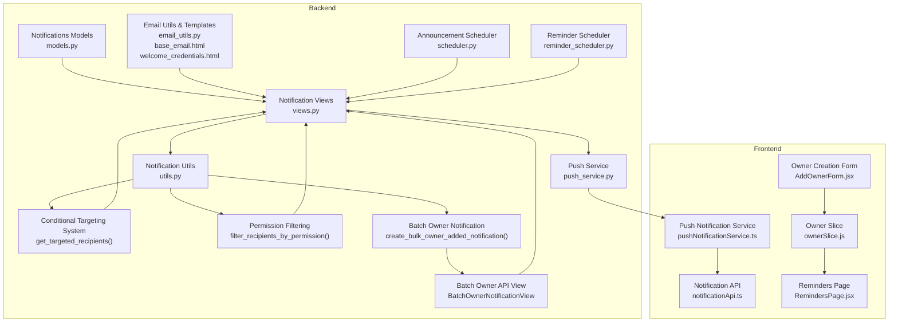
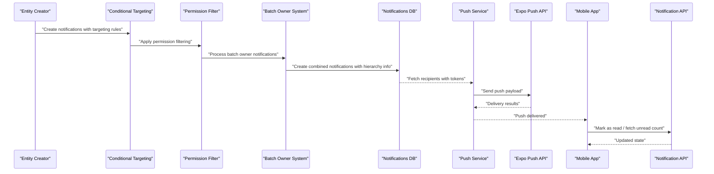
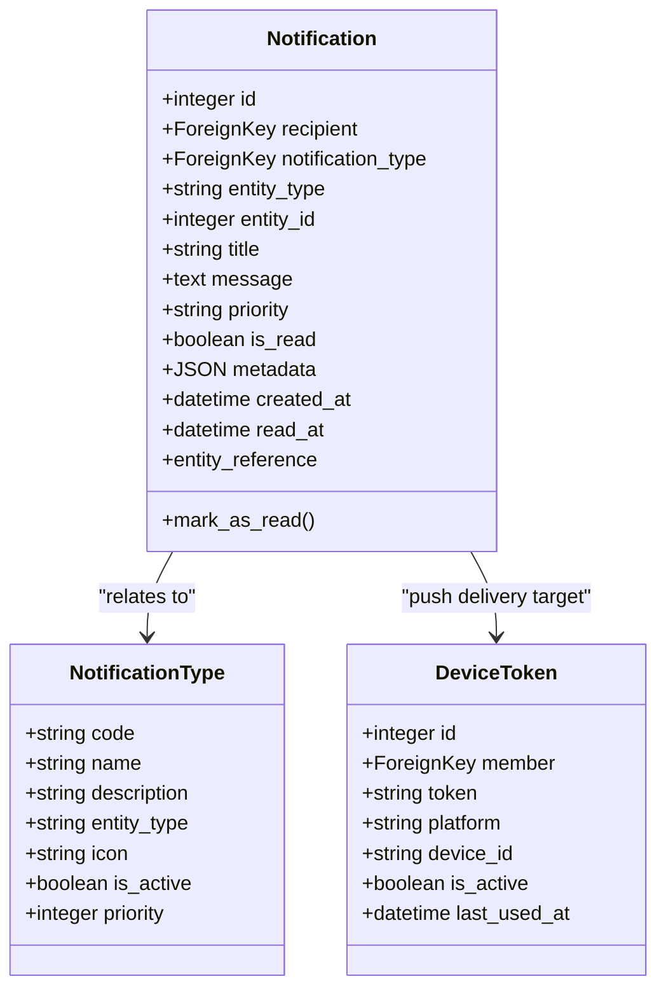
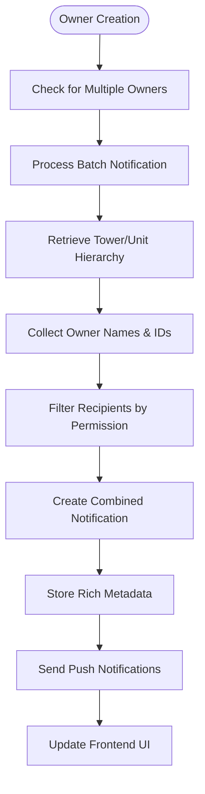
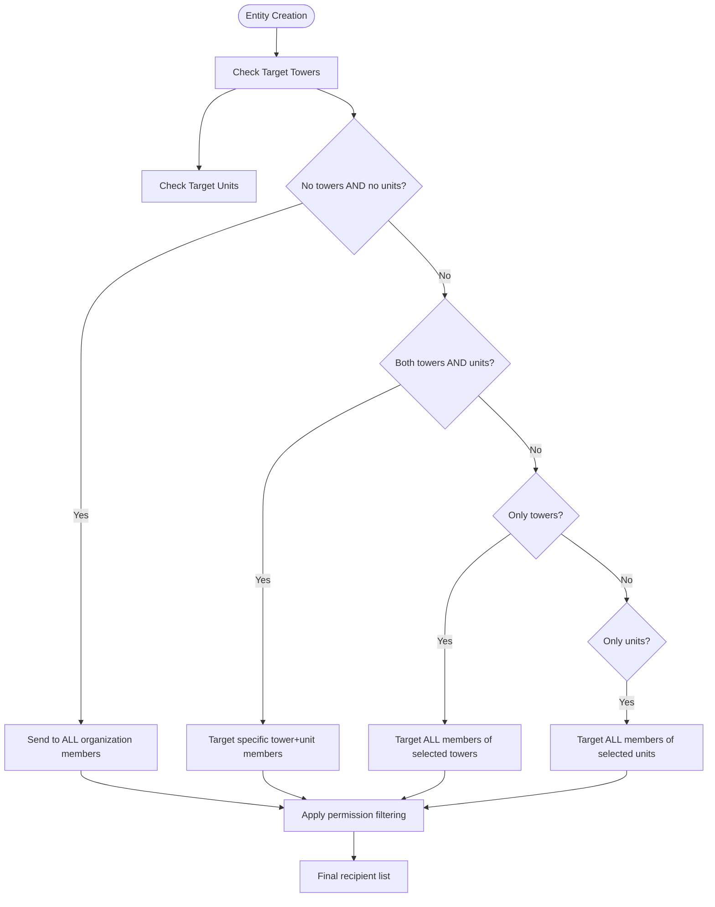
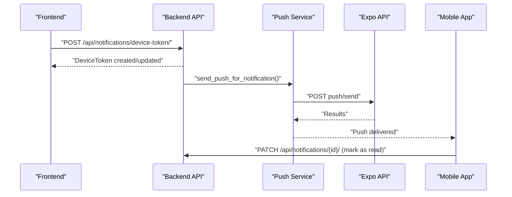
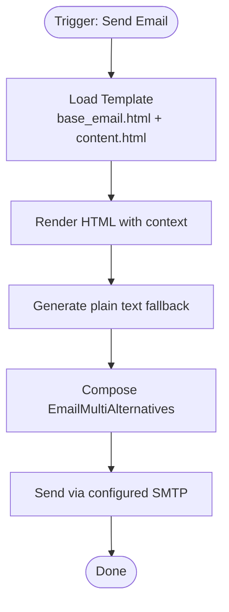
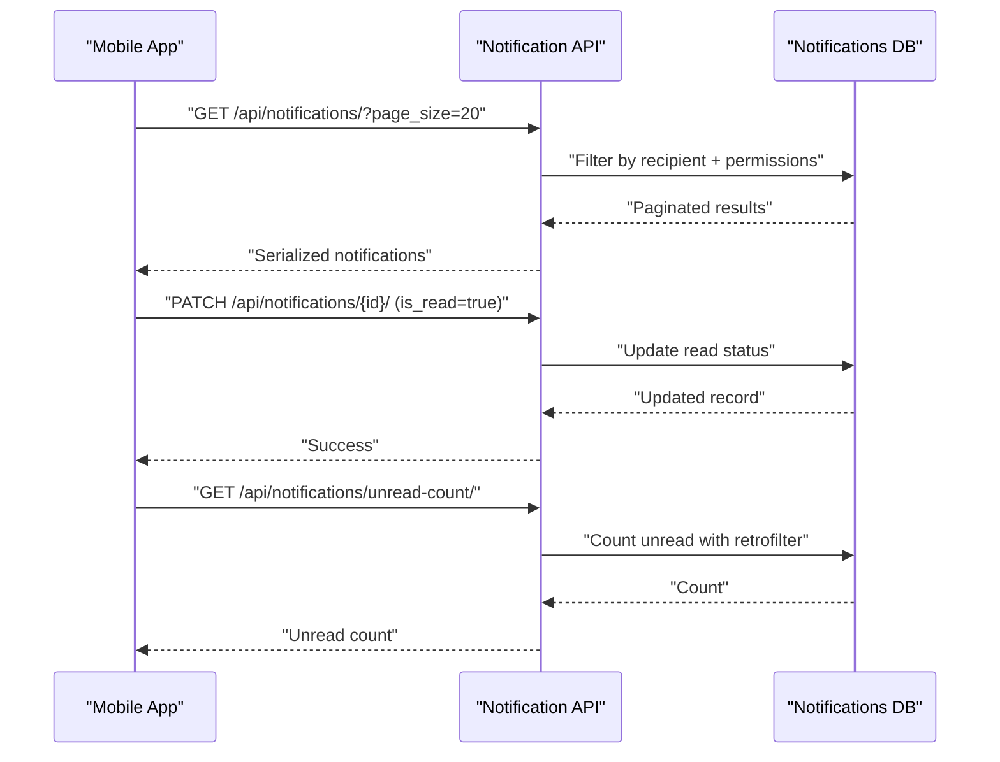
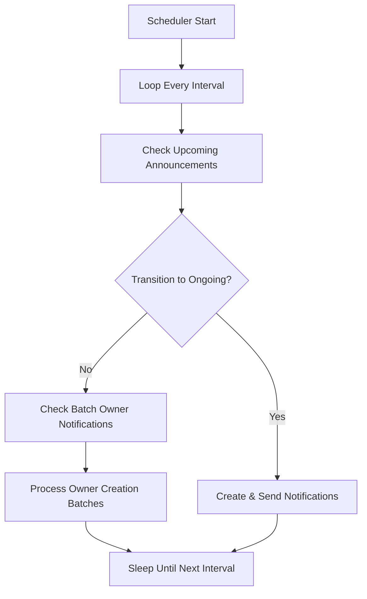
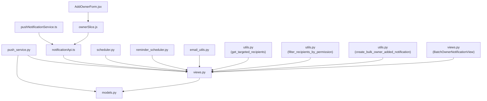

# Notification System

<cite>
**Referenced Files in This Document**
- [models.py](file://backend/notifications/models.py)
- [views.py](file://backend/notifications/views.py)
- [utils.py](file://backend/notifications/utils.py)
- [push_service.py](file://backend/notifications/push_service.py)
- [pushNotificationService.ts](file://Estate_link_App/src/services/pushNotificationService.ts)
- [notificationApi.ts](file://Estate_link_App/src/services/notificationApi.ts)
- [email_utils.py](file://backend/user/email_utils.py)
- [base_email.html](file://backend/user/templates/user/emails/base_email.html)
- [welcome_credentials.html](file://backend/user/templates/user/emails/welcome_credentials.html)
- [scheduler.py](file://backend/announcements/scheduler.py)
- [reminder_scheduler.py](file://backend/service_fee_management/reminder_scheduler.py)
- [test_conditional_notification_targeting.py](file://backend/test_conditional_notification_targeting.py)
- [NEW_MEMBER_NOTIFICATION_LOGIC.md](file://backend/notifications/NEW_MEMBER_NOTIFICATION_LOGIC.md)
- [CHANGES_SUMMARY.md](file://backend/notifications/CHANGES_SUMMARY.md)
- [test_bulk_owner_notification.py](file://backend/test_bulk_owner_notification.py)
- [test_sequential_owner_notification.py](file://backend/test_sequential_owner_notification.py)
- [test_double_notification.py](file://backend/test_double_notification.py)
- [AddOwnerForm.jsx](file://frontend/src/Features/TowersAndUnits/Owner/AddOwner/AddOwnerForm.jsx)
- [ownerSlice.js](file://frontend/src/redux/slices/owner/ownerSlice.js)
- [RemindersPage.jsx](file://frontend/src/pages/RemindersPage.jsx)
</cite>

## Update Summary
**Changes Made**
- Enhanced owner creation flow handling with batch notification improvements
- Added comprehensive batch owner notification system with full hierarchy information retrieval
- Improved integration with service fee management components
- Updated notification recipient targeting system with enhanced permission filtering
- Added new batch owner notification API endpoint and utility functions
- Enhanced frontend integration for owner creation with notification refresh triggers

## Table of Contents
1. [Introduction](#introduction)
2. [Project Structure](#project-structure)
3. [Core Components](#core-components)
4. [Architecture Overview](#architecture-overview)
5. [Detailed Component Analysis](#detailed-component-analysis)
6. [Dependency Analysis](#dependency-analysis)
7. [Performance Considerations](#performance-considerations)
8. [Troubleshooting Guide](#troubleshooting-guide)
9. [Conclusion](#conclusion)

## Introduction
This document describes the multi-channel notification system that powers push notifications, email notifications, and in-app notifications across the EstateLink platform. It explains notification types, delivery mechanisms, scheduling capabilities, template systems, dynamic content generation, personalization, device token management, subscription handling, notification preferences, analytics and delivery tracking, and the integration between backend triggers and frontend display components.

**Updated** The system now features enhanced owner creation flow handling with batch notification improvements, comprehensive batch owner notification system with full hierarchy information retrieval, and better integration with service fee management components. The notification system includes a new batch owner notification API endpoint and improved recipient targeting with enhanced permission filtering capabilities.

## Project Structure
The notification system spans three primary areas:
- Backend Django models and APIs for notifications, push delivery, email templating, and batch owner notifications
- Frontend React Native services for push registration, token management, and in-app display with owner creation integration
- Scheduling infrastructure for automated triggers (announcements and reminders)

**Diagram sources**
- [models.py](file://backend/notifications/models.py#L1-L230)
- [views.py](file://backend/notifications/views.py#L1-L676)
- [push_service.py](file://backend/notifications/push_service.py#L1-L332)
- [utils.py](file://backend/notifications/utils.py#L3537-L3639)
- [email_utils.py](file://backend/user/email_utils.py#L1-L48)
- [base_email.html](file://backend/user/templates/user/emails/base_email.html#L1-L179)
- [welcome_credentials.html](file://backend/user/templates/user/emails/welcome_credentials.html#L1-L27)
- [scheduler.py](file://backend/announcements/scheduler.py#L1-L120)
- [reminder_scheduler.py](file://backend/service_fee_management/reminder_scheduler.py#L1-L473)
- [pushNotificationService.ts](file://Estate_link_App/src/services/pushNotificationService.ts#L1-L364)
- [notificationApi.ts](file://Estate_link_App/src/services/notificationApi.ts#L1-L231)
- [AddOwnerForm.jsx](file://frontend/src/Features/TowersAndUnits/Owner/AddOwner/AddOwnerForm.jsx#L297-L627)
- [ownerSlice.js](file://frontend/src/redux/slices/owner/ownerSlice.js#L276-L311)
- [RemindersPage.jsx](file://frontend/src/pages/RemindersPage.jsx#L1-L7)

**Section sources**
- [models.py](file://backend/notifications/models.py#L1-L230)
- [views.py](file://backend/notifications/views.py#L1-L676)
- [push_service.py](file://backend/notifications/push_service.py#L1-L332)
- [utils.py](file://backend/notifications/utils.py#L3537-L3639)
- [email_utils.py](file://backend/user/email_utils.py#L1-L48)
- [base_email.html](file://backend/user/templates/user/emails/base_email.html#L1-L179)
- [welcome_credentials.html](file://backend/user/templates/user/emails/welcome_credentials.html#L1-L27)
- [scheduler.py](file://backend/announcements/scheduler.py#L1-L120)
- [reminder_scheduler.py](file://backend/service_fee_management/reminder_scheduler.py#L1-L473)
- [pushNotificationService.ts](file://Estate_link_App/src/services/pushNotificationService.ts#L1-L364)
- [notificationApi.ts](file://Estate_link_App/src/services/notificationApi.ts#L1-L231)
- [AddOwnerForm.jsx](file://frontend/src/Features/TowersAndUnits/Owner/AddOwner/AddOwnerForm.jsx#L297-L627)
- [ownerSlice.js](file://frontend/src/redux/slices/owner/ownerSlice.js#L276-L311)
- [RemindersPage.jsx](file://frontend/src/pages/RemindersPage.jsx#L1-L7)

## Core Components
- Notification types and storage: centralized master table for notification types and a flexible notification model with generic entity references.
- Push notification delivery: integration with Expo Push API for iOS/Android/web with per-user token management.
- Email notifications: HTML email templates with dynamic content rendering and fallback plain text.
- In-app notifications: REST endpoints for listing, marking as read, and retrieving unread counts; frontend API client and push handlers.
- Scheduling: background schedulers for announcement status transitions and service fee reminders.
- Personalization and permissions: retroactive-safe filtering based on user permissions and entity timestamps.
- **Updated** Batch owner notification system: comprehensive batch processing for multiple owner additions with full hierarchy information retrieval.
- **Updated** Enhanced owner creation flow: improved integration between frontend owner creation and backend notification system.
- **Updated** Service fee management integration: better coordination between notification system and service fee components.

**Section sources**
- [models.py](file://backend/notifications/models.py#L6-L90)
- [models.py](file://backend/notifications/models.py#L93-L198)
- [models.py](file://backend/notifications/models.py#L200-L230)
- [push_service.py](file://backend/notifications/push_service.py#L17-L107)
- [email_utils.py](file://backend/user/email_utils.py#L9-L48)
- [views.py](file://backend/notifications/views.py#L24-L191)
- [notificationApi.ts](file://Estate_link_App/src/services/notificationApi.ts#L48-L231)
- [pushNotificationService.ts](file://Estate_link_App/src/services/pushNotificationService.ts#L58-L364)
- [scheduler.py](file://backend/announcements/scheduler.py#L13-L120)
- [reminder_scheduler.py](file://backend/service_fee_management/reminder_scheduler.py#L33-L473)
- [utils.py](file://backend/notifications/utils.py#L3537-L3639)
- [utils.py](file://backend/notifications/utils.py#L363-L507)

## Architecture Overview
The system follows a layered architecture:
- Data layer: Django models define notification types, notifications, and device tokens.
- Business logic: Notification utilities enforce permission-based visibility and retroactive filtering, with enhanced batch processing for owner notifications and new conditional targeting for recipient selection.
- Delivery layer: Push service sends to Expo tokens; email utilities render and send HTML emails.
- API layer: DRF views expose endpoints for listing, marking read, device token registration, and batch owner notifications.
- Frontend layer: React Native services register tokens, handle push events, fetch in-app notifications, and integrate with owner creation workflows.

**Diagram sources**
- [utils.py](file://backend/notifications/utils.py#L3537-L3639)
- [utils.py](file://backend/notifications/utils.py#L363-L507)
- [utils.py](file://backend/notifications/utils.py#L290-L360)
- [models.py](file://backend/notifications/models.py#L93-L198)
- [push_service.py](file://backend/notifications/push_service.py#L172-L258)
- [pushNotificationService.ts](file://Estate_link_App/src/services/pushNotificationService.ts#L234-L364)
- [notificationApi.ts](file://Estate_link_App/src/services/notificationApi.ts#L129-L203)

## Detailed Component Analysis

### Notification Types and Storage
- NotificationType: central registry of notification categories with entity mapping, priority, and activation flags.
- Notification: stores title, message, priority, read status, and generic entity references; supports metadata for dynamic content.
- DeviceToken: stores per-member tokens with platform and activity tracking.

**Diagram sources**
- [models.py](file://backend/notifications/models.py#L6-L90)
- [models.py](file://backend/notifications/models.py#L93-L198)
- [models.py](file://backend/notifications/models.py#L200-L230)

**Section sources**
- [models.py](file://backend/notifications/models.py#L6-L90)
- [models.py](file://backend/notifications/models.py#L93-L198)
- [models.py](file://backend/notifications/models.py#L200-L230)

### Enhanced Batch Owner Notification System
**Updated** The system now includes a comprehensive batch owner notification system that processes multiple owner additions efficiently:

- **Batch Processing**: Single API endpoint handles multiple owner notifications with combined messaging
- **Hierarchy Information**: Full tower and unit hierarchy information retrieval for contextual notifications
- **Metadata Enrichment**: Rich metadata including owner IDs, names, unit information, and creator details
- **Permission-Based Delivery**: Targets recipients with "View Unit Resident" permission only
- **Duplicate Prevention**: Uses get_or_create pattern to prevent duplicate notifications

**Diagram sources**
- [utils.py](file://backend/notifications/utils.py#L3537-L3639)
- [views.py](file://backend/notifications/views.py#L430-L493)

**Section sources**
- [utils.py](file://backend/notifications/utils.py#L3537-L3639)
- [views.py](file://backend/notifications/views.py#L430-L493)
- [test_bulk_owner_notification.py](file://backend/test_bulk_owner_notification.py#L178-L296)
- [test_sequential_owner_notification.py](file://backend/test_sequential_owner_notification.py#L102-L239)

### Conditional Targeting System for Recipients
**Updated** The system now implements a comprehensive four-tier conditional targeting system:

**Rules:**
1. **Rule 1: No tower AND no unit** → Send to ALL organization members
2. **Rule 2: Tower AND unit** → Send ONLY to members of that specific tower+unit
3. **Rule 3: Only tower (no unit)** → Send to ALL members of that tower
4. **Rule 4: Only unit (with tower implied)** → Send to ALL members of that unit

The targeting system integrates with permission filtering to ensure recipients only receive notifications they're authorized to view.

**Diagram sources**
- [utils.py](file://backend/notifications/utils.py#L363-L507)

**Section sources**
- [utils.py](file://backend/notifications/utils.py#L363-L507)
- [test_conditional_notification_targeting.py](file://backend/test_conditional_notification_targeting.py#L1-L436)

### Push Notification Implementation
- Push service integrates with Expo Push API, supporting high/default priority and optional badge counts.
- Per-notification push decisions are controlled by metadata flags and entity-specific logic (e.g., mobile-friendly messaging for notices).
- Device token registration and deactivation endpoints manage subscriptions.

**Diagram sources**
- [views.py](file://backend/notifications/views.py#L496-L676)
- [push_service.py](file://backend/notifications/push_service.py#L17-L107)
- [push_service.py](file://backend/notifications/push_service.py#L172-L258)
- [pushNotificationService.ts](file://Estate_link_App/src/services/pushNotificationService.ts#L185-L229)
- [pushNotificationService.ts](file://Estate_link_App/src/services/pushNotificationService.ts#L253-L287)

**Section sources**
- [push_service.py](file://backend/notifications/push_service.py#L17-L107)
- [push_service.py](file://backend/notifications/push_service.py#L172-L258)
- [views.py](file://backend/notifications/views.py#L496-L676)
- [pushNotificationService.ts](file://Estate_link_App/src/services/pushNotificationService.ts#L185-L229)
- [pushNotificationService.ts](file://Estate_link_App/src/services/pushNotificationService.ts#L253-L287)

### Email Notification System
- HTML email rendering via Django templates with a base layout and specific content blocks.
- Dynamic content substitution using template variables and HTML generation.
- Fallback plain text generated from rendered HTML.

**Diagram sources**
- [email_utils.py](file://backend/user/email_utils.py#L9-L48)
- [base_email.html](file://backend/user/templates/user/emails/base_email.html#L1-L179)
- [welcome_credentials.html](file://backend/user/templates/user/emails/welcome_credentials.html#L1-L27)

**Section sources**
- [email_utils.py](file://backend/user/email_utils.py#L9-L48)
- [base_email.html](file://backend/user/templates/user/emails/base_email.html#L1-L179)
- [welcome_credentials.html](file://backend/user/templates/user/emails/welcome_credentials.html#L1-L27)

### In-App Notifications
- Backend endpoints:
  - List notifications with filtering by read status, type, and entity type.
  - Mark individual notifications as read.
  - Get unread count with retroactive filtering.
  - Device token registration/deactivation.
  - **Updated** Batch owner notification endpoint for processing multiple owner additions.
- Frontend:
  - API client for fetching notifications, unread counts, and marking as read.
  - Push handler that navigates to relevant screens and updates badge counts.
  - **Updated** Owner creation form integration with notification refresh triggers.

**Diagram sources**
- [views.py](file://backend/notifications/views.py#L38-L210)
- [views.py](file://backend/notifications/views.py#L374-L428)
- [views.py](file://backend/notifications/views.py#L496-L676)
- [notificationApi.ts](file://Estate_link_App/src/services/notificationApi.ts#L68-L150)
- [notificationApi.ts](file://Estate_link_App/src/services/notificationApi.ts#L156-L203)

**Section sources**
- [views.py](file://backend/notifications/views.py#L38-L210)
- [views.py](file://backend/notifications/views.py#L374-L428)
- [views.py](file://backend/notifications/views.py#L496-L676)
- [notificationApi.ts](file://Estate_link_App/src/services/notificationApi.ts#L68-L150)
- [notificationApi.ts](file://Estate_link_App/src/services/notificationApi.ts#L156-L203)

### Scheduling Capabilities
- Announcement status scheduler: periodically checks upcoming announcements and sends notifications when transitioning to ongoing.
- Service fee reminder scheduler: background thread checks due reminders and sends emails/SMS/app notifications with deduplication.
- **Updated** Batch owner notification scheduler: automated processing of owner creation batches with hierarchy information.

**Diagram sources**
- [scheduler.py](file://backend/announcements/scheduler.py#L40-L100)
- [reminder_scheduler.py](file://backend/service_fee_management/reminder_scheduler.py#L70-L195)

**Section sources**
- [scheduler.py](file://backend/announcements/scheduler.py#L13-L120)
- [reminder_scheduler.py](file://backend/service_fee_management/reminder_scheduler.py#L33-L473)

### Notification Template System and Dynamic Content
- Notification metadata drives dynamic content and routing:
  - Mobile-friendly titles/messages for push notifications.
  - Entity-specific identifiers (e.g., announcementId, bulletinId, noticeId) for frontend navigation.
  - Priority and status flags for personalized experiences.
  - **Updated** Batch owner metadata including owner IDs, names, unit information, and creator details.
- Email templates use a base layout with content blocks for consistent branding and responsive design.

**Section sources**
- [push_service.py](file://backend/notifications/push_service.py#L199-L247)
- [email_utils.py](file://backend/user/email_utils.py#L9-L48)
- [base_email.html](file://backend/user/templates/user/emails/base_email.html#L1-L179)
- [utils.py](file://backend/notifications/utils.py#L3598-L3620)

### Device Token Management and Subscription Handling
- Device token registration on login and automatic deactivation on logout.
- Token deactivation endpoint to disable notifications for a specific token.
- Token activity tracking and last-used timestamps for delivery reliability.

**Section sources**
- [pushNotificationService.ts](file://Estate_link_App/src/services/pushNotificationService.ts#L185-L229)
- [pushNotificationService.ts](file://Estate_link_App/src/services/pushNotificationService.ts#L513-L558)
- [views.py](file://backend/notifications/views.py#L634-L676)
- [models.py](file://backend/notifications/models.py#L200-L230)

### Notification Preferences and Personalization
- Priority levels influence push delivery and in-app display.
- Permission-based visibility ensures users only see notifications for entities they can view.
- Retroactive filtering prevents users from seeing notifications for items created before permission grants.
- **Updated** Conditional targeting ensures notifications are only sent to members within specified tower/unit relationships.
- **Updated** Batch owner notifications include rich metadata for enhanced personalization.

**Section sources**
- [models.py](file://backend/notifications/models.py#L98-L151)
- [utils.py](file://backend/notifications/utils.py#L74-L265)
- [utils.py](file://backend/notifications/utils.py#L290-L360)
- [utils.py](file://backend/notifications/utils.py#L3537-L3639)

### Enhanced Permission Filtering and Logging
**Updated** The system now includes comprehensive logging for recipient targeting and permission filtering:

- Detailed logging for each targeting rule application
- Permission grant timestamp tracking for retroactive filtering
- Recipient ID logging for notification tracking
- Error handling and exception logging for debugging
- **Updated** Batch owner notification logging with owner count and hierarchy information

**Section sources**
- [utils.py](file://backend/notifications/utils.py#L363-L507)
- [utils.py](file://backend/notifications/utils.py#L290-L360)
- [utils.py](file://backend/notifications/utils.py#L3537-L3639)
- [NEW_MEMBER_NOTIFICATION_LOGIC.md](file://backend/notifications/NEW_MEMBER_NOTIFICATION_LOGIC.md#L197-L207)

### Analytics, Delivery Tracking, and Fallback Mechanisms
- Push delivery results captured and logged for monitoring.
- Duplicate prevention for reminder emails via logging table entries.
- Fallback plain text generation for emails to improve deliverability.
- **Updated** Comprehensive logging for recipient targeting, permission filtering, and batch owner notifications for analytics.
- **Updated** Real-time notification refresh triggers from frontend owner creation workflows.

**Section sources**
- [push_service.py](file://backend/notifications/push_service.py#L80-L106)
- [reminder_scheduler.py](file://backend/service_fee_management/reminder_scheduler.py#L227-L258)
- [email_utils.py](file://backend/user/email_utils.py#L29-L47)
- [utils.py](file://backend/notifications/utils.py#L363-L507)
- [utils.py](file://backend/notifications/utils.py#L3537-L3639)

### Integration Between Backend Triggers and Frontend Display
- Backend creates notifications with metadata; frontend reads unread counts and displays notifications.
- Push handlers navigate to relevant screens based on entity types and IDs embedded in push payloads.
- Badge counts synchronized with backend unread counts.
- **Updated** Conditional targeting ensures frontend only displays notifications for entities within user's targeted tower/unit relationships.
- **Updated** Frontend owner creation forms trigger notification refresh events for real-time updates.
- **Updated** Service fee management integration provides reminders page access for notification management.

**Section sources**
- [pushNotificationService.ts](file://Estate_link_App/src/services/pushNotificationService.ts#L265-L287)
- [pushNotificationService.ts](file://Estate_link_App/src/services/pushNotificationService.ts#L639-L739)
- [notificationApi.ts](file://Estate_link_App/src/services/notificationApi.ts#L129-L149)
- [AddOwnerForm.jsx](file://frontend/src/Features/TowersAndUnits/Owner/AddOwner/AddOwnerForm.jsx#L594-L627)
- [ownerSlice.js](file://frontend/src/redux/slices/owner/ownerSlice.js#L285-L311)
- [RemindersPage.jsx](file://frontend/src/pages/RemindersPage.jsx#L1-L7)

## Dependency Analysis
Key dependencies and relationships:
- Notification views depend on NotificationType and DeviceToken models.
- Push service depends on DeviceToken and Notification models.
- Frontend push service depends on backend notification API and device token endpoints.
- Schedulers depend on notification utilities and entity models.
- **Updated** Batch owner notification system depends on Owner model and hierarchy utilities.
- **Updated** Conditional targeting system depends on tower/unit models and permission utilities.
- **Updated** Frontend owner creation depends on Redux slice and notification refresh events.

**Diagram sources**
- [views.py](file://backend/notifications/views.py#L1-L676)
- [models.py](file://backend/notifications/models.py#L1-L230)
- [push_service.py](file://backend/notifications/push_service.py#L1-L332)
- [pushNotificationService.ts](file://Estate_link_App/src/services/pushNotificationService.ts#L1-L364)
- [notificationApi.ts](file://Estate_link_App/src/services/notificationApi.ts#L1-L231)
- [scheduler.py](file://backend/announcements/scheduler.py#L1-L120)
- [reminder_scheduler.py](file://backend/service_fee_management/reminder_scheduler.py#L1-L473)
- [email_utils.py](file://backend/user/email_utils.py#L1-L48)
- [utils.py](file://backend/notifications/utils.py#L3537-L3639)
- [utils.py](file://backend/notifications/utils.py#L363-L507)
- [AddOwnerForm.jsx](file://frontend/src/Features/TowersAndUnits/Owner/AddOwner/AddOwnerForm.jsx#L297-L627)
- [ownerSlice.js](file://frontend/src/redux/slices/owner/ownerSlice.js#L276-L311)

**Section sources**
- [views.py](file://backend/notifications/views.py#L1-L676)
- [models.py](file://backend/notifications/models.py#L1-L230)
- [push_service.py](file://backend/notifications/push_service.py#L1-L332)
- [pushNotificationService.ts](file://Estate_link_App/src/services/pushNotificationService.ts#L1-L364)
- [notificationApi.ts](file://Estate_link_App/src/services/notificationApi.ts#L1-L231)
- [scheduler.py](file://backend/announcements/scheduler.py#L1-L120)
- [reminder_scheduler.py](file://backend/service_fee_management/reminder_scheduler.py#L1-L473)
- [email_utils.py](file://backend/user/email_utils.py#L1-L48)
- [utils.py](file://backend/notifications/utils.py#L3537-L3639)
- [utils.py](file://backend/notifications/utils.py#L363-L507)
- [AddOwnerForm.jsx](file://frontend/src/Features/TowersAndUnits/Owner/AddOwner/AddOwnerForm.jsx#L297-L627)
- [ownerSlice.js](file://frontend/src/redux/slices/owner/ownerSlice.js#L276-L311)

## Performance Considerations
- Database indexing on notification recipient, read status, type, and entity references enables efficient filtering and pagination.
- Pagination limits reduce payload sizes and improve responsiveness.
- Bulk updates for marking all notifications as read minimize database overhead.
- Push batching by recipient reduces redundant sends and optimizes API calls.
- **Updated** Batch owner notification system uses optimized queries with select_related for better performance.
- **Updated** Permission filtering is applied after recipient selection to minimize database queries.
- **Updated** Frontend integration uses event-driven refresh to minimize unnecessary API calls.
- **Updated** Service fee management integration provides efficient reminder scheduling with deduplication.

## Troubleshooting Guide
Common issues and resolutions:
- No active device tokens: Ensure the mobile app is logged in, has notification permissions, and registers tokens with the backend.
- Push disabled for notifications: Verify metadata flags and entity-specific logic for enabling push delivery.
- Permission-based visibility: Confirm user permissions and retroactive filtering logic for appropriate notification display.
- Duplicate reminder emails: Check reminder logging to prevent duplicate sends.
- **Updated** Batch owner notification failures: Verify owner IDs, unit associations, and permission filtering for recipients.
- **Updated** Targeting issues: Verify tower/unit relationships in notification creation and check conditional targeting logs.
- **Updated** Permission filtering problems: Review permission grant timestamps and ensure proper permission assignment.
- **Updated** Frontend notification refresh issues: Check Redux slice actions and event dispatching for owner creation workflows.
- **Updated** Service fee reminder scheduling problems: Verify reminder timing rules and duplicate prevention logic.

**Section sources**
- [test_bulk_owner_notification.py](file://backend/test_bulk_owner_notification.py#L178-L296)
- [test_sequential_owner_notification.py](file://backend/test_sequential_owner_notification.py#L102-L239)
- [test_double_notification.py](file://backend/test_double_notification.py#L166-L197)
- [utils.py](file://backend/notifications/utils.py#L74-L265)
- [reminder_scheduler.py](file://backend/service_fee_management/reminder_scheduler.py#L227-L258)
- [NEW_MEMBER_NOTIFICATION_LOGIC.md](file://backend/notifications/NEW_MEMBER_NOTIFICATION_LOGIC.md#L197-L207)
- [ownerSlice.js](file://frontend/src/redux/slices/owner/ownerSlice.js#L285-L311)

## Conclusion
The multi-channel notification system combines flexible notification types, robust push delivery via Expo, customizable email templates, and seamless in-app integration. It enforces permission-based visibility, prevents retroactive exposure, and provides scheduling infrastructure for timely triggers. The frontend services ensure reliable token management, navigation, and badge synchronization, while backend utilities offer strong performance characteristics and observability.

**Updated** The system now features enhanced owner creation flow handling with comprehensive batch notification improvements, including full hierarchy information retrieval and better integration with service fee management components. The notification system includes a new batch owner notification API endpoint, improved recipient targeting with enhanced permission filtering, and real-time frontend integration for owner creation workflows. These enhancements ensure efficient processing of multiple owner additions while maintaining strict permission controls and comprehensive logging for monitoring and debugging purposes.