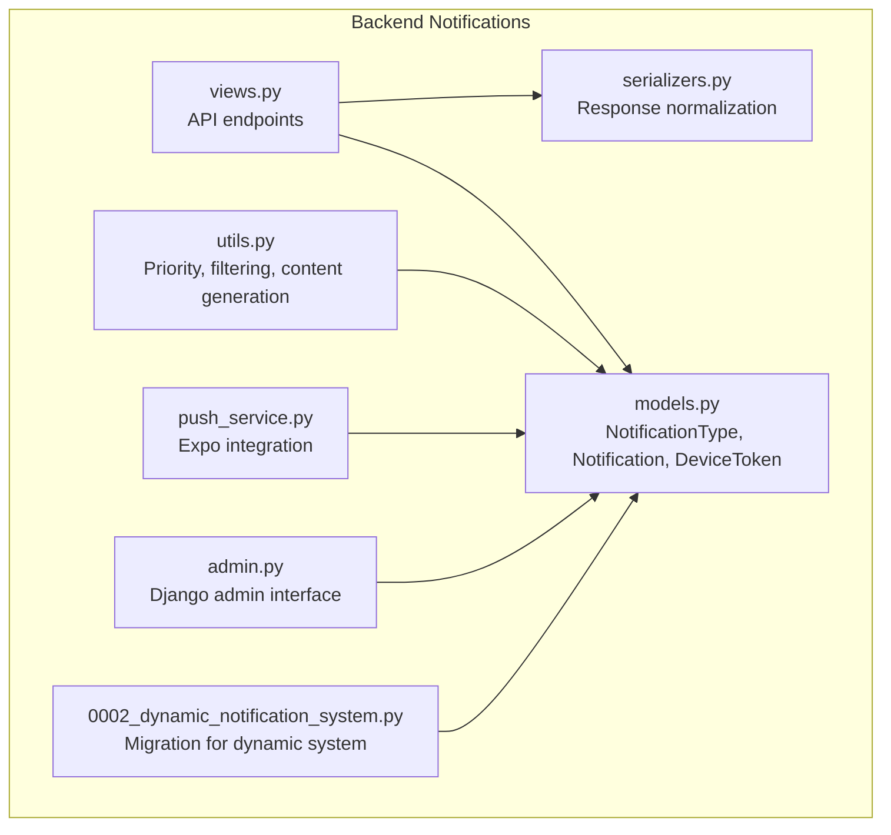
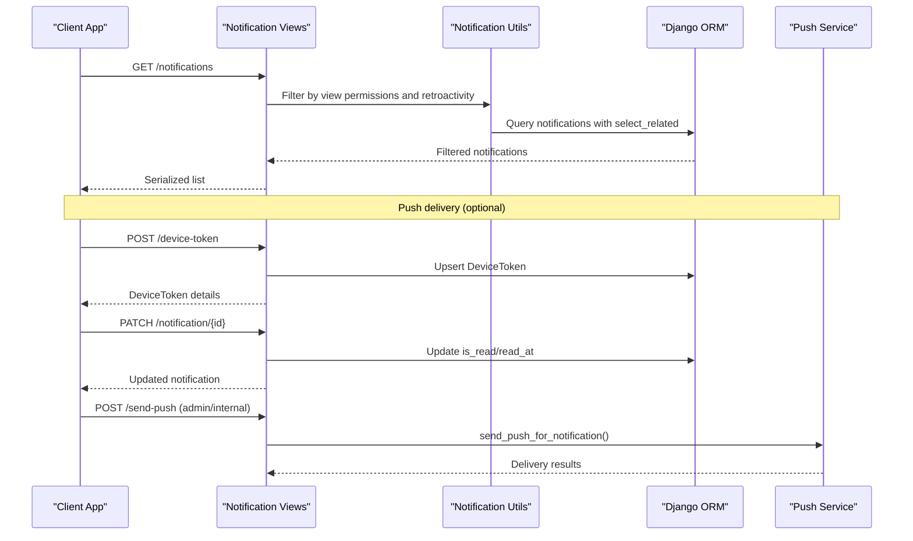
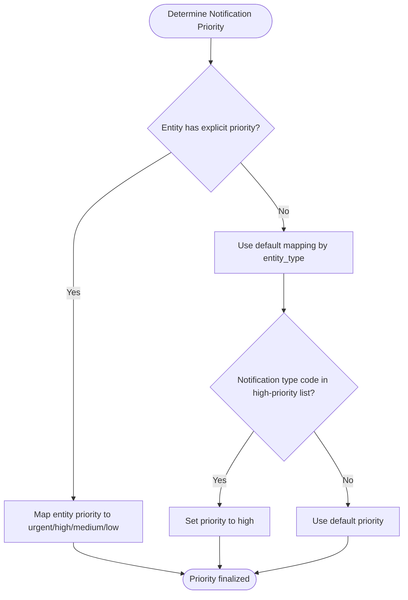
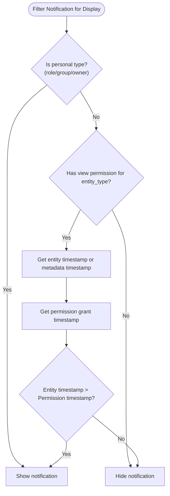
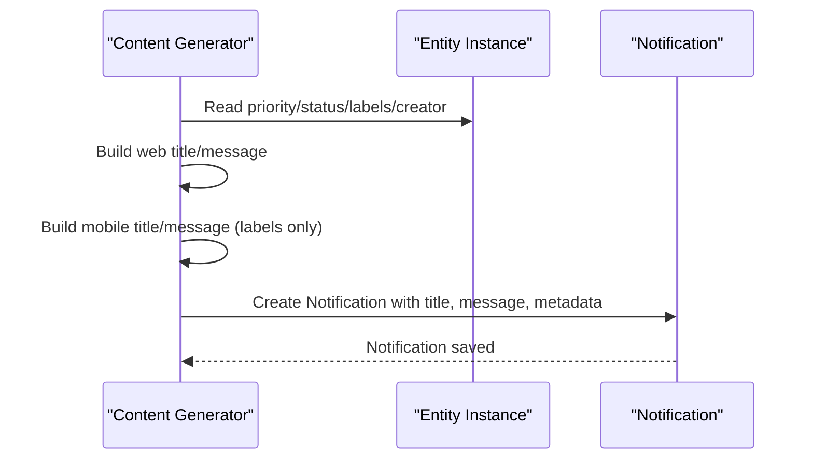
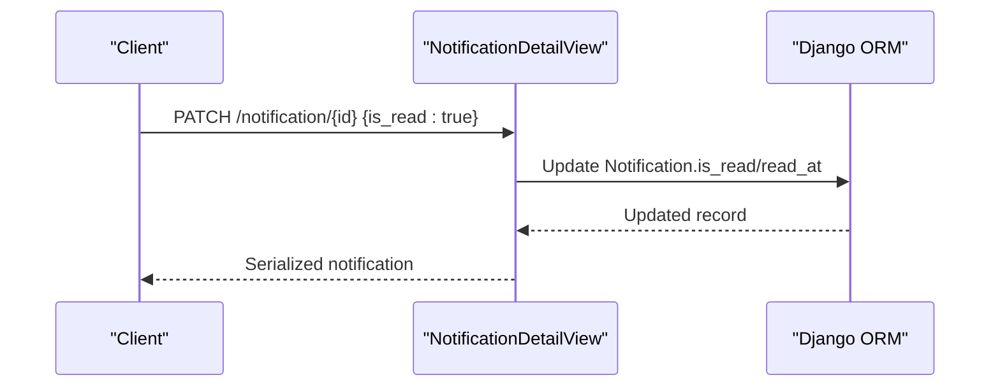
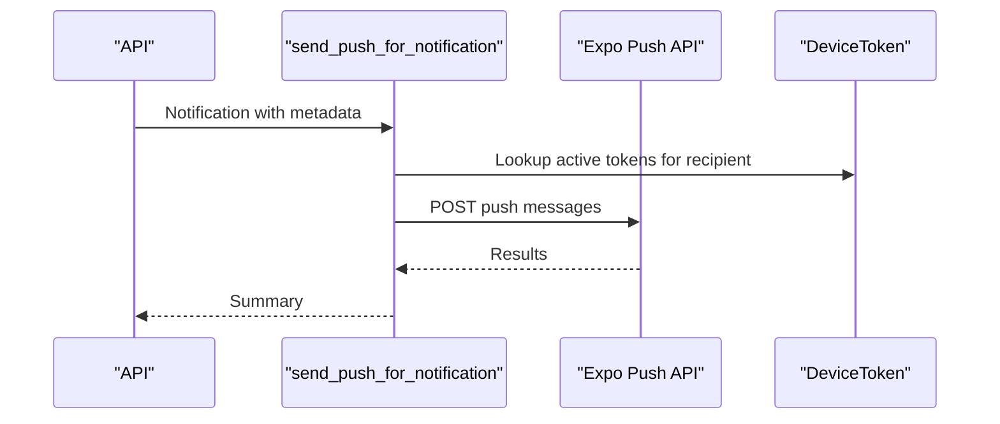
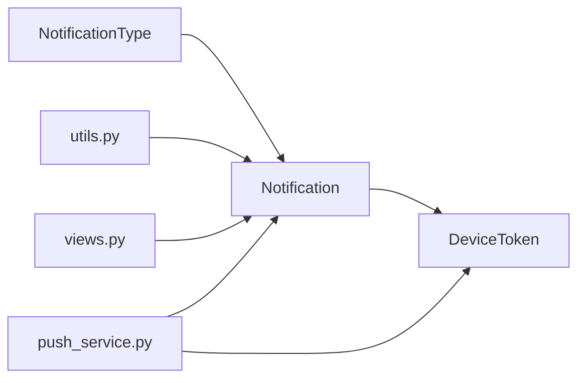

# Notification Types & Templates

<cite>
**Referenced Files in This Document**
- [models.py](file://backend/notifications/models.py)
- [views.py](file://backend/notifications/views.py)
- [serializers.py](file://backend/notifications/serializers.py)
- [admin.py](file://backend/notifications/admin.py)
- [utils.py](file://backend/notifications/utils.py)
- [push_service.py](file://backend/notifications/push_service.py)
- [0002_dynamic_notification_system.py](file://backend/notifications/migrations/0002_dynamic_notification_system.py)
</cite>

## Table of Contents
1. [Introduction](#introduction)
2. [Project Structure](#project-structure)
3. [Core Components](#core-components)
4. [Architecture Overview](#architecture-overview)
5. [Detailed Component Analysis](#detailed-component-analysis)
6. [Dependency Analysis](#dependency-analysis)
7. [Performance Considerations](#performance-considerations)
8. [Troubleshooting Guide](#troubleshooting-guide)
9. [Conclusion](#conclusion)

## Introduction
This document explains the notification type system and template management in the project. It covers:
- NotificationType model structure and dynamic registration
- Entity type mapping and generic entity references
- Notification content generation and metadata-driven personalization
- Priority levels and their impact on delivery (push vs feed)
- Activation/deactivation and metadata management
- Practical patterns for defining notification types and generating content

## Project Structure
The notification subsystem is implemented in the backend under the notifications app. Key elements:
- Models define the canonical structure for notification types and notifications
- Views expose API endpoints for listing, reading, and managing notifications
- Serializers normalize data for API responses
- Utilities encapsulate content generation, priority mapping, and permission-based filtering
- Push service integrates with Expo to deliver push notifications
- A migration demonstrates dynamic notification type registration and schema evolution

**Diagram sources**
- [models.py](file://backend/notifications/models.py#L6-L264)
- [views.py](file://backend/notifications/views.py#L1-L523)
- [serializers.py](file://backend/notifications/serializers.py#L1-L128)
- [utils.py](file://backend/notifications/utils.py#L1-L4750)
- [push_service.py](file://backend/notifications/push_service.py#L1-L305)
- [admin.py](file://backend/notifications/admin.py#L1-L57)
- [0002_dynamic_notification_system.py](file://backend/notifications/migrations/0002_dynamic_notification_system.py#L1-L209)

**Section sources**
- [models.py](file://backend/notifications/models.py#L6-L264)
- [views.py](file://backend/notifications/views.py#L1-L523)
- [serializers.py](file://backend/notifications/serializers.py#L1-L128)
- [utils.py](file://backend/notifications/utils.py#L1-L4750)
- [push_service.py](file://backend/notifications/push_service.py#L1-L305)
- [admin.py](file://backend/notifications/admin.py#L1-L57)
- [0002_dynamic_notification_system.py](file://backend/notifications/migrations/0002_dynamic_notification_system.py#L1-L209)

## Core Components
- NotificationType: Dynamic master table for notification categories, including code, name, description, entity_type mapping, icon, activation flag, priority, and timestamps.
- Notification: Stores individual notifications with recipient, notification type, generic entity reference (entity_type/entity_id), title, message, priority, read status, and JSON metadata.
- DeviceToken: Stores push tokens per member with platform and activity tracking.
- Utilities: Provide priority mapping, permission-based filtering, recipient selection, and content generation for various entity types.
- Push service: Integrates with Expo to send push notifications to registered tokens.
- Views and Serializers: Expose API endpoints for listing, reading, marking as read, and device token registration.

Key capabilities:
- Dynamic notification type registration via NotificationType entries
- Generic entity references enabling notifications for announcements, bulletins, notices, members, roles, groups, units, residents, and more
- Priority-driven delivery (urgent/high send push; medium/low appear in feed only)
- Permission-aware filtering to prevent retroactive exposure
- Metadata-driven personalization for web and mobile contexts

**Section sources**
- [models.py](file://backend/notifications/models.py#L6-L264)
- [utils.py](file://backend/notifications/utils.py#L20-L265)
- [push_service.py](file://backend/notifications/push_service.py#L17-L305)
- [views.py](file://backend/notifications/views.py#L24-L384)
- [serializers.py](file://backend/notifications/serializers.py#L5-L128)
- [admin.py](file://backend/notifications/admin.py#L5-L57)

## Architecture Overview
The system separates concerns across models, utilities, views, serializers, and push delivery:
- Content generation and priority mapping live in utilities
- API endpoints enforce permission filters and retroactivity rules
- Push delivery is decoupled and gated by metadata flags and priority

**Diagram sources**
- [views.py](file://backend/notifications/views.py#L24-L384)
- [utils.py](file://backend/notifications/utils.py#L74-L265)
- [push_service.py](file://backend/notifications/push_service.py#L172-L305)
- [models.py](file://backend/notifications/models.py#L93-L198)

## Detailed Component Analysis

### NotificationType Model and Dynamic Registration
- Purpose: Central registry for notification categories with dynamic addition and activation control
- Fields:
  - code: unique identifier for the notification type (e.g., announcement lifecycle events)
  - name: human-readable label
  - description: trigger context
  - entity_type: maps to supported entity categories (announcement, bulletin, member, notice, etc.)
  - icon: optional emoji/icon for UI
  - is_active: enable/disable the type
  - priority: higher sorts earlier
  - timestamps: created_at/updated_at
- Indexes: code uniqueness and composite index on entity_type and is_active
- Admin: Provides list, filter, search, and inline editing of fields

Dynamic registration pattern:
- Create NotificationType entries programmatically or via Django admin
- Use code to link content generation logic and API filtering
- Adjust is_active and priority to control visibility and sorting

**Section sources**
- [models.py](file://backend/notifications/models.py#L6-L90)
- [admin.py](file://backend/notifications/admin.py#L5-L27)
- [0002_dynamic_notification_system.py](file://backend/notifications/migrations/0002_dynamic_notification_system.py#L9-L51)

### Notification Model and Generic Entity References
- Purpose: Store individual notifications with generic linkage to any entity
- Fields:
  - recipient: FK to Member
  - notification_type: FK to NotificationType (dynamic type)
  - entity_type/entity_id: generic foreign reference to the triggering entity
  - title/message: content (web/desktop) and optional short_message for push
  - priority: urgent/high/medium/low
  - is_read/read_at: read state tracking
  - metadata: JSON for flexible content personalization and delivery flags
- Indexes: optimized lookups by recipient, type, entity reference, and priority/read status
- Utility property: entity_reference string for quick identification

Activation/deactivation and metadata:
- is_active on NotificationType controls whether the type is considered active
- metadata can include flags like should_send_push and mobile_title/short_message for push delivery

**Section sources**
- [models.py](file://backend/notifications/models.py#L93-L198)
- [models.py](file://backend/notifications/models.py#L200-L262)
- [serializers.py](file://backend/notifications/serializers.py#L25-L101)

### Priority Levels and Delivery Impact
- Priority levels: urgent, high, medium, low
- Delivery behavior:
  - urgent/high: eligible for push notification delivery (when should_send_push is enabled)
  - medium/low: appear in the notification feed only
- Priority mapping:
  - Default mapping by entity type
  - Override based on entity priority (e.g., announcement/bulletin priority)
  - Special notification type codes mapped to high priority
- Push service:
  - Decides priority based on metadata and entity priority
  - Sends to registered device tokens via Expo

**Diagram sources**
- [utils.py](file://backend/notifications/utils.py#L20-L72)

**Section sources**
- [models.py](file://backend/notifications/models.py#L99-L151)
- [utils.py](file://backend/notifications/utils.py#L20-L72)
- [push_service.py](file://backend/notifications/push_service.py#L172-L258)

### Entity Reference System and Permission Filtering
- Generic references:
  - entity_type: one of supported categories (announcement, bulletin, notice, member, role, group, unit, resident, unit_staff, other)
  - entity_id: numeric ID of the referenced entity
- Permission-aware filtering:
  - should_show_notification enforces retroactivity rules and view permissions
  - has_view_permission checks required permissions per entity type
  - Filters applied at display time to avoid exposing retroactive notifications
- Recipient selection:
  - Utilities compute recipients for announcements/bulletins/notices based on target units/towers and current permissions

**Diagram sources**
- [utils.py](file://backend/notifications/utils.py#L74-L265)

**Section sources**
- [utils.py](file://backend/notifications/utils.py#L74-L265)
- [views.py](file://backend/notifications/views.py#L80-L139)

### Notification Template Management and Content Generation
- Title/message generation:
  - Utilities build web-friendly and push-friendly content based on entity type and priority
  - Example patterns:
    - Announcements: urgency-aware titles and messages; scheduled/ongoing variants
    - Notices: web/desktop full context; mobile minimal labels-only
- Variable substitution and personalization:
  - Metadata carries variables (e.g., poster name, labels, status, notification_type)
  - Push content can be customized with mobile_title and short_message
- Examples of content generation patterns:
  - Announcement published/updated/scheduled/ongoing with urgency prefixes
  - Notice posted with priority-based title and labels-only push message
  - Metadata includes keys like poster name, labels, priority, and navigation hints

**Diagram sources**
- [utils.py](file://backend/notifications/utils.py#L982-L1066)
- [utils.py](file://backend/notifications/utils.py#L1962-L2066)

**Section sources**
- [utils.py](file://backend/notifications/utils.py#L982-L1066)
- [utils.py](file://backend/notifications/utils.py#L1962-L2066)

### API Workflows and Read Status Management
- Listing notifications:
  - Filters by read/unread, type (code or ID), and entity_type
  - Applies permission and retroactivity filtering before serialization
  - Pagination with configurable page size
- Marking as read:
  - Single-item update endpoint toggles is_read and records read_at
  - Bulk operation marks all unread for the authenticated user
- Unread count:
  - Computes unread count respecting permissions and retroactivity
- Device token registration:
  - Registers or updates push tokens per member
  - Supports deactivation on logout/uninstall

**Diagram sources**
- [views.py](file://backend/notifications/views.py#L194-L294)
- [views.py](file://backend/notifications/views.py#L297-L330)
- [views.py](file://backend/notifications/views.py#L332-L384)
- [views.py](file://backend/notifications/views.py#L447-L523)

**Section sources**
- [views.py](file://backend/notifications/views.py#L24-L384)
- [serializers.py](file://backend/notifications/serializers.py#L66-L101)

### Push Notification Delivery
- Triggering:
  - Push delivery is gated by metadata.should_send_push and priority
  - Push title/body differ by entity type (e.g., notices use mobile_title/short_message)
- Delivery:
  - Retrieves active device tokens for recipients
  - Sends via Expo with appropriate priority and data payload
  - Updates last_used_at for tokens

**Diagram sources**
- [push_service.py](file://backend/notifications/push_service.py#L172-L305)

**Section sources**
- [push_service.py](file://backend/notifications/push_service.py#L17-L305)

## Dependency Analysis
- Models:
  - NotificationType defines the canonical category; Notification depends on it
  - Notification uses generic entity references to decouple from specific entity models
  - DeviceToken links members to push tokens
- Utilities:
  - Priority mapping, permission checks, and content generation depend on entity models and permission constants
- Views:
  - Apply permission and retroactivity filtering before serializing
- Push service:
  - Depends on Notification metadata and DeviceToken storage

**Diagram sources**
- [models.py](file://backend/notifications/models.py#L6-L264)
- [utils.py](file://backend/notifications/utils.py#L1-L4750)
- [views.py](file://backend/notifications/views.py#L1-L523)
- [push_service.py](file://backend/notifications/push_service.py#L1-L305)

**Section sources**
- [models.py](file://backend/notifications/models.py#L6-L264)
- [utils.py](file://backend/notifications/utils.py#L1-L4750)
- [views.py](file://backend/notifications/views.py#L1-L523)
- [push_service.py](file://backend/notifications/push_service.py#L1-L305)

## Performance Considerations
- Database-level filtering:
  - Views filter notifications at the database level and use select_related to reduce queries
- Indexes:
  - NotificationType and Notification have indexes on frequently queried fields (code, entity_type/is_active, recipient, entity reference)
- Pagination:
  - Controlled page size prevents oversized payloads
- Retroactivity filtering:
  - Applied in memory after DB filtering to ensure correctness without expensive joins

[No sources needed since this section provides general guidance]

## Troubleshooting Guide
Common issues and resolutions:
- Notifications not appearing:
  - Verify NotificationType.is_active and entity_type mapping
  - Confirm user has view permission for the entity type
  - Check retroactivity rules: entity must be created after permission grant
- Push notifications not sent:
  - Ensure metadata.should_send_push is enabled and priority is high/urgent
  - Confirm device tokens are registered and active
- Incorrect content or missing variables:
  - Verify metadata includes required keys (e.g., poster name, labels, priority)
  - Review content generation logic for the specific notification type code

**Section sources**
- [utils.py](file://backend/notifications/utils.py#L74-L265)
- [push_service.py](file://backend/notifications/push_service.py#L172-L258)
- [views.py](file://backend/notifications/views.py#L80-L139)

## Conclusion
The notification system provides a robust, extensible foundation for dynamic notification types, permission-aware delivery, and flexible content generation. By leveraging NotificationType for registration, generic entity references for broad coverage, and metadata-driven personalization, the system supports diverse communication scenarios while maintaining strong performance and clarity.