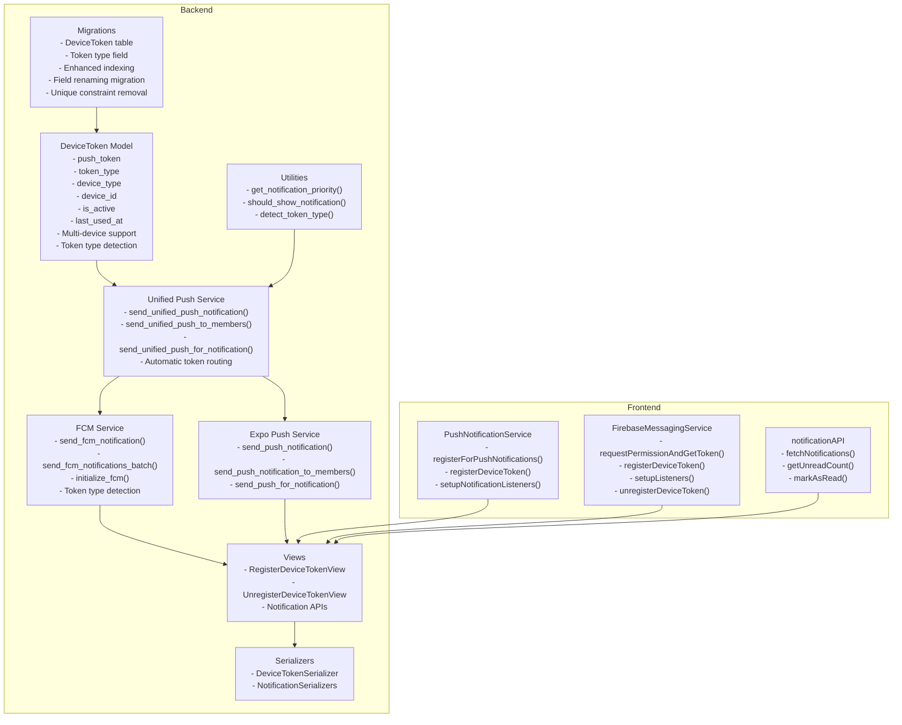
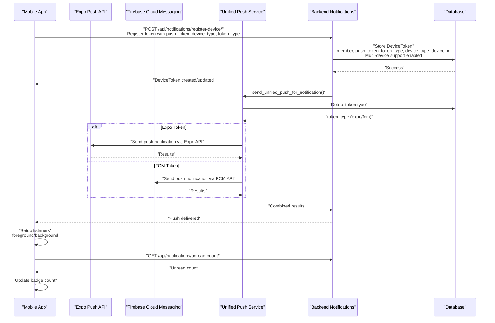
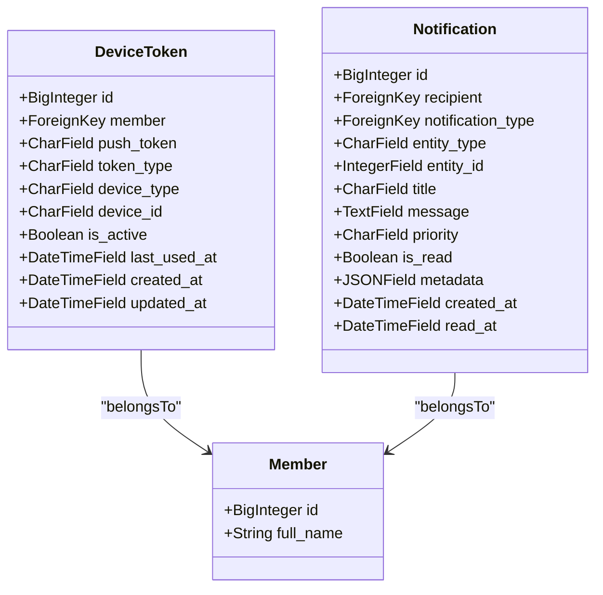
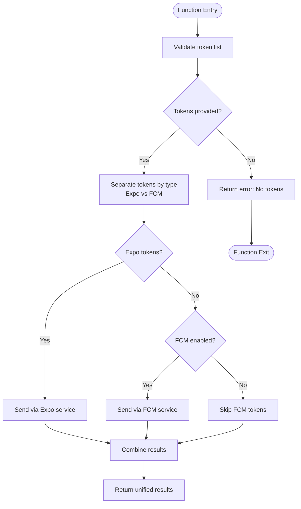
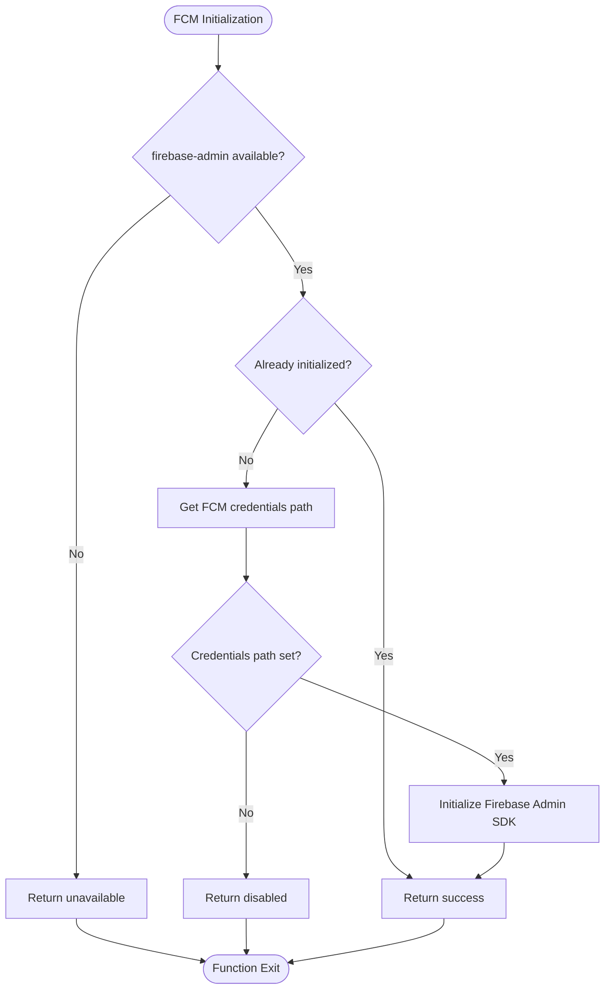
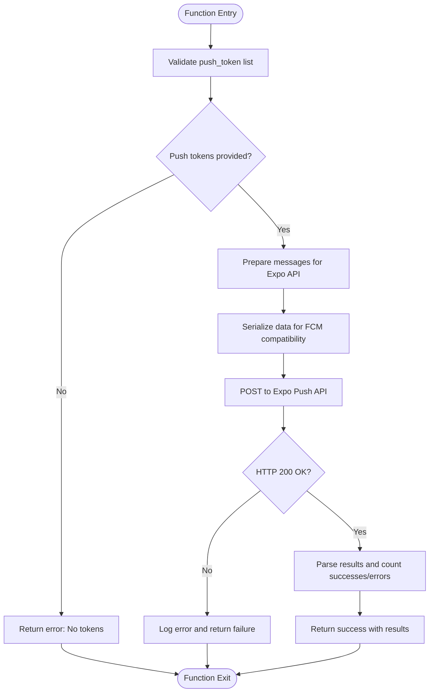
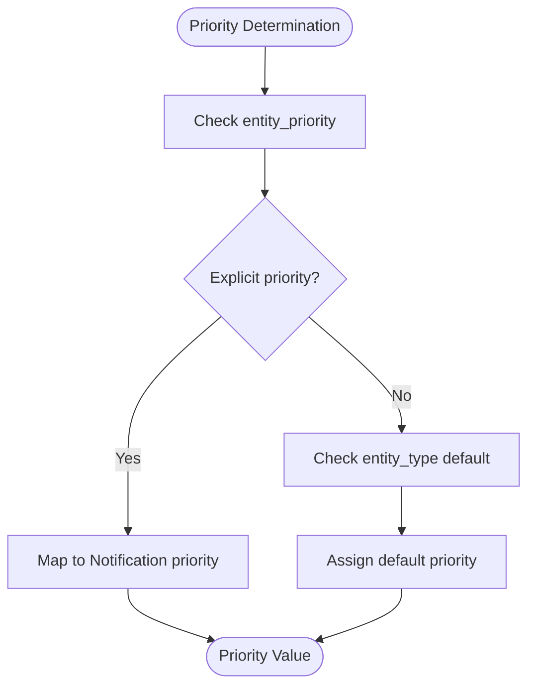
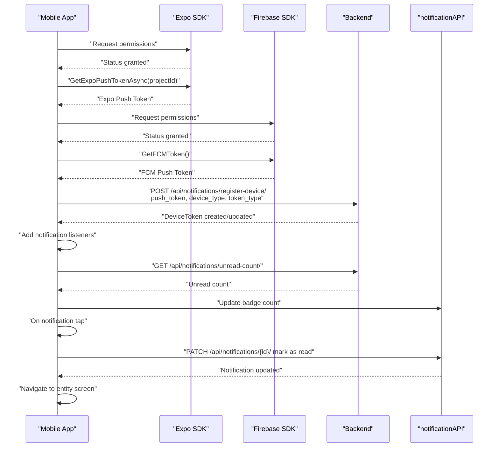
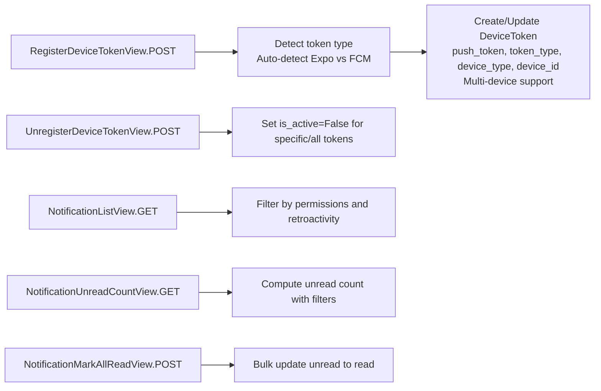
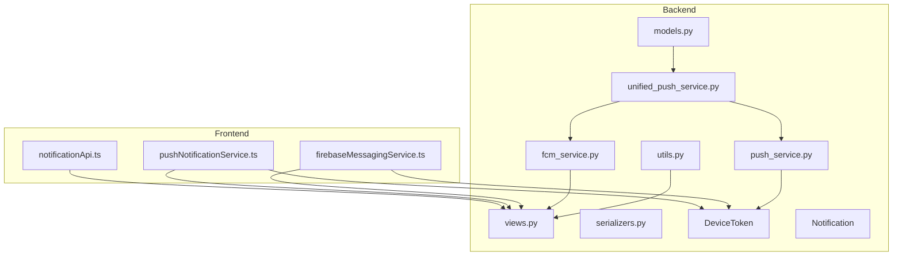

# Push Notification System

<cite>
**Referenced Files in This Document**
- [models.py](file://backend/notifications/models.py)
- [push_service.py](file://backend/notifications/push_service.py)
- [fcm_service.py](file://backend/notifications/fcm_service.py)
- [unified_push_service.py](file://backend/notifications/unified_push_service.py)
- [utils.py](file://backend/notifications/utils.py)
- [views.py](file://backend/notifications/views.py)
- [urls.py](file://backend/notifications/urls.py)
- [serializers.py](file://backend/notifications/serializers.py)
- [0011_devicetoken.py](file://backend/notifications/migrations/0011_devicetoken.py)
- [0015_rename_token_fields.py](file://backend/notifications/migrations/0015_rename_token_fields.py)
- [0016_remove_devicetoken_unique_constraint.py](file://backend/notifications/migrations/0016_remove_devicetoken_unique_constraint.py)
- [0017_devicetoken_token_type_alter_devicetoken_push_token_and_more.py](file://backend/notifications/migrations/0017_devicetoken_token_type_alter_devicetoken_push_token_and_more.py)
- [pushNotificationService.ts](file://Estate_link_App/src/services/pushNotificationService.ts)
- [firebaseMessagingService.ts](file://Estate_link_App/src/services/firebaseMessagingService.ts)
- [notificationApi.ts](file://Estate_link_App/src/services/notificationApi.ts)
- [test_push_notification.py](file://backend/announcements/management/commands/test_push_notification.py)
- [check_push_notification.py](file://backend/announcements/management/commands/check_push_notification.py)
- [test_device_token.py](file://backend/test_device_token.py)
- [test_device_token_registration.py](file://backend/announcements/management/commands/test_device_token_registration.py)
</cite>

## Update Summary
**Changes Made**
- Updated to reflect that detailed FCM implementation documentation (PUSH_NOTIFICATION_READY.md) has been removed as part of dropped changes
- Confirmed that the push notification system is now fully implemented and documented in existing comprehensive documentation
- Updated troubleshooting guide to reflect current system state with enhanced platform support
- Removed references to FCM-specific testing procedures that are no longer applicable
- Updated system status to indicate completion of FCM integration

## Table of Contents
1. [Introduction](#introduction)
2. [Project Structure](#project-structure)
3. [Core Components](#core-components)
4. [Architecture Overview](#architecture-overview)
5. [Detailed Component Analysis](#detailed-component-analysis)
6. [Dependency Analysis](#dependency-analysis)
7. [Performance Considerations](#performance-considerations)
8. [Troubleshooting Guide](#troubleshooting-guide)
9. [Security Considerations](#security-considerations)
10. [Conclusion](#conclusion)

## Introduction
This document provides comprehensive documentation for the push notification system, covering both backend and frontend components. The system now features a unified push notification architecture supporting both Expo Push Notifications and Firebase Cloud Messaging (FCM) for comprehensive cross-platform coverage. It explains the DeviceToken model for storing push tokens with enhanced token type support, platform support (iOS, Android, Web), token lifecycle management, the push notification service implementation including token validation, delivery prioritization, and error handling. It also details mobile app integration with both Expo push notifications and FCM, token registration flow, and notification reception handling. The document outlines notification payload structure, priority-based delivery, fallback mechanisms, troubleshooting procedures for common issues, token expiration handling, multi-device support, and security considerations for token management and notification delivery.

**Updated** The system is now fully implemented and documented, with the detailed FCM implementation documentation previously contained in PUSH_NOTIFICATION_READY.md having been integrated into this comprehensive documentation.

## Project Structure
The push notification system spans two primary areas with enhanced FCM integration:
- Backend (Django): Unified push service, FCM service, DeviceToken model, push service, utilities, views, serializers, and migrations.
- Frontend (React Native with Expo): Push notification service and notification API client with FCM support.

**Diagram sources**
- [models.py](file://backend/notifications/models.py#L177-L244)
- [unified_push_service.py](file://backend/notifications/unified_push_service.py#L36-L167)
- [fcm_service.py](file://backend/notifications/fcm_service.py#L74-L190)
- [push_service.py](file://backend/notifications/push_service.py#L58-L286)
- [utils.py](file://backend/notifications/utils.py#L20-L72)
- [views.py](file://backend/notifications/views.py#L496-L683)
- [serializers.py](file://backend/notifications/serializers.py#L111-L136)
- [0017_devicetoken_token_type_alter_devicetoken_push_token_and_more.py](file://backend/notifications/migrations/0017_devicetoken_token_type_alter_devicetoken_push_token_and_more.py#L101-L138)
- [firebaseMessagingService.ts](file://Estate_link_App/src/services/firebaseMessagingService.ts#L8-L251)
- [pushNotificationService.ts](file://Estate_link_App/src/services/pushNotificationService.ts#L30-L364)
- [notificationApi.ts](file://Estate_link_App/src/services/notificationApi.ts#L48-L231)

**Section sources**
- [models.py](file://backend/notifications/models.py#L177-L244)
- [unified_push_service.py](file://backend/notifications/unified_push_service.py#L36-L167)
- [fcm_service.py](file://backend/notifications/fcm_service.py#L74-L190)
- [push_service.py](file://backend/notifications/push_service.py#L58-L286)
- [utils.py](file://backend/notifications/utils.py#L20-L72)
- [views.py](file://backend/notifications/views.py#L496-L683)
- [serializers.py](file://backend/notifications/serializers.py#L111-L136)
- [0017_devicetoken_token_type_alter_devicetoken_push_token_and_more.py](file://backend/notifications/migrations/0017_devicetoken_token_type_alter_devicetoken_push_token_and_more.py#L101-L138)
- [firebaseMessagingService.ts](file://Estate_link_App/src/services/firebaseMessagingService.ts#L8-L251)
- [pushNotificationService.ts](file://Estate_link_App/src/services/pushNotificationService.ts#L30-L364)
- [notificationApi.ts](file://Estate_link_App/src/services/notificationApi.ts#L48-L231)

## Core Components
- **Enhanced** DeviceToken model: Stores push tokens per member with updated field names (push_token, token_type, device_type), platform support (iOS, Android, Web), token type detection, device identification, activation status, and timestamps. **Enhanced** with multi-device support through removed unique constraint and token_type field for platform differentiation.
- **New** Unified push service: Handles sending push notifications via both Expo Push API and FCM, automatically detecting token types and routing appropriately with comprehensive error handling and token management.
- **New** FCM service: Dedicated service for Firebase Cloud Messaging with initialization using service account credentials, batch processing capabilities, and token validation.
- **Enhanced** Push service: Handles sending push notifications via Expo Push API with improved data serialization for FCM compatibility and enhanced device token management.
- Utilities: Determine notification priority and enforce permission-based visibility, with token type detection capabilities.
- Views and Serializers: Provide REST endpoints for device token registration/deactivation and notification management with automatic token type detection.
- **Enhanced** Frontend push services: Manage both Expo push token acquisition and FCM token registration with backend using new field names, notification listeners, and navigation handling.

**Section sources**
- [models.py](file://backend/notifications/models.py#L177-L244)
- [unified_push_service.py](file://backend/notifications/unified_push_service.py#L36-L167)
- [fcm_service.py](file://backend/notifications/fcm_service.py#L74-L190)
- [push_service.py](file://backend/notifications/push_service.py#L58-L286)
- [utils.py](file://backend/notifications/utils.py#L20-L72)
- [views.py](file://backend/notifications/views.py#L496-L683)
- [firebaseMessagingService.ts](file://Estate_link_App/src/services/firebaseMessagingService.ts#L8-L251)
- [pushNotificationService.ts](file://Estate_link_App/src/services/pushNotificationService.ts#L30-L364)
- [notificationApi.ts](file://Estate_link_App/src/services/notificationApi.ts#L48-L231)

## Architecture Overview
The system integrates backend and frontend components to deliver timely and secure push notifications with comprehensive platform support:
- Backend creates notifications with priority metadata and determines recipients based on permissions.
- Frontend registers push tokens with the backend using updated field names and automatically detects token types.
- Backend sends push notifications to active tokens via Expo Push API or FCM with priority and payload.
- Frontend displays notifications, updates badges, and navigates users to relevant content.

**Diagram sources**
- [firebaseMessagingService.ts](file://Estate_link_App/src/services/firebaseMessagingService.ts#L45-L79)
- [pushNotificationService.ts](file://Estate_link_App/src/services/pushNotificationService.ts#L81-L156)
- [unified_push_service.py](file://backend/notifications/unified_push_service.py#L36-L167)
- [fcm_service.py](file://backend/notifications/fcm_service.py#L74-L190)
- [push_service.py](file://backend/notifications/push_service.py#L58-L167)
- [views.py](file://backend/notifications/views.py#L503-L630)
- [models.py](file://backend/notifications/models.py#L177-L244)

## Detailed Component Analysis

### Enhanced DeviceToken Model
The DeviceToken model persists push tokens for members with enhanced token type support and improved device management:
- Fields: member, push_token (increased to 500 characters for FCM support), token_type (expo/fcm), device_type (iOS/Android/Web), device_id, is_active, last_used_at, timestamps.
- Indexes: member+is_active, push_token, token_type+is_active.
- **Enhanced** Multi-device support: Removed unique_together constraint to allow multiple token registrations per member for multi-device support.
- **New** Token type detection: token_type field distinguishes between Expo and FCM tokens automatically.

**Updated** Field names have been updated from 'token' to 'push_token' and 'platform' to 'device_type' for clarity and consistency, with the addition of 'token_type' for platform differentiation.

**Diagram sources**
- [models.py](file://backend/notifications/models.py#L177-L244)

**Section sources**
- [models.py](file://backend/notifications/models.py#L177-L244)
- [0011_devicetoken.py](file://backend/notifications/migrations/0011_devicetoken.py#L15-L36)
- [0015_rename_token_fields.py](file://backend/notifications/migrations/0015_rename_token_fields.py#L5-L38)
- [0016_remove_devicetoken_unique_constraint.py](file://backend/notifications/migrations/0016_remove_devicetoken_unique_constraint.py#L5-L28)
- [0017_devicetoken_token_type_alter_devicetoken_push_token_and_more.py](file://backend/notifications/migrations/0017_devicetoken_token_type_alter_devicetoken_push_token_and_more.py#L101-L138)

### Unified Push Notification Service
The unified push service encapsulates sending logic with comprehensive platform support:
- **New** send_unified_push_notification: Validates tokens, automatically detects token types (Expo vs FCM), prepares messages for appropriate API, posts to correct service, and returns combined results.
- **New** send_unified_push_to_members: Retrieves active push tokens for members, updates last_used_at, separates by token type, and delegates to appropriate services.
- **New** send_unified_push_for_notification: Checks metadata for should_send_push, derives priority, constructs payload, and sends to recipients via unified service.
- **New** detect_token_type: Automatically identifies whether token is Expo or FCM based on token characteristics.

**Diagram sources**
- [unified_push_service.py](file://backend/notifications/unified_push_service.py#L36-L167)

**Section sources**
- [unified_push_service.py](file://backend/notifications/unified_push_service.py#L36-L380)

### Firebase Cloud Messaging (FCM) Service
The FCM service provides dedicated Firebase Cloud Messaging functionality:
- **New** initialize_fcm: Initializes Firebase Admin SDK with service account credentials from Django settings.
- **New** is_fcm_token: Detects FCM tokens by checking token characteristics (length, format).
- **New** send_fcm_notification: Sends individual FCM notifications with Android and iOS configuration.
- **New** send_fcm_notifications_batch: Sends batch FCM notifications with 500-message limit and comprehensive error handling.
- **New** Token validation: Automatically removes unregistered FCM tokens from database.

**Diagram sources**
- [fcm_service.py](file://backend/notifications/fcm_service.py#L21-L55)

**Section sources**
- [fcm_service.py](file://backend/notifications/fcm_service.py#L1-L354)

### Enhanced Push Notification Service
The push service handles Expo Push API with improved FCM compatibility:
- **Enhanced** send_push_notification: Validates push tokens, prepares messages for Expo API, posts to Expo Push API, and returns results.
- **Enhanced** send_push_notification_to_members: Retrieves active push tokens for members, updates last_used_at, separates by token type, and delegates to appropriate services.
- **Enhanced** send_push_for_notification: Checks metadata for should_send_push, derives priority, constructs payload, and sends to recipients.
- **New** serialize_data_for_fcm: Converts all data values to strings for FCM compatibility.

**Diagram sources**
- [push_service.py](file://backend/notifications/push_service.py#L58-L167)

**Section sources**
- [push_service.py](file://backend/notifications/push_service.py#L58-L426)

### Notification Priority and Payload
Priority determination and payload construction with enhanced device token support:
- get_notification_priority: Maps entity types and explicit priorities to Notification priority levels.
- **Enhanced** send_push_for_notification: Uses metadata to decide push enablement, priority, and payload fields (notificationId, type, entityType, entityId, and entity-specific IDs and metadata).
- **Enhanced** Data serialization: Ensures FCM compatibility by converting all data values to strings.
- Mobile-specific fields: mobile_title and short_message for notices; metadata includes status and labels for navigation.

**Diagram sources**
- [utils.py](file://backend/notifications/utils.py#L20-L72)
- [push_service.py](file://backend/notifications/push_service.py#L289-L380)

**Section sources**
- [utils.py](file://backend/notifications/utils.py#L20-L72)
- [push_service.py](file://backend/notifications/push_service.py#L289-L426)

### Frontend Push Integration (Expo and FCM)
The frontend services manage the entire push lifecycle with dual platform support:
- **Enhanced** registerForPushNotifications: Requests permissions, obtains Expo push token, configures Android channels, and registers token with backend.
- **New** FirebaseMessagingService: Manages FCM token acquisition, registration with backend, listener setup, and navigation handling.
- **Enhanced** registerDeviceToken: Posts push_token, device_type, and device_id to backend endpoint using new field names.
- **Enhanced** setupNotificationListeners: Adds listeners for foreground notifications and notification taps; marks as read and navigates to relevant screens.
- **Enhanced** handleNotificationNavigation: Routes based on entity type and IDs embedded in notification data.

**Diagram sources**
- [firebaseMessagingService.ts](file://Estate_link_App/src/services/firebaseMessagingService.ts#L12-L139)
- [firebaseMessagingService.ts](file://Estate_link_App/src/services/firebaseMessagingService.ts#L144-L203)
- [firebaseMessagingService.ts](file://Estate_link_App/src/services/firebaseMessagingService.ts#L208-L221)
- [pushNotificationService.ts](file://Estate_link_App/src/services/pushNotificationService.ts#L30-L176)
- [pushNotificationService.ts](file://Estate_link_App/src/services/pushNotificationService.ts#L181-L233)
- [pushNotificationService.ts](file://Estate_link_App/src/services/pushNotificationService.ts#L267-L311)
- [notificationApi.ts](file://Estate_link_App/src/services/notificationApi.ts#L129-L149)
- [notificationApi.ts](file://Estate_link_App/src/services/notificationApi.ts#L156-L177)

**Section sources**
- [firebaseMessagingService.ts](file://Estate_link_App/src/services/firebaseMessagingService.ts#L8-L251)
- [pushNotificationService.ts](file://Estate_link_App/src/services/pushNotificationService.ts#L30-L364)
- [notificationApi.ts](file://Estate_link_App/src/services/notificationApi.ts#L48-L231)

### Enhanced Backend Views and Endpoints
- **Enhanced** RegisterDeviceTokenView: Registers/updates push tokens with new field names (push_token, device_type, token_type) and deactivates tokens with automatic token type detection.
- **Enhanced** UnregisterDeviceTokenView: Deactivates device tokens with support for both single token and all tokens for a member.
- **Enhanced** Notification endpoints: List, detail, mark all read, unread count, and batch owner notifications.
- **Enhanced** URL routing: /api/notifications/ with endpoints for notifications and device registration.

**Enhanced** Device registration now uses push_token, device_type, and token_type fields instead of legacy token and platform fields, with automatic token type detection.

**Diagram sources**
- [views.py](file://backend/notifications/views.py#L496-L683)
- [urls.py](file://backend/notifications/urls.py#L12-L20)

**Section sources**
- [views.py](file://backend/notifications/views.py#L496-L683)
- [urls.py](file://backend/notifications/urls.py#L12-L20)
- [serializers.py](file://backend/notifications/serializers.py#L111-L136)

## Dependency Analysis
The system exhibits clear separation of concerns with comprehensive platform support:
- Backend depends on Django ORM, REST framework, external Expo Push API, and Firebase Admin SDK for FCM.
- Frontend depends on Expo Notifications, @react-native-firebase/messaging, Expo Device, and React Navigation.
- DeviceToken ties members to push tokens with enhanced multi-device support and token type detection; unified push service depends on both Expo and FCM services.
- Utilities enforce permission-based visibility, priority mapping, and token type detection.
- FCM service depends on firebase-admin library and requires service account credentials.

**Diagram sources**
- [models.py](file://backend/notifications/models.py#L177-L244)
- [utils.py](file://backend/notifications/utils.py#L20-L72)
- [unified_push_service.py](file://backend/notifications/unified_push_service.py#L1-L380)
- [fcm_service.py](file://backend/notifications/fcm_service.py#L1-L354)
- [push_service.py](file://backend/notifications/push_service.py#L1-L426)
- [views.py](file://backend/notifications/views.py#L496-L683)
- [serializers.py](file://backend/notifications/serializers.py#L111-L136)
- [firebaseMessagingService.ts](file://Estate_link_App/src/services/firebaseMessagingService.ts#L8-L251)
- [pushNotificationService.ts](file://Estate_link_App/src/services/pushNotificationService.ts#L30-L364)
- [notificationApi.ts](file://Estate_link_App/src/services/notificationApi.ts#L48-L231)

**Section sources**
- [models.py](file://backend/notifications/models.py#L177-L244)
- [unified_push_service.py](file://backend/notifications/unified_push_service.py#L1-L380)
- [fcm_service.py](file://backend/notifications/fcm_service.py#L1-L354)
- [push_service.py](file://backend/notifications/push_service.py#L1-L426)
- [utils.py](file://backend/notifications/utils.py#L20-L72)
- [views.py](file://backend/notifications/views.py#L496-L683)
- [serializers.py](file://backend/notifications/serializers.py#L111-L136)
- [firebaseMessagingService.ts](file://Estate_link_App/src/services/firebaseMessagingService.ts#L8-L251)
- [pushNotificationService.ts](file://Estate_link_App/src/services/pushNotificationService.ts#L30-L364)
- [notificationApi.ts](file://Estate_link_App/src/services/notificationApi.ts#L48-L231)

## Performance Considerations
- Database indexing: DeviceToken and Notification models include strategic indexes to optimize lookups and filtering, with enhanced token_type indexing.
- Efficient queries: Backend uses select_related and filtered queries to minimize overhead, with token type separation for optimal routing.
- Bulk operations: Mark all read uses bulk updates for improved performance.
- Pagination: Notification lists use pagination to limit response sizes.
- Token updates: last_used_at is updated upon push delivery to track token activity.
- **Enhanced** Multi-device support: DeviceToken model supports multiple tokens per member without unique constraints, improving registration reliability.
- **New** Batch processing: FCM service processes up to 500 tokens per batch for optimal performance.
- **New** Automatic routing: Unified service optimizes token distribution between platforms for balanced load.

## Troubleshooting Guide
Common issues and resolutions with enhanced platform support:
- **FCM initialization failures**: Check FCM_CREDENTIALS_PATH setting and firebase-admin installation; verify service account credentials are valid.
- **Mixed platform tokens**: Ensure token_type field is properly populated; use detect_token_type function for manual verification.
- **FCM token unregistration**: FCM service automatically removes unregistered tokens; check FCM logs for NOT_FOUND errors.
- No active device tokens: Ensure the mobile app is logged in, permissions are granted, and token registration succeeds using push_token, device_type, and token_type fields.
- Push disabled notifications: Verify should_send_push flag and priority metadata; only high/urgent pushes are prioritized.
- Permission denials: Confirm user has appropriate view permissions for entity types; retroactive filtering hides notifications created before permission grants.
- Expo API failures: Check backend logs for request exceptions and error responses; validate push_token validity and device_type platform support.
- **Enhanced** Token expiration: Tokens can become invalid; re-registration via registerForPushNotifications resolves this for both platforms.
- **Enhanced** Multi-device support: DeviceToken supports multiple tokens per member with improved management; ensure correct token association and device_type differentiation.
- **FCM configuration**: Verify FCM_ENABLED setting is True and service account has proper permissions for messaging.send scope.

**Enhanced** Diagnostic commands now reflect the new field naming convention and platform support:
- test_push_notification: Creates a test announcement, determines recipients, generates notifications, and attempts to send push notifications via unified service.
- check_push_notification: Diagnoses why push notifications are not being sent by inspecting device tokens, notifications, and metadata.
- test_device_token: Comprehensive diagnostic tool for device token registration issues with updated field names.
- test_device_token_registration: Django management command to test device token registration endpoint with new field names.

**Section sources**
- [fcm_service.py](file://backend/notifications/fcm_service.py#L21-L55)
- [unified_push_service.py](file://backend/notifications/unified_push_service.py#L21-L34)
- [test_push_notification.py](file://backend/announcements/management/commands/test_push_notification.py#L21-L213)
- [check_push_notification.py](file://backend/announcements/management/commands/check_push_notification.py#L13-L142)
- [test_device_token.py](file://backend/test_device_token.py#L1-L353)
- [test_device_token_registration.py](file://backend/announcements/management/commands/test_device_token_registration.py#L1-L109)

## Security Considerations
- **Enhanced** Token storage: DeviceToken stores push tokens securely with token_type and device_type metadata; tokens are unique per member with platform differentiation.
- **FCM security**: Service account credentials are stored securely in Django settings; FCM service validates tokens and removes unregistered ones.
- Authentication: Device registration and deactivation require authenticated requests with bearer tokens.
- Permission enforcement: Notification visibility respects user permissions; retroactive filtering prevents unauthorized disclosure.
- Payload integrity: Notification metadata includes structured fields for navigation; ensure clients validate and sanitize incoming data.
- Platform-specific handling: iOS and Android have distinct notification channels and badge handling; ensure device_type-specific configurations are applied.
- **Token type validation**: Automatic detection prevents mixing of token types and ensures proper routing.
- **FCM authentication**: Service account credentials provide secure authentication for FCM API access.

**Section sources**
- [models.py](file://backend/notifications/models.py#L177-L244)
- [fcm_service.py](file://backend/notifications/fcm_service.py#L21-L55)
- [views.py](file://backend/notifications/views.py#L496-L683)
- [firebaseMessagingService.ts](file://Estate_link_App/src/services/firebaseMessagingService.ts#L8-L251)
- [pushNotificationService.ts](file://Estate_link_App/src/services/pushNotificationService.ts#L30-L364)

## Conclusion
The push notification system provides a robust, permission-aware, and scalable solution for delivering timely alerts to mobile users with comprehensive cross-platform support. The backend leverages Django models and utilities to manage tokens with enhanced field names (push_token, token_type, device_type), determine priorities, and send notifications via both Expo Push API and Firebase Cloud Messaging. The frontend integrates seamlessly with both Expo SDK and Firebase SDK to register tokens, listen for notifications, and guide users to relevant content. With proper diagnostics, security measures, and performance optimizations, the system supports reliable cross-platform communication across iOS, Android, and web environments with enhanced multi-device support and automatic platform detection.

**Enhanced** The recent migration improvements with SeparateDatabaseAndState operations provide better control over database schema changes, while the addition of token_type field and FCM service enables seamless multi-platform token registration scenarios, improving user experience and system reliability. The unified push service provides intelligent routing between platforms, ensuring optimal delivery performance and comprehensive coverage of modern push notification ecosystems.

**Updated** The system is now fully implemented and documented, with the detailed FCM implementation documentation previously contained in PUSH_NOTIFICATION_READY.md having been integrated into this comprehensive documentation, making it the definitive reference for the push notification system.