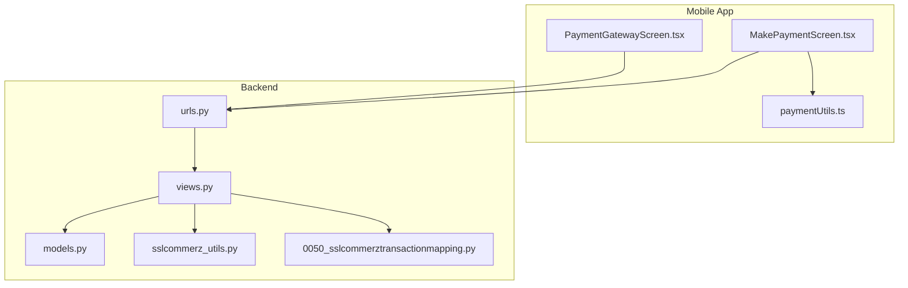
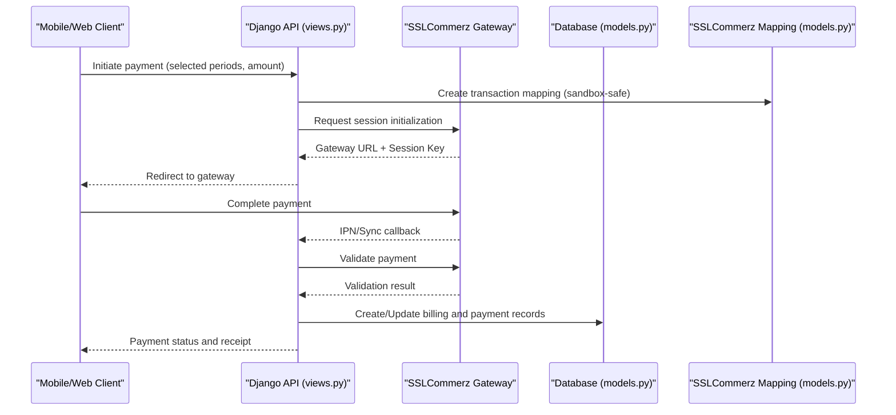
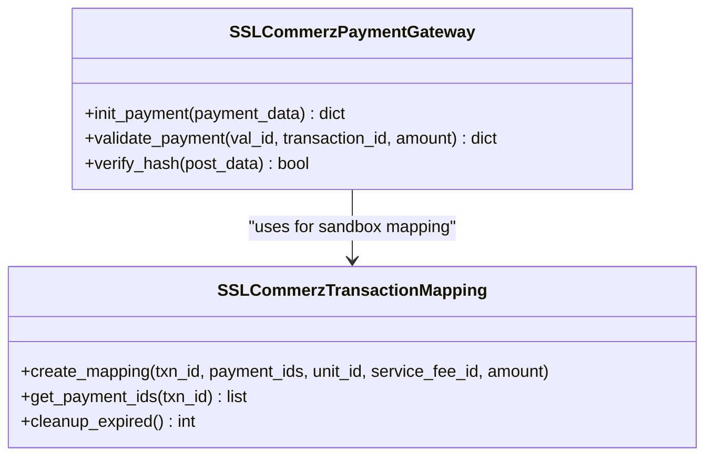
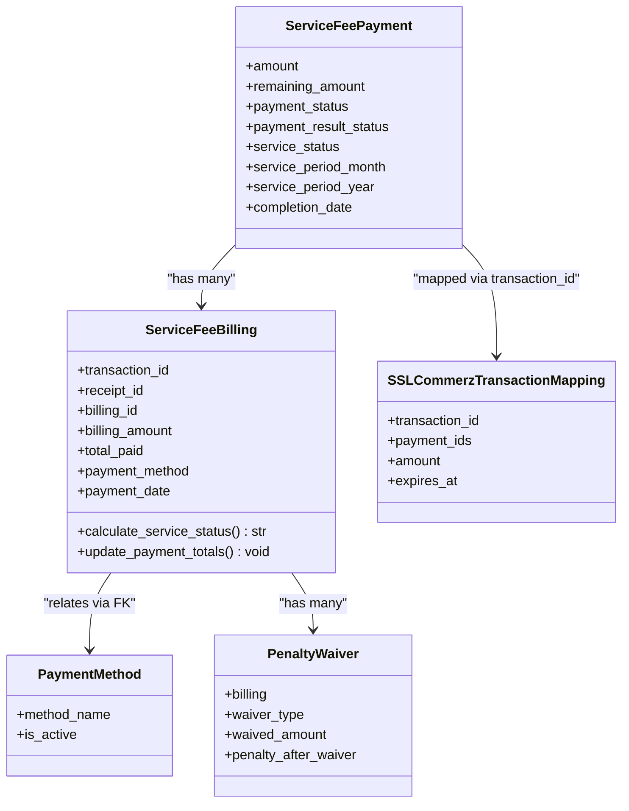
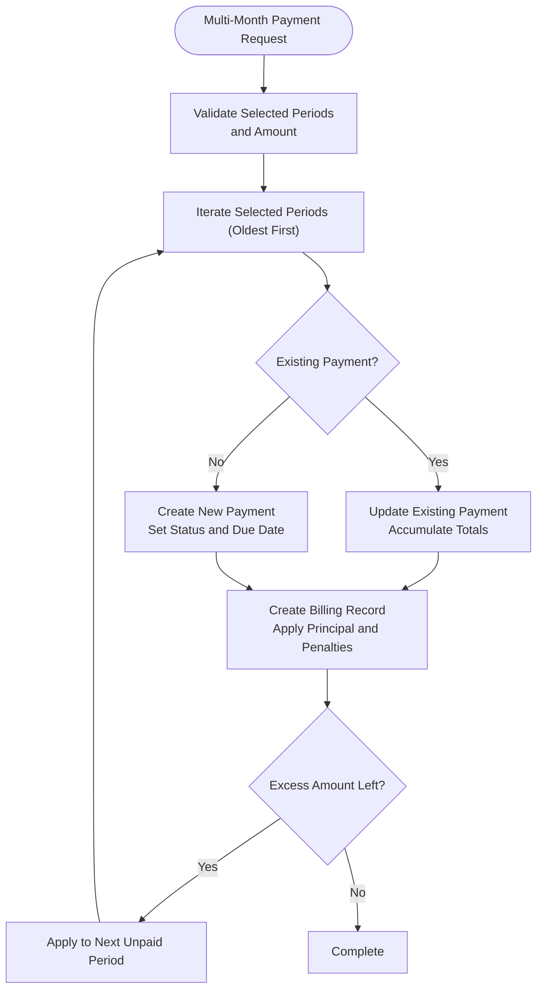
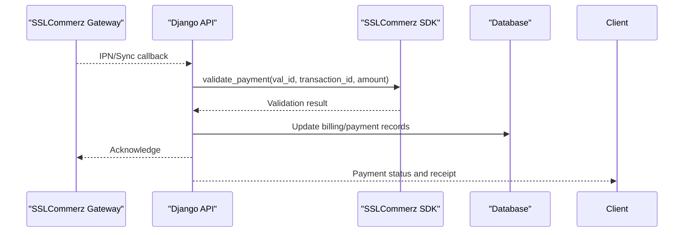
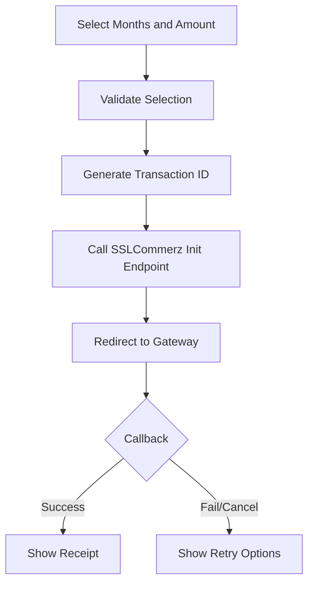
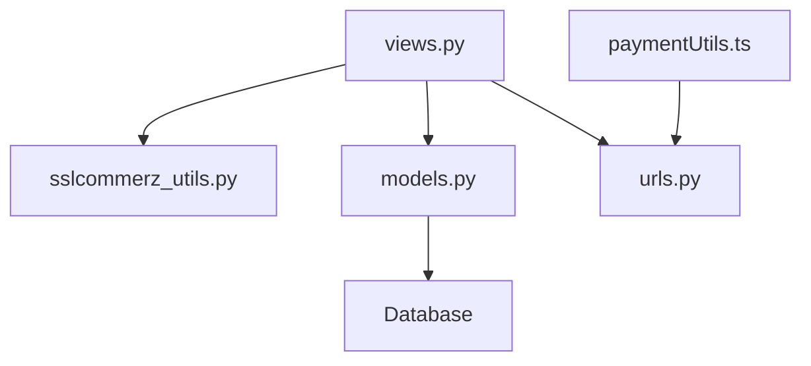

# Payment System Integration

<cite>
**Referenced Files in This Document**
- [sslcommerz_utils.py](file://backend/service_fee_management/utils/sslcommerz_utils.py)
- [models.py](file://backend/service_fee_management/models.py)
- [views.py](file://backend/service_fee_management/views.py)
- [urls.py](file://backend/service_fee_management/urls.py)
- [paymentUtils.ts](file://Estate_link_App/src/utils/paymentUtils.ts)
- [0050_sslcommerztransactionmapping.py](file://backend/service_fee_management/migrations/0050_sslcommerztransactionmapping.py)
</cite>

## Table of Contents
1. [Introduction](#introduction)
2. [Project Structure](#project-structure)
3. [Core Components](#core-components)
4. [Architecture Overview](#architecture-overview)
5. [Detailed Component Analysis](#detailed-component-analysis)
6. [Dependency Analysis](#dependency-analysis)
7. [Performance Considerations](#performance-considerations)
8. [Troubleshooting Guide](#troubleshooting-guide)
9. [Conclusion](#conclusion)

## Introduction
This document provides comprehensive documentation for the payment processing system integration with SSLCommerz within the estate-link platform. It covers SSLCommerz configuration, transaction flow, security implementation, payment lifecycle (including partial payments, reminders, and penalties), payment history tracking, receipt generation, refunds, error handling, retry mechanisms, fraud prevention, reconciliation, reporting, audit trails, and both mobile and web payment experiences.

## Project Structure
The payment system spans backend Django services and a React Native mobile application:
- Backend: SSLCommerz utilities, payment models, views, and URL routing
- Frontend: Payment utilities and screens for initiating and managing payments
- Migrations: SSLCommerz transaction mapping for sandbox and callback handling

**Diagram sources**
- [urls.py](file://backend/service_fee_management/urls.py#L128-L135)
- [views.py](file://backend/service_fee_management/views.py#L1278-L1599)
- [models.py](file://backend/service_fee_management/models.py#L882-L944)
- [sslcommerz_utils.py](file://backend/service_fee_management/utils/sslcommerz_utils.py#L20-L336)
- [paymentUtils.ts](file://Estate_link_App/src/utils/paymentUtils.ts#L1-L328)

**Section sources**
- [urls.py](file://backend/service_fee_management/urls.py#L1-L152)

## Core Components
- SSLCommerz Payment Gateway Integration: Provides initialization, validation, and hash verification for SSLCommerz transactions.
- Payment Models: Define billing records, payment transactions, payment methods, penalty waivers, and SSLCommerz transaction mapping.
- Payment Views: Handle multi-month payments, payment creation/update, and SSLCommerz callback endpoints.
- Frontend Payment Utilities: Manage payment selection, validation, and transaction ID generation for mobile/web experiences.

Key capabilities:
- Multi-month payment distribution with partial payments
- Receipt generation and email delivery
- Penalty calculation and waiver management
- Reminder automation and audit trails
- SSLCommerz sandbox-safe transaction mapping

**Section sources**
- [sslcommerz_utils.py](file://backend/service_fee_management/utils/sslcommerz_utils.py#L20-L336)
- [models.py](file://backend/service_fee_management/models.py#L11-L122)
- [models.py](file://backend/service_fee_management/models.py#L168-L188)
- [models.py](file://backend/service_fee_management/models.py#L190-L340)
- [models.py](file://backend/service_fee_management/models.py#L882-L944)
- [views.py](file://backend/service_fee_management/views.py#L1278-L1599)
- [paymentUtils.ts](file://Estate_link_App/src/utils/paymentUtils.ts#L1-L328)

## Architecture Overview
The payment system integrates the mobile app with backend services to orchestrate SSLCommerz transactions, manage partial payments, apply penalties, and maintain audit trails.

**Diagram sources**
- [views.py](file://backend/service_fee_management/views.py#L1278-L1599)
- [sslcommerz_utils.py](file://backend/service_fee_management/utils/sslcommerz_utils.py#L52-L162)
- [sslcommerz_utils.py](file://backend/service_fee_management/utils/sslcommerz_utils.py#L164-L266)
- [models.py](file://backend/service_fee_management/models.py#L882-L944)

## Detailed Component Analysis

### SSLCommerz Payment Gateway Integration
The SSLCommerz integration encapsulates:
- Initialization: Builds request payload, mounts HTTP adapter with retry/backoff, and posts to session API.
- Validation: Calls validation API, verifies transaction ID and amount, and checks risk indicators.
- Hash Verification: Validates SSLCommerz callback signatures using MD5 hashing with store password and verify key.

Security and reliability:
- Connection pooling and retry strategy for gateway calls
- Timeout constraints for fast responses
- Amount and transaction ID verification
- Hash verification to prevent tampering

**Diagram sources**
- [sslcommerz_utils.py](file://backend/service_fee_management/utils/sslcommerz_utils.py#L20-L336)
- [models.py](file://backend/service_fee_management/models.py#L882-L944)

**Section sources**
- [sslcommerz_utils.py](file://backend/service_fee_management/utils/sslcommerz_utils.py#L20-L336)
- [models.py](file://backend/service_fee_management/models.py#L882-L944)

### Payment Models and Lifecycle
Core models:
- ServiceFeeBilling: Stores billing records, transaction/receipt IDs, payment method, amounts, and audit fields.
- ServiceFeePayment: Represents individual payment transactions with status, result status, and service status.
- PaymentMethod: Enumerates available payment methods including SSLCommerz.
- PenaltyWaiver: Tracks penalty waivers per billing record.
- SSLCommerzTransactionMapping: Temporary mapping for SSLCommerz transactions (especially sandbox).

Lifecycle highlights:
- Partial payments: Multiple billing records per payment enable partial payments across months.
- Service status calculation: Based on total paid vs billing amount.
- Multi-month payments: Distribute a single payment across multiple periods with automatic clearing logic.

**Diagram sources**
- [models.py](file://backend/service_fee_management/models.py#L11-L122)
- [models.py](file://backend/service_fee_management/models.py#L168-L188)
- [models.py](file://backend/service_fee_management/models.py#L190-L340)
- [models.py](file://backend/service_fee_management/models.py#L882-L944)

**Section sources**
- [models.py](file://backend/service_fee_management/models.py#L11-L122)
- [models.py](file://backend/service_fee_management/models.py#L168-L188)
- [models.py](file://backend/service_fee_management/models.py#L190-L340)
- [models.py](file://backend/service_fee_management/models.py#L882-L944)

### Multi-Month Payment Processing
The backend supports multi-month payments with:
- Selection of multiple unpaid periods
- Distribution of payment amounts across periods
- Automatic clearing of principal and penalties
- Handling of excess payments and partial payments
- Creation of billing records per transaction

**Diagram sources**
- [views.py](file://backend/service_fee_management/views.py#L1278-L1599)

**Section sources**
- [views.py](file://backend/service_fee_management/views.py#L1278-L1599)

### SSLCommerz Callback and Validation Flow
The backend exposes SSLCommerz endpoints:
- Init: Creates transaction mapping and redirects to gateway
- Success/Fail/Cancel/IPN: Processes callbacks, validates with gateway, updates payment status, and generates receipts

**Diagram sources**
- [sslcommerz_utils.py](file://backend/service_fee_management/utils/sslcommerz_utils.py#L164-L266)
- [views.py](file://backend/service_fee_management/views.py#L1278-L1599)

**Section sources**
- [sslcommerz_utils.py](file://backend/service_fee_management/utils/sslcommerz_utils.py#L164-L266)
- [views.py](file://backend/service_fee_management/views.py#L1278-L1599)

### Frontend Payment Experience
The mobile app provides:
- Payment selection utilities for multi-month distributions
- Transaction ID generation
- Payment initiation to backend endpoints
- Gateway screen handling success/failure/cancel scenarios

**Diagram sources**
- [paymentUtils.ts](file://Estate_link_App/src/utils/paymentUtils.ts#L180-L230)
- [paymentUtils.ts](file://Estate_link_App/src/utils/paymentUtils.ts#L306-L310)

**Section sources**
- [paymentUtils.ts](file://Estate_link_App/src/utils/paymentUtils.ts#L1-L328)

## Dependency Analysis
- Backend depends on SSLCommerz SDK for gateway communication and local models for persistence.
- SSLCommerzTransactionMapping bridges sandbox limitations by maintaining server-side mapping.
- Multi-month payments depend on ServiceFeeBilling and ServiceFeePayment relationships.
- Email receipts depend on email utilities and payment serializers.

**Diagram sources**
- [views.py](file://backend/service_fee_management/views.py#L1278-L1599)
- [sslcommerz_utils.py](file://backend/service_fee_management/utils/sslcommerz_utils.py#L20-L336)
- [models.py](file://backend/service_fee_management/models.py#L11-L122)
- [urls.py](file://backend/service_fee_management/urls.py#L128-L135)
- [paymentUtils.ts](file://Estate_link_App/src/utils/paymentUtils.ts#L1-L328)

**Section sources**
- [views.py](file://backend/service_fee_management/views.py#L1278-L1599)
- [sslcommerz_utils.py](file://backend/service_fee_management/utils/sslcommerz_utils.py#L20-L336)
- [models.py](file://backend/service_fee_management/models.py#L11-L122)
- [urls.py](file://backend/service_fee_management/urls.py#L128-L135)
- [paymentUtils.ts](file://Estate_link_App/src/utils/paymentUtils.ts#L1-L328)

## Performance Considerations
- Connection pooling and retry strategy reduce gateway latency and improve resilience.
- Atomic transactions for multi-month payments prevent partial saves and inconsistencies.
- Efficient queries and pre-fetching minimize response times for payment lists and histories.
- Sandbox mapping expiration prevents stale mappings from accumulating.

## Troubleshooting Guide
Common issues and resolutions:
- Amount mismatch during validation: Verify gateway response amount and expected amount tolerance.
- Transaction ID mismatch: Ensure SSLCommerz returns the same transaction ID used in initialization.
- Hash verification failure: Confirm verify_sign and verify_key presence and MD5 hash computation.
- Sandbox callback discrepancies: Use SSLCommerzTransactionMapping to resolve missing value_a/b/c fields.
- Multi-month payment overflow: Excess payments are carried forward to next unpaid period; review remaining amounts.
- Email receipt failures: Email sending is best-effort; backend continues payment processing.

**Section sources**
- [sslcommerz_utils.py](file://backend/service_fee_management/utils/sslcommerz_utils.py#L164-L266)
- [sslcommerz_utils.py](file://backend/service_fee_management/utils/sslcommerz_utils.py#L268-L299)
- [models.py](file://backend/service_fee_management/models.py#L938-L943)

## Conclusion
The payment system integrates SSLCommerz securely and efficiently, supporting multi-month payments, partial settlements, penalties, and comprehensive audit trails. The backend’s robust validation, sandbox-safe mapping, and atomic transaction handling ensure reliability, while the frontend utilities streamline the user experience across mobile and web platforms.