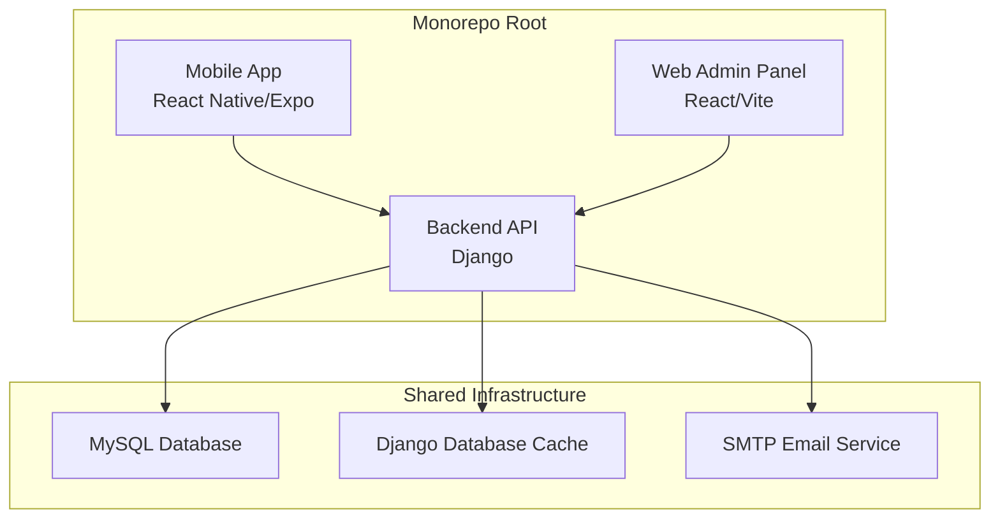
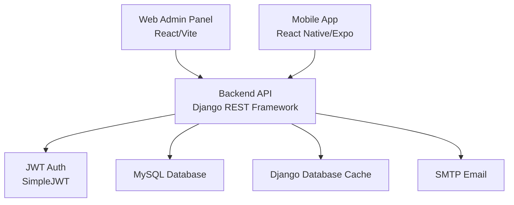
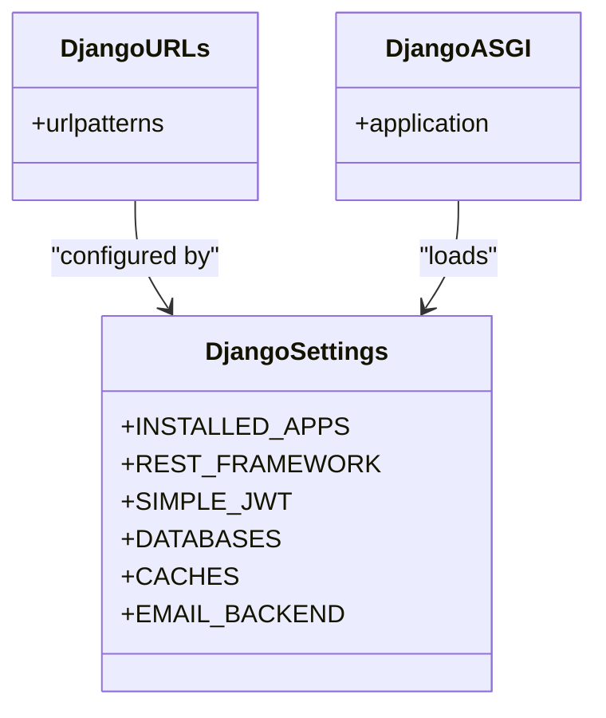
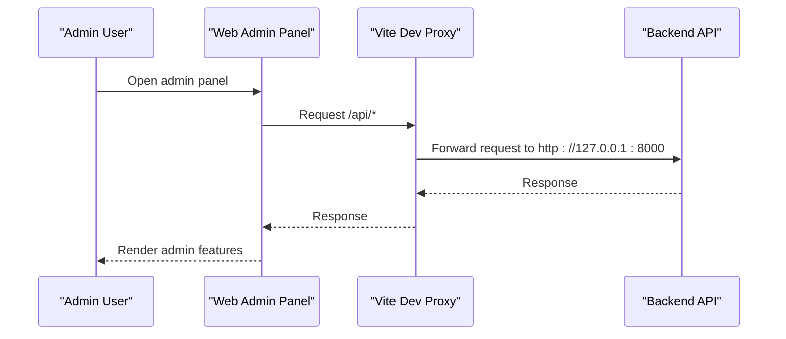
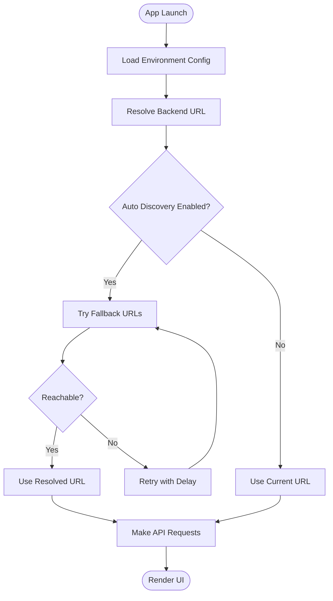
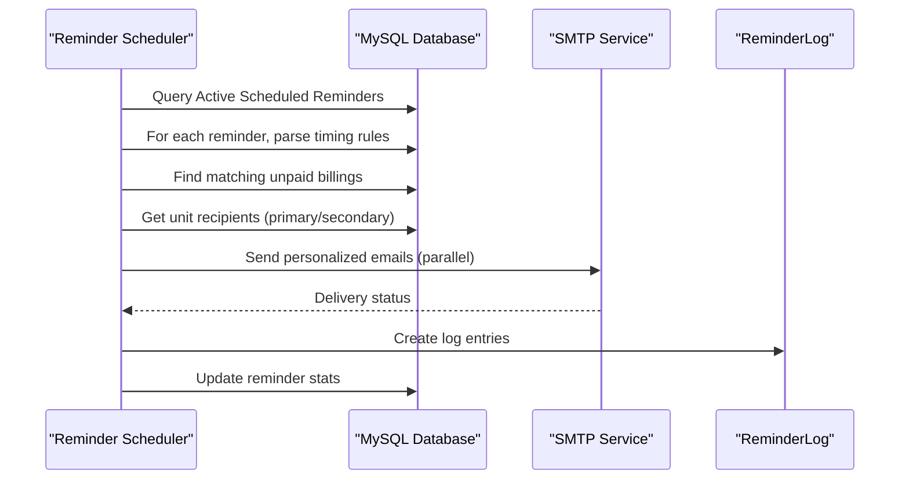
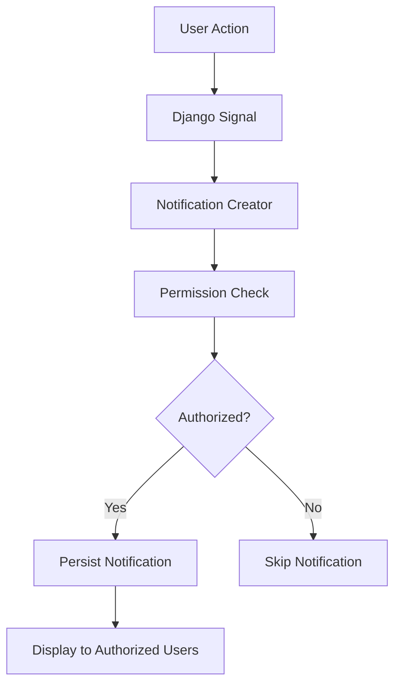
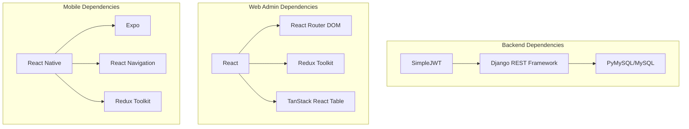

# Project Overview

<cite>
**Referenced Files in This Document**
- [landing-page.html](file://landing-page.html)
- [backend/requirements.txt](file://backend/requirements.txt)
- [Estate_link_App/package.json](file://Estate_link_App/package.json)
- [frontend/package.json](file://frontend/package.json)
- [backend/manage.py](file://backend/manage.py)
- [backend/backend/settings.py](file://backend/backend/settings.py)
- [backend/backend/urls.py](file://backend/backend/urls.py)
- [Estate_link_App/app.json](file://Estate_link_App/app.json)
- [frontend/vite.config.js](file://frontend/vite.config.js)
- [backend/IMPLEMENTATION_SUMMARY.md](file://backend/IMPLEMENTATION_SUMMARY.md)
- [backend/service_fee_management/ARCHITECTURE_DIAGRAM.md](file://backend/service_fee_management/ARCHITECTURE_DIAGRAM.md)
- [Estate_link_App/src/config/environment.ts](file://Estate_link_App/src/config/environment.ts)
- [frontend/src/config/modernLoadingConfig.js](file://frontend/src/config/modernLoadingConfig.js)
- [backend/backend/asgi.py](file://backend/backend/asgi.py)
</cite>

## Table of Contents
1. [Introduction](#introduction)
2. [Project Structure](#project-structure)
3. [Core Components](#core-components)
4. [Architecture Overview](#architecture-overview)
5. [Detailed Component Analysis](#detailed-component-analysis)
6. [Dependency Analysis](#dependency-analysis)
7. [Performance Considerations](#performance-considerations)
8. [Troubleshooting Guide](#troubleshooting-guide)
9. [Conclusion](#conclusion)
10. [Appendices](#appendices)

## Introduction
Estate Link is a comprehensive property management and community communication platform designed for residential complexes. It unifies three distinct applications—backend API, web admin panel, and mobile app—into a cohesive ecosystem that streamlines property operations, enhances resident engagement, and automates financial workflows.

The platform’s core value proposition centers on:
- Unified property management: centralizing member, tower/unit, financial, and communication data
- Real-time community engagement: announcements, notices, bulletins, and notifications
- Automated financial lifecycle: service fee generation, reminders, and payment processing
- Secure, scalable infrastructure: robust backend APIs, admin controls, and resilient client experiences

Target users include property managers, administrators, and residents who benefit from streamlined operations, transparent communication, and efficient financial management.

Key differentiators:
- Integrated three-application architecture with shared backend services
- Permission-driven notifications and granular access controls
- Automated service fee scheduling and reminder system with email delivery
- Monorepo structure enabling synchronized development and deployment

## Project Structure
The repository follows a monorepo layout with three primary applications:
- Backend API (Django): Provides REST endpoints, authentication, scheduling, notifications, and data models
- Web Admin Panel (React/Vite): Offers administrative controls for property management, member administration, financial oversight, and system configuration
- Mobile App (React Native/Expo): Delivers a native-like experience for residents to access announcements, notices, bulletins, payments, and profile management

**Diagram sources**
- [backend/backend/urls.py](file://backend/backend/urls.py#L36-L55)
- [backend/backend/settings.py](file://backend/backend/settings.py#L169-L197)
- [backend/backend/settings.py](file://backend/backend/settings.py#L201-L207)
- [backend/backend/settings.py](file://backend/backend/settings.py#L261-L267)

**Section sources**
- [backend/backend/urls.py](file://backend/backend/urls.py#L36-L55)
- [backend/backend/settings.py](file://backend/backend/settings.py#L169-L197)
- [backend/backend/settings.py](file://backend/backend/settings.py#L201-L207)
- [backend/backend/settings.py](file://backend/backend/settings.py#L261-L267)

## Core Components
- Backend API (Django)
  - Authentication: JWT-based authentication with refresh token rotation
  - CORS: Enabled for cross-origin access from admin and mobile clients
  - Databases: MySQL for persistent data; Django database cache for OTP and rate limiting
  - Email: SMTP configuration for transactional notifications
  - Scheduling: Background scheduler for service fee reminders and related tasks
  - Apps: Modular Django apps covering user management, groups/roles, towers/units, announcements, bulletins, notices, service fees, accounting, contacts, company settings, and notifications

- Web Admin Panel (React/Vite)
  - Development proxy to backend API at http://127.0.0.1:8000
  - Feature-rich admin interface for managing members, towers, units, financial entries, and system configurations
  - Redux Toolkit for state management and TanStack React Table for advanced data grids

- Mobile App (React Native/Expo)
  - Multi-platform support (iOS, Android, Web) via Expo
  - Environment-aware backend URL configuration with fallbacks and auto-discovery
  - Comprehensive UI components for announcements, notices, bulletins, service fee payments, and profile management

**Section sources**
- [backend/backend/settings.py](file://backend/backend/settings.py#L95-L99)
- [backend/backend/settings.py](file://backend/backend/settings.py#L101-L138)
- [backend/backend/settings.py](file://backend/backend/settings.py#L169-L197)
- [backend/backend/settings.py](file://backend/backend/settings.py#L201-L207)
- [backend/backend/settings.py](file://backend/backend/settings.py#L261-L267)
- [frontend/vite.config.js](file://frontend/vite.config.js#L35-L43)
- [Estate_link_App/src/config/environment.ts](file://Estate_link_App/src/config/environment.ts#L4-L34)
- [Estate_link_App/app.json](file://Estate_link_App/app.json#L1-L66)

## Architecture Overview
The system architecture is centered around a Django backend that exposes REST APIs consumed by both the web admin panel and the mobile app. The backend integrates with a MySQL database, a Django database cache, and an SMTP email service. The web admin panel proxies API requests to the backend during development, while the mobile app dynamically resolves backend endpoints with fallbacks.

**Diagram sources**
- [backend/backend/urls.py](file://backend/backend/urls.py#L36-L55)
- [backend/backend/settings.py](file://backend/backend/settings.py#L95-L99)
- [backend/backend/settings.py](file://backend/backend/settings.py#L101-L138)
- [backend/backend/settings.py](file://backend/backend/settings.py#L169-L197)
- [backend/backend/settings.py](file://backend/backend/settings.py#L201-L207)
- [backend/backend/settings.py](file://backend/backend/settings.py#L261-L267)
- [frontend/vite.config.js](file://frontend/vite.config.js#L35-L43)

## Detailed Component Analysis

### Backend API (Django)
- Purpose: Centralized data and business logic provider
- Authentication: JWT tokens with access/refresh lifetimes and rotation
- CORS: Enabled for development and production domains
- Databases: MySQL with UTF-8mb4 charset and strict SQL mode
- Caching: Database-backed cache for OTP and rate limiting
- Email: SMTP configuration for notifications
- Scheduling: Background scheduler for service fee reminders and related tasks

**Diagram sources**
- [backend/backend/settings.py](file://backend/backend/settings.py#L53-L78)
- [backend/backend/settings.py](file://backend/backend/settings.py#L95-L138)
- [backend/backend/settings.py](file://backend/backend/settings.py#L169-L197)
- [backend/backend/settings.py](file://backend/backend/settings.py#L201-L207)
- [backend/backend/settings.py](file://backend/backend/settings.py#L261-L267)
- [backend/backend/urls.py](file://backend/backend/urls.py#L36-L55)
- [backend/backend/asgi.py](file://backend/backend/asgi.py#L10-L16)

**Section sources**
- [backend/backend/settings.py](file://backend/backend/settings.py#L53-L78)
- [backend/backend/settings.py](file://backend/backend/settings.py#L95-L138)
- [backend/backend/settings.py](file://backend/backend/settings.py#L169-L197)
- [backend/backend/settings.py](file://backend/backend/settings.py#L201-L207)
- [backend/backend/settings.py](file://backend/backend/settings.py#L261-L267)
- [backend/backend/urls.py](file://backend/backend/urls.py#L36-L55)
- [backend/backend/asgi.py](file://backend/backend/asgi.py#L10-L16)

### Web Admin Panel (React/Vite)
- Purpose: Administrative interface for property managers and administrators
- Development: Vite dev server with proxy to backend API
- State management: Redux Toolkit
- Data grids: TanStack React Table
- Routing: React Router DOM

**Diagram sources**
- [frontend/vite.config.js](file://frontend/vite.config.js#L35-L43)
- [backend/backend/urls.py](file://backend/backend/urls.py#L36-L55)

**Section sources**
- [frontend/vite.config.js](file://frontend/vite.config.js#L35-L43)
- [backend/backend/urls.py](file://backend/backend/urls.py#L36-L55)

### Mobile App (React Native/Expo)
- Purpose: Resident-facing application for announcements, notices, bulletins, payments, and profile management
- Environment configuration: Dynamic backend URL resolution with fallbacks and auto-discovery
- Permissions: Android permissions for internet and boot completion
- Notifications: Expo notifications plugin configured

**Diagram sources**
- [Estate_link_App/src/config/environment.ts](file://Estate_link_App/src/config/environment.ts#L4-L34)
- [Estate_link_App/src/config/environment.ts](file://Estate_link_App/src/config/environment.ts#L46-L84)

**Section sources**
- [Estate_link_App/src/config/environment.ts](file://Estate_link_App/src/config/environment.ts#L4-L34)
- [Estate_link_App/src/config/environment.ts](file://Estate_link_App/src/config/environment.ts#L46-L84)
- [Estate_link_App/app.json](file://Estate_link_App/app.json#L53-L63)

### Service Fee Management and Reminder Scheduler
- Purpose: Automate service fee generation, reminders, and email notifications
- Scheduler: Daemon thread running every 5 minutes to process scheduled reminders
- Threading model: Parallel email sending per billing with duplicate prevention
- Database flow: Reminder → Matching billings → Unit recipients → ReminderLog

**Diagram sources**
- [backend/service_fee_management/ARCHITECTURE_DIAGRAM.md](file://backend/service_fee_management/ARCHITECTURE_DIAGRAM.md#L18-L138)
- [backend/service_fee_management/ARCHITECTURE_DIAGRAM.md](file://backend/service_fee_management/ARCHITECTURE_DIAGRAM.md#L280-L322)

**Section sources**
- [backend/service_fee_management/ARCHITECTURE_DIAGRAM.md](file://backend/service_fee_management/ARCHITECTURE_DIAGRAM.md#L1-L396)

### Permission-Based Notifications
- Purpose: Enforce strict permission-based visibility for organization member notifications
- Implementation: Signals trigger notification creation with dual-layer permission checks
- Security: Non-retroactive, no information leakage, self-exclusion for affected members

**Diagram sources**
- [backend/IMPLEMENTATION_SUMMARY.md](file://backend/IMPLEMENTATION_SUMMARY.md#L68-L82)

**Section sources**
- [backend/IMPLEMENTATION_SUMMARY.md](file://backend/IMPLEMENTATION_SUMMARY.md#L1-L187)

## Dependency Analysis
Technology stack summary:
- Backend API: Django 5.2.7, Django REST Framework 3.15.2, SimpleJWT 5.4.0, PyMySQL 1.1.2, MySQL 8.x
- Web Admin Panel: React 18.3.1, React Router DOM 7.1.1, Redux Toolkit 2.5.0, TanStack React Table 8.21.3, Axios 1.7.9
- Mobile App: React 19.1.0, React Native 0.81.4, Expo 54.0.8, React Navigation 7.x, Redux Toolkit 2.2.1

**Diagram sources**
- [backend/requirements.txt](file://backend/requirements.txt#L6-L31)
- [frontend/package.json](file://frontend/package.json#L15-L43)
- [Estate_link_App/package.json](file://Estate_link_App/package.json#L22-L69)

**Section sources**
- [backend/requirements.txt](file://backend/requirements.txt#L1-L31)
- [frontend/package.json](file://frontend/package.json#L15-L43)
- [Estate_link_App/package.json](file://Estate_link_App/package.json#L22-L69)

## Performance Considerations
- Backend
  - Database cache reduces repeated computations and supports OTP/rate-limiting across workers
  - Strict SQL mode and UTF-8mb4 charset improve data integrity and internationalization
  - CORS enabled for seamless cross-origin access from admin and mobile clients
- Web Admin Panel
  - Vite dev proxy simplifies development workflow; production builds optimize assets
  - TanStack React Table enables efficient rendering of large datasets
- Mobile App
  - Environment-aware backend URL resolution with retry attempts and auto-discovery
  - Network check intervals tuned per environment for responsiveness vs. battery usage

[No sources needed since this section provides general guidance]

## Troubleshooting Guide
- Backend startup and management
  - Use the Django management script to run administrative tasks and start the development server
- Environment configuration
  - Adjust environment-specific backend URLs, timeouts, and retry attempts in the mobile app configuration
  - Toggle auto-discovery and network check intervals based on deployment environment
- Development proxy
  - Ensure the Vite dev server proxy targets the correct backend address during development

**Section sources**
- [backend/manage.py](file://backend/manage.py#L7-L18)
- [Estate_link_App/src/config/environment.ts](file://Estate_link_App/src/config/environment.ts#L4-L34)
- [Estate_link_App/src/config/environment.ts](file://Estate_link_App/src/config/environment.ts#L46-L84)
- [frontend/vite.config.js](file://frontend/vite.config.js#L35-L43)

## Conclusion
Estate Link delivers a unified, scalable property management solution through its three-application architecture. The backend API provides robust data services and automation, the web admin panel offers powerful administrative controls, and the mobile app ensures resident accessibility. Together, they create a cohesive platform that improves operational efficiency, enhances communication, and streamlines financial management for residential complexes.

[No sources needed since this section summarizes without analyzing specific files]

## Appendices
- Deployment considerations
  - Backend: Configure production domains, secure secrets, and environment-specific database/cache/email settings
  - Web Admin Panel: Build and serve optimized assets behind a reverse proxy
  - Mobile App: Configure app identifiers, permissions, and backend URL for production environments

**Section sources**
- [backend/backend/settings.py](file://backend/backend/settings.py#L34-L48)
- [backend/backend/settings.py](file://backend/backend/settings.py#L261-L267)
- [Estate_link_App/app.json](file://Estate_link_App/app.json#L49-L63)