# Backend Testing Framework

<cite>
**Referenced Files in This Document**
- [manage.py](file://backend/manage.py)
- [settings.py](file://backend/backend/settings.py)
- [requirements.txt](file://backend/requirements.txt)
- [run_test.sh](file://backend/run_test.sh)
- [setup_test_env.sh](file://backend/setup_test_env.sh)
- [TEST_RESULTS.md](file://backend/TEST_RESULTS.md)
- [test_new_member_retroactive_notifications.py](file://backend/test_new_member_retroactive_notifications.py)
- [audit_trail/tests.py](file://backend/audit_trail/tests.py)
- [bill_categories/tests.py](file://backend/bill_categories/tests.py)
- [bulletins/tests.py](file://backend/bulletins/tests.py)
- [service_fee/tests.py](file://backend/service_fee/tests.py)
- [service_fee_management/tests/test_payment_system.py](file://backend/service_fee_management/tests/test_payment_system.py)
</cite>

## Table of Contents
1. [Introduction](#introduction)
2. [Project Structure](#project-structure)
3. [Core Components](#core-components)
4. [Architecture Overview](#architecture-overview)
5. [Detailed Component Analysis](#detailed-component-analysis)
6. [Dependency Analysis](#dependency-analysis)
7. [Performance Considerations](#performance-considerations)
8. [Troubleshooting Guide](#troubleshooting-guide)
9. [Conclusion](#conclusion)
10. [Appendices](#appendices)

## Introduction
This document describes the backend testing framework for the Estate Link project. It covers Django testing architecture, test discovery mechanisms, and execution workflows. It explains unit testing patterns for Django models, views, and serializers, and documents integration testing strategies for API endpoints, database operations, and external service integrations. It also details test configuration, fixtures, and test data management, along with mocking strategies, database transaction handling, and isolation techniques. Finally, it outlines performance testing approaches, security testing methodologies, and continuous integration setup for backend tests.

## Project Structure
The backend is organized as a Django project with multiple Django apps. Tests are primarily located within each app’s tests.py file or a dedicated tests directory. A centralized test runner script and environment setup scripts support ad-hoc and CI-style test execution.

Key testing-related locations:
- Django project entry point and test runner: [manage.py](file://backend/manage.py)
- Django settings for test execution and environment: [settings.py](file://backend/backend/settings.py)
- Test execution scripts: [run_test.sh](file://backend/run_test.sh), [setup_test_env.sh](file://backend/setup_test_env.sh)
- Test documentation and results: [TEST_RESULTS.md](file://backend/TEST_RESULTS.md)
- Ad-hoc test script for retroactive notifications: [test_new_member_retroactive_notifications.py](file://backend/test_new_member_retroactive_notifications.py)
- App-level test modules:
  - [audit_trail/tests.py](file://backend/audit_trail/tests.py)
  - [bill_categories/tests.py](file://backend/bill_categories/tests.py)
  - [bulletins/tests.py](file://backend/bulletins/tests.py)
  - [service_fee/tests.py](file://backend/service_fee/tests.py)
  - [service_fee_management/tests/test_payment_system.py](file://backend/service_fee_management/tests/test_payment_system.py)

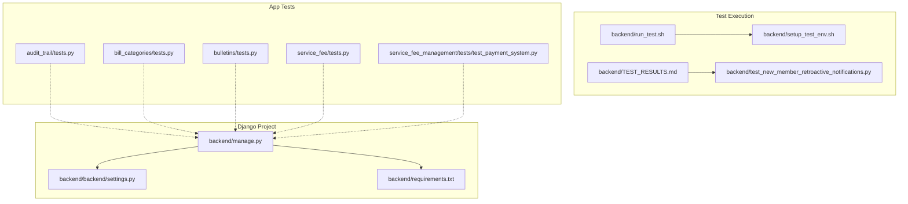

**Diagram sources**
- [manage.py](file://backend/manage.py#L1-L23)
- [settings.py](file://backend/backend/settings.py#L1-L286)
- [requirements.txt](file://backend/requirements.txt#L1-L31)
- [run_test.sh](file://backend/run_test.sh#L1-L15)
- [setup_test_env.sh](file://backend/setup_test_env.sh#L1-L39)
- [TEST_RESULTS.md](file://backend/TEST_RESULTS.md#L1-L114)
- [test_new_member_retroactive_notifications.py](file://backend/test_new_member_retroactive_notifications.py#L1-L432)
- [audit_trail/tests.py](file://backend/audit_trail/tests.py#L1-L4)
- [bill_categories/tests.py](file://backend/bill_categories/tests.py#L1-L144)
- [bulletins/tests.py](file://backend/bulletins/tests.py#L1-L4)
- [service_fee/tests.py](file://backend/service_fee/tests.py#L1-L338)
- [service_fee_management/tests/test_payment_system.py](file://backend/service_fee_management/tests/test_payment_system.py#L1-L612)

**Section sources**
- [manage.py](file://backend/manage.py#L1-L23)
- [settings.py](file://backend/backend/settings.py#L1-L286)
- [requirements.txt](file://backend/requirements.txt#L1-L31)
- [run_test.sh](file://backend/run_test.sh#L1-L15)
- [setup_test_env.sh](file://backend/setup_test_env.sh#L1-L39)
- [TEST_RESULTS.md](file://backend/TEST_RESULTS.md#L1-L114)
- [test_new_member_retroactive_notifications.py](file://backend/test_new_member_retroactive_notifications.py#L1-L432)
- [audit_trail/tests.py](file://backend/audit_trail/tests.py#L1-L4)
- [bill_categories/tests.py](file://backend/bill_categories/tests.py#L1-L144)
- [bulletins/tests.py](file://backend/bulletins/tests.py#L1-L4)
- [service_fee/tests.py](file://backend/service_fee/tests.py#L1-L338)
- [service_fee_management/tests/test_payment_system.py](file://backend/service_fee_management/tests/test_payment_system.py#L1-L612)

## Core Components
- Django test runner and settings: The Django project defines test execution via the manage.py entry point and centralizes configuration in settings.py. The settings include installed apps, middleware, authentication, JWT configuration, and database configuration suitable for testing.
- Test discovery: Django discovers tests placed under app directories in files named tests.py or within a tests/ directory. Examples include bill_categories/tests.py, service_fee/tests.py, and service_fee_management/tests/test_payment_system.py.
- Test execution scripts: The repository provides a quick-run script (run_test.sh) and an environment setup script (setup_test_env.sh) to bootstrap a virtual environment and run specific test scripts, such as test_new_member_retroactive_notifications.py.
- Ad-hoc test scripts: test_new_member_retroactive_notifications.py demonstrates a standalone test script pattern that bootstraps Django, sets up test data, and validates behavior without relying on Django’s built-in test discovery for that specific scenario.

**Section sources**
- [manage.py](file://backend/manage.py#L1-L23)
- [settings.py](file://backend/backend/settings.py#L53-L78)
- [run_test.sh](file://backend/run_test.sh#L1-L15)
- [setup_test_env.sh](file://backend/setup_test_env.sh#L1-L39)
- [test_new_member_retroactive_notifications.py](file://backend/test_new_member_retroactive_notifications.py#L1-L432)

## Architecture Overview
The testing architecture leverages Django’s built-in testing infrastructure and extends it with:
- Unit tests for models and serializers within app test modules.
- API tests using APITestCase for endpoints.
- Integration tests for payment flows and external service integrations using TransactionTestCase and mocking.
- Ad-hoc scripts for specialized scenarios.

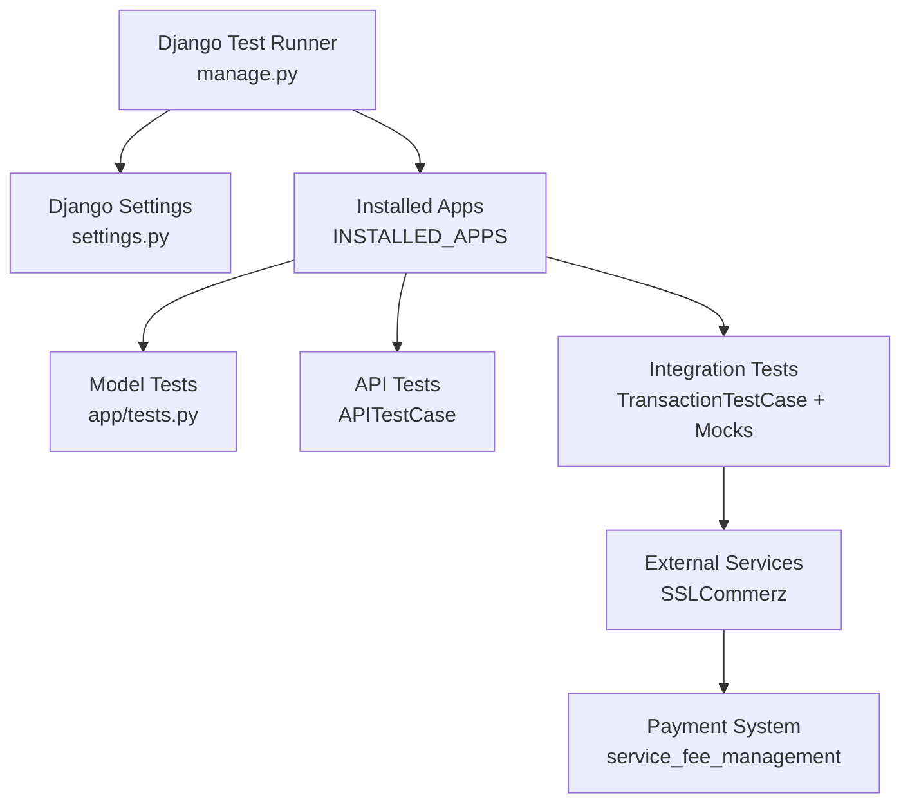

**Diagram sources**
- [manage.py](file://backend/manage.py#L1-L23)
- [settings.py](file://backend/backend/settings.py#L53-L78)
- [bill_categories/tests.py](file://backend/bill_categories/tests.py#L49-L144)
- [service_fee/tests.py](file://backend/service_fee/tests.py#L127-L338)
- [service_fee_management/tests/test_payment_system.py](file://backend/service_fee_management/tests/test_payment_system.py#L205-L314)

## Detailed Component Analysis

### Django Testing Architecture and Discovery
- Test discovery: Django automatically discovers tests in files named tests.py or under a tests/ directory within each app. The INSTALLED_APPS setting includes all relevant apps, ensuring tests are recognized.
- Test runner: manage.py executes Django commands, including test execution. The settings.py file configures databases, authentication, and middleware for test environments.
- Test isolation: Each test module is isolated per app, reducing cross-contamination and enabling targeted execution.

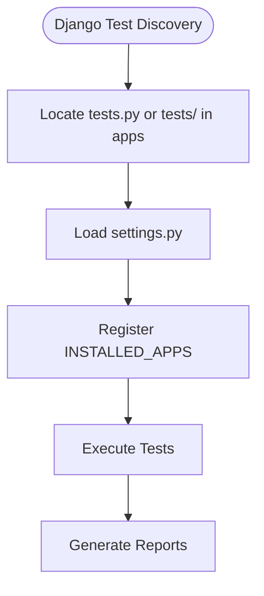

**Diagram sources**
- [manage.py](file://backend/manage.py#L1-L23)
- [settings.py](file://backend/backend/settings.py#L53-L78)

**Section sources**
- [manage.py](file://backend/manage.py#L1-L23)
- [settings.py](file://backend/backend/settings.py#L53-L78)

### Unit Testing Patterns for Models, Views, and Serializers
- Model tests: App test modules validate model behavior, including creation, string representation, defaults, and data normalization. For example, bill_categories/tests.py includes model tests for BillCategory.
- Serializer tests: Tests validate serializer behavior, including validation rules and error handling. The service_fee/tests.py module includes serializer validation tests for MFS accounts.
- View tests: APITestCase is used to test API endpoints, authentication, filtering, and CRUD operations. bill_categories/tests.py and service_fee/tests.py demonstrate API testing patterns.

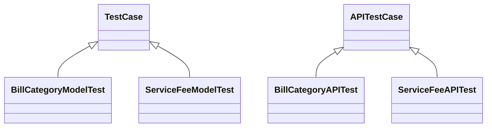

**Diagram sources**
- [bill_categories/tests.py](file://backend/bill_categories/tests.py#L10-L144)
- [service_fee/tests.py](file://backend/service_fee/tests.py#L12-L338)

**Section sources**
- [bill_categories/tests.py](file://backend/bill_categories/tests.py#L10-L144)
- [service_fee/tests.py](file://backend/service_fee/tests.py#L12-L338)

### Integration Testing Strategies for API Endpoints, Database Operations, and External Services
- Payment system integration: service_fee_management/tests/test_payment_system.py includes comprehensive integration tests covering payment eligibility validation, billing record creation, payment completion, and SSLCommerz payment gateway integration. These tests use TransactionTestCase to ensure database transactions are properly handled and patched external services for deterministic behavior.
- SSLCommerz integration: Tests simulate payment initiation and success callbacks, validating that payment statuses update correctly and billing records reflect payment outcomes.
- Mobile app API endpoints: Tests validate endpoints used by the mobile application, ensuring correct serialization and response formats.

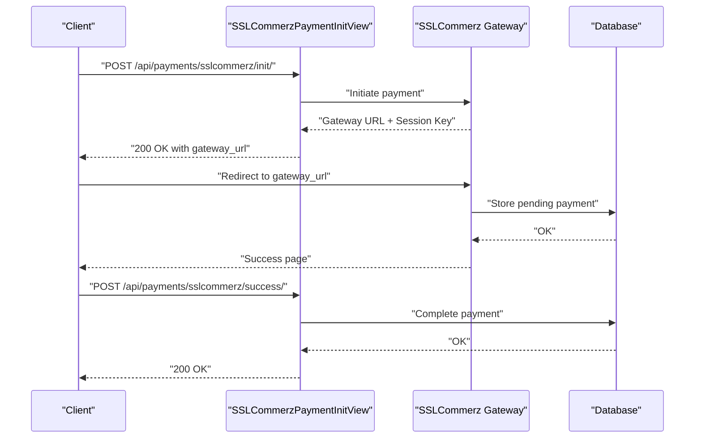

**Diagram sources**
- [service_fee_management/tests/test_payment_system.py](file://backend/service_fee_management/tests/test_payment_system.py#L244-L314)

**Section sources**
- [service_fee_management/tests/test_payment_system.py](file://backend/service_fee_management/tests/test_payment_system.py#L205-L314)

### Test Configuration, Fixtures, and Test Data Management
- Centralized settings: settings.py configures databases, authentication, JWT tokens, CORS, and caches for testing environments.
- Requirements: requirements.txt lists Django and related packages necessary for running tests.
- Environment setup: setup_test_env.sh creates and activates a virtual environment, installs dependencies, and prepares the environment for running tests.
- Ad-hoc test scripts: test_new_member_retroactive_notifications.py demonstrates a pattern for standalone scripts that bootstrap Django, set up test data, and validate behavior. It includes cleanup routines and prints structured results.

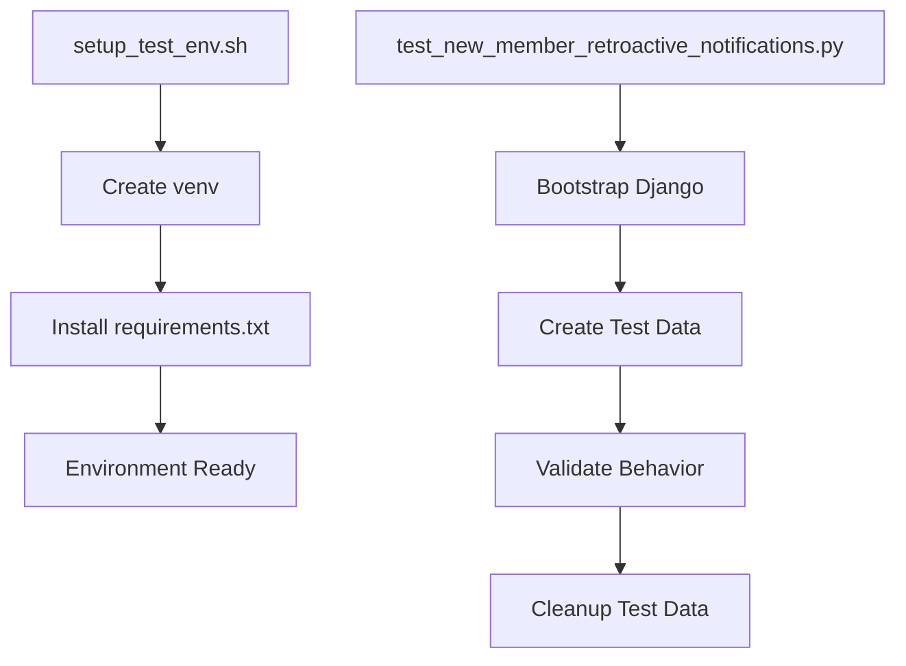

**Diagram sources**
- [setup_test_env.sh](file://backend/setup_test_env.sh#L1-L39)
- [requirements.txt](file://backend/requirements.txt#L1-L31)
- [test_new_member_retroactive_notifications.py](file://backend/test_new_member_retroactive_notifications.py#L57-L75)

**Section sources**
- [settings.py](file://backend/backend/settings.py#L169-L197)
- [requirements.txt](file://backend/requirements.txt#L1-L31)
- [setup_test_env.sh](file://backend/setup_test_env.sh#L1-L39)
- [test_new_member_retroactive_notifications.py](file://backend/test_new_member_retroactive_notifications.py#L57-L75)

### Mocking Strategies for External Dependencies
- External service mocking: service_fee_management/tests/test_payment_system.py uses unittest.mock.patch to mock SSLCommerz gateway interactions, enabling deterministic tests without relying on external systems.
- RequestFactory usage: Tests construct requests programmatically using Django’s RequestFactory to simulate API calls and validate view behavior.

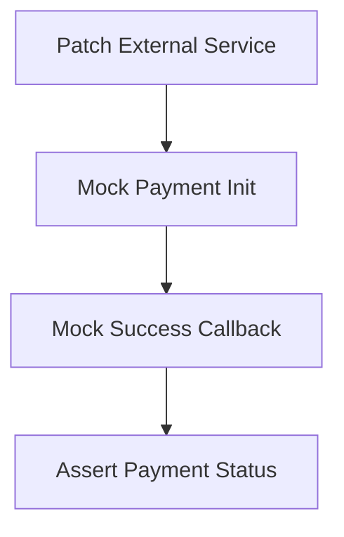

**Diagram sources**
- [service_fee_management/tests/test_payment_system.py](file://backend/service_fee_management/tests/test_payment_system.py#L244-L314)

**Section sources**
- [service_fee_management/tests/test_payment_system.py](file://backend/service_fee_management/tests/test_payment_system.py#L244-L314)

### Database Transaction Handling and Test Isolation
- TransactionTestCase: service_fee_management/tests/test_payment_system.py uses TransactionTestCase for tests requiring transactional behavior and database integrity across test methods.
- Test isolation: Each app’s tests are isolated within their respective modules, minimizing cross-app interference. Ad-hoc scripts include explicit cleanup routines to remove test data.

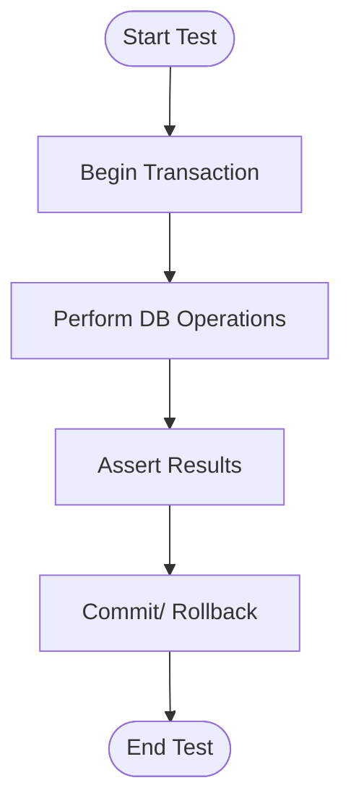

**Diagram sources**
- [service_fee_management/tests/test_payment_system.py](file://backend/service_fee_management/tests/test_payment_system.py#L205-L206)

**Section sources**
- [service_fee_management/tests/test_payment_system.py](file://backend/service_fee_management/tests/test_payment_system.py#L205-L206)
- [test_new_member_retroactive_notifications.py](file://backend/test_new_member_retroactive_notifications.py#L57-L75)

### Security Testing Methodologies
- Authentication and authorization: API tests assert unauthorized access is blocked and that authenticated requests succeed. JWT configuration in settings.py supports secure authentication for API endpoints.
- Token lifecycle: SIMPLE_JWT settings define token lifetimes and refresh policies, ensuring robust authentication testing.

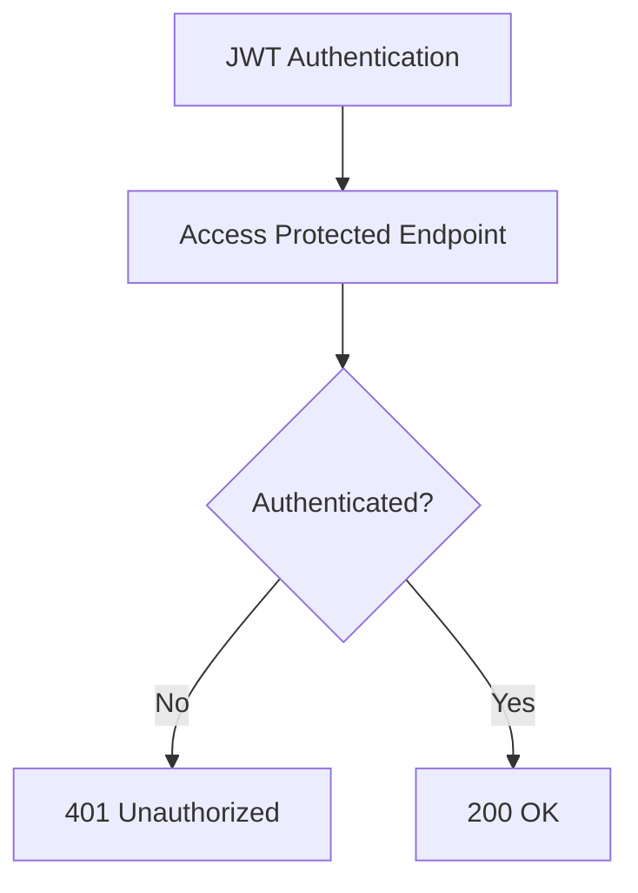

**Diagram sources**
- [settings.py](file://backend/backend/settings.py#L95-L138)
- [bill_categories/tests.py](file://backend/bill_categories/tests.py#L139-L144)

**Section sources**
- [settings.py](file://backend/backend/settings.py#L95-L138)
- [bill_categories/tests.py](file://backend/bill_categories/tests.py#L139-L144)

### Continuous Integration Setup for Backend Tests
- Test runner: manage.py serves as the entry point for running tests in CI environments.
- Environment preparation: setup_test_env.sh automates virtual environment creation and dependency installation.
- Ad-hoc scripts: run_test.sh provides a quick way to execute specific test scripts, useful for CI job steps.

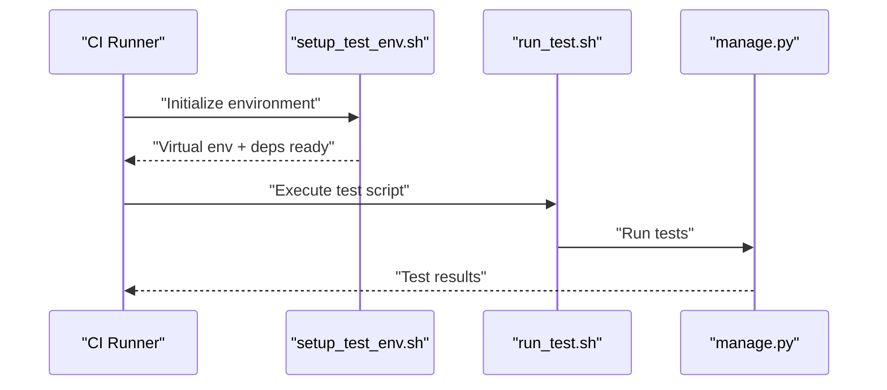

**Diagram sources**
- [run_test.sh](file://backend/run_test.sh#L1-L15)
- [setup_test_env.sh](file://backend/setup_test_env.sh#L1-L39)
- [manage.py](file://backend/manage.py#L1-L23)

**Section sources**
- [run_test.sh](file://backend/run_test.sh#L1-L15)
- [setup_test_env.sh](file://backend/setup_test_env.sh#L1-L39)
- [manage.py](file://backend/manage.py#L1-L23)

## Dependency Analysis
The testing framework relies on Django and DRF for core testing capabilities, with additional dependencies for database connectivity and external services.

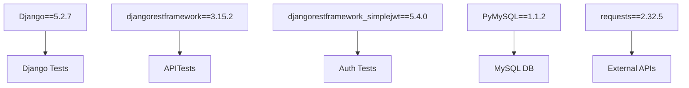

**Diagram sources**
- [requirements.txt](file://backend/requirements.txt#L6-L31)

**Section sources**
- [requirements.txt](file://backend/requirements.txt#L1-L31)

## Performance Considerations
- Use APITestCase judiciously: API tests can be slower due to request overhead; batch related assertions to minimize repeated client calls.
- TransactionTestCase scope: Limit TransactionTestCase usage to tests requiring transactional integrity to avoid unnecessary overhead.
- Mock external services: Prefer mocking for external integrations to reduce flakiness and improve speed.
- Database fixtures: For large datasets, consider using minimal fixtures and cleanup routines to keep tests fast and isolated.

## Troubleshooting Guide
- Virtual environment issues: Use setup_test_env.sh to create and activate a clean environment with dependencies installed.
- Ad-hoc test failures: The retroactive notification test script includes cleanup routines and prints detailed logs; review printed sections and results to identify failures.
- Environment setup: Ensure DJANGO_SETTINGS_MODULE is correctly set when running standalone scripts.

**Section sources**
- [setup_test_env.sh](file://backend/setup_test_env.sh#L1-L39)
- [test_new_member_retroactive_notifications.py](file://backend/test_new_member_retroactive_notifications.py#L416-L428)
- [TEST_RESULTS.md](file://backend/TEST_RESULTS.md#L50-L79)

## Conclusion
The backend testing framework leverages Django’s built-in testing infrastructure with targeted unit and integration tests across models, serializers, and API endpoints. It incorporates transactional testing and mocking for external services, supports ad-hoc scripts for specialized scenarios, and provides environment setup automation for repeatable test execution. By following the patterns outlined here, teams can maintain reliable, isolated, and efficient backend tests.

## Appendices
- Additional test modules:
  - audit_trail/tests.py: Placeholder for audit trail tests.
  - bulletins/tests.py: Placeholder for bulletin tests.
- Test documentation: TEST_RESULTS.md provides detailed guidance for retroactive notification behavior testing.

**Section sources**
- [audit_trail/tests.py](file://backend/audit_trail/tests.py#L1-L4)
- [bulletins/tests.py](file://backend/bulletins/tests.py#L1-L4)
- [TEST_RESULTS.md](file://backend/TEST_RESULTS.md#L1-L114)