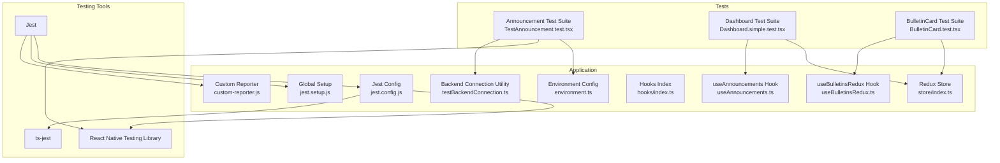
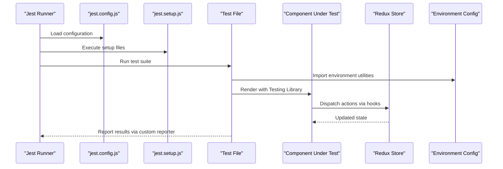
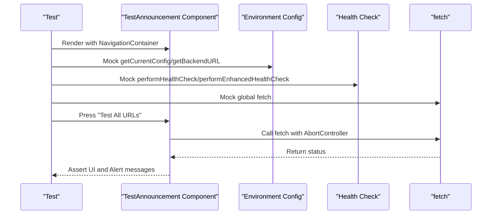
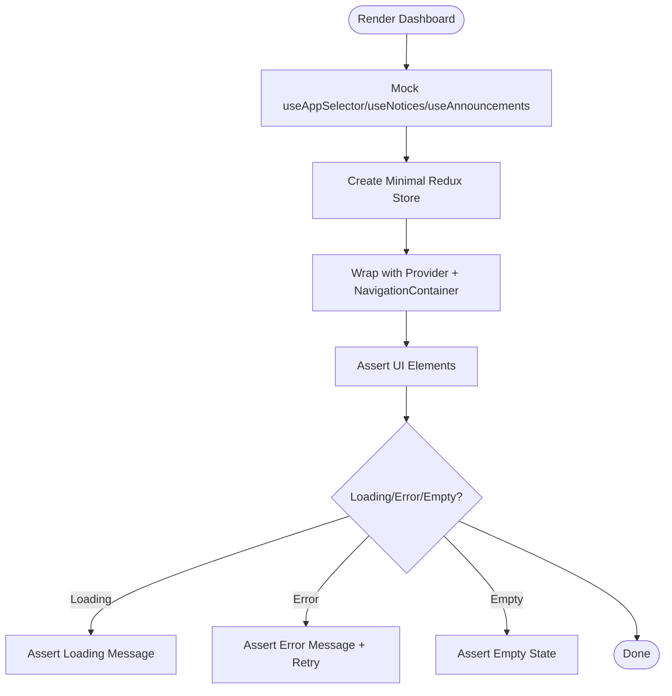
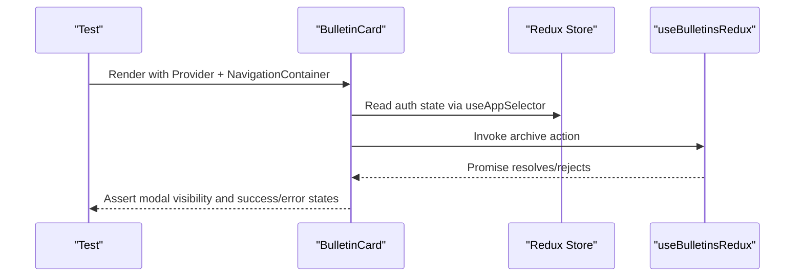
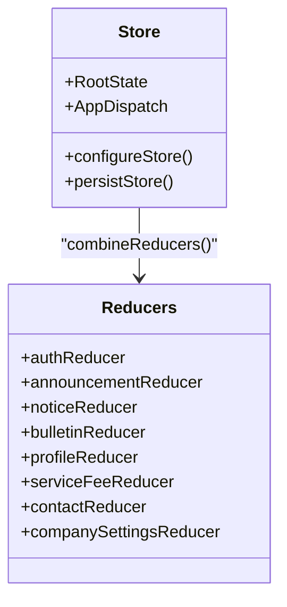
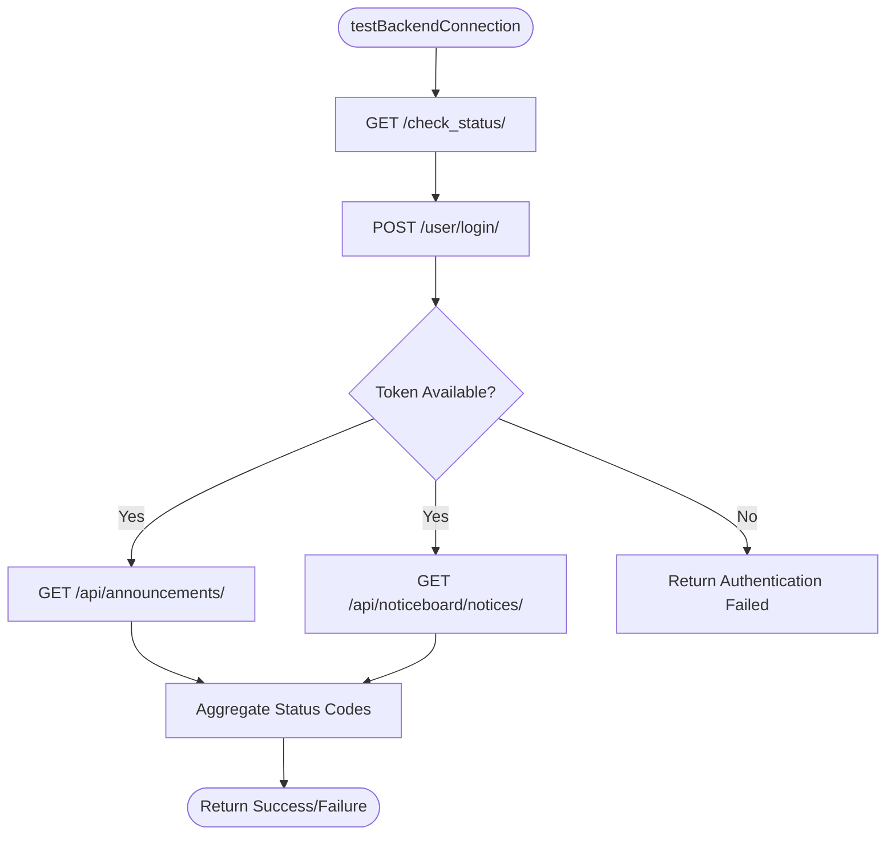
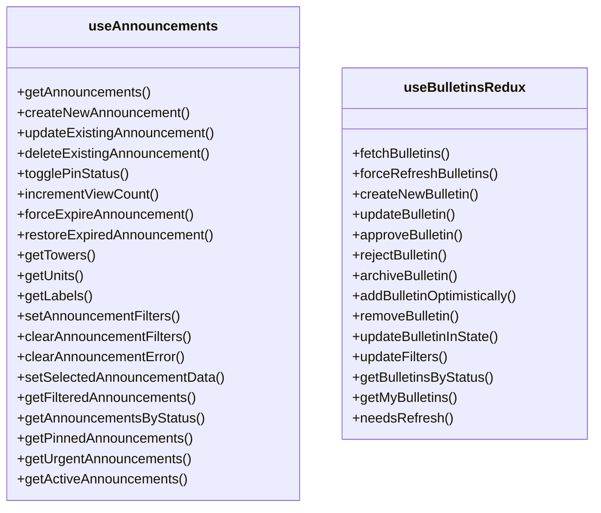
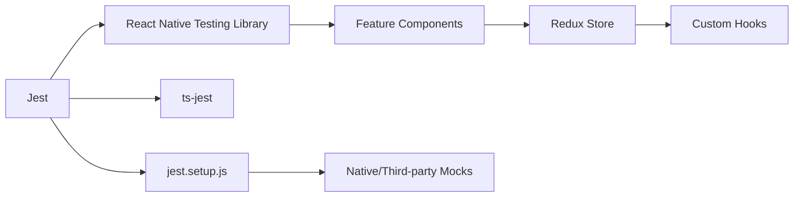

# Frontend Testing Framework

<cite>
**Referenced Files in This Document**
- [jest.config.js](file://Estate_link_App/jest.config.js)
- [jest.setup.js](file://Estate_link_App/jest.setup.js)
- [package.json](file://Estate_link_App/package.json)
- [custom-reporter.js](file://Estate_link_App/custom-reporter.js)
- [environment.ts](file://Estate_link_App/src/config/environment.ts)
- [index.ts](file://Estate_link_App/src/store/index.ts)
- [index.ts](file://Estate_link_App/src/hooks/index.ts)
- [useAnnouncements.ts](file://Estate_link_App/src/hooks/useAnnouncements.ts)
- [useBulletinsRedux.ts](file://Estate_link_App/src/hooks/useBulletinsRedux.ts)
- [testBackendConnection.ts](file://Estate_link_App/src/utils/testBackendConnection.ts)
- [TestAnnouncement.test.tsx](file://Estate_link_App/src/Features/Announcement&NoticeScreen/TestAnnouncement&NoticeScreen/TestAnnouncement.test.tsx)
- [Dashboard.simple.test.tsx](file://Estate_link_App/src/Features/DashboardScreen/TestDashboard/Dashboard.simple.test.tsx)
- [BulletinCard.test.tsx](file://Estate_link_App/src/Features/BulletinScreen/TestBulletinScreen/BulletinCard.test.tsx)
</cite>

## Table of Contents
1. [Introduction](#introduction)
2. [Project Structure](#project-structure)
3. [Core Components](#core-components)
4. [Architecture Overview](#architecture-overview)
5. [Detailed Component Analysis](#detailed-component-analysis)
6. [Dependency Analysis](#dependency-analysis)
7. [Performance Considerations](#performance-considerations)
8. [Troubleshooting Guide](#troubleshooting-guide)
9. [Conclusion](#conclusion)

## Introduction
This document describes the frontend testing framework for the React Native application. It covers Jest configuration, React Native Testing Library setup, component testing strategies, Redux store testing, API integration testing, hooks testing patterns, async operation handling, mocking strategies, and continuous integration workflows. The goal is to provide a practical guide for writing reliable unit and integration tests across the application’s screens, services, and utilities.

## Project Structure
The testing framework is centered around Jest with React Native Testing Library presets. The configuration supports TypeScript, ESM transforms, and extensive mocking for native modules and third-party libraries. Test files are organized alongside feature components under dedicated test directories.

**Diagram sources**
- [jest.config.js](file://Estate_link_App/jest.config.js#L1-L82)
- [jest.setup.js](file://Estate_link_App/jest.setup.js#L1-L378)
- [custom-reporter.js](file://Estate_link_App/custom-reporter.js#L1-L28)
- [environment.ts](file://Estate_link_App/src/config/environment.ts#L1-L84)
- [index.ts](file://Estate_link_App/src/store/index.ts#L1-L79)
- [index.ts](file://Estate_link_App/src/hooks/index.ts#L1-L7)
- [useAnnouncements.ts](file://Estate_link_App/src/hooks/useAnnouncements.ts#L1-L247)
- [useBulletinsRedux.ts](file://Estate_link_App/src/hooks/useBulletinsRedux.ts#L1-L226)
- [testBackendConnection.ts](file://Estate_link_App/src/utils/testBackendConnection.ts#L1-L208)
- [TestAnnouncement.test.tsx](file://Estate_link_App/src/Features/Announcement&NoticeScreen/TestAnnouncement&NoticeScreen/TestAnnouncement.test.tsx#L1-L529)
- [Dashboard.simple.test.tsx](file://Estate_link_App/src/Features/DashboardScreen/TestDashboard/Dashboard.simple.test.tsx#L1-L347)
- [BulletinCard.test.tsx](file://Estate_link_App/src/Features/BulletinScreen/TestBulletinScreen/BulletinCard.test.tsx#L1-L717)

**Section sources**
- [jest.config.js](file://Estate_link_App/jest.config.js#L1-L82)
- [jest.setup.js](file://Estate_link_App/jest.setup.js#L1-L378)
- [package.json](file://Estate_link_App/package.json#L1-L93)

## Core Components
- Jest configuration defines presets, test environment, transform rules, module name mapping, coverage collection, and a custom reporter.
- Global setup mocks native modules, navigation, fonts, storage, and icons to avoid runtime errors during tests.
- Custom reporter improves readability by summarizing test results and suite outcomes.
- Environment configuration centralizes backend URLs, timeouts, retries, and discovery settings used by tests.
- Redux store integrates persistence and middleware tailored for test runs.
- Hooks encapsulate Redux actions and selectors for announcements and bulletins, enabling focused testing of logic and state transitions.
- Backend connection utility provides authenticated health checks and endpoint verification for API testing.

**Section sources**
- [jest.config.js](file://Estate_link_App/jest.config.js#L1-L82)
- [jest.setup.js](file://Estate_link_App/jest.setup.js#L1-L378)
- [custom-reporter.js](file://Estate_link_App/custom-reporter.js#L1-L28)
- [environment.ts](file://Estate_link_App/src/config/environment.ts#L1-L84)
- [index.ts](file://Estate_link_App/src/store/index.ts#L1-L79)
- [index.ts](file://Estate_link_App/src/hooks/index.ts#L1-L7)
- [useAnnouncements.ts](file://Estate_link_App/src/hooks/useAnnouncements.ts#L1-L247)
- [useBulletinsRedux.ts](file://Estate_link_App/src/hooks/useBulletinsRedux.ts#L1-L226)
- [testBackendConnection.ts](file://Estate_link_App/src/utils/testBackendConnection.ts#L1-L208)

## Architecture Overview
The testing architecture leverages Jest with React Native Testing Library to render components in a jsdom-like environment. Extensive mocking ensures deterministic behavior for native modules, navigation, and third-party libraries. Redux store is configured for testing with minimal middleware and mocked persistence.

**Diagram sources**
- [jest.config.js](file://Estate_link_App/jest.config.js#L1-L82)
- [jest.setup.js](file://Estate_link_App/jest.setup.js#L1-L378)
- [TestAnnouncement.test.tsx](file://Estate_link_App/src/Features/Announcement&NoticeScreen/TestAnnouncement&NoticeScreen/TestAnnouncement.test.tsx#L1-L529)
- [Dashboard.simple.test.tsx](file://Estate_link_App/src/Features/DashboardScreen/TestDashboard/Dashboard.simple.test.tsx#L1-L347)
- [BulletinCard.test.tsx](file://Estate_link_App/src/Features/BulletinScreen/TestBulletinScreen/BulletinCard.test.tsx#L1-L717)

## Detailed Component Analysis

### Jest Configuration and Setup
- Preset and environment: Uses jest-expo with jsdom test environment and NODE_ENV set to test to disable NativeWind.
- Exclusions: Specific test paths are excluded due to CSS interop issues.
- Coverage: Collects coverage from TypeScript sources while excluding typings and stories.
- Module mapping: Aliases for @/ and @components/.
- Transform: Babel-Jest with Expo preset for TS/TSX.
- ESM support: Enables useESM for ts-jest and extensionsToTreatAsEsm.
- Reporter: Custom reporter logs per-test passes and suite summaries.

**Section sources**
- [jest.config.js](file://Estate_link_App/jest.config.js#L1-L82)
- [custom-reporter.js](file://Estate_link_App/custom-reporter.js#L1-L28)

### Global Mocks and Dependencies
- NativeWind and CSS interop: Mocked to prevent style-related test failures.
- React Native and Expo modules: Mocked appearance, platform, dimensions, fonts, splash screen, status bar, vector icons, async storage, safe area, navigation, and file system.
- Redux hooks: Mocked to isolate component logic from store internals.
- Custom hooks: Mocked to simulate hook behavior and return controlled data.
- Global flags: Sets __DEV__ to true for compatibility.

**Section sources**
- [jest.setup.js](file://Estate_link_App/jest.setup.js#L1-L378)

### Component Testing Strategies

#### Announcement Screen Tests
- Purpose: Validates network configuration display, URL testing, health checks, and navigation.
- Patterns:
  - Mock environment utilities and health check functions.
  - Mock Alert and global fetch.
  - Wrap component with NavigationContainer and StackNavigator.
  - Assert UI texts and button interactions.
  - Simulate success, failure, timeout, and HTTP error scenarios.
  - Verify alerts and navigation callbacks.

**Diagram sources**
- [TestAnnouncement.test.tsx](file://Estate_link_App/src/Features/Announcement&NoticeScreen/TestAnnouncement&NoticeScreen/TestAnnouncement.test.tsx#L1-L529)
- [environment.ts](file://Estate_link_App/src/config/environment.ts#L1-L84)

**Section sources**
- [TestAnnouncement.test.tsx](file://Estate_link_App/src/Features/Announcement&NoticeScreen/TestAnnouncement&NoticeScreen/TestAnnouncement.test.tsx#L1-L529)

#### Dashboard Component Tests
- Purpose: Renders dashboard with user data, notices, announcements, and tabs.
- Patterns:
  - Mock Redux hooks and custom hooks.
  - Configure a minimal Redux store with reducers for auth, notices, and announcements.
  - Wrap component with Provider and NavigationContainer.
  - Assert presence of user info, dashboard items, pinned announcements, and skeleton loaders.
  - Test loading, error, and empty states.

**Diagram sources**
- [Dashboard.simple.test.tsx](file://Estate_link_App/src/Features/DashboardScreen/TestDashboard/Dashboard.simple.test.tsx#L1-L347)

**Section sources**
- [Dashboard.simple.test.tsx](file://Estate_link_App/src/Features/DashboardScreen/TestDashboard/Dashboard.simple.test.tsx#L1-L347)

#### BulletinCard Component Tests
- Purpose: Tests bulletin rendering, attachments, options menu, archive flow, and modals.
- Patterns:
  - Mock MediaViewer, DeleteConfirmationModal, SuccessPopup, History modal, and icons.
  - Mock Redux store with auth state.
  - Mock useAppSelector and useBulletinsRedux.
  - Test rendering modes (main vs compact), labels, profile pictures, and attachments.
  - Simulate options menu actions: edit, history, archive.
  - Verify modal visibility, confirm actions, and success popups.
  - Validate error handling and responsive behavior.

**Diagram sources**
- [BulletinCard.test.tsx](file://Estate_link_App/src/Features/BulletinScreen/TestBulletinScreen/BulletinCard.test.tsx#L1-L717)

**Section sources**
- [BulletinCard.test.tsx](file://Estate_link_App/src/Features/BulletinScreen/TestBulletinScreen/BulletinCard.test.tsx#L1-L717)

### Redux Store Testing
- Store configuration includes reducers for auth, announcements, notices, bulletins, profile, service fee, contacts, and company settings.
- Persistence is configured with AsyncStorage and whitelisted slices.
- Serializable checks ignore specific Redux-Persist actions and fulfilled Thunk actions to prevent warnings in tests.
- Root state and dispatch types are exported for type-safe tests.

**Diagram sources**
- [index.ts](file://Estate_link_App/src/store/index.ts#L1-L79)

**Section sources**
- [index.ts](file://Estate_link_App/src/store/index.ts#L1-L79)

### API Integration Testing
- Backend connection utility performs:
  - Connectivity checks with timeouts.
  - Authentication requests to obtain tokens.
  - Endpoint tests for announcements and notices with bearer tokens.
  - Detailed logging and error categorization.
- Tests can leverage this utility to validate real API behavior and error handling.

**Diagram sources**
- [testBackendConnection.ts](file://Estate_link_App/src/utils/testBackendConnection.ts#L1-L208)

**Section sources**
- [testBackendConnection.ts](file://Estate_link_App/src/utils/testBackendConnection.ts#L1-L208)

### Hooks Testing Patterns
- useAnnouncements: Encapsulates CRUD operations and filtering for announcements. Tests can mock dispatch and selectors to assert action dispatches and computed values.
- useBulletinsRedux: Provides typed access to current/pending/archive bulletins, loading states, filters, and refresh logic. Tests can simulate async flows and verify optimistic updates.

**Diagram sources**
- [useAnnouncements.ts](file://Estate_link_App/src/hooks/useAnnouncements.ts#L1-L247)
- [useBulletinsRedux.ts](file://Estate_link_App/src/hooks/useBulletinsRedux.ts#L1-L226)

**Section sources**
- [useAnnouncements.ts](file://Estate_link_App/src/hooks/useAnnouncements.ts#L1-L247)
- [useBulletinsRedux.ts](file://Estate_link_App/src/hooks/useBulletinsRedux.ts#L1-L226)

### Async Operations and Mocking Strategies
- Fetch mocking: Global fetch is mocked to simulate network responses and errors.
- AbortController: Used to simulate timeouts and cancellation.
- Navigation: Mocked to avoid deep navigation stack rendering.
- Storage and platform: Mocked to ensure deterministic behavior across environments.
- Redux actions: Dispatched via mocked hooks; tests assert effects on state and UI.

**Section sources**
- [TestAnnouncement.test.tsx](file://Estate_link_App/src/Features/Announcement&NoticeScreen/TestAnnouncement&NoticeScreen/TestAnnouncement.test.tsx#L1-L529)
- [Dashboard.simple.test.tsx](file://Estate_link_App/src/Features/DashboardScreen/TestDashboard/Dashboard.simple.test.tsx#L1-L347)
- [BulletinCard.test.tsx](file://Estate_link_App/src/Features/BulletinScreen/TestBulletinScreen/BulletinCard.test.tsx#L1-L717)

### Continuous Integration and Workflows
- Scripts: npm/yarn scripts define test commands, watch mode, coverage, and targeted test runs for specific features.
- Coverage: Enabled via jest --coverage; configured to exclude typings and stories.
- Reporting: Custom reporter prints concise pass/fail summaries and suite statistics.
- Exclusions: Certain test paths are excluded in jest.config.js due to CSS interop issues.

**Section sources**
- [package.json](file://Estate_link_App/package.json#L1-L93)
- [jest.config.js](file://Estate_link_App/jest.config.js#L1-L82)
- [custom-reporter.js](file://Estate_link_App/custom-reporter.js#L1-L28)

## Dependency Analysis
The testing framework depends on:
- Jest for orchestration and assertions.
- React Native Testing Library for component rendering and queries.
- ts-jest for TypeScript compilation and ESM support.
- Expo and React Native modules mocked via jest.setup.js.
- Redux store and hooks for state-driven tests.

**Diagram sources**
- [jest.config.js](file://Estate_link_App/jest.config.js#L1-L82)
- [jest.setup.js](file://Estate_link_App/jest.setup.js#L1-L378)
- [Dashboard.simple.test.tsx](file://Estate_link_App/src/Features/DashboardScreen/TestDashboard/Dashboard.simple.test.tsx#L1-L347)
- [BulletinCard.test.tsx](file://Estate_link_App/src/Features/BulletinScreen/TestBulletinScreen/BulletinCard.test.tsx#L1-L717)

**Section sources**
- [jest.config.js](file://Estate_link_App/jest.config.js#L1-L82)
- [jest.setup.js](file://Estate_link_App/jest.setup.js#L1-L378)

## Performance Considerations
- Transform exclusions: transformIgnorePatterns minimizes transpilation overhead for commonly used modules.
- Coverage scope: collectCoverageFrom focuses on source files to reduce report generation time.
- Custom reporter: verbose and silent flags balance output verbosity with CI readability.
- Mock granularity: Targeted mocks reduce unnecessary overhead and improve test stability.

[No sources needed since this section provides general guidance]

## Troubleshooting Guide
- CSS Interop Issues: Some test paths are excluded in jest.config.js due to CSS interop problems; run excluded tests separately if needed.
- NativeWind Conflicts: jest.setup.js disables NativeWind and mocks related modules to prevent style-related failures.
- Fetch Errors: Tests differentiate AbortError, network errors, and HTTP errors; ensure proper assertions for each scenario.
- Navigation Crashes: Mock @react-navigation modules to avoid deep navigation stack rendering in tests.
- Redux Warnings: Serializable checks are tuned to ignore Redux-Persist and fulfilled Thunk actions in tests.

**Section sources**
- [jest.config.js](file://Estate_link_App/jest.config.js#L1-L82)
- [jest.setup.js](file://Estate_link_App/jest.setup.js#L1-L378)
- [TestAnnouncement.test.tsx](file://Estate_link_App/src/Features/Announcement&NoticeScreen/TestAnnouncement&NoticeScreen/TestAnnouncement.test.tsx#L1-L529)

## Conclusion
The frontend testing framework combines Jest, React Native Testing Library, and comprehensive mocking to deliver reliable tests across components, hooks, Redux store, and API integrations. The configuration emphasizes ESM support, TypeScript compatibility, and pragmatic exclusions for CSS interop. By leveraging the provided patterns and strategies, teams can maintain high confidence in UI correctness, state transitions, and integration flows while keeping tests fast and maintainable.