# Mobile Application Testing

<cite>
**Referenced Files in This Document**
- [jest.config.js](file://Estate_link_App/jest.config.js)
- [jest.setup.early.js](file://Estate_link_App/jest.setup.early.js)
- [jest.setup.js](file://Estate_link_App/jest.setup.js)
- [custom-reporter.js](file://Estate_link_App/custom-reporter.js)
- [package.json](file://Estate_link_App/package.json)
- [TestAnnouncement.test.tsx](file://Estate_link_App/src/Features/Announcement&NoticeScreen/TestAnnouncement&NoticeScreen/TestAnnouncement.test.tsx)
- [Dashboard.simple.test.tsx](file://Estate_link_App/src/Features/DashboardScreen/TestDashboard/Dashboard.simple.test.tsx)
- [profileService.test.ts](file://Estate_link_App/src/services/__tests__/profileService.test.ts)
- [hooks.ts](file://Estate_link_App/src/store/hooks.ts)
</cite>

## Table of Contents
1. [Introduction](#introduction)
2. [Project Structure](#project-structure)
3. [Core Components](#core-components)
4. [Architecture Overview](#architecture-overview)
5. [Detailed Component Analysis](#detailed-component-analysis)
6. [Dependency Analysis](#dependency-analysis)
7. [Performance Considerations](#performance-considerations)
8. [Troubleshooting Guide](#troubleshooting-guide)
9. [Conclusion](#conclusion)
10. [Appendices](#appendices)

## Introduction
This document provides comprehensive testing strategies for the React Native mobile application. It covers Jest configuration tailored for React Native, test setup procedures, and mobile-specific considerations. It explains how to test components, navigation, and state management, along with strategies for AsyncStorage, camera functionality, and device-specific features. It also documents mocking approaches for native modules, network requests, and device APIs, and outlines performance testing, memory leak detection, and battery usage testing. Finally, it describes continuous integration setup for mobile builds, automated testing pipelines, and release validation processes.

## Project Structure
The mobile application uses Jest with Expo preset and a dedicated test configuration. The setup includes early and late setup files to mock CSS interop and native modules, ensuring tests run reliably in a non-native environment. Test scripts are exposed via npm/yarn scripts for quick execution and coverage reporting.

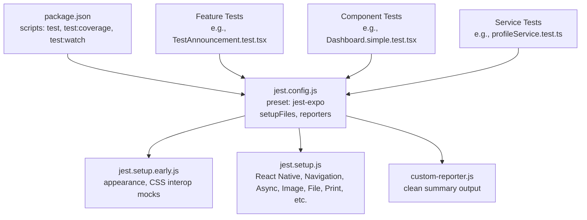

**Diagram sources**
- [package.json](file://Estate_link_App/package.json#L4-L21)
- [jest.config.js](file://Estate_link_App/jest.config.js#L1-L82)
- [jest.setup.early.js](file://Estate_link_App/jest.setup.early.js#L1-L163)
- [jest.setup.js](file://Estate_link_App/jest.setup.js#L1-L378)
- [custom-reporter.js](file://Estate_link_App/custom-reporter.js#L1-L28)

**Section sources**
- [package.json](file://Estate_link_App/package.json#L4-L21)
- [jest.config.js](file://Estate_link_App/jest.config.js#L1-L82)

## Core Components
- Jest configuration with Expo preset and custom transforms to support TypeScript and dynamic imports.
- Early and late setup files to mock CSS interop and native modules before and after the rest of the setup.
- Custom reporter for concise and readable test summaries.
- Test scripts for running focused suites and generating coverage reports.

Key capabilities:
- Excludes problematic CSS interop test paths.
- Uses jsdom test environment.
- Transforms TS/TSX with Babel and restricts module resolution for native packages.
- Provides multiple config variants for different testing needs.

**Section sources**
- [jest.config.js](file://Estate_link_App/jest.config.js#L1-L82)
- [jest.setup.early.js](file://Estate_link_App/jest.setup.early.js#L1-L163)
- [jest.setup.js](file://Estate_link_App/jest.setup.js#L1-L378)
- [custom-reporter.js](file://Estate_link_App/custom-reporter.js#L1-L28)
- [package.json](file://Estate_link_App/package.json#L4-L21)

## Architecture Overview
The testing architecture centers around Jest with Expo preset, a layered mock strategy, and Testing Library for React Native. Tests are organized by feature and service, with shared mocks for navigation, state, and device APIs.

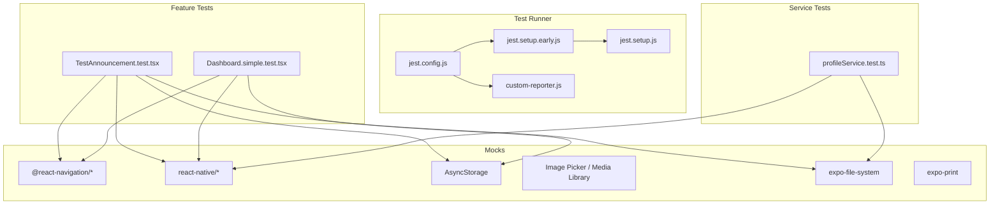

**Diagram sources**
- [jest.config.js](file://Estate_link_App/jest.config.js#L1-L82)
- [jest.setup.early.js](file://Estate_link_App/jest.setup.early.js#L1-L163)
- [jest.setup.js](file://Estate_link_App/jest.setup.js#L1-L378)
- [TestAnnouncement.test.tsx](file://Estate_link_App/src/Features/Announcement&NoticeScreen/TestAnnouncement&NoticeScreen/TestAnnouncement.test.tsx#L1-L529)
- [Dashboard.simple.test.tsx](file://Estate_link_App/src/Features/DashboardScreen/TestDashboard/Dashboard.simple.test.tsx#L1-L347)
- [profileService.test.ts](file://Estate_link_App/src/services/__tests__/profileService.test.ts#L1-L97)

## Detailed Component Analysis

### Jest Configuration and Setup
- Preset and environment: Uses jest-expo with jsdom test environment and sets NODE_ENV to test to disable NativeWind.
- Path exclusions: Excludes specific test paths affected by CSS interop issues.
- Transform pipeline: Babel-jest with Expo preset for TS/TSX; transformIgnorePatterns includes native packages and CSS interop libraries.
- Module mapping: Aliases for internal modules.
- Reporters: Custom reporter prints per-test passes and suite summary.
- Scripts: Multiple configs and focused test runners for different suites.

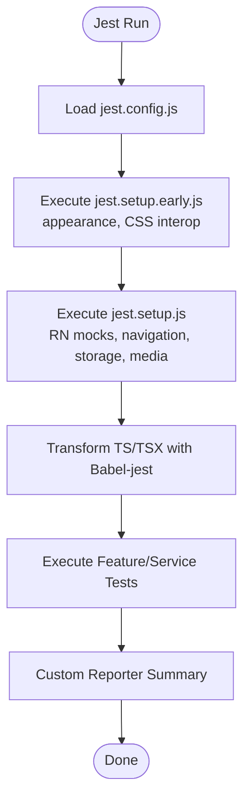

**Diagram sources**
- [jest.config.js](file://Estate_link_App/jest.config.js#L1-L82)
- [jest.setup.early.js](file://Estate_link_App/jest.setup.early.js#L1-L163)
- [jest.setup.js](file://Estate_link_App/jest.setup.js#L1-L378)
- [custom-reporter.js](file://Estate_link_App/custom-reporter.js#L1-L28)

**Section sources**
- [jest.config.js](file://Estate_link_App/jest.config.js#L1-L82)
- [jest.setup.early.js](file://Estate_link_App/jest.setup.early.js#L1-L163)
- [jest.setup.js](file://Estate_link_App/jest.setup.js#L1-L378)
- [custom-reporter.js](file://Estate_link_App/custom-reporter.js#L1-L28)

### Component Testing: Dashboard
- Purpose: Validates rendering of dashboard UI, user info, pinned announcements, and tab bar.
- Mocks: Redux hooks, navigation, safe area, status bar, vector icons, and notice/announcement hooks.
- Assertions: Verifies presence of text, tab state, and loading/error states.

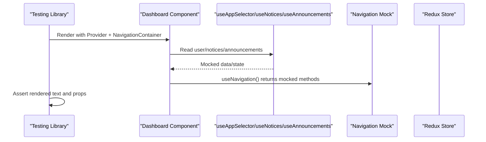

**Diagram sources**
- [Dashboard.simple.test.tsx](file://Estate_link_App/src/Features/DashboardScreen/TestDashboard/Dashboard.simple.test.tsx#L104-L184)
- [hooks.ts](file://Estate_link_App/src/store/hooks.ts#L1-L6)

**Section sources**
- [Dashboard.simple.test.tsx](file://Estate_link_App/src/Features/DashboardScreen/TestDashboard/Dashboard.simple.test.tsx#L1-L347)
- [hooks.ts](file://Estate_link_App/src/store/hooks.ts#L1-L6)

### Navigation Testing
- Strategy: Wrap components under test with NavigationContainer and stack navigator mocks.
- Verification: Assert navigation calls (navigate, goBack) and route params via mocked hooks.

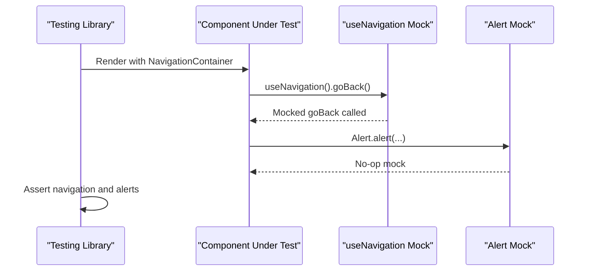

**Diagram sources**
- [TestAnnouncement.test.tsx](file://Estate_link_App/src/Features/Announcement&NoticeScreen/TestAnnouncement&NoticeScreen/TestAnnouncement.test.tsx#L40-L48)
- [TestAnnouncement.test.tsx](file://Estate_link_App/src/Features/Announcement&NoticeScreen/TestAnnouncement&NoticeScreen/TestAnnouncement.test.tsx#L430-L445)

**Section sources**
- [TestAnnouncement.test.tsx](file://Estate_link_App/src/Features/Announcement&NoticeScreen/TestAnnouncement&NoticeScreen/TestAnnouncement.test.tsx#L23-L48)
- [TestAnnouncement.test.tsx](file://Estate_link_App/src/Features/Announcement&NoticeScreen/TestAnnouncement&NoticeScreen/TestAnnouncement.test.tsx#L430-L445)

### State Management Testing
- Strategy: Use a minimal Redux store with configured reducers and preloaded state.
- Verification: Assert selectors return expected state slices and UI reacts accordingly.

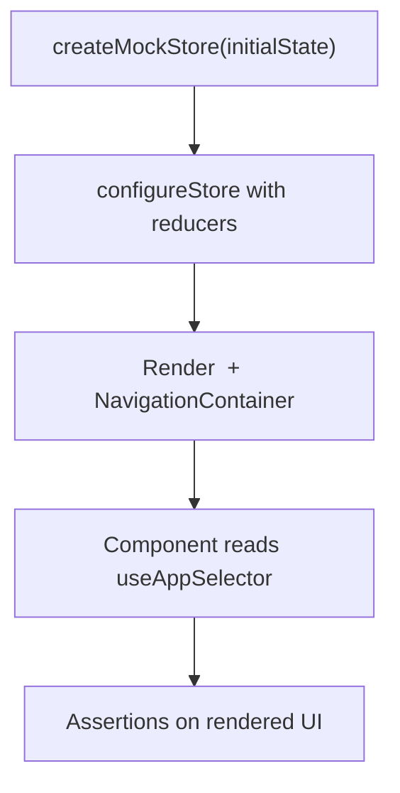

**Diagram sources**
- [Dashboard.simple.test.tsx](file://Estate_link_App/src/Features/DashboardScreen/TestDashboard/Dashboard.simple.test.tsx#L104-L121)
- [hooks.ts](file://Estate_link_App/src/store/hooks.ts#L1-L6)

**Section sources**
- [Dashboard.simple.test.tsx](file://Estate_link_App/src/Features/DashboardScreen/TestDashboard/Dashboard.simple.test.tsx#L104-L121)
- [hooks.ts](file://Estate_link_App/src/store/hooks.ts#L1-L6)

### AsyncStorage Testing
- Strategy: Mock AsyncStorage module to return resolved promises for all methods.
- Verification: Assert set/get/remove/clear and multi* operations behave deterministically.

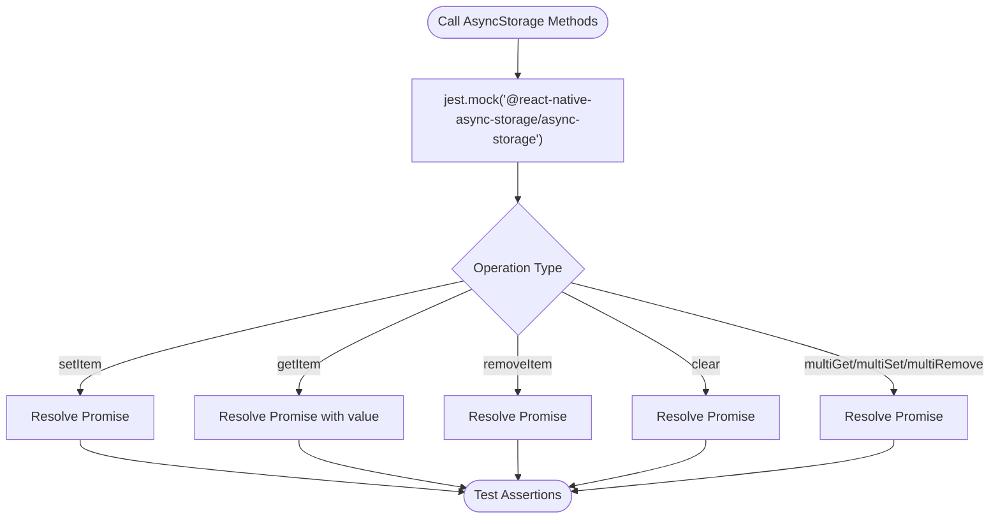

**Diagram sources**
- [jest.setup.js](file://Estate_link_App/jest.setup.js#L142-L152)

**Section sources**
- [jest.setup.js](file://Estate_link_App/jest.setup.js#L142-L152)

### Camera and Media Functionality
- Strategy: Mock expo-image-picker and expo-media-library to simulate permissions and asset operations.
- Verification: Assert permission grants, picker launches, and asset creation/save.

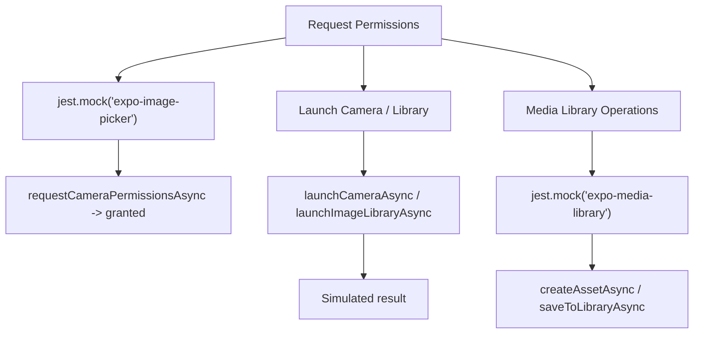

**Diagram sources**
- [jest.setup.js](file://Estate_link_App/jest.setup.js#L251-L278)

**Section sources**
- [jest.setup.js](file://Estate_link_App/jest.setup.js#L251-L278)

### Device-Specific Features
- Strategy: Mock expo-device to simulate tablet/phone device type and attributes.
- Verification: Assert device-type-dependent logic behaves consistently across tests.

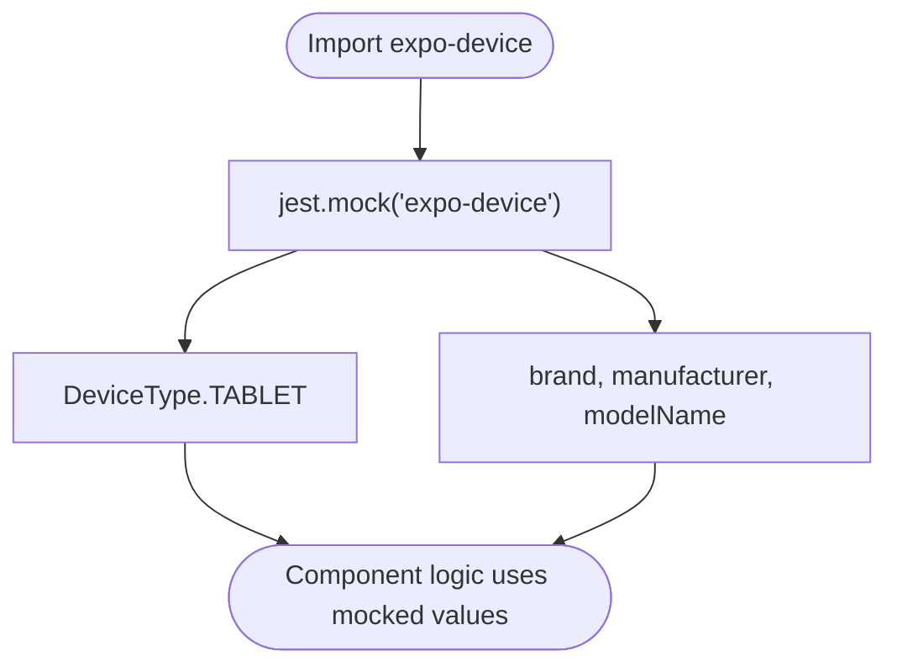

**Diagram sources**
- [jest.setup.js](file://Estate_link_App/jest.setup.js#L92-L109)

**Section sources**
- [jest.setup.js](file://Estate_link_App/jest.setup.js#L92-L109)

### Network Requests and Backend Interactions
- Strategy: Mock global fetch and service-layer functions to isolate component behavior.
- Verification: Assert HTTP methods, headers, and error handling paths.

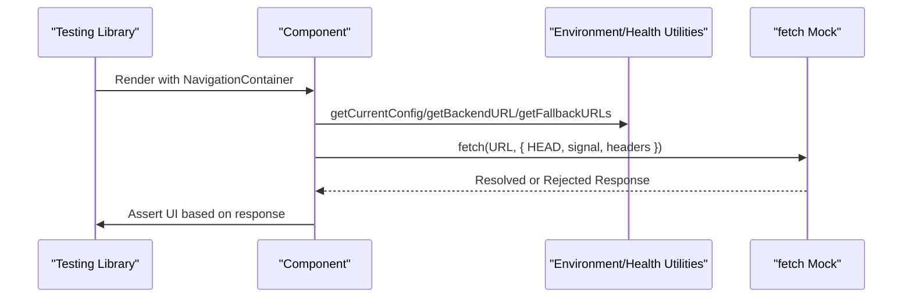

**Diagram sources**
- [TestAnnouncement.test.tsx](file://Estate_link_App/src/Features/Announcement&NoticeScreen/TestAnnouncement&NoticeScreen/TestAnnouncement.test.tsx#L10-L36)
- [TestAnnouncement.test.tsx](file://Estate_link_App/src/Features/Announcement&NoticeScreen/TestAnnouncement&NoticeScreen/TestAnnouncement.test.tsx#L144-L293)

**Section sources**
- [TestAnnouncement.test.tsx](file://Estate_link_App/src/Features/Announcement&NoticeScreen/TestAnnouncement&NoticeScreen/TestAnnouncement.test.tsx#L10-L36)
- [TestAnnouncement.test.tsx](file://Estate_link_App/src/Features/Announcement&NoticeScreen/TestAnnouncement&NoticeScreen/TestAnnouncement.test.tsx#L144-L293)

### Service Layer Testing Example
- Strategy: Mock fetch globally and assert service methods construct correct requests and parse responses.
- Verification: Confirm headers, methods, and error propagation.

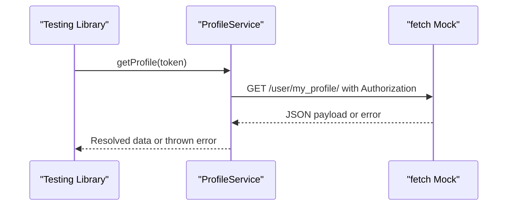

**Diagram sources**
- [profileService.test.ts](file://Estate_link_App/src/services/__tests__/profileService.test.ts#L38-L71)

**Section sources**
- [profileService.test.ts](file://Estate_link_App/src/services/__tests__/profileService.test.ts#L1-L97)

## Dependency Analysis
- Test runner depends on Jest, Expo preset, and Babel-Jest for TS/TSX.
- Feature and service tests depend on Testing Library for React Native and shared mocks.
- Navigation and state dependencies are isolated via local mocks within tests.

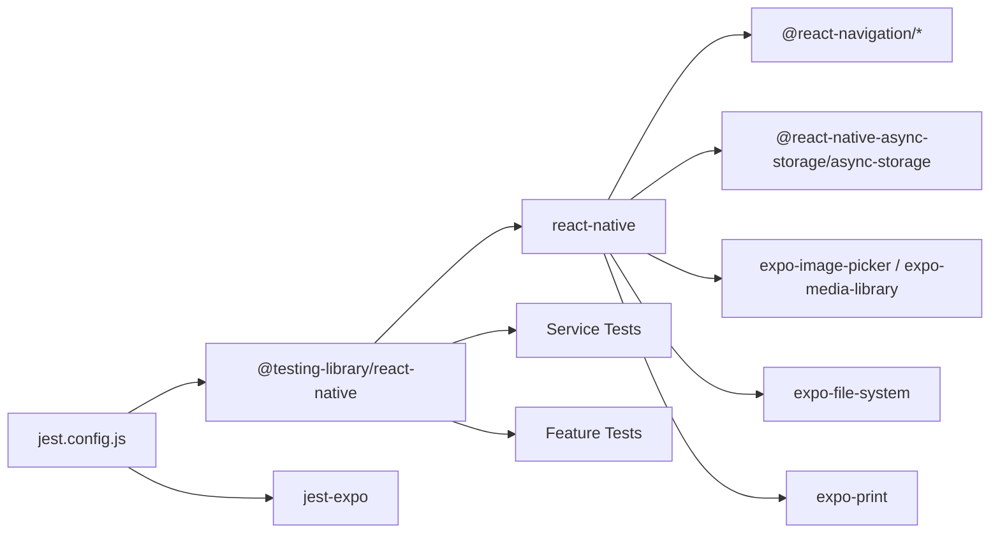

**Diagram sources**
- [jest.config.js](file://Estate_link_App/jest.config.js#L1-L82)
- [TestAnnouncement.test.tsx](file://Estate_link_App/src/Features/Announcement&NoticeScreen/TestAnnouncement&NoticeScreen/TestAnnouncement.test.tsx#L1-L529)
- [Dashboard.simple.test.tsx](file://Estate_link_App/src/Features/DashboardScreen/TestDashboard/Dashboard.simple.test.tsx#L1-L347)
- [profileService.test.ts](file://Estate_link_App/src/services/__tests__/profileService.test.ts#L1-L97)

**Section sources**
- [jest.config.js](file://Estate_link_App/jest.config.js#L1-L82)
- [TestAnnouncement.test.tsx](file://Estate_link_App/src/Features/Announcement&NoticeScreen/TestAnnouncement&NoticeScreen/TestAnnouncement.test.tsx#L1-L529)
- [Dashboard.simple.test.tsx](file://Estate_link_App/src/Features/DashboardScreen/TestDashboard/Dashboard.simple.test.tsx#L1-L347)
- [profileService.test.ts](file://Estate_link_App/src/services/__tests__/profileService.test.ts#L1-L97)

## Performance Considerations
- Use minimal DOM environment (jsdom) and avoid heavy native rendering to keep tests fast.
- Prefer deterministic mocks for timers and network calls; avoid real network latency in unit tests.
- For performance-sensitive UI, consider snapshot tests and controlled rendering to reduce overhead.
- Use focused test suites and selective runs during development; rely on coverage reports for broader checks.

[No sources needed since this section provides general guidance]

## Troubleshooting Guide
- CSS interop issues: Excluded in configuration; ensure excluded paths remain consistent with new tests.
- NativeWind conflicts: Early setup mocks disable CSS interop and NativeWind to prevent runtime errors.
- Navigation and state: Use local mocks within tests to avoid relying on real navigation stacks or Redux stores.
- Network flakiness: Mock fetch globally in tests; assert request shape and error handling paths.
- Custom reporter: Use the custom reporter for concise pass/fail summaries and timing insights.

**Section sources**
- [jest.config.js](file://Estate_link_App/jest.config.js#L11-L40)
- [jest.setup.early.js](file://Estate_link_App/jest.setup.early.js#L33-L87)
- [custom-reporter.js](file://Estate_link_App/custom-reporter.js#L16-L24)

## Conclusion
The testing strategy leverages Jest with Expo preset, layered mock setups, and Testing Library for React Native. It provides reliable component, navigation, and service tests while isolating native dependencies. By focusing on deterministic mocks, targeted test suites, and clear assertions, teams can maintain high confidence in mobile functionality across devices and environments.

[No sources needed since this section summarizes without analyzing specific files]

## Appendices

### Continuous Integration and Release Validation
- Mobile builds: Use Expo CLI scripts for Android/iOS runs and prebuild steps.
- Automated testing: Integrate Jest scripts into CI to run tests on pull requests and main branch.
- Coverage: Use coverage scripts to enforce minimum coverage thresholds.
- Release validation: Combine unit/integration tests with manual QA on physical devices to validate device-specific features.

**Section sources**
- [package.json](file://Estate_link_App/package.json#L4-L21)