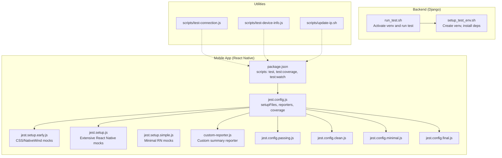
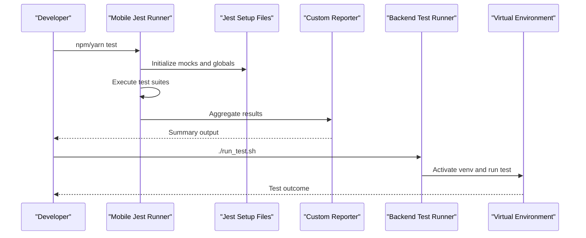
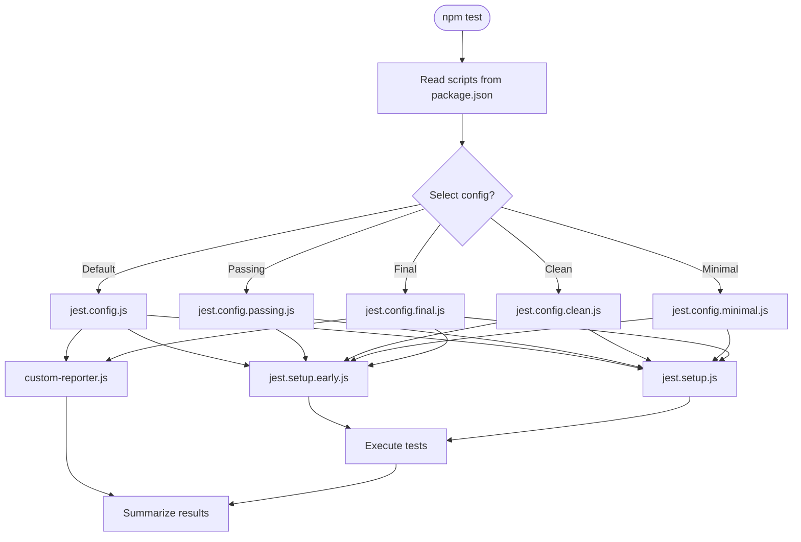
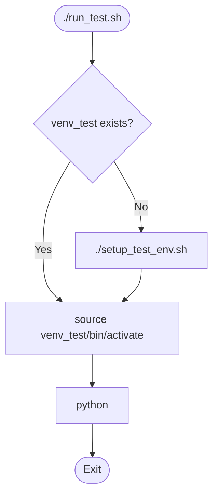
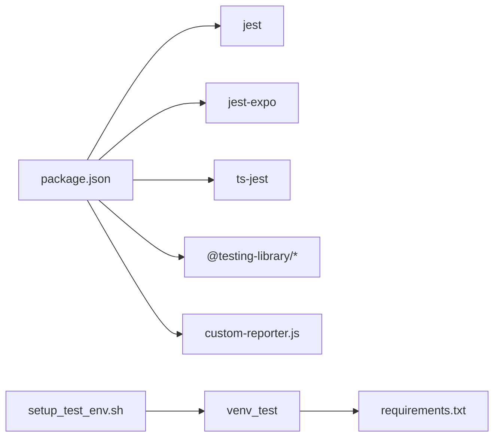

# Test Automation & CI/CD

<cite>
**Referenced Files in This Document**
- [package.json](file://Estate_link_App/package.json)
- [jest.config.js](file://Estate_link_App/jest.config.js)
- [jest.setup.js](file://Estate_link_App/jest.setup.js)
- [jest.setup.early.js](file://Estate_link_App/jest.setup.early.js)
- [jest.setup.simple.js](file://Estate_link_App/jest.setup.simple.js)
- [custom-reporter.js](file://Estate_link_App/custom-reporter.js)
- [jest.config.passing.js](file://Estate_link_App/jest.config.passing.js)
- [jest.config.clean.js](file://Estate_link_App/jest.config.clean.js)
- [jest.config.minimal.js](file://Estate_link_App/jest.config.minimal.js)
- [jest.config.final.js](file://Estate_link_App/jest.config.final.js)
- [run_test.sh](file://backend/run_test.sh)
- [setup_test_env.sh](file://backend/setup_test_env.sh)
- [test-connection.js](file://Estate_link_App/scripts/test-connection.js)
- [test-device-info.js](file://Estate_link_App/scripts/test-device-info.js)
- [update-ip.sh](file://Estate_link_App/scripts/update-ip.sh)
- [RUN_ALL.bat](file://scripts/RUN_ALL.bat)
- [RUN_ALL.sh](file://scripts/RUN_ALL.sh)
- [package.json](file://package.json)
</cite>

## Update Summary
**Changes Made**
- Updated introduction to reflect current manual development workflow
- Added section on current manual processes for development environment setup
- Updated troubleshooting guide to reflect manual environment management
- Removed references to automated startup scripts (RUN_ALL.bat and RUN_ALL.sh)
- Updated architecture overview to show manual vs automated processes

## Table of Contents
1. [Introduction](#introduction)
2. [Project Structure](#project-structure)
3. [Core Components](#core-components)
4. [Architecture Overview](#architecture-overview)
5. [Detailed Component Analysis](#detailed-component-analysis)
6. [Dependency Analysis](#dependency-analysis)
7. [Performance Considerations](#performance-considerations)
8. [Troubleshooting Guide](#troubleshooting-guide)
9. [Conclusion](#conclusion)
10. [Appendices](#appendices)

## Introduction
This document describes the test automation and continuous integration processes for the EstateLink project. It covers automated testing workflows, test environment setup, and CI/CD pipeline configuration. It explains test script execution, parallel testing strategies, and test result aggregation. It also documents environment preparation scripts, database seeding for tests, and cleanup procedures. Code coverage reporting, test artifact management, and quality gate enforcement are addressed, along with test data management, environment isolation, and dependency management for automated testing. Finally, it includes debugging failed tests, performance monitoring, and automated test maintenance processes.

**Updated**: The project currently operates with manual development workflows. While automated startup scripts (RUN_ALL.bat and RUN_ALL.sh) were previously available, they have been removed in favor of explicit manual processes that provide better control and transparency over the development environment setup.

## Project Structure
The repository includes two primary frontends and a backend with dedicated testing infrastructure:
- React Native mobile app under Estate_link_App with Jest-based tests and multiple Jest configurations.
- Web frontend under frontend with Jest configuration and test utilities.
- Django backend under backend with Python test scripts and environment setup.

Key testing and CI/CD assets:
- Mobile app test runner and configurations
- Backend test environment setup and execution scripts
- Utility scripts for connectivity and device info checks
- Environment update script for IP configuration



**Diagram sources**
- [package.json](file://Estate_link_App/package.json#L4-L21)
- [jest.config.js](file://Estate_link_App/jest.config.js#L1-L82)
- [jest.setup.early.js](file://Estate_link_App/jest.setup.early.js#L1-L163)
- [jest.setup.js](file://Estate_link_App/jest.setup.js#L1-L378)
- [jest.setup.simple.js](file://Estate_link_App/jest.setup.simple.js#L1-L99)
- [custom-reporter.js](file://Estate_link_App/custom-reporter.js#L1-L28)
- [jest.config.passing.js](file://Estate_link_App/jest.config.passing.js#L1-L72)
- [jest.config.clean.js](file://Estate_link_App/jest.config.clean.js#L1-L74)
- [jest.config.minimal.js](file://Estate_link_App/jest.config.minimal.js#L1-L75)
- [jest.config.final.js](file://Estate_link_App/jest.config.final.js#L1-L67)
- [run_test.sh](file://backend/run_test.sh#L1-L15)
- [setup_test_env.sh](file://backend/setup_test_env.sh#L1-L39)

**Section sources**
- [package.json](file://Estate_link_App/package.json#L4-L21)
- [jest.config.js](file://Estate_link_App/jest.config.js#L1-L82)
- [run_test.sh](file://backend/run_test.sh#L1-L15)
- [setup_test_env.sh](file://backend/setup_test_env.sh#L1-L39)

## Core Components
- Mobile app test runner and configurations:
  - Scripts for running tests, coverage, watch mode, and feature-specific suites.
  - Multiple Jest configurations for different output modes and reporters.
  - Comprehensive setup files to mock React Native, navigation, fonts, storage, and platform APIs.
- Backend test environment:
  - Automated setup of a virtual environment and dependency installation.
  - One-line test execution after environment initialization.
- Utilities:
  - Connectivity and device info checks for environment validation.
  - IP update script for environment configuration.

**Section sources**
- [package.json](file://Estate_link_App/package.json#L4-L21)
- [jest.config.js](file://Estate_link_App/jest.config.js#L1-L82)
- [jest.setup.js](file://Estate_link_App/jest.setup.js#L1-L378)
- [jest.setup.early.js](file://Estate_link_App/jest.setup.early.js#L1-L163)
- [custom-reporter.js](file://Estate_link_App/custom-reporter.js#L1-L28)
- [run_test.sh](file://backend/run_test.sh#L1-L15)
- [setup_test_env.sh](file://backend/setup_test_env.sh#L1-L39)
- [test-connection.js](file://Estate_link_App/scripts/test-connection.js)
- [test-device-info.js](file://Estate_link_App/scripts/test-device-info.js)
- [update-ip.sh](file://Estate_link_App/scripts/update-ip.sh)

## Architecture Overview
The testing architecture separates concerns across platforms and environments:
- Mobile app tests run via Jest with extensive mocking to avoid native dependencies and CSS interop issues.
- Backend tests run in isolated virtual environments with dependency management.
- Utilities support environment validation and configuration updates.

**Updated**: Development environment setup now requires manual steps for better control and transparency. The previous automated startup scripts (RUN_ALL.bat and RUN_ALL.sh) have been removed.



**Diagram sources**
- [package.json](file://Estate_link_App/package.json#L4-L21)
- [jest.config.js](file://Estate_link_App/jest.config.js#L1-L82)
- [custom-reporter.js](file://Estate_link_App/custom-reporter.js#L1-L28)
- [run_test.sh](file://backend/run_test.sh#L1-L15)
- [setup_test_env.sh](file://backend/setup_test_env.sh#L1-L39)

## Detailed Component Analysis

### Mobile App Test Execution and Configurations
- Test scripts:
  - General test runner, coverage collection, watch mode, and feature-specific suites.
- Jest configurations:
  - Base configuration with setup files, test environment, coverage inclusion/exclusion, module name mapping, transform rules, and custom reporter.
  - Specialized configs for passing-only summaries, clean minimal output, and final detailed reporting.
- Setup files:
  - Early setup mocks CSS interop and appearance to prevent test failures.
  - Full setup mocks React Native, navigation, storage, fonts, printing, media, and other platform modules.
  - Simple setup provides minimal RN mocks for lightweight scenarios.



**Diagram sources**
- [package.json](file://Estate_link_App/package.json#L4-L21)
- [jest.config.js](file://Estate_link_App/jest.config.js#L1-L82)
- [jest.config.passing.js](file://Estate_link_App/jest.config.passing.js#L1-L72)
- [jest.config.clean.js](file://Estate_link_App/jest.config.clean.js#L1-L74)
- [jest.config.minimal.js](file://Estate_link_App/jest.config.minimal.js#L1-L75)
- [jest.config.final.js](file://Estate_link_App/jest.config.final.js#L1-L67)
- [jest.setup.early.js](file://Estate_link_App/jest.setup.early.js#L1-L163)
- [jest.setup.js](file://Estate_link_App/jest.setup.js#L1-L378)
- [custom-reporter.js](file://Estate_link_App/custom-reporter.js#L1-L28)

**Section sources**
- [package.json](file://Estate_link_App/package.json#L4-L21)
- [jest.config.js](file://Estate_link_App/jest.config.js#L1-L82)
- [jest.config.passing.js](file://Estate_link_App/jest.config.passing.js#L1-L72)
- [jest.config.clean.js](file://Estate_link_App/jest.config.clean.js#L1-L74)
- [jest.config.minimal.js](file://Estate_link_App/jest.config.minimal.js#L1-L75)
- [jest.config.final.js](file://Estate_link_App/jest.config.final.js#L1-L67)
- [jest.setup.early.js](file://Estate_link_App/jest.setup.early.js#L1-L163)
- [jest.setup.js](file://Estate_link_App/jest.setup.js#L1-L378)
- [custom-reporter.js](file://Estate_link_App/custom-reporter.js#L1-L28)

### Backend Test Environment Setup and Execution
- Environment setup:
  - Creates a virtual environment if missing, upgrades pip, installs dependencies from requirements.txt, and prints usage instructions.
- Test execution:
  - Checks for the virtual environment; if missing, runs setup; otherwise activates and executes a selected test script.



**Diagram sources**
- [run_test.sh](file://backend/run_test.sh#L1-L15)
- [setup_test_env.sh](file://backend/setup_test_env.sh#L1-L39)

**Section sources**
- [run_test.sh](file://backend/run_test.sh#L1-L15)
- [setup_test_env.sh](file://backend/setup_test_env.sh#L1-L39)

### Environment Preparation and Validation Utilities
- Connectivity and device info checks:
  - Scripts to validate network connectivity and device information for environment readiness.
- IP update script:
  - Utility to update IP configuration for the environment.

**Section sources**
- [test-connection.js](file://Estate_link_App/scripts/test-connection.js)
- [test-device-info.js](file://Estate_link_App/scripts/test-device-info.js)
- [update-ip.sh](file://Estate_link_App/scripts/update-ip.sh)

### Manual Development Environment Setup
**Updated**: Development environment setup now requires manual steps for better control and transparency.

- **Manual Backend Setup**:
  - Navigate to backend directory and create/activate virtual environment
  - Install dependencies from requirements.txt
  - Run Django migrations and start development server

- **Manual Frontend Setup**:
  - Navigate to frontend directory
  - Install Node.js dependencies
  - Start development server

- **Network Configuration**:
  - Configure backend URL in environment configuration
  - Use appropriate IP addresses for different device types
  - Enable automatic network discovery for seamless switching

**Section sources**
- [setup_test_env.sh](file://backend/setup_test_env.sh#L1-L39)
- [environment.ts](file://Estate_link_App/src/config/environment.ts#L1-L84)

## Dependency Analysis
- Mobile app test dependencies:
  - Jest, Expo preset, TypeScript transformers, and testing libraries are declared in devDependencies.
  - Scripts orchestrate test execution, coverage, and feature-specific suites.
- Backend test dependencies:
  - Virtual environment ensures isolated dependency management for Python tests.
- Cross-cutting concerns:
  - Custom reporter aggregates results for concise feedback.
  - Multiple Jest configurations enable different verbosity and output modes.



**Diagram sources**
- [package.json](file://Estate_link_App/package.json#L70-L89)
- [custom-reporter.js](file://Estate_link_App/custom-reporter.js#L1-L28)
- [setup_test_env.sh](file://backend/setup_test_env.sh#L1-L39)

**Section sources**
- [package.json](file://Estate_link_App/package.json#L70-L89)
- [custom-reporter.js](file://Estate_link_App/custom-reporter.js#L1-L28)
- [setup_test_env.sh](file://backend/setup_test_env.sh#L1-L39)

## Performance Considerations
- Test execution speed:
  - Use minimal or clean configurations for faster feedback loops during development.
  - Prefer watch mode for incremental test runs.
- Coverage overhead:
  - Coverage collection can slow down tests; enable selectively for CI or release gates.
- Parallelization:
  - Jest supports worker threads for test execution; configure worker count appropriately for CI agents.
- Reporting:
  - Custom reporters reduce noise and improve readability; use them in CI logs for quick insights.

## Troubleshooting Guide
- CSS/NativeWind interop issues:
  - Early setup mocks and CSS interop modules to prevent failures.
- React Native appearance and platform APIs:
  - Full setup mocks appearance, platform, dimensions, and navigation APIs.
- Backend environment issues:
  - Re-run setup script to recreate the virtual environment and reinstall dependencies.
- Connectivity and device info:
  - Use connectivity and device info scripts to validate environment readiness.
- **Manual Development Workflow Issues**:
  - **Backend Server Not Starting**: Ensure virtual environment is activated and dependencies are installed
  - **Frontend Dependencies Missing**: Run `npm install` in frontend directory
  - **Network Connection Issues**: Configure appropriate backend URL for your device type
  - **Port Conflicts**: Use different ports for backend server (e.g., `8000`, `8080`, `3000`)

**Section sources**
- [jest.setup.early.js](file://Estate_link_App/jest.setup.early.js#L1-L163)
- [jest.setup.js](file://Estate_link_App/jest.setup.js#L1-L378)
- [setup_test_env.sh](file://backend/setup_test_env.sh#L1-L39)
- [test-connection.js](file://Estate_link_App/scripts/test-connection.js)
- [test-device-info.js](file://Estate_link_App/scripts/test-device-info.js)

## Conclusion
The EstateLink project employs a robust, multi-environment testing strategy:
- Mobile app tests leverage Jest with comprehensive mocking and multiple configuration profiles for varied output needs.
- Backend tests operate in isolated virtual environments with streamlined setup and execution.
- Utilities support environment validation and configuration updates.
- **Updated**: Development environment setup now follows manual processes for better control and transparency, replacing the previous automated startup scripts.

This foundation enables scalable, maintainable test automation suitable for CI/CD pipelines with quality gates, coverage reporting, and actionable result aggregation.

## Appendices

### Test Script Execution Reference
- Mobile app:
  - Run all tests: see scripts in package.json.
  - Coverage: see scripts in package.json.
  - Feature-specific suites: see scripts in package.json.
- Backend:
  - One-line test runner: see run_test.sh.
  - Environment setup: see setup_test_env.sh.

### Manual Development Environment Setup
**Updated**: Current manual processes for development environment setup.

- **Backend Setup Process**:
  ```bash
  cd backend
  python3 -m venv venv_test
  source venv_test/bin/activate
  pip install --upgrade pip
  pip install -r requirements.txt
  python manage.py makemigrations
  python manage.py migrate
  python manage.py runserver
  ```

- **Frontend Setup Process**:
  ```bash
  cd frontend
  npm install
  npm run dev
  ```

- **Network Configuration Options**:
  - Android Emulator: `http://10.0.2.2:8000`
  - Physical Android Device: `http://YOUR_MACHINE_IP:8000`
  - iOS Simulator: `http://localhost:8000`
  - iOS Physical Device: `http://YOUR_MACHINE_IP:8000`

**Section sources**
- [package.json](file://Estate_link_App/package.json#L4-L21)
- [run_test.sh](file://backend/run_test.sh#L1-L15)
- [setup_test_env.sh](file://backend/setup_test_env.sh#L1-L39)
- [environment.ts](file://Estate_link_App/src/config/environment.ts#L1-L84)