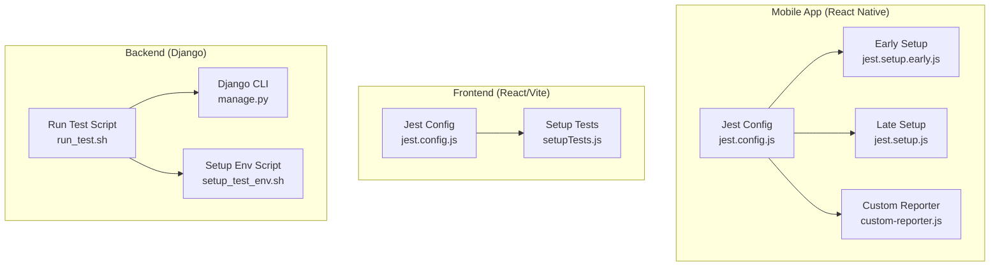
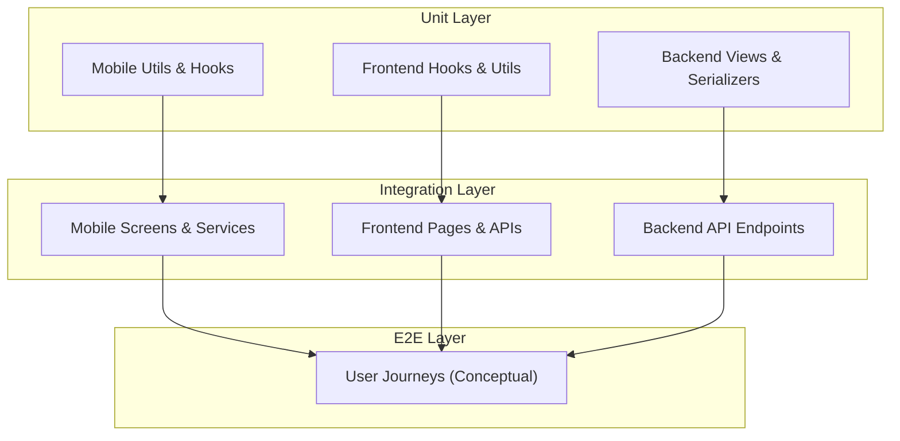
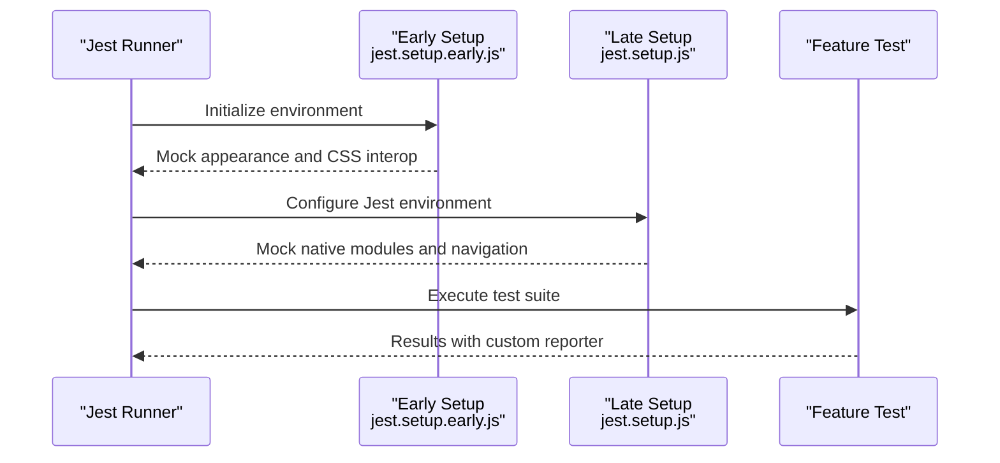
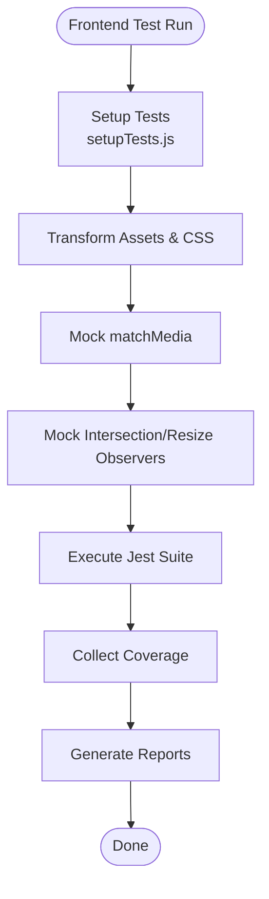
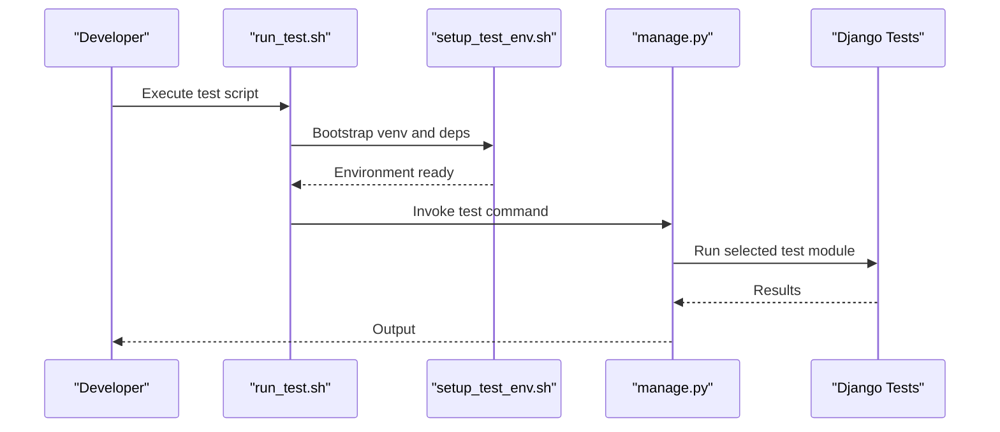
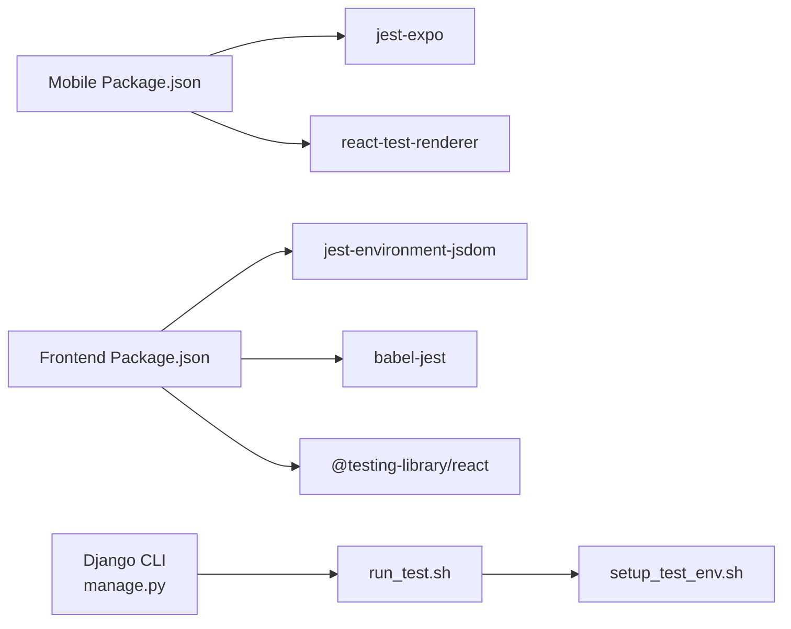

# Testing Strategy & Quality Assurance

<cite>
**Referenced Files in This Document**
- [package.json](file://Estate_link_App/package.json)
- [jest.config.js](file://Estate_link_App/jest.config.js)
- [jest.setup.js](file://Estate_link_App/jest.setup.js)
- [jest.setup.early.js](file://Estate_link_App/jest.setup.early.js)
- [jest.config.passing.js](file://Estate_link_App/jest.config.passing.js)
- [jest.config.clean.js](file://Estate_link_App/jest.config.clean.js)
- [jest.config.minimal.js](file://Estate_link_App/jest.config.minimal.js)
- [jest.config.final.js](file://Estate_link_App/jest.config.final.js)
- [custom-reporter.js](file://Estate_link_App/custom-reporter.js)
- [package.json](file://frontend/package.json)
- [jest.config.js](file://frontend/jest.config.js)
- [setupTests.js](file://frontend/src/setupTests.js)
- [manage.py](file://backend/manage.py)
- [run_test.sh](file://backend/run_test.sh)
- [setup_test_env.sh](file://backend/setup_test_env.sh)
</cite>

## Table of Contents
1. [Introduction](#introduction)
2. [Project Structure](#project-structure)
3. [Core Components](#core-components)
4. [Architecture Overview](#architecture-overview)
5. [Detailed Component Analysis](#detailed-component-analysis)
6. [Dependency Analysis](#dependency-analysis)
7. [Performance Considerations](#performance-considerations)
8. [Troubleshooting Guide](#troubleshooting-guide)
9. [Conclusion](#conclusion)
10. [Appendices](#appendices)

## Introduction
This document defines the testing strategy and quality assurance processes for the Estate Link platform, covering backend, frontend, and mobile applications. It explains how unit, integration, and end-to-end testing are implemented, outlines test configuration and mocking strategies, and documents continuous integration readiness. It also covers best practices, code coverage expectations, quality gates, performance and security testing considerations, accessibility testing, debugging tools, test automation, and release validation processes.

## Project Structure
The repository contains three distinct applications, each with its own testing framework and configuration:
- Mobile application (React Native): Jest with Expo preset, extensive mocking for native modules and CSS interop, and multiple Jest configuration variants for different reporting modes.
- Frontend (React/Vite): Jest with jsdom, CSS and asset transforms, and a dedicated setup for browser-like globals.
- Backend (Django): Python unittest-style tests executed via Django’s test runner and ad-hoc scripts for specialized scenarios.

**Diagram sources**
- [jest.config.js](file://Estate_link_App/jest.config.js#L1-L82)
- [jest.setup.early.js](file://Estate_link_App/jest.setup.early.js#L1-L163)
- [jest.setup.js](file://Estate_link_App/jest.setup.js#L1-L378)
- [custom-reporter.js](file://Estate_link_App/custom-reporter.js#L1-L28)
- [jest.config.js](file://frontend/jest.config.js#L1-L32)
- [setupTests.js](file://frontend/src/setupTests.js#L1-L85)
- [manage.py](file://backend/manage.py#L1-L23)
- [run_test.sh](file://backend/run_test.sh#L1-L15)
- [setup_test_env.sh](file://backend/setup_test_env.sh#L1-L39)

**Section sources**
- [package.json](file://Estate_link_App/package.json#L1-L93)
- [jest.config.js](file://Estate_link_App/jest.config.js#L1-L82)
- [jest.setup.js](file://Estate_link_App/jest.setup.js#L1-L378)
- [jest.setup.early.js](file://Estate_link_App/jest.setup.early.js#L1-L163)
- [jest.config.passing.js](file://Estate_link_App/jest.config.passing.js#L1-L72)
- [jest.config.clean.js](file://Estate_link_App/jest.config.clean.js#L1-L74)
- [jest.config.minimal.js](file://Estate_link_App/jest.config.minimal.js#L1-L75)
- [jest.config.final.js](file://Estate_link_App/jest.config.final.js#L1-L67)
- [custom-reporter.js](file://Estate_link_App/custom-reporter.js#L1-L28)
- [package.json](file://frontend/package.json#L1-L70)
- [jest.config.js](file://frontend/jest.config.js#L1-L32)
- [setupTests.js](file://frontend/src/setupTests.js#L1-L85)
- [manage.py](file://backend/manage.py#L1-L23)
- [run_test.sh](file://backend/run_test.sh#L1-L15)
- [setup_test_env.sh](file://backend/setup_test_env.sh#L1-L39)

## Core Components
- Mobile App Testing
  - Jest configuration with Expo preset and ESM support.
  - Extensive mocking for native modules, fonts, appearance, navigation, and storage.
  - Multiple Jest configs for different reporting modes (passing, clean, minimal, final).
  - Custom reporter for concise output.
- Frontend Testing
  - Jest with jsdom and Babel transform.
  - CSS and asset mocks via moduleNameMapper.
  - Setup for matchMedia, IntersectionObserver, ResizeObserver, and environment variables.
- Backend Testing
  - Django test runner via manage.py.
  - Dedicated scripts to bootstrap a test environment and run focused tests.

**Section sources**
- [package.json](file://Estate_link_App/package.json#L1-L93)
- [jest.config.js](file://Estate_link_App/jest.config.js#L1-L82)
- [jest.setup.js](file://Estate_link_App/jest.setup.js#L1-L378)
- [jest.setup.early.js](file://Estate_link_App/jest.setup.early.js#L1-L163)
- [jest.config.passing.js](file://Estate_link_App/jest.config.passing.js#L1-L72)
- [jest.config.clean.js](file://Estate_link_App/jest.config.clean.js#L1-L74)
- [jest.config.minimal.js](file://Estate_link_App/jest.config.minimal.js#L1-L75)
- [jest.config.final.js](file://Estate_link_App/jest.config.final.js#L1-L67)
- [custom-reporter.js](file://Estate_link_App/custom-reporter.js#L1-L28)
- [package.json](file://frontend/package.json#L1-L70)
- [jest.config.js](file://frontend/jest.config.js#L1-L32)
- [setupTests.js](file://frontend/src/setupTests.js#L1-L85)
- [manage.py](file://backend/manage.py#L1-L23)
- [run_test.sh](file://backend/run_test.sh#L1-L15)
- [setup_test_env.sh](file://backend/setup_test_env.sh#L1-L39)

## Architecture Overview
The testing architecture separates concerns across platforms while sharing common patterns:
- Unit tests focus on pure functions, reducers, and small isolated units.
- Integration tests validate component rendering, navigation, and service interactions.
- End-to-end tests (conceptual) would validate user journeys across the stack.

[No sources needed since this diagram shows conceptual workflow, not actual code structure]

## Detailed Component Analysis

### Mobile App Testing Strategy
- Unit Testing
  - Utilities and hooks are tested independently with minimal mocking.
  - Example targets: device info, photo utilities, auth utilities.
- Integration Testing
  - Feature screens and navigation flows are covered with component tests.
  - Payment flow logic and bulletin logic tests demonstrate integration boundaries.
- End-to-End Testing
  - Not present in the current repository; recommended to adopt Detox or similar for native E2E.

**Diagram sources**
- [jest.setup.early.js](file://Estate_link_App/jest.setup.early.js#L1-L163)
- [jest.setup.js](file://Estate_link_App/jest.setup.js#L1-L378)
- [custom-reporter.js](file://Estate_link_App/custom-reporter.js#L1-L28)

**Section sources**
- [jest.config.js](file://Estate_link_App/jest.config.js#L1-L82)
- [jest.setup.js](file://Estate_link_App/jest.setup.js#L1-L378)
- [jest.setup.early.js](file://Estate_link_App/jest.setup.early.js#L1-L163)
- [custom-reporter.js](file://Estate_link_App/custom-reporter.js#L1-L28)

### Frontend Testing Strategy
- Unit Testing
  - Hooks, utilities, and reducers are unit-tested with DOM assertions.
- Integration Testing
  - Pages and forms are validated for rendering and user interactions.
- End-to-End Testing
  - Not present in the current repository; recommended to adopt Playwright or Cypress for E2E.

**Diagram sources**
- [setupTests.js](file://frontend/src/setupTests.js#L1-L85)
- [jest.config.js](file://frontend/jest.config.js#L1-L32)

**Section sources**
- [jest.config.js](file://frontend/jest.config.js#L1-L32)
- [setupTests.js](file://frontend/src/setupTests.js#L1-L85)

### Backend Testing Strategy
- Unit Testing
  - Individual modules and functions are tested using Django’s test runner.
- Integration Testing
  - API endpoints and model interactions are validated.
- End-to-End Testing
  - Not present in the current repository; recommended to add API-level E2E tests with tools like Postman/Newman or custom Python clients.

**Diagram sources**
- [run_test.sh](file://backend/run_test.sh#L1-L15)
- [setup_test_env.sh](file://backend/setup_test_env.sh#L1-L39)
- [manage.py](file://backend/manage.py#L1-L23)

**Section sources**
- [manage.py](file://backend/manage.py#L1-L23)
- [run_test.sh](file://backend/run_test.sh#L1-L15)
- [setup_test_env.sh](file://backend/setup_test_env.sh#L1-L39)

## Dependency Analysis
- Mobile App
  - Jest preset: jest-expo
  - Test renderer: react-test-renderer
  - Assertion libraries: @testing-library/jest-native, @testing-library/react-native
- Frontend
  - Test renderer: @testing-library/react
  - Environment: jest-environment-jsdom
  - Transforms: babel-jest
- Backend
  - Django test runner
  - Ad-hoc scripts for environment setup and targeted test execution

**Diagram sources**
- [package.json](file://Estate_link_App/package.json#L1-L93)
- [package.json](file://frontend/package.json#L1-L70)
- [manage.py](file://backend/manage.py#L1-L23)
- [run_test.sh](file://backend/run_test.sh#L1-L15)
- [setup_test_env.sh](file://backend/setup_test_env.sh#L1-L39)

**Section sources**
- [package.json](file://Estate_link_App/package.json#L1-L93)
- [package.json](file://frontend/package.json#L1-L70)
- [manage.py](file://backend/manage.py#L1-L23)
- [run_test.sh](file://backend/run_test.sh#L1-L15)
- [setup_test_env.sh](file://backend/setup_test_env.sh#L1-L39)

## Performance Considerations
- Mobile
  - Use minimal Jest configs for CI runs to reduce overhead.
  - Prefer pure logic tests and avoid heavy native interactions in unit tests.
- Frontend
  - Limit DOM-heavy tests; favor unit tests for logic and integration tests for component composition.
- Backend
  - Keep tests fast by using in-memory databases and avoiding external services when possible.

[No sources needed since this section provides general guidance]

## Troubleshooting Guide
- Mobile
  - CSS Interop Issues: Early setup mocks NativeWind and CSS interop modules to prevent failures.
  - Test Exclusions: Specific test paths are ignored due to CSS interop conflicts.
  - Custom Reporter: Provides concise pass-through output for CI-friendly logs.
- Frontend
  - Missing Globals: setupTests.js adds TextEncoder/Decoder, matchMedia, IntersectionObserver, and ResizeObserver.
  - Environment Variables: import.meta.env is mocked for Vite variables.
- Backend
  - Environment Setup: setup_test_env.sh creates and activates a virtual environment and installs dependencies.
  - Test Execution: run_test.sh activates the environment and executes a specific test module.

**Section sources**
- [jest.setup.early.js](file://Estate_link_App/jest.setup.early.js#L1-L163)
- [jest.config.js](file://Estate_link_App/jest.config.js#L11-L40)
- [custom-reporter.js](file://Estate_link_App/custom-reporter.js#L1-L28)
- [setupTests.js](file://frontend/src/setupTests.js#L1-L85)
- [setup_test_env.sh](file://backend/setup_test_env.sh#L1-L39)
- [run_test.sh](file://backend/run_test.sh#L1-L15)

## Conclusion
The Estate Link project implements a robust, multi-layered testing strategy tailored to each platform. The mobile app leverages Jest with extensive mocking and multiple configuration variants for flexible execution. The frontend uses jsdom with targeted mocks for browser APIs. The backend relies on Django’s test runner and focused scripts for specialized scenarios. To further strengthen the pipeline, consider adding E2E tests for both mobile and web, integrating code coverage reporting, and establishing quality gates in CI.

[No sources needed since this section summarizes without analyzing specific files]

## Appendices

### Testing Pyramid Implementation
- Unit Testing
  - Mobile: Logic and hooks tests with minimal dependencies.
  - Frontend: Hooks and utilities tests with DOM assertions.
  - Backend: Model and serializer logic tests.
- Integration Testing
  - Mobile: Feature screen tests and service interactions.
  - Frontend: Page-level tests and API integrations.
  - Backend: Endpoint tests and view logic.
- End-to-End Testing
  - Recommended for user flows across the stack.

[No sources needed since this section provides general guidance]

### Test Configuration and Mocking Strategies
- Mobile
  - NativeWind and CSS interop disabled via early mocks.
  - React Native and navigation modules mocked for deterministic behavior.
  - Custom reporter for CI-friendly summaries.
- Frontend
  - CSS and assets mocked via moduleNameMapper.
  - Browser APIs (matchMedia, IntersectionObserver, ResizeObserver) mocked.
  - Environment variables mocked for Vite.
- Backend
  - Django test runner with ad-hoc scripts for environment bootstrapping.

**Section sources**
- [jest.setup.early.js](file://Estate_link_App/jest.setup.early.js#L1-L163)
- [jest.setup.js](file://Estate_link_App/jest.setup.js#L1-L378)
- [custom-reporter.js](file://Estate_link_App/custom-reporter.js#L1-L28)
- [jest.config.js](file://frontend/jest.config.js#L28-L31)
- [setupTests.js](file://frontend/src/setupTests.js#L1-L85)
- [run_test.sh](file://backend/run_test.sh#L1-L15)
- [setup_test_env.sh](file://backend/setup_test_env.sh#L1-L39)

### Continuous Integration Setup
- Mobile
  - Use jest.config.clean.js or jest.config.minimal.js for CI runs to reduce noise.
  - Collect coverage and publish reports.
- Frontend
  - Use jest.config.js with coverage reporters configured.
- Backend
  - Execute run_test.sh to bootstrap and run targeted tests.

**Section sources**
- [jest.config.clean.js](file://Estate_link_App/jest.config.clean.js#L1-L74)
- [jest.config.minimal.js](file://Estate_link_App/jest.config.minimal.js#L1-L75)
- [jest.config.js](file://frontend/jest.config.js#L18-L19)
- [run_test.sh](file://backend/run_test.sh#L1-L15)

### Code Coverage Requirements and Quality Gates
- Coverage Collection
  - Mobile: collectCoverageFrom configured for src.
  - Frontend: collectCoverageFrom excludes main entry and type definitions.
- Quality Gates
  - Enforce minimum thresholds in CI (e.g., branch and line coverage).
  - Fail builds on coverage regression or failing tests.

**Section sources**
- [jest.config.js](file://Estate_link_App/jest.config.js#L47-L51)
- [jest.config.js](file://frontend/jest.config.js#L12-L17)

### Performance Testing, Security Testing, Accessibility Testing
- Performance Testing
  - Mobile: Prefer unit tests for performance-sensitive logic; measure render times in integration tests.
  - Frontend: Use jsdom performance metrics; avoid heavy DOM in unit tests.
  - Backend: Profile endpoint performance and use in-memory DB for tests.
- Security Testing
  - Validate input sanitization and permission checks in backend tests.
  - Audit client-side secrets and API keys exposure.
- Accessibility Testing
  - Use @testing-library/react to assert semantic markup and ARIA attributes.
  - Add axe-core or similar in E2E suites when introduced.

[No sources needed since this section provides general guidance]

### Debugging Tools, Test Automation, Release Validation
- Debugging Tools
  - Mobile: jest --watch, verbose flags, and custom reporter for quick feedback.
  - Frontend: jest --watch, jsdom environment, and setupTests.js for environment parity.
  - Backend: run_test.sh for quick iteration on specific modules.
- Test Automation
  - Integrate scripts into CI to run tests on pull requests and main branch.
- Release Validation
  - Gate releases on passing tests and coverage thresholds.
  - Perform smoke tests on staging environments before production deployment.

**Section sources**
- [package.json](file://Estate_link_App/package.json#L4-L20)
- [jest.config.js](file://frontend/jest.config.js#L11-L13)
- [run_test.sh](file://backend/run_test.sh#L1-L15)