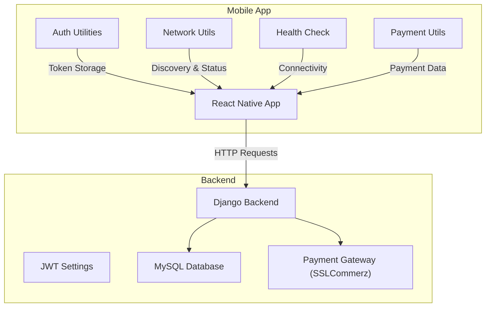
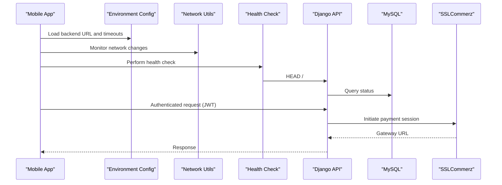
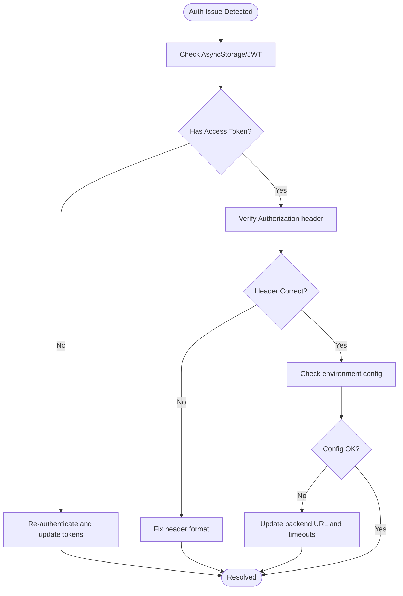
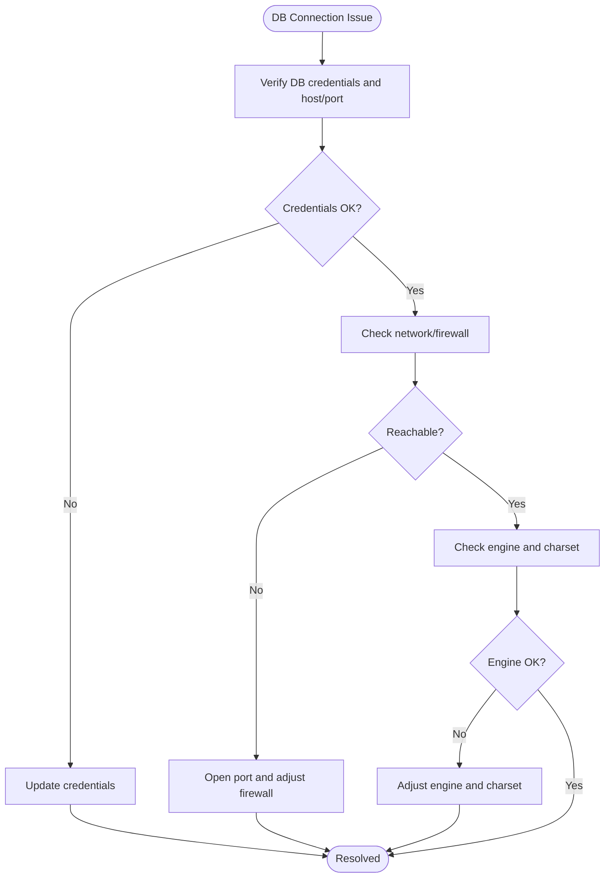
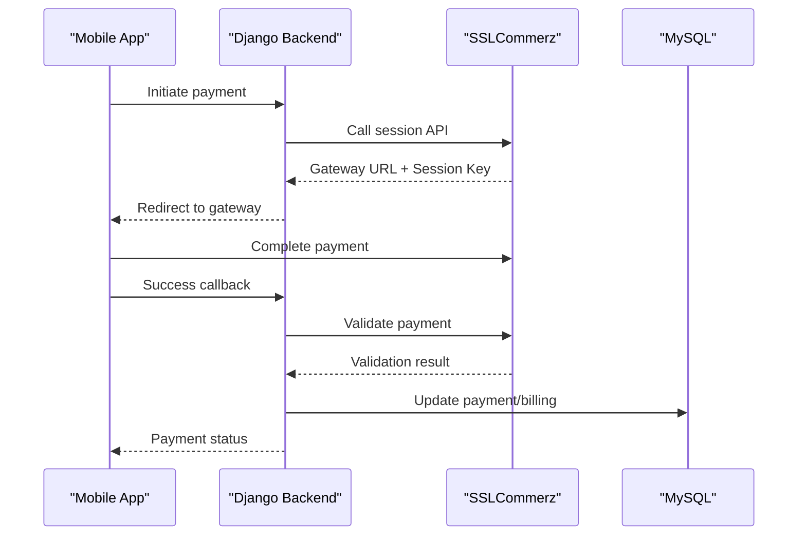
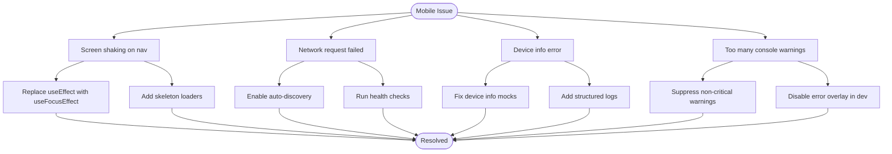
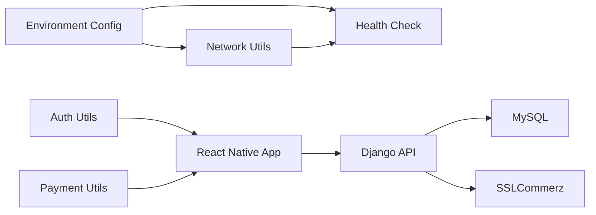

# Troubleshooting & FAQ

<cite>
**Referenced Files in This Document**
- [authUtils.ts](file://Estate_link_App/src/utils/authUtils.ts)
- [environment.ts](file://Estate_link_App/src/config/environment.ts)
- [test-connection.js](file://Estate_link_App/scripts/test-connection.js)
- [test-device-info.js](file://Estate_link_App/scripts/test-device-info.js)
- [NETWORK_CHANGE_SOLUTION.md](file://Estate_link_App/NETWORK_CHANGE_SOLUTION.md)
- [SCREEN_SHAKING_FIX.md](file://Estate_link_App/SCREEN_SHAKING_FIX.md)
- [paymentUtils.ts](file://Estate_link_App/src/utils/paymentUtils.ts)
- [sslcommerz_utils.py](file://backend/service_fee_management/utils/sslcommerz_utils.py)
- [settings.py](file://backend/backend/settings.py)
- [errors.py](file://backend/backend/utils/errors.py)
- [healthCheck.ts](file://Estate_link_App/src/utils/healthCheck.ts)
- [testBackendConnection.ts](file://Estate_link_App/src/utils/testBackendConnection.ts)
- [networkUtils.ts](file://Estate_link_App/src/utils/networkUtils.ts)
- [App.tsx](file://Estate_link_App/App.tsx)
- [test_payment_system.py](file://backend/service_fee_management/tests/test_payment_system.py)
</cite>

## Table of Contents
1. [Introduction](#introduction)
2. [Project Structure](#project-structure)
3. [Core Components](#core-components)
4. [Architecture Overview](#architecture-overview)
5. [Detailed Component Analysis](#detailed-component-analysis)
6. [Dependency Analysis](#dependency-analysis)
7. [Performance Considerations](#performance-considerations)
8. [Troubleshooting Guide](#troubleshooting-guide)
9. [FAQ](#faq)
10. [Conclusion](#conclusion)
11. [Appendices](#appendices)

## Introduction
This document provides comprehensive troubleshooting guidance and frequently asked questions for the Estate Link platform. It covers issues across the React Native mobile app, Django backend, and payment processing pipeline. You will find step-by-step resolutions for database connectivity, authentication failures, payment processing issues, and mobile-specific problems. It also includes debugging techniques, log analysis approaches, diagnostics, performance tips, and escalation procedures.

## Project Structure
The platform consists of:
- React Native mobile app with authentication, network handling, payment utilities, and health checks
- Django backend with JWT authentication, CORS, MySQL database, and payment gateway integration
- Payment system integrating with SSLCommerz for service fee payments

**Diagram sources**
- [App.tsx](file://Estate_link_App/App.tsx#L53-L114)
- [authUtils.ts](file://Estate_link_App/src/utils/authUtils.ts#L1-L219)
- [networkUtils.ts](file://Estate_link_App/src/utils/networkUtils.ts#L228-L269)
- [healthCheck.ts](file://Estate_link_App/src/utils/healthCheck.ts#L1-L199)
- [paymentUtils.ts](file://Estate_link_App/src/utils/paymentUtils.ts#L1-L328)
- [settings.py](file://backend/backend/settings.py#L169-L286)
- [sslcommerz_utils.py](file://backend/service_fee_management/utils/sslcommerz_utils.py#L20-L336)

**Section sources**
- [App.tsx](file://Estate_link_App/App.tsx#L53-L114)
- [environment.ts](file://Estate_link_App/src/config/environment.ts#L1-L84)
- [settings.py](file://backend/backend/settings.py#L169-L286)

## Core Components
- Authentication utilities: token retrieval, refresh, headers, and secure storage
- Environment configuration: backend URL, timeouts, retries, and discovery
- Network handling: automatic discovery, status monitoring, and error messaging
- Health checks: connectivity verification and rediscovery
- Payment utilities: ID parsing, validation, and summary generation
- Backend settings: JWT, CORS, MySQL, and SSLCommerz configuration
- Payment gateway integration: SSLCommerz initialization, validation, and hash verification

**Section sources**
- [authUtils.ts](file://Estate_link_App/src/utils/authUtils.ts#L1-L219)
- [environment.ts](file://Estate_link_App/src/config/environment.ts#L1-L84)
- [networkUtils.ts](file://Estate_link_App/src/utils/networkUtils.ts#L228-L269)
- [healthCheck.ts](file://Estate_link_App/src/utils/healthCheck.ts#L1-L199)
- [paymentUtils.ts](file://Estate_link_App/src/utils/paymentUtils.ts#L1-L328)
- [settings.py](file://backend/backend/settings.py#L169-L286)
- [sslcommerz_utils.py](file://backend/service_fee_management/utils/sslcommerz_utils.py#L20-L336)

## Architecture Overview
The mobile app communicates with the Django backend using HTTP requests with JWT Authorization. The backend connects to MySQL and integrates with SSLCommerz for payment processing. Network discovery and health checks ensure resilience across changing networks.

**Diagram sources**
- [environment.ts](file://Estate_link_App/src/config/environment.ts#L1-L84)
- [networkUtils.ts](file://Estate_link_App/src/utils/networkUtils.ts#L228-L269)
- [healthCheck.ts](file://Estate_link_App/src/utils/healthCheck.ts#L1-L199)
- [settings.py](file://backend/backend/settings.py#L169-L286)
- [sslcommerz_utils.py](file://backend/service_fee_management/utils/sslcommerz_utils.py#L52-L163)

## Detailed Component Analysis

### Authentication Troubleshooting
Common issues:
- Missing or expired tokens
- Token parsing errors
- Incorrect Authorization header format
- Secure storage failures

Resolution steps:
1. Verify token retrieval from storage and parsing logic
2. Confirm Authorization header construction
3. Check environment configuration for correct backend URL
4. Clear stored tokens and re-authenticate if necessary

**Diagram sources**
- [authUtils.ts](file://Estate_link_App/src/utils/authUtils.ts#L1-L219)
- [environment.ts](file://Estate_link_App/src/config/environment.ts#L1-L84)

**Section sources**
- [authUtils.ts](file://Estate_link_App/src/utils/authUtils.ts#L1-L219)
- [environment.ts](file://Estate_link_App/src/config/environment.ts#L1-L84)

### Database Connectivity Troubleshooting
Common issues:
- Wrong credentials or host/port
- Network restrictions or firewall
- Database engine misconfiguration
- Connection pooling issues

Resolution steps:
1. Verify MySQL credentials and host/port in backend settings
2. Ensure the database is reachable from the backend server
3. Check charset and SQL mode settings
4. Confirm connection pooling and retry configurations

**Diagram sources**
- [settings.py](file://backend/backend/settings.py#L169-L286)

**Section sources**
- [settings.py](file://backend/backend/settings.py#L169-L286)

### Payment Processing Troubleshooting
Common issues:
- SSLCommerz initialization failures
- Validation errors or amount mismatches
- Hash verification failures
- Payment amount validation errors

Resolution steps:
1. Confirm SSLCommerz sandbox/prod configuration
2. Validate transaction ID and amount consistency
3. Verify hash verification logic
4. Check payment amount and selected months validation

**Diagram sources**
- [sslcommerz_utils.py](file://backend/service_fee_management/utils/sslcommerz_utils.py#L52-L266)
- [paymentUtils.ts](file://Estate_link_App/src/utils/paymentUtils.ts#L180-L230)
- [test_payment_system.py](file://backend/service_fee_management/tests/test_payment_system.py#L205-L314)

**Section sources**
- [sslcommerz_utils.py](file://backend/service_fee_management/utils/sslcommerz_utils.py#L52-L266)
- [paymentUtils.ts](file://Estate_link_App/src/utils/paymentUtils.ts#L180-L230)
- [test_payment_system.py](file://backend/service_fee_management/tests/test_payment_system.py#L205-L314)

### Mobile-Specific Troubleshooting
Common issues:
- Screen shaking during tab navigation
- Network request failures across networks
- Device info detection problems
- Excessive console warnings

Resolution steps:
1. Use focus-aware data fetching to avoid repeated renders
2. Implement automatic network discovery and health checks
3. Validate device info utilities and mocks
4. Suppress non-critical warnings while keeping actionable logs

**Diagram sources**
- [SCREEN_SHAKING_FIX.md](file://Estate_link_App/SCREEN_SHAKING_FIX.md#L1-L162)
- [NETWORK_CHANGE_SOLUTION.md](file://Estate_link_App/NETWORK_CHANGE_SOLUTION.md#L1-L244)
- [test-device-info.js](file://Estate_link_App/scripts/test-device-info.js#L1-L77)
- [App.tsx](file://Estate_link_App/App.tsx#L53-L114)

**Section sources**
- [SCREEN_SHAKING_FIX.md](file://Estate_link_App/SCREEN_SHAKING_FIX.md#L1-L162)
- [NETWORK_CHANGE_SOLUTION.md](file://Estate_link_App/NETWORK_CHANGE_SOLUTION.md#L1-L244)
- [test-device-info.js](file://Estate_link_App/scripts/test-device-info.js#L1-L77)
- [App.tsx](file://Estate_link_App/App.tsx#L53-L114)

## Dependency Analysis
- Mobile app depends on environment configuration for backend URL and timeouts
- Network utilities depend on environment and device info
- Health checks depend on network utilities and environment
- Payment utilities depend on mobile data structures and backend endpoints
- Backend depends on MySQL and SSLCommerz SDKs

**Diagram sources**
- [environment.ts](file://Estate_link_App/src/config/environment.ts#L1-L84)
- [networkUtils.ts](file://Estate_link_App/src/utils/networkUtils.ts#L228-L269)
- [healthCheck.ts](file://Estate_link_App/src/utils/healthCheck.ts#L1-L199)
- [authUtils.ts](file://Estate_link_App/src/utils/authUtils.ts#L1-L219)
- [paymentUtils.ts](file://Estate_link_App/src/utils/paymentUtils.ts#L1-L328)
- [settings.py](file://backend/backend/settings.py#L169-L286)
- [sslcommerz_utils.py](file://backend/service_fee_management/utils/sslcommerz_utils.py#L20-L336)

**Section sources**
- [environment.ts](file://Estate_link_App/src/config/environment.ts#L1-L84)
- [networkUtils.ts](file://Estate_link_App/src/utils/networkUtils.ts#L228-L269)
- [healthCheck.ts](file://Estate_link_App/src/utils/healthCheck.ts#L1-L199)
- [authUtils.ts](file://Estate_link_App/src/utils/authUtils.ts#L1-L219)
- [paymentUtils.ts](file://Estate_link_App/src/utils/paymentUtils.ts#L1-L328)
- [settings.py](file://backend/backend/settings.py#L169-L286)
- [sslcommerz_utils.py](file://backend/service_fee_management/utils/sslcommerz_utils.py#L20-L336)

## Performance Considerations
- Use skeleton loaders to stabilize layouts and reduce layout shifts
- Prefer useFocusEffect for data fetching to avoid redundant loads
- Implement connection pooling and retry strategies for external APIs
- Optimize payment amount validation and sorting to minimize computation
- Monitor network status intervals and tune discovery frequency

[No sources needed since this section provides general guidance]

## Troubleshooting Guide

### Database Connection Problems
Steps:
1. Confirm backend settings for host, port, user, and password
2. Verify MySQL is running and accepting connections
3. Check charset and SQL mode compatibility
4. Review connection pooling and retry settings

**Section sources**
- [settings.py](file://backend/backend/settings.py#L169-L286)

### Authentication Failures
Steps:
1. Check token retrieval and parsing
2. Verify Authorization header format
3. Confirm JWT settings and expiration
4. Clear stored tokens and re-authenticate

**Section sources**
- [authUtils.ts](file://Estate_link_App/src/utils/authUtils.ts#L1-L219)
- [settings.py](file://backend/backend/settings.py#L94-L138)

### Payment Processing Issues
Steps:
1. Validate SSLCommerz configuration (sandbox/prod)
2. Check transaction ID and amount consistency
3. Verify hash verification
4. Ensure payment amount does not exceed selected months total

**Section sources**
- [sslcommerz_utils.py](file://backend/service_fee_management/utils/sslcommerz_utils.py#L52-L266)
- [paymentUtils.ts](file://Estate_link_App/src/utils/paymentUtils.ts#L180-L230)

### Mobile-Specific Problems
Steps:
1. Replace useEffect with useFocusEffect for data fetching
2. Add skeleton loaders for stable layouts
3. Enable automatic network discovery and health checks
4. Suppress non-critical warnings in development

**Section sources**
- [SCREEN_SHAKING_FIX.md](file://Estate_link_App/SCREEN_SHAKING_FIX.md#L1-L162)
- [NETWORK_CHANGE_SOLUTION.md](file://Estate_link_App/NETWORK_CHANGE_SOLUTION.md#L1-L244)
- [App.tsx](file://Estate_link_App/App.tsx#L53-L114)

### Debugging Techniques and Log Analysis
- Use health checks to detect connectivity and rediscovery
- Run backend connection tests with authentication
- Inspect network status and error messages
- Flatten DRF error messages for user-friendly reporting

**Section sources**
- [healthCheck.ts](file://Estate_link_App/src/utils/healthCheck.ts#L1-L199)
- [testBackendConnection.ts](file://Estate_link_App/src/utils/testBackendConnection.ts#L1-L208)
- [networkUtils.ts](file://Estate_link_App/src/utils/networkUtils.ts#L228-L269)
- [errors.py](file://backend/backend/utils/errors.py#L1-L16)

### Diagnostic Tools
- Network discovery and status indicator
- Device info utility tests
- Backend connection tester
- Automated payment system tests

**Section sources**
- [NETWORK_CHANGE_SOLUTION.md](file://Estate_link_App/NETWORK_CHANGE_SOLUTION.md#L1-L244)
- [test-device-info.js](file://Estate_link_App/scripts/test-device-info.js#L1-L77)
- [test-connection.js](file://Estate_link_App/scripts/test-connection.js#L1-L45)
- [test_payment_system.py](file://backend/service_fee_management/tests/test_payment_system.py#L1-L612)

### Performance Issues, Memory Leaks, and Optimization Strategies
- Minimize unnecessary re-renders by focusing on visibility
- Use skeleton loaders to prevent layout thrashing
- Tune network check intervals and discovery timeouts
- Optimize payment data processing and sorting

**Section sources**
- [SCREEN_SHAKING_FIX.md](file://Estate_link_App/SCREEN_SHAKING_FIX.md#L1-L162)
- [environment.ts](file://Estate_link_App/src/config/environment.ts#L1-L84)

## FAQ

### Setup Problems
Q: How do I configure the backend URL for my environment?
A: Update the environment configuration with your backend URL and adjust timeouts and retry attempts accordingly.

**Section sources**
- [environment.ts](file://Estate_link_App/src/config/environment.ts#L1-L84)

Q: How do I test backend connectivity from the command line?
A: Use the provided connection test script to probe common backend endpoints and IP addresses.

**Section sources**
- [test-connection.js](file://Estate_link_App/scripts/test-connection.js#L1-L45)

### Configuration Issues
Q: How do I enable automatic network discovery?
A: Ensure auto-discovery is enabled in environment settings and use the network status indicator component.

**Section sources**
- [environment.ts](file://Estate_link_App/src/config/environment.ts#L1-L84)
- [NETWORK_CHANGE_SOLUTION.md](file://Estate_link_App/NETWORK_CHANGE_SOLUTION.md#L1-L244)

Q: How do I configure SSLCommerz for payments?
A: Set store ID, password, sandbox flag, and API endpoints in backend settings.

**Section sources**
- [settings.py](file://backend/backend/settings.py#L271-L280)

### User-Reported Bugs
Q: Why does the screen shake when switching tabs?
A: Replace useEffect with useFocusEffect and add skeleton loaders to stabilize layouts.

**Section sources**
- [SCREEN_SHAKING_FIX.md](file://Estate_link_App/SCREEN_SHAKING_FIX.md#L1-L162)

Q: Why do I see “Network request failed” errors?
A: Enable automatic network discovery and run health checks to rediscover the backend server.

**Section sources**
- [NETWORK_CHANGE_SOLUTION.md](file://Estate_link_App/NETWORK_CHANGE_SOLUTION.md#L1-L244)
- [healthCheck.ts](file://Estate_link_App/src/utils/healthCheck.ts#L1-L199)

### Escalation Procedures and Support Resources
- Use health checks and backend connection testers to gather diagnostics
- Review flattened error messages for actionable insights
- Consult payment system tests for expected behavior
- Engage backend team for database and gateway issues

**Section sources**
- [healthCheck.ts](file://Estate_link_App/src/utils/healthCheck.ts#L1-L199)
- [errors.py](file://backend/backend/utils/errors.py#L1-L16)
- [test_payment_system.py](file://backend/service_fee_management/tests/test_payment_system.py#L1-L612)

## Conclusion
This guide consolidates troubleshooting workflows, diagnostics, and resolutions for the Estate Link platform. By following the step-by-step procedures and leveraging the provided tools and scripts, most issues can be identified and resolved quickly. For persistent problems, use health checks, backend connection tests, and payment system validations to gather evidence and escalate effectively.

## Appendices

### Quick Reference: Common Commands and Scripts
- Network discovery and status: [NETWORK_CHANGE_SOLUTION.md](file://Estate_link_App/NETWORK_CHANGE_SOLUTION.md#L1-L244)
- Device info tests: [test-device-info.js](file://Estate_link_App/scripts/test-device-info.js#L1-L77)
- Backend connectivity tests: [test-connection.js](file://Estate_link_App/scripts/test-connection.js#L1-L45)
- Payment system tests: [test_payment_system.py](file://backend/service_fee_management/tests/test_payment_system.py#L1-L612)